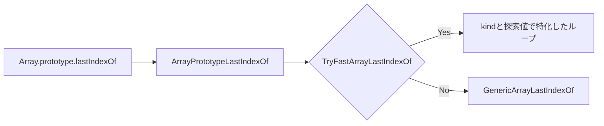
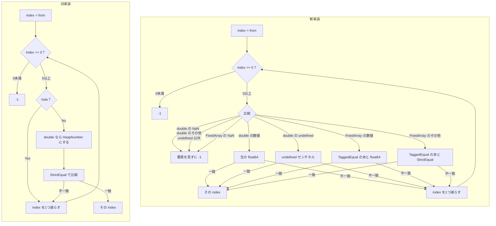
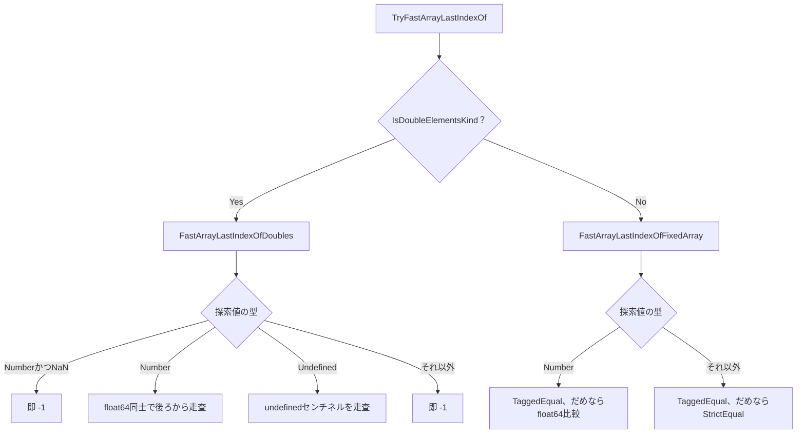

## はじめに

:::message
修正や追加等はコメントまたはGitHubで編集リクエストをお待ちしております。
:::

ダイニーで一番若いエンジニアのriya amemiya(21歳)です。
今回は `Array.prototype.lastIndexOf`（以下 `lastIndexOf`）を、ElementsKindと探索値の型で分けて高速化しました。

パッチはこちらです。

https://chromium-review.googlesource.com/c/v8/v8/+/8255963

よければ他のArray系メソッド高速化の記事もご覧ください。

https://zenn.dev/dinii/articles/675d47a6c21c83
https://zenn.dev/dinii/articles/e12fbacc8e761c
https://zenn.dev/dinii/articles/a272b7c3b60ab8

## TL;DR

- 従来のdouble経路は、要素を1個ずつHeapNumberに詰めてから `StrictEqual` していた
- 新実装はElementsKindと探索値の型でループを分け、生の `float64` 同士を比較する
- double配列に数値以外（文字列など）や `NaN` を探すと、仕様上ヒットし得ないので即 `-1` を返す
- d8実測では、double配列への非数値探索が最大約26000倍、数値の全走査は約2.4〜3.1倍

## lastIndexOfの仕様を理解する

`lastIndexOf(searchElement, fromIndex)` は、配列を後ろから見て、最初に `searchElement` と `===` で等しい要素のインデックスを返します。見つからなければ `-1` を返します。

```js
[1, 2, 3, 2].lastIndexOf(2);
// => 3

[1, 2, 3, 2].lastIndexOf(2, -2);
// => 1

[1, 2, 3, 2].lastIndexOf(4);
// => -1
```

第2引数 `fromIndex` は省略でき、その場合は末尾から探します。

詳細な仕様はこちらです。

https://tc39.es/ecma262/#sec-array.prototype.lastindexof

仕様上比較は `===`（Strict Equality）なので、 `NaN` が入力された場合は `NaN === NaN` がfalseなので、なんの処理も行わずに `-1` を返す事ができます。

## 呼び出し経路

V8の `lastIndexOf` はTorqueのJS builtin `ArrayPrototypeLastIndexOf` から入ります。

1. `this` をオブジェクト化し、`length` と `fromIndex` を仕様どおりに正規化する
2. Fast JSArrayなら `TryFastArrayLastIndexOf` を試す
3. 無理だったら `HasProperty`/`Get`/`StrictEqual` の `GenericArrayLastIndexOf` へ

```torque
try {
  return TryFastArrayLastIndexOf(context, object, searchElement, from)
      otherwise Baseline;
} label Baseline {
  return GenericArrayLastIndexOf(context, object, searchElement, from);
}
```

今回触ったのは、このfast pathの中身です。



## 従来の実装

パッチ前のfast pathは、Smi/objectもdoubleも、同じジェネリックなループでした。

```torque
// パッチ前（要約）
while (k >= 0) {
  try {
    const element: JSAny = LoadWithHoleCheck<Elements>(elements, k)
        otherwise Hole;
    const same: Boolean = StrictEqual(searchElement, element);
    if (same == True) return k;
  } label Hole {}
  --k;
}
```

holeは飛ばし、残った要素をすべて `StrictEqual` に渡します。どんな配列でも正しく動きます。

ただしdouble配列では、`LoadWithHoleCheck<FixedDoubleArray>` が毎回こうしていました。

```torque
const element: float64 =
    elements.values[index].Value() otherwise IfUndefined, IfHole;
return AllocateHeapNumberWithValue(element);
```

backing store上の生の `float64` を、比較のたびにHeapNumberへ詰めて、そのHeapNumberに対して `StrictEqual` します。
100万要素を走査すれば、最大100万回の割り当てが起きます。
コミットメッセージにあるとおり、packed-doubleの走査はO(n)の割り当てと間接比較するコストがかかっていました。

Smi配列でも、探索値が `1.5` のようなHeapNumberだと、ビットが同じかを見るだけでは足りず、毎回 `StrictEqual` が走っていました。

新旧の流れを並べると次のようになります。



## 新実装の方針

パッチ後は、配列のElementsKindで大きく2つに分け、さらに探索値の型でループを切り替えます。

| 配列 | 探索値 | 新しい処理 |
| --- | --- | --- |
| `FixedDoubleArray` | 数値（`NaN` 以外） | 生の `float64` 同士を比較する |
| `FixedDoubleArray` | `NaN` | 仕様上ヒットしないので即 `-1` |
| `FixedDoubleArray` | `undefined` | undefinedセンチネルだけを探す |
| `FixedDoubleArray` | それ以外（文字列など） | ヒットし得ないので即 `-1` |
| `FixedArray`（Smi / object） | 数値 | `TaggedEqual` のあと、必要なら `float64` 比較 |
| `FixedArray`（Smi / object） | それ以外 | `TaggedEqual` のあと、必要なら `StrictEqual` |



### double配列ではHeapNumberを作らない

`FixedDoubleArray` の中身は、もともとIEEE 754のdoubleです。
HeapNumberにする必要はありません。
探索値を1回だけ `float64` にし、あとは密なループで生の値を比較します。

```torque
macro LastIndexOfDoubleValue(
    elements: FixedDoubleArray, from: Smi, searchNum: float64): Smi {
  let k: Smi = from;
  while (k >= 0) {
    try {
      const element: float64 = elements.values[k].Value() otherwise IfUndefined,
                     IfHole;
      if (element == searchNum) return k;
    } label IfUndefined {
      // Fallthrough.
    } label IfHole {
      // Fallthrough.
    }
    --k;
  }
  return -1;
}
```

holeと、`V8_ENABLE_UNDEFINED_DOUBLE` 時のundefinedセンチネルは、`Value()` が失敗するのでそのまま飛ばします。仕様どおりです。

`NaN === NaN` はfalseなので、探索値が `NaN` ならループするまでもなく `-1` です。

```torque
const searchNum: float64 = Convert<float64>(search);
if (Float64IsNaN(searchNum)) return -1;
return LastIndexOfDoubleValue(elements, k, searchNum);
```

double配列に入るのは数値とhole、環境によっては `undefined` だけです。文字列やオブジェクト、`true` は型レベルで入りません。探索値がそれらなら、走査せず `-1` を返します。

```torque
case (JSAny): {
  return -1;
}
```

旧実装は「ヒットしない」と分かっている入力でも、必ず比較していました。
新しい実装では、探索値が数値でない場合は即 `-1` を返すので、桁違いの速度で値を返却できます。

`undefined` だけは別です。double配列にもundefinedセンチネルとして入り得るので、専用ループで探します。

### FixedArrayはTaggedEqualを先に見る

Smi配列やobject配列は、値がtaggedポインタとして並びます。同じSmi同士、同じオブジェクト同士なら、ビット比較で足ります。

```torque
if (TaggedEqual(element, search)) return k;
typeswitch (element) {
  case (n: Number): {
    if (searchNum == Convert<float64>(n)) return k;
  }
  case (JSAny | TheHole): {
    // Fallthrough.
  }
}
```

Smiの `1` を探すなら、ほとんどの要素は `TaggedEqual` でヒットするので、速いです。
`1` と `1.0`（HeapNumber）のように表現が違う数値だけ、`float64` にして比較します。

holeは `TheHole` というシングルトンで、ユーザーが渡した探索値にはなり得ません。
先にholeだけ除外する分岐をやめ、`TaggedEqual` に任せる形にしました。
holeは比較に失敗して次へ進むだけです。

object配列で文字列を探す経路は、結局 `StrictEqual` が必要なので、旧実装とほぼ同じ速さです。後述の計測でも横ばいです。

### FastJSArrayForReadに広げる

`lastIndexOf` は配列を書き換えません。そのため、旧実装は `FastJSArray` でしたが、`FastJSArrayForRead` に変更しました。
`fromIndex` の評価中にユーザーコードが走ると、配列の長さが変わり得ます。
古いコードと同じく、backing storeの長さへクランプしてから読みます。
はみ出した分はholeとして無視します。

```torque
// Bug(898785): Due to side-effects in the evaluation of `fromIndex`
// the {from} can be out-of-bounds here, so we need to clamp {k} to
// the {elements} length.
```

## ベンチマーク

### 測定条件

構成はarm64.releaseです。同一base上で `array-lastindexof.tq` だけをパッチ前に差し替えて増分ビルドし、差し替え前後を比べています。

- 配列長N=100000
- ウォームアップ5回のあと、8ラウンドのbest-of
- `before` が特化前、`after` が特化後

### 結果

| ケース | before | after | 速度比 |
| --- | ---: | ---: | ---: |
| packed smi miss `-1` | 0.0762 ms/op | 0.0574 ms/op | 約1.3x |
| packed smi miss `1.5` | 0.1275 ms/op | 0.0567 ms/op | 約2.3x |
| packed smi miss `'x'` | 0.1017 ms/op | 0.0756 ms/op | 約1.3x |
| packed smi hit start | 0.0765 ms/op | 0.0575 ms/op | 約1.3x |
| packed double miss `-1.25` | 0.1421 ms/op | 0.0565 ms/op | 約2.5x |
| packed double miss `'x'` | 0.1544 ms/op | 0.000006 ms/op | 約26000x |
| packed double miss `NaN` | 0.1439 ms/op | 0.000007 ms/op | 約21000x |
| packed double miss `undefined` | 0.1696 ms/op | 0.0526 ms/op | 約3.2x |
| packed double hit start | 0.1797 ms/op | 0.0580 ms/op | 約3.1x |
| packed object miss | 0.1278 ms/op | 0.1267 ms/op | 約1.0x |
| holey smi miss `-1` | 0.0764 ms/op | 0.0561 ms/op | 約1.4x |
| holey double miss `-1.25` | 0.1595 ms/op | 0.0560 ms/op | 約2.8x |
| holey double miss `'x'` | 0.1535 ms/op | 0.000006 ms/op | 約26000x |

数値の全走査は、HeapNumberの作成と `StrictEqual` が消えたぶん約2.5〜3倍です。
文字列や `NaN` をdouble配列に探すケースは、旧実装がO(n)の割り当てにコストがかかっていたのに対し、新実装は型を見て即 `-1` を返すので桁違いに速くなります。
packed objectは `StrictEqual` が残るので、controlどおり動きません。

:::message
計測環境やマシンのウォームアップ状態によって誤差があります。あくまで個人のPCで計測した一例です。
:::

:::details d8で実行した計測コード

```js
const N = 100000;
let sink;

function packedSmi() {
  const a = [];
  for (let i = 0; i < N; i++) a[i] = i;
  return a;
}
function packedDbl() {
  const a = [];
  for (let i = 0; i < N; i++) a[i] = i + 0.5;
  return a;
}
function packedObj() {
  const a = [];
  for (let i = 0; i < N; i++) a[i] = "x" + i;
  return a;
}
function holeySmi() {
  const a = new Array(N);
  for (let i = 0; i < N; i++) a[i] = i;
  return a;
}
function holeyDbl() {
  const a = new Array(N);
  for (let i = 0; i < N; i++) a[i] = i + 0.5;
  return a;
}

function bench(label, make, run, iters) {
  for (let i = 0; i < 5; i++) {
    const a = make();
    sink = run(a);
  }
  let best = Infinity;
  for (let r = 0; r < 8; r++) {
    const a = make();
    const t0 = performance.now();
    for (let i = 0; i < iters; i++) sink = run(a);
    const t1 = performance.now();
    const ms = (t1 - t0) / iters;
    if (ms < best) best = ms;
  }
  print(label.padEnd(36) + best.toFixed(4).padStart(11) + " ms/op");
}

const ITERS = 20;
bench("packed smi miss -1", packedSmi, (a) => a.lastIndexOf(-1), ITERS);
bench("packed smi miss 1.5", packedSmi, (a) => a.lastIndexOf(1.5), ITERS);
bench("packed smi miss 'x'", packedSmi, (a) => a.lastIndexOf("x"), ITERS);
bench("packed smi hit start", packedSmi, (a) => a.lastIndexOf(0), ITERS);
bench("packed dbl miss -1.25", packedDbl, (a) => a.lastIndexOf(-1.25), ITERS);
bench("packed dbl miss 'x'", packedDbl, (a) => a.lastIndexOf("x"), ITERS);
bench("packed dbl miss NaN", packedDbl, (a) => a.lastIndexOf(NaN), ITERS);
bench("packed dbl miss undef", packedDbl, (a) => a.lastIndexOf(undefined), ITERS);
bench("packed dbl hit start", packedDbl, (a) => a.lastIndexOf(0.5), ITERS);
bench("packed obj miss", packedObj, (a) => a.lastIndexOf("missing"), ITERS);
bench("holey smi miss -1", holeySmi, (a) => a.lastIndexOf(-1), ITERS);
bench("holey dbl miss -1.25", holeyDbl, (a) => a.lastIndexOf(-1.25), ITERS);
bench("holey dbl miss 'x'", holeyDbl, (a) => a.lastIndexOf("x"), ITERS);
```

:::

## おわりに

無駄な処理を削除したことで、高速化が図れました。仕様上エンジンが「やらなくていいこと」を整理することで、高速化が図れることが多いです。
これからもV8の高速化に貢献していきたいです。

V8へのコントリビューションに興味がある方は、以下も参考になります。

https://zenn.dev/riya_amemiya/articles/44e6ed7d381304
https://blog.jxck.io/entries/2024-03-26/chromium-contribution.html
https://chromium.googlesource.com/chromium/src/+/lkgr/docs/contributing.md
