# はじめに ― V8 を深く理解するための学習ロードマップ

:::message
この記事は個人的なV8の学習を目的とし、AIを100%使用して執筆しています。
自分だけに閉じておくのはもったいないと思い公開していますが、記事内に誤りや不適切な表現がある可能性があります。
AI執筆および、個人の学習を目的としているという点をご理解の上、ご覧ください。
:::

V8はGoogleが開発するJavaScriptエンジンで、Chrome、Node.js、Deno、Edge、Cloudflare Workersなど、現代のWebプラットフォームのほぼすべてを支えています。仕様 (ECMAScript) を読むだけでは「なぜJavaScriptはあの挙動なのか」「なぜこのコードはあのコードより速いのか」が分かりません。答えはV8のソースコードにあります。

本アーティファクトは、そのV8を5つの章で段階的に紐解いていく解説書です。一気通読すると合計16,000行ほどの分量がありますが、上から順に読むことで「全体俯瞰 → メモリ基盤 → 実装ツール → 具体オブジェクト → 実装事例」という自然な学習曲線を描けるよう構成しています。

## 本書の構成と読み方

### 推奨される読み進めかた

**1. 第 1 章 V8 内部の全体像**

Tagged Pointer・HeapObject・Map・JSObject・ElementsKind・String・Pointer Compression・Heap Spaces・Orinoco GC・実行パイプライン・Inline Cacheまで、V8のあらゆる主要概念の全体像を一気に押さえます。ここで頭の地図ができれば、以降の各章はすべて「この章のあの部分の深堀り」として位置付けられます。

**2. 第 2 章 メモリ管理と GC**

V8の最深部であるメモリ管理機構を5部構成で徹底解説します。タグ付きポインタのビットレイアウト、PageとMemoryChunk、ScavengerとMark-Compact、Write BarrierとRemembered Set、Sandboxによる隔離、すべてが本章にまとまっています。第1章で得た地図に立体感を与える章です。

**3. 第 3 章 Torque ビルトイン言語**

V8のビルトイン (組み込み関数) はどう書かれているかを解説します。TorqueというV8専用DSLの言語仕様、コンパイラの内部構造、CodeStubAssemblerとTurboShaftへの統合、そして実際のビルトイン実装例まで踏み込みます。第4章以降のソースを読み解く土台になります。

**4. 第 4 章 JS 配列の実装**

具体的なオブジェクト実装の代表としてJavaScript配列を取り上げます。ElementsKindの遷移ラティス、PACKEDとHOLEYの区別、SmiとUnboxed DoubleとHoleの表現、容量の拡大と縮小、Copy-on-Write、Dictionary Modeへの降格まで、配列ひとつでこれだけのトピックが詰まっています。

**5. 第 5 章 flat 実装ケーススタディ**

Array.prototype.flatの実装を1行1行追いかけ、これまで学んだ概念が実際にどう組み合わさるかを観察します。二パス設計、FastJSArrayWitness、Bailout設計、Protectorによる楽観的最適化、そして4倍超の高速化を達成した実装変遷までを扱います。V8内部の知識を統合する仕上げの章です。

## V8 全体アーキテクチャ俯瞰図

これから読み進める内容を1枚の図にまとめると以下のようになります。V8は大きく分けて、JSソースを実行可能な形に変換するパイプライン、値を格納するヒープ、ビルトインの実装、そしてセキュリティ境界を提供するSandboxから構成されます。

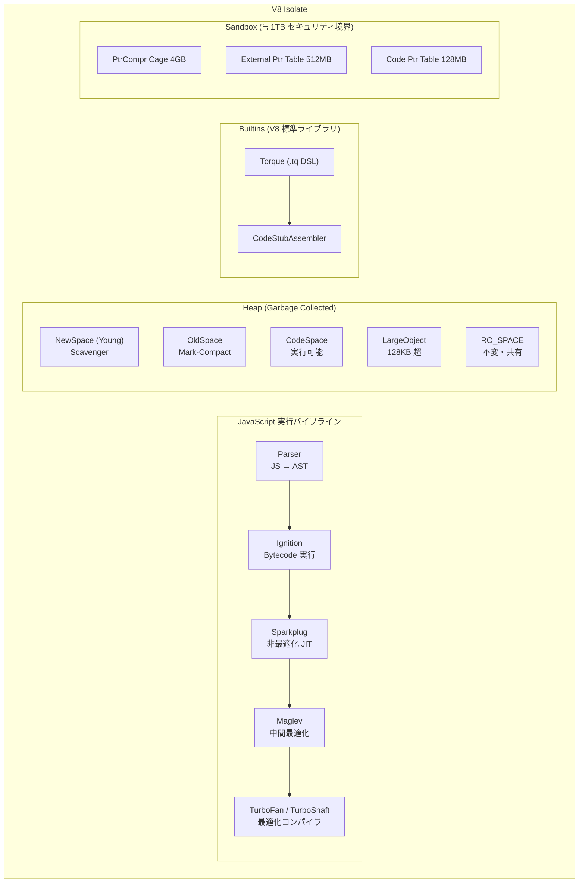

*図 P-1 / V8 の主要構成要素*

## 各章の依存関係

各章は前章を前提として書かれていますが、興味のあるトピックから飛び込んでも読めるよう、章間ブリッジで前提知識を確認しています。厳密な依存関係は次のとおりです。

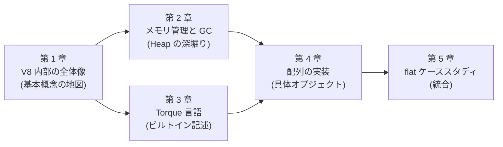

*図 P-2 / 章の依存関係 (矢印は推奨される読み進めかた)*

## 読者別の読みかた

| 読者 | 推奨ルート |
|---|---|
| 初学者の方 | 第 1 章を時間をかけてゆっくり読み、用語と全体構造を頭に入れます。第 2 章以降は太字部分と図を中心に拾い読みで十分です。第 5 章 (flat 実装) は最後に読むことで「自分はこれを理解できるようになった」という実感が得られます。 |
| JS は分かるが V8 は初めての方 | 第 1 章で全体地図を作り、興味のある章 (GC が好きなら第 2 章、配列ベンチマークに興味があれば第 4 章) に進みます。各章は独立して読めるよう書かれているので、寄り道しても迷子になりません。 |
| V8 経験者の方 | 第 5 章 (flat ケーススタディ) から逆向きに読むのもよい選択です。個別の最適化テクニックがどう積み重なって 4 倍の高速化を生んでいるかを観察し、必要に応じて第 4 章・第 3 章へ遡ることで未知の領域を効率よく補強できます。 |

## 先に知っておきたい主要用語

本書を読み進める前に押さえておくと理解が楽になる用語を集めました。詳しい説明は各章の本文を参照してください。

| 用語 | 概要 |
|---|---|
| Tagged Pointer | V8 のすべての値を表現する 32 / 64 bit のワード。最下位ビットで Smi か HeapObject かを区別します。 |
| Smi (Small Integer) | ヒープを介さず即値として保持される小整数。31 / 32 bit の整数値を Tagged Pointer に直接埋め込みます。 |
| HeapObject | V8 ヒープ上に確保されるオブジェクト。先頭ワードに必ず Map ポインタを持ち、レイアウトと型情報を提供します。 |
| Map (Hidden Class) | HeapObject の形状情報を記述するメタオブジェクト。instance_type、ElementsKind、prototype、descriptors を保持します。 |
| ElementsKind | JS 配列の要素ストレージ表現を示す内部状態。PACKED_SMI / HOLEY_DOUBLE など 13 種類以上があり、Map の bit_field2 に格納されます。 |
| Pointer Compression | 64 bit 環境で Tagged Pointer を 32 bit に圧縮して格納する仕組み。4GB のケージ内オフセットだけを保持します。 |
| Torque | V8 のビルトインを記述するための型付き DSL。ECMAScript 仕様の擬似コードに近い見た目で書け、CSA / TSA を経て機械語になります。 |
| CodeStubAssembler (CSA) | プラットフォーム抽象化された型付きアセンブラ。Torque のコンパイル先で、最終的に TurboFan が機械語を生成します。 |
| Scavenger | Young Generation (NewSpace) を対象とする Minor GC。Cheney 風の Copying GC で、生きたオブジェクトを To-Space に複製します。 |
| Mark-Compact | Old Generation を対象とする Major GC。マーク・スイープ・コンパクションの三段階でメモリ断片化を解消します。 |
| Inline Cache (IC) | プロパティアクセスの動的最適化機構。Map ごとに専用パスを生成し、Polymorphic / Megamorphic 状態に遷移して JIT 最適化のヒントを蓄積します。 |
| Protector | 「ある仮定がまだ破られていない」ことを保証する Isolate-wide のセル。NoElementsProtector や ArraySpeciesProtector など多数があり、楽観的最適化の前提となります。 |
| Sandbox | V8 ヒープ内の任意書き換えが外部に影響しないよう設計された約 1TB の仮想領域。External Pointer Table 経由で外部リソースを参照します。 |
| Bailout | 最適化パスから汎用パスへの脱出。ホットパスの前提条件が崩れたときに発火し、安全な実装に切り替えます。 |

:::message
**読み方のヒント** 各章の冒頭に「この章で学ぶこと」と「前章までで学んだこと」のセクションがあります。章が長く感じたときはこのセクションに戻って現在地を確認してください。
:::

---

# 第 1 章への導入

**これまで** プロローグでV8の全体俯瞰図と用語を眺め、本書の章マップを把握しました。次は最初の本格的な章として、V8の主要概念を一気に押さえます。

**この章で学ぶこと**

- Tagged Pointerの3つのエンコード方式
- HeapObjectとMap (Hidden Class) のレイアウト
- JSObjectのプロパティストレージ
- ElementsKindの全種類と遷移
- Stringの階層 (Seq / Cons / Sliced / Thin / External / Internalized)
- Number / BigInt / Oddballの表現
- Pointer CompressionとSandbox
- Heap Spacesの構造
- Orinoco GC (Scavenger / Mark-Compact)
- Ignition → Sparkplug → Maglev → TurboFanの実行パイプライン
- Inline Cacheの動的最適化

この章は分量が多いですが、すべての概念がここに並びます。つまずいたときは図表だけを追い、詳細は後続の章 (第2章のメモリ、第3章のTorque、第4章の配列) で深堀りされる、と割り切って読み進めてください。

---

# 第 1 章 / V8 内部の全体像

## 第1章 Tagged Pointer と Smi - V8 における値の最小単位

### 1.1 なぜタグ付けが必要か

V8はJavaScriptの任意の値を「ポインタサイズ (32ビットまたは64ビット) の整数値」として統一的に表現します。最下位の数ビットの値によって、その値が即値整数 (Smi) なのか、ヒープ上のオブジェクトへのポインタなのか、参照が強いのか弱いのかを判別します。

JavaScriptの値はすべて「Object」として扱える一方、その実体は整数だったり浮動小数点数だったり、ヒープに置かれたオブジェクトだったりします。これを統一的に扱うために、毎回ヒープにオブジェクトを割り当てる素朴な実装ではループの度に小さな整数のヒープ割り当てが発生して性能が出ません。そこでV8はポインタにはアラインメント (最下位の数ビットが必ず0) があるという性質を利用して、ポインタ値とは別の意味付けでSmiを表現します。

この設計思想を最もよく表しているのが `src/objects/tagged.h` の冒頭コメントです。32ビット環境と64ビット環境 (ポインタ圧縮あり/なし) の全パターンのビットレイアウトが明記されています。

```cpp
// src/objects/tagged.h:28-56
// Tagged<T> represents an uncompressed V8 tagged pointer.
//
// The tagged pointer is a pointer-sized value with a tag in the LSB. The value
// is either:
//
//   * A small integer (Smi), shifted right, with the tag set to 0
//   * A strong pointer to an object on the V8 heap, with the tag set to 01
//   * A weak pointer to an object on the V8 heap, with the tag set to 11
//   * A cleared weak pointer, with the value 11
//
// The exact encoding differs depending on 32- vs 64-bit architectures, and in
// the latter case, whether or not pointer compression is enabled.
//
// On 32-bit architectures, this is:
//             |----- 32 bits -----|
// Pointer:    |______address____w1|
//    Smi:     |____int31_value___0|
//
// On 64-bit architectures with pointer compression:
//             |----- 32 bits -----|----- 32 bits -----|
// Pointer:    |________base_______|______offset_____w1|
//    Smi:     |......garbage......|____int31_value___0|
//
// On 64-bit architectures without pointer compression:
//             |----- 32 bits -----|----- 32 bits -----|
// Pointer:    |________________address______________w1|
//    Smi:     |____int32_value____|00...............00|
//
// where `w` is the "weak" bit.
```

### 1.2 タグビットの定数定義

タグの正体は `include/v8-internal.h:57-74` に定数として定義されています。V8が公開する内部APIヘッダに置かれており、Embedderからも参照される基本的な値です。

```cpp
// include/v8-internal.h:57-74
// Tag information for HeapObject.
const int kHeapObjectTag = 1;
const int kWeakHeapObjectTag = 3;
const int kHeapObjectTagSize = 2;
const intptr_t kHeapObjectTagMask = (1 << kHeapObjectTagSize) - 1;
const intptr_t kHeapObjectReferenceTagMask = 1 << (kHeapObjectTagSize - 1);

// Tag information for fowarding pointers stored in object headers.
// 0b00 at the lowest 2 bits in the header indicates that the map word is a
// forwarding pointer.
const int kForwardingTag = 0;
const int kForwardingTagSize = 2;
const intptr_t kForwardingTagMask = (1 << kForwardingTagSize) - 1;

// Tag information for Smi.
const int kSmiTag = 0;
const int kSmiTagSize = 1;
const intptr_t kSmiTagMask = (1 << kSmiTagSize) - 1;
```

整理すると、1ワードの最下位2ビットには次の意味があります。

| 種別 | 上位ビット (... 4 3 2) | bit 1 | bit 0 | 下位ビットの値 |
|------|------------------------|-------|-------|----------------|
| Smi | int 値 | int | 0 | 下位 1bit = 0 |
| Strong HeapObject | ポインタ | 0 | 1 | 下位 2bit = 01 |
| Weak HeapObject | ポインタ | 1 | 1 | 下位 2bit = 11 |
| Forwarding (GC 中の map word) | アドレス | 0 | 0 | 下位 2bit = 00 |

ここに2つの重要な事実があります。第一に、`kSmiTag = 0`、`kHeapObjectTag = 1`、`kWeakHeapObjectTag = 3` という配置によって、SmiとHeapObjectの判別はビット01つで可能であり (`x & 1`)、StrongとWeakの判別はビット1で可能 (`x & 2`) になります。タグチェックは単一のAND命令とTEST命令で済みます。

第二に、`kForwardingTag = 0` の値は意図的なもので、GC中にMapWord領域に書かれるforwarding pointerは下位2ビットが `00` です。これはSmiの下位1ビットが0という性質と部分的にオーバーラップしますが、forwarding pointerはGCのためにMapWord領域に書き込まれる特殊な状態であり、通常の値として読み出されることはありません。

判定用のマクロは `src/common/globals.h:1978-1987` に置かれています。

```cpp
// src/common/globals.h:1978-1987
#define HAS_SMI_TAG(value) \
  ((static_cast<i::Tagged_t>(value) & ::i::kSmiTagMask) == ::i::kSmiTag)

#define HAS_STRONG_HEAP_OBJECT_TAG(value)                          \
  (((static_cast<i::Tagged_t>(value) & ::i::kHeapObjectTagMask) == \
    ::i::kHeapObjectTag))

#define HAS_WEAK_HEAP_OBJECT_TAG(value)                            \
  (((static_cast<i::Tagged_t>(value) & ::i::kHeapObjectTagMask) == \
    ::i::kHeapObjectTag))
```

### 1.3 なぜ HeapObject の下位ビットが 1 で Smi が 0 なのか

これはV8が初期から採用している重要な設計判断です。ヒープから割り当てられるすべてのHeapObjectは `kObjectAlignment` (通常4バイトまたは8バイト) でアラインされているため、下位2ビットは本来0です。

```cpp
// src/common/globals.h:1044-1051
// Desired alignment for tagged pointers.
constexpr int kObjectAlignmentBits = kTaggedSizeLog2;
constexpr intptr_t kObjectAlignment = 1 << kObjectAlignmentBits;
constexpr intptr_t kObjectAlignmentMask = kObjectAlignment - 1;

// Object alignment for 8GB pointer compressed heap.
constexpr intptr_t kObjectAlignment8GbHeap = 8;
constexpr intptr_t kObjectAlignment8GbHeapMask = kObjectAlignment8GbHeap - 1;
```

V8ではこの本来0になるはずのビット0に1を「タグ」として埋め込みます。実際にメモリにアクセスする際は `ptr - kHeapObjectTag` を計算して1を引いた値を使います。これは `Tagged<HeapObject>::address()` に現れます。

```cpp
// src/objects/tagged.h:509
Address address() const { return this->ptr() - kHeapObjectTag; }
```

逆にSmiは下位ビットを0のままにすることで、整数演算における重要な性質を得ます。たとえばSmi同士の加算は、単にタグ付きの値同士を加算するだけで正しい結果になります (`(2a)|0 + (2b)|0 = 2(a+b)|0`)。減算も同様です。乗算は片方の値を1ビットシフトで戻す必要がありますが、それでも非常に高速です。これは古典的なタグ付き整数表現の利点で、ML系言語処理系 (OCamlなど) でも同様の手法が採用されています。

V8がSmiのタグを「1」ではなく「0」にしている理由は、加算と減算が直接実行できる高速パスを確保すること、JSONやDOM整数値で頻出する小さな整数を最も多用すること、C++ の整数型と相互変換する際の演算量が最小化されることの3点です。ポインタ側を「タグ1」にしたデメリットはメモリアクセス時に毎回 `-1` する必要があることですが、これはload命令のimmediate offsetに組み込めるため (例: `mov rax, [rdi - 1]`) 事実上ゼロコストです。むしろこれは `Map* p` の場所に直接 `Map` 構造体を埋め込み、`p[0]` で `map` を取得できる利点と組み合わさって設計されています。HeapObjectの `map` フィールドはoffset 0にあるため、タグ付きポインタからのload offsetが `-1` となります。

### 1.4 Weak Reference の表現

Weak Referenceは `kWeakHeapObjectTag = 3` (二進では `0b11`) でタグ付けされます。StrongとWeakは下位2ビットを見るだけで区別でき、`HAS_STRONG_HEAP_OBJECT_TAG(x) → (x & 3) == 1`、`HAS_WEAK_HEAP_OBJECT_TAG(x) → (x & 3) == 3` で判別します。

Weakへの変換は `MakeWeak` で行われます。これはstrong referenceの下位2ビット `01` に `kWeakHeapObjectTag (= 0b11)` をORするだけです。

```cpp
// src/objects/tagged.h:797-816
template <typename T>
inline Tagged<WeakOf<T>> MakeWeak(Tagged<T> value) {
  static_assert(!is_subtype_v<Smi, T>, "Not allowed to make Smis weak.");
  return Tagged<WeakOf<T>>(value.ptr() | kWeakHeapObjectTag);
}

template <typename T>
inline Tagged<WeakOf<T>> MakeWeakOrSmi(Tagged<T> value) {
  static_assert(is_subtype_v<Smi, T>,
                "Use MakeWeak if this is known to not be a Smi.");
  if (value.IsSmi()) return Tagged<WeakOf<T>>(value.ptr());
  return Tagged<WeakOf<T>>(value.ptr() | kWeakHeapObjectTag);
}

template <typename T>
inline Tagged<StrongOf<T>> MakeStrong(Tagged<T> value) {
  // This works with Smis.
  return Tagged<StrongOf<T>>(value.ptr() &
                             (~kWeakHeapObjectTag | kHeapObjectTag));
}
```

`MakeStrong` の `~kWeakHeapObjectTag | kHeapObjectTag` は `~0b11 | 0b01 = ...111101` というマスクで、これとANDを取ることでビット1だけを落として `0b01` パターン (strong tag) にします。Smi (`0b00`) はビット1がもともと0なので影響を受けません。

`Weak<T>` は型レベルのマーカで、`Tagged<Weak<T>>` はWeakTaggedBaseを継承します。

```cpp
// src/objects/tagged.h:75-95
// Weak<T> represents a reference to T that is weak.
template <typename T>
class Weak {
 public:
  // Smis can't be weak.
  static_assert(!std::is_same_v<T, Smi>);
  // Generic Objects can't be weak, use a Union with a Smi instead.
  static_assert(!std::is_same_v<T, Object>);
  // "Weak" should be inside unions, not outside of them.
  static_assert(!is_union_v<T>);

  using strong_type = T;
};
```

Smiは値型なのでweakにしようがありません。一般の `Object` はSmiを含む可能性があるのでWeakにすると意味が壊れます。

### 1.5 ClearedWeakValue (cleared weak pointer)

GCによって参照先が解放されたweak referenceはcleared状態になります。`src/common/globals.h:1090-1102` に重要なコメントがあります。

```cpp
// src/common/globals.h:1090-1102
// The lower 32 bits of the cleared weak reference value is always equal to
// the |kClearedWeakHeapObjectLower32| constant but on 64-bit architectures
// the value of the upper 32 bits part may be
// 1) zero when pointer compression is disabled or for a kClearedWeakValue
//    constant,
// 2) upper 32 bits of the respective cage base when pointer compression is
//    enabled (this is useful for detecting cases when a cleared value loaded
//    from once cage is written to another cage).
// Note, that real heap objects can't have lower 32 bits equal to 3 because
// this offset belongs to page header. So, in either case it's enough to
// compare only the lower 32 bits of a Tagged<MaybeObject> value in order to
// figure out if it's a cleared reference or not.
const uint32_t kClearedWeakHeapObjectLower32 = 3;
```

つまりcleared weak valueは下位32ビットが `0x00000003` という値です。weak tag = `0b11` だけで、実体のアドレス部分が0になっています。なぜ下位32ビットが3で実体ヒープオブジェクトと衝突しないのかというと、offset 3はMemoryChunkのページヘッダに属するアドレスであり、ヒープオブジェクトはそこに配置されえないからです。これはV8ヒープアロケータの内部レイアウトに依存した、極めて微妙な不変条件です。

`IsCleared()` の実装はこの定数を直接比較します。

```cpp
// src/objects/tagged-impl.h:124-128
constexpr inline bool IsCleared() const {
  return kCanBeWeak &&
         (static_cast<uint32_t>(ptr_) == kClearedWeakHeapObjectLower32);
}
```

### 1.6 Forwarding Pointer (MapWord 中の表現)

GCが動いているとき、HeapObjectの先頭 (MapWord) はもはやMapポインタを保持しません。代わりにコピー先 (forwarding address) が書き込まれます。Forwarding pointerの下位2ビットは `00` で、これはMapポインタ (下位 `01`) でもSmi (下位 `0`) でもない特殊な状態を表します。

```cpp
// src/objects/map-word-inl.h:36-45
bool MapWord::IsForwardingAddress() const {
#ifdef V8_EXTERNAL_CODE_SPACE
  // When external code space is enabled forwarding pointers are encoded as
  // Smi representing a diff from the source object address in kObjectAlignment
  // chunks.
  return HAS_SMI_TAG(value_);
#else
  return (value_ & kForwardingTagMask) == kForwardingTag;
#endif  // V8_EXTERNAL_CODE_SPACE
}
```

`V8_EXTERNAL_CODE_SPACE` が無効な場合は、forwarding pointerは単にコピー先アドレスから `kHeapObjectTag` を引いた値、すなわち通常のアドレスをそのまま保持します。下位2ビットは `00` (= `kForwardingTag`) になります。

```cpp
// src/objects/map-word-inl.h:47-61
MapWord MapWord::FromForwardingAddress(Tagged<HeapObject> map_word_host,
                                       Tagged<HeapObject> object) {
#ifdef V8_EXTERNAL_CODE_SPACE
  // When external code space is enabled forwarding pointers are encoded as
  // Smi representing a diff from the source object address in kObjectAlignment
  // chunks.
  intptr_t diff = static_cast<intptr_t>(object.ptr() - map_word_host.ptr());
  DCHECK(IsAligned(diff, kObjectAlignment));
  MapWord map_word(Smi::FromIntptr(diff / kObjectAlignment).ptr());
  DCHECK(map_word.IsForwardingAddress());
  return map_word;
#else
  return MapWord(object.ptr() - kHeapObjectTag);
#endif  // V8_EXTERNAL_CODE_SPACE
}
```

`V8_EXTERNAL_CODE_SPACE` が有効な場合は、コピー元と先のアドレス差を `kObjectAlignment` で割ってSmiとして保存します。これは複数のポインタ圧縮cage (main cage、code cage、trusted cage) を持つ場合、絶対アドレスではなく相対値で表現する必要があるためです。Smi化することで、ポインタ圧縮スキームに依存しない表現になります。

```cpp
// src/objects/map-word.h:21-29
// When external code space is enabled forwarding pointers are encoded as
// Smi values representing a diff from the source or map word host object
// address in kObjectAlignment chunks. Such a representation has the following
// properties:
// a) it can hold both positive an negative diffs for full pointer compression
//    cage size (HeapObject address has only valuable 30 bits while Smis have
//    31 bits),
// b) it's independent of the pointer compression base and pointer compression
//    scheme.
```

### 1.7 Smi の値域と SmiTagging テンプレート

Smi (Small Integer) は本来、`include/v8-internal.h:76-162` の `SmiTagging<>` テンプレートで決まる二種類のレイアウトを持ちます。

```cpp
// include/v8-internal.h:83-96
// Smi constants for systems where tagged pointer is a 32-bit value.
template <>
struct SmiTagging<4> {
  enum { kSmiShiftSize = 0, kSmiValueSize = 31 };

  static constexpr intptr_t kSmiMinValue =
      static_cast<intptr_t>(kUintptrAllBitsSet << (kSmiValueSize - 1));
  static constexpr intptr_t kSmiMaxValue = -(kSmiMinValue + 1);

  V8_INLINE static constexpr int SmiToInt(Address value) {
    int shift_bits = kSmiTagSize + kSmiShiftSize;
    // Truncate and shift down (requires >> to be sign extending).
    return static_cast<int32_t>(static_cast<uint32_t>(value)) >> shift_bits;
  }
```

```cpp
// include/v8-internal.h:133-146
// Smi constants for systems where tagged pointer is a 64-bit value.
template <>
struct SmiTagging<8> {
  enum { kSmiShiftSize = 31, kSmiValueSize = 32 };

  static constexpr intptr_t kSmiMinValue =
      static_cast<intptr_t>(kUintptrAllBitsSet << (kSmiValueSize - 1));
  static constexpr intptr_t kSmiMaxValue = -(kSmiMinValue + 1);

  V8_INLINE static constexpr int SmiToInt(Address value) {
    int shift_bits = kSmiTagSize + kSmiShiftSize;
    // Shift down and throw away top 32 bits.
    return static_cast<int>(static_cast<intptr_t>(value) >> shift_bits);
  }
```

整理すると以下のようになります。

| 環境 | `kTaggedSize` | `kSmiValueSize` | `kSmiShiftSize` | Smi 範囲 |
|------|---------------|-----------------|-----------------|----------|
| 32 bit | 4 | 31 | 0 | -2^30 〜 2^30 - 1 |
| 64 bit + ポインタ圧縮 | 4 | 31 | 0 | -2^30 〜 2^30 - 1 |
| 64 bit + ポインタ圧縮なし | 8 | 32 | 31 | -2^31 〜 2^31 - 1 |
| `V8_31BIT_SMIS_ON_64BIT_ARCH` を強制 | 8 | 31 | 0 | -2^30 〜 2^30 - 1 |

`include/v8-internal.h:182-186` でPlatformSmiTaggingを選択しています。

```cpp
// include/v8-internal.h:182-186
#ifdef V8_31BIT_SMIS_ON_64BIT_ARCH
using PlatformSmiTagging = SmiTagging<kApiInt32Size>;
#else
using PlatformSmiTagging = SmiTagging<kApiTaggedSize>;
#endif
```

ポインタ圧縮を有効にしているV8ビルドでは `kApiTaggedSize = 4` となるため `SmiTagging<4>` が選ばれ、Smiは31ビットになります。これが多くの本番ビルド (ChromeやNode.js) で観測される挙動です。

### 1.8 Smi の符号拡張トリック

ポインタ圧縮なしの64ビットビルドでSmiを上位32ビットに置く理由は、`SmiToInt` を1命令で済ませるためです。x86_64やARM64の符号拡張load命令を直接使えるようにするための工夫です。

`src/common/globals.h:1023-1027` に注意書きがあります。

```cpp
// src/common/globals.h:1023-1027
static_assert(kSmiValueSize <= 32, "Unsupported Smi tagging scheme");
// Smi sign bit position must be 32-bit aligned so we can use sign extension
// instructions on 64-bit architectures without additional shifts.
static_assert((kSmiValueSize + kSmiShiftSize + kSmiTagSize) % 32 == 0,
              "Unsupported Smi tagging scheme");
```

Smiの値部分の符号ビットの位置が32ビット境界に揃っているため、`MOVSXD` (32→64符号拡張load) 命令と算術右シフトだけでSmiを整数に変換できます。x64アーキテクチャで `Address value` が64ビットの `intptr_t` として渡されたとき、ポインタ圧縮なしでは `shift_bits = 1 + 31 = 32` です。符号付き右シフト `>> 32` はx86-64では `sar rax, 32` の1命令、しかも演算結果がそのままint32として使えます。これが「Smiは上位32ビットに置く」設計の核心です。

逆向きの変換 `IntToSmi` も `include/v8-internal.h:198-201` に書かれていて、左シフトとタグのORだけです。

```cpp
V8_INLINE static constexpr Address IntToSmi(int value) {
  return (static_cast<Address>(value) << (kSmiTagSize + kSmiShiftSize)) |
         kSmiTag;
}
```

`kSmiTag = 0` なので実質的にはシフトだけで完了します。機械命令レベルでは、ポインタ圧縮なしの64ビットでは `shl rax, 32` の1命令、ポインタ圧縮ありや32ビットでは `shl eax, 1` の1命令で完了します。

### 1.9 Smi::IsValid の実装

```cpp
// include/v8-internal.h:98-130
template <class T, typename std::enable_if_t<std::is_integral_v<T> &&
                                             std::is_signed_v<T>>* = nullptr>
V8_INLINE static constexpr bool IsValidSmi(T value) {
  // Is value in range [kSmiMinValue, kSmiMaxValue].
  // Use unsigned operations in order to avoid undefined behaviour in case of
  // signed integer overflow.
  return (static_cast<uintptr_t>(value) -
          static_cast<uintptr_t>(kSmiMinValue)) <=
         (static_cast<uintptr_t>(kSmiMaxValue) -
          static_cast<uintptr_t>(kSmiMinValue));
}
```

この一見複雑な式は、区間判定を1回の符号なし減算と比較で行うテクニックです。`kSmiMinValue` 〜 `kSmiMaxValue` の範囲チェックを符号なし演算に変換しているのは、符号付きオーバーフローがC++ ではUndefined Behaviorになるからです。コンパイラの仕様変更や最適化で結果が変わる可能性を排除しています。

### 1.10 Smi クラスは値ではなく静的ユーティリティ

V8において `Smi` クラスは値を保持するインスタンスではなく、`Tagged<Smi>` を作る静的メソッドだけを集めた `AllStatic` クラスです。`src/objects/smi.h:25-131` を見ると、メンバ変数を一切持たず、`static` メソッドだけが並んでいます。

```cpp
// src/objects/smi.h:25-68
class Smi : public AllStatic {
 public:
  static constexpr int kMinValue = kSmiMinValue;
  static constexpr int kMaxValue = kSmiMaxValue;

  static inline constexpr int ToInt(const Tagged<Object> object) {
    return Tagged<Smi>(object.ptr()).value();
  }

  template <typename T>
  static inline bool constexpr IsValid(T value)
    requires(std::is_integral_v<T> && std::is_signed_v<T>)
  {
    DCHECK_EQ(Internals::IsValidSmi(value),
              value >= kMinValue && value <= kMaxValue);
    return Internals::IsValidSmi(value);
  }

  // Convert a value to a Smi object.
  static inline constexpr Tagged<Smi> FromInt(int value) {
    DCHECK(Smi::IsValid(value));
    return Tagged<Smi>(Internals::IntegralToSmi(value));
  }
};
```

「Smiの値」を変数で持ち回るときは `Tagged<Smi> s = Smi::FromInt(42);` のように書き、`s.value()` でintを取り出します。`Tagged<Smi>` 自体が1ワードの値型 (Addressラッパ) なので、メモリレイアウト上は通常のSmiタグ付きアドレスと同じです。

### 1.11 Tagged テンプレートと TaggedImpl 階層

V8は単純なポインタを直接扱うのではなく、テンプレート `Tagged<T>` で型情報を保持しながら値を扱います。この階層は `src/objects/tagged.h:58-71` のコメントに明示されています。

```cpp
// src/objects/tagged.h:58-71
// We specialise Tagged separately for Object, Smi and HeapObject, and then all
// other types T, so that:
//
//                    Tagged<Object> -> StrongTaggedBase
//                       Tagged<Smi> -> StrongTaggedBase
//   Tagged<T> -> Tagged<HeapObject> -> StrongTaggedBase
//
// We also specialize it separately for Weak types, with a parallel
// hierarchy:
//
//                          Tagged<Weak<Object>> -> WeakTaggedBase
//                             Tagged<Weak<Smi>> -> WeakTaggedBase
//   Tagged<Weak<T>> -> Tagged<Weak<HeapObject>> -> WeakTaggedBase
```

`StrongTaggedBase` と `WeakTaggedBase` は両方とも `TaggedImpl` のインスタンス化です。

```cpp
// src/objects/tagged.h:182-183
using StrongTaggedBase = TaggedImpl<HeapObjectReferenceType::STRONG, Address>;
using WeakTaggedBase = TaggedImpl<HeapObjectReferenceType::WEAK, Address>;
```

#### TaggedImpl の正体

```cpp
// src/objects/tagged-impl.h:32-47
template <HeapObjectReferenceType kRefType, typename StorageType>
class TaggedImpl {
 public:
  static_assert(std::is_same_v<StorageType, Address> ||
                    std::is_same_v<StorageType, Tagged_t>,
                "StorageType must be either Address or Tagged_t");

  // True for those TaggedImpl instantiations that represent uncompressed
  // tagged values and false for TaggedImpl instantiations that represent
  // compressed tagged values.
  static const bool kIsFull = sizeof(StorageType) == kSystemPointerSize;

  static const bool kCanBeWeak = kRefType == HeapObjectReferenceType::WEAK;

  V8_INLINE constexpr TaggedImpl() : ptr_{} {}
  V8_INLINE explicit constexpr TaggedImpl(StorageType ptr) : ptr_(ptr) {}
```

そして最後にメンバ変数の宣言があります。

```cpp
// src/objects/tagged-impl.h:235
  StorageType ptr_;
```

つまり `Tagged<T>` は内部的にはただひとつの整数 (`Address = uintptr_t`) を保持するスタンドアロン値型です。仮想関数も、vtableも、データメンバの追加もありません。`sizeof(Tagged<T>) == sizeof(Address)` です。これは効率上極めて重要で、Taggedを値渡ししても何のオーバーヘッドも生じません。

`Address` の定義は `include/v8-internal.h:38` にあります。

```cpp
// include/v8-internal.h:38-39
typedef uintptr_t Address;
static constexpr Address kNullAddress = 0;
```

`Tagged_t` は圧縮されたタグ付き値で、`src/common/globals.h:563-582` で環境ごとに切り替わります。

```cpp
// src/common/globals.h:563-582
// (Pointer compression enabled)
constexpr int kTaggedSize = kInt32Size;
constexpr int kTaggedSizeLog2 = 2;
using Tagged_t = uint32_t;
using AtomicTagged_t = base::Atomic32;
#else
constexpr int kTaggedSize = kSystemPointerSize;
constexpr int kTaggedSizeLog2 = kSystemPointerSizeLog2;
using Tagged_t = Address;
using AtomicTagged_t = base::AtomicWord;
#endif
```

ポインタ圧縮ありの場合は `kTaggedSize == 4` で `Tagged_t == uint32_t`、なしの場合は `kTaggedSize == kSystemPointerSize` (通常8) で `Tagged_t == Address` です。

#### Tagged<Object> と Tagged<HeapObject> の特殊化

```cpp
// src/objects/tagged.h:377-403
// Specialization for Object, where it's unknown whether this is a Smi or a
// HeapObject.
template <>
class Tagged<Object> : public StrongTaggedBase {
 public:
  V8_INLINE constexpr explicit Tagged(Address o) : StrongTaggedBase(o) {}
  V8_INLINE constexpr Tagged() : StrongTaggedBase(kNullAddress) {}

  // Allow implicit conversion from const HeapObject* to Tagged<Object>.
  V8_INLINE Tagged(const HeapObject* ptr)
      : Tagged(reinterpret_cast<Address>(ptr) + kHeapObjectTag) {}
```

ここで非常に重要なのが、`HeapObject*` を `Tagged<Object>` に変換するとき `kHeapObjectTag` (= 1) を加算している点です。C++ の素のポインタはタグなし、`Tagged<...>` はタグ付きであるため、変換時にタグを足します。

`Tagged<HeapObject>` はsubclassを受け入れる柔軟性を持ちます。

```cpp
// src/objects/tagged.h:460-510
template <>
class Tagged<HeapObject> : public StrongTaggedBase {
  using Base = StrongTaggedBase;

 public:
  V8_INLINE constexpr Tagged() = default;
  V8_INLINE Tagged(const HeapObject* ptr)
      : Tagged(reinterpret_cast<Address>(ptr) + kHeapObjectTag) {}

  // Implicit conversion for subclasses.
  template <typename U>
  V8_INLINE constexpr Tagged& operator=(Tagged<U> other)
    requires(is_subtype_v<U, HeapObject>)
  {
    return *this = Tagged(other);
  }

  V8_INLINE HeapObject& operator*() const;
  V8_INLINE HeapObject* operator->() const;

  V8_INLINE constexpr bool is_null() const {
    return static_cast<Tagged_t>(this->ptr()) ==
           static_cast<Tagged_t>(kNullAddress);
  }
```

`is_null()` の判定は `Tagged_t` (圧縮表現) で比較していることに注目してください。これはポインタ圧縮環境でもnullチェックが下位32ビットだけで正しく機能するための工夫です。

#### Tagged<Smi> の特殊化

```cpp
// src/objects/tagged.h:407-421
template <>
class Tagged<Smi> : public StrongTaggedBase {
 public:
  V8_INLINE constexpr Tagged() = default;
  V8_INLINE constexpr explicit Tagged(Address ptr) : StrongTaggedBase(ptr) {}

  V8_INLINE constexpr bool IsHeapObject() const { return false; }
  V8_INLINE constexpr bool IsSmi() const { return true; }

  V8_INLINE constexpr int32_t value() const {
    return Internals::SmiValue(ptr());
  }
};
```

SmiはHeapObjectではないため `operator->` は提供されません。`IsSmi()` は無条件に `true`、`IsHeapObject()` は無条件に `false` を返すよう静的に定義されています。これはJITコンパイラの最適化で有用です。

#### is_subtype_v と型階層の検査

`Tagged<T>` のテンプレートは大量の `requires` 句で型階層を厳密に検査します。その中核となるのが `is_subtype_v` です。

```cpp
// src/objects/tagged.h:216-300 抜粋
template <typename D, typename B>
consteval bool is_subtype_helper() {
  using std::is_base_of_v;
  using std::is_same_v;

  using Derived = typename normalize_type<D>::type;
  using Base = typename normalize_type<B>::type;

  if constexpr (is_same_v<Derived, Base>) {
    return true;
  } else if constexpr (is_union_v<Derived>) {
    // If Derived is a union, ALL of its members must be a subtype of Base.
    return []<typename... Ts>(std::type_identity<Union<Ts...>>) consteval {
      return (... && is_subtype_helper<Ts, Base>());
    }(std::type_identity<Derived>{});
  } else if constexpr (is_union_v<Base>) {
    // If Base is a union, Derived must be a subtype of AT LEAST ONE member.
    ...
  }
```

ここで興味深いのは `Object` が `Union<Smi, HeapObject>` として正規化される点です。

```cpp
// src/objects/tagged.h:219-229
template <typename T>
struct normalize_type {
  using type = T;
};
template <>
struct normalize_type<Object> {
  using type = Union<Smi, HeapObject>;
};
template <>
struct normalize_type<FieldType> {
  using type = Union<Smi, Map>;
};
```

つまり `Object` はC++ クラス階層上は `HeapObject` の基底クラスではなく、論理的に「SmiまたはHeapObject」を表す `Union` です。`Smi <: Object` も `HeapObject <: Object` も成立します。これはV8のドキュメント (`src/objects/objects.h:135-143`) にも明記されています。

```cpp
// src/objects/objects.h:135-143
// Object is the abstract superclass for all classes in the
// object hierarchy.
// Object does not use any virtual functions to avoid the
// allocation of the C++ vtable.
// There must only be a single data member in Object: the Address ptr,
// containing the tagged heap pointer that this Object instance refers to.
class Object : public AllStatic {
```

`Object` は実は `AllStatic` を継承するインスタンスを作れないクラスです。`Object` 自体に `Address ptr_` は存在せず、`Tagged<Object>` の親クラスである `TaggedImpl` が `ptr_` を保持します。これは登壇資料の重要なポイントで、「Objectとは何か」という質問に答えるのが意外に難しい所以です。

#### サブタイプ関係の自動証明

`src/objects/tagged.h:303-314` には型階層検査の `static_assert` が並んでいます。

```cpp
// src/objects/tagged.h:303-314
static_assert(is_subtype_v<Smi, Object>);
static_assert(is_subtype_v<HeapObject, Object>);
static_assert(is_subtype_v<HeapObject, HeapObject>);
static_assert(is_subtype_v<Smi, MaybeObject>);
static_assert(
    is_subtype_v<Union<HeapObject, Weak<HeapObject>, Smi>, MaybeObject>);
static_assert(!is_subtype_v<WeakOf<Object>, Object>);
static_assert(is_subtype_v<
              Object, Union<Smi, HeapObject, Weak<HeapObject>, TaggedIndex>>);
static_assert(is_subtype_v<Object, MaybeObject>);
static_assert(is_subtype_v<TaggedIndex, Object>);
static_assert(is_subtype_v<Union<HeapObject, TaggedIndex>, Object>);
```

これらはコンパイル時に階層関係が正しく定義されていることを保証します。

### 1.12 オブジェクトアラインメント

タグの2ビットを活用するには、すべてのヒープオブジェクトのアドレスが少なくとも4バイト境界 (32ビット) または8バイト境界 (64ビット) に揃っている必要があります。V8ではこれを `kObjectAlignment` として規定しています。

`kTaggedSize` は通常4 (ポインタ圧縮あり) または8 (なし) なので、`kObjectAlignment` も4または8になります。8GBヒープ拡張 (`V8_COMPRESS_POINTERS_8GB`) を有効にすると、圧縮アドレスにシフト演算を使うために8バイト境界に強制されます。

### 1.13 まとめ - Tagged Pointer 設計の効能

Tagged Pointerがもたらす恩恵を列挙します。

第一に、整数演算がほぼゼロコストで実行できます。Smi + Smiの加算は単に `add` 命令一発で済み、タグビットの位置調整も不要 (タグが0なので加算結果のタグも0)。Smi * SmiはSARで値を取り出してから掛けて、結果がSmiに収まるかをoverflow flagで確認するだけです。

第二に、HeapObjectかどうかの判定が1命令で可能です。`test al, 1` (タグビットを見るだけ) で分岐できるので、ジェネリックな処理 (例えばJSの `+` 演算子) における型ディスパッチが極めて軽量になります。

第三に、強参照と弱参照を同じスロットで区別できます。MapのtransitionsスロットやFeedbackVectorのように、強い参照と弱い参照を同居させるデータ構造を効率的に表現できます。

第四に、Smiの格納にヒープ割り当てが要らないため、整数だらけのJSコード (たとえばループカウンタや配列インデックス) ではGC圧迫が劇的に減ります。

代償もあります。Smiの値域が31ビット (場合により32ビット) に制限される、ポインタが4バイト境界に揃っている必要がある、タグ操作のコードが至るところに散らばる、などです。ただしJSの数値の大多数はSmi範囲に収まる小整数なので、利得は損失を大きく上回ります。

### 1.14 性能関連の数値感

参考までに、V8における具体的な数値を整理します。

- `kHeapObjectTag = 1`, `kWeakHeapObjectTag = 3`, `kSmiTag = 0`
- 32ビット / 圧縮64ビット環境でのSmi範囲: 約 ±10億 (-2^30 〜 2^30 - 1)
- 非圧縮64ビット環境でのSmi範囲: 約 ±21億 (-2^31 〜 2^31 - 1)
- ポインタ圧縮環境のcage size: 4 GiB (`1 << 32`)
- `kObjectAlignment`: 通常 `kTaggedSize` (4または8バイト)、`V8_COMPRESS_POINTERS_8GB` 環境では8バイト固定
- `Tagged_t` のサイズ: 圧縮環境で4バイト、非圧縮で8バイト

## 第2章 HeapObject と Object 階層

### 2.1 V8_OBJECT マクロと #pragma pack(4)

V8のヒープオブジェクトはすべて `V8_OBJECT` マクロで装飾されたクラスで定義されます。このマクロは `#pragma pack(4)` を発行して構造体のアライメントを4バイトに切り詰め、さらに `-Wpadded` をエラー化します。

```cpp
// src/objects/object-macros.h:43-50
#if V8_CC_GNU
#define V8_OBJECT_PUSH                                                    \
  _Pragma("pack(push)") _Pragma("pack(4)") _Pragma("GCC diagnostic push") \
      _Pragma("GCC diagnostic error \"-Wpadded\"")
```

これによってV8のヒープオブジェクトは「想定外のpaddingが一切ない」ことがコンパイル時に保証されます。バイトレイアウトがGCのスキャンやbytecode生成と密接に絡んでいるため、paddingが入り込むと不整合になります。

### 2.2 HeapObject の本体

`src/objects/heap-object.h:62-399` でHeapObjectの本体が定義されています。

```cpp
// src/objects/heap-object.h:60-66
// HeapObject is the superclass for all classes describing heap allocated
// objects.
V8_OBJECT class HeapObject {
 public:
  DECL_GETTER(map, Tagged<Map>)
```

そして最終的なメンバ変数の宣言は次のとおりです。

```cpp
// src/objects/heap-object.h:397-401
 public:
  TaggedMember<Map> map_;
} V8_OBJECT_END;

static_assert(offsetof(HeapObject, map_) == Internals::kHeapObjectMapOffset);
```

`Internals::kHeapObjectMapOffset` の値を確認します。

```cpp
// include/v8-internal.h:1027
static const int kHeapObjectMapOffset = 0;
```

HeapObjectの先頭バイト (offset 0) は必ずMapポインタです。これはV8の最も基本的な不変条件であり、GC、JIT、インラインキャッシュ、デバッガすべてがこの前提に依存しています。

メモリレイアウトを図示するとこのようになります。ポインタ圧縮なし64ビット環境の場合です。

`Tagged<HeapObject> ptr` (例 `0x7fff0001abcdef01`) から `-1` でタグを除去すると、HeapObjectインスタンスの実アドレス (例 `0x7fff0001abcdef00`) になります。そのレイアウトは次のとおりです。

| オフセット | フィールド | サイズ | 説明 |
|------------|------------|--------|------|
| 0 | `TaggedMember<Map> map_` | 8 バイト | この 8 バイトが MapWord |
| 8 | サブクラス固有のフィールド ... | 可変 | |

ポインタ圧縮ありの場合は `TaggedMember<Map>` が4バイトになります。

| オフセット | フィールド | サイズ | 説明 |
|------------|------------|--------|------|
| 0 | `Tagged_t map_` | 4 バイト | 4 バイトに圧縮された Map ポインタ |
| 4 | サブクラス固有のフィールド | 可変 | |

### 2.3 MapWord の役割

通常時、HeapObjectのoffset 0は `Tagged<Map>` の値を持ちますが、GC中はforwarding pointerになり得ます。この「Mapポインタかもしれないし、forwarding pointerかもしれない値」を抽象化したのが `MapWord` クラスです。

```cpp
// src/objects/map-word.h:16-30
// Heap objects typically have a map pointer in their first word.  However,
// during GC other data (e.g. mark bits, forwarding addresses) is sometimes
// encoded in the first word.  The class MapWord is an abstraction of the
// value in a heap object's first word.
//
// When external code space is enabled forwarding pointers are encoded as
// Smi values representing a diff from the source or map word host object
// address in kObjectAlignment chunks.
class MapWord {
 public:
  // Normal state: the map word contains a map pointer.
  static inline MapWord FromMap(const Tagged<Map> map);
```

`HeapObject::map()` は `map_word(kRelaxedLoad).ToMap()` を呼び出し、まずMapWordとして読み、Mapに変換します。

```cpp
// src/objects/heap-object-inl.h:22-34
MapWord HeapObject::map_word(RelaxedLoadTag tag) const {
  return MapField::Relaxed_Load_Map_Word(this);
}

MapWord HeapObject::map_word(AcquireLoadTag tag) const {
  return MapField::Acquire_Load_No_Unpack(this);
}

Tagged<Map> HeapObject::map() const { return map_word(kRelaxedLoad).ToMap(); }
```

`MapField` の定義はheap-object.hの354行です。

```cpp
// src/objects/heap-object.h:354
using MapField = TaggedField<MapWord, 0>;
```

「offset 0にあるMapWord型のフィールド」というメタ情報を `TaggedField` テンプレートで表現しています。

### 2.4 HeapObject::FromAddress と address(), ptr()

```cpp
// src/objects/heap-object.h:131-141
static inline Tagged<HeapObject> FromAddress(Address address) {
  DCHECK_TAG_ALIGNED(address);
  return Tagged<HeapObject>(address + kHeapObjectTag);
}

inline Address address() const { return reinterpret_cast<Address>(this); }

Address ptr() const { return address() + kHeapObjectTag; }
```

`HeapObject::FromAddress(addr)` はraw addressにタグ1を足します。`HeapObject::address()` は逆にタグなしの実アドレスを返し、`HeapObject::ptr()` はタグ付き値を返します。`address` と `ptr` の差は `kHeapObjectTag` で、これがコード中で意味するところは「raw pointerかtagged valueか」です。

### 2.5 HeapObject コピー禁止

```cpp
// src/objects/heap-object.h:389-396
// HeapObjects shouldn't be copied or moved by C++ code, only by the GC.
HeapObject(HeapObject&&) V8_NOEXCEPT = delete;
HeapObject(const HeapObject&) V8_NOEXCEPT = delete;
HeapObject& operator=(HeapObject&&) V8_NOEXCEPT = delete;
HeapObject& operator=(const HeapObject&) V8_NOEXCEPT = delete;
```

HeapObjectのコピーコンストラクタとムーブコンストラクタはすべて `delete` されています。これは「HeapObjectはV8ヒープ上にしか存在してはならず、C++ オブジェクトとしてコピーすることはGCとの不整合を生む」という保守的な姿勢の表れです。

### 2.6 Object クラス階層と InstanceType

#### Object は AllStatic である

`Object` クラスは値を保持しません。

```cpp
// src/objects/objects.h:135-148
// Object is the abstract superclass for all classes in the
// object hierarchy.
// Object does not use any virtual functions to avoid the
// allocation of the C++ vtable.
// There must only be a single data member in Object: the Address ptr,
// containing the tagged heap pointer that this Object instance refers to.
class Object : public AllStatic {
 public:
  enum class Conversion {
    kToNumber,  // Number = Smi or HeapNumber
    kToNumeric  // Numeric = Smi or HeapNumber or BigInt
  };
```

`AllStatic` はV8で定義された基底クラスで、`new` できない、コンストラクタを呼べない純粋な名前空間的クラスです。「Object階層」と呼ばれているのは型システム上の論理的な階層であり、C++ クラス継承では実現されていません。これと対照的に、`HeapObject` は実際に値を持つクラスです。

#### InstanceType の役割

ヒープ上の各オブジェクトはそのMapに `instance_type` という16ビットのタグを持ちます。これがオブジェクトの種類を決定します。

```cpp
// src/objects/instance-type.h:22-25
// We use the full 16 bits of the instance_type field to encode heap object
// instance types. All the high-order bits (bits 7-15) are cleared if the object
// is a string, and contain set bits if it is not a string.
const uint32_t kIsNotStringMask = ~((1 << 7) - 1);
const uint32_t kStringTag = 0x0;
```

つまりInstanceTypeの上位9ビット (bit 7-15) が0ならstring、それ以外なら非stringです。下位7ビットはstringの中での更なる分類 (representation, encoding, internalized, sharedなど) に使われます。

```cpp
// src/objects/instance-type.h:28-37
const uint32_t kStringRepresentationMask = (1 << 3) - 1;
enum StringRepresentationTag {
  kSeqStringTag = 0x0,
  kConsStringTag = 0x1,
  kExternalStringTag = 0x2,
  kSlicedStringTag = 0x3,
  kThinStringTag = 0x5
};
```

V8が「あるHeapObjectが `String` なのか `JSObject` なのか」を判定する際に、`map->instance_type & kIsNotStringMask` のような単純なビット演算で済むようにする工夫です。

「FIRST_xxx_TYPE」と「LAST_xxx_TYPE」が連続する整数値となるよう、Torqueが型階層に基づいて自動的に番号を振ります。これによって `IsJSReceiver(obj)` のような判定は「`FIRST_JS_RECEIVER_TYPE <= type && type <= LAST_JS_RECEIVER_TYPE`」という単純な範囲チェックで実装できます (実際にはbranch-lessに `unsigned(type - FIRST) <= (LAST - FIRST)` で書く)。

### 2.7 主要な型階層

V8における代表的な型階層を整理すると以下のようになります。

```mermaid
graph TB
    Object["Object (論理的)"]
    Object --> Smi
    Object --> HeapObject
    HeapObject --> HeapNumber["HeapNumber (boxed double)"]
    HeapObject --> Name
    HeapObject --> BigInt
    HeapObject --> Oddball["Oddball (undefined, null, true, false)"]
    HeapObject --> Hole["Hole (the_hole, uninitialized, optimized_out, ...)"]
    HeapObject --> Map
    HeapObject --> FixedArrayBase
    HeapObject --> JSReceiver
    HeapObject --> Struct["Struct (内部用構造体)"]
    HeapObject --> FeedbackVector["FeedbackVector (型フィードバック収集)"]
    HeapObject --> Code["Code, InstructionStream (JIT compiled code)"]
    HeapObject --> Foreign["Foreign (C++ オブジェクトのポインタ保持)"]
    Name --> String
    Name --> Symbol
    String --> SeqString["SeqString (SeqOneByteString / SeqTwoByteString)"]
    String --> ConsString
    String --> ExternalString
    String --> SlicedString
    String --> ThinString
    FixedArrayBase --> FixedArray
    FixedArrayBase --> FixedDoubleArray
    FixedArrayBase --> ByteArray
    FixedArrayBase --> WeakFixedArray
    FixedArrayBase --> Dictionaries["NameDictionary, NumberDictionary"]
    FixedArrayBase --> SwissNameDictionary
    FixedArrayBase --> ArrayList["ArrayList, ScriptContextTable"]
    JSReceiver --> JSObject
    JSReceiver --> JSProxy
    JSObject --> JSArray
    JSObject --> JSFunction
    JSObject --> JSArrayBuffer["JSArrayBuffer, JSDataView, JSTypedArray"]
    JSObject --> JSMap["JSMap, JSSet, JSWeakMap, JSWeakSet"]
    JSObject --> JSPromise["JSPromise, JSRegExp, JSDate"]
    JSObject --> JSGlobalObject["JSGlobalObject, JSGlobalProxy"]
    Struct --> FeedbackCell
    Struct --> AllocationSite
    Struct --> AccessorInfo["AccessorInfo, AccessorPair"]
    Struct --> Script["Script, ScopeInfo, SharedFunctionInfo"]
```

### 2.8 キャストの実装

V8のキャストは「`CastTraits<T>::AllowFrom(value)` でランタイム判定し、許容されればポインタを `Tagged<T>` として再解釈する」というパターンで実装されます。

```cpp
// src/objects/casting.h:42-53
template <typename To>
struct CastTraits;

template <typename T, typename U>
inline bool Is(Tagged<U> value) {
  return CastTraits<T>::AllowFrom(value);
}
```

具体的な特殊化を見ます。

```cpp
// src/objects/casting.h:451-466
template <>
struct CastTraits<Object> {
  static inline bool AllowFrom(Tagged<Object> value) { return true; }
};
template <>
struct CastTraits<Smi> {
  static inline bool AllowFrom(Tagged<Object> value) { return value.IsSmi(); }
  static inline bool AllowFrom(Tagged<HeapObject> value) { return false; }
};
template <>
struct CastTraits<HeapObject> {
  static inline bool AllowFrom(Tagged<Object> value) {
    return value.IsHeapObject();
  }
  static inline bool AllowFrom(Tagged<HeapObject> value) { return true; }
};
```

`CastTraits<Smi>::AllowFrom(Tagged<HeapObject>)` が `false` を返すことに注目してください。`Tagged<HeapObject>` であることが分かっている時点でSmiではあり得ないため、コンパイル時に分岐を排除できます。

`InstanceType` ごとの判定は `INSTANCE_TYPE_CHECKERS` マクロから自動生成されます。

```cpp
// src/objects/heap-object-inl.h:42-49
#define TYPE_CHECKER(type, ...)                                          \
  bool Is##type(Tagged<HeapObject> obj) {                                \
    Tagged<Map> map_object = obj->map();                                 \
    return InstanceTypeChecker::Is##type(map_object);                    \
  }

INSTANCE_TYPE_CHECKERS(TYPE_CHECKER)
```

`IsJSObject(obj)` は `obj->map()->instance_type()` を読んで `InstanceTypeChecker::IsJSObject(map)` を呼びます。これは型範囲チェックを行います。

### 2.9 Handle, DirectHandle, MaybeHandle

V8では `Tagged<T>` を直接持つことはGCを跨いだ寿命の保証ができないため、長期的に値を保持するには `Handle<T>` か `DirectHandle<T>` を使う必要があります。

#### なぜ Handle が必要なのか

V8のGC (特にScavengerによるyoung generation GC) は「コピーするGC」です。生存しているオブジェクトはコピー元の領域からコピー先の領域に物理的に移動されます。つまりオブジェクトのアドレスがGCのたびに変わる可能性があります。

C++ コード上で `Tagged<JSObject> obj = ...` のように保持している値は、次に `obj` を使う時点で別のアドレスに移動している可能性があり、`obj` の値がstaleになります。これを防ぐには、GCに「私はこのオブジェクトを使っているから動かしたら教えて」と申告する仕組みが必要です。これがHandleです。

#### Handle の本体

Handleは内部に `Address*` を持つダブルポインタです。

```cpp
// src/handles/handles.h:55-136 抜粋
class HandleBase {
 public:
  V8_INLINE bool is_identical_to(const HandleBase& that) const;
  V8_INLINE bool is_null() const { return location_ == nullptr; }

  V8_INLINE Address address() const {
    return reinterpret_cast<Address>(location_);
  }
  ...
 protected:
  // This uses type Address* as opposed to a pointer type to a typed
  // wrapper class, because it doesn't point to instances of such a
  // wrapper class.
  Address* location_;
};
```

`location_` はHandleScopeが管理するスロット (Addressの配列) を指します。そのスロットの中身がオブジェクトのtagged pointerです。GCが動くと、GCはHandleScopeのスロット全てを走査し、その中身を新しいアドレスに更新します。Handle自体 (= `Address*` の値) は変化しませんが、その指す先の値がGCによって書き換えられるため、`*handle` で読み出した値は常に最新のアドレスを返します。

```cpp
// src/handles/handles.h:181-203
V8_INLINE Tagged<T> operator*() const {
  static_assert(is_taggable_v<T>, "static type violation");
  SLOW_DCHECK(IsDereferenceAllowed());
  return Tagged<T>(*location());
}
```

#### HandleScope と寿命管理

```cpp
// src/handles/handles.h:251-345 抜粋
class V8_NODISCARD HandleScope {
 public:
  explicit V8_INLINE HandleScope(Isolate* isolate);
  V8_INLINE ~HandleScope();

  V8_INLINE static Address* CreateHandle(Isolate* isolate, Address value);

 private:
  Isolate* isolate_;
  Address* prev_next_;
  Address* prev_limit_;
};
```

`HandleScope` はスタック上に置かれるRAIIオブジェクトで、デストラクタで自分の有効範囲内に作られたすべてのHandleを解放します。これはstack-disciplineな寿命管理で、Lispのdynamic-windのような働きをします。

`CreateHandle` はHandleScopeの先頭スロット (= `next_`) に値を書き込み、`next_` をインクリメントします。これはO(1) のアロケーションです。

#### DirectHandle と Conservative Stack Scanning

`DirectHandle` は最近導入された新機能で、Handleのような間接参照層を作らず、スタック上に直接 `Address` を持つハンドルです。

```cpp
// src/handles/handles.h:386-477
class V8_TRIVIAL_ABI DirectHandleBase :
    public api_internal::StackAllocated<...>
{
 public:
  V8_INLINE Address address() const { return obj_; }
 protected:
  // This is a direct pointer to either a tagged object or SMI.
  Address obj_;
```

DirectHandleは内部に `Address obj_` を直接保持します。これはHandleの `Address* location_` よりも一段少ない間接参照になります。

問題は「GCがコピーした際にどうやって更新するか」です。DirectHandleはスタック上にしか存在できない設計 (`StackAllocated` を継承) で、GCがconservative stack scanningを有効にしている前提で動きます。

conservative stack scanningとは「スタック上の全ワードを走査し、もしHeapObjectっぽい値があったらそれを生きていると見なす (動かさない、または動かしたら同じスタックワードを書き換える)」というアプローチです。これにより、スタック上に `Address obj_` を直接置いておけば、GCは自動的にそれを認識して保護してくれます。

DirectHandleの利点は、アクセスが一段速い、HandleScopeのメモリアロケーションが不要、キャッシュ局所性が良くなる点です。欠点はconservative stack scanningが必要で、ヒープ上のデータ構造には埋め込めない点です。

#### MaybeHandle

```cpp
// src/handles/maybe-handles.h:28-102
template <typename T>
class MaybeHandle final : public HandleBase {
 public:
  V8_INLINE MaybeHandle() : HandleBase(nullptr) {}

  V8_INLINE Handle<T> ToHandleChecked() const {
    Check();
    return Handle<T>(location_);
  }

  template <typename S>
  V8_WARN_UNUSED_RESULT V8_INLINE bool ToHandle(Handle<S>* out) const {
    if (is_null()) {
      *out = Handle<T>::null();
      return false;
    } else {
      *out = Handle<T>(location_);
      return true;
    }
  }
```

`MaybeHandle<T>` は「`Handle<T>` またはempty」を表します。例外 (JavaScriptのthrow) のために、関数の戻り値を `MaybeHandle<T>` にしておき、emptyなら例外発生、そうでなければ値があると解釈します。`std::optional` 相当の役割をハンドルに対して果たします。

## 第3章 Map (Hidden Class) と Transition Tree

### 3.1 Map とは何か、なぜ存在するか

JavaScriptのオブジェクトはECMAScript仕様上は単なるプロパティのコレクションです。仕様通りに各プロパティを名前付き辞書として持つと、プロパティアクセスは常にハッシュテーブルの探索になり、極めて低速になります。V8はこの問題を解決するため、Self言語のmapsやStrongtalkのhidden classの発想を取り入れて、構造的に類似したオブジェクト群が共有する形状記述子を導入しました。これが `v8::internal::Map` です。

`src/objects/map.h:173-180` のコメントに端的に書かれています。

```cpp
// src/objects/map.h:173-180
// All heap objects have a Map that describes their structure.
//  A Map contains information about:
//  - Size information about the object
//  - How to iterate over an object (for garbage collection)
```

すべてのHeapObjectは先頭ワードにMapポインタを持ち、そのMapがオブジェクトのサイズと内容を完全に決定します。Mapは「型情報・形状情報・GC用走査情報・継承情報・最適化用フィードバック」をすべて引き受けるV8の中心メタオブジェクトです。

### 3.2 Map のメモリレイアウト

`src/objects/map.h:1222-1247` でMapのメンバ変数が定義されています。

```cpp
// src/objects/map.h:1223-1246
std::atomic<uint8_t> instance_size_in_words_;
std::atomic<uint8_t> inobject_properties_start_or_constructor_function_index_;
std::atomic<uint8_t> used_or_unused_instance_size_in_words_;
std::atomic<uint8_t> visitor_id_;
std::atomic<uint16_t> instance_type_;
std::atomic<uint8_t> bit_field_;
uint8_t bit_field2_;
std::atomic<uint32_t> bit_field3_;
#if TAGGED_SIZE_8_BYTES
uint32_t optional_padding_;
#endif
TaggedMember<UnionOf<JSReceiver, Null>> prototype_;
TaggedMember<Object> constructor_or_back_pointer_or_native_context_;
TaggedMember<DescriptorArray> instance_descriptors_;
TaggedMember<DependentCode> dependent_code_;
TaggedMember<UnionOf<Smi, Cell>> prototype_validity_cell_;
TaggedMember<UnionOf<Smi, MaybeWeak<Map>, TransitionArray, PrototypeInfo,
                     PrototypeSharedClosureInfo>>
    transitions_or_prototype_info_;
```

V8の標準的なポインタ圧縮ビルド (`kTaggedSize = 4`) ではMapのサイズは40バイト、ポインタ圧縮を切った64ビットビルド (`kTaggedSize = 8`) では64バイトになります。Mapは典型的なV8アプリケーションで数万個から数十万個生成されるため、Map 1個のサイズが直接V8のメモリフットプリントを規定します。

#### instance_size_in_words

1バイトの符号なし整数で、Mapに従って生成されるJSObjectのサイズをkTaggedSizeワード単位で表現します。これによりJSObjectの最大インスタンスサイズが255ワードに制限されます (`kMaxInstanceSize = 255 * kTaggedSize`)。`kTaggedSize=8` の環境では最大2040バイト、`kTaggedSize=4` の環境では1020バイトの上限です。可変サイズオブジェクト (文字列、配列など) の場合は `kVariableSizeSentinel` を入れて、オブジェクト自身のlengthフィールドからサイズを求めます。

#### inobject_properties_start_or_constructor_function_index

二重の意味を持つフィールドです。

```cpp
// src/objects/map.h:268-285
// [inobject_properties_start_or_constructor_function_index]:
// Provides access to the inobject properties start offset in words in case of
// JSObject maps, or the constructor function index in case of primitive maps.
DECL_UINT8_ACCESSORS(inobject_properties_start_or_constructor_function_index)
```

JSObject用のMapではin-objectプロパティが始まるオフセット (ワード単位) を表します。プリミティブのMap (Number, String, Booleanなど) の場合、自分自身ではなくラッパオブジェクトを生成するコンストラクタへの参照をContextインデックスとして格納します。同じ1バイトで2つの意味を兼ねることでMapのサイズを節約しています。

#### used_or_unused_instance_size_in_words

```cpp
// src/objects/map.h:1110-1122
// This byte encodes either the instance size without the in-object slack or
// the slack size in properties backing store.
// Let H be JSObject::kHeaderSize / kTaggedSize.
// If value >= H then:
//     - all field properties are stored in the object.
//     - there is no property array.
//     - value * kTaggedSize is the actual object size without the slack.
// Otherwise:
//     - there is no slack in the object.
//     - the property array has value slack slots.
// Note that this encoding requires that H = JSObject::kFieldsAdded.
```

1バイトでふたつの状態を兼ねるため、JSObjectヘッダワード数Hを境界に意味を切り替えます。in-objectに空きがあるあいだはusedサイズを正確にトラッキングし、out-of-objectに溢れたあとはPropertyArrayのunusedスロット数を表現できます。

#### visitor_id

GCがMapを読まずに1バイトのIDだけでvisitorを切り替えられるようにするためのキャッシュです。DATA_ONLY系 (BigInt、HeapNumber、文字列など) はvisitor_idが `kDataOnlyVisitorIdCount` 未満になり、ポインタを含むかどうかがO(1) で判定できます。

### 3.3 bit_field のビット配置 (1 バイト = 8 ビット)

```cpp
// src/objects/map.tq:5-14
bitfield struct MapBitFields1 extends uint8 {
  has_non_instance_prototype: bool: 1 bit;
  is_callable: bool: 1 bit;
  has_named_interceptor: bool: 1 bit;
  has_indexed_interceptor: bool: 1 bit;
  is_undetectable: bool: 1 bit;
  is_access_check_needed: bool: 1 bit;
  is_constructor: bool: 1 bit;
  is_extended_map: bool: 1 bit;
}
```

ビット配置を図示します。

| ビット | フィールド | 意味 |
|--------|------------|------|
| bit 0 | `has_non_instance_prototype` | non-instance prototype を持つか |
| bit 1 | `is_callable` | 呼び出し可能か |
| bit 2 | `has_named_interceptor` | named interceptor を持つか |
| bit 3 | `has_indexed_interceptor` | indexed interceptor を持つか |
| bit 4 | `is_undetectable` | undetectable か |
| bit 5 | `is_access_check_needed` | アクセスチェックが必要か |
| bit 6 | `is_constructor` | コンストラクタか |
| bit 7 | `is_extended_map` | 拡張 map か |

これらはすべて、Mapをハッシュテーブルから引かずに「インスタンスがどう振る舞うか」を1命令で判定したい超ホットなフラグです。`is_callable` は関数呼び出しのたびに、`is_undetectable` は `typeof` のたびに、`is_constructor` は `new` 演算子のたびに参照されます。bit_fieldの1ロードとAND 1命令で答えが出ます。

### 3.4 bit_field2 (1 バイト = 8 ビット)

```cpp
// src/objects/map.tq:16-20
bitfield struct MapBitFields2 extends uint8 {
  new_target_is_base: bool: 1 bit;
  is_immutable_prototype: bool: 1 bit;
  elements_kind: ElementsKind: 6 bit;
}
```

| ビット | フィールド | 意味 |
|--------|------------|------|
| bit 0 | `new_target_is_base` (1 bit) | new.target が base か |
| bit 1 | `is_immutable_prototype` (1 bit) | prototype が不変か |
| bits 2-7 | `elements_kind` (6 bit) | 配列要素の保存形式 |

`elements_kind` (bits 2-7) で配列要素の保存形式を6ビット = 最大64種類で表現します。

`bit_field2()` は他のビットフィールドと違って `std::atomic` ではなく単なる `uint8_t` です。bit_field2がMapのidentityを構成する一部であり、Map構築完了後に変更されないためです。Mapのハッシュ計算 `Map::Hash` (`map.cc:2386-2400`) でもprototypeと並んでbit_field2だけが使われます。

```cpp
// src/objects/map.cc:2386-2400
int Map::Hash(Isolate* isolate, Tagged<HeapObject> prototype) {
  // For performance reasons we only hash the 2 most variable fields of a map:
  // prototype and bit_field2.

  int prototype_hash;
  if (IsNull(prototype)) {
    prototype_hash = 1;
  } else {
    Tagged<JSReceiver> receiver = Cast<JSReceiver>(prototype);
    prototype_hash = receiver->GetOrCreateIdentityHash(isolate).value();
  }

  return prototype_hash ^ bit_field2();
}
```

### 3.5 bit_field3 (4 バイト = 32 ビット)

Mapのもっとも複雑で稠密なビットフィールドです。

```cpp
// src/objects/map.tq:22-34
bitfield struct MapBitFields3 extends uint32 {
  enum_length: int32: 10 bit;
  number_of_own_descriptors: int32: 10 bit;
  is_prototype_map: bool: 1 bit;
  is_dictionary_map: bool: 1 bit;
  owns_descriptors: bool: 1 bit;
  is_in_retained_map_list: bool: 1 bit;
  is_deprecated: bool: 1 bit;
  is_unstable: bool: 1 bit;
  is_migration_target: bool: 1 bit;
  is_extensible: bool: 1 bit;
  may_have_interesting_properties: bool: 1 bit;
  construction_counter: int32: 3 bit;
}
```

合計10 + 10 + 9*1 + 3 = 32ビットでぴったり1ワードに収まります。

#### 各ビットの意味

`enum_length` (bits 0..9) は `for...in` でのプロパティ列挙の有効なenum cache長さです。`kInvalidEnumCacheSentinel = (1 << 10) - 1 = 1023` がキャッシュ無効のセンチネル値です。

`number_of_own_descriptors` (bits 10..19) はこのMap自身が保持するdescriptor数 (最大1020) です。DescriptorArrayは親Mapと子Mapで共有されることが多く、子Mapは親MapのDescriptorArrayの先頭部分だけを使うため、「自分が見るのはDescriptorArrayの何番目まで」というインデックスです。

`is_prototype_map` (bit 20) は誰かのprototypeを保持するMapかを示します。立つと `transitions_or_prototype_info_` フィールドの解釈が変わり、TransitionArrayの代わりにPrototypeInfoが入る扱いになります。

`is_dictionary_map` (bit 21) は高速モード (fast properties) ではなく辞書モード (slow properties, NameDictionary) でプロパティを保持するかです。`set_is_dictionary_map` を呼ぶと自動的にis_unstableも立ちます。

```cpp
// src/objects/map-inl.h:838-843
void Map::set_is_dictionary_map(bool value) {
  uint32_t new_bit_field3 =
      Bits3::IsDictionaryMapBit::update(bit_field3(), value);
  new_bit_field3 = Bits3::IsUnstableBit::update(new_bit_field3, value);
  set_bit_field3(new_bit_field3);
}
```

dictionary modeに落ちると同時にis_unstableも立てます。dictionary modeのMapはピラミッドの底辺ノードで、ここから先にはfastのMapへのtransitionはありません。

`owns_descriptors` (bit 22) はそのMapがDescriptorArrayの所有権を持っているかです。

`is_deprecated` (bit 24) は古くなって新しいMapに置き換えられるべき状態です。

`is_unstable` (bit 25) は今後変化する可能性がある状態を示します。注意したいのは `is_stable()` は `!IsUnstableBit::decode(...)` であり、ビットの意味が反転していることです。

`is_migration_target` (bit 26) は非推奨Mapのマイグレーション先としてtransition treeのルートにキャッシュされているかです。

`construction_counter` (bits 29..31) はin-object slack trackingのステップカウンタで、最初7でコンストラクタ呼び出しごとに減ります。

### 3.6 transitions_or_prototype_info の union 構造

Mapの最後のフィールド `transitions_or_prototype_info_` は多態的です。

```cpp
// src/objects/map.h:537-540
using RawTransitionsT = UnionOf<Smi, MaybeWeak<Map>, TransitionArray,
                                PrototypeInfo, PrototypeSharedClosureInfo>;
```

実態のディスパッチは `transitions.h:225-234` の `Encoding` enumで表されます。

```cpp
// src/objects/transitions.h:225-234
enum Encoding {
  kPrototypeInfo,
  kUninitialized,
  kMigrationTarget,
  kWeakRef,
  kFullTransitionArray,
  kPrototypeSharedClosureInfo,
};
```

`kUninitialized` はSmi(0) が入っている状態、`kWeakRef` は子Mapが1つしかなくWeakRefとして埋め込まれている節約状態、`kFullTransitionArray` は完全なTransitionArrayが入っている状態、`kPrototypeInfo` はis_prototype_map=trueのMapでprototype情報を保持している状態です。

多くのMapはtransitionを1つしか持たないため、最初の1個はMapへのweak referenceを直接埋め込むことでTransitionArray 1オブジェクト分の割当を節約します。2個目以降が必要になった時点でTransitionArrayを構築します。

### 3.7 Transition Tree

V8のMapは形状のツリーとして構成されます。空オブジェクトリテラル `{}` のMapがルートで、そこに `x` を加えると `{x}` を表すMapにtransitionし、さらに `y` を加えると `{x,y}` を表すMapにtransitionします。逆方向 (子Mapから親Mapへ) の参照は `back_pointer` として `constructor_or_back_pointer_or_native_context_` フィールドに保持されます。

```cpp
// src/objects/map.cc:767-784
Tagged<Map> Map::FindRootMap() const {
  DisallowGarbageCollection no_gc;
  Tagged<Map> result = this;
  while (true) {
    Tagged<Map> parent;
    if (!result->TryGetBackPointer(&parent)) {
      return result;
    }
    result = parent;
  }
}
```

back_pointerの鎖をひたすら登り、`TryGetBackPointer` がfalseを返す (= constructorを見つけた) Mapがルートです。

### 3.8 TransitionArray のレイアウト

複数のtransitionを持つMapは `transitions_or_prototype_info_` に `TransitionArray` を持ちます。

```cpp
// src/objects/transitions.h:352-371
static const int kPrototypeTransitionsIndex = 0;
static const int kSideStepTransitionsIndex = 1;
static const int kTransitionLengthIndex = 2;
static const uint32_t kFirstIndex = 3;

static const int kEntryKeyIndex = 0;
static const int kEntryTargetIndex = 1;
static const int kEntrySize = 2;
```

レイアウトを図示します。

`TransitionArray` (`WeakFixedArray`) のスロット配置は次のとおりです。

| インデックス | 内容 |
|--------------|------|
| [0] | prototype_transitions または Smi(0) |
| [1] | side_step_transitions または Smi(0) |
| [2] | number_of_transitions |
| [3] | key_0 (Name, strong ref) |
| [4] | target_0 (Map, weak ref) |
| [5] | key_1 |
| [6] | target_1 |
| ... | live entry のあとに続く slack slot |

keyは単にプロパティ名で、各transitionの詳細 (PropertyKind, PropertyAttributesなど) はtarget MapのDescriptorArrayから取得します。

### 3.9 DescriptorArray

```cpp
// src/objects/descriptor-array.h:72-89
// A DescriptorArray is a custom array that holds instance descriptors.
// It has the following layout:
//   Header:
//     [16:0  bits]: number_of_all_descriptors (including slack)
//     [32:16 bits]: number_of_descriptors
//     [64:32 bits]: raw_gc_state (used by GC)
//     [kEnumCacheOffset]: enum cache
//   Elements:
//     [kHeaderSize + 0]: first key (and internalized String)
//     [kHeaderSize + 1]: first descriptor details (see PropertyDetails)
//     [kHeaderSize + 2]: first value for constants / Tagged<Smi>(1) when not
//     used
```

各entryのサイズは3タグドスロット = 12バイト (`kTaggedSize=4`) または24バイト (`kTaggedSize=8`) です。

```cpp
// src/objects/descriptor-array.h:310-316
struct Entry {
  TaggedMember<UnionOf<Name, Undefined>> key;
  TaggedMember<UnionOf<Smi, Undefined>> details;
  TaggedMember<UnionOf<JSAny, Weak<Map>, AccessorInfo, AccessorPair,
                       ClassPositions, NumberDictionary>>
      value;
};
```

keyはName (StringまたはSymbol) のinternalized表現、detailsはSmiにエンコードされたPropertyDetails、valueはプロパティの種類によって変わります。データfieldならFieldType、constantデータなら値そのもの、アクセサならAccessorPairかAccessorInfoです。

注意すべきは「all descriptors」と「descriptors」の違いです。前者は割り当てたslackを含む全entry数、後者は実際に有効なentry数です。slackを確保するのはMapのtransition追加時にDescriptorArrayを毎回再割当しないためで、JSの典型的パターン「コンストラクタでthis.x、this.y、this.zを順番に追加」のたびにDescriptorArrayを新規作成するとO(n²) のメモリとCPUを食うことになります。

### 3.10 PropertyDetails のビット配置

PropertyDetailsはプロパティのあらゆる属性情報を32ビットに詰め込みます。

```cpp
// src/objects/property-details.h:471-493
using KindField = base::BitField<PropertyKind, 0, 1>;
using ConstnessField = KindField::Next<PropertyConstness, 1>;
using AttributesField = ConstnessField::Next<PropertyAttributes, 3>;

// Bit fields for fast objects.
using LocationField = AttributesField::Next<PropertyLocation, 1>;
using RepresentationField = LocationField::Next<uint32_t, 3>;
using DescriptorPointer =
    RepresentationField::Next<uint32_t, kDescriptorIndexBitCount>;
using OffsetInWordsField =
    DescriptorPointer::Next<uint16_t, kDescriptorIndexBitCount + 1>;
using InObjectField = OffsetInWordsField::Next<bool, 1>;
```

fast object用のビット配置を整理します。

| フィールド | ビット | ビット数 | 意味 |
|------------|--------|----------|------|
| `KindField` | bit 0 | 1 bit | PropertyKind {kData=0, kAccessor=1} |
| `ConstnessField` | bit 1 | 1 bit | PropertyConstness {kMutable=0, kConst=1} |
| `AttributesField` | bits 2-4 | 3 bits | PropertyAttributes (READ_ONLY\|DONT_ENUM\|DONT_DELETE) |
| `LocationField` | bit 5 | 1 bit | PropertyLocation {kField=0, kDescriptor=1} |
| `RepresentationField` | bits 6-8 | 3 bits | Representation (None/Smi/Double/HeapObject/Tagged/WasmValue) |
| `DescriptorPointer` | bits 9-18 | 10 bits | 元 descriptor 番号 |
| `OffsetInWordsField` | bits 19-29 | 11 bits | フィールドオフセット |
| `InObjectField` | bit 30 | 1 bit | in-object か out-of-object か |

「31ビット未満に収まる」ことが大事なのは、PropertyDetailsがDescriptorArrayのdetailsスロットにSmiとして格納されるためです。

### 3.11 Representation の世界

Representationは格子構造で、より具体的な表現からより一般的な表現に一方向にしか変化しません。

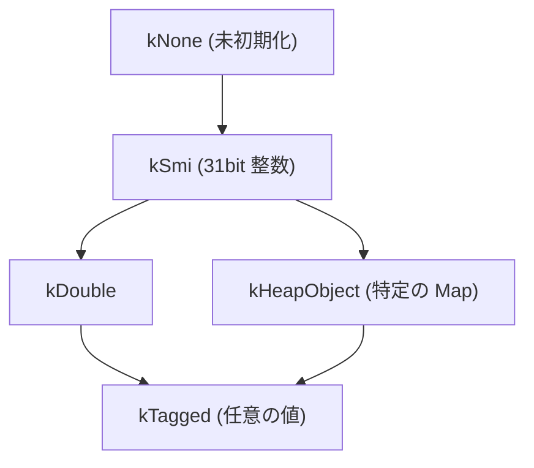

矢印は「より具体的な表現から、より一般的な表現へ」というgeneralizeの方向を表します。

generalizeの規則は、両方が比較可能な経路上なら大きい方、そうでなければTaggedに格上げします。たとえばSmiとHeapObjectの最小上界はTaggedになります。

#### In-place generalization と Map deprecation

```cpp
// src/objects/property-details.h:141-169
bool MightCauseMapDeprecation() const {
  if (IsTagged() || IsHeapObject() || IsDouble() || IsWasmValue()) {
    return false;
  }
  // None to double and smi to double representation changes require
  // deprecation, because doubles might require box allocation.
  DCHECK(IsNone() || IsSmi());
  return true;
}

bool CanBeInPlaceChangedTo(const Representation& other) const {
  if (Equals(other)) return true;
  if (IsWasmValue() || other.IsWasmValue()) return false;
  if (IsNone()) return !other.IsDouble();
  if (!other.IsTagged()) return false;
  return true;
}
```

Representationの変更には二種類あります。In-place generalizationはフィールドの記憶域レイアウトを変えずにできる遷移で、TaggedやHeapObjectやDoubleのあいだの変更、HeapObjectからTaggedへの変更などはフィールドの占有ワード数が変わらないためMapのフィールドの記述だけを更新すればよいです。Map deprecationはフィールドのバイト数自体が変わる遷移で、Smi (タグ付き1ワード) からDouble (unboxed 2ワード) への変更などは古いMapをdeprecatedにして新しいMapを作り直しインスタンスをマイグレーションする必要があります。

### 3.12 具体的な Transition 例

`const o = {}; o.x = 1; o.y = 2;` のMap遷移を段階的に追います。

**ステップ 1**: `const o = {}` で初期Map M0を使用。

**ステップ 2**: `o.x = 1` で `TransitionToDataProperty` が呼ばれます。

```cpp
// src/objects/map.cc:2124-2163 抜粋
DirectHandle<Map> Map::TransitionToDataProperty(...)  {
  MaybeHandle<Map> maybe_transition = TransitionsAccessor::SearchTransition(
      isolate, map, *name, PropertyKind::kData, attributes);
  Handle<Map> transition;
  if (maybe_transition.ToHandle(&transition)) {
    return UpdateDescriptorForValue(...);
  }
  ...
  if (!map->TooManyFastProperties(store_origin)) {
    Representation representation;
    std::tie(representation, constness) =
        Object::OptimalRepresentation(*value, constness);
    DirectHandle<FieldType> type =
        Object::OptimalType(*value, isolate, representation);
    maybe_map = Map::CopyWithField(isolate, map, name, type, attributes,
                                   constness, representation, flag);
  }
```

`SearchTransition(M0, "x", kData, NONE)` でtransitionを検索し、既に `"x"` でtransitionしている子Map M1があればそれを返します。最初の実行では新Mapを作ります。

**ステップ 3**: `o.y = 2` でM1からM2へのtransitionを作成。M2を作るとき `Map::CopyAddDescriptor` の判定で `ShareDescriptor` が呼ばれ、M1がDA_1を所有していてtransitionを増やせるなら、DA_1をin-placeで拡張してM2もそれを共有します。M1は `number_of_own_descriptors = 1` で先頭1 entryのみ見て、M2は `number_of_own_descriptors = 2` で2 entry全部を見るという解釈で共有が成立します。

### 3.13 Dictionary mode への degrade

Map transition treeが無限に成長するのを避けるため、次のいずれかが起きると正規化されます。

```cpp
// src/objects/map-inl.h:291-300
bool Map::TooManyFastProperties(StoreOrigin store_origin) const {
  if (UnusedPropertyFields() != 0) return false;
  if (store_origin != StoreOrigin::kMaybeKeyed) return false;
  if (is_prototype_map()) return false;
  int limit = std::max(
      {v8_flags.fast_properties_soft_limit.value(), GetInObjectProperties()});
  int external =
      NumberOfFields(ConcurrencyMode::kSynchronous) - GetInObjectProperties();
  return external > limit;
}
```

v8_flagsの `fast_properties_soft_limit` は12、`max_fast_properties` は128がデフォルトです。動的キーアクセスでこれを超えるとdictionary modeに落ちます。

### 3.14 Map Stability と Deoptimization

```cpp
// src/objects/map-inl.h:870-876
void Map::NotifyLeafMapLayoutChange(Isolate* isolate) {
  if (is_stable()) {
    mark_unstable();
    DependentCode::DeoptimizeDependencyGroups<Map>(
        isolate, this, DependentCode::kPrototypeCheckGroup);
  }
}
```

stableな葉のMapに対してtransitionが新たに追加されると、`kPrototypeCheckGroup` に登録された最適化コードがdeoptされます。

DependentCodeは「Map ↔ 最適化コード」の依存関係を管理するWeakArrayListです。

```cpp
// src/objects/dependent-code.h:35-73
enum DependencyGroup {
  kTransitionGroup = 1 << 0,
  kPrototypeCheckGroup = 1 << 1,
  kPropertyCellChangedGroup = 1 << 2,
  kFieldTypeGroup = 1 << 3,
  kFieldConstGroup = 1 << 4,
  kFieldRepresentationGroup = 1 << 5,
  kInitialMapChangedGroup = 1 << 6,
  kAllocationSiteTenuringChangedGroup = 1 << 7,
  kAllocationSiteTransitionChangedGroup = 1 << 8,
  ...
};
```

最適化コードは「ここで仮定しているMapの挙動」をDependentCodeに登録し、その仮定が崩れた瞬間にdeoptされます。これがいわゆるEager Deoptimizationの核心です。

### 3.15 PrototypeInfo と prototype chain validity cell

prototypeとして使われているMap (is_prototype_map = true) は、TransitionArrayの代わりにPrototypeInfoを持ちます。

```cpp
// src/objects/map.h:563-583
// [prototype chain validity cell]: Associated with a prototype object,
// stored in that object's map, indicates that prototype chains through this
// object are currently valid. The cell will be invalidated and replaced when
// the prototype chain changes.
static constexpr Tagged<ClearedWeakValue> kPrototypeChainInvalid =
    kClearedWeakValue;

static constexpr Tagged<Smi> kNoValidityCellSentinel = Smi::zero();
```

validity cellはCellオブジェクトで、その中身が有効 (任意の非無効値) ならprototype chainが変わっていないことが保証され、ICはチェーン全体の探索をスキップできます。prototypeが変わった瞬間、cellの中身を `kClearedWeakValue` に書き換えることで、すべての関連ICが一斉に「もう信用できない」状態になります。

これは「読み取り側を高速化し、書き込み側でコストを払う」設計で、prototype変更は稀だから許容できます。

## 第4章 JSObject のレイアウトと Properties / Elements

### 4.1 クラス階層の全貌

V8におけるJavaScriptオブジェクトは、HeapObjectを根とする多段継承で構成されています。

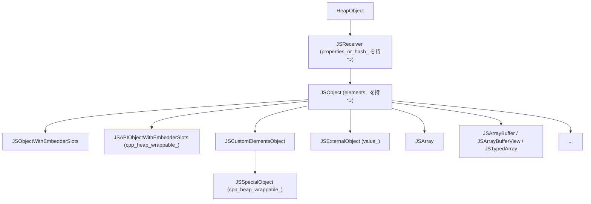

`JSReceiver` は「プロパティを定義できるオブジェクト」を表す抽象基底で、`JSObject` と `JSProxy` の共通親です。`JSCustomElementsObject` はelements_ がempty_fixed_arrayであってもカスタム要素アクセスが可能であることを型システムに伝えるためのマーカクラスです。`JSSpecialObject` はさらにJSGlobalObjectやJSGlobalProxyのような特殊オブジェクトに対する受け皿です。

### 4.2 ヘッダの正確なバイト並び

JSReceiverは厳密に1個のメンバを持ちます。

```cpp
// src/objects/js-objects.h:372-374
 public:
  TaggedMember<PropertiesOrHash> properties_or_hash_;
} V8_OBJECT_END;
```

JSObjectはJSReceiverを継承した上で1個のメンバ `elements_` を持ちます。

```cpp
// src/objects/js-objects.h:1027-1029
 public:
  TaggedMember<FixedArrayBase> elements_;
} V8_OBJECT_END;
```

各オフセットの定義です。

```cpp
// src/objects/js-objects.h:382-384
static const int kEndOfStrongFieldsOffset;
static const int kHeaderSize;
static constexpr int kMapOffset = offsetof(HeapObject, map_);
```

`kHeaderSize` は `sizeof(JSObject)` で計算されます。ポインタ圧縮が有効な64ビット環境では `kTaggedSize = 4` バイトとなり、JSObjectヘッダは以下のバイト配置です。

JSObjectのレイアウト (`V8_COMPRESS_POINTERS` 有効, 64bit) は次のとおりです。

| オフセット | フィールド | 型 | サイズ | 由来 |
|------------|------------|----|--------|------|
| 0 | `map_` | `Tagged<Map>` | 4B | HeapObject から継承 |
| 4 | `properties_or_hash_` | `Tagged<PropertiesOrHash>` | 4B | JSReceiver から継承 |
| 8 | `elements_` | `Tagged<FixedArrayBase>` | 4B | JSObject 固有 |
| 12 | in-object property 0, 1, ... | | 各 4B | Map に従って可変個 |

非圧縮64ビット環境ではすべてのスロットが8バイトに広がり、`kHeaderSize = 24` バイトになります。

### 4.3 PropertiesOrHash の 5 つの状態

`properties_or_hash_` フィールドは5つの異なる種類の値を保持できます。

```cpp
// src/objects/js-objects.h:74-90
// There are five possible values for the properties offset.
// 1) EmptyFixedArray/EmptyPropertyDictionary - This is the standard
// placeholder.
// 2) Smi - This is the hash code of the object.
// 3) PropertyArray - This is similar to a FixedArray but stores
// the hash code of the object in its length field. This is a fast
// backing store.
// 4) NameDictionary - This is the dictionary-mode backing store.
// 4) GlobalDictionary - This is the backing store for the
// GlobalObject.
```

この多態性のためにフィールドの型は `UnionOf<SwissNameDictionary, FixedArrayBase, PropertyArray, Smi, GlobalDictionary>` というユニオン型になっています。

```cpp
// src/objects/js-objects.h:47-50
using Properties =
    UnionOf<SwissNameDictionary, FixedArrayBase, PropertyArray>;
using PropertiesOrHash = UnionOf<SwissNameDictionary, FixedArrayBase,
                                 PropertyArray, Smi, GlobalDictionary>;
```

なぜ1つのフィールドに5種類を詰め込むのか。それはオブジェクトのサイズを最小化するためです。新しく作られたばかりのオブジェクトはプロパティが少なくhashも計算されていないためEmptyFixedArrayを指しているだけで十分。後からhashが必要になればSmiに書き換え、プロパティがin-objectスロットからあふれればPropertyArrayを割り当てる、というように動的にレイアウトを変える設計です。

### 4.4 In-object Properties の物理配置

JSObjectのサイズはMapによって決まるinstance_sizeで確定し、ヘッダの直後にin-object property用のスロットが連続して並びます。

```cpp
// src/objects/map-inl.h:453-455
int Map::GetInObjectPropertyOffset(int index) const {
  return (GetInObjectPropertiesStartInWords() + index) * kTaggedSize;
}
```

JSObjectの場合、`GetInObjectPropertiesStartInWords` はほぼ常に `JSObject::kHeaderSize / kTaggedSize` と等しい値ですが、`JSArray` のようにサブクラスがさらに固定フィールドを追加していると、その分だけ後ろにずれます。`JSArray` は `length_` を追加で持つため、in-objectプロパティの開始位置はヘッダ + lengthの後になります。

`GetInObjectProperties` の計算は `instance_size_in_words - GetInObjectPropertiesStartInWords()` で行われます。

```cpp
// src/objects/map-inl.h:427-430
int Map::GetInObjectProperties() const {
  DCHECK(IsJSObjectMap(this));
  return instance_size_in_words() - GetInObjectPropertiesStartInWords();
}
```

instance_sizeを1バイトで表現し (`kMaxInstanceSize = 255 * kTaggedSize`)、開始位置も1バイトで表現することで、Mapに追加される情報を最小化しています。

#### なぜ in-object であるべきか

In-objectプロパティの最大の価値は、ポインタを1段減らせることです。out-of-objectなPropertyArrayにプロパティが格納されている場合、`obj -> properties_or_hash -> array[i]` という2段の間接参照になります。in-objectなら `obj.field_at_offset` の1段で済みます。これはV8が生成する機械語の差として大きく表れます。さらに、TurboFanやMaglevのような最適化コンパイラは、Map (シェイプ) が安定していればin-objectプロパティへのloadを完全にインライン化でき、register allocatorもより自由に動作できます。

### 4.5 プロパティ追加の流れ - JSObject::AddProperty

```cpp
// src/objects/js-objects.cc:3734-3759
void JSObject::AddProperty(Isolate* isolate, DirectHandle<JSObject> object,
                           DirectHandle<Name> name, DirectHandle<Object> value,
                           PropertyAttributes attributes) {
  name = isolate->factory()->InternalizeName(name);
  if (TryFastAddDataProperty(isolate, object, name, value, attributes)) {
    return;
  }
  LookupIterator it(isolate, object, name, object,
                    LookupIterator::OWN_SKIP_INTERCEPTOR);
  ...
}
```

重要なのは `TryFastAddDataProperty` の呼び出しです。

```cpp
// src/objects/js-objects.cc:3697-3717
bool TryFastAddDataProperty(Isolate* isolate, DirectHandle<JSObject> object,
                            DirectHandle<Name> name, DirectHandle<Object> value,
                            PropertyAttributes attributes) {
  DCHECK(IsUniqueName(*name));
  Tagged<Map> map =
      TransitionsAccessor(isolate, object->map())
          .SearchTransition(*name, PropertyKind::kData, attributes);
  if (map.is_null()) return false;
  ...
}
```

最初に行うのはTransitionsAccessorによる既存遷移の検索です。同じ名前のプロパティが追加された経歴があれば、その遷移先Mapを再利用できます。これがV8のHidden Class (Map) 最適化の核心です。同じ形のオブジェクトを作るJavaScriptコードは、何度実行されても同じMap遷移チェーンをたどるため、新たなMap生成が発生しません。

### 4.6 In-object スロットが足りなくなったとき - MigrateFastToFast

スロットが満タンになった瞬間に何が起きるかは `MigrateFastToFast` に書かれています。

```cpp
// src/objects/js-objects.cc:3236-3263
// This migration is a transition from a map that has run out of property
// space. Extend the backing store.
int grow_by = new_map->UnusedPropertyFields() + 1;
DirectHandle<PropertyArray> old_storage(object->property_array(), isolate);
DCHECK_GE(grow_by, 0);
DirectHandle<PropertyArray> new_storage =
    isolate->factory()->CopyPropertyArrayAndGrow(
        old_storage, static_cast<uint32_t>(grow_by));
...
```

ここで `grow_by = new_map->UnusedPropertyFields() + 1` という計算が肝です。一度に複数スロット分の余裕を確保することで、続けて1つずつプロパティを足していく一般的なパターンでも頻繁な再アロケーションを避けられます。

```cpp
// src/objects/js-objects.h:972-977
// When extending the backing storage for property values, we increase
// its size by more than the 1 entry necessary, so sequentially adding fields
// to the same object requires fewer allocations and copies.
static const int kFieldsAdded = 3;
```

3個ずつ拡張するヒューリスティクスです。

### 4.7 PropertyArray - out-of-object プロパティの実体

#### length と hash を 1 つの Smi に詰める

```cpp
// src/objects/property-array.h:67-72
static const int kLengthFieldSize = 10;
using LengthField = base::BitField<int, 0, kLengthFieldSize>;
static const int kMaxLength = LengthField::kMax;
using HashField = base::BitField<int, kLengthFieldSize,
                                 kSmiValueSize - kLengthFieldSize - 1>;
static const int kNoHashSentinel = 0;
```

PropertyArrayはlengthとhashを1個のSmi `length_and_hash_` に詰めています。

```cpp
// src/objects/property-array.h:82-89
 public:
  TaggedMember<Smi> length_and_hash_;
  FLEXIBLE_ARRAY_MEMBER(TaggedMember<Object>, objects);
} V8_OBJECT_END;
```

低位10ビットがlength、それ以上がhashです。Smiは32ビット圧縮環境では31ビットなので、ハッシュには十分なビット数が残ります。lengthが10ビットということは最大1023個のスロットを持てる、つまり1オブジェクトに1023個までのout-of-objectプロパティを保持できます。これより多い場合はdictionary modeに落とします。

なぜこんなに密に詰め込むのか。それはPropertyArrayヘッダ自体のサイズを最小化したいからです。1ワード追加すると、すべてのPropertyArrayインスタンスに対してメモリオーバーヘッドが生じます。

#### In-object と out-of-object をどう区別するか

FieldIndex (`src/objects/field-index.h`) という抽象化層が用意されています。

```cpp
// src/objects/js-objects-inl.h:407-414
Tagged<JSAny> JSObject::RawFastPropertyAt(FieldIndex index) const {
  if (index.is_inobject()) {
    return TaggedField<JSAny>::Relaxed_Load(this, index.offset());
  } else {
    return UncheckedCast<JSAny>(
        property_array()->get(index.outobject_array_index()));
  }
}
```

`is_inobject` のビット1つで分岐し、in-objectならJSObject自身から、そうでなければPropertyArrayから読み出します。

### 4.8 Slow Properties (Dictionary Mode)

#### NameDictionary と SwissNameDictionary の二択

V8はビルドオプション `V8_ENABLE_SWISS_NAME_DICTIONARY_BOOL` によって2種類のdictionary実装を切り替えます。

```cpp
// src/objects/js-objects.cc:3429-3435
DirectHandle<NameDictionary> dictionary;
DirectHandle<SwissNameDictionary> ord_dictionary;
if constexpr (V8_ENABLE_SWISS_NAME_DICTIONARY_BOOL) {
  ord_dictionary = isolate->factory()->NewSwissNameDictionary(property_count);
} else {
  dictionary = isolate->factory()->NewNameDictionary(property_count);
}
```

V8 9系以降の主流はSwissNameDictionaryです。これはGoogleのAbseilライブラリのflat_hash_mapをベースにしており、SIMD命令を用いて高速にエントリを探索できます。

#### SwissNameDictionary の革新的レイアウト

```cpp
// src/objects/swiss-name-dictionary.h:27-34
// Memory layout (see below for detailed description of parts):
//   Prefix:                      [table type dependent part, can have 0 size]
//   Capacity:                    4 bytes, raw int32_t
//   Meta table pointer:          kTaggedSize bytes
//   Data table:                  2 * |capacity| * |kTaggedSize| bytes
//   Ctrl table:                  |capacity| + |kGroupWidth| uint8_t entries
//   PropertyDetails table:       |capacity| uint_8 entries
```

レイアウトを図示すると次のようになります。

SwissNameDictionaryのレイアウトは次のとおりです。

| オフセット | フィールド | サイズ | 説明 |
|------------|------------|--------|------|
| offset 0 | HeapObject header (map) | | |
| PrefixOffset | identity hash (uint32_t) | 4B | |
| CapacityOffset | capacity (int32_t) | 4B | |
| MetaTablePtr | meta_table_ptr (Tagged) | | ByteArray ptr |
| DataTableStart | Data Table `[key0][val0][key1][val1]...` | 2 * capacity * kTaggedSize | |
| CtrlTableStart | Control Table `[c0][c1]...[c_n][copy0]...` | capacity + kGroupWidth bytes | |
| PropDetailsTable | Property Details Table `[d0][d1]...[d_n]` | capacity bytes | |

Ctrl Tableは1バイトずつのコントロールバイトがcapacity個並びます。

```cpp
// src/objects/swiss-hash-table-helpers.h:171-180
using ctrl_t = signed char;
using h2_t = uint8_t;

enum Ctrl : ctrl_t {
  kEmpty = -128,   // 0b10000000
  kDeleted = -2,   // 0b11111110
  kSentinel = -1,  // 0b11111111
};
```

エントリが使用中の場合、ctrl_tにはハッシュの下位7ビット (H2) が入ります。空、削除済み、番兵はそれぞれMSBを立てた特殊値です。

ハッシュをH1とH2に分けるのは、H1は最初の探索位置 (どのグループから探すか) を決め、H2はctrlテーブルに格納してエントリの絞り込みに使うためです。SIMDレジスタに16個のctrl_tを読み込み、`_mm_cmpeq_epi8` でH2を一斉に比較すれば、16個のエントリを1命令で照合できます。これがSwiss Tableの高速性の正体です。

#### Dictionary Mode に落ちるトリガ

```cpp
// src/objects/map-inl.h:291-300
bool Map::TooManyFastProperties(StoreOrigin store_origin) const {
  if (UnusedPropertyFields() != 0) return false;
  if (store_origin != StoreOrigin::kMaybeKeyed) return false;
  if (is_prototype_map()) return false;
  int limit = std::max(
      {v8_flags.fast_properties_soft_limit.value(), GetInObjectProperties()});
  int external =
      NumberOfFields(ConcurrencyMode::kSynchronous) - GetInObjectProperties();
  return external > limit;
}
```

`v8_flags.fast_properties_soft_limit` のデフォルト値は通常12程度です。これを超え、かつ動的キーアクセスでさらに追加されるとslow modeに落ちます。

### 4.9 JSArray のレイアウト

```cpp
// src/objects/js-array.h:25-31, 159-163
V8_OBJECT class JSArray : public JSObject {
 public:
  inline Tagged<Number> length() const;
  ...
 public:
  TaggedMember<Number> length_;
} V8_OBJECT_END;
```

JSArrayはJSObjectにlength_ を1つ追加しただけのオブジェクトです。lengthは `Number` 型、つまりSmiまたはHeapNumber (32bit unsigned intの最大値2^32 - 1まで保持可能なので、大きな配列ではHeapNumberになる) です。

JSArrayのレイアウト (圧縮ポインタ64bit) は次のとおりです。

| オフセット | フィールド | サイズ | 説明 |
|------------|------------|--------|------|
| 0 | `map_` | 4B | |
| 4 | `properties_or_hash_` | 4B | |
| 8 | `elements_` | 4B | FixedArray / FixedDoubleArray |
| 12 | `length_` | 4B | |
| 16 | in-object property 0 ... | | |

JSArray::kHeaderSizeは通常16バイトです。

elementsのlengthとJSArrayのlengthは意味的に別物です。`arr.length = 100` した時点でelementsには4要素しかなくても、JSArray::lengthは100になります (穴あき配列)。逆にelements自体はcapacityを確保するためpushのたびに伸びるけれどlengthを増やしてもらわないと配列の論理長は変わりません。

### 4.10 JSArrayBuffer の構造

```cpp
// src/objects/js-array-buffer.h:229-239
 public:
  TaggedMember<MaybeObject> views_or_detach_key_;
  UnalignedValueMember<uintptr_t> raw_byte_length_;
  UnalignedValueMember<uintptr_t> raw_max_byte_length_;
  UnalignedValueMember<Address> backing_store_;
  ExternalPointerMember<kArrayBufferExtensionTag> extension_;
  uint32_t bit_field_;
```

backing_storeはサンドボックス内のヒープには置けない (任意のサイズのため) ので、`UnalignedValueMember<Address>` という生のポインタとして保持します。`bit_field_` にはis_external, is_detachable, was_detached, is_shared, is_resizable_by_js, is_immutableといったフラグが入ります。

### 4.11 JSTypedArray の構造

```cpp
// src/objects/js-array-buffer.h:586-590
 public:
  UnalignedValueMember<uintptr_t> raw_length_;
  UnalignedValueMember<Address> external_pointer_;
  TaggedMember<Object> base_pointer_;
} V8_OBJECT_END;
```

`length` は要素数 (バイト数ではない)。`byte_offset` はArrayBuffer内の開始バイト位置。`base_pointer` はon-heap TypedArrayのときにbacking storeのByteArrayを指し、off-heapのときはSmi::zero()。`external_pointer` はoff-heapデータへの直接ポインタ。on-heapのときも使われ、base_pointer + external_pointerで計算するためのoffsetとして機能します。

```cpp
// src/objects/js-array-buffer.h:515-525
// Note: this is a pointer compression specific optimization.
// Normally, on-heap typed arrays contain HeapObject value in |base_pointer|
// field and an offset in |external_pointer|.
// When pointer compression is enabled we want to combine decompression with
// the offset addition. In order to do that we add an isolate root to the
// |external_pointer| value and therefore the data pointer computation can
// is a simple addition of a (potentially sign-extended) |base_pointer| loaded
// as Tagged_t value and an |external_pointer| value.
```

base_pointer (32ビットTagged) を符号拡張して64ビットにした値と、external_pointerの値を加算するだけで実データポインタが得られます。オンヒープでもオフヒープでも同じ機械語パスで動かせるため、TypedArrayアクセスのループで分岐がなくなります。

`kMaxSizeInHeap = 64` という閾値があり、64バイト以下のTypedArrayはon-heapで作成されます。それ以上はオフヒープになります。

## 第5章 ElementsKind 完全列挙と遷移

### 5.1 elements_ フィールドの意味

JSObject::elements_ は単純な `Tagged<FixedArrayBase>` です。しかしこの1フィールドの裏側に、すさまじく多くの実体型があります。`elements_` が指すものはMapの `elements_kind` フィールドに従って解釈されます。

- PACKED_SMI_ELEMENTS, HOLEY_SMI_ELEMENTS, PACKED_ELEMENTS, HOLEY_ELEMENTSのときはFixedArrayを指す
- PACKED_DOUBLE_ELEMENTS, HOLEY_DOUBLE_ELEMENTSのときはFixedDoubleArrayを指す
- DICTIONARY_ELEMENTSのときはNumberDictionaryを指す
- FAST_SLOPPY_ARGUMENTS_ELEMENTS / SLOW_SLOPPY_ARGUMENTS_ELEMENTSのときはSloppyArgumentsElementsを指す
- 各TypedArrayのElementsのときはbacking storeの参照を表すByteArrayなどを指す

「elements_ をどう解釈するか」は完全にMapに書かれたelements_kindに依存します。

### 5.2 配列リテラル `[1, 2, 3]` の挙動

新しく `[1, 2, 3]` を作ると、ElementsKindは最も狭い `PACKED_SMI_ELEMENTS` から始まります。

```cpp
// src/objects/elements-kind.h:274
inline ElementsKind GetInitialFastElementsKind() { return PACKED_SMI_ELEMENTS; }
```

backing storeは3要素のFixedArrayが確保され、各スロットにはSmiで1, 2, 3が入ります。空配列でも4要素分の領域を先取りします。

```cpp
// src/objects/js-array.h:128-129
// Number of element slots to pre-allocate for an empty array.
static const int kPreallocatedArrayElements = 4;
```

これにより `push` を4回までは追加アロケーションなしで実行できます。

### 5.3 全 ElementsKind の正確な列挙

```cpp
// src/objects/elements-kind.h:105-183 抜粋
enum ElementsKind : uint8_t {
  PACKED_SMI_ELEMENTS,      // 0
  HOLEY_SMI_ELEMENTS,       // 1
  PACKED_ELEMENTS,          // 2
  HOLEY_ELEMENTS,           // 3
  PACKED_DOUBLE_ELEMENTS,   // 4
  HOLEY_DOUBLE_ELEMENTS,    // 5
  PACKED_NONEXTENSIBLE_ELEMENTS,
  HOLEY_NONEXTENSIBLE_ELEMENTS,
  PACKED_SEALED_ELEMENTS,
  HOLEY_SEALED_ELEMENTS,
  PACKED_FROZEN_ELEMENTS,
  HOLEY_FROZEN_ELEMENTS,
  SHARED_ARRAY_ELEMENTS,
  DICTIONARY_ELEMENTS,
  FAST_SLOPPY_ARGUMENTS_ELEMENTS,
  SLOW_SLOPPY_ARGUMENTS_ELEMENTS,
  FAST_STRING_WRAPPER_ELEMENTS,
  SLOW_STRING_WRAPPER_ELEMENTS,
  // Fixed typed arrays
  UINT8_ELEMENTS, INT8_ELEMENTS, UINT16_ELEMENTS, INT16_ELEMENTS,
  UINT32_ELEMENTS, INT32_ELEMENTS, BIGUINT64_ELEMENTS, BIGINT64_ELEMENTS,
  UINT8_CLAMPED_ELEMENTS, FLOAT32_ELEMENTS, FLOAT64_ELEMENTS, FLOAT16_ELEMENTS,
  // RAB/GSAB typed arrays
  RAB_GSAB_UINT8_ELEMENTS, ...,
  WASM_ARRAY_ELEMENTS,
  NO_ELEMENTS,
};
```

`kElementsKindBits = 6` なので、Mapのビットフィールドに6ビットで詰め込めます。

```cpp
// src/objects/elements-kind.h:193-195
constexpr int kElementsKindBits = 6;
static_assert((1 << kElementsKindBits) > LAST_ELEMENTS_KIND);
static_assert((1 << (kElementsKindBits - 1)) <= LAST_ELEMENTS_KIND);
```

PACKEDとHOLEYの対が連番で配置されていることに注目してください。`HOLEY_SMI_ELEMENTS - PACKED_SMI_ELEMENTS = 1` であり、これが `kFastElementsKindPackedToHoley` として定義されています。

```cpp
// src/objects/elements-kind.h:189-191
constexpr int kFastElementsKindPackedToHoley =
    HOLEY_SMI_ELEMENTS - PACKED_SMI_ELEMENTS;
```

この設計のおかげで `IsHoleyElementsKind` は単純なbit検査になります。

```cpp
// src/objects/elements-kind.h:435-437
constexpr bool IsHoleyElementsKind(ElementsKind kind) {
  return kind % 2 == 1 && kind <= HOLEY_DOUBLE_ELEMENTS;
}
```

最下位ビットが1かを見るだけでpackedかholeyか判定できます。生成コードでは `test al, 1` の1命令です。

### 5.4 遷移の単方向性

ElementsKind遷移は不可逆 (単方向) です。一度PACKED_ELEMENTSまで広がったら、二度とPACKED_SMI_ELEMENTSには戻れません。

```cpp
// src/objects/elements-kind.cc:184-207
bool IsMoreGeneralElementsKindTransition(ElementsKind from_kind,
                                         ElementsKind to_kind) {
  if (!IsFastElementsKind(from_kind)) return false;
  if (!IsFastTransitionTarget(to_kind)) return false;
  switch (from_kind) {
    case PACKED_SMI_ELEMENTS:
      return to_kind != PACKED_SMI_ELEMENTS;
    case HOLEY_SMI_ELEMENTS:
      return to_kind != PACKED_SMI_ELEMENTS && to_kind != HOLEY_SMI_ELEMENTS;
    case PACKED_DOUBLE_ELEMENTS:
      return to_kind != PACKED_SMI_ELEMENTS && to_kind != HOLEY_SMI_ELEMENTS &&
             to_kind != PACKED_DOUBLE_ELEMENTS;
    case HOLEY_DOUBLE_ELEMENTS:
      return to_kind == PACKED_ELEMENTS || to_kind == HOLEY_ELEMENTS;
    case PACKED_ELEMENTS:
      return to_kind == HOLEY_ELEMENTS;
    case HOLEY_ELEMENTS:
      return false;
    default:
      return false;
  }
}
```

これを図示すると以下のようになります。

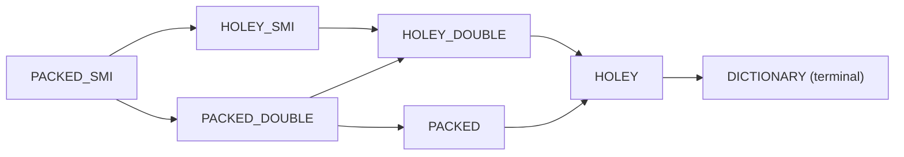

上図はFast ElementsのElementsKind遷移グラフです。

矢印はすべて一方向です。HOLEYからはPACKEDに戻れず、DOUBLEからはSMIに戻れず、終端はHOLEY_ELEMENTSまたはDICTIONARY_ELEMENTSのみです。

シーケンス順序は `kFastElementsKindSequence` 配列で定義されています。

```cpp
// src/objects/elements-kind.cc:143-158
const ElementsKind kFastElementsKindSequence[kFastElementsKindCount] = {
    PACKED_SMI_ELEMENTS,     // 0
    HOLEY_SMI_ELEMENTS,      // 1
    PACKED_DOUBLE_ELEMENTS,  // 2
    HOLEY_DOUBLE_ELEMENTS,   // 3
    PACKED_ELEMENTS,         // 4
    HOLEY_ELEMENTS           // 5
};
```

### 5.5 holey 化のトリガと the_hole_value

PACKEDからHOLEYに遷移するのは、配列中に穴が生まれる可能性のある操作が行われた場合です。`arr[100] = x` のようにlengthを超えるインデックスへの書き込み、`delete arr[5]`、`arr.length = 100` でのlength拡大、setter (getter/setterプロパティ) の定義などです。

穴は具体的に `the_hole_value` という特殊なHeapObjectで表されます (FixedArrayの場合)、または `kHoleNanInt64` という特殊なsignaling NaNのビットパターン (FixedDoubleArrayの場合) で表されます。

```cpp
// src/objects/js-objects-inl.h:180-186
Tagged<Object> the_hole = GetReadOnlyRoots().the_hole_value();
TSlot end = elements + count;
for (; elements < end; ++elements) {
  Tagged<Object> current = *elements;
  if (current == the_hole) {
    is_holey = true;
    target_kind = GetHoleyElementsKind(target_kind);
```

穴の判定が大事なのは、HOLEY_ELEMENTSのloadはプロトタイプチェーンへのフォールスルーが必要になるからです。例えば `arr[3]` が穴なら、JavaScriptの意味論では `Array.prototype[3]` を見に行く必要があるためです。これが速度のロスをもたらすため、TurboFanは配列がPACKEDであることを保証できれば穴チェックを省略します。

### 5.6 TypedArray の Elements Kinds

TypedArrayのElementsは基本的に「backing storeのview」です。

```cpp
// src/objects/elements-kind.h:213-247 抜粋
case UINT8_ELEMENTS:
case INT8_ELEMENTS:
case UINT8_CLAMPED_ELEMENTS:
  return 0;  // 1 byte
case UINT16_ELEMENTS:
case INT16_ELEMENTS:
case FLOAT16_ELEMENTS:
  return 1;  // 2 bytes
case UINT32_ELEMENTS:
case INT32_ELEMENTS:
case FLOAT32_ELEMENTS:
  return 2;  // 4 bytes
case PACKED_DOUBLE_ELEMENTS:
case HOLEY_DOUBLE_ELEMENTS:
case FLOAT64_ELEMENTS:
case BIGINT64_ELEMENTS:
case BIGUINT64_ELEMENTS:
  return 3;  // 8 bytes
```

各ElementsKindは要素のバイトサイズを返すshift値を持ちます。`obj[i]` を計算するときは `base + (i << shift)` で行えるため、極めて高速です。

RAB/GSABバリアントはResizableArrayBuffer (RAB) / GrowableSharedArrayBuffer (GSAB) を裏付けとするTypedArrayのElementsです。普通のTypedArrayと異なり、長さが変動するため境界チェックが追加で必要です。それをElementsKindの段階で区別しています。

### 5.7 FixedArrayBase の共通ヘッダ

```cpp
// src/objects/fixed-array.h:445-475
class FixedArrayBase : public HeapObject {
 public:
  static constexpr int kLengthOffset = sizeof(HeapObject);
#if TAGGED_SIZE_8_BYTES
  static constexpr uint32_t kPaddingOffset = kLengthOffset + kUInt32Size;
  static constexpr uint32_t kHeaderSize = kPaddingOffset + kUInt32Size;
#else
  static constexpr uint32_t kHeaderSize = kLengthOffset + kUInt32Size;
#endif
  static constexpr uint32_t kMaxLength = FixedArray::kMaxCapacity;
  ...
 public:
  uint32_t length_;
#if TAGGED_SIZE_8_BYTES
  uint32_t optional_padding_;
#endif
} V8_OBJECT_END;
```

注目点はlengthが `uint32_t` であり、Smiではないことです。これはFixedArrayのlengthがGCではトラバースされない、純粋なメタデータだからです。ポインタ圧縮を使わない64ビットビルドでは、length後にパディング4バイトが入って8バイト境界に揃えられます。

FixedArrayのレイアウト (圧縮ポインタ64bit) は次のとおりです。

| オフセット | フィールド | サイズ |
|------------|------------|--------|
| 0 | `map_` (Tagged<Map>) | 4B |
| 4 | `length_` (uint32_t) | 4B |
| 8 | `objects[0]` (Tagged) | 4B |
| 12 | `objects[1]` | 4B |
| ... | ... | |

### 5.8 FixedDoubleArray の構造

```cpp
// src/objects/fixed-array.h:577-630 抜粋
V8_OBJECT class FixedDoubleArray
    : public PrimitiveArrayBase<FixedDoubleArray, double> {
  using Super = PrimitiveArrayBase<FixedDoubleArray, double>;
 public:
  static constexpr RootIndex kMapRootIndex = RootIndex::kFixedDoubleArrayMap;
  using ElementMemberT = UnalignedDoubleMember;
 public:
  uint32_t length_;
#if TAGGED_SIZE_8_BYTES
  uint32_t optional_padding_;
#endif
  FLEXIBLE_ARRAY_MEMBER(ElementMemberT, values);
} V8_OBJECT_END;
```

FixedDoubleArrayのElementは `UnalignedDoubleMember`、つまりアラインメントが保証されない8バイトdoubleです。ポインタ圧縮環境ではTaggedは4バイトですから、ヘッダが4 + 4 = 8バイトでも、Object pointerをフィールドの間に挟むとdoubleが4バイト境界に来てしまうことがあります。x86-64系ではunaligned double loadが許可されているので、こうしたレイアウトでも問題ありません。

### 5.9 PropertyAccess の実装 - LookupIterator

State機械としてのLookupIteratorの状態は以下のとおりです。

```cpp
// src/objects/lookup.h:70-118
enum State {
  NOT_FOUND,
  STRING_LOOKUP_START_OBJECT,
  TYPED_ARRAY_INDEX_NOT_FOUND,
  ACCESS_CHECK,
  INTERCEPTOR,
  JSPROXY,
  ACCESSOR,
  DATA,
  WASM_OBJECT,
  MODULE_NAMESPACE,
  TRANSITION,
  BEFORE_PROPERTY = INTERCEPTOR
};
```

LookupIteratorは、与えられたreceiverとnameに対し、プロトタイプチェーンを1段ずつ降りながらstateを更新していくステートマシンです。NOT_FOUNDからスタートし、INTERCEPTOR (API interceptorが刺さっているか)、ACCESS_CHECK (アクセス権検査)、JSPROXY (Proxyオブジェクト)、ACCESSOR (getter/setter)、DATA (普通のデータプロパティ) などの状態を経て、最終的に見つけたか見つからなかったかに落ち着きます。

DATAは通常のデータプロパティで、値はin-object slot、PropertyArray slot、Dictionary entry、Elementsのいずれかに存在します。`TYPED_ARRAY_INDEX_NOT_FOUND` はTypedArrayに整数インデックスでアクセスして範囲外だった場合、prototype chainを辿らずに即座にundefinedを返すという特殊な動作 (ES2015仕様) を表します。

## 第6章 String 階層

### 6.1 String 階層の全体像

V8の `String` は、JavaScriptの文字列値を表現する抽象クラスです。

```cpp
// src/objects/string.h:120
V8_OBJECT class String : public Name {
 public:
  enum Encoding { ONE_BYTE_ENCODING, TWO_BYTE_ENCODING };
  ...
  uint32_t length_;
} V8_OBJECT_END;
```

`String` は `Name` を継承し、`Name` は `PrimitiveHeapObject` を継承しています。

```cpp
// src/objects/name.h:83
V8_OBJECT class Name : public PrimitiveHeapObject {
  ...
  std::atomic_uint32_t raw_hash_field_;
} V8_OBJECT_END;
```

`Name` のオブジェクトレイアウトは以下のようになります。

| オフセット | フィールド | サイズ | 由来 |
|------------|------------|--------|------|
| 0 | `map_word` | 8 (or 4) | HeapObject から |
| 8 | `raw_hash_field_` | 4 | Name から |
| 12 | `length_` | 4 | String から |
| 16+ | (具体的な payload) | 可変 | |

Stringの具体的なサブクラス階層は以下のとおりです。

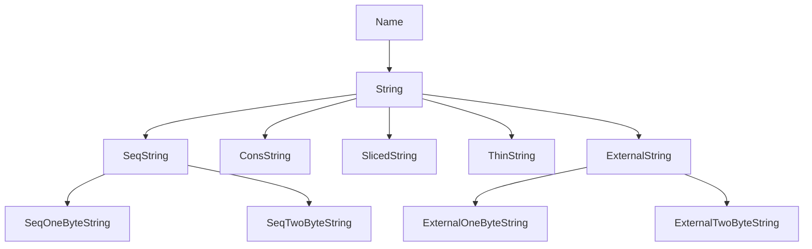

これらは表現 (representation) とエンコーディング (encoding) という2つの直交する軸を持ちます。これらはMap (隠しクラス) の `instance_type` フィールドに16ビットで詰め込まれています。

### 6.2 InstanceType のビット配置

文字列の場合、`instance_type` の最上位のbit 7-15がすべて0にクリアされており、それを判定するマスクは以下です。

```cpp
// src/objects/instance-type.h:25-26
const uint32_t kIsNotStringMask = ~((1 << 7) - 1);
const uint32_t kStringTag = 0x0;
```

文字列の場合、下位7ビットの内訳は次の通りです。

| ビット | フィールド | 意味 |
|--------|------------|------|
| bit 6 | Shared | 共有文字列か |
| bit 5 | Not Internalized | internalize されていないか |
| bit 4 | Uncached External | キャッシュ無しの external か |
| bit 3 | Encoding | 0=2byte / 1=1byte |
| bits 2-0 | Representation | 0=Seq / 1=Cons / 2=External / 3=Sliced / 5=Thin |

定数は次のように与えられています。

```cpp
// src/objects/instance-type.h:30-58
const uint32_t kStringRepresentationMask = (1 << 3) - 1;
enum StringRepresentationTag {
  kSeqStringTag = 0x0,
  kConsStringTag = 0x1,
  kExternalStringTag = 0x2,
  kSlicedStringTag = 0x3,
  kThinStringTag = 0x5
};
const uint32_t kIsIndirectStringMask = 1 << 0;
const uint32_t kIsIndirectStringTag = 1 << 0;
...
const uint32_t kStringEncodingMask = 1 << 3;
const uint32_t kTwoByteStringTag = 0;
const uint32_t kOneByteStringTag = 1 << 3;
```

ここで興味深いのは、表現タグのbit 0が「indirect文字列か否か」を表すように設計されている点です。Seq (0b000) とExternal (0b010) はbit 0が0でdirect、Cons (0b001), Sliced (0b011), Thin (0b101) はbit 0が1でindirectになっています。これによってひとつのビットテストで「中身を間接参照する必要があるか」を判定できます。

Internalized判定はbit 5です。

```cpp
// src/objects/instance-type.h:78-80
const uint32_t kIsNotInternalizedMask = 1 << 5;
const uint32_t kNotInternalizedTag = 1 << 5;
const uint32_t kInternalizedTag = 0;
```

逆になっており、internalizedの場合にbit 5が立たないのがポイントです。これは「internalized + symbol」を `FIRST_UNIQUE_NAME_TYPE..LAST_UNIQUE_NAME_TYPE` の連続した範囲としてレンジテスト可能にする工夫です。

### 6.3 StringShape

`StringShape` はinstance_typeのビットを1度だけロードして使い回すためのヘルパです。

```cpp
// src/objects/string.h:54-60
// The characteristics of a string are stored in its map.  Retrieving these
// few bits of information is moderately expensive, involving two memory
// loads where the second is dependent on the first.  To improve efficiency
// the shape of the string is given its own class so that it can be retrieved
// once and used for several string operations.
```

`String` → `Map` → `instance_type` の二段間接アクセスは依存ロードなのでパイプラインを止めるという問題があり、`StringShape` で1回キャッシュして利用する設計になっています。

### 6.4 SeqString - 連続した実体を持つ文字列

`SeqString` は文字列の実データが連続してin-lineに格納される唯一の実体表現です。

```cpp
// src/objects/string.h:891-951
V8_OBJECT class SeqOneByteString : public SeqString {
 public:
  static const bool kHasOneByteEncoding = true;
  using Char = uint8_t;
  ...
  FLEXIBLE_ARRAY_MEMBER(Char, chars);
} V8_OBJECT_END;
```

`FLEXIBLE_ARRAY_MEMBER` はC99のフレキシブル配列メンバ相当で、オブジェクトの末尾に長さ可変の配列を直接埋め込みます。`Char = uint8_t` はLatin-1 (ISO-8859-1) を意味し、`SeqTwoByteString` は `Char = uint16_t` でUTF-16のコードユニットを格納します。

`SeqOneByteString` のメモリレイアウトは次のとおりです。

| オフセット | フィールド | サイズ |
|------------|------------|--------|
| 0 | map | 8 |
| 8 | raw_hash_field | 4 |
| 12 | length | 4 |
| 16 | chars[0] | 1 |
| 17 | chars[1] | 1 |
| ... | ... | ... |
| 16+n | chars[n-1] | 1 |
| 16+n | (8B への padding) | 0-7 |

JavaScriptの文字列は仕様上UTF-16ですが、ASCII (0-127) やLatin-1 (0-255) の範囲しか含まないなら1 byte/charで表現すれば半分のメモリで済みます。`String::NonOneByteStart` は、UTF-16文字列の中で最初にLatin-1を超える文字が現れる位置を返します。

```cpp
// src/objects/string.h:617-656 抜粋
static inline uint32_t NonOneByteStart(const base::uc16* chars,
                                       uint32_t length) {
  ...
  if (static_cast<size_t>(length) >= kUIntptrSize) {
    // Check unaligned chars.
    while (!IsAligned(reinterpret_cast<Address>(chars), kUIntptrSize)) {
      if (*chars > unibrow::Latin1::kMaxChar) {
        return static_cast<uint32_t>(chars - start);
      }
      ++chars;
    }
    // Check aligned words.
    static_assert(unibrow::Latin1::kMaxChar == 0xFF);
#ifdef V8_TARGET_LITTLE_ENDIAN
    const uintptr_t non_one_byte_mask = kUintptrAllBitsSet / 0xFFFF * 0xFF00;
#else
    const uintptr_t non_one_byte_mask = kUintptrAllBitsSet / 0xFFFF * 0x00FF;
#endif
    while (chars + sizeof(uintptr_t) <= limit) {
      if (*reinterpret_cast<const uintptr_t*>(chars) & non_one_byte_mask) {
        break;
      }
      chars += (sizeof(uintptr_t) / sizeof(base::uc16));
    }
  }
```

8バイト境界に揃えてから、SWAR (SIMD Within A Register) で一度に4個のuint16_tを判定しています。`non_one_byte_mask` は各uint16_tの上位バイトに0xFFを立てたマスクで、ANDしてゼロでなければ非Latin-1文字が含まれていることがわかります。これにより4倍速で判定できます。

### 6.5 ConsString - 連結文字列の O(1) 連結

`+` 演算子で文字列を連結すると、毎回O(n+m) でコピーするのは非効率です。V8は二分木構造の `ConsString` を導入して、連結をO(1) にしています。

```cpp
// src/objects/string.h:1047-1099
V8_OBJECT class ConsString : public String {
 public:
  inline Tagged<String> first() const;
  inline Tagged<String> second() const;
  ...
  static const uint32_t kMinLength = 13;
 public:
  TaggedMember<String> first_;
  TaggedMember<String> second_;
} V8_OBJECT_END;
```

連結された文字列の論理長は `length` フィールドに直接持っており、`first()` と `second()` の合計と一致します。論理的な文字を取得するには木を辿ります。

#### ConsString の生成判断

`length < 13` (`ConsString::kMinLength`) の場合はそのままコピーして `SeqString` を作り、それ以上なら `ConsString` を作ります。なぜ13かというと、`ConsString` のヘッダ (16 + 8 + 8 = 32B) よりも `SeqOneByteString` (16 + 13 = 29B) が小さいため、短い文字列を木にしてもメモリは節約できないからです。

#### Flatten - 連結木の平坦化

木構造のままだと長い `ConsString` のi番目の文字を取り出すのに最悪O(depth) かかるため、ランダムアクセスする前に平坦化されます。

```cpp
// src/objects/string-inl.h:850-912 抜粋
V8_EXPORT_PRIVATE HandleType<String> String::SlowFlatten(
    Isolate* isolate, HandleType<ConsString> cons, AllocationType allocation) {
  DCHECK(!cons->IsFlat());
  ...
  HandleType<SeqString> result;
  if (is_one_byte_representation) {
    HandleType<SeqOneByteString> flat =
        isolate->factory()
            ->NewRawOneByteString(length, allocation)
            .ToHandleChecked();
    ...
    WriteToFlat2(flat->GetChars(no_gc), raw_cons, 0, length,
                 SharedStringAccessGuardIfNeeded::NotNeeded(), no_gc);
    raw_cons->set_first(*flat);
    raw_cons->set_second(ReadOnlyRoots(isolate).empty_string());
    result = flat;
  }
  ...
}
```

特筆すべきは、`ConsString` を破壊的に変形している点です。`first_` を新しく作った平坦化された `SeqString` で上書きし、`second_` を空文字列で上書きします。元の `ConsString` への外部参照はそのまま有効で、`first()` を辿ると平坦化されたものが見えます。これをV8では「in-place flatten」と呼びます。

### 6.6 SlicedString - 部分文字列のゼロコピー切り出し

`String.prototype.substring(s, e)` などは `SlicedString` で表現されることがあります。新しいバッファを確保せず、親文字列の中の `[offset, offset+length)` を指すだけです。

```cpp
// src/objects/string.h:1166-1199
V8_OBJECT class SlicedString : public String {
 public:
  inline Tagged<String> parent() const;
  inline int32_t offset() const;
  ...
  static const uint32_t kMinLength = 13;
  ...
  TaggedMember<String> parent_;
  TaggedMember<Smi> offset_;
} V8_OBJECT_END;
```

メモリレイアウトは `ConsString` と同形です。

#### 生成判断

```cpp
// src/heap/factory.cc:1467-1494
if (!v8_flags.string_slices || length < SlicedString::kMinLength) {
  return NewCopiedSubstring(str, begin, length);
}
int offset = begin;
if (IsSlicedString(*str)) {
  auto slice = Cast<SlicedString>(str);
  str = direct_handle(slice->parent(), isolate());
  offset += slice->offset();
}
if (IsThinString(*str)) {
  auto thin = Cast<ThinString>(str);
  str = direct_handle(thin->actual(), isolate());
}
DCHECK(IsSeqString(*str) || IsExternalString(*str));
```

第一に、`length < SlicedString::kMinLength (13)` ならコピーします。第二に、入力が既に `SlicedString` なら、そのparentとoffsetを平坦化して二重間接を避けます。第三に、parentは `SeqString` か `ExternalString` でなければなりません。

#### メモリリーク問題

`SlicedString` の最大の落とし穴は、巨大な親文字列の数バイトを切り出した瞬間に、親文字列をGCできなくなることです。例えば1GBのJSONを読み込み、その中の小さな文字列フィールドを保持し続けると、その小さい文字列が `SlicedString` なら1GBの親が解放されません。実用上は、JSON.parseの結果を `.slice()` で切り出した結果を `+ ''` で連結したり、何らかの方法で平坦化することで回避します。

### 6.7 ExternalString - V8 外部バッファへの参照

埋め込み先 (例えばChromeやNode.js) がすでにUTF-16 / Latin-1バッファを持っていて、それをV8にコピーせずそのまま見せたい場合があります。

```cpp
// src/objects/string.h:1209-1262
V8_OBJECT class UncachedExternalString : public String {
 protected:
  ExternalPointerMember<kExternalStringResourceTag> resource_;
} V8_OBJECT_END;

V8_OBJECT class ExternalString : public UncachedExternalString {
  ...
 protected:
  ExternalPointerMember<kExternalStringResourceDataTag> resource_data_;
} V8_OBJECT_END;
```

`ExternalString` は2つの外部ポインタを持ちます。`resource_` は `v8::String::ExternalStringResource*` あるいは `ExternalOneByteStringResource*` を指し、`resource_data_` は文字データそのものへのキャッシュ済みポインタです。

V8 Sandboxが有効な場合、ヒープ外への生ポインタを直接持つことは攻撃面拡大の元になります。そこで `ExternalPointerMember<Tag>` という抽象化が導入され、実体は外部ポインタテーブルへのインデックス (32ビット) として保存されます。

### 6.8 ThinString - Internalize 後のフォワーディング

`String.prototype.fromCharCode` などで作った文字列が、後でプロパティキーとして使われたとします。するとInternalizeされますが、もとの文字列を指していたポインタが古い文字列のままだと、毎回プロパティアクセスのたびにハッシュテーブルを引かないと同一判定ができません。`ThinString` はこの問題を解決します。

```cpp
// src/objects/string.h:1116-1147
V8_OBJECT class ThinString : public String {
 public:
  inline Tagged<InternalizedString> actual() const;
  ...
  TaggedMember<InternalizedString> actual_;
} V8_OBJECT_END;
```

`ThinString` はその名のとおり薄い文字列で、内部にinternalized版へのポインタ `actual_` を持つだけです。Internalizeは同じ文字列内容は同じオブジェクトを共有することを保証する操作ですが、既に他所から参照されている文字列を勝手に消すことはできません。そこで、もとのアドレスはそのままに、mapを `thin_one_byte_string_map` などに切り替え、payloadを `InternalizedString*` 1つにします。古いポインタは引き続き有効で、`Get(i)` や `Equals()` などの操作はThinString → actualを辿ります。

つまり、ThinStringはフォワーディングポインタそのものです。文字列の世界におけるMark-Compactのforwarding pointerに近いものですが、これはGC後も恒久的に残ります。

### 6.9 Internalization と String Table

`Internalize` は同一内容の文字列を1つの正規オブジェクトに集約する操作です。実体は `StringTable` という巨大なハッシュテーブルです。

```cpp
// src/objects/string-table.h:51-120
class V8_EXPORT_PRIVATE StringTable {
 public:
  static constexpr Tagged<Smi> empty_element() { return Smi::FromInt(0); }
  static constexpr Tagged<Smi> deleted_element() { return Smi::FromInt(1); }
  ...
 private:
  class OffHeapStringHashSet;
  class Data;
  std::atomic<Data*> data_;
  mutable base::Mutex write_mutex_;
  Isolate* isolate_;
};
```

`StringTable` はGCヒープ外 (off-heap) に置かれたコンカレントオープンアドレス法のハッシュセットです。

```cpp
// src/objects/string-table.cc:31-71
class StringTable::OffHeapStringHashSet
    : public OffHeapHashTableBase<OffHeapStringHashSet> {
 public:
  static constexpr int kEntrySize = 1;
  static constexpr int kMaxEmptyFactor = 4;
  static constexpr int kMinCapacity = 2048;
  ...
};
```

初期キャパシティは2048、最大空き率は1/4 (`kMaxEmptyFactor = 4`) です。

#### Concurrent Lookup

```cpp
// src/objects/string-table.cc:475-504
// Reads are allowed when not holding the lock, as long as false negatives
// (misses) are ok. We will never get a false positive (hit of an entry no
// longer in the table)
```

書き込み側だけがミューテックスを取り、読み取り側はロックフリーで動作します。ハッシュテーブルがリサイズされる場合、新しいテーブルにすべての要素をコピーした後にポインタを差し替えるため、古いテーブルを参照していたスレッドも偽陽性 (false positive) には遭遇しません。

### 6.10 String Hash の計算と保管

`Name::raw_hash_field_` は32ビットの `std::atomic_uint32_t` です。この32ビットの中にハッシュ値そのもの、配列インデックス、フォワーディングインデックス、未計算マーカを全部詰め込みます。

```cpp
// src/objects/name.h:165-170
enum class HashFieldType : uint32_t {
  kHash = 0b10,
  kIntegerIndex = 0b00,
  kForwardingIndex = 0b01,
  kEmpty = 0b11
};

using HashFieldTypeBits = base::BitField<HashFieldType, 0, 2>;
using HashBits =
    HashFieldTypeBits::Next<uint32_t, kBitsPerInt - HashFieldTypeBits::kSize>;
```

下位2ビットがタイプタグです。

#### Array Index Hash の構造

```cpp
// src/objects/name.h:194-236
static const int kMaxCachedArrayIndexLength = 7;
static const uint32_t kMaxArrayIndex = kMaxUInt32 - 1;
static const int kMaxArrayIndexSize = 10;
static constexpr int kArrayIndexValueBits = 24;
static constexpr uint32_t kArrayIndexValueMask =
    (1u << kArrayIndexValueBits) - 1;
...
using ArrayIndexValueBits =
    HashFieldTypeBits::Next<unsigned int, kArrayIndexValueBits>;
using ArrayIndexLengthBits =
    ArrayIndexValueBits::Next<unsigned int, kArrayIndexLengthBits>;
```

32ビットの `raw_hash_field` の中身は次のような配置になります。

Array index encoding (HashFieldType = 0b00 = kIntegerIndex):

| ビット | 31 ... 26 | 25 ... 2 | 1 | 0 |
|--------|-----------|----------|---|---|
| 内容 | length (6b) | val (24b) | 0 | 0 |

Normal hash encoding (HashFieldType = 0b10 = kHash):

| ビット | 31 ... 2 | 1 | 0 |
|--------|----------|---|---|
| 内容 | hash bits (30b) | 1 | 0 |

Forwarding index (HashFieldType = 0b01 = kForwardingIndex):

| ビット | 31 ... 4 | 3 | 2 | 1 | 0 |
|--------|----------|---|---|---|---|
| 内容 | index (28b) | E | I | 0 | 1 |

`kArrayIndexValueBits = 24` なので、配列インデックスとして表現できる範囲は0..2^24-1 = 16,777,215です。これより大きい数値文字列は通常のハッシュとして格納されます。

#### kZeroHash

```cpp
// src/strings/string-hasher.h:73-76
// No string is allowed to have a hash of zero.  That value is reserved
// for internal properties.  If the hash calculation yields zero then we
// use 27 instead.
static const int kZeroHash = 27;
```

ハッシュ値0は内部プロパティの目印に使われるため、文字列のハッシュは決して0になりません。

#### 大きな文字列の trivial hash

```cpp
// src/strings/string-hasher-inl.h:99-107
uint32_t StringHasher::GetTrivialHash(uint32_t length) {
  DCHECK_GT(length, String::kMaxHashCalcLength);
  // The hash of a large string is simply computed from the length.
  uint32_t hash = length;
  return String::CreateHashFieldValue(hash, String::HashFieldType::kHash);
}
```

`kMaxHashCalcLength = 16383` 文字を超える場合は長さ自体をハッシュとします。

V8は実際のハッシュアルゴリズムとして `rapidhash` を採用しています。`HashSeed` はIsolateごとに乱数で初期化される64ビットのシードで、リクエストごとにハッシュが変わりHashDoS攻撃を防ぎます。

### 6.11 Symbol

SymbolはES6で導入された一意な値です。

```cpp
// src/objects/name.h:310-384
V8_OBJECT class Symbol : public Name {
 public:
  using PrivateSymbolKindBits = base::BitField<PrivateSymbolKind, 0, 2>;
  using IsWellKnownSymbolBit = PrivateSymbolKindBits::Next<bool, 1>;
  using IsInPublicSymbolTableBit = IsWellKnownSymbolBit::Next<bool, 1>;
  using IsInterestingSymbolBit = IsInPublicSymbolTableBit::Next<bool, 1>;

  inline Tagged<PrimitiveHeapObject> description() const;
  ...
 private:
  ...
  uint32_t flags_;
  TaggedMember<PrimitiveHeapObject> description_;
} V8_OBJECT_END;
```

`PrivateSymbolKind` は次の4値のenumです。

```cpp
// src/objects/name.h:39-76
enum class PrivateSymbolKind : uint8_t {
  kPublic,        // Symbol() で作る通常のシンボル + well-known
  kInternal,      // V8 内部で使うシンボル (transitions, internal slots)
  kFieldName,     // class C { #private = 1; } の #private 用
  kBrand,         // class の private method の brand check 用
};
```

`is_interesting_symbol` フラグが立つのは、`Symbol.toStringTag`, `Symbol.toPrimitive` のようにランダムなオブジェクトでlookupされることが多いがほぼ存在しないシンボルです。Mapの側にも「このオブジェクトにはinterestingシンボルが追加された」というフラグがあり、それがなければlookupをスキップできるという最適化が成立します。

## 第7章 Number, HeapNumber, BigInt, Oddball

### 7.1 Smi のタグ付け

Smiは値そのものをポインタ位置に埋め込む型です (詳細は第1章)。64ビットでポインタ圧縮ありの場合、最下位1ビットが0ならSmi (残り31ビットがシフトされた値)、1ならHeapObjectポインタです。64ビット圧縮なしでは、Smi値は32ビットの整数で、上位32ビットがポインタタグになります。JavaScriptの数値の大半は -2^30 〜 2^30-1の範囲に収まるため、Smi表現で大半の数値演算がアロケーションなしに行えます。

### 7.2 HeapNumber

Smiに収まらない数値は `HeapNumber` というヒープオブジェクトにboxingされます。

```cpp
// src/objects/heap-number.h:28-73
V8_OBJECT class HeapNumber : public PrimitiveHeapObject {
 public:
  inline double value() const;
  inline void set_value(double value);
  inline uint64_t value_as_bits() const;
  inline void set_value_as_bits(uint64_t bits);

  inline bool is_the_hole() const;

  static const uint32_t kSignMask = 0x80000000u;
  static const uint32_t kExponentMask = 0x7ff00000u;
  static const uint32_t kMantissaMask = 0xfffffu;
  static const int kMantissaBits = 52;
  static const int kExponentBits = 11;
  static const int kExponentBias = 1023;
  static const int kExponentShift = 20;
  ...
 public:
  UnalignedDoubleMember value_;
} V8_OBJECT_END;
```

メモリレイアウトは以下のようになります。

| オフセット | フィールド | サイズ |
|------------|------------|--------|
| 0 | map | 8 (圧縮時 4) |
| 4 または 8 | value (UnalignedDouble) | 8 |

`UnalignedDoubleMember` はdoubleを4バイト境界で持つことを許容する型です。ポインタ圧縮環境で `map` が4バイトのとき、続くdoubleが4バイト境界から始まることがあるためです。doubleのロードとストアはアーキテクチャによっては8バイト境界を要求しますが、`memcpy` 経由でアクセスすることで対応します。

V8のHeapNumberは内容を変更できない設計になっています。HeapNumberを指している複数のオブジェクトのうち1つだけ値を変えたい場合、他の参照が壊れないようにするためです。値を変える必要があるなら、新しいHeapNumberをallocateしてsetし直します。

### 7.3 kHoleNanInt64 - Hole の表現

JavaScript上は出ないが、V8内部では「未初期化」「穴」を表す特殊なNaN bit patternがあります。

```cpp
// src/common/globals.h:2127-2145
#if (V8_TARGET_ARCH_MIPS64 && !defined(_MIPS_ARCH_MIPS64R6) && \
     (!defined(USE_SIMULATOR) || !defined(_MIPS_TARGET_SIMULATOR)))
constexpr uint32_t kHoleNanUpper32 = 0xFFFF7FFF;
constexpr uint32_t kHoleNanLower32 = 0xFFFF7FFF;
...
#else
constexpr uint32_t kHoleNanUpper32 = 0xFFF7FFFF;
constexpr uint32_t kHoleNanLower32 = 0xFFF7FFFF;
...
#endif

constexpr uint64_t kHoleNanInt64 =
    (static_cast<uint64_t>(kHoleNanUpper32) << 32) | kHoleNanLower32;
```

64ビットパターン `0xFFF7FFFF'FFF7FFFF` はIEEE 754のsNaN (signaling NaN) の一種です。指数部11ビットがすべて1、仮数部の最上位ビット0で表現されるsNaNを、上位32ビットと下位32ビットの両方で同じパターンに揃えてあります。これにより32ビット値1個の比較だけでHole NaN判定ができます。

`HeapNumber::is_the_hole()` は `value_as_bits() == kHoleNanInt64` を返します。

`FixedDoubleArray` はdoubleを直接埋め込む配列です。`new Array(1000).fill(1.5)` のような配列を `[HeapNumber*, HeapNumber*, ...]` で持つと1000個のHeapNumberを別アロケートしないといけませんが、`FixedDoubleArray` はdouble値を8バイト単位で直接配列に入れます。要素が `the_hole` の場合は `kHoleNanInt64` を埋めて表現します。

#### MutableHeapNumber の廃止

`MutableHeapNumber` はかつて存在しましたが、現在のV8では `HeapNumber` のみで、`MutableHeapNumber` という別クラスはありません。変更可能なdoubleスロットは `FixedDoubleArray` の要素位置 (そもそもunboxedなのでmutable)、またはオブジェクトのinobject doubleプロパティ (Mapでdouble fieldと宣言されたフィールド) で表現されます。box化されたdoubleをポインタ参照経由で書き換えるのは廃止されました。

### 7.4 BigInt - 任意精度整数

BigIntはES2020で追加された任意精度整数型です。V8では `BigIntBase` を基底クラスに `BigInt`, `FreshlyAllocatedBigInt`, `MutableBigInt` の階層になっています。

```cpp
// src/objects/bigint.h:90-170
V8_OBJECT class BigIntBase : public PrimitiveHeapObject {
 public:
  inline uint32_t length() const {
    return LengthBits::decode(bitfield_.load(std::memory_order_relaxed));
  }
  ...
  static const uint32_t kMaxBitsBits = 30;
  static const uint32_t kMaxLength =
      ((1 << kMaxBitsBits) - 1) / (kSystemPointerSize * kBitsPerByte);
  static const uint32_t kMaxBits =
      kMaxLength * kSystemPointerSize * kBitsPerByte;  // ~1 billion.
  ...
  using SignBits = base::BitField<bool, 0, 1>;
  using PaddingBits = SignBits::Next<uint32_t, kPaddingBits>;
  using LengthBits = PaddingBits::Next<uint32_t, kLengthFieldBits>;
  ...
  using digit_t = uintptr_t;

  static const uint32_t kDigitSize = sizeof(digit_t);
  static const uint32_t kDigitBits = kDigitSize * kBitsPerByte;
  ...
  std::atomic_uint32_t bitfield_;
#ifdef BIGINT_NEEDS_PADDING
  char padding_[4];
#endif
  FLEXIBLE_ARRAY_MEMBER(UnalignedValueMember<digit_t>, raw_digits);
} V8_OBJECT_END;
```

#### bitfield_ の構造

32ビットの `bitfield_` のレイアウト (64ビットプラットフォーム) です。

| ビット | bit 31 ... 8 | bit 7 ... 1 | bit 0 |
|--------|--------------|-------------|-------|
| 内容 | length (24b) | padding (7b) | sign |

`length` はdigitの個数で、digitはuintptr_t (64ビットプラットフォームなら8バイト) です。最大digit数は2^24 - 1、ビット数で言えば最大約10^9 bitです。

`SignBits` (bit 0) が1なら負、0なら正です。`kPaddingBits` は明示的にゼロ埋めしておいて、悪意あるヒープ破壊でlengthが不正に大きくならないようにする安全策です。

#### canonical form と MutableBigInt

BigIntは「leading zero digitを持たない」かつ「length == 0のときはsignが必ず正」のcanonical formを維持します。これにより同一値のBigIntは構造的に唯一に決まり、等価性判定がシンプルになります。

ただし算術演算中は中間状態としてleading zeroが出てしまうので、`MutableBigInt` という非公開クラスを使って演算します。`MutableBigInt` から `BigInt` への変換は `MakeImmutable` で行われ、その中で `CanonicalizeSlow` を呼んでleading zeroを取り除きます。

#### 乗算アルゴリズム

```cpp
// src/bigint/bigint-internal.cc:39-57
if (Y.len() < config::kKaratsubaThreshold) {
  ... // schoolbook (O(n^2))
}
return MultiplyKaratsuba(Z, X, Y);
...
if (Y.len() < config::kToomThreshold) return MultiplyKaratsuba(Z, X, Y);
if (Y.len() < config::kFftThreshold) return MultiplyToomCook(Z, X, Y);
return MultiplyFFT(Z, X, Y);
```

閾値は次のとおりです。

```cpp
// src/bigint/bigint-inl.h:50-80
namespace config {
constexpr uint32_t kKaratsubaThreshold = 34;
constexpr uint32_t kBurnikelThreshold = 57;
constexpr uint32_t kNewtonInversionThreshold = 25;
constexpr uint32_t kToomThreshold = 210;

#if UINTPTR_MAX == 0xFFFFFFFF
// 32-bit platform.
constexpr uint32_t kFftThreshold = 1100;
...
#else
// 64-bit platform.
constexpr uint32_t kFftThreshold = 720;
...
#endif
}
```

階層は以下のようになります。

- `len < 34` (`kKaratsubaThreshold`): schoolbook法、O(n²)
- `34 <= len < 210`: Karatsuba、O(n^log₂3) ≈ O(n^1.585)
- `210 <= len < 720` (64bit): Toom-Cook 3-way、O(n^log₃5) ≈ O(n^1.465)
- `len >= 720` (64bit): FFT (Schönhage–Strassen系)、O(n log n log log n)

実装は `src/bigint/` 配下に分かれており、`mul-karatsuba.cc`, `mul-toom.cc`, `mul-fft.cc` で個別に提供されます。同様に除算も `div-schoolbook.cc`, `div-burnikel.cc` (Burnikel-Ziegler), `div-barrett.cc` (Barrett reduction) と複数のアルゴリズムが揃っています。

64ビットプラットフォームでFFT乗算は720 digit (= 720 * 64 = 46,080 bit ≈ 13,873 decimal digit) 以上のBigIntで発動します。

### 7.5 Oddball - undefined, null, true, false

JavaScriptで特別な意味を持つ特殊な値 (undefined, null, true, false) は `Oddball` クラスのインスタンスとして実装されます。

```cpp
// src/objects/oddball.h:17-78
V8_OBJECT class Oddball : public PrimitiveHeapObject {
 public:
  DECL_PRIMITIVE_ACCESSORS(to_number_raw, double)
  ...
  inline Tagged<String> to_string() const;
  inline Tagged<Number> to_number() const;
  inline Tagged<String> type_of() const;
  inline uint8_t kind() const;
  ...
  static constexpr uint8_t kFalse = 0;
  static constexpr uint8_t kTrue = 1;
  static constexpr uint8_t kNotBooleanMask = static_cast<uint8_t>(~1);
  static constexpr uint8_t kNull = 3;
  static constexpr uint8_t kUndefined = 4;
  ...
 private:
  UnalignedDoubleMember to_number_raw_;
  TaggedMember<String> to_string_;
  TaggedMember<Number> to_number_;
  TaggedMember<String> type_of_;
  TaggedMember<Smi> kind_;
} V8_OBJECT_END;
```

メモリレイアウトを示します。

| オフセット | フィールド | サイズ |
|------------|------------|--------|
| 0 | map | 8 (圧縮時 4) |
| 8 | to_number_raw | 8 (Unaligned double) |
| 16 | to_string | 8 (圧縮時 4) |
| 24 | to_number | 8 (圧縮時 4) |
| 32 | type_of | 8 (圧縮時 4) |
| 40 | kind (Smi) | 8 (圧縮時 4) |

#### kind 値の意味

`kFalse = 0`, `kTrue = 1` という連続値にしているのがポイントで、`kNotBooleanMask = ~1` でANDを取ればboolean以外を判定できます。

```cpp
// src/objects/oddball-inl.h:59-62
DEF_HEAP_OBJECT_PREDICATE(HeapObject, IsBoolean) {
  return IsOddball(obj) &&
         ((Cast<Oddball>(obj)->kind() & Oddball::kNotBooleanMask) == 0);
}
```

`kind & kNotBooleanMask == 0` は `kind` のbit 0以外がすべて0、つまり `kind in {0, 1}` であることを意味します。

`to_number_raw_` は数値を生のdoubleとして直接保持するフィールドで、floatレジスタに直接ロードできるためSmi/HeapNumberのboxingを省けます。

### 7.6 Hole の階層分離

最近のV8では `Hole` という別のクラスに分離されています。

```cpp
// src/objects/hole.h:16-39
V8_OBJECT class Hole : public HeapObject {
 public:
  DECL_VERIFIER(Hole)
  DECL_PRINTER(Hole)
  class BodyDescriptor;

 private:
  friend class Heap;
  friend class Isolate;
  static constexpr int kPayloadSize = 64 * KB;
  static_assert(kPayloadSize % kMinimumOSPageSize == 0);
  char payload_[kPayloadSize];
} V8_OBJECT_END;
```

`Hole` 1つのオブジェクトサイズが `kPayloadSize = 64 * KB = 65536` バイトもある巨大なオブジェクトになっているのは、おそらく実行中の生64KBの連続領域は他のオブジェクトに割り当てられないことを保証するためです。

```cpp
// src/objects/object-list-macros.h:519-532
#define HOLE_LIST(V)                                                   \
  V(TheHole, the_hole_value, TheHoleValue)                             \
  V(PropertyCellHole, property_cell_hole_value, PropertyCellHoleValue) \
  V(HashTableHole, hash_table_hole_value, HashTableHoleValue)          \
  V(PromiseHole, promise_hole_value, PromiseHoleValue)                 \
  V(ExceptionHole, exception, Exception)                               \
  V(TerminationException, termination_exception, TerminationException) \
  V(UninitializedHole, uninitialized_value, UninitializedValue)        \
  V(ArgumentsMarker, arguments_marker, ArgumentsMarker)                \
  V(OptimizedOut, optimized_out, OptimizedOut)                         \
  V(StaleRegister, stale_register, StaleRegister)                      \
  V(SelfReferenceMarker, self_reference_marker, SelfReferenceMarker)   \
  V(BasicBlockCountersMarker, basic_block_counters_marker,             \
    BasicBlockCountersMarker)
```

各Holeの意味は次のとおりです。

- `TheHole`: arrayやobjectスロットの未初期化、`let` のTDZ
- `PropertyCellHole`: PropertyCellの削除済みマーカ
- `HashTableHole`: ハッシュテーブルの削除済みエントリ
- `PromiseHole`: Promise内部状態
- `ExceptionHole`: 例外スローのインジケータ
- `TerminationException`: worker terminateでスローされる特別例外
- `UninitializedHole`: 未初期化スロットマーカ
- `ArgumentsMarker`: 動的argumentsのマーカ
- `OptimizedOut`: Turbofan/Maglevで「最適化されて消えた変数」
- `StaleRegister`: デバッガから見ると古いレジスタ値
- `SelfReferenceMarker`: 関数自身を表現する間接マーカ
- `BasicBlockCountersMarker`: block counter用

これらは「型階層」を表現するための空のサブクラスで、ランタイムではMap (隠しクラス) の違いだけで識別されます。

## 第8章 Pointer Compression Cage と V8 Sandbox

### 8.1 ポインタ圧縮の動機

V8の最も重要な最適化の1つがPointer Compression (ポインタ圧縮) です。これは64ビットアーキテクチャ上でも、ヒープ内のタグ付きポインタを32ビットで表現するというものです。

64ビット環境で32ビットポインタを使う動機は3つあります。第一にメモリ使用量の削減で、taggedフィールドが半分のサイズになるためヒープが約半分になります。第二にキャッシュ効率で、CPUキャッシュラインに収まるオブジェクトの数が増えてアクセスローカリティが大幅に向上します。第三にメモリ帯域で、ヒープ走査が必要なGCマーキングフェーズでメモリ帯域が半分で済みます。

トレードオフはヒープが最大4GBに制限される、decompressに加算が必要、ですが、加算1命令のコストよりキャッシュ効率向上のメリットが圧倒的に大きいというのが現代のCPUでの実測結果です。

### 8.2 4GB ケージ

ポインタ圧縮の基盤となるのが `PtrComprCage` (ポインタ圧縮ケージ) です。これは4GB (2^32) の連続した仮想アドレス空間で、ヒープ上の全taggedポインタはこの中に収まるように制約されます。

```cpp
// include/v8-internal.h:164-176
#ifdef V8_COMPRESS_POINTERS
constexpr size_t kPtrComprCageReservationSize = size_t{1} << 32;
constexpr size_t kPtrComprCageBaseAlignment = size_t{1} << 32;

static_assert(
    kApiSystemPointerSize == kApiInt64Size,
    "Pointer compression can be enabled only for 64-bit architectures");
const int kApiTaggedSize = kApiInt32Size;
#else
const int kApiTaggedSize = kApiSystemPointerSize;
#endif
```

ケージのサイズと整列要求が同じ `1 << 32 = 4GB` です。ケージ自体が4GBアラインされた4GB領域なので、その中のアドレスは上位32ビット (cage base) と下位32ビット (オフセット) の2要素で完全に分解できます。

### 8.3 Compress と Decompress の実装

圧縮は単純な32ビットへの切り詰めです。

```cpp
// src/common/ptr-compr-inl.h:86-103
template <typename Cage>
Tagged_t V8HeapCompressionSchemeImpl<Cage>::CompressObject(Address tagged) {
#ifdef V8_COMPRESS_POINTERS
  DCHECK_IMPLIES(
      !HAS_SMI_TAG(tagged) && (tagged != kClearedWeakHeapObjectLower32),
      (tagged & kPtrComprCageBaseMask) == base());
#endif
  return static_cast<Tagged_t>(tagged);
}
```

`Tagged_t` は `uint32_t` です。`static_cast<uint32_t>` は単に下位32ビットを取り出すだけで、CPU上では実質的にno-opになります。

伸長 (decompress) は加算で行います。

```cpp
// src/common/ptr-compr-inl.h:113-130
template <typename Cage>
Address V8HeapCompressionSchemeImpl<Cage>::DecompressTagged(
    Tagged_t raw_value) {
#ifdef V8_COMPRESS_POINTERS
  Address cage_base = base();
#else
  Address cage_base = GetPtrComprCageBaseAddress(on_heap_addr);
#endif
  Address result = cage_base + static_cast<Address>(raw_value);
  V8_ASSUME(static_cast<uint32_t>(result) == raw_value);
  return result;
}
```

`base()` が4GB境界にアラインされた64ビットの基底アドレスを返し、それに32ビットのオフセットを加算するだけで完全な64ビットアドレスが復元できます。x64では `add rax, rbx` の1命令で済みます。

### 8.4 cage_base の取得方法

cage baseは `MainCage::base_` という静的変数に格納されます。

```cpp
// src/common/ptr-compr.h:60-73
class MainCage : public AllStatic {
  friend class V8HeapCompressionSchemeImpl<MainCage>;

#ifdef V8_COMPRESS_POINTERS_IN_SHARED_CAGE
  static V8_EXPORT_PRIVATE uintptr_t base_ V8_CONSTINIT;
#else
  static thread_local uintptr_t base_ V8_CONSTINIT;
#endif
};
using V8HeapCompressionScheme = V8HeapCompressionSchemeImpl<MainCage>;
```

`V8_COMPRESS_POINTERS_IN_SHARED_CAGE` モードではプロセス全体で1つのケージを共有し、シングルプロセス内の全Isolateが同じケージにアロケートします。Multiple CagesモードではIsolateごとに別ケージとなり、`base_` はthread_localです。

オブジェクトから直接cage baseを導出することも可能です。

```cpp
// src/common/ptr-compr-inl.h:35-42
constexpr Address kPtrComprCageBaseMask = ~(kPtrComprCageBaseAlignment - 1);

template <typename Cage>
constexpr Address V8HeapCompressionSchemeImpl<Cage>::GetPtrComprCageBaseAddress(
    Address on_heap_addr) {
  return RoundDown<kPtrComprCageBaseAlignment>(on_heap_addr);
}
```

`kPtrComprCageBaseMask = ~(0xFFFFFFFF) = 0xFFFFFFFF00000000` で、上位32ビットだけを残す形で計算します。

### 8.5 External Code Compression Scheme

CODE_SPACE用のポインタ圧縮は別のスキーム (`ExternalCodeCompressionScheme`) を使います。

```cpp
// src/common/ptr-compr.h:128-149
//    --|----------{---------|------}--------------|--
//     4GB         |        4GB     |             4GB
//                 +-- code range --+
//                 |
//             cage base
//
// * Cage base value is OS page aligned for simplicity (although it's not
//   strictly necessary).
// * Code range size is smaller than or equal to 4GB.
// * Compression is just a truncation to 32-bits value.
// * Decompression of a pointer:
//   - if "compressed" cage base is <= than compressed value then one just
//     needs to OR the upper 32-bits of the case base to get the decompressed
//     value.
//   - if compressed value is smaller than "compressed" cage base then ORing
//     the upper 32-bits of the cage base is not enough because the resulting
//     value will be off by 4GB, which has to be added to the result.
```

コード用ケージはOS page alignedで、4GB境界をまたぐことを許します。Decompress時に4GBの境界補正が走るため、メインケージより少し重いですが、その代わりCode rangeと `.text` セクションの距離を縮められるという利点があります (near callジャンプの範囲内に置ける)。

```cpp
// src/common/ptr-compr-inl.h:218-239
Address ExternalCodeCompressionScheme::DecompressTagged(Tagged_t raw_value) {
  Address cage_base = base();
  ...
  Address diff = static_cast<Address>(static_cast<uint32_t>(raw_value)) -
                 static_cast<Address>(static_cast<uint32_t>(cage_base));
  // The cage base value was chosen such that it's less or equal than any
  // pointer in the cage, thus if we got a negative diff then it means that
  // the decompressed value is off by 4GB.
  if (static_cast<intptr_t>(diff) < 0) {
    diff += size_t{4} * GB;
  }
  ...
  Address result = cage_base + diff;
  ...
  return result;
}
```

差分が負なら4GBを加える、というのが境界補正です。

### 8.6 V8 Sandbox とは何か

V8 Sandboxは比較的新しい機能で、V8内部での型混乱バグやuse-after-freeがプロセス全体の任意コード実行に発展しないようにするためのソフトウェアサンドボックスです。

```
The sandbox limits the impact of typical V8 vulnerabilities by restricting the
code executed by V8 to a subset of the process' virtual address space ("the
sandbox"), thereby isolating it from the rest of the process. This works purely
in software (with options for hardware support, see the respective design
document linked below) by effectively converting raw pointers either into
offsets from the base of the sandbox or into indices into out-of-sandbox
pointer tables.
```

設計思想は明快です。攻撃者がV8の脆弱性を突いてヒープ内任意書き込み (および任意読み出し) を達成しても、サンドボックス外のメモリは破壊できない、という保証を目指します。

### 8.7 サンドボックスのサイズとレイアウト

```cpp
// include/v8-internal.h:220-253
#if defined(V8_TARGET_OS_ANDROID)
constexpr size_t kSandboxSizeLog2 = 37;  // 128 GB
#elif defined(V8_TARGET_OS_IOS)
constexpr size_t kSandboxSizeLog2 = 34;  // 16 GB
#elif defined(V8_HOST_ARCH_RISCV64)
constexpr size_t kSandboxSizeLog2 = 37;  // 128 GB
#elif defined(V8_TARGET_ARCH_LOONG64)
constexpr size_t kSandboxSizeLog2 = 37;  // 128 GB
#else
// Everywhere else use a 1TB sandbox.
constexpr size_t kSandboxSizeLog2 = 40;  // 1 TB
#endif
constexpr size_t kSandboxSize = 1ULL << kSandboxSizeLog2;
```

通常のx64/ARM64では `kSandboxSize = 1 << 40 = 1TB` です。

サンドボックスの周囲には更にガード領域があります。

```cpp
// include/v8-internal.h:290-302
constexpr size_t kSandboxGuardRegionSize =
    32ULL * GB + (kMaxSafeBufferSizeForSandbox + 1);
```

サンドボックスのレイアウトは次のとおりです。

| 領域 | サイズ | 内容 |
|------|--------|------|
| Guard Region (front) | 32 GB | ガード領域 (先頭) |
| V8 Heap Region | 4 GB | V8 ヒープ。ここが base から始まる |
| sandboxed objects | (理想的には) 1 TB | ArrayBuffer のバッキングストア、WASM メモリバッファ、その他サンドボックス対象オブジェクト。end まで |
| Guard Region (back) | 32 GB | ガード領域 (末尾) |

サンドボックスの先頭の4GBがV8ヒープ用の `PtrComprCage` 領域、残りがArrayBufferのバッキングストアやWASMメモリ等の領域です。手前と後ろに32GBのガード領域があり、これにより `array->base + offset * element_size` のような計算でTypedArrayのインデックスが32ビットの最大値 (4GB) まで取り得ても、ガード領域から飛び出てしまうことはありません。

### 8.8 Indirect Pointer の仕組み

サンドボックス内から外部のオブジェクトを安全に参照するために、V8はテーブル経由の間接ポインタ (indirect pointer) を導入しました。サンドボックス内のフィールドにはraw pointerではなく、テーブルのインデックス (handle) が格納されます。テーブル自体はサンドボックス外にあり、攻撃者から書き換え不可能です。

V8は用途別に複数のテーブルを持ちます。

| テーブル | サイズ | エントリサイズ | 主な用途 |
|---|---|---|---|
| External Pointer Table | 512MB (iOS 128MB, Android 256MB) | 8 byte | C++ オブジェクトへの raw pointer (v8::External 等) |
| Trusted Pointer Table | 64MB | 8 byte | `SharedFunctionInfo` 等の TrustedObject |
| Code Pointer Table | 128MB | 8 byte | Code/InstructionStream へのポインタ |
| CppHeap Pointer Table | 同 External | 8 byte | cppgc 管理オブジェクト |
| JS Dispatch Table | 256MB (LowerLimits 16MB) | 16 byte | leap-tiering 用の JS 関数ディスパッチ |

```cpp
// include/v8-internal.h:344
constexpr size_t kExternalPointerTableReservationSize = 512 * MB;
// include/v8-internal.h:900
constexpr size_t kTrustedPointerTableReservationSize = 64 * MB;
// include/v8-internal.h:942
constexpr size_t kCodePointerTableReservationSize = 128 * MB;
// src/common/globals.h:607-608
constexpr size_t kJSDispatchTableReservationSize =
    (V8_LOWER_LIMITS_MODE_BOOL ? 16 : 256) * MB;
```

### 8.9 Handle のシフト

テーブルへのインデックスはハンドルと呼ばれ、ヒープには32ビットの値として格納されます。ただし、シフトすることで安全性を高めています。

```cpp
// include/v8-internal.h:335-345
constexpr uint32_t kExternalPointerIndexShift = 7;
// ...
constexpr uint32_t kExternalPointerIndexShift = 6;  // Linux x64

// include/v8-internal.h:902-904
constexpr uint32_t kTrustedPointerHandleShift = 9;

// include/v8-internal.h:945-946
constexpr uint32_t kCodePointerHandleShift = 8;
```

なぜシフトするのか。インデックスを `<<6` 等のシフト演算で格納すると、テーブルアクセス時に「シフト解除した値 × エントリサイズ」を計算する代わりに、シフト分でエントリサイズの掛け算と相殺できます。たとえばExternal Pointer Tableなら、エントリは8 byte、ハンドルは `<<6 = ×64` シフトされて格納されます。x64では `kExternalPointerIndexShift = 6` で、これはテーブルの最大要素数が `1 << (32 - 6) = 2^26 = 64M` 個、エントリサイズ8 byteを乗じても `8 * 64M = 512MB` でテーブル予約サイズを超えないことを保証します。テーブル外を指す可能性を整数演算オーバーフローによって完全に排除できます。これは「bounds check elimination by construction」です。

### 8.10 Tag による型安全性

External Pointer Tableの各エントリは8 byteで、64ビットの構造を取ります。

```cpp
// include/v8-internal.h:365-373
constexpr uint64_t kExternalPointerMarkBit = 1ULL << 48;
constexpr uint64_t kExternalPointerTagShift = 49;
constexpr uint64_t kExternalPointerTagMask = 0x00fe000000000000ULL;
```

ビット配置は次のようになります。

| ビット | 63 ... 56 | 55 ... 49 | 48 | 47 ... 0 |
|--------|-----------|-----------|----|----------|
| 内容 | unused | Tag (7bit) | M (mark bit) | External Pointer (48bit) |

bit 48がmark bit (GC用)、bit 49-55の7 bitがtype tag、下位48 bitが実際のポインタ値です。x64では仮想アドレスは48 bitしか使われないので、上位16 bitは自由に使えます。

格納時にはtagがpointerにORされ、読み出し時にはtagがANDで取り除かれます。

```cpp
// src/sandbox/external-pointer-table.h:202-213
//  - One bit of every entry is reserved for the marking bit.
//  - Every store to an entry automatically sets the marking bit when ORing
//    with the tag. This avoids the need for write barriers.
//  - Every load of an entry automatically removes the marking bit when ANDing
//    with the inverted tag.
//  - When the GC marking visitor finds a live object with an external pointer,
//    it marks the corresponding entry as alive through Mark(), which sets the
//    marking bit using an atomic CAS operation.
```

「型が違うポインタを別の型として読み出そうとすると、tagのbitがポインタに混じったまま残るため、デリファレンスでクラッシュする」というのが型安全性の核心です。これにより、攻撃者がサンドボックス内でハンドルを書き換えても、別タグでアクセスされた瞬間にハンドルが無効な値となり、任意のC++ オブジェクト経由のexploitが不可能になります。

### 8.11 Code Pointer Table と JS Dispatch Table

#### Code Pointer Table

```
/**
 * A table containing pointers to Code.
 *
 * Essentially a specialized version of the trusted pointer table (TPT). A
 * code pointer table entry contains both a pointer to a Code object as well as
 * a pointer to the entrypoint. This way, the performance sensitive code paths
 * that for example call a JSFunction can directly load the entrypoint from the
 * table without having to load it from the Code object.
 *
 * When the sandbox is enabled, a code pointer table (CPT) is used to ensure
 * basic control-flow integrity in the absence of special hardware support
 * (such as landing pad instructions): by referencing code through an index
 * into a CPT, and ensuring that only valid code entrypoints are stored inside
 * the table, it is then guaranteed that any indirect control-flow transfer
 * ends up on a valid entrypoint as long as an attacker is still confined to
 * the sandbox.
 */
```

CPTはforward-edge CFIを実現するための重要な機構です。テーブル本体はPKU等のハードウェア機構で書き込み保護されており、Sandbox内の攻撃者は書き換えできません。

#### JS Dispatch Table と Leap Tiering

```
/**
 * The entries of a JSDispatchTable.
 *
 * An entry contains all information to call a JavaScript function in a
 * sandbox-compatible way: the entrypoint and the parameter count (~= the
 * signature of the function). The entrypoint will always point to the current
 * code of the function, thereby enabling seamless tiering.
 */
```

JSDispatchEntryは16 byteで、エントリポイント、コードオブジェクトポインタ、パラメータ数、mark bitを格納します。

```
// First word contains the pointer to the (executable) entrypoint.
// On 64 bit architectures the second word of the entry contains
//
// +----------------------+---------------+-------------------+
// | Bits 63 ... 17       | Bit 16        | Bits 15 ... 0     |
// |  HeapObject pointer  |  Marking bit  |  Parameter count  |
// +----------------------+---------------+-------------------+
```

Leap Tieringの肝はこの仕組みにあります。JSFunctionはCodeを直接参照する代わりに、JSDispatchHandleを持ちます。最初はIgnitionバイトコードを呼ぶエントリポイントですが、関数がhotになりSparkplug/Maglev/Turbofanでコンパイルされたら、JSDispatchTableのエントリポイントを上書きするだけで、全コールサイトが新しいコードを呼ぶようになります。これは個別のコールサイトをパッチしないため、tiering (最適化レベル昇格) が大規模ヒープでも一定時間で完了するという特性「Leap」を生み出します。

## 第9章 Heap Spaces とメモリレイアウト

### 9.1 Heap 全体構造と Space の分類

V8のヒープは `src/heap/heap.h` をルートとして、複数のSpaceから構成されています。`Heap` クラスは1つのIsolateに対して1つ存在し、内部に最大13種類の `BaseSpace` を所有しています。

```cpp
// src/heap/heap.h:2150-2162
NewSpace* new_space_ = nullptr;
OldSpace* old_space_ = nullptr;
CodeSpace* code_space_ = nullptr;
SharedSpace* shared_space_ = nullptr;
OldLargeObjectSpace* lo_space_ = nullptr;
CodeLargeObjectSpace* code_lo_space_ = nullptr;
NewLargeObjectSpace* new_lo_space_ = nullptr;
SharedLargeObjectSpace* shared_lo_space_ = nullptr;
ReadOnlySpace* read_only_space_ = nullptr;
TrustedSpace* trusted_space_ = nullptr;
SharedTrustedSpace* shared_trusted_space_ = nullptr;
TrustedLargeObjectSpace* trusted_lo_space_ = nullptr;
SharedTrustedLargeObjectSpace* shared_trusted_lo_space_ = nullptr;
```

Spaceの正準的な定義は `src/common/globals.h:1441-1467` の `enum AllocationSpace` に存在します。

```cpp
enum AllocationSpace {
  RO_SPACE,       // Immortal, immovable and immutable objects,
  NEW_SPACE,      // Young generation space for regular objects.
  OLD_SPACE,      // Old generation regular object space.
  CODE_SPACE,     // Old generation code object space, marked executable.
  SHARED_SPACE,   // Space shared between multiple isolates. Optional.
  TRUSTED_SPACE,  // Space for trusted objects. Outside sandbox.
  SHARED_TRUSTED_SPACE,     // Trusted space but for shared objects.
  NEW_LO_SPACE,             // Young generation large object space.
  LO_SPACE,                 // Old generation large object space.
  CODE_LO_SPACE,            // Old generation large code object space.
  SHARED_LO_SPACE,          // Space shared between multiple isolates.
  SHARED_TRUSTED_LO_SPACE,  // Like TRUSTED_SPACE but for shared large objects.
  TRUSTED_LO_SPACE,         // Like TRUSTED_SPACE but for large objects.
  ...
};
```

各Spaceの役割は以下のとおりです。NEW_SPACEはScavenger (コピー型GC) またはMinorMS (Minor Mark-Sweep) によって短命オブジェクトを管理するための若い世代の空間です。OLD_SPACEは生存期間が長くなったオブジェクトを保持する古い世代の空間で、Mark-Compactによって管理されます。CODE_SPACEはJITコンパイルしたマシンコード (`InstructionStream` オブジェクト) を保持する実行可能ページの空間で、書き込み可能なヒープ領域とは別の `CodeRange` 上に配置されます。

V8 12系以降に明確化されたのがTrusted SpaceとSandboxの分離です。`TRUSTED_SPACE` はサンドボックスの外側 (攻撃者から書き換え不可能な領域) に配置され、`SharedFunctionInfo` や `BytecodeArray` 等、攻撃者に書き換えられると即座にサンドボックスエスケープに繋がるオブジェクトを保持します。`SHARED_SPACE` はAtomics経由でやり取りされる文字列など、同一プロセス内の複数Isolate間で共有される領域です。

LO_SPACE系列は `kMaxRegularHeapObjectSize` を超えるサイズの巨大オブジェクト (典型的にはページサイズの半分以上) を保持します。これらの空間ではオブジェクトはGC中も決して移動しません。これは巨大オブジェクトをコピーするコストが大きすぎることと、ポインタ更新を避けるためです。

### 9.2 ページとチャンク

V8のヒープはページ単位で管理されます。ページサイズは次のように定義されています。

```cpp
// src/base/build_config.h:64-83
// Number of bits to represent the page size for paged spaces.
#if defined(V8_HOST_ARCH_PPC64) && !defined(V8_OS_AIX)
constexpr int kPageSizeBits = 19;
#elif defined(ENABLE_HUGEPAGE)
constexpr int kHugePageBits = 21;
constexpr int kHugePageSize = 1 << kHugePageBits;
constexpr int kPageSizeBits = kHugePageBits;
#else
constexpr int kPageSizeBits = 18;
#endif

constexpr int kRegularPageSize = 1 << kPageSizeBits;
```

通常のx64/ARM64 Linuxでは `kPageSizeBits = 18`、すなわち `kRegularPageSize = 1 << 18 = 262144 = 256KB` です。PPC Linuxでは512KB、HugePagesが有効な場合は2MBに切り替わります。

```cpp
// src/common/globals.h:713-720
// Maximum object size that gets allocated into regular pages. Objects larger
// than that size are allocated in large object space and are never moved in
// memory.
//
// Current value: half of the page size.
constexpr int kMaxRegularHeapObjectSize = (1 << (kPageSizeBits - 1));
```

`kPageSizeBits - 1` であることから、デフォルトでは128KBがレギュラーオブジェクトの上限となります。これを超えるとLO_SPACEに送られます。「半分」になっているのは、ページの後半に必ず1つのオブジェクトが空けて配置できるようにし、断片化を抑制するためです。

#### MemoryChunk と PageMetadata の分離

V8 11系以降、メモリチャンクのデータレイアウトは大きく変わりました。`MemoryChunk` 構造体はページの先頭にあるメタデータであり、最小限のフラグだけを持ち、本格的なメタデータは別の `MutablePage` に分離されています。

```cpp
// src/heap/memory-chunk.h:42-57
// A chunk of memory of any size.
//
// For the purpose of the V8 sandbox the chunk can reside in either trusted or
// untrusted memory. Most information can actually be found on the corresponding
// metadata object that can be retrieved via `Metadata()` and its friends.
class V8_EXPORT_PRIVATE MemoryChunk final {
```

`MemoryChunk` が持つフラグは `enum Flag` として1ワード (`uintptr_t`) に詰め込まれます。

```cpp
// src/heap/memory-chunk.h:56-98
enum Flag : uintptr_t {
  NO_FLAGS = 0u,
  IN_WRITABLE_SHARED_SPACE = 1u << 0,
  POINTERS_TO_HERE_ARE_INTERESTING = 1u << 1,
  POINTERS_FROM_HERE_ARE_INTERESTING = 1u << 2,
  FROM_PAGE = 1u << 3,
  TO_PAGE = 1u << 4,
  INCREMENTAL_MARKING = 1u << 5,
  BLACK_ALLOCATED = 1u << 6,
  LARGE_PAGE = 1u << 7,
  EVACUATION_CANDIDATE = 1u << 8,
  NEW_SPACE_BELOW_AGE_MARK = 1u << 9,
```

`POINTERS_TO_HERE_ARE_INTERESTING` と `POINTERS_FROM_HERE_ARE_INTERESTING` の2フラグが特に重要で、write barrierの高速パス判定に使われます。

なぜ `MemoryChunk` 本体は最小限なのかというと、V8 Sandboxが有効な場合、ページ先頭のメタデータはサンドボックスの内側にあり攻撃者から書き換え可能だからです。高速パスで必要な最小限のフラグだけを保持し、実際の重要なメタデータ (owner、slot_set、marking_bitmapなど) は、サンドボックス外のtrusted memoryに置かれた `BasePage` / `MutablePage` 側に格納されています。

#### MemoryChunk から Metadata への遷移

```cpp
// src/heap/memory-chunk.h:309-336
#ifdef V8_ENABLE_SANDBOX
  static uint32_t MetadataTableIndex(Address chunk_address);

  V8_INLINE static IsolateGroup::BasePageTableEntry* MetadataTableAddress() {
    return IsolateGroup::current()->metadata_pointer_table();
  }
  ...
#else  // !V8_ENABLE_SANDBOX
  static constexpr intptr_t MetadataOffset() {
    return offsetof(MemoryChunk, metadata_);
  }
#endif

#ifdef V8_ENABLE_SANDBOX
  uint32_t metadata_index_;
#else
  BasePage* metadata_;
#endif
```

Sandbox無効ならMetadataへの素直なポインタを持ちます。Sandbox有効なら32ビットindexを保持し、`IsolateGroup` のメタデータポインタテーブルを経由して引きます。テーブル本体はtrusted memoryにあるため、サンドボックス内のメモリ破壊ではindexは書き換わってもポインタ自体は改竄されません。

#### アライメントとアドレス計算

ページは `kPageSizeBits` 単位でアラインされるので、`MemoryChunk` のアドレスはオブジェクトのアドレスから単純にビットマスクで導出できます。

```cpp
// src/heap/memory-chunk.h:145-176
static constexpr Address BaseAddress(Address a) {
  return a & ~kAlignmentMask;
}

V8_INLINE static MemoryChunk* FromAddress(Address addr) {
  return reinterpret_cast<MemoryChunk*>(BaseAddress(addr));
}

template <typename HeapObject>
V8_INLINE static MemoryChunk* FromHeapObject(Tagged<HeapObject> object) {
  return FromAddress(object.ptr());
}

private:
  static constexpr intptr_t kAlignment =
      (static_cast<uintptr_t>(1) << kPageSizeBits);
  static constexpr intptr_t kAlignmentMask = kAlignment - 1;
```

任意のヒープオブジェクトから所属するチャンクをO(1) で算出できます。

#### MutablePage と Remembered Set

```cpp
// src/heap/mutable-page.h:32-42
enum RememberedSetType {
  OLD_TO_NEW,
  OLD_TO_NEW_BACKGROUND,
  OLD_TO_OLD,
  OLD_TO_SHARED,
  TRUSTED_TO_CODE,
  TRUSTED_TO_TRUSTED,
  TRUSTED_TO_SHARED_TRUSTED,
  SURVIVOR_TO_EXTERNAL_POINTER,
  NUMBER_OF_REMEMBERED_SET_TYPES
};
```

これらはwrite barrier経由で記録されるスロットセットの種類です。`OLD_TO_NEW` は古い世代から新しい世代への参照、`OLD_TO_OLD` はevacuation candidateに向かう参照、`OLD_TO_SHARED` は共有ヒープへの参照、`TRUSTED_TO_CODE` は信頼空間からコードオブジェクトへの参照、と用途別に分かれています。

#### Marking Bitmap

```cpp
// src/heap/marking.h:99-114
static constexpr uint32_t kBitsPerCell = sizeof(CellType) * kBitsPerByte;
static constexpr uint32_t kBitsPerCellLog2 =
    base::bits::CountTrailingZeros(kBitsPerCell);
...
// The length is the number of bits in this bitmap.
static constexpr size_t kLength = ((1 << kPageSizeBits) >> kTaggedSizeLog2);

static constexpr size_t kCellsCount =
    (kLength + kBitsPerCell - 1) >> kBitsPerCellLog2;
```

ページサイズが256KB (`1 << 18`)、Tagged Sizeが4 byte (`kTaggedSizeLog2 = 2`) なので、ビットマップの長さは `(1 << 18) >> 2 = 65536 bit` となります。これは1 bit per kTaggedSizeで、ページ内の全tagged位置に対応します。CellTypeが `uintptr_t` (64ビット) なら、Cellsの数は `65536 / 64 = 1024` 個、サイズは `1024 * 8 = 8192 byte = 8KB` となります。

#### Page レイアウト全体図

ページ全体は `kPageSizeBits` でアラインされた `kRegularPageSize` (256 KB) の領域で、次の2区画から成ります。

| 開始位置 | 区画 | 内容 |
|----------|------|------|
| +0 (kPageSizeBits aligned) | MemoryChunk header + メタデータ | フラグ付き MemoryChunk header、MutablePage metadata、MarkingBitmap (8KB)、slot_set_ ポインタ等 |
| area_start_ (= sizeof(MemoryChunk) 以降) | Allocatable area | オブジェクトと free space。area_end_ まで |

`ObjectStartOffsetInDataPage()` は `sizeof(MemoryChunk)` をdouble alignment (8 byte) に切り上げた位置からオブジェクトが配置可能になります。コードページは特別で、`ObjectStartOffsetInCodePage()` が `kCodeAlignment` (通常64 byte) に整列されます。これはCPUのI-cache行アラインに合わせるためです。

### 9.3 New Space (Young Generation)

V8の若い世代には2種類の実装があります。`SemiSpaceNewSpace` (Scavenger用、デフォルト) と `PagedSpaceForNewSpace` (MinorMS用) です。

```cpp
// src/heap/new-spaces.h:35
enum SemiSpaceId { kFromSpace = 0, kToSpace = 1 };
```

`SemiSpace` は連続したページから構成され、`SemiSpaceNewSpace` はfrom-spaceとto-spaceの2つを持ちます。

```cpp
// src/heap/new-spaces.h:445-451
// The semispaces.
SemiSpace to_space_;
SemiSpace from_space_;

// Bump pointer for allocation.
Address allocation_top_ = kNullAddress;
```

ScavengerはCheney's algorithmを採用しています。アロケーションはto_spaceに対するbump pointerで行います。GC時にfrom_spaceとto_spaceをswapし、生き残ったオブジェクトをfromからtoにコピーします。

#### サイズの初期値と最大値

```cpp
// src/heap/heap.cc:4827-4851
size_t Heap::DefaultMinSemiSpaceSize() {
  return RoundUp(512 * KB, NormalPage::kPageSize);
}

size_t Heap::DefaultMaxSemiSpaceSize(uint64_t physical_memory) {
  if (v8_flags.minor_ms) {
    static constexpr size_t kMinorMsMaxCapacity = 72 * MB;
    return RoundUp(kMinorMsMaxCapacity, NormalPage::kPageSize);
  }

  static constexpr size_t kScavengerDefaultMaxCapacity = 32 * MB;
  size_t max_semi_space_size = kScavengerDefaultMaxCapacity;

#if defined(ANDROID)
  if (!IsHighEndAndroid(physical_memory)) {
    static constexpr size_t kAndroidNonHighEndMaxCapacity = 8 * MB;
    max_semi_space_size = kAndroidNonHighEndMaxCapacity;
  }
#endif

  return RoundUp(max_semi_space_size, NormalPage::kPageSize);
}
```

Scavengerなら最小512KB、最大32MBが1つのsemi spaceのサイズです。両方合わせるとnew spaceは最大64MBです。MinorMSなら最大72MBです。低スペックAndroidでは8MBに制限されます。

#### Allocation Folding と Inline Allocation

JITコンパイルされたコードは、新しい世代へのアロケーションをインラインアロケーションで行います。Turbofanの場合、`allocation_top_` を直接インクリメントするassembly命令列がインライン化され、`allocation_limit_` を超えなければslow pathに落ちません。これにより、シンプルなオブジェクト生成は数命令で完了します。

Allocation Foldingはさらに進んだ最適化で、コンパイラが複数のアロケーションを1つにまとめる最適化です。たとえば `new Array(3)` で配列とそのバッキングストアを別々にアロケートする代わりに、両者の合計サイズで1度だけbump pointerを進め、その中に両方のオブジェクトを配置します。

### 9.4 Old Space と FreeList

Old SpaceはMark-Compact GCで管理される長命オブジェクトの空間です。Scavengerによってyoung世代で2回生き残ったオブジェクトがpromoteされます。

#### FreeList の構造

Old Spaceではbump pointer allocationの代わりにfree listを使います。

```cpp
// src/heap/free-list.h:319-330
// Categories boundaries generated with:
// perl -E '
//      @cat = (24, map {$_*16} 2..16, 48, 64);
//      while ($cat[-1] <= 32768) {
//        push @cat, $cat[-1]*2
//      }
//      say join ", ", @cat;
//      say "\n", scalar @cat'
static constexpr int kNumberOfCategories = 24;
static constexpr unsigned int categories_min[kNumberOfCategories] = {
    24,  32,  48,  64,  80,  96,   112,  128,  144,  160,   176,   192,
    208, 224, 240, 256, 512, 1024, 2048, 4096, 8192, 16384, 32768, 65536};
```

24個のサイズカテゴリがあり、`24, 32, 48, ..., 256` がprecise category (16バイト刻み)、それを超えると256, 512, 1024, ... と2倍刻みになります。各カテゴリは独立した連結リストで、サイズリクエストに対してbest fitに近い形でリストを引きます。

```cpp
// src/heap/free-list.h:332-346
FreeListCategoryType SelectFreeListCategoryType(
    size_t size_in_bytes) override {
  if (size_in_bytes <= kPreciseCategoryMaxSize) {
    if (size_in_bytes < categories_min[1]) return 0;
    return static_cast<FreeListCategoryType>(size_in_bytes >> 4) - 1;
  }
  for (int cat = (kPreciseCategoryMaxSize >> 4) - 1; cat < last_category_;
       cat++) {
    if (size_in_bytes < categories_min[cat + 1]) {
      return cat;
    }
  }
  return last_category_;
}
```

precise領域では `size_in_bytes >> 4` でカテゴリインデックスが即座に計算でき、O(1) です。

#### Compaction

Old Spaceではfragmentingを解消するためにcompactionを行います。`EVACUATION_CANDIDATE` フラグが立ったページのオブジェクトが、別ページに退避 (evacuate) されます。退避前後でオブジェクトのアドレスが変わるため、ポインタ更新が必要です。これはwrite barrierで記録された `OLD_TO_OLD` slot setを使って行われます。

### 9.5 Large Object Space

`kMaxRegularHeapObjectSize` (通常128KB) を超えるオブジェクトはLarge Object Spaceに配置されます。LO Spaceの特徴は、1つの大きなオブジェクトに対して、ちょうどそのサイズを収める1つの `LargePage` が割り当てられます。GCで決して移動しません。

LO Spaceには3種類あります。`NewLargeObjectSpace` (若い世代の大型)、`OldLargeObjectSpace` (古い世代の大型)、`CodeLargeObjectSpace` (コードの大型) です。Sandbox有効時はさらに `TrustedLargeObjectSpace` 等が追加されます。

### 9.6 Code Space と CodeRange

Code Spaceは実行可能なマシンコード (`InstructionStream`) を保持します。これは特殊な空間で、書き込み権限と実行権限の切り替え (W^X) が必要です。

```cpp
// src/heap/code-range.h:82-112
// A code range is a virtual memory cage that may contain executable code.
//
// +---------+---------+-----------------  ~~~  -+
// |   RW    |   ...   |     ...                 |
// +---------+---------+------------------ ~~~  -+
// ^                   ^
// base                allocatable base
//
// <------------------><------------------------->
//   non-allocatable       allocatable region
//   region
```

CodeRangeはnear callジャンプ範囲内にコードを配置するために必要です。

```cpp
// src/common/globals.h:514-518
#elif V8_TARGET_ARCH_X64
constexpr size_t kMaximalCodeRangeSize =
    (COMPRESS_POINTERS_BOOL && !V8_EXTERNAL_CODE_SPACE_BOOL) ? 128 * MB
                                                             : 512 * MB;
```

x64では最大512MBのCodeRangeを取れます。x64の `near call` 命令はRIP相対32ビットsigned offset、つまり ±2GBの範囲を呼べますが、組み込みビルトイン (embedded blob) とCode Spaceの両方が ±2GBに収まるようにCodeRangeを配置する必要があります。これにより、Builtin呼び出しを「短いnear call」で実装できます。

### 9.7 ReadOnly Space と Snapshot

ReadOnly Spaceは不変オブジェクト (読み取り専用ルート、空文字列、シングルトンMap等) を保持します。

```cpp
// src/heap/read-only-heap.h:36-42
class ReadOnlyHeap final {
 public:
  static constexpr size_t kEntriesCount =
      static_cast<size_t>(RootIndex::kReadOnlyRootsCount);

  explicit ReadOnlyHeap(ReadOnlySpace* ro_space);
  ~ReadOnlyHeap();
```

ReadOnly Heapはほぼ確実に同一プロセス内の全Isolate間で共有されます。これは読み取り専用なので競合しないこと、メモリ削減効果が大きいことが理由です。

V8起動時、`SnapshotData` から `ReadOnlySpace` をデシリアライズして組み立てます。SnapshotはIsolateを素早く立ち上げるために、各種ルートオブジェクトを事前にシリアライズしておく仕組みです。

### 9.8 Shared Heap

Shared Heapは複数のIsolate間で共有される領域です。Worker間の `SharedArrayBuffer` で渡される文字列など、Isolate間で同時参照される可能性のあるオブジェクトを保持します。

Shared Heap管理の重要なポイントは「per-isolate heap vs shared heap」の参照管理です。per-isolateのオブジェクトがshared heapのオブジェクトを参照する場合、`OLD_TO_SHARED` という専用remembered setに記録されます。

```cpp
// src/heap/mutable-page.cc:77-79
} else if (IsAnyWritableSharedSpace(space)) {
  // We need to track pointers into the SHARED_SPACE for OLD_TO_SHARED.
  flags_to_set |= MemoryChunk::POINTERS_TO_HERE_ARE_INTERESTING;
}
```

これによりper-isolateヒープからsharedヒープへの参照は全てslot setに記録され、独立したGCが共存できます。

### 9.9 Write Barrier

Write Barrierはヒープ書き込み時にGCに変更を通知する仕組みです。

```
V8 uses a write barrier to inform the GC about changes to the heap by the mutator.
A write barrier is emitted for heap stores like `host.field = value`.
The write barrier is required for multiple purposes:
* Records old-to-new references for the generational GC to work.
* During marking it prevents black-to-white references during incremental/concurrent marking.
* During marking it records old-to-old references (pointers to objects on evacuation candidates)

The generational barrier is always enabled, while the other barriers are only enabled while incremental/concurrent marking is running.
```

#### 高速パスの実装

```cpp
// src/heap/heap-write-barrier-inl.h:51-80
void WriteBarrier::CombinedWriteBarrierInternal(Tagged<HeapObject> host,
                                                HeapObjectSlot slot,
                                                Tagged<HeapObject> value,
                                                WriteBarrierMode mode) {
  ...
  MemoryChunk* host_chunk = MemoryChunk::FromHeapObject(host);
  // Fast path: Marking is off and the host objects is either in the young
  // generation or shared space, for which we don't require remembered sets.
  if (V8_LIKELY(!host_chunk->PointersFromHereAreInteresting())) {
    return;
  }

  MemoryChunk* value_chunk = MemoryChunk::FromHeapObject(value);
  // Old to old writes can bail out when marking is off.
  if (!value_chunk->PointersToHereAreInteresting()) {
    return;
  }

  CombinedWriteBarrierInternalSlow(host, host_chunk, slot, value, value_chunk);
}
```

これがwrite barrierのfast pathです。重要なのは2つのフラグチェックです。第一に、hostオブジェクトのページが「ここから出ていく参照を記録する必要があるか」を示すフラグ。これが立っていなければ即return。第二に、valueオブジェクトのページが「ここへの参照を気にするか」(つまり若い世代か、共有領域か、マーキング中か) を示すフラグ。立っていなければ即return。両方のフラグが立っている場合のみslow pathに落ちます。

#### Initializing Store 最適化

```
A write barrier can also be omitted when storing into the *most recent young allocation*.
This is often called an *initializing store*.
The host object must have been allocated in young generation and no potential GC point
(e.g. an allocation, a stack guard check) may have occurred between the allocation and the store.
```

直近の若い世代アロケーションに対する書き込みではwrite barrierを省略できます。これは大きな最適化で、Object Literalの初期化のように「allocate→fill」する一般的パターンのbarrierが全部消えます。

### 9.10 Allocation Site と Pretenuring

`AllocationSite` は「あるアロケーション地点で生成されたオブジェクトの行く末」を追跡するフィードバックオブジェクトです。

```cpp
// src/objects/allocation-site.h:23-34
V8_OBJECT class AllocationSite : public HeapObject {
 public:
  static const uint32_t kMaximumArrayBytesToPretransition = 8 * 1024;

  enum PretenureDecision {
    kUndecided = 0,
    kDontTenure = 1,
    kMaybeTenure = 2,
    kTenure = 3,
    kLastPretenureDecisionValue = kTenure
  };
```

Pretenure Decisionは4状態を取ります。`kUndecided` (未判定)、`kDontTenure` (若い世代に確保)、`kMaybeTenure` (保留)、`kTenure` (最初から古い世代に確保) です。

#### Pretenuring の動作

```cpp
// src/heap/pretenuring-handler.cc:30-42
double GetPretenuringRatioThreshold(size_t new_space_capacity) {
  static constexpr double kScavengerPretenureRatio = 0.80;
  ...
}
```

Scavengerでは80% の生存率がpretenureの閾値です。あるallocation siteで作られたオブジェクトの80% 以上が若いGCを生き残ったら、短命じゃないと判定して以降は最初から古い世代に確保します。

#### AllocationMemento

`AllocationSite` のフィードバック収集は `AllocationMemento` を使います。`AllocationMemento` はオブジェクトの直後に配置される小さなオブジェクトで、生成元の `AllocationSite` を指します。Scavenge時に、若いオブジェクトが移動するとmementoが見つかり、生き残ったオブジェクト数 (`memento_found_count`) が更新されます。生成時に作られたmementoの総数 (`memento_create_count`) と比較することで、生存率が算出されます。

ビットフィールドは次のように定義されています。

```cpp
// src/objects/allocation-site.h:79-83
using MementoFoundCountBits = base::BitField<int, 0, 26>;
using PretenureDecisionBits = base::BitField<PretenureDecision, 26, 3>;
using DeoptDependentCodeBit = base::BitField<bool, 29, 1>;
```

`pretenure_data_` フィールドの32ビット中、下位26ビットに `memento_found_count`、bit 26-28 (3ビット) に `PretenureDecision`、bit 29に `deopt_dependent_code` を詰めています。これにより1つの32ビットatomic変数で全フィードバックが管理されます。

## 第10章 Orinoco GC - Scavenger と Mark-Compact

### 10.1 Orinoco 全体アーキテクチャ

OrinocoはV8のガベージコレクション・サブシステム全体の総称であり、特定のアルゴリズム名ではありません。歴史的にこのコードネームは「メインスレッドを長時間止めないこと」を最優先目標として導入されました。具体的には、世代別GC、並列Scavenger、インクリメンタル＆並行マーキング、並行・遅延Sweeping、そしてCppgcとの統合 (Unified Heap) を組み合わせた一連の改良群を指します。

`HeapState` は単純な列挙体として定義されています。

```cpp
// src/heap/heap.h:275-281
enum HeapState {
  NOT_IN_GC,
  SCAVENGE,
  MARK_COMPACT,
  MINOR_MARK_SWEEP,
  TEAR_DOWN
};
```

Orinocoは4種類の状態を持ち、Young Generation GCとして `SCAVENGE` または `MINOR_MARK_SWEEP` のいずれかが、Old Generation GCとして `MARK_COMPACT` が走ります。

```cpp
// src/heap/heap.h:381-384
static inline GarbageCollector YoungGenerationCollector() {
  return (v8_flags.minor_ms) ? GarbageCollector::MINOR_MARK_SWEEPER
                             : GarbageCollector::SCAVENGER;
}
```

#### 「並行・並列・インクリメンタル」の三段階

並列 (parallel) はマーキングやEvacuationで複数のスレッドが同時にGC作業を行う形態を指します。ミューテータ (JavaScriptの実行スレッド) は止まっています。

並行 (concurrent) はミューテータが走っているのと同時にGCスレッドが作業をする形態を指します。Write Barrierやマーキングバリアによって整合性を保ちます。

インクリメンタル (incremental) はメインスレッド上でGC作業を細切れに行い、その合間にJavaScriptを実行する形態を指します。マーキングを少しずつ進めることでStop-the-World時間を分散させます。

Orinocoにおいては、Major GC (`MarkCompactCollector`) はこの3つすべてを同時に活用しています。

### 10.2 Scavenger (Minor GC, Cheney's Algorithm)

ScavengerはCheney (1970) のコピーアルゴリズムを並列化したものです。Young GenerationをFrom-SpaceとTo-Spaceという2つの半空間 (semi-space) に分け、GCのたびに役割を入れ替えます (flip)。

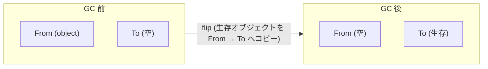

#### GC の主要フェーズ

`ScavengerCollector::CollectGarbage()` は次のフェーズで進行します。

最初に `SwapSemiSpaces()` でFromとToを入れ替えます。

```cpp
// src/heap/new-spaces.cc:194-211
void SemiSpace::Swap(SemiSpace* from, SemiSpace* to) {
  // We swap all properties but id_.
  std::swap(from->memory_chunk_list_, to->memory_chunk_list_);
  std::swap(from->current_page_, to->current_page_);
  ...
  to->FixPagesFlags();
  from->FixPagesFlags();
}
```

`id_` は入れ替えないため、識別子と中身の対応が反転する形になります。

次にワークリスト・空チャンクリスト・JSWeakRefリスト・WeakCellリスト・Ephemeronテーブルリストを準備し、`num_scavenge_tasks` 個の `Scavenger` インスタンスをスレッド数ぶん生成します。

その後、Old-to-NewのRemembered Setを持つチャンクを集めます。

```cpp
// src/heap/scavenger.cc:1698-1706
OldGenerationMemoryChunkIterator::ForAll(
    heap_, [&old_to_new_chunks](MutablePage* chunk) {
      if (chunk->slot_set<OLD_TO_NEW>() ||
          chunk->typed_slot_set<OLD_TO_NEW>() ||
          chunk->slot_set<OLD_TO_NEW_BACKGROUND>()) {
        old_to_new_chunks.emplace_back(ParallelWorkItem{}, chunk);
      }
    });
```

`OLD_TO_NEW` Remembered Setとは、Old領域にあるオブジェクトのどのスロットがNew領域のオブジェクトを指しているかを記録する集合です。これはWrite Barrierによって維持されます。Old領域全体を辿らずに、ここに登録された場所だけを擬似ルートとして扱えば、Young Generationの生存オブジェクトを漏れなく走査できます。これが世代別GCの最大の効率源です。

#### 移動・昇格・CAS

オブジェクト1つを移動するコアロジックは `TryMigrateObject` です。この関数は並行する複数のScavengerワーカーが同じオブジェクトを移動しようとしたときの競合をCASで解決します。

```cpp
// src/heap/scavenger.cc:1951-2002 抜粋
template <typename THeapObjectSlot, typename OnSuccessCallback>
bool Scavenger::TryMigrateObject(Tagged<Map> map, THeapObjectSlot slot,
                                 Tagged<HeapObject> source,
                                 SafeHeapObjectSize object_size,
                                 AllocationSpace space,
                                 OnSuccessCallback on_success) {
  Tagged<HeapObject> target;
  if (!allocator_
           .Allocate(space, object_size,
                     HeapObject::RequiredAlignment(space, map))
           .To(&target)) [[unlikely]] {
    return false;
  }
  DCHECK(heap()->marking_state()->IsUnmarked(target));

  // This CAS can be relaxed because we do not access the object body if the
  // object was already copied by another thread.
  if (!source->relaxed_compare_and_swap_map_word_forwarded(
          MapWord::FromMap(map), target)) {
    // Other task migrated the object.
    allocator_.FreeLast(space, target, object_size);
    const MapWord map_word = source->map_word(kRelaxedLoad);
    UpdateHeapObjectReferenceSlot(slot, map_word.ToForwardingAddress(source));
    return true;
  }

  // Copy the content of source to target. Note that we do this on purpose
  // *after* the CAS.
  target->set_map_word(map, kRelaxedStore);
  heap()->CopyBlock(target.address() + kTaggedSize,
                    source.address() + kTaggedSize,
                    object_size.value() - kTaggedSize);
```

重要な点は3つあります。第一に、Forwarding PointerはMapWordに保存されます。Map領域の先頭ワードは通常はオブジェクトのマップ (型情報) ですが、Scavengerが動作しているあいだ移動後はその場所が自分の新しいアドレスを指すよう書き換えられます。

第二に、`relaxed_compare_and_swap_map_word_forwarded` でMapWordをCASすることで、複数スレッドが同じオブジェクトを移動しようとしても、勝ったスレッドだけが実際にコピー作業を行います。負けたスレッドは自分が割り当てた `target` を `FreeLast` で解放し、勝者の指すforwarding addressを読み取って自分のスロット更新に使います。

第三に、コピー (`CopyBlock`) はCASの後に行われます。これは敗者がいた場合の無駄なコピーを避けるためであり、またCASでrelaxedメモリ順序を使えるようにするためでもあります。

#### Promotion 判定

`ShouldBePromoted` は `semi_space_new_space()->ShouldBePromoted(object_address)` を呼びます。これは「Age Markより下にあるかどうか」で判定する仕組みです。Age Markは前回GC終了時のTopポインタの位置を覚えておく仕組みで、Age Markより古い (下にある) オブジェクトはすでに1回Scavengeを生き延びていることを意味し、昇格対象となります。

#### 計算量と性能特性

Scavengerの本質的な計算量はO(S) です。SはYoung Generation中の生存オブジェクトの総サイズです。死んだオブジェクトには一切触れません。これがScavengerの高速性の本質です。世代別仮説によりS ≪ Young Generation全体サイズなので、新空間が満杯になるたびに走らせても短い時間で終わります。

ただしOld → New参照についてはOld全体ではなくRemembered Setを辿るのでO(R) (R = 記録されたスロット数) で済みます。総計算量はO(S + R) となります。

### 10.3 Paged New Space と Minor Mark-Sweep

Cheney流のSemi-Spaceは単純で高速ですが、本質的にYoung Generationのために2倍の物理メモリが必要です。常に半分は空のTo-Spaceとして確保されます。組み込み機器やモバイルでは無視できないコストです。

Paged New Spaceはこの問題を解決するために導入されました。Paged New SpaceではYoung GenerationのページがFree Listベースで管理されるため、To-Spaceを予約する必要がありません。

#### Sticky Mark Bits とは

Paged New Spaceと組み合わせて使われるのがSticky Mark Bitsです。これはMajor GCとMinor GCでマーキングビットマップを共有する仕組みで、Minor GCの合間にMarkビットがリセットされない点が特徴です。生き残り続けるオブジェクトはずっとMarkされたままになり「sticky (粘着的)」と呼ばれます。

Sticky Mark BitsによりMinor GCは「未マークのものだけを掃除する」Sweepベースの戦略を取れるようになります。これが `MinorMarkSweepCollector` です。

Minor MSは旧来「Minor Mark-Compact」と呼ばれていましたが、現在はCompactionを行わない名前に変わっています。Compactionが不要なのは、Old Generationと同じくFree List管理のSweepベースの仕組みを採用しているためです。コピーが発生しないので生存オブジェクトの量が多い「死ににくいワークロード」ではScavengerより効率的になります。逆に「すぐ死ぬオブジェクト」が支配的ならScavengerのほうが速いケースもあります。

### 10.4 Mark-Compact (Major GC)

Major GCを担う `MarkCompactCollector` のエントリポイントは `CollectGarbage()` で、おおまかには6つのフェーズに分かれます。

```cpp
// src/heap/mark-compact.cc:532-560
void MarkCompactCollector::CollectGarbage() {
  ...
  MarkLiveObjects();
  ...
  RecordObjectStats();
  ClearNonLiveReferences();
  VerifyMarking();
  ...
  Sweep();
  Evacuate();
  Finish();
}
```

#### Tri-color Marking と Marking Bitmap

Mark-CompactはTri-color (三色) マーキングを採用しています。これはDijkstra (1978) によって提唱された古典的アルゴリズムで、各オブジェクトを以下の3色に分類します。

```
白 (white):   未訪問。死んでいる可能性がある。
灰 (grey):    訪問済みだが子要素は未訪問。ワークリストに入っている。
黒 (black):   訪問済み、かつ子要素も訪問済み (またはワークリストに入った)。

不変条件 (tri-color invariant):
  「黒のオブジェクトは白のオブジェクトを直接指してはいけない」

これを満たす限り、白は安全に解放できる。
```

V8のマーキングBitmapは1ページ (V8では256KB) あたり「タグドサイズごとに1ビット」のMark Bitを持ちます。タグドサイズが8バイトなら256KB/8 = 32768ビット = 4KBのビットマップになります。

V8のMarking Bitmapでは「灰」を「Bit 1 + ワークリストに存在」、「黒」を「Bit 1 + ワークリストに不在」として表現します。ビット自体は2状態しかありませんが、組み合わせで3色を表現します。

#### Mark Live Objects

```cpp
// src/heap/mark-compact.cc:2582-2671 抜粋
void MarkCompactCollector::MarkLiveObjects() {
  const bool was_marked_incrementally =
      !heap_->incremental_marking()->IsStopped();
  if (was_marked_incrementally) {
    DCHECK(incremental_marking->IsMajorMarking());
    incremental_marking->Stop();
    MarkingBarrier::PublishAll(heap_);
    ...
  }

  RootMarkingVisitor root_visitor(this);

  {
    TRACE_GC(heap_->tracer(), GCTracer::Scope::MC_MARK_ROOTS);
    MarkRoots(&root_visitor);
  }
  ...
  if (v8_flags.parallel_marking && UseBackgroundThreadsInCycle()) {
    parallel_marking_ = true;
    MarkTransitiveClosureFixpoint();
    parallel_marking_ = false;
  }
  ...
  MarkRootsFromConservativeStack(&root_visitor);
  ...
  if (!MarkTransitiveClosureFixpoint()) {
    MarkTransitiveClosureLinear();
  }
```

注目すべきは2点です。第一に、インクリメンタルマーキングがすでに進んでいた場合は途中状態を引き継ぎます。Write Barrierによって維持されていた黒→白参照の追跡情報を `MarkingBarrier::PublishAll(heap_)` で全LocalHeapから集めます。

第二に、Conservative Stack Scanningはパラレルマーキングのあとに別フェーズとして行います。これはスタックスキャンによってピン留めされるオブジェクトを最後に確定させるためです。

`MarkTransitiveClosureFixpoint()` はephemeronが絡むため不動点反復になり、まずこれを試します。ephemeronの数が多くてfixpointが高コストになった場合は `MarkTransitiveClosureLinear()` というアルゴリズムに切り替えます。

擬似コードでMark Live Objectsを表すと以下のようになります。

```
function MarkLiveObjects():
    worklist = empty
    for each root r in roots:
        mark r grey   // bit を立て、worklist に push
    while worklist is not empty:
        obj = worklist.pop()
        for each field f of obj:
            child = *f
            if child is white:
                mark child grey
        mark obj black  // 単に worklist から外す
```

#### Concurrent Marking

`ConcurrentMarking` クラスはバックグラウンドスレッドでMarkingを行います。実体は `JobTaskMajor` および `JobTaskMinor` というJobTaskで、バックグラウンドプールで実行されます。

並行マーキングのキモはWrite Barrierとの協調です。ミューテータが `parent.field = child` を実行したとき、もしparentが黒でchildが白ならtri-color不変条件が壊れます。これを防ぐのがMarking Barrierの役目です。

#### Incremental Marking

```cpp
// src/heap/incremental-marking.cc:245
void IncrementalMarking::StartMarkingMajor() {
  ...
  is_compacting_ = major_collector_->StartCompaction(
      MarkCompactCollector::StartCompactionMode::kIncremental);
  ...
  marking_mode_ = MarkingMode::kMajorMarking;
  heap_->SetIsMarkingFlag(true);

  MarkingBarrier::ActivateAll(heap(), is_compacting_);
  isolate()->traced_handles()->SetIsMarking(true);

  StartBlackAllocation();
  ...
  if (v8_flags.concurrent_marking && !heap_->IsTearingDown()) {
    heap_->concurrent_marking()->TryScheduleJob(
        GarbageCollector::MARK_COMPACTOR);
  }
```

`MarkingBarrier::ActivateAll` で全LocalHeapのマーキングバリアを有効化し、`StartBlackAllocation` で新規確保オブジェクトを黒色にする設定を入れ、最後に `concurrent_marking->TryScheduleJob` でバックグラウンドマーキングを開始します。

#### Sweeping (掃除)

`Sweep()` はOld Spaceの各ページをFree List化する処理です。`Sweeper::RawSweep` が1ページぶんの処理を担います。

ページをMark Bitに従って線形に走査し、生存オブジェクト間の空き範囲をFree Listに登録します。さらに、その空き範囲にあったRemembered Setのエントリを掃除し、最後にビットマップをクリアします。計算量はO(P)、P = ページサイズです。

V8ではSweepingを並行・遅延に行います。並行Sweepingの利点は、Atomic PauseでSweepを完了する必要がなくなることです。Atomic PauseではSweepingを「開始する」だけで、実際の作業はバックグラウンドやmutatorがアロケーションを試みた瞬間 (Lazy Sweeping) に進みます。

#### Evacuation (Compaction)

`Evacuate()` は断片化したページからオブジェクトを別ページにコピーしてフラグメンテーションを解消します。すべてのページを対象にすると重いので、`evacuation_candidates_` というメンバに対象を絞ります。

```cpp
// src/heap/mark-compact.cc:606
void MarkCompactCollector::ComputeEvacuationHeuristics(
    size_t area_size, int* target_fragmentation_percent,
    size_t* max_evacuated_bytes) {
  ...
  const int kTargetFragmentationPercent = 70;
```

通常モードでは70% より高い断片化率のページが対象です。

### 10.5 Conservative Stack Scanning

伝統的なV8はスタック上のすべてのポインタを精密に追跡するため `Handle` クラスを使うHandlificationを要求していました。Conservative Stack Scanningは「スタック上の任意のワードがヒープポインタである可能性があるなら、それを保守的にルートとみなす」ことでHandlificationの負担を軽減します。

これによって導入されたのが `DirectHandle` です。これはスタック上に直接ポインタを置く軽量ハンドルで、Conservative Stack Scannerがそれらを発見するため正しく追跡されます。

`FindBasePtr` 内部では `MarkingBitmap::FindPreviousValidObject` を呼びます。

```cpp
// src/heap/marking-inl.h:197-209
// This method provides a basis for inner-pointer resolution. It expects a
// page and a maybe_inner_ptr that is contained in that page. It returns the
// highest address in the page that is not larger than maybe_inner_ptr, has
// its markbit set, and whose previous address (if it exists) does not have
// its markbit set.
static inline Address FindPreviousValidObject(const NormalPage* page,
                                              Address maybe_inner_ptr);
```

Mark Bitmapを逆向きに走査して「直近のMark Bitが立っているアドレス」を見つけ、それをオブジェクトヘッダとみなします。これによって、たとえばスタックに `obj.address + 16` のような内部ポインタが残っていても、対応する `obj` を正しくルートとして特定できます。

#### Pinning

ScavengerではConservative Stack Scanningと組み合わせるとオブジェクトをピン留め (pinning) する仕組みが必要です。スタック上に内部ポインタがあると、そのオブジェクトを移動 (Scavenge) できないため、移動を諦めてin-placeで生存させます。ピン留めされたオブジェクトを含むページはQuarantined Pageとなり、当該ページはGC後にsweepされますが、対象オブジェクトは元の位置に残ります。

### 10.6 メモリ管理の最適化

#### Black Allocation

Black AllocationはConcurrent Marking中に確保された新規オブジェクトを最初から「黒」として扱う最適化です。なぜこれが必要かというと、Concurrent Marking中に新しいオブジェクトを白で確保すると、白かつ参照されている状態が一時的に生まれてしまい、それが回収される危険があるからです。最初から黒にすればこのリスクは消えますが、副作用としてマーキング中に生まれたオブジェクトはFloating Garbageとして今回のGCでは回収されません。

#### Concurrent Allocation (CAS-based bump pointer)

Linear Allocation Area (LAB) は通常はスレッドごとに保持されますが、共有空間や複数スレッドが触る空間ではBump Pointerの更新をCASで行います。

```
function ConcurrentAllocate(space, size):
    loop:
        old_top = atomic_load(space.top)
        new_top = old_top + size
        if new_top > space.limit:
            slow_path(size)
            continue
        if compare_and_swap(&space.top, old_top, new_top):
            return old_top
```

#### Memory Reducer

`MemoryReducer` クラスはアイドル時にメモリを返却することを目的とした有限状態機械です。

```
22: // The goal of the MemoryReducer class is to detect transition of the mutator
23: // from high allocation phase to low allocation phase and to collect potential
24: // garbage created in the high allocation phase.
26: // States:
29: // - DONE <last_gc_time_ms>
30: // - WAIT <started_gcs> <next_gc_start_ms> <last_gc_time_ms>
31: // - RUN <started_gcs> <last_gc_time_ms>
```

DONE → WAIT → RUN → DONEの循環で、ミューテータが活発に確保している間は静かにし、収まってきたら追加でGCを仕掛けてメモリを返却します。

### 10.7 Finalization Registry と WeakRef

#### FinalizationRegistry の構造

`JSFinalizationRegistry` はES2021で導入されたAPIです。

```cpp
// src/objects/js-weak-refs.h:113-119
TaggedMember<NativeContext> native_context_;
TaggedMember<JSReceiver> cleanup_;
TaggedMember<UnionOf<WeakCell, Undefined>> active_cells_;
TaggedMember<UnionOf<WeakCell, Undefined>> cleared_cells_;
TaggedMember<Object> key_map_;
TaggedMember<UnionOf<JSFinalizationRegistry, Undefined>> next_dirty_;
TaggedMember<Smi> flags_;
```

`active_cells_` は登録された対象がまだ生きているWeakCellの連結リスト、`cleared_cells_` は対象が死んだWeakCellの連結リストです。

#### WeakCell の構造

```cpp
// src/objects/js-weak-refs.h:190-197
TaggedMember<JSFinalizationRegistry> finalization_registry_;
TaggedMember<JSAny> holdings_;
TaggedMember<UnionOf<Symbol, JSReceiver, Undefined>> target_;
TaggedMember<UnionOf<Symbol, JSReceiver, Undefined>> unregister_token_;
TaggedMember<UnionOf<WeakCell, Undefined>> prev_;
TaggedMember<UnionOf<WeakCell, Undefined>> next_;
TaggedMember<UnionOf<WeakCell, Undefined>> key_list_prev_;
TaggedMember<UnionOf<WeakCell, Undefined>> key_list_next_;
```

`target_` は弱参照対象、`holdings_` はfinalizerに渡される値、`unregister_token_` は登録解除用トークンです。

#### GC 中の WeakCell 処理

Scavengerでは `target` が死んでいた場合 `weak_cell->Nullify` でtargetをnull化し、所属するFinalizationRegistryをDirty Registryリストに繋ぎます。GC後に `JSFinalizationRegistry::Cleanup` がマイクロタスクとして呼ばれ、登録されたfinalizerがJavaScriptレベルで呼ばれます。

### 10.8 Ephemeron Hash Table

Ephemeronは (key, value) のペアで、valueの生存がkeyの生存に依存する弱参照構造です。WeakMapとWeakSetが代表例です。

問題は「keyとvalueのどちらも、それぞれのephemeron経由以外からは到達できないが、keyとvalueが相互参照している」というケースです。素朴に標準のマーキングを走らせると、mからvが直接参照されているように見えてしまい、vが誤って生存と判定されます。

```cpp
// src/heap/mark-compact.cc:2404-2437
MarkCompactCollector::EphemeronResult
MarkCompactCollector::ApplyEphemeronSemantics(Tagged<HeapObject> key,
                                              Tagged<HeapObject> value) {
  ...
  if (MarkingHelper::IsMarkedOrAlwaysLive(heap_, marking_state_, key)) {
    if (MarkingHelper::TryMarkAndPush(...)) {
      return EphemeronResult::kMarkedValue;
    } else {
      return EphemeronResult::kResolved;
    }
  } else {
    if (marking_state_->IsMarked(value)) {
      return EphemeronResult::kResolved;
    } else {
      return EphemeronResult::kUnresolved;
    }
  }
}
```

ロジックを読み解くと、第一にkeyがマーク済み (生存確定) であればvalueをマークする。これがEphemeron Semanticsの本質です。第二にkeyが未マーク (現時点では死んでいる候補) であれば、valueもマークしない。第三にUnresolvedなephemeronは不動点反復で再評価します。

### 10.9 GC の全体の流れ

典型的なMajor GCの流れを時系列で整理します。

```
時刻 →

Mutator: ████████████████░░░░░░░░░░░░░░░░░░░░░░░░████████░░░░░░██████
                          ↑                              ↑       ↑
                          GC開始                         Atomic   GC終了
                                                         Pause

Concurrent Marking:         ▓▓▓▓▓▓▓▓▓▓▓▓▓▓▓▓▓▓▓▓▓▓▓▓▓▓▓▓▓▓
Incremental Marking:      ░░░░░░░░░░░░░░░░░░░░░░░░░░░░░░░░░
Concurrent Sweeping:                                            ▓▓▓▓▓▓▓▓▓
```

1. 旧GC終了後、`HeapLimits` がアロケーション上限を更新する。
2. ミューテータがLimitに近づくと `IncrementalMarking::Start` が呼ばれる。
3. `StartMarkingMajor` が走り、Marking BarrierがON、Black Allocation開始、Concurrent Markingジョブが投入される。
4. ミューテータの実行と並行してConcurrent Markerがワークリストを処理。
5. Allocation Limitを完全に超えるかタスクtimeoutで `MarkCompactCollector::CollectGarbage` が呼ばれAtomic Pauseに入る。
6. `MarkLiveObjects` で残ったマーキングを完了、Conservative Stack Scan、Embedder Tracing、Ephemeron Fixpoint or Linearを実施。
7. `ClearNonLiveReferences` でWeakRef, WeakCell, ephemeron等の弱参照を整理。
8. `Sweep()` でSweep Jobを起動 (実際のSweepingはConcurrent)。
9. `Evacuate()` で並列にEvacuation Candidateを移動。
10. `Finish()` でStatistics集計、`HeapLimits::UpdateAllocationLimits` で新しいLimitを計算。
11. Concurrent SweepingはAtomic Pause後もバックグラウンドで継続。

時系列の中でメインスレッドが完全に止まっている時間 (Atomic Pause) は全体のごく一部に圧縮されており、これがOrinocoの最大の達成です。実測では数MBのヒープに対して数ミリ秒、数GBのヒープでも数十ミリ秒程度に収まることが多いです。

### 10.10 性能特性のまとめ

各GCのトレードオフを以下のように整理します。

ScavengerはPause Timeが短く (典型1〜10ms)、Throughputは高く、Footprintはやや悪い (Semi-Spaceで2倍領域必要)。最適用途は短命オブジェクトが大量のワークロードです。

Minor Mark-SweepはPause Timeがやや長く (10〜30ms)、Throughputは中程度、Footprintは良好 (Free Listベース)。最適用途は中程度の生存率を持つワークロードや、メモリ制約が厳しい環境です。

Major Mark-CompactはPause Timeは数十msですがConcurrent MarkingとIncremental MarkingのおかげでAtomic Pauseは劇的に短く (典型10〜50ms)。Throughputは高く、FootprintはCompactionによって最良です。

Lazy/Concurrent SweepingはAtomic Pauseを最小化する代償としてバックグラウンドCPUを消費しますが、ユーザー体感に対するペイオフは大きいです。

## 第11章 実行パイプライン - Ignition / Sparkplug / Maglev / TurboFan

### 11.1 実行パイプライン全体像

V8は四段階のティアリングを持ちます。各tierは同じJavaScript関数を異なる速度・最適化レベルで実行する別の表現を持ちます。

```cpp
// src/objects/code-kind.h:19-34
#define CODE_KIND_LIST(V)  \
  V(BYTECODE_HANDLER)      \
  V(FOR_TESTING)           \
  ...
  V(INTERPRETED_FUNCTION)  \
  V(BASELINE)              \
  V(MAGLEV)                \
  V(TURBOFAN_JS)           \
  V(WASM_STACK_ENTRY)
```

`INTERPRETED_FUNCTION < BASELINE < ... < TURBOFAN_JS` の順序が `static_assert` により保証されており、これが「tierの上下関係」を司ります。`CodeKindCanTierUp(kind)` はこの順序関係に基づき「もっと上のtierに昇格できるか」を判定し、`CodeKindCanDeoptimize(kind)` は逆に「下のtierに降りる必要が出る可能性があるか」を判定します。MAGLEVとTURBOFAN_JSだけがdeoptの対象になります。

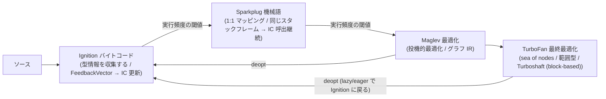

ティアリングの判定は `src/execution/tiering-manager.cc` で行われます。`MaybeOptimizeFrame` が関数のリターン時または定期割り込み時に呼ばれ、`ShouldOptimize` が次に進むべきtierを返します。閾値は次のとおりです。

- `invocation_count_for_feedback_allocation = 8` (FeedbackVectorを持つようにする)
- `invocation_count_for_maglev = 400` (Androidでは1000)
- `invocation_count_for_turbofan = 3000`
- `invocation_count_for_osr = 500` (OSR開始)
- `invocation_count_for_maglev_osr = 100`

Deoptimizationは `DeoptimizeKind` の三値 `kEager`、`kLazyAfterFastCall`、`kLazy` で表現されます。`kEager` は最適化コード自身がもはやこの仮定では実行できないと判断したときに即座にコールするもの。`kLazy` は別の場所での状態変化 (mapのdeprecation、prototype変更) により後始末的に深部のフレームに掛けられる遅延deoptです。

### 11.2 Ignition (Bytecode Interpreter)

IgnitionはV8のすべてのコードがまず通過する場所です。設計は典型的なレジスタマシンですが、加えて専用のaccumulatorを持ちます。

#### バイトコードの構造

バイトコード一覧は `src/interpreter/bytecodes.h:60-` の `BYTECODE_LIST_WITH_UNIQUE_HANDLERS_IMPL` マクロで一斉に列挙されます。各エントリは `V(<bytecode>, <implicit_register_use>, <operands>...)` のレコードで、accumulatorのread/write情報が必須メタデータです。

```cpp
// src/interpreter/bytecodes.h:87-89
V(Ldar, ImplicitRegisterUse::kWriteAccumulator, OperandType::kReg)           \
V(LdaZero, ImplicitRegisterUse::kWriteAccumulator)                           \
V(LdaSmi, ImplicitRegisterUse::kWriteAccumulator, OperandType::kImm)
```

`LdaZero` や `LdaSmi` はaccumulatorに値を書き込む副作用を持ち、`Ldar reg` はレジスタの値をaccumulatorに読みます。`Star reg` で逆方向にコピーします。実際V8は `Star0`〜`Star15` までの1バイト命令を特別に持っていて、頻出する `Star` の即値オペランドを命令そのものに埋め込み、命令長を縮めます。

プロパティアクセス用のバイトコードはフィードバックスロットを必ず引数に取ります。

```cpp
// src/interpreter/bytecodes.h:168-178
V(GetNamedProperty, ImplicitRegisterUse::kWriteAccumulator,
  OperandType::kReg, OperandType::kConstantPoolIndex,
  OperandType::kFeedbackSlot)
V(GetKeyedProperty, ImplicitRegisterUse::kReadWriteAccumulator,
  OperandType::kReg, OperandType::kFeedbackSlot)
```

#### BytecodeArray のレイアウト

```cpp
// src/objects/bytecode-array.h:153-165
TaggedMember<Smi> length_;
TaggedMember<BytecodeWrapper> wrapper_;
ProtectedTaggedMember<TrustedByteArray> source_position_table_;
ProtectedTaggedMember<TrustedByteArray> handler_table_;
ProtectedTaggedMember<TrustedFixedArray> constant_pool_;
int32_t frame_size_;
uint16_t parameter_size_;
uint16_t max_arguments_;
int32_t incoming_new_target_or_generator_register_;
...
FLEXIBLE_ARRAY_MEMBER(uint8_t, bytes);
```

末尾の `bytes` が実際のバイト列で、`length_` は長さ、`constant_pool_` はLdaConstant等が参照するTagged値の配列、`handler_table_` は例外ハンドラの範囲テーブル、`source_position_table_` はソース位置とバイトコードoffsetのマッピングをVLQで持ちます。

#### ディスパッチテーブル

Interpreterは単一の関数ではなく、バイトコード毎にビルトインを持ち、それらのアドレスを768エントリのテーブルに置きます。

```cpp
// src/interpreter/interpreter.h:108-114
static const int kNumberOfWideVariants = BytecodeOperands::kOperandScaleCount;
static const int kDispatchTableSize = kNumberOfWideVariants * (kMaxUInt8 + 1);
static const int kNumberOfBytecodes = static_cast<int>(Bytecode::kLast) + 1;
...
Address dispatch_table_[kDispatchTableSize];
```

`kDispatchTableSize` は3 × 256 = 768です。3倍されているのは `OperandScale` (Single / Double / Quadruple) に応じてwide / extra-wide版が必要なためです。

ハンドラからハンドラへの遷移はテーブルジャンプ (threaded code) で実装されます。

```cpp
// src/interpreter/interpreter-assembler.cc:1385-1414 抜粋
void InterpreterAssembler::DispatchToBytecodeHandlerEntry(
    TNode<RawPtrT> handler_entry, TNode<IntPtrT> bytecode_offset) {
  TailCallBytecodeDispatch(
      InterpreterDispatchDescriptor{}, handler_entry, GetAccumulatorUnchecked(),
      bytecode_offset, BytecodeArrayTaggedPointer(), DispatchTablePointer());
}
```

ポイントは末尾の `TailCallBytecodeDispatch` で、これはハンドラを末尾呼出します。次のハンドラはレジスタ規約 `InterpreterDispatchDescriptor` に従い、accumulator・bytecode offset・bytecode array・dispatch tableをすべてレジスタで受け取るため、関数のスタックフレームを積まずに次のハンドラへジャンプできます。これがいわゆるthreaded interpreterの高速化テクニックのV8実装です。

#### 個別ハンドラの例

```cpp
// src/interpreter/interpreter-generator.cc:80-83
IGNITION_HANDLER(LdaSmi, InterpreterAssembler) {
  TNode<Smi> smi_int = BytecodeOperandImmSmi(0);
  SetAccumulator(smi_int);
  Dispatch();
}
```

`IGNITION_HANDLER` マクロがCSAのクラスを定義し、生成済みコードがビルトインとして焼き込まれます。

### 11.3 Sparkplug (Baseline JIT)

Sparkplugは中間表現を持たない、命令一つひとつをほぼ即座に機械語に変換するJITです。コンパイル時間を限界まで削減することが設計目的です。

#### 全体構造

`BaselineCompiler::GenerateCode()` の二段階の処理です。

```cpp
// src/baseline/baseline-compiler.cc:320-352
void BaselineCompiler::GenerateCode() {
  {
    RCS_BASELINE_SCOPE(PreVisit);
    HandlerTable table(*bytecode_);
    for (uint32_t i = 0; i < table.NumberOfRangeEntries(); ++i) {
      MarkIndirectJumpTarget(table.GetRangeHandler(i));
    }
    for (; !iterator_.done(); iterator_.Advance()) {
      PreVisitSingleBytecode();
    }
    iterator_.Reset();
  }
  ...
  __ CodeEntry();
  ...
  {
    RCS_BASELINE_SCOPE(Visit);
    Prologue();
    AddPosition();
    for (; !iterator_.done(); iterator_.Advance()) {
      VisitSingleBytecode();
      AddPosition();
    }
  }
}
```

最初のpass `PreVisitSingleBytecode` は `JumpLoop` の対象だけを抽出してラベルを準備する目的、つまり後ろ向きジャンプの解決のためだけにあります。本体は2回目のループ `VisitSingleBytecode` で、これがバイトコードに対する大きなswitchです。

#### 命令サイズの見積もり

```cpp
// src/baseline/baseline-compiler.cc:266-272
#ifdef V8_TARGET_ARCH_IA32
const int kAverageBytecodeToInstructionRatio = 5;
#else
const int kAverageBytecodeToInstructionRatio = 7;
#endif
```

`EstimateInstructionSize` は単に `bytecode->length() * 7` を返します。これはバイトコード1 byte ≈ 機械語7 byteの経験則です。

#### Interpreter とスタックフレームを共有するトリック

Sparkplugの最重要な設計判断は、Interpreterと同じスタックフレームを使う点です。これによりMaglev/TurboFanでdeoptしても、その場でSparkplug → Interpreterにスムーズに戻れます。

```cpp
// src/baseline/x64/baseline-compiler-x64-inl.h:23-35
void BaselineCompiler::Prologue() {
  ASM_CODE_COMMENT(&masm_);
  DCHECK_EQ(kJSFunctionRegister, kJavaScriptCallTargetRegister);
  int max_frame_size = bytecode_->max_frame_size();
  CallBuiltin<Builtin::kBaselineOutOfLinePrologue>(
      kContextRegister, kJSFunctionRegister, kJavaScriptCallArgCountRegister,
      max_frame_size, kJavaScriptCallNewTargetRegister, bytecode_);
  ...
  PrologueFillFrame();
}
```

`kInterpreterAccumulatorRegister` は実行開始時にundefinedが入っているレジスタで、それをPushすることでInterpreterと同じ「初期値undefinedのローカル変数枠」を作ります。

#### 1:1 マッピング

Sparkplugの生成コードは1つのバイトコードを1つ以上の機械語命令に直接対応させるだけで、複数バイトコードをまとめて最適化する処理は一切ありません。例えば `Add` の `VisitAdd` は実質「`Add_Baseline` ビルトインを呼ぶ」だけです。型解析はせず、すべてのフィードバック収集とICはInterpreterと同じビルトインに任せます。これにより、InterpreterでのFeedbackVectorがそのままSparkplugでも収集され、上位のMaglev / TurboFanがそれを使えます。

### 11.4 Maglev (Mid-tier Optimizing Compiler)

MaglevはSparkplugより大幅に速いが、TurboFanよりはるかに低コストでコンパイルできる中間的なJITです。Sparkplugが型を見ないのに対し、MaglevはFeedbackVectorに基づく投機的型特殊化を行います。

#### コンパイル全体

`Compile` 関数が全体パイプラインで、以下のフェーズを順に走らせます。

1. **GraphBuilder**: bytecodeを線形に走査してMaglev IRのSSAグラフを作る
2. **Inlining**: `maglev_non_eager_inlining` フラグが立っていれば後付け的にインライニング
3. **Truncation**: Float→Int32のような型変換を伝播
4. **LICM (Loop Invariant Code Motion)**
5. **Phi untagging**: Phi一族のrepresentationをTaggedからInt32/Float64に揚げる
6. **Dead code marking / unreachable block removal**
7. **Register allocation**
8. **CodeAssembly / CodeGen**

#### Maglev IR

MaglevはSSAグラフですが、TurboFanのSea of Nodesではなく、basic blockを持つ伝統的なCFG IRです。ノード種別の網羅的リストには次の表現分類があります。

- `GENERIC_OPERATIONS_NODE_LIST`: フィードバックがない場合のgeneric演算 (`GenericAdd`, `GenericLessThan` 等)
- `INT32_OPERATIONS_NODE_LIST`: Smi/Int32に特殊化された演算 (`Int32AddWithOverflow`, `Int32Multiply` 等)
- `FLOAT64_OPERATIONS_NODE_LIST`: IEEE-754浮動小数点演算 (`Float64Add`, `Float64Sqrt` 等)
- `CONVERSION_NODE_LIST`: タグ付け/外しと表現変換 (`CheckedSmiTagInt32`, `Float64ToTagged` 等)
- `VALUE_NODE_LIST`: プロパティアクセスや関数呼出等のノード

この分類は「同じセマンティクス (例: 加算) でも、入力値の型・表現に応じて別ノードに変換する」という思想です。`Generic*` ノードはfallback、`Int32*` ノードはSmi特殊化、`Float64*` ノードは浮動小数点特殊化、それぞれが別の機械語列を生む直接の指示となります。

#### GraphBuilder と Type Narrowing

`VisitBinaryOperation` はFeedbackVectorの `BinaryOperationFeedback` を読みます。

```cpp
// src/maglev/maglev-graph-builder.cc:2293-2330
switch (feedback_hint) {
  case BinaryOperationHint::kNone:
    return EmitUnconditionalDeopt(
        DeoptimizeReason::kInsufficientTypeFeedbackForBinaryOperation);
  case BinaryOperationHint::kAdditiveSafeInteger:
    if (flags_.can_speculative_additive_safe_int) {
      ...
      return BuildFloat64SpeculateSafeAdd(left, right);
    }
    [[fallthrough]];
  case BinaryOperationHint::kSignedSmall:
  case BinaryOperationHint::kSignedSmallInputs:
  case BinaryOperationHint::kNumber:
  case BinaryOperationHint::kNumberOrOddball: {
    ...
    if (feedback_hint == BinaryOperationHint::kSignedSmall) {
      ...
      return BuildInt32BinaryOperationNode<kOperation>();
    } else {
      return BuildFloat64BinaryOperationNodeForToNumber<kOperation>(...);
    }
  }
```

ここがまさにspeculative optimizationの心臓です。フィードバックが `kSignedSmall` であれば `Int32AddWithOverflow` ノードを発行し、後段でオーバーフロー時にdeoptするコードに展開します。フィードバックが `kNone` (一度も実行されていない) の場合は無条件deoptを発行します。これは「投機を行うべき情報がないので、即座にInterpreterに戻して情報を集めさせる」という戦略です。

#### 性能特性

MaglevはSea of Nodesをやめて伝統的CFGにすることでコンパイル時間を大幅に削減しています。経験則として、TurboFanが同じ関数に対しO(数百ms) かけるところを、MaglevはO(数十ms) でこなします。一方、Escape AnalysisやAllocation Foldingのような重い最適化はせず、得られる性能はTurboFanに対して60-80% 程度です。

### 11.5 TurboFan (Top-tier Optimizing Compiler)

TurboFanは最終tierとして、もっとも高品質な機械語を生成します。

#### Sea of Nodes

TurboFanのIRはCliff Clickが論文化したSea of Nodesをベースとし、`Node` クラスがその基本単位です。

```cpp
// src/compiler/node.h:41-99
class V8_EXPORT_PRIVATE Node final {
 public:
  static Node* New(Zone* zone, NodeId id, const Operator* op, int input_count,
                   Node* const* inputs, bool has_extensible_inputs);
  ...
  Node* InputAt(int index) const {
    DCHECK_LE(0, index);
    DCHECK_LT(index, InputCount());
    return *GetInputPtrConst(index);
  }
  ...
};
```

Sea of Nodesの本質は「control依存とdata依存とeffect依存をすべてedgeで表す」ことです。命令の順序は明示的なedgeを辿ることだけが定め、不要な順序関係は持ちません。これにより冗長な制約から解放されたグラフ全体に対して、最適化器は自由にnodeを移動・統合できます。

#### Pipeline

`PipelineImpl::CreateGraph` と `OptimizeTurbofanGraph` が中核です。実行するフェーズは次のとおりです。

- **GraphBuilderPhase**: bytecodeをJS-levelのSea of Nodesに変換
- **InliningPhase**: 関数呼出のインライニング
- **TyperPhase**: 各nodeにturbofan-types.hの型を割り当てる
- **TypedLoweringPhase**: JS-level node → Simplified-level nodeに下げる
- **LoopPeelingPhase / LoopExitEliminationPhase**: ループ最適化
- **LoadEliminationPhase**: 冗長load除去
- **EscapeAnalysisPhase**:「JSObjectがローカルスコープを脱出しないなら、ヒープ確保せずレジスタ/スタックに置く」最適化
- **SimplifiedLoweringPhase**: representation selection (Tagged/Int32/Float64のどれで持つか)
- **GenericLoweringPhase**: 機械語に近い形に下げる
- **EarlyOptimizationPhase / LateOptimizationPhase**: マシン命令の最適化

#### 型システム

TurboFanの型はbitsetとして表現されます。

```cpp
// src/compiler/turbofan-types.h:106-139 抜粋
#define INTERNAL_BITSET_TYPE_LIST(V)    \
  V(OtherUnsigned31, uint64_t{1} << 1)  \
  V(OtherUnsigned32, uint64_t{1} << 2)  \
  V(OtherSigned32,   uint64_t{1} << 3)  \
  V(OtherNumber,     uint64_t{1} << 4)  \
  V(OtherString,     uint64_t{1} << 5)

#define PROPER_ATOMIC_BITSET_TYPE_LOW_LIST(V) \
  V(Negative31,               uint64_t{1} << 6)   \
  V(Null,                     uint64_t{1} << 7)   \
  V(Undefined,                uint64_t{1} << 8)   \
  V(Boolean,                  uint64_t{1} << 9)   \
  V(Unsigned30,               uint64_t{1} << 10)  \
  ...
```

整数の範囲はrange typeで表現されます。`RangeType` は `Limits { min, max }` を持ち、範囲計算ができます。これはBounds Check Eliminationに直結します。例えばループの帰納変数が `Range[0, length)` と推論されたら、配列の `index < length` チェックを削除できます。

#### Escape Analysis の具体例

```javascript
function magnitude(x, y) {
  const v = { x, y };
  return Math.sqrt(v.x * v.x + v.y * v.y);
}
```

`v` はローカル変数で、関数の外に出ません。Escape Analysisは `v` のAllocation nodeをDeadに変換し、`v.x` / `v.y` の読みを直接 `x` / `y` に転送します。結果としてヒープ確保がゼロになり、純粋な数値計算だけになります。

#### Bounds Check Elimination の具体例

```javascript
function sum(arr) {
  let s = 0;
  for (let i = 0; i < arr.length; i++) {
    s += arr[i];
  }
  return s;
}
```

TurboFanは `i` をinduction variableと認識し、`Range[0, Infinity)` を割り当てます。ループ条件 `i < arr.length` を通った後、`i` は `Range[0, arr.length)` に絞られます。`arr[i]` のbounds checkは `0 <= i < arr.length` を要求しますが、すでに型から保証されているためbounds checkノードを削除します。

結果として `mov rax, [arr_data + i*8]` だけのループになります。

### 11.6 Turboshaft (TurboFan の新しい後段)

TurboshaftはSea of Nodesを捨て、blockベースのIRに戻った新しい後段です。

```cpp
// src/compiler/turboshaft/graph.h:306-326
class Block : public RandomAccessStackDominatorNode<Block> {
 public:
  enum class Kind : uint8_t { kMerge, kLoopHeader, kBranchTarget };

  explicit Block(Kind kind) : kind_(kind) {}

  bool IsLoopOrMerge() const { return IsLoop() || IsMerge(); }
  bool IsLoop() const { return kind_ == Kind::kLoopHeader; }
  ...
};
```

`Graph` は `OperationBuffer` という連続バッファにoperationをappend-onlyで格納します。

Sea of Nodesとの大きな違いは次の3点です。blockを明示的に持ち、control flowが常にブロック単位で確定しています。operationを連続配列で持ち、cache局所性が劇的に良くなります (`OperationBuffer` は8 byte単位のappend-onlyバッファ)。edgeはOpIndexで表現し、ポインタではなく整数IDなのでgraph copy/transformationが高速です。

#### Reducer の連鎖

Turboshaftでは各最適化をReducerとして書きます。

```cpp
// src/compiler/turboshaft/machine-lowering-phase.cc:21-32
void MachineLoweringPhase::Run(PipelineData* data, Zone* temp_zone) {
  CopyingPhase<StringEscapeAnalysisReducer, JSGenericLoweringReducer,
               DataViewLoweringReducer, MachineLoweringReducer,
               FastApiCallLoweringReducer, VariableReducer,
               SelectLoweringReducer, MachineOptimizationReducer,
               ValueNumberingReducer>::Run(data, temp_zone);
}
```

これは複数のReducerをテンプレート引数で並べることでスタックし、一度のgraph traversalで全て適用します。これによりphase orderingの柔軟性とコンパイル時間の両立を達成しています。

### 11.7 コンパイル時間 vs 実行性能

各tierの経験値です。

| Tier | コンパイル時間 (1関数) | 性能 (Ignition比) |
|------|----------------------|------------------|
| Ignition | 0ms (バイトコード生成のみ) | 1x |
| Sparkplug | <1ms | 2-5x |
| Maglev | 10-50ms | 30-100x |
| TurboFan | 100-500ms | 50-300x |

V8は「とりあえずIgnitionで動かす → 関数がhotだと判明したらSparkplug → 数100回呼ばれたらMaglev → 数千回ならTurboFan」と段階的に投資します。コンパイル自身は専用のコンパイラ・ディスパッチャスレッドで並行に走り、JSの実行スレッドをブロックしません。

### 11.8 まとめ

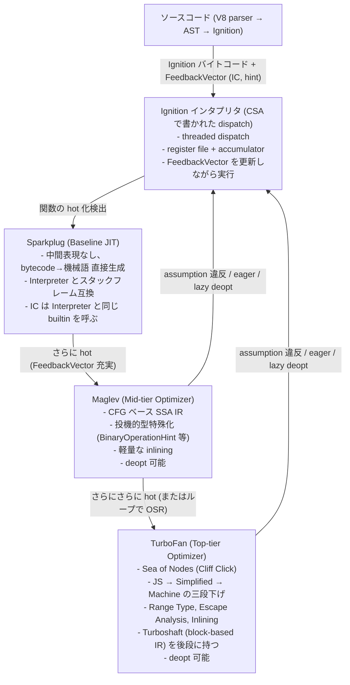

この階層は「JITのコンパイル時間と実行性能のトレードオフを段階的に投資する」設計の頂点であり、各tierがIC / FeedbackVector / Hidden Class / CompilationDependenciesという共通インフラを通じて互いに連携します。Ignitionがインフラを蓄積し、Sparkplugがコストゼロでそれを土台にし、Maglevがフィードバックに賭けて中位の最適化を試み、TurboFanが最終的にピーク性能を引き出します。失敗 (投機外し、状態変化) が起きればdeoptでIgnitionに戻り、再度フィードバックを蓄積し直します。これがV8のadaptive optimizationの完成形であり、Turboshaftによって最後段のさらなる進化が現在進行中です。

## 第12章 Inline Cache, Type Feedback, FeedbackVector

### 12.1 InlineCacheState の遷移

ICの状態は次のとおりです。

```cpp
// src/common/globals.h:1861-1880
enum class InlineCacheState {
  NO_FEEDBACK,
  UNINITIALIZED,
  MONOMORPHIC,
  RECOMPUTE_HANDLER,
  POLYMORPHIC,
  MEGADOM,
  HOMOMORPHIC,
  MEGAMORPHIC,
  GENERIC,
};
```

状態遷移は次のようになります。

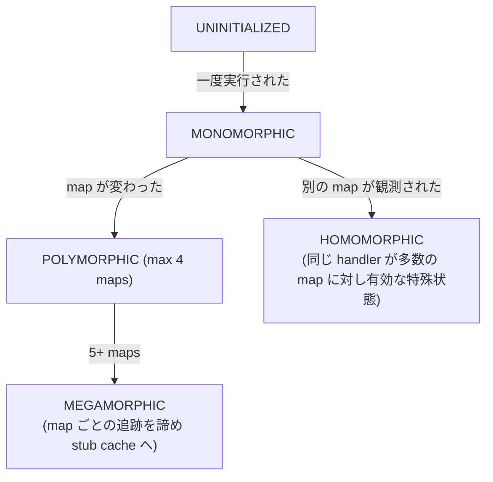

`src/ic/ic.cc:977-1029` の `SetCache` がこの遷移ロジックそのものです。

```cpp
void IC::SetCache(DirectHandle<Name> name, const MaybeObjectHandle& handler) {
  ...
  switch (state()) {
    case NO_FEEDBACK:
      UNREACHABLE();
    case UNINITIALIZED: {
      UpdateMonomorphicIC(handler, name);
      ...
      break;
    }
    case RECOMPUTE_HANDLER:
    case MONOMORPHIC:
      if (IsGlobalIC()) {
        UpdateMonomorphicIC(handler, name);
        break;
      }
      if (TryHealMonomorphicIC(handler)) break;
      if (UpdateOneMapManyNamesIC(name)) break;
      [[fallthrough]];
    case POLYMORPHIC:
      if (UpdatePolymorphicIC(name, handler)) {
        ...
        break;
      }
      if (UpdateMegaDOMIC(handler, name)) break;
      [[fallthrough]];
    case HOMOMORPHIC:
      if (UpdateHomomorphicIC(handler, name)) {
        ...
        break;
      }
      ...
      [[fallthrough]];
    case MEGADOM:
      ConfigureVectorState(MEGAMORPHIC, name);
      [[fallthrough]];
    case MEGAMORPHIC:
      UpdateMegamorphicCache(lookup_start_object_map(), name, handler);
      ...
      break;
  }
}
```

`case POLYMORPHIC` の `UpdatePolymorphicIC` が失敗すると (4個を超えるmapを観測したとき)、`[[fallthrough]]` で `case HOMOMORPHIC` に落ち、ここでも失敗すると最終的に `MEGAMORPHIC` に到達します。MEGAMORPHICでは関数ごとに分離していたmap → handlerテーブルをIsolate全体で共有する `StubCache` に統合し、ハッシュテーブルlookupでアクセスします。

### 12.2 FeedbackVector のレイアウト

```cpp
// src/objects/feedback-vector.h:307-559
inline int32_t invocation_count() const;
...
inline uint8_t osr_state() const;
...
inline Tagged<SharedFunctionInfo> shared_function_info() const;
inline Tagged<ClosureFeedbackCellArray> closure_feedback_cell_array() const;
inline Tagged<FeedbackCell> parent_feedback_cell() const;
...
static constexpr int kMaxOsrUrgency = 6;
static_assert(OsrUrgencyBits::is_valid(kMaxOsrUrgency));
```

`invocation_count` は呼出回数をSmiで持ち、tiering managerが読み取ります。`osr_state` (8 bit) は `OsrUrgencyBits` (3 bit) と `MaybeHasMaglevOsrCodeBit` / `MaybeHasTurbofanOsrCodeBit` で構成され、SparkplugのJumpLoopが比較する対象です。

#### FeedbackSlotKind

```cpp
// src/objects/feedback-vector.h:45-82
enum class FeedbackSlotKind : uint8_t {
  kInvalid,
  kStoreGlobalSloppy,
  kSetNamedSloppy,
  kSetKeyedSloppy,
  kLastSloppyKind = kSetKeyedSloppy,
  kCall,
  kLoadProperty,
  kLoadGlobalNotInsideTypeof,
  kLoadGlobalInsideTypeof,
  kLoadKeyed,
  kHasKeyed,
  kStoreGlobalStrict,
  kSetNamedStrict,
  kDefineNamedOwn,
  kDefineKeyedOwn,
  kSetKeyedStrict,
  kStoreInArrayLiteral,
  kBinaryOp,
  kCompareOp,
  kDefineKeyedOwnPropertyInLiteral,
  kLiteral,
  kForIn,
  kInstanceOf,
  kTypeOf,
  kCloneObject,
  kStringAddAndInternalize,
  kJumpLoop,
  kLast = kJumpLoop
};
```

各bytecodeが必要なスロットを宣言します。

#### DEFAULT_MAX_POLYMORPHIC_MAP_COUNT

```cpp
// src/flags/flag-definitions.h:3238-3240
#define DEFAULT_MAX_POLYMORPHIC_MAP_COUNT 4
DEFINE_INT(max_valid_polymorphic_map_count, DEFAULT_MAX_POLYMORPHIC_MAP_COUNT,
           "maximum number of valid maps to track in POLYMORPHIC state")
```

Polymorphic ICが最大何個のMapを保持できるかは4です。

### 12.3 Monomorphic IC の高速パス

ハンドラを書くCSAコードを見ましょう。

```cpp
// src/ic/accessor-assembler.cc:70-101
TNode<HeapObjectReference> AccessorAssembler::TryMonomorphicCase(
    TNode<TaggedIndex> slot, TNode<FeedbackVector> vector,
    TNode<HeapObjectReference> weak_lookup_start_object_map, Label* if_handler,
    TVariable<MaybeObject>* var_handler, Label* if_miss) {
  Comment("TryMonomorphicCase");
  ...
  int32_t header_size =
      FeedbackVector::kRawFeedbackSlotsOffset - kHeapObjectTag;
  TNode<IntPtrT> offset = ElementOffsetFromIndex(slot, HOLEY_ELEMENTS);
  TNode<HeapObjectReference> feedback = CAST(Load<MaybeObject>(
      vector, IntPtrAdd(offset, IntPtrConstant(header_size))));

  // Try to quickly handle the monomorphic case without knowing for sure
  // if we have a weak reference in feedback.
  CSA_DCHECK(this,
             IsMap(GetHeapObjectAssumeWeak(weak_lookup_start_object_map)));
  GotoIfNot(TaggedEqual(feedback, weak_lookup_start_object_map), if_miss);

  TNode<MaybeObject> handler = UncheckedCast<MaybeObject>(
      Load(MachineType::AnyTagged(), vector,
           IntPtrAdd(offset, IntPtrConstant(header_size + kTaggedSize))));

  *var_handler = handler;
  Goto(if_handler);
  return feedback;
}
```

これは「feedback vectorのslotにあるmapとreceiverのmapを比較し、一致したら次のスロットのhandlerを読み込んで実行する」たった数命令の処理です。比較を1回ミスったら `if_miss` ラベルに飛び、polymorphicケースに行きます。

### 12.4 Polymorphic IC

```cpp
// src/ic/accessor-assembler.cc:103-144
void AccessorAssembler::HandlePolymorphicCase(
    TNode<HeapObjectReference> weak_lookup_start_object_map,
    TNode<WeakFixedArray> feedback, Label* if_handler,
    TVariable<MaybeObject>* var_handler, Label* if_miss) {
  ...
  const int kEntrySize = 2;

  TNode<Int32T> length = Signed(LoadWeakFixedArrayLengthAsUint32(feedback));
  ...
  TVARIABLE(Int32T, var_index, Int32Sub(length, Int32Constant(kEntrySize)));
  Label loop(this, &var_index), loop_next(this);
  Goto(&loop);
  BIND(&loop);
  {
    TNode<IntPtrT> index = ChangePositiveInt32ToIntPtr(var_index.value());
    TNode<MaybeObject> maybe_cached_map =
        LoadWeakFixedArrayElement(feedback, index);
    ...
    GotoIfNot(TaggedEqual(maybe_cached_map, weak_lookup_start_object_map),
              &loop_next);

    TNode<MaybeObject> handler =
        LoadWeakFixedArrayElement(feedback, index, kTaggedSize);
    *var_handler = handler;
    Goto(if_handler);

    BIND(&loop_next);
    var_index = Int32Sub(var_index.value(), Int32Constant(kEntrySize));
    Branch(Int32GreaterThanOrEqual(var_index.value(), Int32Constant(0)), &loop,
           if_miss);
  }
}
```

4個まで線形探索します。これより多いとpolymorphicではなくなり、megamorphic状態に遷移します。

### 12.5 Handler の実体

各handlerは32-bitのbit-packed Smiです。CSAはhandlerをdecodeして、kind別に分岐します。

```cpp
// src/ic/accessor-assembler.cc:831-857 抜粋
GotoIf(Word32Equal(handler_kind, LOAD_KIND(kField)), &field);
GotoIf(Word32Equal(handler_kind, LOAD_KIND(kConstantFromPrototype)), &constant);
GotoIf(Word32Equal(handler_kind, LOAD_KIND(kNonExistent)), &nonexistent);
GotoIf(Word32Equal(handler_kind, LOAD_KIND(kNormal)), &normal);
GotoIf(Word32Equal(handler_kind, LOAD_KIND(kAccessorFromPrototype)), &accessor);
GotoIf(Word32Equal(handler_kind, LOAD_KIND(kNativeDataProperty)),
       &native_data_property);
GotoIf(Word32Equal(handler_kind, LOAD_KIND(kApiGetter)), &api_getter);
GotoIf(Word32Equal(handler_kind, LOAD_KIND(kGlobal)), &global);
GotoIf(Word32Equal(handler_kind, LOAD_KIND(kSlow)), &slow);
GotoIf(Word32Equal(handler_kind, LOAD_KIND(kProxy)), &proxy);
GotoIf(Word32Equal(handler_kind, LOAD_KIND(kModuleExport)), &module_export);
Branch(Word32Equal(handler_kind, LOAD_KIND(kInterceptor)), &interceptor, &generic);
```

`kField` のケースが最頻出で、それは次のとおりです。

```cpp
// src/ic/accessor-assembler.cc:591-621
void AccessorAssembler::HandleLoadField(TNode<JSObject> holder,
                                        TNode<Word32T> handler_word,
                                        TVariable<Float64T>* var_double_value,
                                        Label* rebox_double, Label* miss,
                                        ExitPoint* exit_point) {
  Comment("LoadField");
  TNode<IntPtrT> offset_in_words =
      Signed(DecodeWordFromWord32<LoadHandler::StorageOffsetInWordsBits>(
          handler_word));
  TNode<IntPtrT> offset =
      IntPtrMul(offset_in_words, IntPtrConstant(kTaggedSize));

  TNode<BoolT> is_inobject =
      IsSetWord32<LoadHandler::IsInobjectBits>(handler_word);
  TNode<HeapObject> property_storage = Select<HeapObject>(
      is_inobject, [&]() { return holder; },
      [&]() { return LoadFastProperties(holder, true); });

  Label is_double(this);
  TNode<Object> value = LoadObjectField(property_storage, offset);
  GotoIf(IsSetWord32<LoadHandler::IsDoubleBits>(handler_word), &is_double);
  exit_point->Return(value);
  ...
}
```

handlerのbitから「in-objectかproperty arrayか」「Double表現か」「offsetは何ワードか」を取り出し、それに従って即値オフセットでメモリを読みます。これがフィールド型ICの高速パスです。

### 12.6 polymorphic → megamorphic 遷移の影響

具体例として `function foo(obj) { return obj.x; }` を考えます。

```
fn(a); a.map = M1                  → IC は UNINITIALIZED → MONOMORPHIC(M1)
fn(b); b.map = M2                  → IC は MONOMORPHIC → POLYMORPHIC([M1, M2])
fn(c); c.map = M3                  → POLYMORPHIC([M1, M2, M3])
fn(d); d.map = M4                  → POLYMORPHIC([M1, M2, M3, M4])
fn(e); e.map = M5                  → POLYMORPHIC では収まらず → MEGAMORPHIC
```

MEGAMORPHICになると `StubCache` というハッシュテーブルを引き、Isolate全体で共有されたmap × name → handlerのキャッシュを参照します。これは個別ICより遥かに遅く、Maglev/TurboFanからはフィードバックが十分でないと判断され、最適化対象から外されることもあります。

### 12.7 BinaryOperationFeedback と CompareOperationFeedback

```cpp
// src/common/globals.h:2462-2477
class BinaryOperationFeedback {
 public:
  enum {
    kNone = 0x0,
    kSignedSmall = 0x1,
    kSignedSmallInputs = 0x3,
    kAdditiveSafeInteger = 0x7,
    kNumber = 0xF,
    kNumberOrOddball = 0x1F,
    kBigInt64 = 0x20,
    kBigInt = 0x60,
    kString = 0x80,
    kStringWrapper = 0x100,
    kStringOrStringWrapper = 0x180,
    kAny = 0x1FF
  };
};
```

ビット演算のORで合成できる構造になっており、新しい型を観測するたびに過去のフィードバックとORしてアップグレードします。`kSignedSmall = 0x1` が立っていて、新たに `0x2` (`kSignedSmallInputs` の余ったビット) が必要な状況が発生すると、結果は `0x3 = kSignedSmallInputs` になります。

`CompareOperationFeedback` (`globals.h:2503-2537`) も同様のbit lattice構造です。

```cpp
enum Type {
    kNone = 0,
    kBoolean = kBooleanFlag,
    kNullOrUndefined = kNullOrUndefinedFlag,
    kOddball = kBoolean | kNullOrUndefined,
    kSignedSmall = kSignedSmallFlag,
    kNumber = kSignedSmall | kOtherNumberFlag,
    kNumberOrBoolean = kNumber | kBoolean,
    kNumberOrOddball = kNumber | kOddball,
    kInternalizedString = kInternalizedStringFlag,
    kString = kInternalizedString | kOtherStringFlag,
    kStringOrOddball = kString | kOddball,
    ...
}
```

flagをORしていくと自然に最寄りの上位カテゴリに昇格するように設計されており、これにより複数の型を観測したフィードバックをも一意な値で表せます。

### 12.8 Add ハンドラでのフィードバック更新

```cpp
// src/ic/binary-op-assembler.cc:86-103
{
  Comment("perform smi operation");
  TNode<Smi> rhs_smi = CAST(rhs);
  Label if_overflow(this,
                    rhs_known_smi ? Label::kDeferred : Label::kNonDeferred);
  TNode<Smi> smi_result = TrySmiAdd(lhs_smi, rhs_smi, &if_overflow);
  // Not overflowed.
  {
    var_type_feedback = SmiConstant(BinaryOperationFeedback::kSignedSmall);
    UpdateFeedback(var_type_feedback.value(), maybe_feedback_vector(),
                   slot_id, update_feedback_mode);
    var_result = smi_result;
    Goto(&end);
  }

  BIND(&if_overflow);
  {
    var_fadd_lhs = SmiToFloat64(lhs_smi);
    var_fadd_rhs = SmiToFloat64(rhs_smi);
    var_type_feedback =
        SelectSmiConstant(IsAdditiveSafeIntegerFeedbackEnabled(),
                          BinaryOperationFeedback::kAdditiveSafeInteger,
                          BinaryOperationFeedback::kNumber);
    Goto(&do_fadd);
  }
}
```

`TrySmiAdd` がオーバーフローしなければフィードバックは `kSignedSmall` のまま、オーバーフローしたら `kNumber` か `kAdditiveSafeInteger` に格上げされ、`UpdateFeedback` がFeedbackVectorのスロットをORで更新します。これにより2回目以降は最初からoverflow経路に行く最適化の素地が作られます。

### 12.9 Hidden Class と IC

`object.x` を考えます。

1. 初回呼出: ICはUNINITIALIZED。runtimeコール (`Runtime_LoadIC_Miss`) が走り、`LookupIterator` でpropertyを見つけ、`x` がin-object descriptor[0]にあると分かる。
2. handler生成: `kField` kind、`is_inobject=1`、`storage_offset=2` (sizeof header / kTaggedSize)、`is_double=0` というbit patternのSmi handlerを作る。
3. FeedbackVectorのスロットに `[weak(map_of_object), smi_handler]` を書く → ICはMONOMORPHICへ。
4. 2回目以降: `TryMonomorphicCase` でmapをワンチェックし、handlerをdecode、即値オフセット読み込みで完了。

「即値オフセット」はhandler内の `StorageOffsetInWordsBits` を `HandleLoadField` がdecodeして使います。すなわち生成されるアセンブリは次のようになります。

```asm
cmp [obj+8], expected_map   ; map check
jne miss
mov rax, [obj+offset]       ; offset は immediate
```

の数命令まで縮まります。これがhidden class最適化がJSのプロパティアクセスをC++ structのフィールドアクセス並みに高速化する仕組みです。

### 12.10 Deoptimization の詳細

```cpp
// src/common/globals.h:981-985
enum class DeoptimizeKind : uint8_t {
  kEager,
  kLazyAfterFastCall,
  kLazy,
};
```

`kEager` は実行中の最適化コードが、その場で自分の前提が壊れたことを検出した場合の即座のセルフ・トリガです。`kLazy` は別箇所での状態変化 (map deprecation、property cellの書き換え等) により、未来の関数起動時に乗り換えるべきdeoptです。`kLazyAfterFastCall` はWebAssemblyやFastAPI Callからの戻りで発火する特殊なlazy deoptです。

理由は `src/deoptimizer/deoptimize-reason.h` の `DEOPTIMIZE_REASON_LIST` マクロで網羅されていて、次のものなどがあります。

```
NotASmi, NotAHeapNumber, NotANumber, Hole, Overflow,
WrongMap, WrongMapDynamic, WrongName, WrongCallTarget,
InstanceMigrationFailed, LostPrecision, MinusZero, NaN,
ArrayBufferWasDetached, OSREarlyExit, PrepareForOnStackReplacement,
DeprecatedMap, DeoptimizeNow, ConstTrackingLet,
InsufficientTypeFeedbackForBinaryOperation, ...
```

特に重要なのは `InsufficientTypeFeedbackFor*` 系で、これは「フィードバックが揃わないうちに最適化対象に上がってしまったので、引き戻して情報を集めさせる」シグナルです。

#### Lazy Deopt の Reason List

```cpp
// src/deoptimizer/deoptimize-reason.h:117-136
#define LAZY_DEOPTIMIZE_REASON_LIST(V)                                        \
  V(MapDeprecated, "dependent map was deprecated")                            \
  V(PrototypeChange, "dependent prototype chain changed")                     \
  V(PropertyCellChange, "dependent property cell changed")                    \
  V(FieldTypeConstChange, "dependent field type constness changed")           \
  V(FieldTypeChange, "dependent field type changed")                          \
  V(FieldRepresentationChange, "dependent field representation changed")      \
  V(InitialMapChange, "dependent initial map changed")                        \
  V(AllocationSiteTenuringChange,                                             \
    "dependent allocation site tenuring changed")                             \
  ...
```

これらはすべて `CompilationDependencies` (graph builderが `broker()->dependencies()->DependOn...()` で呼ぶ) に対応し、最適化コードと依存するmap/cellの間に弱い結びつきを作ります。被依存物が変化すれば、`Deoptimizer::DeoptimizeMarkedCode` が一括して該当Codeをinvalidateします。

#### DeoptimizationData

最適化コードに添付される `DeoptimizationData` は固定インデックスのレイアウトを持ちます。

```cpp
// src/objects/deoptimization-data.h:276-300
static const int kFrameTranslationIndex = 0;
static const int kInlinedFunctionCountIndex = 1;
static const int kProtectedLiteralArrayIndex = 2;
static const int kLiteralArrayIndex = 3;
static const int kOsrBytecodeOffsetIndex = 4;
static const int kOsrPcOffsetIndex = 5;
static const int kOptimizationIdIndex = 6;
static const int kWrappedSharedFunctionInfoIndex = 7;
static const int kInliningPositionsIndex = 8;
static const int kDeoptExitStartIndex = 9;
static const int kEagerDeoptCountIndex = 10;
static const int kLazyDeoptCountIndex = 11;
static const int kFirstDeoptEntryIndex = 12;
```

`FrameTranslation` は「最適化コードのレジスタ/スタック内容を、どのバイトコード位置にどのinterpreter register/accumulatorとして復元するか」をVLQで符号化した情報です。Deoptimizerはこれを読んで `TranslatedState` を作り、`MaterializeHeapObjects` で実体化し、新しいinterpreterフレームを構築します。

### 12.11 Code オブジェクトの構造

```cpp
// src/objects/code.h:33-63
// Code is a container for data fields related to its associated
// {InstructionStream} object.
//
//  +--------------------------+  <-- InstructionStart()
//  |   off-heap instructions  |
//  |           ...            |
//  +--------------------------+  <-- InstructionEnd()
//
//  +--------------------------+  <-- MetadataStart() (MS)
//  |    off-heap metadata     |
//  |           ...            |  <-- MS + handler_table_offset()
//  |                          |  <-- MS + constant_pool_offset()
//  |                          |  <-- MS + code_comments_offset()
//  |                          |  <-- MS + jump_table_info_offset()
//  |                          |  <-- MS + unwinding_info_offset()
//  +--------------------------+  <-- MetadataEnd()
```

`Code` は実行命令を持つ `InstructionStream` への参照と、副次情報を保持するヘッダです。Sandboxing環境では `InstructionStream` がサンドボックス外に出るので、`Code` も `ExposedTrustedObject` 経由でアクセスされます。

主要メタデータの種類は次のとおりです。`safepoint_table` はGCのスタックスキャンに必要な、レジスタ/スタックの参照位置情報。`handler_table` は例外処理ハンドラの範囲。`deoptimization_data` は上記で説明したDeoptimizationData。`source_position_table` / `bytecode_offset_table` はソース位置への逆引きです。

CodeKindごとの違いは、BASELINEだけが `bytecode_offset_table` を持つ (SparkplugのInterpreterフレームとの対応)、MAGLEV / TURBOFAN_JSが `deoptimization_data` を持つ、BUILTIN, BYTECODE_HANDLER, FOR_TESTINGは埋め込みbuiltinとしてsource position tableを省略可能、という違いがあります。

### 12.12 CodeStubAssembler (CSA) と Torque

#### CSA の役割

CSAはTurboFanのバックエンド (命令選択以降) に直接食わせる中間言語をC++ で書くためのDSLと理解できます。

```cpp
class V8_EXPORT_PRIVATE CodeStubAssembler
    : public compiler::CodeAssembler,
      public TorqueGeneratedExportedMacrosAssembler {
```

CSAで書かれたコードはTurboFanのバックエンド (Simplified Lowering以降) を経由して機械語に下ります。ビルトイン、Bytecode Handler、IC HandlerなどはほぼすべてCSAで書かれます。

CSAの特徴は次のとおりです。型安全 (`TNode<T>` でコンパイル時にタグの型を追跡)、ラベルベースの制御フロー (`Label`, `Goto`, `Branch`, `BIND`)、直接builtinを呼べる (`CallBuiltin<Builtin::kFoo>(...)`)、一切のC++ ランタイムを介さずにinlineで機械語が出る。

#### Torque

TorqueはCSAの上に置かれた、より高水準のDSLで `.tq` ファイルに記述します。

例として `src/builtins/array-at.tq` です。

```typescript
namespace array {
macro ConvertRelativeIndex(index: Number, length: Number):
    Number labels OutOfBoundsLow, OutOfBoundsHigh {
  const relativeIndex = index >= 0 ? index : length + index;
  if (relativeIndex < 0) goto OutOfBoundsLow;
  if (relativeIndex >= length) goto OutOfBoundsHigh;
  return relativeIndex;
}

// https://tc39.es/proposal-item-method/#sec-array.prototype.at
transitioning javascript builtin ArrayPrototypeAt(
    js-implicit context: NativeContext, receiver: JSAny)(index: JSAny): JSAny {
  const o = ToObject_Inline(context, receiver);
  const len = GetLengthProperty(o);

  try {
    const relativeIndex = ToInteger_Inline(index);
    const k = ConvertRelativeIndex(relativeIndex, len) otherwise OutOfBounds,
          OutOfBounds;
    return GetProperty(o, k);
  } label OutOfBounds {
    return Undefined;
  }
}
}
```

これはトランスパイル過程でC++ (CSA) コードに変換され、CSAを経由して最終的にbuiltinの機械語になります。Torqueは型システムが強く、`labels` (例外的制御フロー) を含み、ECMA仕様の擬似コードに対し1:1のマッピングで読める設計が特徴です。「TC39のスペックを実装に翻訳する」のが目標で、現在V8のほとんどの新規builtinはTorqueで書かれます。

# 第 2 章への導入

**第 1 章で学んだこと** V8の全体地図を取得しました。Tagged Pointerの仕組み、Mapの役割、ElementsKindの存在、Heap Spacesの構造、GCの枠組み、JITパイプラインまで、すべての主要概念を1章で押さえました。

**この章で学ぶこと**

- 第I部オブジェクト表現とタグ付きポインタ (詳細)
- 第II部ヒープ構造とメモリ空間 (Page / MemoryChunk / CodeRange)
- 第III部ガベージコレクション (Cheney / MC / MinorMS / Conservative Stack Scan / CppGC)
- 第IV部最適化機構 (Inline Cache / Sandbox / External Pointer Table / Handle API)
- 第V部オブジェクトのメモリ表現 (String / JSArray / TypedArray / HeapNumber / BigInt)

第1章で「Tagged Pointerはこんなもの」「GCはこういう仕組み」と概要を学びました。この章ではその一つひとつをソースコード行番号レベルで掘り下げ、なぜV8がメモリ使用量とGCコストの両方を抑えられているかを解き明かします。

分量が多いため第I部から第V部までの5部構成になっていますが、興味のある部から飛び込んで構いません。たとえば「Write Barrierの動作」「Sandboxの脅威モデル」「文字列のCons表現」だけ知りたい場合、関連する部だけ読めば独立して理解できます。

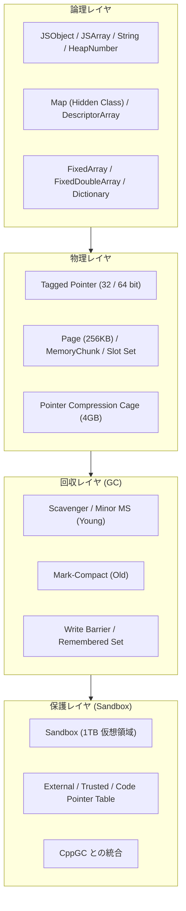

*図 B2-1 / 本章で扱うメモリ階層の俯瞰*

---

# 第 2 章 / メモリ管理と GC

## V8 メモリ管理 完全解説書

> 対象 V8 (`/home/user/v8`) 現行 main ブランチを実地に読み解いて作成
> 用途 登壇資料の参考文献

本書はV8 JavaScriptエンジンのメモリ管理機構について、ソースコードを直接読み解いた上で網羅的に解説した技術ドキュメントです。Tagged PointerのビットレイアウトからGCアルゴリズム、JITのコード配置、Sandboxによるメモリ保護まで、低レイヤから高レイヤまで一貫した視点で記述しています。各章は独立して読むことが可能で、すべての主張に対して該当ソースファイルと行番号を併記しています。

### 全体構成

- 第I部「オブジェクト表現とタグ付きポインタ」Tagged Pointer、SMIエンコーディング、HeapObjectレイアウト、Pointer Compression、Map (Hidden Class)、プロパティストレージモード
- 第II部「ヒープ構造とメモリ空間」Heap全体、PageとMemoryChunk、Young/Old/RO/LO Generation、Allocationメカニズム、CodeRangeと仮想メモリケージ、V8 Sandboxの概観
- 第III部「ガベージコレクション」Scavenger (Cheney)、Mark-Compact、Minor MS、Sticky Mark Bits、Write Barrier、Remembered Set、Conservative Stack Scanning、CppGCとの統合、アダプティブヒューリスティクス
- 第IV部「最適化機構」Inline Cache、Hidden Class Transition、Sparkplug/Maglev/TurboFan、Deoptimization、V8 Sandbox詳細、External/Trusted/Code Pointer Table、Embedded Builtins、Handle API
- 第V部「オブジェクトのメモリ表現」Stringの階層 (Seq/Cons/Sliced/Thin/External/Internalized)、JSArrayとElementsKind、FixedArray/FixedDoubleArray、JSArrayBuffer/TypedArray、HeapNumber、BigInt、JSObjectレイアウト

### 全体俯瞰図

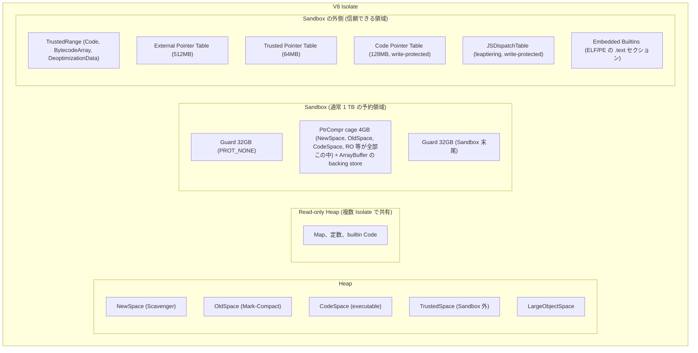

### 重要数値早見表

#### Tagged Pointer / SMI

| 項目 | 値 | 出典 |
| --- | --- | --- |
| `kHeapObjectTag` | 1 (0b01) | `include/v8-internal.h:57` |
| `kWeakHeapObjectTag` | 3 (0b11) | `include/v8-internal.h:58` |
| `kSmiTag` | 0 (0b0) | `include/v8-internal.h:65` |
| `kForwardingTag` | 0b00 (2 bit) | `include/v8-internal.h:62` |
| 32-bit / PtrCompr Smi 範囲 | -2^30 〜 2^30-1 | `SmiTagging<4>` |
| 64-bit 非圧縮 Smi 範囲 | -2^31 〜 2^31-1 | `SmiTagging<8>` |
| `kTaggedSize` (PtrCompr 有効) | 4 | `src/common/globals.h:567` |
| `kSystemPointerSize` (64bit) | 8 | `src/common/globals.h` |

#### Heap / Page / Space

| 項目 | 値 | 出典 |
| --- | --- | --- |
| `kPageSizeBits` (x64/arm64) | 18 | `src/base/build_config.h:80` |
| `kRegularPageSize` | 256 KB | `src/base/build_config.h:83` |
| `kMaxRegularHeapObjectSize` | 128 KB | `src/common/globals.h:720` |
| `kPtrComprCageReservationSize` | 4 GB | `include/v8-internal.h:167` |
| `kDefaultMinHeapSize` | 256 MB | `src/heap/heap.h:313` |
| `kDefaultMaxHeapSize` (64bit) | 4 GB | `src/heap/heap.h:315` |
| `DefaultMinSemiSpaceSize` | 512 KB | `src/heap/heap.cc:4828` |
| Scavenger Max semi-space | 32 MB | `src/heap/heap.cc:4840` |
| MinorMS Max semi-space | 72 MB | `src/heap/heap.cc:4835` |
| FreeList カテゴリ数 | 24 | `src/heap/free-list.h:327` |
| FreeList 最小ブロック | 3 * kTaggedSize | `src/heap/free-list.h:310` |
| LargePage 最大 (Code) | 512 MB | `src/heap/large-page.h:18` |
| `kMaximalCodeRangeSize` (x64) | 128 / 512 MB | `src/common/globals.h:515` |
| `kMaximalTrustedRangeSize` | 1 GB | `src/common/globals.h:531` |

#### Sandbox / Pointer Tables

| 項目 | 値 | 出典 |
| --- | --- | --- |
| `kSandboxSize` (通常 64bit) | 1 TB | `include/v8-internal.h:226` |
| `kSandboxSize` (Android/RISC-V) | 128 GB | `include/v8-internal.h:219` |
| `kSandboxSize` (iOS) | 16 GB | `include/v8-internal.h:221` |
| `kSandboxGuardRegionSize` | 32 GB + 32 GB | `include/v8-internal.h:296` |
| `kAdditionalTrailingGuardRegionSize` | 288 GB - 32 GB | `include/v8-internal.h:312` |
| `kSmiAddressRange` | 4 GB | `src/sandbox/sandbox.h:77` |
| `kSandboxMinimumReservationSize` | 8 GB | `include/v8-internal.h:271` |
| `kExternalPointerTableReservationSize` | 512 MB | `include/v8-internal.h:329` |
| `kTrustedPointerTableReservationSize` | 64 MB | `include/v8-internal.h:900` |
| `kCodePointerTableReservationSize` | 128 MB | `include/v8-internal.h:942` |
| `kMaxSafeBufferSizeForSandbox` | 32 GB - 1 | `include/v8-internal.h:281` |
| `kCodePointerHandleMarker` | 0x1 | `include/v8-internal.h:958` |

#### Map / Object

| 項目 | 値 | 出典 |
| --- | --- | --- |
| `Map::kSize` (PtrCompr 有効) | 約 40 バイト | `src/objects/map.h:1255` |
| `Map::kSize` (PtrCompr 無効) | 約 80 バイト | 同上 |
| `kMaxNumberOfDescriptors` | 1020 | `src/objects/property-details.h:249` |
| `kMaxNumberOfTransitions` | 1536 | `src/objects/transitions.h:150` |
| `kMaxElementsForLinearSearch` | 32 | `src/objects/transitions.h:319` |
| `JSObject::kMaxInObjectProperties` | 252 | `src/objects/js-objects.h:1035` |
| `JSObject::kMaxInstanceSize` | 255 * kTaggedSize | `src/objects/js-objects.h:966` |
| `kSwissNameDictionaryInitialCapacity` | 4 | `src/common/globals.h:3015` |
| `AllocationSite::kMaximumArrayBytesToPretransition` | 8 KB | `src/objects/allocation-site.h:25` |

#### String

| 項目 | 値 | 出典 |
| --- | --- | --- |
| `String::kMaxLength` (64bit) | (1<<29) - 24 ≈ 536M | `include/v8-primitive.h:129` |
| `String::kMaxLength` (32bit) | (1<<28) - 16 ≈ 268M | 同上 |
| `ConsString::kMinLength` | 13 | `src/objects/string.h:1076` |
| `SlicedString::kMinLength` | 13 | `src/objects/string.h:1181` |
| `String::kMaxHashCalcLength` | 16383 | `src/objects/string.h:541` |
| `String::kMaxOneByteCharCode` | 0xFF | `src/objects/string.h:525` |
| `String::kMaxCodePoint` | 0x10FFFF | `src/objects/string.h:529` |
| `kZeroHash` | 27 | `src/strings/string-hasher.h` |
| `kHoleNanInt64` | 0xFFF7FFFF'FFF7FFFF | `src/common/globals.h:2136` |

#### Array / TypedArray / ArrayBuffer

| 項目 | 値 | 出典 |
| --- | --- | --- |
| `JSArray::kPreallocatedArrayElements` | 4 | `src/objects/js-array.h:129` |
| `kMaxArrayLength` | 2^32-1 | `src/objects/js-array.h:142` |
| `kMaxFastArrayLength` (通常) | 32 MiB | `src/objects/js-array.h:148` |
| `kElementsKindBits` | 6 | `src/objects/elements-kind.h:193` |
| `kMaxFixedArrayCapacity` (通常) | 128 M | `src/objects/fixed-array.h:33` |
| `JSTypedArray::kMaxSizeInHeap` | 64 バイト | `src/objects/js-array-buffer.h:560` |
| `JSArrayBuffer::kMaxByteLength` (sandbox) | 32 GB - 1 | `src/objects/js-array-buffer.h:32` |
| `JSArrayBuffer::kMaxByteLength` (64bit 非 sandbox) | 2^53 - 1 | 同上 |

#### IC / Compiler / Deoptimizer

| 項目 | 値 | 出典 |
| --- | --- | --- |
| `DEFAULT_MAX_POLYMORPHIC_MAP_COUNT` | 4 | `src/flags/flag-definitions.h:3238` |
| `--invocation-count-for-feedback-allocation` | 8 | `src/flags/flag-definitions.h:1137` |
| `--invocation-count-for-maglev` | 400 (Android 1000) | `src/flags/flag-definitions.h:1140` |
| `--invocation-count-for-maglev-osr` | 100 | `src/flags/flag-definitions.h` |
| `--invocation-count-for-turbofan` | 3000 | `src/flags/flag-definitions.h:1148` |
| `--invocation-count-for-osr` | 500 | `src/flags/flag-definitions.h` |
| `Deoptimizer::kMaxNumberOfEntries` | 16384 | `src/deoptimizer/deoptimizer.h:167` |
| `BytecodeArray::kMaxSize` | 512 MB | `src/objects/bytecode-array.h:137` |
| `Interpreter::kDispatchTableSize` | 3 * 256 = 768 | `src/interpreter/interpreter.h:113` |
| `kReservedCodeRangePages` (Windows) | 1 | `src/common/globals.h:524` |

#### GC

| 項目 | 値 | 出典 |
| --- | --- | --- |
| `kTargetMutatorUtilization` | 0.97 | `src/heap/heap-controller.h:20` |
| `kMinGrowingFactor` | 1.1 | `src/heap/heap-controller.h:20` |
| `kMaxGrowingFactor` | 4.0 | `src/heap/heap-controller.h:21` |
| `kConservativeGrowingFactor` | 1.3 | `src/heap/heap-controller.h:22` |
| `kInterruptThreshold` (Scavenger) | 128 | `src/heap/scavenger.cc:339` |
| `kBytesUntilInterruptCheck` (ConcMark) | 64 KB | `src/heap/concurrent-marking.cc:365` |
| `kObjectsUntilInterruptCheck` (ConcMark) | 1000 | `src/heap/concurrent-marking.cc:366` |
| MarkingBitmap セル数/ページ | 1024 cells (8 KB) | `src/heap/marking.h:108` |
| Slot Set 1 bucket | 1024 bit | `src/heap/base/basic-slot-set.h:283` |
| `kMaxScavengerTasks` | 8 | `src/heap/scavenger.cc:1577` |
| `kTargetFragmentationPercent` (MC) | 70 | `src/heap/mark-compact.cc:623` |
| `kMarginForSmallHeaps` | 32 MB | `src/heap/heap-controller.h:162` |

---

## 第 I 部 オブジェクト表現とタグ付きポインタ

## V8 オブジェクト表現とタグ付きポインタ 完全解剖

本稿はV8 (現行mainブランチ) のオブジェクト表現、Tagged Pointer、Pointer Compression、Map (Hidden Class)、プロパティストレージの実装を、ソースコードの定数値・ビットレイアウト・関数定義レベルで解説したものです。すべての出典は `/home/user/v8` 配下のソースを直接参照しており、ファイルパスと行番号を併記しています。

---

### 1. Tagged Pointer の完全な解剖

#### 1.1 設計思想 - なぜ LSB に 1 ビット予約するのか

V8は値型 (整数) と参照型 (ヒープオブジェクト) を区別する必要がありますが、毎フィールドに型タグを別領域として持たせるとメモリと参照のオーバーヘッドが大きすぎます。V8はこれを **NaN-boxing ではなく、ポインタの最下位ビット (LSB) を利用したタグ付け** で解決しています。

ヒープに確保されるすべてのV8オブジェクトは `kObjectAlignment` (= `kTaggedSize`、通常4か8バイト) でアラインされているため、生のポインタの下位2〜3ビットは必ずゼロになります。この未使用ビットに型情報を埋め込むことで、ワード境界のロード1回で「値か参照か」を判別できます。

`src/objects/tagged.h:28-56` のクラスコメントは、3つの状態を以下のように記述しています。

```
//   * A small integer (Smi), shifted right, with the tag set to 0
//   * A strong pointer to an object on the V8 heap, with the tag set to 01
//   * A weak pointer to an object on the V8 heap, with the tag set to 11
//   * A cleared weak pointer, with the value 11
```

タグ値は `include/v8-internal.h:57-74` で以下のように定義されています。

```cpp
// Tag information for HeapObject.
const int kHeapObjectTag = 1;
const int kWeakHeapObjectTag = 3;
const int kHeapObjectTagSize = 2;
const intptr_t kHeapObjectTagMask = (1 << kHeapObjectTagSize) - 1;  // 0b11
const intptr_t kHeapObjectReferenceTagMask = 1 << (kHeapObjectTagSize - 1);

// Tag information for fowarding pointers stored in object headers.
// 0b00 at the lowest 2 bits in the header indicates that the map word is a
// forwarding pointer.
const int kForwardingTag = 0;
const int kForwardingTagSize = 2;
const intptr_t kForwardingTagMask = (1 << kForwardingTagSize) - 1;

// Tag information for Smi.
const int kSmiTag = 0;
const int kSmiTagSize = 1;
const intptr_t kSmiTagMask = (1 << kSmiTagSize) - 1;
```

ここで決定的なポイントは、LSB 1ビットだけ見ればSmi (= 0) とHeapObject (= 1) が即座に区別できることです。`Smi` の判定は他の判定より頻度が極端に高い (ループカウンタ、配列インデックス、ビット演算結果がほぼSmi) ため、`x & 1 == 0` という最短のマスク比較に最適化されています。

弱参照を区別するには2ビット必要なため、`kHeapObjectTagMask = 0b11` が併用されます。値 `0b01` が強参照、`0b11` が弱参照、`0b00` がSmiまたはGC中のforwarding pointerです。

#### 1.2 タグ判定マクロ

判定マクロは `src/common/globals.h:1978-1987` に集約されています。

```cpp
#define HAS_SMI_TAG(value) \
  ((static_cast<i::Tagged_t>(value) & ::i::kSmiTagMask) == ::i::kSmiTag)

#define HAS_STRONG_HEAP_OBJECT_TAG(value)                          \
  (((static_cast<i::Tagged_t>(value) & ::i::kHeapObjectTagMask) == \
    ::i::kHeapObjectTag))

#define HAS_WEAK_HEAP_OBJECT_TAG(value)                            \
  (((static_cast<i::Tagged_t>(value) & ::i::kHeapObjectTagMask) == \
    ::i::kWeakHeapObjectTag))
```

これらは `TaggedImpl` の `IsSmi`/`IsStrong`/`IsWeak` メソッド (`src/objects/tagged-impl.h:117-157`) から呼び出されます。

```cpp
constexpr bool IsSmi() const { return HAS_SMI_TAG(ptr_); }
constexpr inline bool IsHeapObject() const { return IsStrong(); }
constexpr inline bool IsStrong() const {
  DCHECK(kCanBeWeak || (!IsSmi() == HAS_STRONG_HEAP_OBJECT_TAG(ptr_)));
  return kCanBeWeak ? HAS_STRONG_HEAP_OBJECT_TAG(ptr_) : !IsSmi();
}
constexpr inline bool IsWeak() const {
  return IsWeakOrCleared() && !IsCleared();
}
constexpr inline bool IsCleared() const {
  return kCanBeWeak &&
         (static_cast<uint32_t>(ptr_) == kClearedWeakHeapObjectLower32);
}
```

#### 1.3 Cleared Weak Reference

`src/common/globals.h:1088-1102` には、クリアされた弱参照の表現が定義されています。

```cpp
const Address kWeakHeapObjectMask = 1 << 1;
// (中略)
const uint32_t kClearedWeakHeapObjectLower32 = 3;
```

クリアされた弱参照の下位32ビットは常に値 `3` (= `0b11`) です。これは「弱参照タグだけ立っていてアドレス部分は0」という状態であり、実在するヒープオブジェクトは下位32ビットが3にはならない (ページヘッダ領域に該当するため) ので、下位32ビットだけ比較すれば `IsCleared()` を判定できます。Pointer Compression有効時は上位32ビットにcage baseが乗っていることがありますが、`static_cast<uint32_t>()` で下位だけ比較しているのが上記コードのポイントです。

#### 1.4 Tagged<T> の階層

`src/objects/tagged.h:181-183` で型エイリアスが定義されています。

```cpp
using StrongTaggedBase = TaggedImpl<HeapObjectReferenceType::STRONG, Address>;
using WeakTaggedBase = TaggedImpl<HeapObjectReferenceType::WEAK, Address>;
```

そして `Tagged<T>` の特殊化階層は同ファイル58-72行のコメントが要約しています。

```
Tagged<Object> -> StrongTaggedBase
   Tagged<Smi> -> StrongTaggedBase
Tagged<T> -> Tagged<HeapObject> -> StrongTaggedBase

Tagged<Weak<Object>> -> WeakTaggedBase
   Tagged<Weak<Smi>> -> WeakTaggedBase
Tagged<Weak<T>> -> Tagged<Weak<HeapObject>> -> WeakTaggedBase
```

`Tagged<HeapObject>` の本体 (`src/objects/tagged.h:460-532`) を見ると、`address()` メソッドが `kHeapObjectTag` を引いて生アドレスに戻していることが分かります。

```cpp
Address address() const { return this->ptr() - kHeapObjectTag; }
```

`HeapObject::FromAddress` (`src/objects/heap-object.h:131-134`) は逆に生アドレスに `+1` してタグ付きにします。

```cpp
static inline Tagged<HeapObject> FromAddress(Address address) {
  DCHECK_TAG_ALIGNED(address);
  return Tagged<HeapObject>(address + kHeapObjectTag);
}
```

ここに「メモリ上のHeapObjectのアドレスは4/8バイトアラインされており、`ptr()` で返ってくる値は常にそのアドレス + 1」というルールが結晶化しています。

#### 1.5 MaybeObject と Weak の表現

`MaybeObject` は実体としては `Tagged<Union<Smi, HeapObject, Weak<HeapObject>>>` です。`src/objects/tagged.h:97-104` の `is_weak`/`is_maybe_weak` 型レベルテスト、307-308行のstatic_assertがこれを裏付けます。

```cpp
static_assert(
    is_subtype_v<Union<HeapObject, Weak<HeapObject>, Smi>, MaybeObject>);
```

`MakeWeak` の実装 (`src/objects/tagged.h:797-816`) は単純なビット演算です。

```cpp
template <typename T>
inline Tagged<WeakOf<T>> MakeWeak(Tagged<T> value) {
  static_assert(!is_subtype_v<Smi, T>, "Not allowed to make Smis weak.");
  return Tagged<WeakOf<T>>(value.ptr() | kWeakHeapObjectTag);
}
```

強参照タグ `01` に `kWeakHeapObjectTag = 3 (0b11)` をORすると `11` になります。逆に `MakeStrong` (812行) は `(~kWeakHeapObjectTag | kHeapObjectTag)` をANDすることで `11` の上位ビットを `01` に戻します。

#### 1.6 Tagged_t の定義

`Tagged_t` は **圧縮されたタグ付き値の生表現** で、`src/common/globals.h:559-580` で条件付きに定義されます。

```cpp
#ifdef V8_COMPRESS_POINTERS
static_assert(
    kSystemPointerSize == kInt64Size,
    "Pointer compression can be enabled only for 64-bit architectures");

constexpr int kTaggedSize = kInt32Size;
constexpr int kTaggedSizeLog2 = 2;

using Tagged_t = uint32_t;
using AtomicTagged_t = base::Atomic32;
#else
constexpr int kTaggedSize = kSystemPointerSize;
constexpr int kTaggedSizeLog2 = kSystemPointerSizeLog2;

using Tagged_t = Address;
using AtomicTagged_t = base::AtomicWord;
#endif
```

つまりPointer Compressionが有効なら `Tagged_t = uint32_t` (4バイト)、無効なら `Tagged_t = Address` (8バイトのuintptr_t) になります。ヒープ上のフィールドはすべて `Tagged_t` サイズで格納され、レジスタやスタックでは `Address` (フルポインタ) として扱われます。

#### 1.7 Forwarding Address (GC 中の特殊状態)

GC中、liveオブジェクトの最初のワード (map word) はforwarding pointerとして再利用されます。`src/objects/map-word.h:30-96` で `MapWord` 型が抽象化しており、その判定は `src/objects/map-word-inl.h:36-45` です。

```cpp
bool MapWord::IsForwardingAddress() const {
#ifdef V8_EXTERNAL_CODE_SPACE
  // When external code space is enabled forwarding pointers are encoded as
  // Smi representing a diff from the source object address in kObjectAlignment
  // chunks.
  return HAS_SMI_TAG(value_);
#else
  return (value_ & kForwardingTagMask) == kForwardingTag;
#endif  // V8_EXTERNAL_CODE_SPACE
}
```

通常モードでは下位2ビットが `0b00` (= `kForwardingTag`) であればforwardingです。「タグなしの生アドレス」を放り込むことでこの状態を作り、`FromForwardingAddress` (47-61行) は `object.ptr() - kHeapObjectTag` を格納することで実現しています。

External Code Space (Sandbox関連) が有効な場合は、Smiとして「ホストオブジェクトからの相対オフセット (in `kObjectAlignment` units)」を格納する設計に変わります。複数のPointer Compression cageを跨ぐ場合に絶対アドレスでは表せないためです。

なぜ `kForwardingTag = 0b00` を採用したかというと、Smiタグも0b0ですがSmiは1ビット (`kSmiTagSize = 1`) でしか判定しないため `kForwardingTag` (2ビット) と区別可能、かつmap pointerは常に強参照 (`0b01`) なので、生アドレス (`0b00`) との区別が `kHeapObjectTag` ビットだけで取れるからです。

---

### 2. SMI エンコーディング - 3 パターン詳説

`Smi` (Small Integer) はV8で整数を表す最も基本的かつ最頻出の表現で、その範囲とエンコード方式は **アーキテクチャと Pointer Compression の有無で 3 パターン** に分岐します。

#### 2.1 共通定義

`include/v8-internal.h:76-186` でSMIのテンプレートとプラットフォーム選択が定義されます。

```cpp
template <size_t tagged_ptr_size>
struct SmiTagging;
// ...
#ifdef V8_31BIT_SMIS_ON_64BIT_ARCH
using PlatformSmiTagging = SmiTagging<kApiInt32Size>;
#else
using PlatformSmiTagging = SmiTagging<kApiTaggedSize>;
#endif

const int kSmiShiftSize = PlatformSmiTagging::kSmiShiftSize;
const int kSmiValueSize = PlatformSmiTagging::kSmiValueSize;
const int kSmiMinValue = static_cast<int>(PlatformSmiTagging::kSmiMinValue);
const int kSmiMaxValue = static_cast<int>(PlatformSmiTagging::kSmiMaxValue);
constexpr bool SmiValuesAre31Bits() { return kSmiValueSize == 31; }
constexpr bool SmiValuesAre32Bits() { return kSmiValueSize == 32; }

V8_INLINE static constexpr Address IntToSmi(int value) {
  return (static_cast<Address>(value) << (kSmiTagSize + kSmiShiftSize)) |
         kSmiTag;
}
```

エンコード方式は `value << (kSmiTagSize + kSmiShiftSize) | kSmiTag` という単純な左シフトです。`kSmiTag` は0なので、実質的には「シフトしてアドレスとして格納する」だけです。

#### 2.2 パターン A: 32-bit アーキテクチャ (kTaggedSize = 4)

`include/v8-internal.h:83-131` の `SmiTagging<4>` 特殊化です。

```cpp
template <>
struct SmiTagging<4> {
  enum { kSmiShiftSize = 0, kSmiValueSize = 31 };

  static constexpr intptr_t kSmiMinValue =
      static_cast<intptr_t>(kUintptrAllBitsSet << (kSmiValueSize - 1));
  static constexpr intptr_t kSmiMaxValue = -(kSmiMinValue + 1);

  V8_INLINE static constexpr int SmiToInt(Address value) {
    int shift_bits = kSmiTagSize + kSmiShiftSize;
    // Truncate and shift down (requires >> to be sign extending).
    return static_cast<int32_t>(static_cast<uint32_t>(value)) >> shift_bits;
  }
  // ...
};
```

ビットレイアウト (32ビット):

| 種別 | ビット 31 | ビット 30..1 | ビット 0 |
| --- | --- | --- | --- |
| SMI | sign | 30 bit value | 0 |
| HeapObject | 30 bit address | | w1 (下位 2 ビットがタグ) |

`kSmiTagSize = 1`、`kSmiShiftSize = 0` なので、シフト幅は1。値域は -2^30 〜 2^30-1 (約 ±10.7億)。エンコード `IntToSmi(42)` の結果は `42 << 1 = 84 = 0x54`。デコード `SmiToInt(0x54)` は算術右シフト (sign-extending) で `0x54 >> 1 = 42`。

#### 2.3 パターン B: 64-bit アーキテクチャ (Pointer Compression 無効、kTaggedSize = 8)

`include/v8-internal.h:133-162` の `SmiTagging<8>` 特殊化です。

```cpp
template <>
struct SmiTagging<8> {
  enum { kSmiShiftSize = 31, kSmiValueSize = 32 };

  static constexpr intptr_t kSmiMinValue =
      static_cast<intptr_t>(kUintptrAllBitsSet << (kSmiValueSize - 1));
  static constexpr intptr_t kSmiMaxValue = -(kSmiMinValue + 1);

  V8_INLINE static constexpr int SmiToInt(Address value) {
    int shift_bits = kSmiTagSize + kSmiShiftSize;
    // Shift down and throw away top 32 bits.
    return static_cast<int>(static_cast<intptr_t>(value) >> shift_bits);
  }
  // ...
};
```

ビットレイアウト (64ビット):

| 種別 | ビット 63..32 | ビット 31..1 | ビット 0 |
| --- | --- | --- | --- |
| SMI | 32 bit signed value | 31 bits zero | 0 |
| HeapObject | 63 bit address (cage base 含む) | | w1 |

`kSmiShiftSize = 31` という大きなシフトに加え `kSmiTagSize = 1` で、合計32ビット左シフトします。これによりSMIは **上位 32 ビット** に整数値が来ます。下位32ビットは全てゼロ (タグの1ビット含む)。値域は -2^31 〜 2^31-1 (フルint32_t)。

なぜわざわざ上位32ビットに置くのか。これは **CPU が 32 ビット整数演算命令で SMI を直接扱えるようにするため** です。多くの64-bit CPUには符号拡張ロード (movsxd等) があり、上位32ビットを取り出してそのまま整数として演算できます。また、SMIをSMIのまま加減算する場合、シフト不要で実行できる (上位32ビットを直接addする) ためです。

`src/objects/tagged.h:418-420` の `Tagged<Smi>::value()` 実装:

```cpp
V8_INLINE constexpr int32_t value() const {
  return Internals::SmiValue(ptr());
}
```

これが内部で `SmiToInt` を呼び、`(intptr_t)ptr >> 32` で値を取り出します。

#### 2.4 パターン C: 64-bit + Pointer Compression (kTaggedSize = 4 on 64-bit)

`include/v8-internal.h:178-186` で:

```cpp
constexpr bool PointerCompressionIsEnabled() {
  return kApiTaggedSize != kApiSystemPointerSize;
}

#ifdef V8_31BIT_SMIS_ON_64BIT_ARCH
using PlatformSmiTagging = SmiTagging<kApiInt32Size>;
#else
using PlatformSmiTagging = SmiTagging<kApiTaggedSize>;
#endif
```

Pointer Compressionが有効な場合、`kApiTaggedSize = 4` になり (`include/v8-internal.h:164-176`)、`SmiTagging<4>` が選ばれます。つまり **64-bit でも SMI のレイアウトは 32-bit と同じ 31-bit Smi** になります。

ビットレイアウト (Pointer Compression有効、フルポインタとして見たとき):

| 種別 | ビット 63..32 | ビット 31..1 | ビット 0 |
| --- | --- | --- | --- |
| SMI | ガベージ (読まれない) | 31bit value | 0 |
| HeapObject | cage base (32bit) | 32bit offset | w1 |

メモリ上のフィールドは4バイトしかなく、上位32ビットは「使用していない」というより「読まれない」状態です。CPUレジスタにロードすると上位32ビットにはcage baseが入りますが、SMIの場合は単に切り捨てて `int32_t` として読みます。

#### 2.5 Smi クラスの実体

`src/objects/smi.h:25-131` の `class Smi : public AllStatic` は実体を持たず、`Tagged<Smi>` を生成するstatic関数群です。

```cpp
static inline constexpr Tagged<Smi> FromInt(int value) {
  DCHECK(Smi::IsValid(value));
  return Tagged<Smi>(Internals::IntegralToSmi(value));
}

static inline constexpr Tagged<Smi> FromIntptr(intptr_t value) {
  DCHECK(Smi::IsValid(value));
  int smi_shift_bits = kSmiTagSize + kSmiShiftSize;
  return Tagged<Smi>((static_cast<Address>(value) << smi_shift_bits) |
                     kSmiTag);
}

static inline constexpr Tagged<Smi> zero() { return Smi::FromInt(0); }
```

`Smi::zero()` はリテラル `0` のSMIで、未初期化フィールドの埋め草として頻繁に使われます。SMIゼロは `Tagged_t == 0` なので、`nullptr` と数値的に同一です (`src/objects/smi.h:128-130` の `uninitialized_deserialization_value` がこれを利用)。

#### 2.6 Smi 範囲チェック

`Smi::IsValid` は `Internals::IsValidSmi` に委譲され、最終的に `PlatformSmiTagging::IsValidSmi` です。31-bit Smiの場合:

```cpp
V8_INLINE static constexpr bool IsValidSmi(T value) {
  // Is value in range [kSmiMinValue, kSmiMaxValue].
  // Use unsigned operations in order to avoid undefined behaviour in case of
  // signed integer overflow.
  return (static_cast<uintptr_t>(value) -
          static_cast<uintptr_t>(kSmiMinValue)) <=
         (static_cast<uintptr_t>(kSmiMaxValue) -
          static_cast<uintptr_t>(kSmiMinValue));
}
```

unsigned subtractionの差で範囲チェックする古典的なテクニックです。条件分岐1つで両端をチェックでき、コンパイラが分岐予測しやすいコードになります。

#### 2.7 整合性アサーション

`src/common/globals.h:1023-1042` には設計の整合性を保証するstatic_assertがあります。

```cpp
static_assert(kSmiValueSize <= 32, "Unsupported Smi tagging scheme");
// Smi sign bit position must be 32-bit aligned so we can use sign extension
// instructions on 64-bit architectures without additional shifts.
static_assert((kSmiValueSize + kSmiShiftSize + kSmiTagSize) % 32 == 0,
              "Unsupported Smi tagging scheme");

constexpr bool kIsSmiValueInUpper32Bits =
    (kSmiValueSize + kSmiShiftSize + kSmiTagSize) == 64;
constexpr bool kIsSmiValueInLower32Bits =
    (kSmiValueSize + kSmiShiftSize + kSmiTagSize) == 32;

// Mask for the sign bit in a smi.
constexpr intptr_t kSmiSignMask = static_cast<intptr_t>(
    uintptr_t{1} << (kSmiValueSize + kSmiShiftSize + kSmiTagSize - 1));
```

「sign bitが必ず32-bit境界に置かれる」ことを保証することで、ハードウェアの符号拡張ロード命令がそのまま使えるようになっています。

---

### 3. HeapObject レイアウト

#### 3.1 先頭ワードは常に Map ポインタ

`src/objects/heap-object.h:62-401` で `HeapObject` クラスが定義されます。すべてのV8ヒープオブジェクトの基底クラスであり、最初のフィールドは `TaggedMember<Map> map_` です。

```cpp
V8_OBJECT class HeapObject {
 public:
  // [map]: Contains a map which contains the object's reflective
  // information.
  DECL_GETTER(map, Tagged<Map>)
  // ...
 public:
  TaggedMember<Map> map_;
} V8_OBJECT_END;

static_assert(offsetof(HeapObject, map_) == Internals::kHeapObjectMapOffset);
```

`Internals::kHeapObjectMapOffset` は `include/v8-internal.h:1027` で:

```cpp
static const int kHeapObjectMapOffset = 0;
```

つまり **オフセット 0 (オブジェクトの先頭ワード) は常に Map ポインタ** という不変条件があります。これにより、任意のHeapObjectに対して `*reinterpret_cast<Tagged_t*>(ptr - kHeapObjectTag)` でMapを取り出せます。

#### 3.2 Map word と GC

GC中はこのワードがforwarding pointerになり得ます。`src/objects/heap-object.h:115-124` でアクセサが分かれています。

```cpp
DECL_RELAXED_GETTER(map_word, MapWord)
inline void set_map_word(Tagged<Map> map, RelaxedStoreTag);
inline void set_map_word_forwarded(Tagged<HeapObject> target_object,
                                   RelaxedStoreTag);

DECL_ACQUIRE_GETTER(map_word, MapWord)
inline void set_map_word(Tagged<Map> map, ReleaseStoreTag);
```

通常実行中は `map()` でMapを直接取れますが、GC中は `map_word()` で `MapWord` 抽象を取り、`IsForwardingAddress()` でチェックする必要があります。

#### 3.3 SizeFromMap

`src/objects/heap-object.h:150-151`:

```cpp
V8_EXPORT_PRIVATE int SizeFromMap(Tagged<Map> map) const;
V8_EXPORT_PRIVATE SafeHeapObjectSize SafeSizeFromMap(Tagged<Map> map) const;
```

実装は `src/objects/objects.cc:1996-2169` にあり、Mapから取れる `instance_size` フィールドを使うのが基本ですが、可変長オブジェクト (`kVariableSizeSentinel`) の場合はinstance typeごとに分岐して計算します。

```cpp
int HeapObject::SizeFromMap(Tagged<Map> map) const {
  int instance_size = map->instance_size();
  if (instance_size != kVariableSizeSentinel) return instance_size;
  // Only inline the most frequent cases.
  InstanceType instance_type = map->instance_type();
  if (InstanceTypeChecker::IsMap(instance_type)) {
    return UncheckedCast<Map>(this)->AllocatedSize();
  }
  if (base::IsInRange(instance_type, FIRST_FIXED_ARRAY_TYPE,
                      LAST_FIXED_ARRAY_TYPE)) {
    return UncheckedCast<FixedArray>(this)->AllocatedSize();
  }
  // ... 文字列、Context、BytecodeArray、DescriptorArray など個別の長さ計算
}
```

例えば文字列の場合は `length` フィールドからバイト数を計算します。

#### 3.4 アラインメント

`src/common/globals.h:1044-1058` でアラインメント定数が定義されます。

```cpp
// Desired alignment for tagged pointers.
constexpr int kObjectAlignmentBits = kTaggedSizeLog2;
constexpr intptr_t kObjectAlignment = 1 << kObjectAlignmentBits;
constexpr intptr_t kObjectAlignmentMask = kObjectAlignment - 1;

// Object alignment for 8GB pointer compressed heap.
constexpr intptr_t kObjectAlignment8GbHeap = 8;
constexpr intptr_t kObjectAlignment8GbHeapMask = kObjectAlignment8GbHeap - 1;

#ifdef V8_COMPRESS_POINTERS_8GB
static_assert(
    kObjectAlignment8GbHeap == 2 * kTaggedSize,
    "When the 8GB heap is enabled, all allocations should be aligned to twice "
    "the size of a tagged value.");
#endif
```

通常モードでは `kObjectAlignment == kTaggedSize` (4または8)。8GBモードでは2倍の8バイト固定で、これによりタグ用に使えるビットが増え、4GBを超えるヒープを32-bit Tagged_tで扱えるようになります。

---

### 4. Pointer Compression 詳細

#### 4.1 動機

64-bit環境ではTagged pointerが8バイトになり、JSヒープのメモリ使用量がほぼ倍増します。多くのワークロード (特にウェブブラウザ) ではヒープが4GBを超えることは稀なので、**ヒープを 4GB のケージ (cage) に閉じ込めて、すべてのタグ付き参照を 32-bit のオフセットで持つ** ことでメモリ使用量を約40% 削減できます。これがPointer Compressionの中核アイデアです。

実測値としてV8チームのブログ記事によれば、典型的なウェブアプリでV8ヒープサイズが40% 程度削減され、ガベージコレクション時間も短縮されるという結果が出ています (キャッシュ局所性の向上が大きい)。

#### 4.2 ケージ (Cage) の概念

`include/v8-internal.h:164-180`:

```cpp
#ifdef V8_COMPRESS_POINTERS
// See v8:7703 or src/common/ptr-compr-inl.h for details about pointer
// compression.
constexpr size_t kPtrComprCageReservationSize = size_t{1} << 32;  // 4GB
constexpr size_t kPtrComprCageBaseAlignment = size_t{1} << 32;    // 4GB align

static_assert(
    kApiSystemPointerSize == kApiInt64Size,
    "Pointer compression can be enabled only for 64-bit architectures");
const int kApiTaggedSize = kApiInt32Size;
#else
const int kApiTaggedSize = kApiSystemPointerSize;
#endif
```

V8は4GBの連続した仮想アドレス領域を `mmap` で予約し、そこを **cage** と呼びます。cageの **base アドレスは 4GB 境界にアラインされている** (`kPtrComprCageBaseAlignment = 2^32`)。

ヒープオブジェクトは必ずこのcage内に確保されるので、フルポインタの下位32ビットは「cageのbaseからのオフセット」を表します。圧縮はこの下位32ビットを切り出すだけ、解凍はcage baseに下位32ビットを足すだけ、という極めて簡単な操作になります。

#### 4.3 圧縮スキームの実装

`src/common/ptr-compr.h:22-74` で `V8HeapCompressionSchemeImpl` テンプレートが定義されています。

```cpp
template <typename Cage>
class V8HeapCompressionSchemeImpl {
 public:
  V8_INLINE static constexpr Address GetPtrComprCageBaseAddress(
      Address on_heap_addr);
  V8_INLINE static Address GetPtrComprCageBaseAddress(
      PtrComprCageBase cage_base);
  V8_INLINE static Tagged_t CompressObject(Address tagged);
  V8_INLINE static constexpr Tagged_t CompressAny(Address tagged);
  V8_INLINE static Address DecompressTaggedSigned(Tagged_t raw_value);
  V8_INLINE static Address DecompressTagged(Tagged_t raw_value);
  // ...
};

class MainCage : public AllStatic {
  // ...
#ifdef V8_COMPRESS_POINTERS_IN_SHARED_CAGE
  static V8_EXPORT_PRIVATE uintptr_t base_ V8_CONSTINIT;
#else
  static thread_local uintptr_t base_ V8_CONSTINIT;
#endif
};
using V8HeapCompressionScheme = V8HeapCompressionSchemeImpl<MainCage>;
```

cage baseはプロセス全体で1つ、またはthread_localです。

実装本体 `src/common/ptr-compr-inl.h:35-130`:

```cpp
constexpr Address kPtrComprCageBaseMask = ~(kPtrComprCageBaseAlignment - 1);

template <typename Cage>
constexpr Address V8HeapCompressionSchemeImpl<Cage>::GetPtrComprCageBaseAddress(
    Address on_heap_addr) {
  return RoundDown<kPtrComprCageBaseAlignment>(on_heap_addr);
}

template <typename Cage>
Tagged_t V8HeapCompressionSchemeImpl<Cage>::CompressObject(Address tagged) {
#ifdef V8_COMPRESS_POINTERS
  DCHECK_IMPLIES(
      !HAS_SMI_TAG(tagged) && (tagged != kClearedWeakHeapObjectLower32),
      (tagged & kPtrComprCageBaseMask) == base());
#endif
  return static_cast<Tagged_t>(tagged);
}

template <typename Cage>
Address V8HeapCompressionSchemeImpl<Cage>::DecompressTagged(
    Tagged_t raw_value) {
#ifdef V8_COMPRESS_POINTERS
  Address cage_base = base();
#else
  Address cage_base = GetPtrComprCageBaseAddress(on_heap_addr);
#endif
  Address result = cage_base + static_cast<Address>(raw_value);
  V8_ASSUME(static_cast<uint32_t>(result) == raw_value);
  return result;
}
```

**圧縮 = `(uint32_t)tagged`**、**解凍 = `cage_base + raw_value`** という極めてシンプルな実装です。

`GetPtrComprCageBaseAddress(on_heap_addr)` は4GBアラインに丸めるだけ。任意のヒープ内アドレスが渡されるとcage baseに戻せます。cageが4GB境界にあるからこそ、上位32ビットを0にすればcage baseになるという性質を利用しています。

#### 4.4 V8 の 3 種類の Compression Scheme

##### (1) V8HeapCompressionScheme (MainCage)

通常のヒープオブジェクト用。`src/common/ptr-compr.h:74` で定義。

##### (2) TrustedSpaceCompressionScheme (TrustedCage)

`src/common/ptr-compr.h:76-99`。Sandbox有効時 (`V8_ENABLE_SANDBOX`)、コードやtrustedオブジェクトを格納する別cageを使います。Sandbox内のスクリプトから直接アドレスを書き換えられないようにするためです。Sandbox無効時はMainCageと同じ扱い。

##### (3) ExternalCodeCompressionScheme

`src/common/ptr-compr.h:116-200` および `src/common/ptr-compr-inl.h:150-256`。`InstructionStream` (実行可能コード) 用の特殊なスキームで、コード領域が4GB cage境界をまたいでも良いように、デコードが少し複雑になっています。

ヘッダのコメント (`src/common/ptr-compr.h:128-149`) からその構造を:

```
//    --|----------{---------|------}--------------|--
//     4GB         |        4GB     |             4GB
//                 +-- code range --+
//                 |
//             cage base
```

cage baseがコード範囲の左端 (4GB境界ではない)。コードに対する圧縮は単に下位32ビットを取るが、解凍はbaseとの大小比較が必要です。

`src/common/ptr-compr-inl.h:218-239`:

```cpp
Address ExternalCodeCompressionScheme::DecompressTagged(Tagged_t raw_value) {
  Address cage_base = base();
  // ...
  Address diff = static_cast<Address>(static_cast<uint32_t>(raw_value)) -
                 static_cast<Address>(static_cast<uint32_t>(cage_base));
  // The cage base value was chosen such that it's less or equal than any
  // pointer in the cage, thus if we got a negative diff then it means that
  // the decompressed value is off by 4GB.
  if (static_cast<intptr_t>(diff) < 0) {
    diff += size_t{4} * GB;
  }
  // ...
  Address result = cage_base + diff;
  return result;
}
```

`cage_base + 4GB` を超えるアドレスにあるオブジェクトについて、下位32ビットの引き算結果が負になるので4GBを足し戻す、という調整が入ります。

#### 4.5 V8_COMPRESS_POINTERS_8GB

`src/common/globals.h:644-648`:

```cpp
#ifdef V8_COMPRESS_POINTERS_8GB
#define V8_COMPRESS_POINTERS_8GB_BOOL true
#else
#define V8_COMPRESS_POINTERS_8GB_BOOL false
#endif
```

通常のPointer Compressionは4GB cage (`Tagged_t = uint32_t` で4バイト境界アラインなら30ビットしか使えない領域も含めて4GB) ですが、`V8_COMPRESS_POINTERS_8GB` を有効にすると **オブジェクトアラインメントを `kTaggedSize` の 2 倍 = 8 バイト** にすることで、`Tagged_t` の下位3ビットを使えるようになり (タグ用1ビット + アラインメント保証分2ビット)、ヒープを8GBまで拡張できる仕組みです。

`src/common/globals.h:1049-1058`:

```cpp
constexpr intptr_t kObjectAlignment8GbHeap = 8;
constexpr intptr_t kObjectAlignment8GbHeapMask = kObjectAlignment8GbHeap - 1;

#ifdef V8_COMPRESS_POINTERS_8GB
static_assert(
    kObjectAlignment8GbHeap == 2 * kTaggedSize,
    "When the 8GB heap is enabled, all allocations should be aligned to twice "
    "the size of a tagged value.");
#endif
```

つまり32-bit Tagged_tの上位3ビットは「8GBヒープのオフセット (4でシフトされた値)」、下位3ビットはタグ、というレイアウトになります。

#### 4.6 PtrComprCageAccessScope

複数のアイソレートを使うケースでcage baseを切り替えるRAIIオブジェクトが `src/common/ptr-compr.h:246-267` にあります。

```cpp
#ifdef V8_COMPRESS_POINTERS_IN_MULTIPLE_CAGES
class V8_NODISCARD PtrComprCageAccessScope final {
 public:
  V8_INLINE explicit PtrComprCageAccessScope(Isolate* isolate);
  V8_INLINE ~PtrComprCageAccessScope();
 private:
  const Address cage_base_;
  // ...
};
#else
class V8_NODISCARD PtrComprCageAccessScope final {
 public:
  V8_INLINE explicit PtrComprCageAccessScope(Isolate* isolate) {}
};
#endif
```

multi-cageモードではアイソレートごとに別cageを持てるので、スレッドorアイソレート切替時にここでbaseを入れ替えます。実装は `src/common/ptr-compr-inl.h:340-376` にあります。

#### 4.7 圧縮のパフォーマンス特性

(1) **メモリ削減**: タグ付きフィールドはオブジェクトの大半を占めるので、ヒープサイズが約40% 縮小。
(2) **キャッシュ効率**: 同じデータ量で2倍のオブジェクトがL1/L2キャッシュに乗る。
(3) **解凍コスト**: `cage_base + raw_value` の1命令 (x86-64だとLEA命令一発)。`DECOMPRESS_POINTER_BY_ADDRESSING_MODE` (`src/common/globals.h:112-116`) が有効な場合は明示的な解凍命令も不要で、アドレッシングモードに混ぜ込めます。
(4) **SMI のコストはゼロ増**: SMIは `DecompressTaggedSigned` が `static_cast<Address>(raw_value)` だけで終わるため、上位32ビットがガベージでも問題ない (`SmiToInt` が下位32ビットしか見ない)。

---

### 5. Map (Hidden Class / Shape) の構造

#### 5.1 Map の役割

JavaScriptオブジェクトは動的にプロパティを追加・削除できますが、V8はオブジェクトごとに型情報をフルに保持せず、**形 (shape) を共有する Map を介して参照** する仕組み (Hidden Class、SelfやStrongTalkの概念に由来) を採用しています。同じプロパティ集合・順序を持つオブジェクトは同じMapを共有し、Mapにプロパティ名・型・オフセットの索引 (DescriptorArray) が紐付きます。

#### 5.2 Map の物理レイアウト

`src/objects/map.h:258-1247` で定義。フィールド宣言は1223-1246行に集中しています。

```cpp
V8_OBJECT class Map : public HeapObject {
 public:
  // ... 大量のメソッド宣言 ...
 public:
  // Backwards-compatible offset constants. Defined out-of-line below
  // because offsetof / sizeof on Map cannot appear inside Map's own body.
  static const int kBitFieldOffsetEnd;
  static const int kEndOfWeakFieldsOffset;
  static const int kHeaderSize;
  static const int kSize;

  std::atomic<uint8_t> instance_size_in_words_;
  std::atomic<uint8_t> inobject_properties_start_or_constructor_function_index_;
  std::atomic<uint8_t> used_or_unused_instance_size_in_words_;
  std::atomic<uint8_t> visitor_id_;
  std::atomic<uint16_t> instance_type_;
  std::atomic<uint8_t> bit_field_;
  uint8_t bit_field2_;
  std::atomic<uint32_t> bit_field3_;
#if TAGGED_SIZE_8_BYTES
  uint32_t optional_padding_;
#endif
  TaggedMember<UnionOf<JSReceiver, Null>> prototype_;
  TaggedMember<Object> constructor_or_back_pointer_or_native_context_;
#if V8_ENABLE_WEBASSEMBLY
  TaggedMember<UnionOf<DescriptorArray, WasmStruct>> instance_descriptors_;
  TaggedMember<UnionOf<DependentCode, Map>> dependent_code_;
#else
  TaggedMember<DescriptorArray> instance_descriptors_;
  TaggedMember<DependentCode> dependent_code_;
#endif
  TaggedMember<UnionOf<Smi, Cell>> prototype_validity_cell_;
  TaggedMember<UnionOf<Smi, MaybeWeak<Map>, TransitionArray, PrototypeInfo,
                       PrototypeSharedClosureInfo>>
      transitions_or_prototype_info_;
} V8_OBJECT_END;
```

オフセット定義は外側 (1251-1257行):

```cpp
inline constexpr int Map::kBitFieldOffsetEnd =
    offsetof(Map, bit_field_) + sizeof(uint8_t) - 1;
inline constexpr int Map::kEndOfWeakFieldsOffset = sizeof(Map);
inline constexpr int Map::kHeaderSize = sizeof(Map);
inline constexpr int Map::kSize = sizeof(Map);
```

具体的なバイトレイアウトは (Pointer Compression有効、64-bit、`kTaggedSize = 4`):

| Offset | Size | Field |
| --- | --- | --- |
| 0 | 4 | `HeapObject::map_` (Map 自身の Map を指す = MetaMap) |
| 4 | 1 | `instance_size_in_words_` |
| 5 | 1 | `inobject_properties_start_or_constructor_function_index_` |
| 6 | 1 | `used_or_unused_instance_size_in_words_` |
| 7 | 1 | `visitor_id_` |
| 8 | 2 | `instance_type_` (uint16_t) |
| 10 | 1 | `bit_field_` |
| 11 | 1 | `bit_field2_` |
| 12 | 4 | `bit_field3_` (uint32_t) |
| 16 | 4 | `prototype_` (TaggedMember) |
| 20 | 4 | `constructor_or_back_pointer_or_native_context_` |
| 24 | 4 | `instance_descriptors_` |
| 28 | 4 | `dependent_code_` |
| 32 | 4 | `prototype_validity_cell_` |
| 36 | 4 | `transitions_or_prototype_info_` |

合計 **40 バイト** (Pointer Compression有効時)。`TAGGED_SIZE_8_BYTES` (Pointer Compression無効) の場合は `optional_padding_` (4バイト) と全タグフィールドが8バイトに膨らみ、合計約 **80 バイト** になります。

このコンパクトな表現は重要で、Mapインスタンスは多数生成されるためサイズが体感性能に直結します。Mapのスロット (`prototype_validity_cell_` をSmiで兼用するなど) が複合union型になっているのも、サイズ削減のための工夫です。

#### 5.3 instance_type の重要性

`include/v8-internal.h:1028`:

```cpp
static const int kMapInstanceTypeOffset = 1 * kApiTaggedSize + kApiInt32Size;
```

`map.h:1259-1260` のstatic_assert:

```cpp
static_assert(offsetof(Map, instance_type_) ==
              Internals::kMapInstanceTypeOffset);
```

つまりMapのオフセット8 (Pointer Compression時) はABI的に固定されており、外部APIからも参照される位置です。`InstanceType` の値は `src/objects/instance-type.h:116` 以降 (とりわけTorque生成された `TORQUE_ASSIGNED_INSTANCE_TYPES`) で列挙される全V8オブジェクト型の判別子です。

```cpp
enum InstanceType : uint16_t {
  INTERNALIZED_TWO_BYTE_STRING_TYPE =
      kTwoByteStringTag | kSeqStringTag | kInternalizedTag,
  // ...
  // String タイプは下位ビットが特殊なビットフィールドになっている
  // それ以外は Torque で生成される連番
};
```

文字列型のみ、エンコード/representationのビット (`kStringRepresentationAndEncodingMask = 0x0f`、`include/v8-internal.h:1050`) を埋め込んでおり、Mapを見ずにinstance_type一発で文字列の表現 (one-byte/two-byte、seq/cons/external/sliced/thin) を判定できます。文字列操作のホットパス最適化です。

#### 5.4 prototype と constructor

`prototype_` フィールドは型 `UnionOf<JSReceiver, Null>` で、`__proto__` 参照を保持します。プロトタイプチェーンはここを辿ります。

`constructor_or_back_pointer_or_native_context_` は多目的フィールドで:

- 新規Map (transitionなし) の場合: コンストラクタ関数 (Function)
- transition後のMapの場合: 親Mapへのback pointer
- NativeContextのメタマップの場合: NativeContext自身

このように `Object` 型unionとして複数の意味を持たせることでMapのサイズを節約しています。

#### 5.5 DescriptorArray

Mapに紐付くプロパティの定義情報を持つのが `DescriptorArray` (`src/objects/descriptor-array.h:89-329`)。Mapの `instance_descriptors_` フィールドが指します。

レイアウト (`src/objects/descriptor-array.h:62-88` のクラスコメントより):

```
//   Header:
//     Tagged<Smi>(0) <- number_of_all_descriptors
//     Tagged<Smi>(0) <- number_of_descriptors
//     Tagged<Smi>(0) <- raw_gc_state
//     Tagged<Smi>(0) <- flags
//     Tagged<EnumCache>
//   Body:
//     [kHeaderSize + 0]: first key (and internalized String)
//     [kHeaderSize + 1]: first descriptor details (see PropertyDetails)
//     [kHeaderSize + 2]: first value for constants / Tagged<Smi>(1) when not
//     used
//   Slack:
//     [kHeaderSize + number of descriptors * 3]: start of slack
```

具体的な定数 (228-235行):

```cpp
static const int kEntryKeyIndex = 0;
static const int kEntryDetailsIndex = 1;
static const int kEntryValueIndex = 2;
static const int kEntrySize = 3;

static const int kEntryKeyOffset = kEntryKeyIndex * kTaggedSize;
static const int kEntryDetailsOffset = kEntryDetailsIndex * kTaggedSize;
static const int kEntryValueOffset = kEntryValueIndex * kTaggedSize;
```

各エントリは **(キー、詳細、値)** の3ワードで、合計12バイト (Pointer Compression時) または24バイト (非圧縮時)。

- **key**: `TaggedMember<UnionOf<Name, Undefined>>` (internalized StringまたはSymbol)
- **details**: `TaggedMember<UnionOf<Smi, Undefined>>` (`PropertyDetails` のビットパック)
- **value**: フィールドプロパティの場合は `FieldType` (`Smi` のAny/None、または弱参照 `Weak<Map>`)、アクセサの場合は `AccessorPair`/`AccessorInfo`、定数の場合は実際の値

詳細フィールドのビットレイアウトは `src/objects/property-details.h` (PropertyDetails) で定義されていて、kind (data / accessor)、location (in-object / not-in-object)、representation (Smi/HeapObject/Double/Tagged)、constness、attributes (writable/enumerable/configurable)、field index、representation等が詰め込まれています。

最大エントリ数は `src/objects/property-details.h:249`:

```cpp
static const int kMaxNumberOfDescriptors = (1 << kDescriptorIndexBitCount) - 4;
// kDescriptorIndexBitCount = 10 (242 行) -> 1020 個
```

つまり1つのMapに最大1020個のプロパティ。これを超えるとdictionary modeに遷移します。

#### 5.6 TransitionArray

`src/objects/transitions.h:301-380` の `class TransitionArray : public WeakFixedArray`。

Map間の遷移を記録します。プロパティ追加・属性変更・elements_kind変更などで新しいMapが生成されると、親Map → 子Mapの遷移が登録されます。

レイアウト (305-314行のコメントより):

```
// [0] Tagged<Smi>(0) or WeakFixedArray of prototype transitions (strong ref)
// [1] Tagged<Smi>(0) or WeakFixedArray of side-step transitions (strong ref)
// [2] Number of transitions (can be zero after trimming)
// [3] First transition key (strong ref)
// [4] First transition target (weak ref)
// ...
// [4 + number of transitions * kTransitionSize]: start of slack
```

定数 (352-360行):

```cpp
static const int kPrototypeTransitionsIndex = 0;
static const int kSideStepTransitionsIndex = 1;
static const int kTransitionLengthIndex = 2;
static const uint32_t kFirstIndex = 3;

static const int kEntryKeyIndex = 0;
static const int kEntryTargetIndex = 1;
static const int kEntrySize = 2;
```

各エントリは **(プロパティ名、ターゲット Map)** の2ワード。ターゲットMapは弱参照 (`Weak<Map>`) で持つので、誰も参照しなくなったらGCで回収できます。これにより不要なMapの蓄積を防ぎます。

#### 5.7 Map Transition の流れ

新しいプロパティを追加するときの典型的な流れ (`src/objects/map.cc:2155-2189` の `Map::TransitionToDataProperty` 周辺):

1. 既存のtransition treeから該当する子Mapを探す (`FindTransitionToDataProperty`)
2. 見つかれば再利用
3. 見つからなければ、`map->TooManyFastProperties(store_origin)` をチェック
4. fast propertyに余裕があれば新しいMapを `CopyWithField` で生成し、親にtransitionを登録
5. プロパティ数が閾値を超えていたら `Normalize` でdictionary modeに変換

`src/objects/map-inl.h:291-300` の判定:

```cpp
bool Map::TooManyFastProperties(StoreOrigin store_origin) const {
  if (UnusedPropertyFields() != 0) return false;
  if (store_origin != StoreOrigin::kMaybeKeyed) return false;
  if (is_prototype_map()) return false;
  int limit = std::max(
      {v8_flags.fast_properties_soft_limit.value(), GetInObjectProperties()});
  int external =
      NumberOfFields(ConcurrencyMode::kSynchronous) - GetInObjectProperties();
  return external > limit;
}
```

外部 (out-of-object) プロパティがsoft limit (デフォルト12程度) を超え、かつキー付きstoreの場合に「ファストプロパティ多すぎ」と判定してdictionary modeに切り替えます。

#### 5.8 In-object vs Out-of-object プロパティ

`inobject_properties_start_or_constructor_function_index_` フィールドはJSObjectの場合「インオブジェクトプロパティの開始ワード」を表します。Mapの `instance_size` がオブジェクトの総サイズ、`inobject_properties_start_in_words` 以降がin-object propertyのスロット領域です。

JSObjectの物理レイアウト (Pointer Compression):

| Offset | フィールド | 説明 |
| --- | --- | --- |
| 0 | map ポインタ | HeapObject 基底 |
| 4 | `properties_or_hash_` | JSReceiver の追加フィールド、PropertyArray か Hash |
| 8 | `elements_` | JSObject の追加フィールド、要素配列 |
| 12- | in-object property 1, 2, 3, ... | Map で決まる N 個 |

JSObjectのヘッダサイズは `src/objects/js-objects.h:1033`:

```cpp
inline constexpr int JSObject::kHeaderSize = sizeof(JSObject);
```

Pointer Compression有効時は12バイト (map + properties_or_hash + elements)。

最大in-objectプロパティ数は (`js-objects.h:1035-1036`):

```cpp
inline constexpr int JSObject::kMaxInObjectProperties =
    (JSObject::kMaxInstanceSize - JSObject::kHeaderSize) >> kTaggedSizeLog2;
// kMaxInstanceSize = 255 * kTaggedSize (js-objects.h:966)
```

つまり最大 (255 - JSObject::kHeaderSize/kTaggedSize) 個 = 252個程度のin-objectプロパティが入ります (`kMaxInstanceSize >> kTaggedSizeLog2 <= 255` のため、`instance_size_in_words` を `uint8_t` で表せる)。

---

### 6. プロパティストレージのメモリレイアウト

#### 6.1 3 つのプロパティストレージモード

V8のオブジェクトは状態に応じて3通りのプロパティ保持方法を使い分けます。

##### モード 1: In-object property only (fast mode、最頻出)

オブジェクト自身の末尾に直接プロパティを並べる方式。Mapがin-object slotのインデックスをDescriptorで持っており、`object_address + offset` で1命令でアクセスできます。

例: `var o = {a: 1, b: 2, c: 3}` で、初期Mapが `kFieldsAdded = 3` 個のin-object slotを持って生成されると、:

`o` の物理レイアウト:

| Offset | フィールド | 説明 |
| --- | --- | --- |
| 0 | map ポインタ | |
| 4 | `properties_or_hash_` | empty_fixed_array |
| 8 | `elements_` | empty_fixed_array |
| 12 | a の値 | Smi(1) または HeapNumber へのポインタ |
| 16 | b の値 | |
| 20 | c の値 | |

DescriptorArrayの各エントリのvalue部分は `FieldType` (`FieldType::Any` か `FieldType::None` か `Weak<Map>`)、そのfield indexでin-objectオフセットを計算。

##### モード 2: In-object + PropertyArray (extended fast mode)

in-object slotを使い切ったあとは `properties_or_hash_` フィールドが `PropertyArray` を指し、追加プロパティはそこに格納されます。

`src/objects/property-array.h:18-89`:

```cpp
V8_OBJECT class PropertyArray : public HeapObject {
 public:
  // ...
  static const int kLengthFieldSize = 10;
  using LengthField = base::BitField<int, 0, kLengthFieldSize>;
  static const int kMaxLength = LengthField::kMax;
  using HashField = base::BitField<int, kLengthFieldSize,
                                   kSmiValueSize - kLengthFieldSize - 1>;
  // ...
 public:
  TaggedMember<Smi> length_and_hash_;
  FLEXIBLE_ARRAY_MEMBER(TaggedMember<Object>, objects);
} V8_OBJECT_END;

constexpr int PropertyArray::SizeFor(int length) {
  return OFFSET_OF_DATA_START(PropertyArray) + length * kTaggedSize;
}
```

`length_and_hash_` フィールドがSmiとして **長さ (10 ビット) とハッシュ (残り 21 または 22 ビット)** を兼用します。最大長 `kMaxLength = 2^10 - 1 = 1023` 個。`kFieldsAdded = 3` (`js-objects.h:975`) ずつ拡張されます。

##### モード 3: Dictionary mode (slow mode)

プロパティ数が多すぎる、または非常に動的な振る舞い (繰り返し追加・削除) のオブジェクトでは、Mapによるfast propertyを諦めてhash tableで保持します。

DescriptorArrayを捨てて、`properties_or_hash_` フィールドに `NameDictionary` または `SwissNameDictionary` (Abseil flat_hash_mapベース) を入れます。

#### 6.2 Dictionary mode 遷移条件

`src/objects/map.cc:2155-2189` の流れで:

```cpp
if (!map->TooManyFastProperties(store_origin)) {
  // CopyWithField で fast transition
} else {
  // Normalize で dictionary mode へ
}
```

`TooManyFastProperties` の条件:

- in-object領域使い切り
- かつPropertyArray (out-of-object) のフィールド数が `soft_limit` (`v8_flags.fast_properties_soft_limit`、デフォルト約12) を超える
- かつstore originが `kMaybeKeyed` (動的キーの代入)

「不要にdictionaryに落ちないようにヒューリスティックで判定する」設計です。`for (var key in obj) obj[key] = ...` のようなコードは `kMaybeKeyed`、`obj.foo = ...` のようなコードは `kNamed` で、後者はdictionaryに落ちにくくなります。

その他の遷移トリガーは `js-objects.cc` の `NormalizeProperties` を呼ぶ箇所:

- `Object.defineProperty` で属性 (writable/enumerable/configurable) を動的に変更
- プロパティの削除 (`delete obj.foo`)
- prototypeが変更され大量のキャッシュが無効化される

#### 6.3 NameDictionary (旧来の dict)

`src/objects/dictionary.h:176-180`:

```cpp
class NameDictionaryShape : public BaseNameDictionaryShape {
 public:
  // ...
  static const int kEntrySize = 3;
};
```

`HashTable` ベースの開番地法hash table。各エントリ3ワード (key, value, details)。プロパティを `Name` (String/Symbol) でルックアップします。線形プロービングで衝突解決。`Capacity` は2のべきで、十分にスパース (load factor < 0.5) を維持します。

#### 6.4 SwissNameDictionary (新しい dict)

`V8_ENABLE_SWISS_NAME_DICTIONARY` が有効な場合に使われる `NameDictionary` の置き換え。Abseilの `flat_hash_map` (Swiss Tables) ベースで、SIMDを使った高速ルックアップと小さい初期容量が特徴です。

`src/objects/swiss-name-dictionary.h:27-71` のレイアウトコメント:

```
// Memory layout (see below for detailed description of parts):
//   Prefix:                      [table type dependent part, can have 0 size]
//   Capacity:                    4 bytes, raw int32_t
//   Meta table pointer:          kTaggedSize bytes
//   Data table:                  2 * |capacity| * |kTaggedSize| bytes
//   Ctrl table:                  |capacity| + |kGroupWidth| uint8_t entries
//   PropertyDetails table:       |capacity| uint_8 entries
```

`src/common/globals.h:3015`:

```cpp
constexpr int kSwissNameDictionaryInitialCapacity = 4;
```

`kInitialCapacity = 4` という非常に小さい初期サイズで始められるため、軽量なdictionaryオブジェクトを多数持っても無駄が少ない設計です。

メタデータ (capacityとmeta table pointer) はdictionary本体に埋め込み、残りのデータは:

- **Data table**: `(key, value)` のペアが `2 * capacity` 個並ぶ。
- **Ctrl table**: バケツごとに1バイトのステータス (empty/deleted/occupied + ハッシュの上位7ビット) を持ち、SIMDレジスタで一気に16個比較。
- **PropertyDetails table**: 各バケツの `PropertyDetails` (1バイト)。

これにより従来の `NameDictionary` よりキャッシュ局所性とルックアップが大幅に高速化されます。

#### 6.5 NumberDictionary (要素配列)

要素 (整数キー) は `JSObject::elements_` が指す配列で持ちます。fast modeでは `FixedArray` または `FixedDoubleArray`、sparseな場合は `NumberDictionary` (整数キー → 値のhash table) になります。

---

### 7. その他の重要なオブジェクト

#### 7.1 HeapNumber (boxed double)

SMIで表せないdouble値 (絶対値の大きい整数、小数、NaN, Inf) は `HeapNumber` としてヒープに確保されます。`src/objects/heap-number.h:28-73`:

```cpp
V8_OBJECT class HeapNumber : public PrimitiveHeapObject {
 public:
  inline double value() const;
  inline void set_value(double value);
  // ...
  static const uint32_t kSignMask = 0x80000000u;
  static const uint32_t kExponentMask = 0x7ff00000u;
  static const uint32_t kMantissaMask = 0xfffffu;
  static const int kMantissaBits = 52;
  static const int kExponentBits = 11;
  static const int kExponentBias = 1023;
  // ...
 public:
  UnalignedDoubleMember value_;
} V8_OBJECT_END;
```

サイズはヘッダ (map) + 8バイトのdouble。`UnalignedDoubleMember` を使っているのはPointer Compression時の4バイトアラインに対応するためです。

#### 7.2 Oddball (Null/Undefined/Boolean)

`null`/`undefined`/`true`/`false` は `Oddball` という特殊なHeapObjectで表現されます。`src/objects/oddball.h:17-78`:

```cpp
V8_OBJECT class Oddball : public PrimitiveHeapObject {
 public:
  // ...
  static constexpr uint8_t kFalse = 0;
  static constexpr uint8_t kTrue = 1;
  static constexpr uint8_t kNotBooleanMask = static_cast<uint8_t>(~1);
  static constexpr uint8_t kNull = 3;
  static constexpr uint8_t kUndefined = 4;
  // ...
 private:
  UnalignedDoubleMember to_number_raw_;
  TaggedMember<String> to_string_;
  TaggedMember<Number> to_number_;
  TaggedMember<String> type_of_;
  TaggedMember<Smi> kind_;
} V8_OBJECT_END;
```

各Oddballは `ReadOnlyRoots` (`src/roots/roots.h`) から直接参照されるシングルトンです。`undefined_value()`/`null_value()`/`true_value()`/`false_value()` などのメソッドで取得します。これらのインスタンスはRead-Onlyヒープに1つずつ存在し、すべてのコードで再利用されます。

`kind` フィールドで `kFalse=0`/`kTrue=1`/`kNull=3`/`kUndefined=4` を区別します。`kNotBooleanMask = ~1` を `kind & kNotBooleanMask == 0` でチェックするとBoolean (true/false) を一発判定できます (kind 0か1のみ)。

`to_string`/`to_number`/`type_of` はJavaScriptの暗黙変換結果をキャッシュするフィールドで、起動時に初期化されます。

#### 7.3 TheHole とその他の特殊値

`TheHole` はargumentsの未初期化スロットや、配列の穴 (sparse arrayの欠落要素) を表す内部値で、ユーザーコードからは見えません。これも `ReadOnlyRoots` で1つだけ存在するシングルトンです。`uninitialized_value`、`arguments_marker` なども同様。

---

### 8. まとめ: V8 オブジェクト表現の設計原則

V8のオブジェクト表現は、JavaScriptの動的な性質をハードウェアの効率に翻訳するための、極めて精密なエンジニアリングの結果です。本稿で見た主要な設計原則を再整理すると:

(1) **タグはなるべく少ないビットで** — 1ビット (Smi判定)、2ビット (weak/strong)、ですべての判別を済ませる。最頻出操作 (Smi判定) をAND 1命令にする。

(2) **ヒープオブジェクトのアラインメントを利用** — 4/8バイトアラインなのでポインタの下位2-3ビットが必ず0。これをタグに使うことで「型情報を別に保持しない」ことを可能にした。

(3) **Map による形の共有** — 動的言語の対極にある「shapeの安定性」を仮想化して、同じshapeのオブジェクト群は同じMapを共有 → ICキャッシュが効く → JITがフィールドアクセスをインライン化できる。

(4) **Pointer Compression による圧縮** — 4GBケージで32-bitオフセット化、CPUのLEAでゼロコスト解凍、約40% のメモリ削減とキャッシュ効率向上。

(5) **段階的な fallback** — in-object → PropertyArray → Dictionary、と動的性に応じて表現を切り替える。fast pathを常に短く保つ。

これらの設計の積み重ねが、JavaScriptの柔軟性とC++ にも引けを取らない実行速度を両立させている根幹です。本稿のコード参照を起点に、より深いセクション (GC、IC、JIT) に進んでいくと、それぞれの層が「Tagged PointerとMap」という共通言語の上に成立していることが見えてきます。

---

## 第 II 部 ヒープ構造とメモリ空間 (Space)

## V8 ヒープ構造とメモリ空間 (Space) ── 超詳細技術解説

本稿は `/home/user/v8` を実地に読み解いて得た、V8のHeap設計に関する濃密な技術レポートです。
本稿の主たる目的は「登壇資料」の参考文献となることを念頭に置き、可能な限り具体的なファイル参照
(`src/...:行番号`) と定数値、ビットレイアウト、コード抜粋を残すことです。

なお全体としては14年以上 (Heap classは2012年に著作権ヘッダが入っている。`src/heap/heap.h:1`)
にわたり積み重ねられた実装で、近年はSandbox/PtrComprCage導入、SemiSpaceからPagedNewSpaceへの
移行、Sticky Mark-Bitsの導入などにより、ファイル構成が大きく変化していることを最初に断っておきます。
たとえば旧来あった `Page`/`PageMetadata`/`MemoryChunkMetadata` といったクラスは整理され、
現在は `MemoryChunk` (= ヘッダ部分) と `BasePage` / `MutablePage` / `NormalPage` / `LargePage` /
`ReadOnlyPage` (= メタデータ) という二層構造になっています (`src/heap/memory-chunk.h`,
`src/heap/base-page.h`, `src/heap/mutable-page.h`, `src/heap/normal-page.h`, `src/heap/large-page.h`,
`src/heap/read-only-spaces.h`)。

---

### 1. Heap 全体構造

#### 1.1 Isolate と Heap の関係

`Heap` は `Isolate` の所有物 (composition) で、ポインタや `unique_ptr` ではなく **値メンバー**として
直接 `Isolate` に埋め込まれています。`src/execution/isolate.h:2611` を見ると `Heap heap_;` という宣言が
あり、`heap()` getterは `src/execution/isolate.h:1199` で `return &heap_;` と単純にアドレスを返すだけ
です。つまり1 Isolateにつきちょうど1つの `Heap` が存在し、IsolateとHeapのライフタイムは
完全に一致します。`Heap::Heap()` (`src/heap/heap.cc:283`) のコンストラクタも `isolate_(isolate())` で
所有Isolateを覚えるだけで、空間の確保はしません。空間の確保は `Heap::SetUpSpaces()`
(`src/heap/heap.cc:5997`) と `Heap::ConfigureHeap()` (`src/heap/heap.cc:4869`) に分かれます。

#### 1.2 AllocationSpace 列挙体

すべての空間種は `enum AllocationSpace` (`src/common/globals.h:1441` ~ 1467) に集約されています。
これはV8の世界観の中核です。実値は宣言順に0から12までで、`FIRST_SPACE == 0`
(`src/common/globals.h:1469` で `static_assert`) です。

```cpp
enum AllocationSpace {
  RO_SPACE,                  // 0  Immortal/Immovable/Immutable オブジェクト
  NEW_SPACE,                 // 1  若い世代 (Scavenger/MinorMS)
  OLD_SPACE,                 // 2  古い世代 通常オブジェクト
  CODE_SPACE,                // 3  古い世代 コードオブジェクト (executable)
  SHARED_SPACE,              // 4  Isolate 間共有 (optional)
  TRUSTED_SPACE,             // 5  Sandbox 有効時は sandbox の外側に置かれる
  SHARED_TRUSTED_SPACE,      // 6
  NEW_LO_SPACE,              // 7  若い世代の大オブジェクト
  LO_SPACE,                  // 8  古い世代の大オブジェクト
  CODE_LO_SPACE,             // 9  古い世代の大コードオブジェクト
  SHARED_LO_SPACE,           // 10
  SHARED_TRUSTED_LO_SPACE,   // 11
  TRUSTED_LO_SPACE,          // 12

  FIRST_SPACE = RO_SPACE,
  LAST_SPACE = TRUSTED_LO_SPACE,
  ...
};
constexpr int kSpaceTagSize = 4;  // 4 bits で表現可能
```

そして `Heap` 内部では、これら13種のSpaceを `std::unique_ptr<Space> space_[LAST_SPACE + 1];`
という配列で持ちます (`src/heap/heap.h:2172`)。各Spaceに対する型付きポインタも別途キャッシュされ、
たとえば `new_space_`, `old_space_`, `code_space_`, `lo_space_`, `code_lo_space_`,
`new_lo_space_`, `read_only_space_`, `trusted_space_`, `trusted_lo_space_` などが
`src/heap/heap.h:2150-2162` に並びます。

#### 1.3 Heap のサイズ定数

`src/heap/heap.h:310-318` に重要な配置パラメータが集まっています。

```cpp
static constexpr size_t kPhysicalMemoryToOldGenerationRatio = 4;
static constexpr size_t kNewLargeObjectSpaceToSemiSpaceRatio = 1;
static constexpr size_t kDefaultMinHeapSize = 256u * MB;
#ifdef V8_HOST_ARCH_64_BIT
static constexpr size_t kDefaultMaxHeapSize = static_cast<uint64_t>(4u) * GB;
#else
static constexpr size_t kDefaultMaxHeapSize = static_cast<uint64_t>(1u) * GB;
#endif
```

つまり「物理メモリの1/4をOld世代に割り当てる」「Heap規模は64bitで最大4 GB」が初期方針です。
さらにPtrCompr有効時にはHeap全体がPtrCompr cage (4 GB) に収まる必要があり、
`Heap::kAllocatorLimitOnMaxOldGenerationSize`
(`src/heap/heap.h:322-323`) は `kPtrComprCageReservationSize` (4 GB)
となります。

#### 1.4 SetUpSpaces()

`Heap::SetUpSpaces()` (`src/heap/heap.cc:5997`) が実際に各Spaceを `make_unique` する場所です。
重要な分岐を以下に抜粋しておきます。

```cpp
if (v8_flags.sticky_mark_bits) {
  space_[OLD_SPACE] = std::make_unique<StickySpace>(this);
} else {
  space_[OLD_SPACE] = std::make_unique<OldSpace>(this);
}
if (!v8_flags.single_generation) {
  if (!v8_flags.sticky_mark_bits) {
    if (v8_flags.minor_ms) {
      space_[NEW_SPACE] = std::make_unique<PagedNewSpace>(this,
          initial_semispace_size_, min_semi_space_size_, max_semi_space_size_);
    } else {
      space_[NEW_SPACE] = std::make_unique<SemiSpaceNewSpace>(this, ...);
    }
  }
  space_[NEW_LO_SPACE] = std::make_unique<NewLargeObjectSpace>(this, NewSpaceCapacity());
}
space_[CODE_SPACE]    = std::make_unique<CodeSpace>(this);
space_[LO_SPACE]      = std::make_unique<OldLargeObjectSpace>(this);
space_[CODE_LO_SPACE] = std::make_unique<CodeLargeObjectSpace>(this);
space_[TRUSTED_SPACE] = std::make_unique<TrustedSpace>(this);
space_[TRUSTED_LO_SPACE] = std::make_unique<TrustedLargeObjectSpace>(this);
if (isolate()->is_shared_space_isolate()) {
  space_[SHARED_SPACE]            = std::make_unique<SharedSpace>(this);
  space_[SHARED_LO_SPACE]         = std::make_unique<SharedLargeObjectSpace>(this);
  space_[SHARED_TRUSTED_SPACE]    = std::make_unique<SharedTrustedSpace>(this);
  space_[SHARED_TRUSTED_LO_SPACE] = std::make_unique<SharedTrustedLargeObjectSpace>(this);
}
```

注意点として `RO_SPACE` だけはここで生成しません。`ReadOnlySpace` は `Heap` の所有物ですが、
`Heap::SetUpFromReadOnlySpace` (DCHECKが `src/heap/heap.cc:5999` にあります) 経由で
別途渡されます。これは複数Isolate間で `ReadOnlyHeap` を共有するためです。

#### 1.5 MemoryAllocator

各Spaceは物理メモリの確保や解放を直接OSに依頼しません。代わりに `Isolate::heap()->memory_allocator()`
が窓口になります (`src/heap/memory-allocator.h:41` に `class MemoryAllocator final`)。

`MemoryAllocator` はIsolate-localな存在で、ヘッダーには
「pages never get reused across Isolates」(`src/heap/memory-allocator.h:39-40`) と明記されています。
コンストラクタ (`src/heap/memory-allocator.h:83`) は3種類の `v8::PageAllocator` を受け取り、
`page_allocator(AllocationSpace)` (`src/heap/memory-allocator.h:184-205`) で空間ごとに使い分けます。

- `RO_SPACE` → `read_only_page_allocator_`
- `CODE_SPACE`, `CODE_LO_SPACE` → `code_page_allocator_` (実体は通常 `CodeRange` の `BoundedPageAllocator`)
- `TRUSTED_SPACE`, `SHARED_TRUSTED_SPACE`, `TRUSTED_LO_SPACE`, `SHARED_TRUSTED_LO_SPACE`
  → `trusted_page_allocator_` (Sandbox有効時は `TrustedRange` 経由でsandboxの外)
- それ以外 (`NEW_SPACE`, `NEW_LO_SPACE`, `OLD_SPACE`, `LO_SPACE`, `SHARED_SPACE`, `SHARED_LO_SPACE`)
  → `data_page_allocator_`

ページの確保は `AllocatePage(AllocationMode, Space*, Executability)`
(`src/heap/memory-allocator.h:96`) 経由。大ページは `AllocateLargePage(...)` (`:100`)。
内部の汎用関数は `AllocateUninitializedChunk[At]()` (`:259-270`) で、ここで `VirtualMemory`
と `ComputeChunkSize` を組み合わせます。プーリングのモードは `AllocationMode::kRegular` /
`kTryDelayedAndPooled` の2値で、ページ解放のモードは `FreeMode::kImmediately` / `kPool` /
`kDelayThenRelease` / `kDelayThenPool` の4値 (`:43-66`)。

---

### 2. Page / MemoryChunk

#### 2.1 ページサイズ定数

最重要定数 `kPageSizeBits` の値は `src/base/build_config.h:68-83` で決定されます。

```cpp
#if defined(V8_HOST_ARCH_PPC64) && !defined(V8_OS_AIX)
constexpr int kPageSizeBits = 19;   // PPC は huge page
#elif defined(ENABLE_HUGEPAGE)
constexpr int kHugePageBits = 21;
constexpr int kPageSizeBits = kHugePageBits;
#else
constexpr int kPageSizeBits = 18;   // 通常 (x64/arm64 含む)
#endif
constexpr int kRegularPageSize = 1 << kPageSizeBits;
```

つまり通常の構成では **1 ページ = 2^18 = 262144 バイト = 256 KB** です。PPCは512 KB、
hugepage有効時は2 MBになります。`NormalPage::kPageSize`
(`src/heap/normal-page.h:22`) はこれをそのまま `kRegularPageSize` にリネームしたものです。

そして「regularとみなされる最大HeapObjectサイズ」は `kMaxRegularHeapObjectSize`
(`src/common/globals.h:720`) で

```cpp
constexpr int kMaxRegularHeapObjectSize = (1 << (kPageSizeBits - 1));
```

すなわちページサイズの**ちょうど半分** = 128 KB (通常) です。これを超えるとLarge Object Spaceへ
配置されます。

#### 2.2 MemoryChunk のレイアウト

`MemoryChunk` は「Sandboxから見える、ページの先頭に置かれる小さなヘッダ」です。
`src/heap/memory-chunk.h:47` の `class V8_EXPORT_PRIVATE MemoryChunk final` を読むと
わかる通り、Sandbox有効時にはこの構造体は「壊れているかもしれない」前提で扱われ、
信頼できる情報は対応する `BasePage` (=「メタデータ」) 側に置きます (コメント `:43-46`)。

ヘッダの中身は実質2ワードだけ:

```cpp
MainThreadFlags untrusted_main_thread_flags_;   // uintptr_t
#ifdef V8_ENABLE_SANDBOX
  uint32_t metadata_index_;       // MetadataPointerTable へのインデックス
#else
  BasePage* metadata_;            // 直接ポインタ
#endif
```

`MemoryChunk::BaseAddress(addr)` (`src/heap/memory-chunk.h:145-155`) はアドレスを
`~kAlignmentMask` でマスクしてチャンクの先頭を取り出す古典的な手口です。
`kAlignment = 1 << kPageSizeBits` (`:305-307`) なので256 KBアラインを使い、
任意のオブジェクト内ポインタから所属チャンクを定数時間で求められます。
`MemoryChunk::FromHeapObject(o)` (`:178-181`) はこの仕組みの利用例で、
write barrierやマーキングのhot pathで重要です。

#### 2.3 MemoryChunk のフラグ

`enum Flag : uintptr_t` (`src/heap/memory-chunk.h:56-109`) には次のビットが定義されています。

| 値          | 名前                                | 意味 |
| ----------- | ----------------------------------- | --- |
| `1u << 0`   | `IN_WRITABLE_SHARED_SPACE`          | 書き込み可能な共有空間に属する |
| `1u << 1`   | `POINTERS_TO_HERE_ARE_INTERESTING`  | ここへ向くポインタを記録する必要 |
| `1u << 2`   | `POINTERS_FROM_HERE_ARE_INTERESTING`| ここからのポインタを記録する必要 |
| `1u << 3`   | `FROM_PAGE`                         | from-space / scavenge 未処理の young large |
| `1u << 4`   | `TO_PAGE`                           | to-space / scavenge 済 young large |
| `1u << 5`   | `INCREMENTAL_MARKING`               | インクリメンタルマーキング中 |
| `1u << 6`   | `BLACK_ALLOCATED`                   | major incremental marking 中に確保されたページ (Old 世代のみ) |
| `1u << 7`   | `LARGE_PAGE`                        | 大ページ |
| `1u << 8`   | `EVACUATION_CANDIDATE`              | 退避候補 |
| `1u << 9`   | `NEW_SPACE_BELOW_AGE_MARK`          | NEW_SPACE 内かつ age_mark より下 = 一度生き延びた |
| `1u << 10`  | `READ_ONLY_HEAP`                    | RO_HEAP に属する (CONTIGUOUS_COMPRESSED_RO_SPACE_BOOL 未定義時のみ) |
| `1u << 11`  | `STICKY_MARK_BIT_CONTAINS_ONLY_OLD` | sticky markbits: Old 世代のオブジェクトだけのページ |
| `1u << 12`  | `STICKY_MARK_BIT_IS_MAJOR_GC_IN_PROGRESS` | sticky markbits: major GC 進行中扱い |

複合マスクが直後に並びます。

```cpp
static constexpr MainThreadFlags kIsInYoungGenerationMask =
    MainThreadFlags(FROM_PAGE) | MainThreadFlags(TO_PAGE);
static constexpr MainThreadFlags kSkipEvacuationSlotsRecordingMask =
    MainThreadFlags(kEvacuationCandidateMask) |
    MainThreadFlags(kIsInYoungGenerationMask);
```

write barrierではこれらのマスクを1命令でANDし、関心のあるページかを高速判定します。

#### 2.4 BasePage と派生クラス

「信頼できるメタデータ」を持つのが `BasePage` 系で、ヘッダは `src/heap/base-page.h:29-373`。
クラス階層は次の通り。

- `BasePage`
  - `MutablePage`
    - `NormalPage` (`kPageSize = kRegularPageSize`、`src/heap/normal-page.h:19-122`)
    - `LargePage` (`kMaxCodePageSize = 512 * MB`、`src/heap/large-page.h:13-40`)
  - `ReadOnlyPage` (`src/heap/read-only-spaces.h:33-70`)

`BasePage` の主要フィールド (`base-page.h:275-307`):

```cpp
VirtualMemory reservation_;            // 自前の予約があれば
size_t allocated_bytes_;
size_t wasted_memory_ = 0;
std::atomic<intptr_t> high_water_mark_;
size_t size_;                          // ヘッダ＋ガード込みのチャンク全体サイズ
Address area_end_;
Heap* heap_;                           // RO chunk なら nullptr
Address area_start_;
std::atomic<BaseSpace*> owner_;
using FlagsT = uint32_t;
FlagsT flags_ = 0;
```

`flags_` は `BitField` で13のブール状態を32bitに詰めます (`:311-358`):
`IsPinnedForTesting`, `IsUnregistered`, `IsPreeFreed`, `IsLargePage`, `IsExecutable`,
`WillBePromoted`, `IsQuarantined`, `IsEvacuationCandidate`, `EvacuationWasAborted`,
`NeverEvacuate`, `NeverAllocateOnChunk`, `ForceEvacuationCandidateForTesting`,
`IsTrustedField`, `IsWritableSharedSpaceField`, `IsSealedReadOnlySpaceField`,
`IsReadOnlyPageField`, `IsBlackAllocated`。

`MutablePage` (`src/heap/mutable-page.h:45`) になると更に多くの状態がぶら下がります。とくに

```cpp
SlotSet* slot_set_[NUMBER_OF_REMEMBERED_SET_TYPES] = {nullptr};
TypedSlotSet* typed_slot_set_[NUMBER_OF_REMEMBERED_SET_TYPES] = {nullptr};
MarkingProgressTracker marking_progress_tracker_;
std::atomic<intptr_t> live_byte_count_{0};
std::atomic<ConcurrentSweepingState> concurrent_sweeping_{...kDone};
heap::ListNode<MutablePage> list_node_;
FreeListCategory** categories_ = nullptr;
PossiblyEmptyBuckets possibly_empty_buckets_;
std::unique_ptr<ActiveSystemPages> active_system_pages_;
size_t allocated_lab_size_ = 0;
size_t age_in_new_space_ = 0;
MemoryChunk::MainThreadFlags trusted_main_thread_flags_;
MarkingBitmap marking_bitmap_;
base::Mutex mutex_;
base::Mutex object_mutex_;
```

このうち `marking_bitmap_` (`mutable-page.h:332`) は **ページ内マーキングビット** の本体です。
レイアウト上「prefer-platform-independent」を理由に最後に置かれています (`:334-340`)。
コード生成側ではオフセット `MutablePage::MarkingBitmapOffset()` をassembler経由で使うため、
位置を64bitプラットフォームで安定にする必要があります。

#### 2.5 RememberedSet と SlotSet

スロットセットは「old → new」「old → old」「trusted → code」など8種類の方向性を区別します
(`src/heap/mutable-page.h:32-42`):

```cpp
enum RememberedSetType {
  OLD_TO_NEW,
  OLD_TO_NEW_BACKGROUND,
  OLD_TO_OLD,
  OLD_TO_SHARED,
  TRUSTED_TO_CODE,
  TRUSTED_TO_TRUSTED,
  TRUSTED_TO_SHARED_TRUSTED,
  SURVIVOR_TO_EXTERNAL_POINTER,
  NUMBER_OF_REMEMBERED_SET_TYPES
};
```

具体的なビットマップは `SlotSet` (`src/heap/slot-set.h:127`) で、basisは
`BasicSlotSet<kTaggedSize>` (`src/heap/base/basic-slot-set.h`)。レイアウトの定数値は
`basic-slot-set.h:277-285`:

```cpp
static constexpr int kCellsPerBucket = 32;       // バケツ内の cell 数
static constexpr int kBitsPerCell = 32;          // cell あたり 32bit
static constexpr int kBitsPerBucket =
    kCellsPerBucket * kBitsPerCell;              // = 1024 bit / バケツ
```

つまり1バケツが1024スロットを扱い、それがpageSize / (kTaggedSize * kBitsPerBucket)
本だけ並びます。`SlotSet::kBucketsRegularPage` の値は
`slot-set.h:131-132` に直接書かれています:

```cpp
static const int kBucketsRegularPage =
    (1 << kPageSizeBits) / kTaggedSize / kCellsPerBucket / kBitsPerCell;
```

`kPageSizeBits=18`, `kTaggedSize=4` (ptr-compr有効時), `kCellsPerBucket=32`, `kBitsPerCell=32` で
`262144 / 4 / 32 / 32 = 64` バケツになります。

#### 2.6 MarkingBitmap

マーキングビットマップ自体の構造は `src/heap/marking.h:93-238`。重要なのは

```cpp
using CellType = uintptr_t;   // 64bit プラットフォームでは 64bit cell
static constexpr uint32_t kBitsPerCell = sizeof(CellType) * kBitsPerByte; // = 64
static constexpr size_t kLength = ((1 << kPageSizeBits) >> kTaggedSizeLog2);
static constexpr size_t kCellsCount = (kLength + kBitsPerCell - 1) >> kBitsPerCellLog2;
static constexpr size_t kSize = kCellsCount * kBytesPerCell;
```

`kPageSizeBits=18`, `kTaggedSizeLog2=2` で **1 ページあたり 65536 bit** がマークビット。
それを64bit cellに詰めて1024 cells = **8 KB** がマーキングビットマップとして
`MutablePage::marking_bitmap_` 領域を消費します (ページサイズの約3%)。

#### 2.7 MemoryChunkLayout (Sandbox 有効時の特殊配置)

`src/heap/memory-chunk-constants.h:15-37` にはSandbox有効時のメタデータポインタテーブル
レイアウトが定義されています。

```cpp
#ifdef V8_ENABLE_SANDBOX
static constexpr size_t kPagesInMainCage =
    kPtrComprCageReservationSize / kRegularPageSize;       // 4GB/256KB = 16384
static constexpr size_t kPagesInCodeCage =
    kMaximalCodeRangeSize / kRegularPageSize;
static constexpr size_t kPagesInTrustedCage =
    kMaximalTrustedRangeSize / kRegularPageSize;
static constexpr size_t kMainCageMetadataOffset = 0;
static constexpr size_t kTrustedSpaceMetadataOffset =
    kMainCageMetadataOffset + kPagesInMainCage;
static constexpr size_t kCodeRangeMetadataOffset =
    kTrustedSpaceMetadataOffset + kPagesInTrustedCage;
static constexpr size_t kMetadataPointerTableSizeLog2 = base::bits::BitWidth(...)
static constexpr size_t kMetadataPointerTableSize = 1 << kMetadataPointerTableSizeLog2;
static constexpr size_t kMetadataPointerTableSizeMask = kMetadataPointerTableSize - 1;
#endif
```

`MemoryChunk` から `BasePage*` を得るときはSandbox内ではこの "Metadata Pointer Table" を引きます
(`src/heap/memory-chunk.h:318-322`)。Sandbox外オブジェクト (=信頼できる) を取得するのに
Sandbox内のフラグを介さない、というセキュリティモデルです。

`MemoryChunkLayout::ObjectStartOffsetInCodePage()` (`memory-chunk-layout.h:18-24`) は
コードページの場合、`InstructionStream::kHeaderSize` を引いた特殊な配置を行います:

```cpp
static constexpr intptr_t ObjectStartOffsetInCodePage() {
  return RoundUp(sizeof(MemoryChunk) + InstructionStream::kHeaderSize,
                 kCodeAlignment) - InstructionStream::kHeaderSize;
}
```

データページの方は `ObjectStartOffsetInDataPage()` (`:30-33`) で `sizeof(MemoryChunk)` を
`kDoubleSize` にラウンドアップするだけです。

---

### 3. Young Generation (NewSpace)

V8の若い世代は歴史的に「2つのセミスペース (from-space / to-space) をflipする」古典的な
Cheneyアルゴリズム実装で、これを `SemiSpaceNewSpace` (`src/heap/new-spaces.h:244`) が担います。
最近はMinorMS (Minor Mark Sweep) という別のコレクタ用に **PagedNewSpace** が導入され、
`v8_flags.minor_ms` で切り替えられます (実装は `src/heap/new-spaces.h:481-563`, `567-697`)。

#### 3.1 既定容量

容量の既定値は `Heap::DefaultMinSemiSpaceSize()` (`src/heap/heap.cc:4828-4830`) と
`Heap::DefaultMaxSemiSpaceSize(physical_memory)` (`:4833-4851`):

```cpp
size_t Heap::DefaultMinSemiSpaceSize() {
  return RoundUp(512 * KB, NormalPage::kPageSize);   // 通常は 512KB→256KB ラウンドで 512KB
}
size_t Heap::DefaultMaxSemiSpaceSize(uint64_t physical_memory) {
  if (v8_flags.minor_ms) {
    static constexpr size_t kMinorMsMaxCapacity = 72 * MB;
    return RoundUp(kMinorMsMaxCapacity, NormalPage::kPageSize);
  }
  static constexpr size_t kScavengerDefaultMaxCapacity = 32 * MB;
  size_t max_semi_space_size = kScavengerDefaultMaxCapacity;
#if defined(ANDROID)
  if (!IsHighEndAndroid(physical_memory)) {
    static constexpr size_t kAndroidNonHighEndMaxCapacity = 8 * MB;
    max_semi_space_size = kAndroidNonHighEndMaxCapacity;
  }
#endif
  return RoundUp(max_semi_space_size, NormalPage::kPageSize);
}
```

- Scavenger構成: 1半空間あたり最大32 MB、Android非ハイエンドは8 MB。
- MinorMS構成: 1半空間あたり最大72 MB。
- 最小値はいずれも512 KB (NormalPage::kPageSizeにラウンド)。

実コードでの設定経路は `Heap::ConfigureHeap()` (`src/heap/heap.cc:4869`) で、`v8_flags.max_semi_space_size`
や `v8_flags.max_heap_size` の指定を優先します。フラグ自体は
`src/flags/flag-definitions.h:2453-2459` で定義:

```cpp
DEFINE_SIZE_T(min_semi_space_size, 0, ...);
DEFINE_SIZE_T(max_semi_space_size, 0, ...);
DEFINE_INT(semi_space_growth_factor, 2, "factor by which to grow the new space")
```

#### 3.2 SemiSpace と SemiSpaceNewSpace

`SemiSpace` (`src/heap/new-spaces.h:43`) は実体上「ページのリスト」で、`SemiSpaceId`
(`from=0`, `to=1`) で2個ペアを `SemiSpaceNewSpace` が抱えます (`new-spaces.h:446-447`):

```cpp
SemiSpace to_space_;
SemiSpace from_space_;
Address allocation_top_ = kNullAddress;
ParkedAllocationBuffersVector parked_allocation_buffers_;
size_t quarantined_size_ = 0;
size_t size_after_last_gc_ = 0;
const size_t minimum_capacity_ = 0;
const size_t maximum_capacity_ = 0;
Address age_mark_ = kNullAddress;
size_t target_capacity_ = 0;
```

確保は単純なbump-pointerです。`SemiSpaceNewSpace::Allocate(...)` (`new-spaces.h:418-419`,
実装は `new-spaces.cc`) は `to_space_.page_high()` を限界として `allocation_top_` を進めます。
SemiSpaceのswapは `SemiSpace::Swap(from, to)` (`new-spaces.h:48`) で `std::swap` 風に行い、
`SwapSemiSpaces()` (`new-spaces.h:388`) がGC直前に呼ばれます。

`age_mark_` は「現在のto-spaceで、前回GC終了時点までに到達していたtop」を覚えており、
GC中にliveと判定された場合に「古いページ」をageMarkより下に置くことで、
SemiSpaceの中で世代を区別します。これが `NEW_SPACE_BELOW_AGE_MARK` フラグ
(`memory-chunk.h:89`) に直結します。

#### 3.3 PagedNewSpace (MinorMS)

MinorMSフラグ有効時にはNEW_SPACEはSemiSpaceではなく、固定的に配置された通常ページ
(=`PagedSpaceForNewSpace`) に変わります (`new-spaces.h:481-562`)。PagedSpaceと同じfree list
が使え、from/toの概念がなくなる代わりにmark-sweepで生存判定をします。クラス階層は

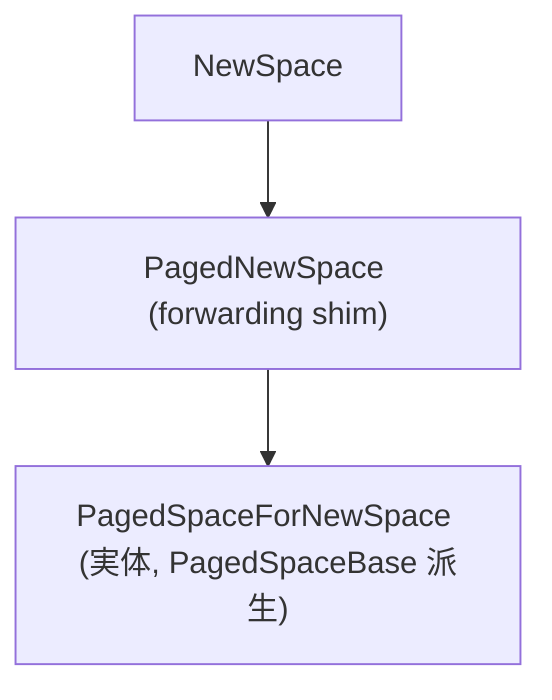

の3段になっており (`new-spaces.h:481-562`, `567-697`)、コメントに `TODO(v8:12612)`
として「いつかこの3つを1つに統合する」と書かれています。

#### 3.4 LAB と最終ページ

NewSpaceのbump確保の生コアは `Address allocation_top_`、limitが `to_space_.page_high()`
というだけのものです。とはいえ実際の確保パスは `MainAllocator` 経由で
`LinearAllocationArea` に投影され、`top()` / `limit()` 経由で扱われます (後述)。

---

### 4. Old Generation

#### 4.1 クラス階層と FreeList の生成

`PagedSpaceBase` (`src/heap/paged-spaces.h:111`) → `PagedSpace` (`:361`) → 各具体Space:
`OldSpace` (`:444`)、`StickySpace` (`:462`)、`CodeSpace` (`:505`)、`SharedSpace` (`:517`)、
`TrustedSpace` (`:532`)、`SharedTrustedSpace` (`:541`) と `CompactionSpace` (`:375`)。

すべて生成時に `FreeList::CreateFreeList()` を呼びます。実装は `src/heap/free-list.cc:138-143`:

```cpp
std::unique_ptr<FreeList> FreeList::CreateFreeList() {
  return std::make_unique<FreeListManyCachedOrigin>();
}
std::unique_ptr<FreeList> FreeList::CreateFreeListForNewSpace() {
  return std::make_unique<FreeListManyCachedFastPathForNewSpace>();
}
```

すなわちold generationのすべてのPagedSpaceは `FreeListManyCachedOrigin` を使い、
PagedNewSpaceは `FreeListManyCachedFastPathForNewSpace` を使います。

#### 4.2 FreeList のカテゴリ

`FreeListMany` (`src/heap/free-list.h:298-350`) には **24 個のカテゴリ**があります。
具体的な境界値は `categories_min[24]` (`free-list.h:328-330`):

```cpp
static constexpr unsigned int categories_min[kNumberOfCategories] = {
    24,  32,  48,  64,  80,  96,   112,  128,  144,  160,   176,   192,
    208, 224, 240, 256, 512, 1024, 2048, 4096, 8192, 16384, 32768, 65536};
```

オブジェクトサイズが `categories_min[i] <= size < categories_min[i+1]` ならi番目のカテゴリへ。
最小ブロックサイズは `kMinBlockSize = 3 * kTaggedSize` (`free-list.h:310`)、最大は
`kMaxBlockSize = kRegularPageSize` (`:314`)。256まで16B刻みで「精密」、それ以降は倍々で
「粗い」分類です。

カテゴリ選択ロジック (`free-list.h:333-346`) は次の通り:

```cpp
FreeListCategoryType SelectFreeListCategoryType(size_t size_in_bytes) override {
  if (size_in_bytes <= kPreciseCategoryMaxSize) {  // 256
    if (size_in_bytes < categories_min[1]) return 0;
    return static_cast<FreeListCategoryType>(size_in_bytes >> 4) - 1;
  }
  for (int cat = (kPreciseCategoryMaxSize >> 4) - 1; cat < last_category_; cat++) {
    if (size_in_bytes < categories_min[cat + 1]) {
      return cat;
    }
  }
  return last_category_;
}
```

すなわちsize <= 256Bなら `(size >> 4) - 1` で定数時間。それ以上は線形走査。

#### 4.3 FreeListManyCached/CachedFastPath

`FreeListManyCached` (`free-list.h:357-417`) は「各カテゴリcについて、c以上で非空な最小カテゴリ」を
`next_nonempty_category[c]` に持つキャッシュを追加し、空カテゴリのスキャンをO(1) にします。

`FreeListManyCachedFastPath` (`free-list.h:438-491`) は更に最初に試すカテゴリを「ターゲットサイズ +
1.85k」相当のカテゴリへずらし、過剰割当てによる高速確保パスを設けます。具体的には

```cpp
static const FreeListCategoryType kFastPathFirstCategory = 18;   // 2k 〜
static const size_t kFastPathStart = 2048;
static const size_t kTinyObjectMaxSize = 128;
static const size_t kFastPathOffset = kFastPathStart - kTinyObjectMaxSize; // 1920
static const FreeListCategoryType kFastPathFallBackTiny = 15;    // 256 〜
```

128バイト以下の極小オブジェクト用にはsecondary fast pathとして `kFastPathFallBackTiny`
カテゴリから検索します。

`FreeListManyCachedOrigin` (`free-list.h:514-520`) は呼び出し元がGCかRuntimeかで戦略を変えます。
GC中 (`AllocationOrigin::kGC`) は `FreeListManyCached`、それ以外は `FreeListManyCachedFastPath`。
GCの並行/平行コンテキストでは「断片化を減らす」、Runtimeのhot pathでは「速く取りたい」、
というトレードオフです。

#### 4.4 PagedSpace の主要 API

`PagedSpaceBase` の主要操作は `Free(start, size)` / `Allocate*` / `RefillFreeList` / `AddPage` /
`RemovePage` / `RawAllocateBackground` (`paged-spaces.h:151-291`)。背景スレッドからの確保は
`RawAllocateBackground` (`:178-180`) のみで、`local_heap`, `min_size_in_bytes`, `max_size_in_bytes`,
`AllocationOrigin` を取り、CAS風に確保します。

`OldSpace::AddPromotedPage` (`paged-spaces.h:452`) はyoung → oldの物理ページ移動 (page-promote)
で使われます。`StickySpace` (`:462-500`) はsticky-markbits構成専用のOldSpace派生で、
「ページ内に若い世代のオブジェクトとOld世代のオブジェクトを混在させる」という特異な仕組みを持ち、
`allocated_old_size_` を別管理します。

---

### 5. Read-Only Space

#### 5.1 設計目的

`src/heap/read-only-spaces.h:159-261` の `ReadOnlySpace`。「Immortal Immovable Immutable」、
すなわち**起動後に書き換えられない**オブジェクト用空間です。代表的な居住者は内蔵ビルトイン (Code)、
シングルトンのroots (`undefined_value`, `null_value`, `the_hole_value` 等)、定数Mapなど。

主な利点は2点:

1. **複数 Isolate 間で共有可能**になり、メモリ使用量が劇的に下がる。
   `SharedReadOnlySpace` (`read-only-spaces.h:263-275`) は `is_marked_read_only_ = true` で
   `ReadOnlySpace` を継承し、`ReadOnlyArtifacts::ReinstallReadOnlySpace`
   (`read-only-spaces.h:96`, `read-only-heap.cc`) で先頭IsolateのRO空間を他Isolateに注入。
2. ページに `MakeHeaderRelocatableAndMarkAsSealed()` (`read-only-spaces.h:41`) を適用して
   PROT_READにできる。GCですらここを触らないため、メモリ保護違反で書き込み攻撃を検出できる。

#### 5.2 ReadOnlyPage

`ReadOnlyPage` (`read-only-spaces.h:33-70`) は `BasePage` 派生で、`MutablePage` のslot setや
marking bitmapを持たず、`AllocationStats` のみ。`ShrinkToHighWaterMark()` (`:43`) で
未使用領域を切り詰めてOSにも返却します。`OffsetToAddress(offset)` (`:46-59`) は
PtrComprの "multiple cages" 環境ではページが複数の場所にマッピングされうるため `area_start()`
ベースのアサーションを切り、`ChunkAddress() + offset` 直接計算に倒します。

#### 5.3 Seal の手順

`ReadOnlySpace::Seal(SealMode)` (`read-only-spaces.h:191-193`) は3つのモードを取ります:

- `kDetachFromHeap`           : ヘッドから切り離す
- `kDetachFromHeapAndUnregisterMemory`: さらに `MemoryAllocator` のbookkeepingから外す
  (メモリリーク検出器対策)
- `kDoNotDetachFromHeap`      : そのまま

書き込み権限の制御は `SetPermissionsForPages(allocator, access)` (`:226-227`)。
通常は `kReadOnly` を渡してPROT_READにします。

---

### 6. Large Object Space

#### 6.1 概要

`kMaxRegularHeapObjectSize` (= 128KB通常) を超えるオブジェクトは、Large Object Spaceに
**1 オブジェクト = 1 ページ**として配置されます。ページ自体のサイズは `kRegularPageSize` の倍数で、
オブジェクトサイズ + ヘッダ + 必要なOSページアラインで切り上げます。

クラス階層 (`src/heap/large-spaces.h`):

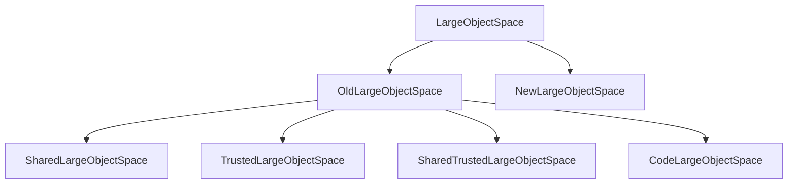

それぞれに対応する `AllocationSpace`:

- `LO_SPACE` (`OldLargeObjectSpace`)
- `CODE_LO_SPACE` (`CodeLargeObjectSpace`)
- `SHARED_LO_SPACE` (`SharedLargeObjectSpace`)
- `SHARED_TRUSTED_LO_SPACE` (`SharedTrustedLargeObjectSpace`)
- `TRUSTED_LO_SPACE` (`TrustedLargeObjectSpace`)
- `NEW_LO_SPACE` (`NewLargeObjectSpace`)

#### 6.2 確保ロジック

`OldLargeObjectSpace::AllocateRaw` (`src/heap/large-spaces.cc:108-150`) を見ると、

```cpp
if (!heap()->ShouldExpandOldGenerationOnSlowAllocation(local_heap, AllocationOrigin::kRuntime) ||
    !heap()->CanExpandOldGeneration(object_size)) {
  return AllocationResult::Failure();
}
heap()->StartIncrementalMarkingIfAllocationLimitIsReached(...);
LargePage* page = AllocateLargePage(object_size, executable, hint);
if (page == nullptr) return AllocationResult::Failure();
Tagged<HeapObject> object = page->GetObject();
if (local_heap->is_main_thread() && identity() != SHARED_LO_SPACE) {
  UpdatePendingObject(object);
}
if (v8_flags.sticky_mark_bits || heap()->incremental_marking()->black_allocation()) {
  heap()->marking_state()->TryMarkAndAccountLiveBytes(object, object_size);
}
page->Chunk()->InitializationMemoryFence();
heap()->NotifyOldGenerationExpansion(local_heap, identity(), page);
```

ポイント:

- 大オブジェクトは **インクリメンタルマーキング進行中は黒で確保** (`TryMarkAndAccountLiveBytes`)。
- `InitializationMemoryFence()` (`memory-chunk.h:232`) で並行マーカーに対する初期化完了を保証。
- `UpdatePendingObject(object)` で「まだ初期化中の `pending_object_`」を `MutablePage` に記録し、
  並行マーカーが半分初期化状態を読まないようにする。`pending_object_` はstd::atomic<Address>
  (`large-spaces.h:131-132`) でacquire/releaseで同期。

#### 6.3 LargePage の上限

`LargePage::kMaxCodePageSize = 512 * MB` (`large-page.h:18`) があり、
old-to-old typed slotのオフセットがoverflowしない範囲に抑えるためです。
コード以外のLargePageに明確な上限は無いですが、Heap全体の上限により実質的に制限されます。

#### 6.4 NewLargeObjectSpace

`NewLargeObjectSpace::AllocateRaw` (`large-spaces.cc:346`) はGC後に `Flip()`、
`OldLargeObjectSpace::PromoteNewLargeObject(page)` (`large-spaces.cc:182-195`) で生き残った
LargePageを物理的にコピーせず `RemovePage` + `AddPage` の所有権変更だけでoldに促進します。
このためLargeObjectはscavengerでもコピーされません。

---

### 7. Allocation メカニズム

#### 7.1 AllocationType / AllocationOrigin / AllocationAlignment

`enum class AllocationType` (`src/common/globals.h:1526-1536`) は9値:
`kYoung`, `kOld`, `kCode`, `kMap`, `kReadOnly`, `kSharedOld`, `kSharedMap`,
`kSharedTrusted`, `kTrusted`。

`enum class AllocationOrigin` (`src/heap/allocation-result.h:15-22`):

```cpp
kGeneratedCode = 0,
kRuntime       = 1,
kGC            = 2,
```

`enum AllocationAlignment` (`globals.h:1724-1732`):

```cpp
kTaggedAligned,    // タグサイズ境界 (既定)
kDoubleAligned,    // double サイズ境界
kDoubleUnaligned,  // (addr + kTaggedSize) が double サイズ境界
```

`AllocationResult` (`allocation-result.h:26-71`) は1ワードだけのオブジェクトで、
`Tagged<HeapObject>` のスマートラッパ。`is_null()` で失敗扱い。`sizeof(AllocationResult)==kSystemPointerSize`
が `static_assert` されています。

#### 7.2 HeapAllocator (LocalHeap ごとの allocator)

`HeapAllocator` (`src/heap/heap-allocator.h:36`) はメインスレッド / 各バックグラウンドスレッドに
1つずつ存在し、`MainAllocator` を5種類 (new, old, trusted, code, shared, shared_trusted) を
`std::optional` で抱えます (`heap-allocator.h:210-220`):

```cpp
std::optional<MainAllocator> new_space_allocator_;
std::optional<MainAllocator> old_space_allocator_;
std::optional<MainAllocator> trusted_space_allocator_;
std::optional<MainAllocator> code_space_allocator_;
std::optional<MainAllocator> shared_space_allocator_;
std::optional<MainAllocator> shared_trusted_space_allocator_;
```

ホットパスは `AllocateRaw<AllocationType>(...)` (`src/heap/heap-allocator-inl.h:74-190`)。
ここで大切な分岐:

```cpp
const size_t large_object_threshold = heap_->MaxRegularHeapObjectSize(type);
const bool large_object = static_cast<size_t>(size_in_bytes) > large_object_threshold;
if (V8_UNLIKELY(large_object)) {
  allocation = AllocateRawLargeInternal(size_in_bytes, type, origin, alignment, hint);
} else {
  // 8 種の AllocationType 別に各 *_space_allocator_->AllocateRaw(...) へ
}
```

つまり「sizeがlarge_object_thresholdを超えた瞬間にLO_SPACE系へ自動でルーティング」されます。
`MaxRegularHeapObjectSize(type)` (`src/heap/heap.h:1484`) はコード用にはOSページサイズ依存があるため
動的、それ以外には実質 `kMaxRegularHeapObjectSize` 相当となります。

失敗 (`AllocationResult::IsFailure()`) の場合は、呼び出し側が `AllocateRawWith<kLightRetry|kRetryOrFail>`
で再試行します (`heap-allocator-inl.h:229-256`)。`kRetryOrFail` を選ぶと最終的にGCをかけて
`AllocateRawSlowPath` (`heap-allocator.cc:199`) → `CollectGarbage` → 再試行のループに入ります。
リカバリ不能なら `CollectAllAvailableGarbage` (`heap-allocator.cc:178-197`)、最終的にOOM。

#### 7.3 LAB (LinearAllocationArea) と MainAllocator

LABの構造はシンプルで `start <= top <= limit` の3ワードです (`src/heap/linear-allocation-area.h:19-124`):

```cpp
Address start_ = kNullAddress;
Address top_   = kNullAddress;
Address limit_ = kNullAddress;
```

`MainAllocator` (`src/heap/main-allocator.h:153`) はこれをラップし、
allocator policy (`AllocatorPolicy` 派生: `SemiSpaceNewSpaceAllocatorPolicy`,
`PagedSpaceAllocatorPolicy`, `PagedNewSpaceAllocatorPolicy`) を切り替えて使います。

確保fast pathは `AllocateFastUnaligned` / `AllocateFastAligned` (`main-allocator.h:276-286`) で
**インライン** (`V8_INLINE`)。コードはおおよそ次のような形:

```cpp
if (V8_LIKELY(allocation_info_->CanIncrementTop(size_in_bytes))) {
  Address top = allocation_info_->IncrementTop(size_in_bytes);
  return AllocationResult::FromObject(HeapObject::FromAddress(top));
}
return AllocateRawSlow(size_in_bytes, alignment, origin);
```

ポイントは、`allocation_info_` のtopとlimitがインラインで参照できるよう、これらがIsolateの
`IsolateData::new_allocation_info()` / `old_allocation_info()` という固定スロットに置かれ
(`heap-allocator.cc:37-58`)、コード生成 (TurboFan / Maglev) からも `[isolate_data + offset]` で
最短アクセスできることです。

LAB拡張 (`ExtendLAB`, `main-allocator.h:259`) はPagedNewSpaceで使われ、断片化を抑える
重要な高速化です。

#### 7.4 GC トリガロジック

GCを呼ぶのは `HeapAllocator::CollectGarbage(allocation, perform_heap_limit_check, gc_reason)`
(`heap-allocator.cc:150-176`)。トリガ理由は `enum class GarbageCollectionReason`
(`src/common/globals.h:1594-1627`) の30値で、たとえば `kAllocationFailure = 1`、
`kAllocationLimit = 2`、`kBackgroundAllocationFailure = 25`、`kLastResort = 13` などがあります。

allocation typeごとにどのspaceでGCするかは `AllocationTypeToGCSpace` (`heap-allocator.cc:129-146`):

```cpp
constexpr AllocationSpace AllocationTypeToGCSpace(AllocationType type) {
  switch (type) {
    case AllocationType::kYoung: return NEW_SPACE;
    case AllocationType::kOld:
    case AllocationType::kCode:
    case AllocationType::kMap:
    case AllocationType::kTrusted:
    case AllocationType::kSharedMap:
    case AllocationType::kSharedOld:
      return OLD_SPACE;   // 実は OLD_SPACE は "full GC" の意味
    ...
  }
}
```

つまりYoung確保失敗 → Scavenger or MinorMS、Old系の確保失敗 → Mark-Compact。

---

### 8. Code Range / VirtualMemory Cage

#### 8.1 サイズ定数

`kMaximalCodeRangeSize` (`src/common/globals.h:507-522`) はターゲットアーキとビルドオプションに依存:

| アーキ + 設定                                  | kMaximalCodeRangeSize |
| --------------------------------------------- | --------------------- |
| PPC64 Linux                                   | 512 MB                |
| ARM64/LOONG64/RISCV64 + ptr-compr (内部 code) | 128 MB                |
| ARM64/LOONG64/RISCV64 + 外部 code             | 256 MB                |
| x64 + ptr-compr (内部 code)                   | 128 MB                |
| x64 + 外部 code                               | 512 MB                |
| 他 64bit                                      | 128 MB                |
| 32bit / RISCV32                               | 0 〜 256 MB           |

`kMinimumCodeRangeSize = 64 * MB` (`:523`)。`kReservedCodeRangePages` (`:524-528`) はWindowsで1、
それ以外で0 — Win64ではunwind情報用に最初のOSページをRWで予約するためです。

#### 8.2 CodeRange クラス

`class CodeRange final : public VirtualMemoryCage` (`src/heap/code-range.h:112-183`)。
インラインの図がそのまま重要なドキュメントです (`code-range.h:82-104`)。`base` から始まり、先頭にnon-allocatableなRW領域、その後ろにallocatable regionが続きます。

| 領域 | 開始位置 | 説明 |
| --- | --- | --- |
| non-allocatable (RW) | base | 先頭の書き込み可能領域 (kReservedCodeRangePages 分) |
| allocatable region | allocatable base | コードを割り当てる領域 |

`InitReservation(page_allocator, requested, immutable)` (`:146`) でアドレス空間を予約し、
`GetWritableReservedAreaSize()` (`:118`) で先頭のRW領域サイズを返します (= kReservedCodeRangePages
分)。`RemapEmbeddedBuiltins(isolate, embedded_blob_code, ...)` (`:161`) で組み込みビルトインを
このCodeRangeの中にもう一度マップし、短い相対呼び出しを可能にします (これが `short builtin calls`
最適化)。

#### 8.3 VirtualMemoryCage

`src/utils/allocation.h:356-419` の `class VirtualMemoryCage` はCodeRangeとTrustedRangeの共通基底:

```cpp
Address base_ = kNullAddress;
size_t size_ = 0;
std::unique_ptr<base::BoundedPageAllocator> page_allocator_;
VirtualMemory reservation_;
```

`ReservationParams` には `reservation_size`, `base_alignment`, `page_size`,
`requested_start_hint`, `permissions`, `page_initialization_mode`, `page_freeing_mode`
を取り、`InitReservation` (`:408`) で `BoundedPageAllocator` を生成します。

#### 8.4 PtrComprCage

`#ifdef V8_COMPRESS_POINTERS` の下で

```cpp
constexpr size_t kPtrComprCageReservationSize = size_t{1} << 32;  // = 4 GB
constexpr size_t kPtrComprCageBaseAlignment   = size_t{1} << 32;  // = 4 GB
```

(`include/v8-internal.h:166-168`)。すなわちPtrCompr有効時、V8は **4 GB アラインで 4 GB 連続**の
仮想アドレス空間を予約し、その先頭32bitをオフセットとして「圧縮ポインタ」を表現します。
このためHeap全体 (RO_SPACE含む) はこの4 GB cageに収まらなければならず、
`max_old_generation_size` の上限が `kAllocatorLimitOnMaxOldGenerationSize = kPtrComprCageReservationSize`
(`src/heap/heap.h:322-323`) に設定されています。

---

### 9. Sandbox (V8 Sandbox)

#### 9.1 構造

`class Sandbox` (`src/sandbox/sandbox.h:48-347`) のヘッダコメントが概念図を持っています
(`sandbox.h:50-60`):

| 領域 | サイズ | 説明 |
| --- | --- | --- |
| Guard Region (front) | 32 GB | 前方ガード領域 |
| V8 Heap Region | 4 GB | V8 ヒープ |
| ArrayBuffer backing stores, WASM memory buffers, and any other sandboxed objects | (Ideally) 1 TB | サンドボックス対象オブジェクト本体 |
| Guard Region (back) | 32 GB | 後方ガード領域 |

サイズ定数 (`include/v8-internal.h:220-302`):

```cpp
#if defined(V8_TARGET_OS_ANDROID)
  constexpr size_t kSandboxSizeLog2 = 37;  // 128 GB
#elif defined(V8_TARGET_OS_IOS)
  constexpr size_t kSandboxSizeLog2 = 34;  // 16 GB
#elif defined(V8_HOST_ARCH_RISCV64) || defined(V8_TARGET_ARCH_LOONG64)
  constexpr size_t kSandboxSizeLog2 = 37;  // 128 GB
#else
  constexpr size_t kSandboxSizeLog2 = 40;  // 1 TB
#endif
constexpr size_t kSandboxSize = 1ULL << kSandboxSizeLog2;
constexpr size_t kSandboxAlignment = kPtrComprCageBaseAlignment;  // 4 GB
constexpr uint64_t kSandboxedPointerShift = 64 - kSandboxSizeLog2;
constexpr size_t kSandboxMinimumReservationSize = 8ULL * GB;
constexpr size_t kMaxSafeBufferSizeForSandbox = 32ULL * GB - 1;
constexpr size_t kBoundedSizeShift = 29;
constexpr size_t kSandboxGuardRegionSize =
    32ULL * GB + (kMaxSafeBufferSizeForSandbox + 1);
```

Sandboxサイズは通常1 TB、前後に32 GBのguard region (PROT_NONE) を置き、
その間にPtrCompr cage (4GB) が冒頭に座り、残り (約1 TB) はArrayBufferやWebAssembly memoryに
使えるという設計です。さらに `kSmiAddressRange = 4 * GB` (`sandbox.h:77`) を先頭に予約 (`PROT_NONE`)
することでSmi(値)とHeapObject(ポインタ) の取り違えバグをmitigateします。

#### 9.2 サンドボックスのポリシー

`bool Contains(Address addr)` (`sandbox.h:191-194`) は単純な範囲チェック:

```cpp
bool Contains(Address addr) const {
  return base::IsInHalfOpenRange(addr, base_, base_ + size_);
}
```

`OutsideSandbox(addr)` (`sandbox.h:355-364`) はtrustedオブジェクトのアサーションに使います。

#### 9.3 Sandboxed Pointer / External Pointer Table / Trusted Pointer Table

オフセット型のサンドボックスポインタは `SandboxedPointer_t = Address` (`v8-internal.h:216`)。
インデックス型の外部ポインタは `ExternalPointerTable` (`src/sandbox/external-pointer-table.h:39-`)
が管理する `ExternalPointerTableEntry` を介します。エントリは1ワードに「外部ポインタ実値 +
type tag + marking bit」を埋め込み、フリーリストエントリ・避難エントリも同じ1ワードに
別エンコーディングで共存します。

ExternalEntityTable (`src/sandbox/external-entity-table.h:53-`) は `SegmentedTable<Entry, size>` を
基底にしたページング型データ構造で、`kSegmentSize`, `kEntriesPerSegment`, `kEntrySize`
(`:61-63`) という定数を持ちます。Space (`:80-`) は同じfreelistを共有するセグメントの集合で、
young/old分離や複数Isolateでの独立GCなど、Heapの2次元的な構造をテーブル側にも持ち込んだ形です。

`Heap` 側からはこれらのテーブルへ「自分のSpace」を介してアクセスします
(`src/heap/heap.h:2177-2197`):

```cpp
#ifdef V8_COMPRESS_POINTERS
ExternalPointerTable::Space young_external_pointer_space_;
ExternalPointerTable::Space old_external_pointer_space_;
ExternalPointerTable::Space read_only_external_pointer_space_;
CppHeapPointerTable::Space cpp_heap_pointer_space_;
#endif
#ifdef V8_ENABLE_SANDBOX
TrustedPointerTable::Space trusted_pointer_space_;
CodePointerTable::Space code_pointer_space_;
#endif
JSDispatchTable::Space js_dispatch_table_space_;
JSDispatchTable::Space read_only_js_dispatch_table_space_;
```

#### 9.4 TrustedSpace / TrustedRange

`TrustedRange` (`src/heap/trusted-range.h:22-26`) はVirtualMemoryCage派生で、
Sandbox有効時に「sandboxの外側」へ独立に予約される512 MB 〜 1 GBのcageです。
ここに `TRUSTED_SPACE` / `TRUSTED_LO_SPACE` / `SHARED_TRUSTED_*` のページが置かれ、
攻撃者がsandbox内のメモリcorruptionで書き換えられない領域となります。
これにより、JITコードのエントリポイントやインタプリタのバイトコード配列など
「破壊されると即任意コード実行に直結する」データを安全に保ちます。

メタデータポインタテーブル `MemoryChunkConstants::kMetadataPointerTableSize`
(`memory-chunk-constants.h:33-36`) は **main cage + trusted cage + code cage** 内のページ数の合計を
覆うサイズに切り上げられます。Sandbox内の `MemoryChunk` ヘッダから信頼できる `BasePage` を取得する
唯一のルートになります。

---

### 10. 補足 — 主要な数値のまとめ

| 項目                                         | 値 / 計算式                                          | ファイル / 行 |
| -------------------------------------------- | ---------------------------------------------------- | ------------- |
| `kPageSizeBits` (x64/arm64)                  | 18                                                   | `src/base/build_config.h:80` |
| `kRegularPageSize`                           | `1 << kPageSizeBits` = **256 KB**                    | `src/base/build_config.h:83` |
| `kMaxRegularHeapObjectSize`                  | `1 << (kPageSizeBits - 1)` = **128 KB**              | `src/common/globals.h:720` |
| `kMinimumOSPageSize`                         | 4 KB / 16 KB / 64 KB (環境依存)                      | `src/base/build_config.h:88-105` |
| `kSpaceTagSize`                              | 4 bits                                               | `src/common/globals.h:1468` |
| `kDefaultMinHeapSize`                        | 256 MB                                               | `src/heap/heap.h:313` |
| `kDefaultMaxHeapSize`                        | 4 GB (64bit) / 1 GB (32bit)                          | `src/heap/heap.h:315-317` |
| Scavenger 既定 max semi-space                | 32 MB                                                | `src/heap/heap.cc:4840` |
| MinorMS 既定 max semi-space                  | 72 MB                                                | `src/heap/heap.cc:4835` |
| `DefaultMinSemiSpaceSize`                    | 512 KB                                               | `src/heap/heap.cc:4828-4830` |
| FreeList カテゴリ数                          | 24                                                   | `src/heap/free-list.h:327` |
| FreeList 最小ブロック                        | `3 * kTaggedSize` (= 12B ptr-compr / 24B no-compr)   | `src/heap/free-list.h:310` |
| `kBitsPerBucket` (SlotSet)                   | 1024                                                 | `src/heap/base/basic-slot-set.h:283` |
| MarkingBitmap セル / ページ                  | 1024 cells (8 KB)                                    | `src/heap/marking.h:108-114` |
| `kPtrComprCageReservationSize`               | 4 GB                                                 | `include/v8-internal.h:167` |
| `kSandboxSize`                               | 16 GB / 128 GB / 1 TB                                | `include/v8-internal.h:225-246` |
| `kMaximalCodeRangeSize` (x64 内部 code)      | 128 MB                                               | `src/common/globals.h:515-517` |
| `kMaximalCodeRangeSize` (x64 外部 code)      | 512 MB                                               | `src/common/globals.h:515-517` |
| `kMaximalTrustedRangeSize`                   | 1 GB                                                 | `src/common/globals.h:531` |
| `LargePage::kMaxCodePageSize`                | 512 MB                                               | `src/heap/large-page.h:18` |

---

### 11. 主要参照ファイル一覧 (絶対パス)

レポートで言及した主なファイル群:

- `/home/user/v8/src/heap/heap.h`, `/home/user/v8/src/heap/heap.cc`
- `/home/user/v8/src/heap/heap-layout.h`
- `/home/user/v8/src/heap/heap-allocator.h`, `/home/user/v8/src/heap/heap-allocator-inl.h`, `/home/user/v8/src/heap/heap-allocator.cc`
- `/home/user/v8/src/heap/main-allocator.h`
- `/home/user/v8/src/heap/linear-allocation-area.h`
- `/home/user/v8/src/heap/memory-allocator.h`
- `/home/user/v8/src/heap/memory-chunk.h`, `/home/user/v8/src/heap/memory-chunk-layout.h`, `/home/user/v8/src/heap/memory-chunk-constants.h`
- `/home/user/v8/src/heap/base-page.h`
- `/home/user/v8/src/heap/mutable-page.h`
- `/home/user/v8/src/heap/normal-page.h`
- `/home/user/v8/src/heap/large-page.h`, `/home/user/v8/src/heap/large-spaces.h`, `/home/user/v8/src/heap/large-spaces.cc`
- `/home/user/v8/src/heap/new-spaces.h`
- `/home/user/v8/src/heap/paged-spaces.h`
- `/home/user/v8/src/heap/read-only-spaces.h`
- `/home/user/v8/src/heap/spaces.h`
- `/home/user/v8/src/heap/free-list.h`, `/home/user/v8/src/heap/free-list.cc`
- `/home/user/v8/src/heap/marking.h`
- `/home/user/v8/src/heap/slot-set.h`, `/home/user/v8/src/heap/base/basic-slot-set.h`
- `/home/user/v8/src/heap/code-range.h`
- `/home/user/v8/src/heap/trusted-range.h`
- `/home/user/v8/src/heap/allocation-result.h`
- `/home/user/v8/src/execution/isolate.h`
- `/home/user/v8/src/common/globals.h`
- `/home/user/v8/src/base/build_config.h`
- `/home/user/v8/src/utils/allocation.h`
- `/home/user/v8/src/sandbox/sandbox.h`
- `/home/user/v8/src/sandbox/external-entity-table.h`, `/home/user/v8/src/sandbox/external-pointer-table.h`
- `/home/user/v8/include/v8-internal.h`
- `/home/user/v8/src/flags/flag-definitions.h`

---

### 12. まとめと観察

V8のHeap設計は、長年にわたって **「セキュリティ強化」** と **「マルチ Isolate 対応」**
の2軸で大きな変革を経ています。本稿でなぞった概念的ハイライトを最後にまとめます。

第一に、Heapは `enum AllocationSpace` で表される13種のSpaceを `std::unique_ptr<Space>` の配列で
持ち、各SpaceはMemoryAllocatorが用意したページから物を切り出します。NEW_SPACEは伝統的な
semi-space構成と新しいPagedNewSpaceの2流派が共存し、`v8_flags.minor_ms` で切り替え可能です。

第二に、各Spaceで確保されるオブジェクトは `kMaxRegularHeapObjectSize`
(= ページサイズの半分 = 通常128KB) を境に「通常ページ」と「LargeObjectページ」に振り分けられます。
ページサイズ自体は `kRegularPageSize = 1 << kPageSizeBits` で、通常は256 KBですがPPCやhugepage
構成では別の値です。`MemoryChunk` のアドレスはこの大きさにアラインされ、`addr & ~kAlignmentMask`
だけでチャンクを定数時間で求められます。

第三に、確保のフロントエンドは `HeapAllocator` (LocalHeapごと) で、ホットパスは `MainAllocator`
の `LinearAllocationArea` (top/limit/startの3ワード) を進めるだけです。
LABが枯渇したときに各 `AllocatorPolicy` がfree-list refillか新ページ確保かを判断し、
失敗すればGC呼び出し → 再試行 → 最終的にOOM、という階段を降ります。

第四に、FreeListは24のサイズカテゴリを持ち、`FreeListManyCachedOrigin` がGCかRuntimeかで
戦略 (best-fit vs first-fit-with-overallocation) を切り替えます。これがオブジェクトサイズ毎の
**自動的なヒューリスティック**として効きます。

第五に、Sandbox構成 (`V8_ENABLE_SANDBOX`) ではアドレス空間全体が
「**1 TB の Sandbox + 前後 32 GB の guard + 4 GB の PtrCompr cage + 外側の TrustedRange/CodeRange**」
という多層構造になります。`MemoryChunk` から信頼できる `BasePage` を得るには
**MetadataPointerTable** という別テーブル経由のインダイレクションが入り、Sandbox内のフラグcorruption
を許容する設計です。External pointers / Trusted pointers / Code pointersといった「sandbox外の世界」
への参照は、Isolateごとのテーブル経由でインデックス化され、攻撃者が偽のポインタ値を構築するのを
防ぎます。

結果として、現代のV8ヒープは **「アドレス空間そのものを信頼境界として使う」**
モダンなmemory safety強化の典型例となっており、本稿で触れた `MemoryChunk` のフラグやレイアウト、
`AllocationSpace` の細分化、SlotSet/MarkingBitmapの置き場所などのすべてが、その総合的な戦略の
パーツとして配置されています。

---

## 第 III 部 ガベージコレクション

## V8 ガベージコレクション 超詳細技術解説

V8リポジトリ `/home/user/v8` を直接読み取って書き起こした濃密な解説書です。すべての主張に対して該当ソース行を併記しました。クラス名・関数名・列挙値は実コードからそのまま引いています。

---

### 1. アーキテクチャ全景

V8は世代別 (generational) ヒープを採用しており、`enum class GarbageCollector` には三種類のGCが並びます。`src/common/globals.h:1763` の定義は次の通りです。

```cpp
enum class GarbageCollector { SCAVENGER, MARK_COMPACTOR, MINOR_MARK_SWEEPER };
```

- `SCAVENGER` — 若い世代をCheneyのセミスペースコピーで回収するMinor GC。`src/heap/scavenger.cc` の `ScavengerCollector::CollectGarbage` がエントリです。
- `MARK_COMPACTOR` — 古い世代も含む全ヒープをMark-CompactするMajor GC。`src/heap/mark-compact.cc:532` の `MarkCompactCollector::CollectGarbage` がエントリです。
- `MINOR_MARK_SWEEPER` — `--minor-ms` フラグやsticky mark-bits構成で使われる、若い世代のmark-sweep。`src/heap/minor-mark-sweep.cc:419` の `MinorMarkSweepCollector::CollectGarbage` がエントリです。

実際に走らせる関数は `Heap::CollectGarbage`(`src/heap/heap.cc:1437`)で、ここから ① プロローグコールバック ② スタックマーカ設定 ③ `PerformGarbageCollection`(`src/heap/heap.cc:2209`)④ エピローグコールバックの順に流れます。`PerformGarbageCollection` の核は `src/heap/heap.cc:2280-2287` で、選ばれた `GarbageCollector` に応じて `MarkCompact()` / `MinorMarkSweep()` / `Scavenge()` の3つに分岐します。

```cpp
if (collector == GarbageCollector::MARK_COMPACTOR) {
  MarkCompact();
} else if (collector == GarbageCollector::MINOR_MARK_SWEEPER) {
  MinorMarkSweep();
} else {
  DCHECK_EQ(GarbageCollector::SCAVENGER, collector);
  Scavenge();
}
```

`Heap::Scavenge`(`src/heap/heap.cc:2599`)はコメントで明示的に "Implements Cheney's copying algorithm" と書かれており、`scavenger_collector_->CollectGarbage()` を呼ぶだけの薄いラッパです。`Heap::MarkCompact`(`heap.cc:2534`)は `mark_compact_collector()->Prepare()` で準備を行い、続いて `MarkCompactPrologue` で `regexp::ResultsCache` や `smi_string_cache` などのキャッシュを掃除し、本体の `mark_compact_collector()->CollectGarbage()` を呼びます。

#### 1.1 コレクタ選択ヒューリスティクス (`SelectGarbageCollector`)

`Heap::SelectGarbageCollector`(`src/heap/heap.cc:549`)が実際にどのGCを走らせるかを決めます。判定順は次の通りです。

1. `gc_reason` が `kFinalizeMinorMSForMajorGC` または `kFinalizeConcurrentMinorMS` → `MINOR_MARK_SWEEPER` を返す (`heap.cc:552-565`)。
2. リクエストされた `AllocationSpace` が `NEW_SPACE` / `NEW_LO_SPACE` 以外 → `MARK_COMPACTOR` (`heap.cc:568-572`)。
3. `v8_flags.gc_global` または `!use_new_space()` → `MARK_COMPACTOR` (`heap.cc:575-578`)。
4. インクリメンタルmajor markingが進行中 → finalizeするため `MARK_COMPACTOR` を強制 (`heap.cc:580-583`)。
5. 若い世代を昇格させる空きがold generationに取れないと予測 → `MARK_COMPACTOR` を選択 (`heap.cc:585-591`)。これは `gc_compactor_caused_by_oldspace_exhaustion` カウンタを増やす分岐です。
6. それ以外は `YoungGenerationCollector()` を返す (`heap.cc:597`)。これはScavengerまたはMinor MSのいずれかです。

#### 1.2 GCFlag と GarbageCollectionReason

`enum class GCFlag` (`src/heap/heap.h:198-205`) は以下のビットフラグです。

```cpp
enum class GCFlag : uint8_t {
  kNoFlags = 0,
  kReduceMemoryFootprint = 1 << 0,
  kForced = 1 << 1,
  kLastResort = 1 << 2,
};
using GCFlags = base::Flags<GCFlag, uint8_t>;
```

`kReduceMemoryFootprint` が立っているか否かは `Heap::ShouldReduceMemory()` (`src/heap/heap.h:1687`)で判定され、Mark-Compactにおけるevacuation candidateの選び方や `Sweeper` がメモリをOSに返すかどうかなど、後段に大きな影響を与えます。

`GarbageCollectionReason` の正体は `src/common/globals.h:1594-1628` に列挙された30種類弱のラベルで、`kAllocationFailure` (=1) や `kAllocationLimit`、`kMemoryReducer`、`kLowMemoryNotification`、`kSnapshotCreator`、`kBackgroundAllocationFailure`、`kCppHeapAllocationFailure` などが並びます。`Heap::CollectGarbage` の引数として渡されるたびにdevtoolsのトレースやChromeのヒストグラム (`gc_compactor_caused_by_request`) に記録されます。

#### 1.3 世代別仮説 (Generational Hypothesis) と二段構えのコスト

V8のヒープ階層は若い世代 (`NewSpace` / `NewLargeObjectSpace`) と古い世代 (`OldSpace`、`CodeSpace`、`SharedSpace`、`TrustedSpace`、`LargeObjectSpace` 等) に分かれます。Scavengerが処理する若い世代の容量は `SemiSpaceNewSpace::TotalCapacity()` でせいぜい数MB 〜 数十MBに押さえられ、ここに対しては高速なコピーコレクションを走らせます。`src/heap/scavenger.cc:1577` の `NumberOfScavengeTasks` を見ると `kMaxScavengerTasks = 8` でタスク数の上限を8に切ってあり、若い世代のサイズ(MB単位)+1とCPUコア数とこの8のうち最小を使う構成になっています。「世代別仮説 (若いオブジェクトはすぐ死ぬ)」が成り立つなら、コピーするコストはほぼ生存オブジェクトに比例するため、若い世代を頻繁に小さく回収するのは合理的です。

---

### 2. Scavenger (Minor GC, Cheney 流コピー収集)

`ScavengerCollector` クラス (`src/heap/scavenger.h:15`) は本体で、内部にScavengerというワーカクラス (`src/heap/scavenger.cc:286`) を持ちます。

#### 2.1 全体フロー: `ScavengerCollector::CollectGarbage`

`src/heap/scavenger.cc:1626` から始まる関数の骨子は次の通りです。

1. **From/To-space スワップ** — `new_space->SwapSemiSpaces()` (`scavenger.cc:1634`)。`new_lo_space()->Flip()` でlarge young spaceも裏返します (`scavenger.cc:1638`)。
2. **OLD_TO_NEW chunk の事前収集** — `OldGenerationMemoryChunkIterator::ForAll` で `slot_set<OLD_TO_NEW>()` / `typed_slot_set<OLD_TO_NEW>()` / `slot_set<OLD_TO_NEW_BACKGROUND>()` のいずれかが立っている古い世代のページを `old_to_new_chunks` に集めます (`scavenger.cc:1691-1706`)。これは後で並列にスキャンするためのwork itemです。
3. **保守的スタックスキャン / 精密ピン留め** — `is_using_conservative_stack_scanning` なら `PinObjectsConservative` (`scavenger.cc:1715`)、`is_using_precise_pinning` なら `PinObjectsPrecise` を呼びます。「ピン留め」とはスタック由来のオブジェクトを移動させないために自分自身へのforwardingを書き、ページをquarantinedフラグ付きで残す機構です (`scavenger.cc:2651` の `set_map_word_forwarded(object, kRelaxedStore)`)。
4. **並列ジョブの起動** — `ScavengerJobTask` (`scavenger.cc:706`) を `V8::GetCurrentPlatform()->PostJob` に渡し、`v8::TaskPriority::kUserBlocking` でバックグラウンドスレッドを動員します (`scavenger.cc:1731-1737`)。
5. **メインスレッドでのルート走査** — `RootScavengeVisitor` を作り、`heap_->IterateRoots` でルートを訪問。`SkipRoot::{kExternalStringTable, kGlobalHandles, kTracedHandles, kOldGeneration, kConservativeStack, kReadOnlyBuiltins}` をスキップする集合に登録 (`scavenger.cc:1748-1751`)。これらは後で個別に処理します。
6. **`job_handle->Join()`** — メインスレッドも残りタスクを引き受けて完了を待つ。Pop / Pushを `kInterruptThreshold = 128` 回ごとに `NotifyConcurrencyIncrease` する設計です(`scavenger.cc:339, 2548-2550`)。
7. **弱グローバルハンドル処理** — `IsUnscavengedHeapObjectSlot` をコールバックに渡して死んだ参照をクリアします (`scavenger.cc:1786-1790`)。
8. **Finalize と sweep の手配** — 大きなyoungオブジェクトの後処理 (`HandleSurvivingNewLargeObjects`)、ephemeron処理 (`ScavengerEphemeronProcessor::Process`)、外部ポインタテーブルのスイープを行います。

#### 2.2 Cheney 流コピー: `Scavenger::EvacuateObjectDefault`

中核の判断は `EvacuateObjectDefault` (`src/heap/scavenger.cc:2109`) にあります。

```cpp
if (HandleLargeObject(map, object, object_size, object_fields)) [[unlikely]] {
  return REMOVE_SLOT;
}
if (!ShouldBePromoted(object.address())) {
  if (SemiSpaceCopyObject(map, slot, object, object_size, object_fields)) {
    return RememberedSetEntryNeeded(heap_, slot);
  }
}
if (PromoteObject<...>(map, slot, object, object_size, object_fields)) {
  return RememberedSetEntryNeeded(heap_, slot);
}
if (SemiSpaceCopyObject(map, slot, object, object_size, object_fields)) {
  return RememberedSetEntryNeeded(heap_, slot);
}
heap()->FatalProcessOutOfMemory("Scavenger: semi-space copy");
```

つまり「① 大きすぎる場合はLargeObjectSpaceへ直接昇格、② 年齢が浅ければto-spaceにコピー、③ 古ければOldSpaceに昇格、④ OldSpace確保に失敗したらフォールバックでコピー、それでも駄目ならOOM」という分岐です。`SlotCallbackResult` の `KEEP_SLOT` / `REMOVE_SLOT` は呼び出し側でOLD_TO_NEWスロットを保持し続けるかどうかの判定に使われます。

#### 2.3 昇格判定 `ShouldBePromoted`

`Scavenger::ShouldBePromoted` (`scavenger.cc:2080`) は `SemiSpaceNewSpace::ShouldBePromoted` を呼ぶだけで、その実装は `src/heap/new-spaces-inl.h:94` です。

```cpp
bool SemiSpaceNewSpace::ShouldBePromoted(Address object) const {
  return IsAddressBelowAgeMark(object);
}
```

`age_mark_` (`new-spaces.h:469`) は前回Scavenge時のto-space topアドレスで、`SetAgeMarkAndBelowAgeMarkPageFlags` (`new-spaces.h:331`) で更新されます。あるオブジェクトが「age markより下のアドレス」つまり「前回のScavenge時点で既に存在していたページ上の領域」に居れば、それは既に1回Scavengeを生き延びたオブジェクトなので、今回さらにコピーするよりOldSpaceへ昇格させたほうがよい、という発想です。これがV8における「2回生き延びたら昇格」ヒューリスティクスの源です。

#### 2.4 アトミックなコピー: `TryMigrateObject`

`Scavenger::TryMigrateObject` (`scavenger.cc:1952`) は他スレッドとの競合をCASで解決する繊細な実装になっています。手順は次の通りです。

1. `allocator_.Allocate(space, object_size, ...)` で行き先(to-spaceまたはOldSpace)を確保。
2. `source->relaxed_compare_and_swap_map_word_forwarded(MapWord::FromMap(map), target)` で「map wordをforwarding pointerにCAS」する。失敗 = 既に他スレッドがコピー済みなので、今確保した領域を `allocator_.FreeLast` で巻き戻して、相手が書いたforwardingを読んでスロットを更新するだけで終わる (`scavenger.cc:1973-1982`)。
3. CAS成功の場合のみ実体をコピー。`target->set_map_word(map, kRelaxedStore)` を先に行い、その後 `heap()->CopyBlock(target.address() + kTaggedSize, source.address() + kTaggedSize, object_size.value() - kTaggedSize)` でフィールドをコピー (`scavenger.cc:1988-1991`)。「CASの後で実体コピー」のは、競合に負けた場合に無駄なコピーが走らないようにするためです。
4. `UpdateHeapObjectReferenceSlot(slot, target)` でスロットを更新し、`on_success(target)` で `local_copied_list_` / `local_promoted_list_` のいずれかに追加。

`local_copied_list_` / `local_promoted_list_` は `Scavenger::ScavengedObjectList` 型 (`scavenger.cc:296-298`) で、`heap::base::Worklist<ScavengedObjectListEntry, 256>` というセグメントサイズ256のロックフリー Worklistです。

#### 2.5 `Scavenger::Process` — Cheney のスキャン段

`Scavenger::Process` (`scavenger.cc:2535`) は `ScavengerCopiedObjectVisitor` と `ScavengerPromotedObjectVisitor` を使って "コピー済オブジェクト" を訪問し、その中のスロットを再帰的にコピーします。do-whileループの中で `local_copied_list_.Pop` と `local_promoted_list_.Pop` を交互に処理し、`kInterruptThreshold = 128` ごとに `delegate->NotifyConcurrencyIncrease()` を呼んで他のワーカにwork-stealingを促す構造です。

Cheneyの伝統的な2ポインタ (scan ptr / free ptr) スキームはここではworklistに置き換わっており、to-spaceを線形に走査する代わりにコピーされた個別オブジェクトをworklist経由でスキャンします。この変更によって複数スレッドが並列にコピー & スキャンできます。

#### 2.6 並列スキャン: `ScavengerJobTask::ProcessItems`

`ScavengerJobTask::ProcessItems` (`scavenger.cc:792`) は ① `ConcurrentScavengePages` で `old_to_new_chunks_` を分割スキャンし(`scavenger.cc:809-827`)、② `scavenger->Process(delegate)` でworklistを捌きます。`ConcurrentScavengePages` は `ParallelWorkItem::TryAcquire` でwork-stealingするため、並列処理の粒度はページ単位です。

`ScavengerJobTask::GetMaxConcurrency` (`scavenger.cc:779`) は `remaining_memory_chunks_` と「現在のワーカ数 + copied_list_.Size() + promoted_list_.Size()」のうち大きい方を希望同時実行数とし、`scavengers_->size()` を上限としてクリップします。バッテリ最適化やbackground不可なら `1` に絞ります。

#### 2.7 Remembered Set との連携

ScavengerはOldSpaceからNewSpaceへの参照を「全部スキャン」できません。そこでOld-to-Newのスロット情報が予めwrite barrier経由で `RememberedSet<OLD_TO_NEW>` に記録されています。Scavengerはscavenge開始時にこれを舐めて若い世代を保守的に追跡します。Quarantinedページやshared-spaceへの参照などは典型的なケースとして `CheckOldToNewSlotForSharedUntyped` (`scavenger.cc:2607`) や `CheckOldToNewSlotForSharedTyped` (`scavenger.cc:2621`) で `RememberedSet<OLD_TO_SHARED>::Insert<AccessMode::ATOMIC>` に分岐させて拾います。

---

### 3. Major GC (Mark-Compact)

`MarkCompactCollector::CollectGarbage` (`src/heap/mark-compact.cc:532`) の本体は驚くほどシンプルで、次のステージを順に呼びます。

```cpp
MarkLiveObjects();
if (auto* cpp_heap = ...) cpp_heap->ProcessCrossThreadWeakness();
RecordObjectStats();
ClearNonLiveReferences();
VerifyMarking();
if (auto* cpp_heap = ...) cpp_heap->FinishMarkingAndProcessWeakness();
heap_->memory_measurement()->FinishProcessing(native_context_stats_);
Sweep();
Evacuate();
Finish();
```

#### 3.1 Tri-color Marking (white / grey / black)

V8のマーキングは三色マーキングで、状態は実装上「ビットマップ上の1bit + worklistにあるかどうか」で表現されます。

- **white** — `MarkBit` が0でworklistにも乗っていない → 未到達。
- **grey** — `MarkBit` が1だがworklistに積まれているだけでbodyはまだスキャンされていない。
- **black** — `MarkBit` が1でかつworklistからも取り出されてオブジェクトの中身まで訪問済み。

`MarkBit` のSet/Getは `src/heap/marking.h:64-83` にあります。アトミック版は `base::AsAtomicWord::Relaxed_SetBits(cell_, mask_)`、非アトミック版は単純なorです。`MarkingBitmap` (`marking.h:93`) はページごとに付属するビットマップで、`kLength = (1 << kPageSizeBits) >> kTaggedSizeLog2` ビット、つまり「ページサイズ ÷ kTaggedSize」個のマークビットを持ちます。各cellは `uintptr_t` の64bitです (`marking.h:99-105`)。

「markできたか」のテストは `MarkingState::TryMark` (`src/heap/marking-state-inl.h:35`) で、原子的に「ビットを0→1に遷移できた最初のスレッド」だけが `true` を返します。`MarkingHelper::TryMarkAndPush` (`src/heap/marking-inl.h:347`) はこれを「成功したらworklistにもpushする」というポリシーで束ねた、ほぼ全てのマーキング経路の共通関数です。

```cpp
bool MarkingHelper::TryMarkAndPush(Heap* heap,
                                   MarkingWorklists::Local* marking_worklist,
                                   MarkingState* marking_state,
                                   WorklistTarget target_worklist,
                                   Tagged<HeapObject> object) {
  if (marking_state->TryMark(object)) {
    if (V8_LIKELY(target_worklist == WorklistTarget::kRegular)) {
      marking_worklist->Push(object);
    }
    return true;
  }
  return false;
}
```

#### 3.2 Marking worklist

`MarkingWorklists` (`src/heap/marking-worklist.h:68`) は次の3つの `Worklist<Tagged<HeapObject>, 64>` を持ちます。

- `default_` — 主に使う共有worklist。
- `on_hold_` (`marking-worklist.h:84, 124`) — concurrent markerが「new spaceのlinear allocation bufferの中にあるオブジェクト」を一旦置いておくための保留worklist。
- `other_` — context-per-markingモードで「対象context外」用。

per-contextモードでは `context_worklists_` (`marking-worklist.h:130`) にnative contextごとのworklistを作り、`SwitchToContext` でアクティブなworklistを切り替えながら、メモリ計測API用にオブジェクトサイズをcontextに紐づけて記録します(`marking-worklist.h:30-57` のコメントに詳細あり)。

スレッドローカル版が `MarkingWorklists::Local` (`marking-worklist.h:143`) で、`Push` / `Pop` / `PopOnHold` / `MergeOnHold` / `ShareWork` / `Publish` / `PublishWork` を持ちます。`MergeOnHold` はincremental stepの境界で `on_hold_` を `default_` に統合し、`ShareWork` は他スレッドがwork-stealingできるようにグローバルpoolへ放出します。

#### 3.3 SATB か Dijkstra か

V8はインクリメンタル/コンカレント時に **Dijkstra スタイル(挿入バリア)** を採用しています。詳細は `src/heap/WRITE_BARRIER.md` に書かれており、引用すると次の3つの目的のためにwrite barrierが必要だとあります。

> - Records old-to-new references for the generational GC to work.
> - During marking it prevents black-to-white references during incremental/concurrent marking.
> - During marking it records old-to-old references (pointers to objects on evacuation candidates)

「black-to-whiteを防ぐ」というのはDijkstraの不変条件で、`host`(=black)が `value`(=white)を新しく指すような書き込みを検出したら `value` をgreyにする(=マークしてworklistに積む)、という発想です。これはマーキング中に随時SATBの "snapshot" を作るのとは違って、現在のヒープスナップショットに基づいて常にgrey/blackの整合性を保ちます。

ただしnew spaceのLAB(linear allocation buffer)内のオブジェクトに対する処理はSATB的な要素も含まれます。concurrent markerはLAB内のオブジェクトを訪問しようとすると `PushOnHold` でホールドworklistに積み(`src/heap/concurrent-marking.cc:438-440`)、後で `MergeOnHold` でmain threadが処理する形になります。

#### 3.4 MarkingBarrier の起動と消滅

`IncrementalMarking::StartMarkingMajor` (`src/heap/incremental-marking.cc:245`) で実際に書き込みバリアの「マーキングモード」が起動します。主な手順は次の通りです。

1. `heap_->FreeLinearAllocationAreas()` でLABを解放(`incremental-marking.cc:266`)。
2. `is_compacting_ = major_collector_->StartCompaction(StartCompactionMode::kIncremental)` でevacuation candidateを選定。
3. `major_collector_->StartMarking()` またはschedule付きで起動。
4. `heap_->SetIsMarkingFlag(true)` で `isMarking` フラグを立て、生成コード側のwrite barrier高速パスを「marking経路」に切り替えます (`incremental-marking.cc:285`)。
5. `MarkingBarrier::ActivateAll(heap(), is_compacting_)` でローカルヒープ毎の `MarkingBarrier` をアクティブ化 (`marking-barrier.cc:315`)。
6. `MarkRoots()` でルートをマーキングし、`concurrent_marking()->TryScheduleJob` で並列マーカジョブを開始。
7. `incremental_marking_job()->ScheduleTask()` でIdleTaskを予約。

`MarkingBarrier::Write` (`src/heap/marking-barrier-inl.h:21`) がwrite barrierの本体で、

```cpp
void MarkingBarrier::Write(Tagged<HeapObject> host, TSlot slot, Tagged<HeapObject> value) {
  MarkValue(host, value);
  if (slot.address() && (kRecordYoung || IsCompacting(host))) {
    MarkCompactCollector::RecordSlot<TSlot, kRecordYoung>(host, slot, value);
  }
}
```

と、まず `MarkValue` でgrey化(=`TryMark` + worklist push)し、続いて `RecordSlot` でOLD_TO_OLD remembered setへの登録(evacuation中ならslotを移動先に追跡できるよう保存)を行います。`MarkValueLocal` (`marking-barrier-inl.h:94`) ではminor markingとmajor markingで処理を分岐させ、minorの場合は値が `HeapLayout::InYoungGeneration(value)` のときだけマーキングします。

#### 3.5 Concurrent Marking

`ConcurrentMarking` (`src/heap/concurrent-marking.h:35`) は `TryScheduleJob` (`concurrent-marking.cc:646`) で `JobTaskMajor` / `JobTaskMinor` を `V8::GetCurrentPlatform()->PostJob` に投げます。`RunMajor` (`concurrent-marking.cc:361`) の中心は次のループです (`concurrent-marking.cc:409-472`)。

```cpp
while (!done) {
  while (current_marked_bytes < kBytesUntilInterruptCheck &&
         objects_processed < kObjectsUntilInterruptCheck) {
    if (!local_marking_worklists.Pop(&object)) { done = true; break; }
    // ...
    if ((new_space_top <= addr && addr < new_space_limit) ||
        addr == new_large_object) {
      local_marking_worklists.PushOnHold(object);
    } else {
      const auto visited_size = visitor.Visit(map, object);
      visitor.IncrementLiveBytesCached(...);
      current_marked_bytes += visited_size;
    }
  }
  if (delegate->ShouldYield()) break;
}
```

`kBytesUntilInterruptCheck = 64 * KB` と `kObjectsUntilInterruptCheck = 1000` (`concurrent-marking.cc:365-366`) でyield判定を入れているのが特徴で、メインスレッドのsafepoint requested等に素早く反応します。LABに居るオブジェクトは `PushOnHold` に退避され、main threadが `MergeOnHold` するまで黒くなりません。

`RescheduleJobIfNeeded` (`concurrent-marking.h:59`) は実行中ジョブのワーカ数やpriorityを動的に変更するためのAPIで、incremental stepの中から繰り返し呼ばれます。

#### 3.6 Incremental Marking のステップ

`IncrementalMarking::Step` (`src/heap/incremental-marking.cc:779`) のキモは ① `MergeOnHold`、② `CppHeapStep`、③ `major_collector_->ProcessMarkingWorklist(max_duration, marked_bytes_limit)`、④ `ShareWork` + `RescheduleJobIfNeeded` の4段です。

`ProcessMarkingWorklist` (`mark-compact.cc:2318`) の本体は次の通り、worklistが空になるか、`max_duration` 経過するか、`max_bytes_to_process` を越えるまでvisitを続けます。

```cpp
while (local_marking_worklists_->Pop(&object) || local_marking_worklists_->PopOnHold(&object)) {
  Tagged<Map> map = object->map();
  const auto visited_size = marking_visitor_->Visit(map, object);
  MutablePage::FromHeapObject(heap_->isolate(), object)
      ->IncrementLiveBytesAtomically(ALIGN_TO_ALLOCATION_ALIGNMENT(visited_size));
  bytes_processed += visited_size;
  if ((objects_processed & (kDeadlineCheckInterval - 1)) == 0 &&
      (TimeTicks::Now() - start > max_duration)) break;
  if (bytes_processed >= max_bytes_to_process) break;
}
```

`AdvanceOnAllocation` (`incremental-marking.cc:733`) は `IncrementalMarking::Observer::Step` (`incremental-marking.cc:94`) から呼ばれます。`Observer` は `AllocationObserver` のサブクラスで、`heap_->allocator()->AddAllocationObserver(&old_generation_observer_, &new_generation_observer_)` (`incremental-marking.cc:316`) によって割り当てのたびにマーキングを少しずつ進める仕掛けになっています。マーキングが完了したら `stack_guard()->RequestGC()` でメインJSスレッドにfinalizeを要求します(`incremental-marking.cc:748-749`)。

#### 3.7 MarkLiveObjects のフェーズ分割

`MarkCompactCollector::MarkLiveObjects` (`mark-compact.cc:2582`) は以下の小フェーズに分けてGC tracerのスコープを記録します。

- `MC_MARK_FINISH_INCREMENTAL` — incremental markingを `Stop()` して `MarkingBarrier::PublishAll(heap_)` で各LocalHeapのローカルworklistをグローバルに統合 (`mark-compact.cc:2588-2601`)。
- `MC_MARK_ROOTS` — `MarkRoots(&root_visitor)` (`mark-compact.cc:2617`)。
- `MC_MARK_CLIENT_HEAPS` — クライアントisolateからの参照を取り込む (`MarkObjectsFromClientHeaps`、`mark-compact.cc:2622`)。
- `MC_MARK_RETAIN_MAPS` — `v8_flags.retain_maps_for_n_gc` の世代分だけMapを生かす (`RetainMaps`、`mark-compact.cc:2627`)。
- `MC_MARK_FULL_CLOSURE_PARALLEL` — `parallel_marking_ = true` にして `MarkTransitiveClosureFixpoint()` で並列にマーク完了 (`mark-compact.cc:2630-2635`)。
- `MC_MARK_ROOTS` (2回目) — 保守的スタックスキャン (`MarkRootsFromConservativeStack`、`mark-compact.cc:2639`)。
- `MC_MARK_FULL_CLOSURE_SERIAL` — シングルスレッドで弱参照含めて閉包を取り直す (`mark-compact.cc:2643-2660`)。

ephemeron(WeakMapキー → value)の処理は `MarkTransitiveClosureFixpoint` (`mark-compact.cc:2157`) がfixpointまで回し、それでも残れば `MarkTransitiveClosureLinear` (`mark-compact.cc:2264`) が `key_to_values_` という辞書を使った線形時間アルゴリズムでフォールバックします (`mark-compact.cc:2652-2653`)。

#### 3.8 Evacuation candidate の選定

`MarkCompactCollector::CollectEvacuationCandidates` (`mark-compact.cc:659`) はページごとに `(live_bytes_in_page, page)` のペアを集め、

```cpp
std::sort(pages.begin(), pages.end(), [](const auto& a, const auto& b) { return a.first < b.first; });
for (size_t i = 0; i < pages.size(); i++) {
  if ((total_live_bytes + pages[i].first) <= max_evacuated_bytes) {
    candidate_count++;
    total_live_bytes += pages[i].first;
  }
}
```

という単純な「断片化が大きい順 (=生存バイト数が少ない順) にmax_evacuated_bytesまで詰め込む」アルゴリズムです。`target_fragmentation_percent` と `max_evacuated_bytes` は `ComputeEvacuationHeuristics` (`mark-compact.cc:606`) で動的に決まります。デフォルトでは

```cpp
const int kTargetFragmentationPercent = 70;
const size_t kMaxEvacuatedBytes = v8_flags.compaction_max_evacuated_bytes_mb * MB;
const float kTargetMsPerArea = .5;
```

(`mark-compact.cc:623-628`) を使い、メモリ削減モードでは更に攻撃的に `compaction_target_fragmentation_percent_for_reduce_memory` などへ切り替わります。さらに「圧縮しても新ページ数が削減できない (estimated_released_pages == 0)」場合はcandidate_countを0に戻してcompact-expandサイクルを防ぐ安全装置があります (`mark-compact.cc:792-795`)。

ページがevacuation candidateに指定されると `MemoryChunk::Flag::EVACUATION_CANDIDATE` (`src/heap/memory-chunk.h:85`) フラグが立ち、`kSkipEvacuationSlotsRecordingMask` の判定でwrite barrierの挙動が変わります。

#### 3.9 Evacuate と UpdatePointersAfterEvacuation

`MarkCompactCollector::Evacuate` (`mark-compact.cc:5314`) は次の流れです。

1. `EvacuatePrologue` — 初期化。
2. `EvacuatePagesInParallel` — `EvacuationAllocator` (`src/heap/evacuation-allocator.h:21`) を用いてバックグラウンドのワーカがevacuation candidateからオブジェクトをコピーする。`EvacuationAllocator` は `MainAllocator` をNewSpace / OldSpace / CodeSpace / SharedSpace / TrustedSpaceの5種類保持し、`CompactionSpaceCollection` 経由でコピー先ページを取り回します。
3. `UpdatePointersAfterEvacuation` — `PointersUpdatingJob` (`mark-compact.cc:5386`) で並列にスロット更新。
4. クリーンアップ — `new_space_evacuation_pages_` のうち `will_be_promoted` がついたものは `sweeper_->AddPage(OLD_SPACE, p)` でOldSpaceに昇格、Minor MSモードでは空new spaceページを `SweepEmptyNewSpacePage` でfree listに戻すか開放します (`mark-compact.cc:5335-5350`)。`promoted_large_pages_` も `MarkBit::From(...).Clear()` でビットを消してから昇格 (`mark-compact.cc:5354-5363`)。
5. `EvacuationVerifier` (`src/heap/evacuation-verifier.h`) を `verify_heap` 有効時に走らせる (`mark-compact.cc:5373`)。

#### 3.10 Sweep

`MarkCompactCollector::Sweep` (`mark-compact.cc:6328`) は ① `LO_SPACE`、② `CODE_LO_SPACE`、③ `SHARED_LO_SPACE` 等のラージスペースを直列にSweepLargeSpaceし、④ `StartSweepSpace(old_space)` ⑤ `StartSweepSpace(code_space)` 以下を呼び、最後に `sweeper_->StartMajorSweeping()` でバックグラウンドのsweeperを起動します。

実際のページ単位スイープは `Sweeper::RawSweep` (`src/heap/sweeper.cc:1167`) で、`LiveObjectRange(p)` がページを舐めながら生きているオブジェクトの隣に `free_start..free_end` を見つけ、その隙間を `FreeAndProcessFreedMemory` でfree listに登録し、`CleanupRememberedSetEntriesForFreedMemory` でremembered setのスロットを掃除します。最後に `ClearMarkBitsAndHandleLivenessStatistics(p, live_bytes)` でビットマップをクリアしてページのlive_bytesを確定させます。

`Sweeper::SweepingMode` (`sweeper.h:55`) は `kEagerDuringGC` か `kLazyOrConcurrent` の2値で、メインスレッドがGC pause内に積極的にスイープするか、background workerに任せてレイジー / コンカレントにやるかを切り替えます。

---

### 4. Minor Mark-Sweep / Sticky Mark Bits

Minor MSは若い世代のMark-Sweepですが、Scavengerと違って「コピーしない」ぶんcompactionも基本的に行いません。`v8_flags.minor_ms` で有効化されます。

`MinorMarkSweepCollector::CollectGarbage` (`src/heap/minor-mark-sweep.cc:419`) は ① `MarkLiveObjects` ② `cpp_heap->ProcessCrossThreadWeakness` ③ `ClearNonLiveReferences` ④ `Sweep` ⑤ `Finish` の5段。`MarkLiveObjects` (`minor-mark-sweep.cc:699`) はインクリメンタルminor markingが既に走っていれば `Stop()` してから `DrainMarkingWorklist` を呼び、`MarkRootsFromConservativeStack` でスタックスキャンを行います。

`DrainMarkingWorklist` (`minor-mark-sweep.cc:779`) の内部ループは

```cpp
do {
  marking_worklists_local->MergeOnHold();
  PerformWrapperTracing();
  while (marking_worklists_local->Pop(&heap_object)) {
    Tagged<Map> map = Cast<Map>(*heap_object->map_slot());
    const auto visited_size = main_marking_visitor_->Visit(map, heap_object);
    main_marking_visitor_->IncrementLiveBytesCached(
        MutablePage::FromHeapObject(heap_->isolate(), heap_object),
        ALIGN_TO_ALLOCATION_ALIGNMENT(visited_size));
  }
} while (remembered_sets.ProcessNextItem(main_marking_visitor_.get()) ||
         !IsCppHeapMarkingFinished(heap_, marking_worklists_local));
```

となっており、worklist + OLD_TO_NEW remembered setのスキャンを繰り返しfixpointまで持っていきます。

#### 4.1 Sticky Mark Bits と StickySpace

「sticky mark-bits」モード (`v8_flags.sticky_mark_bits`) は、若い世代と古い世代を物理的に分けるのではなく、**全オブジェクトが同じ OldSpace に居て、マークビットの「生き残った」状態が GC を跨いで残る** という発想です。

`StickySpace` (`src/heap/paged-spaces.h:462`) は `OldSpace` のサブクラスで、`young_objects_size()` = `Size() - allocated_old_size_` と `old_objects_size() = allocated_old_size_` を計算し、ページ単位の "young領域" を区別します。`NotifyBlackAreaCreated` / `NotifyBlackAreaDestroyed` で `allocated_old_size_` を増減 (`paged-spaces.h:485-493`)、`AdjustDifferenceInAllocatedBytes` (`paged-spaces.cc:604`) で差分を反映します。

スティッキマークビットが有効な場合のwrite barrier経路は `CombinedWriteBarrierInternalForStickyMarkbits` (`src/heap/heap-write-barrier-inl.h:28-49`) です。

```cpp
const bool is_marking = host_chunk->IsMarking();
if (!HeapLayout::InYoungGeneration(host_chunk, host) &&
    HeapLayout::InYoungGeneration(value_chunk, value)) {
  CombinedGenerationalAndSharedBarrierSlow(host, slot.address(), value);
}
if (V8_UNLIKELY(is_marking)) {
  MarkingSlow(host, HeapObjectSlot(slot), value);
}
```

`HeapLayout::InYoungGeneration` が `chunk` の `STICKY_MARK_BIT_CONTAINS_ONLY_OLD` (`src/heap/memory-chunk.h:103`) ビットを見て、世代の境界を「ページ属性」ではなく「ビットマップの状態」で判断するように切り替わります。

Scavengerとsticky mark-bitsは排他で、`Scavenger::*` 系の `DCHECK(!v8_flags.sticky_mark_bits)` が随所に入っています (例: `scavenger.cc:993`)。

---

### 5. Write Barrier

#### 5.1 4 段構成

`src/heap/WRITE_BARRIER.md` に書かれているとおり、書き込みバリアは4段で構成されます。

1. **Fast path (inline)** — `host` のページに `POINTERS_FROM_HERE_ARE_INTERESTING` が立っているかを1命令でテストし、立っていなければ続きの実行に戻ります。Turbofan側の生成コードでは `kArchAtomicStoreWithWriteBarrier` で実装されています。
2. **Deferred (out-of-line)** — `value` のページに `POINTERS_TO_HERE_ARE_INTERESTING` が立っていればslow pathのビルトインを呼ぶ。
3. **Shared slow path (builtin)** — `RecordWriteSaveFP` などのビルトインでslotを `OLD_TO_NEW` slot setに挿入し、マーキング中なら `value` をマークする。
4. **C++ slow path** — slot setが `malloc()` を必要とするときは `Heap::InsertIntoRememberedSetFromCode` (`src/heap/heap.h:1079`) に飛ぶ。

#### 5.2 Combined Write Barrier

C++ コードからの書き込みは `WriteBarrier::CombinedWriteBarrierInternal` (`src/heap/heap-write-barrier-inl.h:52`) を経由します。

```cpp
if constexpr (v8_flags.sticky_mark_bits.value()) {
  CombinedWriteBarrierInternalForStickyMarkbits(host, slot, value, mode);
  return;
}
MemoryChunk* host_chunk = MemoryChunk::FromHeapObject(host);
if (V8_LIKELY(!host_chunk->PointersFromHereAreInteresting())) return;
MemoryChunk* value_chunk = MemoryChunk::FromHeapObject(value);
if (!value_chunk->PointersToHereAreInteresting()) return;
CombinedWriteBarrierInternalSlow(host, host_chunk, slot, value, value_chunk);
```

「`host` がoldで、`value` が `young` か `shared` か `evacuation candidate`」の場合だけ実際のslow path `CombinedWriteBarrierInternalSlow` (`src/heap/heap-write-barrier.cc:381`) に進みます。slow pathのメイン:

```cpp
const bool pointers_from_here_are_interesting = !host_chunk->IsYoungOrSharedChunk();
if (V8_LIKELY(pointers_from_here_are_interesting && value_chunk->IsYoungOrSharedChunk())) {
  CombinedGenerationalAndSharedBarrierSlow(host, slot.address(), value);
}
if (V8_UNLIKELY(host_chunk->IsMarking())) {
  MarkingSlow(host, HeapObjectSlot(slot), value);
}
```

「世代越え + 共有越え」のbarrierをまとめて入れ、なおかつマーキング中ならマーキングbarrierも走らせる、というのがcombinedの中身です。

#### 5.3 GenerationalBarrierSlow

`WriteBarrier::GenerationalBarrierSlow` (`heap-write-barrier.cc:404`) は最終的に

```cpp
if (local_heap->is_main_thread()) {
  RememberedSet<OLD_TO_NEW>::Insert<AccessMode::NON_ATOMIC>(
      host_page, host_chunk->Offset(slot));
} else {
  RememberedSet<OLD_TO_NEW_BACKGROUND>::Insert<AccessMode::ATOMIC>(
      host_page, host_chunk->Offset(slot));
}
```

として、メインスレッドからの書き込みは非アトミック、バックグラウンドからの書き込みはアトミックで `OLD_TO_NEW_BACKGROUND` slot setに挿入します。後で次回Scavenge時に両方が舐められます。

#### 5.4 初期化書き込みの省略 (Initializing Store)

WRITE_BARRIER.mdは「最も最近に若い世代でアロケートしたオブジェクトへの初期化ストア」ではwrite barrierを省略してよい、と明文化しています。理由は

- old-to-new generational barrierが要らない: host自身がyoung。
- old-to-old evacuation barrierが要らない: hostがyoungなのでOLD_TO_OLD slotは存在しない。
- marking barrierが要らない: concurrent markerはLAB内オブジェクトを `on_hold` に積むだけで黒くしないため、black-to-white違反が起こらない。

このため、Turbofan / Maglev / Sparkplugが生成する初期化コードは `SKIP_WRITE_BARRIER` を使えます。`WriteBarrier::IsRequired()` (`heap-write-barrier.h:153` 付近でV8_VERIFY_WRITE_BARRIERSマクロ下) が真の根源で、debug buildでは `VerifySkippedWriteBarrier` で省略が正当だったかを後から検証します (`heap.h:1082`)。

#### 5.5 Marking Barrier の中

`MarkingBarrier::Write` (`marking-barrier-inl.h:21`) はすでに3.4で見ましたが、Indirect pointer書き込みには専用の `MarkingBarrier::Write(Tagged<HeapObject> host, IndirectPointerSlot slot)` (`marking-barrier.cc:44`) があり、サンドボックス内trusted spaceに対する書き込みは `IsActiveDuringIncrementalMarking` のみチェック対象になります。Turbofan上のopcodeは `kArchStoreIndirectWithWriteBarrier` (WRITE_BARRIER.md L84) です。

---

### 6. Remembered Set / Slot Set のデータ構造

#### 6.1 三階層ビットマップ: bucket / cell / bit

`heap::base::BasicSlotSet<SlotGranularity>` (`src/heap/base/basic-slot-set.h:31`) はテンプレートで、`v8::internal::SlotSet` (`src/heap/slot-set.h:127`) はこれを `SlotGranularity = kTaggedSize` で具体化したものです。階層は次の通り(`basic-slot-set.h:277-285`):

```cpp
static constexpr int kCellsPerBucket = 32;
static constexpr int kCellsPerBucketLog2 = 5;
static constexpr int kBitsPerCell = 32;
static constexpr int kBitsPerCellLog2 = 5;
static constexpr int kBitsPerBucket = kCellsPerBucket * kBitsPerCell;  // 1024
```

`Bucket` は `uint32_t cells_[32]` を持つ構造体 (`basic-slot-set.h:337`)。バケットあたり1024ビット = 1024スロット = 8 KB (kTaggedSize=8想定) を表現します。バケット配列のサイズは「ページサイズ / kTaggedSize / kCellsPerBucket / kBitsPerCell」で、`SlotSet::kBucketsRegularPage` (`slot-set.h:131`) で計算されます。

スロットオフセットからのインデックス変換 (`basic-slot-set.h:463-468`):

```cpp
*cell_index = static_cast<int>((slot >> kBitsPerCellLog2) & (kCellsPerBucket - 1));
*bit_index = static_cast<int>(slot & (kBitsPerCell - 1));
```

つまり「下位5 bitがbit、その上5 bitがcell、その上がbucket」というシンプルな分解です。

#### 6.2 PossiblyEmptyBuckets

`PossiblyEmptyBuckets` (`slot-set.h:35`) は「Scavengerが舐めて空になりかけたbucket」を覚えておくside bitmapです。後段のプロモーションでオブジェクトが入ってbucketが再び埋まる可能性があるため、Scavenger後に `CheckPossiblyEmptyBuckets` (`slot-set.h:184`) で実際に空ならバケットを `ReleaseBucket` して `free()` します。これがメモリ削減に効きます。

#### 6.3 RememberedSetType 7 種類

`enum RememberedSetType` (`src/heap/mutable-page.h:32-42`) の7種類:

| 値 | 用途 |
| --- | --- |
| `OLD_TO_NEW` | 古い世代 → 若い世代の参照 (generational barrier の出口) |
| `OLD_TO_NEW_BACKGROUND` | 同上だが background スレッドからの書き込み用 |
| `OLD_TO_OLD` | evacuation 中に必要な、Compaction で移動する evacuation candidate 上のオブジェクトを指している slot |
| `OLD_TO_SHARED` | 古い世代 → 共有ヒープ |
| `TRUSTED_TO_CODE` | Trusted space → Code space (sandbox 用) |
| `TRUSTED_TO_TRUSTED` | Trusted space → Trusted space |
| `TRUSTED_TO_SHARED_TRUSTED` | Trusted space → Shared trusted space |
| `SURVIVOR_TO_EXTERNAL_POINTER` | 若い世代の external pointer table エントリ追跡 |

各ページ (`MutablePage`) は `slot_set_[NUMBER_OF_REMEMBERED_SET_TYPES]` と `typed_slot_set_[NUMBER_OF_REMEMBERED_SET_TYPES]` の2つの配列を持ちます (`mutable-page.h:117-141`)。`AsAtomicPointer::Acquire_Load` でロックなしに読めるようatomicです。`typed_slot_set` はcodeのリロケーション情報のように「スロットの解釈に型情報が必要」なケースのためのもので、`SlotType` (RelocInfoの種類) を保持します。

#### 6.4 RememberedSet テンプレート

`RememberedSet<type>` (`src/heap/remembered-set.h:89`) は `AllStatic` で、`Insert / Iterate / Remove / RemoveRange / CheckNoneInRange / Contains / MergeAndDelete / MergeAndDeleteTyped` のstaticメソッド群を提供します。`Insert<AccessMode>` (`remembered-set.h:94`) は

```cpp
SlotSet* slot_set = page->slot_set<type, access_mode>();
if (slot_set == nullptr) slot_set = page->AllocateSlotSet(type);
RememberedSetOperations::Insert<access_mode>(slot_set, slot_offset);
```

と素直で、`slot_set` が未確保ならその場でアロケートします。`MergeAndDelete` はOLD_TO_NEW_BACKGROUNDのslot setをOLD_TO_NEWにマージする際に使われます。

---

### 7. スタックスキャン (Conservative vs Precise)

#### 7.1 ConservativeStackVisitor

`ConservativeStackVisitorBase<ConcreteVisitor>` (`src/heap/conservative-stack-visitor.h:36`) はテンプレートで、`VisitPointer` (`heap::base::StackVisitor` から継承) で渡された (内部かもしれない) アドレスに対して `FindBasePtr(maybe_inner_ptr, cage_base)` を呼んでオブジェクトの先頭を探します。

```cpp
Address FindBasePtr(Address maybe_inner_ptr, PtrComprCageBase cage_base) const;
```

実装 (`conservative-stack-visitor-inl.h`) は、`MarkingBitmap::FindPreviousValidObject` (`marking.h:209-210`) を使い、与えられた `maybe_inner_ptr` を「ページ内でmark bitが立っているなかでmaybe_inner_ptr以下で最大のアドレス」に変換します。ページがiterableなら必ずオブジェクトの先頭になることが保証されます。

`ConservativeStackVisitor::FilterPage` (`conservative-stack-visitor.h:88`) は

```cpp
return v8_flags.sticky_mark_bits || !chunk->IsFromPage();
```

で「FROM_PAGE上のオブジェクト(=Scavengerが今コピー中の若いオブジェクト)を保守的に扱うのは危険なので除外」となっています。

#### 7.2 Precise vs Conservative の選択

Scavenger内では `Heap::ConservativeStackScanningModeForMinorGC()` で `StackScanMode::{kNone, kPrecise, kConservative}` を選びます。`PinObjectsConservative` (`scavenger.cc:1715`)、`PinObjectsPrecise` (`scavenger.cc:1720`) で対応するpinningロジックに分岐し、ピン留めされたオブジェクトは `set_map_word_forwarded(object, kRelaxedStore)` で「自分を自分にコピー」するforwardingを立てて移動を抑止します (`scavenger.cc:2651`)。

#### 7.3 DirectHandle と IndirectHandle

`Handle<T>` は `src/handles/handles.h` で定義されており、`IndirectHandle` はGC時に参照されるオブジェクトのアドレスが移動しても安全な「ハンドルスコープ上のスロット」経由のインダイレクトな参照、`DirectHandle` (=V8_ENABLE_DIRECT_HANDLEがオン) は対応するcompile-timeフラグが立っているときに直接raw pointerを保持するハンドルです。`RootMarkingVisitor::MarkObjectByPointer` (`mark-compact-inl.h:136`) は `#ifdef V8_ENABLE_DIRECT_HANDLE` で `kTaggedNullAddress` (nullタグ) を素早く弾きます。

---

### 8. GC Pause: Atomic / Idle / Concurrent / Parallel

#### 8.1 Atomic Pause

`Heap::PerformGarbageCollection` (`heap.cc:2209`) 内で `safepoint_scope.emplace(isolate(), kGlobalSafepointForSharedSpaceIsolate);` (`heap.cc:2238`) と `SafepointScope` を取得した瞬間に **すべてのスレッドが safepoint に集合** します。これがatomic pauseの始まりで、`tracer()->StartInSafepoint(atomic_pause_start_time)` (`heap.cc:2265`) で計測開始。背景スレッドは `PauseConcurrentThreadsInClients(collector)` (`heap.cc:2261`) で停止させ、`ResumeConcurrentThreadsInClients` (`heap.cc:2345`) で安全に再開します。

#### 8.2 Concurrent / Parallel の区別

- **Concurrent** — mutator (JSスレッド) と同時並行で動くタスク。`ConcurrentMarking::TryScheduleJob` で `kUserVisible` か `kUserBlocking` の `JobTask` を投げ、`ShouldYield` で随時譲ります。
- **Parallel** — atomic pause中にmain threadと背景タスクが同時に動く形態。`ScavengerJobTask` (`scavenger.cc:706`)、`PointersUpdatingJob` (`mark-compact.cc:5386`)、`ClearTrivialWeakRefJobItem` (mark-compact.h:337) などが典型例。

V8はこれらを使い分けてpause timeを縮めます。Scavengerは完全parallelですが、incremental markingと組み合わせればmarkingの大半がconcurrentに行われ、atomic pauseは最終フェーズだけになります。

#### 8.3 Idle 通知

`MemoryReducer` (`src/heap/memory-reducer.h:87`) はidle通知やmutator割り当て速度をモニタしながら自動的にMajor GCを起動するステートマシンです。状態は `kUninit / kDone / kWait / kRun` の4値で、コメントによれば

> DONE t -> WAIT 0 (now_ms + long_delay_ms) t' happens:
>
> - on context disposal.
> - at the end of mark-compact GC initiated by the mutator.

など7種類の遷移ルールを持ちます。`NotifyMarkCompact(committed_memory_before)` (`memory-reducer.h:161`) が `Heap::CollectGarbage` の中で呼ばれ (`heap.cc:1580-1582`)、その後 `kCommittedMemoryFactor` 倍以上に増えたら次の "WAIT" 開始、という具合に長期的メモリ使用量を監視します。

`Heap::CollectAllAvailableGarbage` (`heap.cc:1290`) はメモリ圧迫時の "last resort" で、`kMaxNumberOfAttempts = 7`、`kMinNumberOfAttempts = 2` 回のGCを回しながら `num_roots()` が安定するまで `kReduceMemoryFootprint` 付きで `CollectGarbage` を繰り返します。

#### 8.4 Concurrent Allocation

V8にはバックグラウンドスレッドからの並行アロケーションがあります。各LocalHeapは自分用のLAB (Linear Allocation Buffer) を持ち、`MainAllocator` (`src/heap/main-allocator.h`) 経由で取得します。アロケーション中に世代越えの書き込みが発生する場合、`OLD_TO_NEW_BACKGROUND` slot setに **アトミックに** スロットを追加することで、メインスレッドと衝突しないようにしています(前述 `GenerationalBarrierSlow`、`heap-write-barrier.cc:411-417`)。

---

### 9. CppGC との統合 (Unified Heap)

V8はブラウザ統合のためC++ オブジェクト (DOMなど) も含めた "unified heap" を管理します。中核は `src/heap/cppgc-js/cpp-heap.h:40` の

```cpp
class V8_EXPORT_PRIVATE CppHeap final : public cppgc::internal::HeapBase,
                                        public v8::CppHeap,
                                        public cppgc::internal::StatsCollector::AllocationObserver,
                                        public cppgc::internal::GarbageCollector { ... };
```

V8とcppgc双方でmarkingとsweepingを協調動作させるためのAPIがここに集まっています。

主要メソッド (`cpp-heap.h:137-152`):

- `InitializeMarking(CollectionType, schedule)`
- `StartMarking()` — V8側の `MarkCompactCollector::StartMarking` から呼ばれる (`incremental-marking.cc:307-312`)。
- `AdvanceMarking(max_duration, marked_bytes_limit, stack_state)` — incremental stepで呼ばれる。
- `EnterFinalPause(stack_state)` — atomic pause開始時 (`mark-compact.cc:2610`)。
- `EnterProcessGlobalAtomicPause()` — グローバルロックを取ってcross-thread rootsを最終マーキング (`mark-compact.cc:2650`)。
- `FinishMarkingAndProcessWeakness()` — 弱参照クリア (`mark-compact.cc:552`)。
- `CompactAndSweep()` — atomic pause内でC++ ヒープのcompactionとsweep (`heap.cc:2331` 等)。

`CrossHeapRememberedSet` (`src/heap/cppgc-js/cross-heap-remembered-set.h`) と `UnifiedHeapMarkingState` (`unified-heap-marking-state.h`) はV8オブジェクトとC++ オブジェクトの相互参照を追跡し、両者のマーキングが同じfixpointで完了するよう "wrapper tracing" のループを回します。`IsCppHeapMarkingFinished` チェックが `MinorMarkSweepCollector::DrainMarkingWorklist` (`minor-mark-sweep.cc:805-806`) や `MarkCompactCollector::MarkLiveObjects` (`mark-compact.cc:2658`) に出てくるのはこのためです。

---

### 10. ヒューリスティクス / トリガー / コントローラ

#### 10.1 HeapController による Old Generation Limit

`MemoryController<V8HeapTrait>` (`src/heap/heap-controller.h:44-66`) は `GrowingFactor(isolate, physical_memory, max_heap_size, gc_speed, mutator_speed, growing_mode)` で次のMajor GCまでにold generationがどれくらい増えてよいかを決定します。

```cpp
static constexpr double kMinGrowingFactor = 1.1;
static constexpr double kMaxGrowingFactor = 4.0;
static constexpr double kConservativeGrowingFactor = 1.3;
static constexpr double kTargetMutatorUtilization = 0.97;
```

(`heap-controller.h:20-23`)

`kTargetMutatorUtilization = 0.97` というのが「全体時間の97% はmutator(=JS実行)に使いたい」というアダプティブヒューリスティクスの基本パラメータで、GC速度 (`gc_speed`) とallocation速度 (`mutator_speed`) の比から動的に成長係数を計算します。`DynamicGrowingFactor(gc_speed, mutator_speed, max_factor)` (`heap-controller.h:61`) の戻り値が `[kMinGrowingFactor, kMaxGrowingFactor]` にクランプされます。

`HeapLimits` (`heap-controller.h:103`) は `using_initial_limit_`、`old_generation_allocation_limit_`、`global_allocation_limit_` をatomicで保持しつつ、`UpdateAllocationLimits`、`ShrinkAllocationLimitIfNotConfigured`、`SetAllocationLimit`、`MaybeResetMaximumSizes` でこれらを更新します。`kMarginForSmallHeaps = 32 * MB` (`heap-controller.h:162`) が「小さなヒープでもマージンを取りすぎないため」のセーフティで、`old_generation_overshoot_margin()` などはここを最小値とします。

#### 10.2 アロケーション失敗 → GC 連鎖

`HeapAllocator::AllocateRawSlowPath` (`src/heap/heap-allocator.cc:199`) はアロケーション失敗時に呼ばれます。

```cpp
if (retry_mode == AllocationRetryMode::kLightRetry) {
  RetryCustomAllocateLight(allocate, allocation, GarbageCollectionReason::kAllocationFailure);
} else {
  DCHECK_EQ(retry_mode, AllocationRetryMode::kRetryOrFail);
  RetryCustomAllocateOrFail(allocate, allocation, GarbageCollectionReason::kAllocationFailure);
}
```

`kLightRetry` ならば軽いGC (Scavenger) を一度試して再試行、`kRetryOrFail` ならGCを昇格させながら最終的に `CollectAllAvailableGarbage` まで呼んでもダメなら `FatalProcessOutOfMemory` (`heap.cc:6629`) に至ります。

#### 10.3 GarbageCollectionPrologue / Epilogue

`Heap::CollectGarbage` のステージごとに

- `CallGCPrologueCallbacks(gc_type, gc_callback_flags, GCTracer::Scope::HEAP_EXTERNAL_PROLOGUE)` — 外部API経由のコールバック (`heap.cc:1509`)。
- `GarbageCollectionPrologue(gc_reason, gc_callback_flags)` — 内部準備 (`heap.cc:1536`)。
- `PerformGarbageCollection(collector, gc_reason, collector_reason)` — 本体 (`heap.cc:1554`)。
- `GarbageCollectionEpilogue(collector)` — 内部後処理 (`heap.cc:1573`)。
- `CallGCEpilogueCallbacks(gc_type, gc_callback_flags, ...)` — 外部後コールバック (`heap.cc:1617`)。
- `RecomputeLimits(collector)` — 次の閾値を再計算 (`heap.cc:1600`)。

があり、prologue/epilogueはAPIユーザーが追加できる「GCコールバック」と内部処理を区別しています。

#### 10.4 GCTracer のスコープ階層

`GCTracer::Scope::ScopeId` (`src/heap/gc-tracer.h:129`) は `TRACER_SCOPES(DEFINE_SCOPE)` マクロで展開されて100個近いスコープを並べる仕組みで、`FIRST_INCREMENTAL_SCOPE = MC_INCREMENTAL`、`LAST_TOP_MC_SCOPE = MC_SWEEP` などの境界定数を提供します。これにより `SCAVENGER_SCAVENGE_ROOTS`、`MC_MARK_FULL_CLOSURE_PARALLEL`、`MC_EVACUATE_COPY` などのフェーズごとの所要時間が個別にヒストグラム化されます。

---

### 11. すべてをつなぐ: 一回の Major GC の擬似コード

最後に上記のすべてを束ねた擬似コードで、`v8_flags.incremental_marking` がオンの場合の典型的なmajor GCの流れを書きます。実コードは前述の行番号を参照してください。

```
// Phase A: Concurrent / Incremental marking (mutator と並行)
when allocation observer fires:
  IncrementalMarking::AdvanceOnAllocation()       // incremental-marking.cc:733
    Step(max_duration, max_bytes_to_process, kV8)
      local_marking_worklists_->MergeOnHold()
      CppHeapStep(...)
      MarkCompactCollector::ProcessMarkingWorklist(...)  // mark-compact.cc:2318
        while pop(obj):
          map = obj->map()
          visited_size = marking_visitor_->Visit(map, obj)
          page->IncrementLiveBytesAtomically(visited_size)
      local_marking_worklists_->ShareWork()
      concurrent_marking_->RescheduleJobIfNeeded(MARK_COMPACTOR)
    if IsMajorMarkingComplete():
      stack_guard()->RequestGC()                  // incremental-marking.cc:749

// Phase B: Stack guard が反応してメインスレッドが finalize へ
Heap::CollectGarbage(OLD_SPACE, kFinalizeMarkingViaStackGuard):
  collector = SelectGarbageCollector(...)          // -> MARK_COMPACTOR
  // Prologue, callbacks, etc.
  PerformGarbageCollection(MARK_COMPACTOR, ...):
    CompleteSweepingFull(kMajorGC)
    safepoint_scope.emplace(isolate(), kGlobalSafepointForSharedSpaceIsolate)
    PauseConcurrentThreadsInClients(MARK_COMPACTOR)
    FreeLinearAllocationAreas()
    MarkCompact():
      mark_compact_collector_->Prepare()
      MarkCompactCollector::CollectGarbage():
        MarkLiveObjects():
          incremental_marking->Stop()
          MarkingBarrier::PublishAll(heap_)
          MarkRoots(&root_visitor)
          MarkObjectsFromClientHeaps()
          RetainMaps()
          parallel_marking_ = true
          MarkTransitiveClosureFixpoint()         // 並列にマーキング完了
          parallel_marking_ = false
          MarkRootsFromConservativeStack(&root_visitor)
          if !MarkTransitiveClosureFixpoint(): MarkTransitiveClosureLinear()
          MarkingBarrier::DeactivateAll(heap_)
          epoch_++
        cpp_heap->ProcessCrossThreadWeakness()
        RecordObjectStats()
        ClearNonLiveReferences()
        VerifyMarking()
        cpp_heap->FinishMarkingAndProcessWeakness()
        Sweep():
          for space in {OLD_SPACE, CODE_SPACE, SHARED_SPACE, TRUSTED_SPACE}:
            StartSweepSpace(space)
          sweeper_->StartMajorSweeping()
        Evacuate():
          EvacuatePrologue()
          EvacuatePagesInParallel()
          UpdatePointersAfterEvacuation()
          // promote / sweep / release new-space pages
          EvacuateEpilogue()
        Finish()
    ResumeConcurrentThreadsInClients(...)
  // Epilogue callbacks
  if collector == MARK_COMPACTOR:
    memory_reducer_->NotifyMarkCompact(committed_memory_before)
  RecomputeLimits(MARK_COMPACTOR)
```

このうちatomic pauseに含まれるのは `safepoint_scope.emplace(...)` から `ResumeConcurrentThreadsInClients(...)` までです。Sweepの大半はその後backgroundでレイジーに進みます。

---

### 12. 重要ファイルの一覧

ここまでで参照したファイルを目的別に並べると次の通りです (発表資料の参考文献用)。

- 全体エントリと選択 — `src/heap/heap.h:198, 270, 549, 978, 2209`、`src/heap/heap.cc:549, 1246, 1437, 2209, 2534, 2599`
- GarbageCollector / Reason — `src/common/globals.h:1594, 1763`
- Scavenger — `src/heap/scavenger.h:15`、`src/heap/scavenger.cc:286, 1626, 1952, 2005, 2028, 2080, 2109, 2535, 2607`
- New spaceとage mark — `src/heap/new-spaces.h:300-389`、`src/heap/new-spaces-inl.h:80-96`
- Mark-Compact — `src/heap/mark-compact.h:58-469`、`src/heap/mark-compact.cc:326-808, 2157-2671, 5314-6395`
- Marking共通 — `src/heap/marking.h:19-289`、`src/heap/marking-state.h`、`src/heap/marking-state-inl.h`、`src/heap/marking-inl.h:282-360`、`src/heap/marking-visitor.h`、`src/heap/marking-visitor-inl.h:45-150`
- Marking worklist — `src/heap/marking-worklist.h:18-200`
- Incremental marking — `src/heap/incremental-marking.h:34-207`、`src/heap/incremental-marking.cc:139-902`、`src/heap/incremental-marking-job.h`
- Concurrent marking — `src/heap/concurrent-marking.h:35-123`、`src/heap/concurrent-marking.cc:361-877`
- Marking barrier — `src/heap/marking-barrier.h:27-119`、`src/heap/marking-barrier-inl.h:21-117`、`src/heap/marking-barrier.cc:315-413`
- Write barrier — `src/heap/WRITE_BARRIER.md`、`src/heap/heap-write-barrier.h:69-260`、`src/heap/heap-write-barrier-inl.h:28-104`、`src/heap/heap-write-barrier.cc:369-418`
- Remembered Set / Slot Set — `src/heap/remembered-set.h:25-170`、`src/heap/slot-set.h:35-200`、`src/heap/base/basic-slot-set.h:25-468`、`src/heap/mutable-page.h:32-194`
- Minor mark-sweep — `src/heap/minor-mark-sweep.cc:419-807`
- Sticky space — `src/heap/paged-spaces.h:462-499`、`src/heap/paged-spaces.cc:602-607`
- Sweeper — `src/heap/sweeper.h:37-300`、`src/heap/sweeper.cc:1167-1280`
- Evacuation — `src/heap/evacuation-allocator.h:21-64`、`src/heap/evacuation-verifier.h`、`src/heap/mark-compact.cc:5314-5380`
- Memory chunk flags — `src/heap/memory-chunk.h:35-145`
- Conservative stack scan — `src/heap/conservative-stack-visitor.h:36-104`
- Memory reducer — `src/heap/memory-reducer.h:23-216`
- Heap controller — `src/heap/heap-controller.h:19-285`
- Heap allocator — `src/heap/heap-allocator.cc:85-228`
- CppHeap integration — `src/heap/cppgc-js/cpp-heap.h:40-180`、`src/heap/cppgc-js/cross-heap-remembered-set.h`、`src/heap/cppgc-js/unified-heap-marking-*.h`

これらを発表資料の「もっと深く知りたい人へ」ページの脚注として並べると、V8 GCの全貌を読者が掘り進められる地図になります。

---

### 13. 補足: MarkingVisitorBase と各オブジェクト型の特別扱い

`MarkingVisitorBase<ConcreteVisitor>` (`src/heap/marking-visitor.h:46`) は `ConcurrentHeapVisitor` を継承し、オブジェクト種別ごとに特殊な処理を持つマーキングビジターのテンプレートです。汎用の `VisitPointer(host, slot)` (`marking-visitor.h:114`) は `VisitPointersImpl(host, p, p + 1)` 経由で `ProcessStrongHeapObject` (`marking-visitor-inl.h:61`) を呼びますが、特定の型については個別の `Visit*` が存在します。代表例:

- `VisitDescriptorArray` / `VisitDescriptorArrayStrongly` (`marking-visitor.h:83-88`) — Descriptor arrayは弱参照を含むため `MarkingProgressTracker` で部分マーキングしながら、`epoch_` を使って世代を跨いで分割訪問します。`MarkCompactCollector` の `epoch_++` (`mark-compact.cc:2670`) はこれと連動します。
- `VisitEphemeronHashTable` (`marking-visitor.h:89`) — `EphemeronHashTable` (`Map`-`Value` 対 + 弱キー) は `local_weak_objects_->current_ephemerons_local.Push(Ephemeron{key, value})` でephemeron worklistに積み、`ProcessEphemeron` (`mark-compact.cc:2392`) でfixpointをとります。
- `VisitJSFunction` (`marking-visitor.h:94`) — bytecode flushingの対象判定に使う。`code_flush_mode_` (`marking-visitor.h:53`) が立っていれば実行カウンタを `code_flushing_increase_` だけ増やします。
- `VisitMap` (`marking-visitor.h:98`) — Mapのレシーバslotはspecial weakで扱うため、`MarkingHelper::TryMarkAndPush` ではなく独自のtransitions array処理経路 (`local_weak_objects_->transition_arrays_local.Push`、`mark-compact-inl.h:114`) を通る。
- `VisitWeakCell` (`marking-visitor.h:106`) — `JSWeakRef` や `FinalizationRegistry` のセル。weakで繋がっているvalueはマークせず、対象が死んだらfinalization callbackを発火させるためのworklistに積みます。

`MarkingVisitor` 系は ① `MainMarkingVisitor` (`MarkCompactCollector` のメインスレッド用)、② `ConcurrentMarkingVisitor` (`concurrent-marking.cc:375`)、③ `YoungGenerationMarkingVisitor` (`src/heap/young-generation-marking-visitor.h`)、④ `ReferenceSummarizerMarkingVisitor` (デバッグ用) と並ぶ多態階層になっており、`isolate_in_background_` フラグや `should_keep_ages_unchanged_` の有無で挙動を微調整します。

---

### 14. 補足: Object Promotion と Page Promotion

V8の昇格 (promotion) には2種類あります。

#### 14.1 オブジェクト単位の昇格 (Scavenger)

`Scavenger::PromoteObject` (`scavenger.cc:2028`) は `TryMigrateObject` でOldSpaceに新規アロケートしてコピーする方式です。コピー単位は当然オブジェクトサイズです。コピー後 `local_promoted_list_.Push({target, map, object_size})` でプロモート済worklistに積み、`ScavengerPromotedObjectVisitor` が後で訪問して内部スロットを更新します。プロモートされたオブジェクトのうちpointerを持つフィールドは `RememberedSet<OLD_TO_NEW>` への登録が必要かどうかを `RememberedSetEntryNeeded` (`scavenger.cc:2092`) が判定します。

#### 14.2 ページ単位の昇格 (Page Promotion)

新空間のページがあるしきい値以上の生存率を持つ場合、`MarkCompactCollector` はnew spaceのページを丸ごとold spaceに「昇格」させます。これは `MarkCompactCollector::Evacuate` の `EvacuateClean-Up` フェーズ (`mark-compact.cc:5330-5350`) の中で、`p->will_be_promoted()` がtrueなページに対して `sweeper_->AddPage(OLD_SPACE, p)` を行うことで実現されます。さらにラージページは `MarkCompactCollector::promoted_large_pages_` に積まれ、`MarkBit::From(...).Clear()` で先頭オブジェクトのマークビットを消した上で `marking_progress_tracker().ResetIfEnabled()` で進捗トラッカをリセットします (`mark-compact.cc:5354-5363`)。

ページ単位の昇格はオブジェクトをコピーせずページのメタデータだけ書き換えるため、生存率の高いページに対してはオブジェクト単位コピーよりずっと安価です。

---

### 15. 補足: 「保守的」と「精密」の選び方

V8は基本的にスタック上のポインタを「精密」に扱おうとします。理由は

- 精密マーキングならmark-and-sweepだけでなくcompactionも完全に行える。
- 偶然wordサイズの整数値がたまたまヒープアドレスに見える場合の "偽のルート" を発生させない。

ところがインライン化されたコードが最適化された結果、レジスタアロケータが「ある時点でどの値がtagged pointerか」を完全に決められない場面が現実にあります。そこで `Heap::ConservativeStackScanningModeForMinorGC()` や `embedder_stack_state_ == StackState::kMayContainHeapPointers` のチェック (`heap.cc:604`) が走り、必要な場面だけ `ConservativeStackVisitor` で「これっぽいアドレスは全部ピン留め」する戦略に切り替わります。

このhybridアプローチが `PinObjectsConservative` / `PinObjectsPrecise` の使い分けの理由で、Scavengerでも `MarkCompactCollector::PinPreciseRootsIfNeeded()` でも同じ思想が使われます。「ピン留めされたオブジェクト」は `MapWord::IsForwardingAddress` がたまたま自分自身を指している状態で、quarantinedページに残るためSweeperが後ほどレイジーにスイープすることになっています。

---

### 16. まとめ

V8のガベージコレクションは、(1) 若い世代のScavengerによるCheney流コピー、(2) 旧世代のMark-Compact (Major GC)、(3) その変種であるMinor MS / Sticky mark bits、(4) これらすべてを支えるWrite Barrier / Remembered Set / Marking Bitmap / Marking Worklistという共通基盤、(5) Concurrent MarkingとIncremental Markingによるpause timeの削減、(6) CppGCとのユニファイドヒープ統合、(7) アダプティブヒューリスティクスによるトリガリング、という多層構造で成立しています。1つのGCサイクルだけでも `Heap::CollectGarbage → SelectGarbageCollector → PerformGarbageCollection → (MarkCompact|MinorMarkSweep|Scavenge) → 個別コレクタの CollectGarbage → 数十のフェーズ` という入れ子で動き、各レイヤがマイクロ秒単位のチューニングポイントを持っています。発表ではこの多層構造を「アロケーション速度をmaximizeしつつpause timeを1 msに抑える、ということを8種類のリメンバードセットと4段のwrite barrierで実現している」というメタメッセージに昇華するのが効果的だと思われます。

---

## 第 IV 部 最適化機構 (IC, JIT, Sandbox)

## V8 最適化機構とメモリ管理 詳細技術解説

本資料はV8ソースコード (`/home/user/v8`) を直接読み解いた上で、Inline Cache、Hidden Class、コンパイラ階層、Deoptimization、サンドボックス、各種ポインタテーブル、スナップショット、ハンドルAPIといったV8の主要な最適化とメモリ機構を、具体的なファイル・行番号・データ構造とともに整理したものです。登壇資料の参考文献として用いられることを想定し、抽象論ではなく実装レベルの記述を中心に据えています。

---

### 1. Inline Cache (IC)

#### 1.1 IC の状態遷移

V8の `IC` は `src/ic/ic.h` で定義されており、状態は `src/common/globals.h:1861` の `enum class InlineCacheState` で表現されます。状態は以下のとおりです。

各状態の意味は次の通りです。

| 状態 | 意味 |
| --- | --- |
| `NO_FEEDBACK` | FB を集めない |
| `UNINITIALIZED` | まだ実行されていない |
| `MONOMORPHIC` | 1 種類の receiver 型のみ見た |
| `RECOMPUTE_HANDLER` | prototype 失敗または map deprecation |
| `POLYMORPHIC` | 複数の receiver 型を見たが上限内 |
| `MEGADOM` | 同じアクセサを持つ多くの DOM 型を見た |
| `HOMOMORPHIC` | 多数の receiver 型を 1 つの handler で扱える |
| `MEGAMORPHIC` | 上限を超えるほど多数の receiver 型 |
| `GENERIC` | 汎用ハンドラを設置、追加のフィードバックは取らない |

代表的な遷移経路は次の通りです。

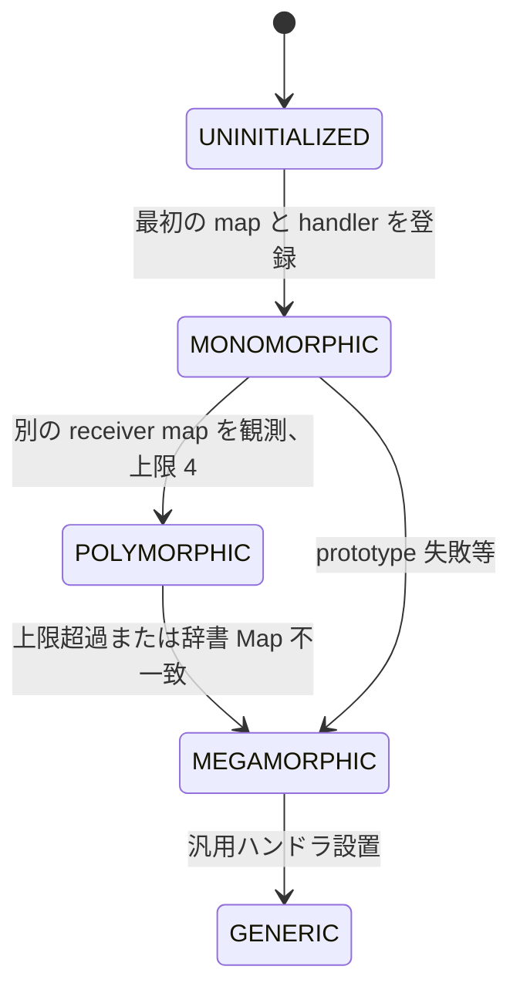

POLYMORPHICの上限は `DEFAULT_MAX_POLYMORPHIC_MAP_COUNT = 4`（`src/flags/flag-definitions.h:3238`）で、フラグ `--max-valid-polymorphic-map-count` を通じて変更可能です (`src/flags/flag-definitions.h:3239`)。`MapsAndHandlers` の内部 `DirectHandleSmallVector` のスタック格納サイズもこの定数で決まっています (`src/objects/feedback-vector.h:178`)。

#### 1.2 IC の更新ロジック

`IC::SetCache`（`src/ic/ic.cc:977-1035`）が状態遷移の中枢です。要点は次のとおりです。`UNINITIALIZED` のときは `UpdateMonomorphicIC`（`src/ic/ic.cc:896`）が呼ばれて単一の (map, handler) ペアがFeedbackVectorに書き込まれます。`MONOMORPHIC` のときに新しいreceiver mapが来ると `UpdatePolymorphicIC`（`src/ic/ic.cc:717-820`）が走り、既存エントリと比較しながら最大4個まで (map, handler) を追加します。失敗した場合は `CopyICToMegamorphicCache`（`src/ic/ic.cc:902`）でグローバルStubCacheにコピーし、状態を `MEGAMORPHIC` に格上げします。

POLYMORPHICが拒否される条件は明確で、`number_of_valid_maps >= v8_flags.max_valid_polymorphic_map_count`（`src/ic/ic.cc:791`）、辞書Mapでのhandler不一致（`src/ic/ic.cc:769`、deoptループ防止のため即MEGAMORPHICへ）、prototype失敗による上書きケースが該当します。

POLYMORPHICのエントリは `FeedbackIterator` でループしながら比較されます（`src/ic/ic.cc:733`）。Deprecated mapが混ざっていれば、それは別カウントで扱われ、`deprecated_maps >= max_valid_polymorphic_map_count` のときもMEGAMORPHICへ抜けます（`src/ic/ic.cc:794`）。これは古いMap（migration targetに置換済み）がフィードバックに残ったまま大量に増えないようにするための上限です。

#### 1.3 FeedbackVector の物理レイアウト

`V8_OBJECT class FeedbackVector : public HeapObject`（`src/objects/feedback-vector.h:307`）は固定ヘッダのあとに `FLEXIBLE_ARRAY_MEMBER` で `MaybeObject` のスロットを並べる可変長オブジェクトです。ヘッダは `length`、`invocation_count`、`invocation_count_before_stable`、`osr_state`、`flags`、`shared_function_info`、`closure_feedback_cell_array`、`parent_feedback_cell` などを含みます（`src/objects/feedback-vector.h:319-352`）。

`FeedbackSlotKind`（`src/objects/feedback-vector.h:45`）は23種類定義されており、`kLoadProperty`、`kSetNamedStrict`、`kCall`、`kBinaryOp`、`kCompareOp`、`kCloneObject`、`kForIn`、`kInstanceOf` 等があります。各slot kindごとに1個または2個のMaybeObjectを消費し、Polymorphic feedbackは2つ目のスロットに `WeakFixedArray<Map, Handler>` を持ちます。

`FeedbackNexus::ExtractMaps`（`src/objects/feedback-vector.cc:1167`）は `FeedbackIterator` をループし、POLYMORPHICスロットに格納されている (map, handler) ペアを抽出します。Mapは弱参照で保持されるため、GCにより回収されたmapは `it.handler().IsCleared()` で判定して除外されます（`src/ic/ic.cc:734`）。Polymorphicスロットの典型的なメモリ消費は `WeakFixedArray header + N * (Map* + Handler*) = 16 + N * 16` バイト前後で、N=4なら80バイトほどです。

#### 1.4 LoadHandler / StoreHandler の Smi エンコーディング

`LoadHandler`（`src/ic/handler-configuration.h:28`）は `DataHandler` を継承し、軽量ハンドラはSmi内に下記のビットフィールドでパッキングされます（`src/ic/handler-configuration.h:33-127`）。

- `KindBits` (4 bit, 0-3) — `kElement`, `kField`, `kConstantFromPrototype`, `kAccessorFromPrototype`, `kNativeDataProperty`, `kApiGetter`, `kInterceptor`, `kSlow`, `kProxy`, `kNonExistent`, `kModuleExport`, `kGeneric` などのハンドラ種別。
- `DoAccessCheckOnLookupStartObjectBits` (1 bit, 4)
- `LookupOnLookupStartObjectBits` (1 bit, 5)
- `kField` 用に `StorageOffsetInWordsBits` (kDescriptorIndexBitCount+1 = 11 bit)、`IsInobjectBits` (1)、`IsDoubleBits` (1)、`DescriptorIndexBits` (11) — `src/ic/handler-configuration.h:98-106`。
- `kElement` 用に `IsJsArrayBits`、`AllowHandlingHole`、`ElementsKindBits` (8 bit) — `src/ic/handler-configuration.h:123-127`。

つまり典型的なフィールドロードは31ビットSmi 1個だけで「inobjectか外部か、double slack表現か、descriptor番号、word offset」が全部表せます。これによりハンドラそのものをヒープに置かず即値で配布できます。Smiに収まらない複雑なハンドラ（prototype chainを辿る、interceptorを呼ぶ、ApiCallbackを踏むなど）は `DataHandler` を継承した `LoadHandler` インスタンスとして `LoadFromPrototype` などのファクトリで生成されます（`src/ic/handler-configuration.h:196`）。

#### 1.5 IC を活用した Map chain の効率化

V8のMap (Hidden Class) は安定すると `IsHandler` チェック（`src/ic/ic.h:68`）の対象になり、ハンドラがPOLYMORPHIC vectorに格納されると次回以降はMapポインタ比較のみでO(1) でディスパッチできます。Prototypeチェーン上のキャッシュは `LookupOnLookupStartObjectBits` でステップ数を表現し、Validity Cell（`DependentCode` 経由）がMap変化時にハンドラを無効化します。MEGAMORPHIC状態では `StubCache`（`src/ic/stub-cache.h`）というプロセスグローバル（厳密にはIsolate単位）のハッシュテーブルにフォールバックし、`UpdateMegamorphicCache`（`src/ic/ic.cc:1025`）が (map, name) → handlerを登録します。

---

### 2. Hidden Class (Map) と Transition

#### 2.1 Map と DescriptorArray

`V8_OBJECT class Map : public HeapObject`（`src/objects/map.h:258`）はinobjectプロパティ数、instance size、`bit_field` 系のフラグ、`prototype`、`constructor_or_back_pointer`、`transitions_or_prototype_info`、`instance_descriptors`、`dependent_code` を持ちます。各Mapは最大 `kMaxNumberOfDescriptors = (1 << 10) - 4 = 1020` 個のプロパティを記述できます（`src/objects/property-details.h:242,249`）。これを超えるとオブジェクトはdictionary mode（slow mode）へ遷移します。

#### 2.2 Transition の 3 つの形態

Mapから派生Mapへの移行は `TransitionsAccessor`（`src/objects/transitions.h:75`）で管理され、`raw_transitions` フィールドのエンコーディングは5種類存在します（`src/objects/transitions.cc:20-39`）。

- **kUninitialized** — まだ遷移を持たない（Smi(0)）
- **kWeakRef** — 単一遷移を `MakeWeak(target_map)` として直接埋め込む（`src/objects/transitions.cc:21,56`）。
- **kFullTransitionArray** — 完全な `TransitionArray`。複数のプロパティ名やprototype/elements kind遷移をまとめて保持。
- **kPrototypeInfo** / **kPrototypeSharedClosureInfo** — 別用途。
- **kMigrationTarget** — Map deprecation時に古いMapの `raw_transitions` を再利用してmigration先を保持（`src/objects/transitions.cc:560`）。

`TransitionArray` のレイアウトは `src/objects/transitions.h:305-360` に明示されています。`[0]` PrototypeTransitionsのWeakFixedArray、`[1]` SideStepTransitions、`[2]` number_of_transitions、`[3..]` (key, weak target) ペア。1エントリは2スロット (`kEntrySize = 2`) で、エントリ数は `kMaxNumberOfTransitions = 1024 + 512 = 1536`（`src/objects/transitions.h:150`）に制限されます。これはGCのincremental right-trimmingがメモリリークを起こさないよう、TransitionArrayをラージオブジェクト空間に置かない目的があります（同行のコメント参照）。

`SearchTransition` は線形探索/二分探索を切り替えます。`kMaxElementsForLinearSearch = 32`（`src/objects/transitions.h:319`）以下では `LinearSearchName`、超えたら `BinarySearchName`（`src/objects/transitions.h:438-439`）。バックグラウンドスレッドからも線形探索が使われます。

#### 2.3 同じプロパティ追加順なら同じ Map

`TransitionsAccessor::InsertHelper`（`src/objects/transitions.cc:43-130`）が遷移を追加する中枢で、既存遷移と同名・同kind・同attributesのものが見つかれば既存をそのまま使い、別なら新規entryを二分探索の挿入位置に挿入します（`src/objects/transitions.cc:99-127`）。これにより `{}; o.x=1; o.y=2;` のオブジェクト100万個が全部同じMapを共有でき、MapサイズとICのフィードバック空間を抑えられます。

#### 2.4 Boilerplate と AllocationSite

オブジェクトリテラルの初期化を高速化するため、`AllocationSite`（`src/objects/allocation-site.h:23`）にboilerplate JSObjectが保存されます。`transition_info_or_boilerplate_` フィールド（`src/objects/allocation-site.h:149`）がSmiならArray用、JSObjectならliteralの雛形です。`PretenureDecision` (`src/objects/allocation-site.h:28`) で `kUndecided`/`kDontTenure`/`kMaybeTenure`/`kTenure` の4段階を管理し、`MementoFoundCountBits` (26 bit) と `PretenureDecisionBits` (3 bit) を `pretenure_data_` に詰め込んでいます（`src/objects/allocation-site.h:80-82`）。

`AllocationSite::kMaximumArrayBytesToPretransition = 8 * 1024`（`src/objects/allocation-site.h:25`）は配列リテラルinitial sizeの閾値で、これを超えるリテラルはelements kind遷移のトラッキングを行いません。

---

### 3. コンパイラ階層とコードメモリ

#### 3.1 Code の種別

V8は単一の `Code` オブジェクトで全種類のコードを表現し、`CodeKind`（`src/objects/code-kind.h:36`）で識別します。

```
BYTECODE_HANDLER, FOR_TESTING, FOR_TESTING_JS,
BUILTIN, REGEXP, WASM_FUNCTION, WASM_TO_CAPI_FUNCTION,
WASM_TO_JS_FUNCTION, JS_TO_WASM_FUNCTION, C_WASM_ENTRY,
INTERPRETED_FUNCTION, BASELINE, MAGLEV, TURBOFAN_JS,
WASM_STACK_ENTRY
```

階層関係は静的に強制されています。`static_assert(CodeKind::INTERPRETED_FUNCTION < CodeKind::BASELINE)`、`BASELINE < TURBOFAN_JS`（`src/objects/code-kind.h:41-42`）。判定述語は `CodeKindIsOptimizedJSFunction` (MAGLEV..TURBOFAN_JSの範囲チェック、`src/objects/code-kind.h:71`)、`CodeKindCanDeoptimize` (MAGLEV/TURBOFAN/WASM_FUNCTION+deopt、`src/objects/code-kind.h:88`) など。

#### 3.2 Ignition (インタプリタ) と BytecodeArray

Ignitionバイトコードは `src/objects/bytecode-array.h:29` の `V8_OBJECT class BytecodeArray : public ExposedTrustedObject` に格納されます。サンドボックス有効時はサンドボックス外のTrusted Spaceに置かれ、`BytecodeWrapper`（`src/objects/bytecode-array.h:178`）が `TrustedPointerMember<BytecodeArray, kBytecodeArrayIndirectPointerTag>` を介して間接参照します。

`BytecodeArray` は `length`、`wrapper`、`source_position_table`、`handler_table`、`constant_pool`、`frame_size`、`parameter_size`、`max_arguments`、`incoming_new_target_or_generator_register` のあとに `FLEXIBLE_ARRAY_MEMBER(uint8_t, bytes)` を続け、最後に実バイトコードが並ぶ可変長オブジェクトです（`src/objects/bytecode-array.h:153-166`）。サイズ上限は `kMaxSize = 512 MB`（`src/objects/bytecode-array.h:137`）。

`Interpreter`（`src/interpreter/interpreter.h:50`）は `dispatch_table_` 配列を持ち（`src/interpreter/interpreter.h:113`、サイズ `kDispatchTableSize = 3 * 256 = 768`）、`OperandScale` ごとにバイトコードハンドラCodeの `instruction_start` を格納します。`Interpreter::GetBytecodeHandler`（`src/interpreter/interpreter.h:77`）が遅延デシリアライズを行います。

#### 3.3 Sparkplug (baseline) コンパイラ

`BaselineCompiler`（`src/baseline/baseline-compiler.h:51`）はバイトコードを1命令ずつ走査してmacro assembler経由でほぼ1対1にnative命令を吐き出す軽量JITです。`EstimateInstructionSize`（`src/baseline/baseline-compiler.h:59`）でバイト数を推定してから `Build`（`src/baseline/baseline-compiler.h:58`）で `Code` を返します。Baselineの特徴はICをインライン化せず、依然FeedbackVectorを使うことです。コードは `CodeSpace`（後述）に置かれます。

`BytecodeOffsetTableBuilder`（`src/baseline/baseline-compiler.h:31`）がVLQ圧縮でPC offsetとbytecode offsetの対応を保持し、デバッガとOSRのために `TrustedByteArray` に変換されます（`src/baseline/baseline-compiler.h:42`）。

#### 3.4 Maglev (mid-tier JIT)

`maglev::MaglevCompiler::Compile`（`src/maglev/maglev-compiler.h:27`）はバックグラウンドスレッドから呼べるnon-blockingコンパイラで、CFG構築→グラフ最適化→leg allocation→コード生成というTurboFan風のパイプラインですが、SSAレベルが浅く、最適化パスが少ないためSparkplugより速くかつTurboFanより速くコンパイルできるのが売りです。`maglev-graph-builder.cc` から `maglev-graph-optimizer.cc`、`maglev-regalloc.cc`、`maglev-code-generator.cc` までが主要な構成要素で、`MaglevCompilationInfo`（`src/maglev/maglev-compilation-info.h`）がIsolateと分離したPersistentHandlesでzone上にデータを保持します。

#### 3.5 TurboFan (top-tier JIT)

`src/compiler/` 配下に `pipeline.cc`、`turboshaft/` (Turboshaft IR)、`backend/` などが置かれ、複数のIR (TurboFan node graph、Turboshaft graph)、effect-control linearizer、escape analysis、loop optimization、register allocation、code generatorを含みます。Sea of Nodesベースでheap broker (`src/compiler/heap-refs.h`) を介してメインスレッドのヒープに安全にアクセスします。

#### 3.6 Code オブジェクトのメモリレイアウト

`V8_OBJECT class Code : public ExposedTrustedObject`（`src/objects/code.h:64`）は以下のフィールドを持ちます（`src/objects/code.h:391-435` の `CODE_DATA_FIELDS`）。

- `kDeoptimizationDataOrInterpreterDataOffset` — Maglev/TurbofanはDeoptimizationData、BaselineはBytecodeArray、それ以外は `Smi::zero()`。
- `kPositionTableOffset` — Baselineではbytecode offset table、それ以外はsource position table。
- `kWrapperOffset` — CodeWrapper (サンドボックス内のタグ付きハンドル)。
- `kInstructionStreamOffset` — 別のcode cage内の `InstructionStream`。
- `kInstructionStartOffset` — 機械語の生アドレス。
- `kDispatchHandleOffset` — `JSDispatchHandle`（leaptiering）。
- `kFlagsOffset` — `KindField`(4 bit) + `IsTurbofannedField` + `MarkedForDeoptimizationField` + `EmbeddedObjectsClearedField` + `CanHaveWeakObjectsField` 等 (`src/objects/code.h:459-468`)。
- `kInstructionSizeOffset`, `kMetadataSizeOffset`, `kInlinedBytecodeSizeOffset`, `kOsrOffsetOffset`, `kHandlerTableOffsetOffset`, `kUnwindingInfoOffsetOffset`, `kConstantPoolOffsetOffset`, `kCodeCommentsOffsetOffset`, `kJumpTableInfoOffsetOffset`, `kParameterCountOffset`, `kBuiltinIdOffset`。

実機械語は `InstructionStream` オブジェクトの後続バイト列に置かれ、メタデータ（handler table、constant pool、code comments、unwinding info）は同オブジェクト末尾のmetadataセクションに連結されます。Embedded builtinsは別格で、ELF/PEの `.text` セクションに焼き込まれたoff-heap命令列を `instruction_start` で直接参照します（`src/objects/code.h:39-50` の図解）。

`Code` 自身はTrusted Spaceに置かれます。`InstructionStream` は `CodeSpace`（`src/heap/paged-spaces.h:505`）または `CodeLargeObjectSpace`（`src/heap/large-spaces.h:197`）に配置されます。`CodeSpace` は `EXECUTABLE` フラグで作成され、コード固有のページ管理（W^X、ICache flush）を持ちます。`CodeLargeObjectSpace::AddPage`/`RemovePage` がコード用大規模ページの管理を担います。

#### 3.7 階層昇格と TieringManager

`TieringManager`（`src/execution/tiering-manager.cc`）の `MaybeOptimizeFrame`（`src/execution/tiering-manager.cc:300`）と `OnInterruptTick`（`src/execution/tiering-manager.cc:542`）がtier-upを駆動します。

invocation数の閾値は次のとおりです (`src/flags/flag-definitions.h:1137-1165`):

- `--invocation-count-for-feedback-allocation = 8` (Sparkplug入り口、FeedbackVectorを割り当てる)
- `--invocation-count-for-maglev = 400` (Androidでは1000)
- `--invocation-count-for-maglev-osr = 100`
- `--invocation-count-for-turbofan = 3000`
- `--invocation-count-for-osr = 500`
- `--minimum-invocations-after-ic-update = 500`

`InterruptBudgetFor`（`src/execution/tiering-manager.cc:180-222`）はbytecode lengthを掛け合わせた予算を返し、各invocationで消費していきます。Profile-Guided Optimization (`v8_flags.profile_guided_optimization`) が有効なら `CachedTieringDecision` に応じて値が変動します。

JS関数自身は `JSDispatchTable`（`src/sandbox/js-dispatch-table.h:179`）のエントリを `JSDispatchHandle` で参照します。tier-upしたら `SetCodeNoWriteBarrier`（`src/sandbox/js-dispatch-table.h:218`）でエントリのCodeポインタとエントリポイントを差し替えるだけで全closuresがまとめて新しいCodeに切り替わります（`src/sandbox/js-dispatch-table.h:170-178`）。これがleaptieringと呼ばれる仕組みです。

---

### 4. Deoptimization

#### 4.1 Deoptimizer

`Deoptimizer`（`src/deoptimizer/deoptimizer.h:36`）は最適化フレームを巻き戻してunoptimizedフレーム（Ignition、またはBaseline）を再構築するクラスです。`Deoptimizer::New`（`src/deoptimizer/deoptimizer.h:92`）がdeoptエントリから呼ばれ、`ComputeOutputFrames`（`src/deoptimizer/deoptimizer.h:140`）が `TranslatedState` を用いて出力フレームを構築します。

```cpp
DeoptimizeFunction(Tagged<JSFunction>, LazyDeoptimizeReason, Tagged<Code>);
DeoptimizeAll(Isolate*);
DeoptimizeMarkedCode(Isolate*);
DeoptimizeAllOptimizedCodeWithFunction(Isolate*, DirectHandle<SharedFunctionInfo>);
```

が主要APIです（`src/deoptimizer/deoptimizer.h:110-125`）。

`kMaxNumberOfEntries = 16384`（`src/deoptimizer/deoptimizer.h:167`）がdeoptエントリ数の上限で、`kEagerDeoptExitSize`、`kLazyDeoptExitSize`（`src/deoptimizer/deoptimizer.h:175-176`）がそれぞれの呼び出しシーケンスのバイト数（プラットフォーム依存）です。Shadow Stack (CET/RISC-V) サポート (`src/deoptimizer/deoptimizer.h:155-163`) もあります。

#### 4.2 DeoptimizationData

`class DeoptimizationData : public ProtectedFixedArray`（`src/objects/deoptimization-data.h:271`）がMaglev/TurboFanコードに紐づき、deopt必要時の情報を保持します。レイアウトは:

| インデックス | フィールド | 型 / 内容 |
| --- | --- | --- |
| [0] | `kFrameTranslationIndex` | DeoptimizationFrameTranslation |
| [1] | `kInlinedFunctionCountIndex` | Smi |
| [2] | `kProtectedLiteralArrayIndex` | ProtectedDeoptimizationLiteralArray |
| [3] | `kLiteralArrayIndex` | DeoptimizationLiteralArray |
| [4] | `kOsrBytecodeOffsetIndex` | |
| [5] | `kOsrPcOffsetIndex` | |
| [6] | `kOptimizationIdIndex` | |
| [7] | `kWrappedSharedFunctionInfoIndex` | |
| [8] | `kInliningPositionsIndex` | |
| [9] | `kDeoptExitStartIndex` | |
| [10] | `kEagerDeoptCountIndex` | |
| [11] | `kLazyDeoptCountIndex` | |
| [12..] | `{BytecodeOffsetRaw, TranslationIndex, Pc, (NodeId in DEBUG)} * N` | エントリ列 |

（`src/objects/deoptimization-data.h:276-300`）。`kDeoptEntrySize = 3`（DEBUG時は4）バイト相当のSmi領域を消費するエントリで、これに `IndexForEntry(i) = kFirstDeoptEntryIndex + i * kDeoptEntrySize`（`src/objects/deoptimization-data.h:378`）でアクセスします。`ProtectedFixedArray` はTrusted Spaceに置かれるため、サンドボックスからのcorruptionに強い設計です。

#### 4.3 TranslatedState とフレーム再構築

`TranslatedState`、`TranslatedFrame`、`TranslatedValue`（`src/deoptimizer/translated-state.h:42-52`）がそれぞれ最適化フレーム全体、unoptimized 1フレーム、値1個を抽象化します。`TranslatedValue` の `Kind`（`src/deoptimizer/translated-state.h:78-99`）は `kTagged`, `kInt32`, `kInt64ToBigInt`, `kFloat`, `kDouble`, `kHoleyDouble`, `kSimd128`, `kCapturedObject`, `kDuplicatedObject`, `kCapturedStringConcat` の14種類。

deopt時のメモリ動作は次のとおりです。`Deoptimizer::ComputeOutputFrames` が `DeoptimizationFrameTranslation` を読みながら、レジスタ／スタックスロットを `TranslatedValue` に詰めます。`kCapturedObject` のようなescape analysisでeliminateされたJSObjectは、`MaterializeHeapObjects`（`src/deoptimizer/deoptimizer.h:137`）で実際にヒープアロケーションが発生し、`MaterializedObjectStore`（`src/deoptimizer/materialized-object-store.h`）に登録されます。これは「最適化中はオブジェクトを構築せず、deopt時にはじめてヒープに具現化する」というレイジー戦略であり、deoptは本来のパフォーマンスの観点では高コストです。

`Deoptimizer::ZapCode`（`src/deoptimizer/deoptimizer.h:197`）はdeopt済みCodeを再実行不能にするために命令列をtrap命令で上書きしますが、GCがreloc infoを見て参照を辿る可能性を考慮して、`RelocIterator` でreloc領域を避けつつ上書きします。`EnsureValidReturnAddress`（`src/deoptimizer/deoptimizer.h:133`）は許可リストにあるreturn addressでないとクラッシュさせるCFI防御です。

---

### 5. V8 Sandbox

#### 5.1 仮想メモリ予約サイズ

サンドボックスは「アタッカーがサンドボックス内のメモリを任意にcorruptできる」ことを攻撃モデルとして、それ以外のメモリへの影響を遮断します（`src/sandbox/README.md:5-20`）。サイズはOS／アーキ別に決まります（`include/v8-internal.h:218-246`）。

| `kSandboxSizeLog2` | サイズ | 対象 |
| --- | --- | --- |
| 40 | 1 TB | 通常の 64bit Linux/macOS/Win |
| 37 | 128 GB | Android, RISC-V, LoongArch |
| 34 | 16 GB | iOS |

部分予約モード（partially-reserved sandbox）では `kSandboxMinimumReservationSize = 8 GB`（`include/v8-internal.h:271`）まで縮退できます。これはWindows 8.1以前で `VirtualAlloc2` が無く1TB予約が現実的でない場合の救済策で、`Sandbox::Initialize`（`src/sandbox/sandbox.cc:147`）が `vas->CanAllocateSubspaces()` で判定し、必要なら `InitializeAsPartiallyReservedSandbox` にフォールバックします（`src/sandbox/sandbox.cc:194`）。

ガード領域は `kSandboxGuardRegionSize = 32 GB + (kMaxSafeBufferSizeForSandbox + 1)`（`include/v8-internal.h:296`）で、サンドボックス前後に同サイズが確保されます。さらに `kAdditionalTrailingGuardRegionSize = 288 GB - kSandboxGuardRegionSize`（`include/v8-internal.h:312`）が末尾に追加され、TypedArrayアクセス `base + offset + index * element_size` でガード域を「飛び越え」られないようにしています。これはcrbug.com/40070746の防御策です。

`Sandbox::Initialize` のレイアウト図（`src/sandbox/sandbox.h:50-60`）:

`base` から `end` に向かって、以下の領域が順に並びます。

| 領域 | サイズ | 説明 |
| --- | --- | --- |
| Guard Region (front) | 32 GB | base から始まるガード領域 |
| Heap | 4 GB | V8 ヒープ (PtrCompr cage) |
| ArrayBuffer BS, WASM memories, other sandboxed obj | (Ideally) 1 TB | サンドボックス対象オブジェクトの本体 |
| Guard Region (back) | 32 GB | end に至るガード領域 |

#### 5.2 Smi address range 予約

`Sandbox::Initialize` は更にプロセスの最初の4GBをアクセス不能領域として確保しようとします（`src/sandbox/sandbox.cc:309-316`）。これはSmi←→HeapObject混同型バグのdefense in depthで、`kSmiAddressRange = 4 GB`（`src/sandbox/sandbox.h:77`）と `kSmiAddressRangePadding = 4 KB`（`src/sandbox/sandbox.h:82`、`JSObject::kMaxInstanceSize` より大きい）が定数として定義されます。

#### 5.3 SandboxedPointer

`SandboxedPointer_t = Address`（`include/v8-internal.h:216`）で、サンドボックス内オブジェクトはサンドボックス基点からのオフセットを `<< kSandboxedPointerShift` (=64-40=24bitシフト) して64bitに展開された値を保持します（`include/v8-internal.h:259`）。これによりcorruptしても範囲外を指せません。ArrayBufferのbacking storeポインタなどがこの形式で格納されます（`src/sandbox/sandboxed-pointer.h`）。

#### 5.4 External Pointer Table (EPT)

外部C++ オブジェクトへの参照は `ExternalPointerTable`（`src/sandbox/external-pointer-table.h:236`）経由に置換され、JSObject内には32bit handleのみが置かれます。テーブルサイズ（`include/v8-internal.h:329-345`）:

| 定数 | 値 | 備考 |
| --- | --- | --- |
| `kExternalPointerTableReservationSize` | 512 MB | デフォルト 64bit (Android 256 MB、iOS 128 MB) |
| `kExternalPointerTableEntrySize` | 8 byte | |
| `kMaxExternalPointers` | 64M | 512MB/8B |
| `kExternalPointerIndexShift` | 6 | Android は 7、iOS は 8 |

エントリのレイアウト（`src/sandbox/external-pointer-table.h:39-160`、`include/v8-internal.h:365-373`）:

| ビット範囲 | フィールド | 説明 |
| --- | --- | --- |
| 63-56 | 7-bit type tag | 型タグ |
| 55 | M bit | mark bit |
| 54-0 | 48-bit pointer payload | ポインタ本体 |

- `kExternalPointerTagMask = 0x00fe000000000000`
- `kExternalPointerMarkBit = 1ULL << 48`
- `kExternalPointerPayloadMask = 0xff00ffffffffffff`

ロード時に `(payload & ~mark_bit) ^ tag` のような操作でuntagし、タグが期待と違えばpointerはnon-canonicalになりクラッシュします。これがtype confusion防御の核心です。

EPTのGCはmarking bitを用い、Mark/Sweepの最後にsegment単位でfreelistを再構築します。Generational EPTが `SURVIVOR_TO_EXTERNAL_POINTER` remembered setを用いる仕組みも `src/sandbox/external-pointer-table.h:215-228` に書かれています。

Compactionは `CompactibleExternalEntityTable`（`src/sandbox/compactible-external-entity-table.h:84`）で、segment単位のevacuationを行います（`src/sandbox/compactible-external-entity-table.h:32-82` のコメントに詳細なアルゴリズム解説あり）。要旨は、最後N segmentをevacuation areaとして指定、live entryに対しevacuation entryを新規発行、sweepフェーズで実コピーとhandle更新を行います。`kNotCompactingMarker = UINT32_MAX`（`src/sandbox/compactible-external-entity-table.h:132`）と `kCompactionAbortedMarker = 0xf0000000`（同141）でステートを表現し、`bool should_evacuate = index >= start_of_evacuation_area` という単一比較で判定できる設計です。

#### 5.5 Trusted Pointer Table (TPT)

EPTが外部C++ オブジェクト用なのに対し、`TrustedPointerTable`（`src/sandbox/trusted-pointer-table.h:129`）はV8 HeapObjectではあるがサンドボックス外（Trusted Space）に置かれるオブジェクトを参照します。サイズ（`include/v8-internal.h:900-915`）:

| 定数 | 値 | 備考 |
| --- | --- | --- |
| `kTrustedPointerTableReservationSize` | 64 MB | |
| `kTrustedPointerTableEntrySize` | 8 byte | |
| `kMaxTrustedPointers` | 8M | 64MB/8B |
| `kTrustedPointerHandleShift` | 9 | |

エントリは48bitポインタ + 1bit mark + 15bitタグ（`src/sandbox/indirect-pointer-tag.h:23-35` に図示）:

| 定数 | 値 |
| --- | --- |
| `kTrustedPointerTableTagMask` | 0xfffe000000000000 |
| `kTrustedPointerTableMarkBit` | 0x0001000000000000 |
| `kTrustedPointerTablePayloadMask` | 0x0000ffffffffffff |
| `kTrustedPointerTableTagShift` | 49 |

タグの定義は `enum IndirectPointerTag`（`src/sandbox/indirect-pointer-tag.h:39-99`）にあり、`kSharedWasmTrustedInstanceDataIndirectPointerTag`、`kBytecodeArrayIndirectPointerTag = 0x3f`、`kCodeIndirectPointerTag = 0x40` などが定義されます。タグ範囲 `[1, 0x3f]` はper-Isolate TPT、`0x40` はCode専用、`0xfc..0xff` は特殊値（Unpublished/Zapped/Evacuation/Free）です（`src/sandbox/indirect-pointer-tag.h:50-99`）。

`IsFastIndirectPointerTag`（`src/sandbox/indirect-pointer-tag.h:108`）は「タグが2の冪ならuntagが単一ANDで済む」というファストパス判定で、`kWasmTrustedInstanceDataIndirectPointerTag = 4` がファストになるよう調整されています（`src/sandbox/indirect-pointer-tag.h:55,186`）。

`kUnpublishedIndirectPointerTag = 0xfc`（`src/sandbox/indirect-pointer-tag.h:91`）は「検証が完了するまでサンドボックスから参照できないようにする」ためのマジック値で、`BytecodeArray` の `MarkVerified`（`src/objects/bytecode-array.h:150`）がBytecode verifier通過後に `Publish` を呼んで切り替えます。

#### 5.6 Code Pointer Table (CPT)

`CodePointerTable`（`src/sandbox/code-pointer-table.h:114`）はCode専用の特化版TPTです。サイズ（`include/v8-internal.h:942-967`）:

| 定数 | 値 | 備考 |
| --- | --- | --- |
| `kCodePointerTableReservationSize` | 128 MB | |
| `kCodePointerTableEntrySize` | 8 byte | Code* + 1bit mark |
| `kMaxCodePointers` | 16M | |
| `kCodePointerHandleShift` | 8 | |
| `kCodePointerHandleMarker` | 0x1 | TPT handle と区別するマーカー |

エントリは2つの値（Code object pointer + entrypoint）を含み、JSFunctionの呼び出しが「テーブル1回引きでentrypointを取得」して直接jumpできる構造です（`src/sandbox/code-pointer-table.h:96-112`）。`IsWriteProtected = true`（`src/sandbox/code-pointer-table.h:32`）で、Intel PKEYsなどのハードウェア保護機能があるプラットフォームではプロセス全体に対してwrite protectされたforward-edge CFIを提供します。すなわち「サンドボックス内に任意書き込みが可能なアタッカーでも、Code Pointer Table経由でしかCodeを呼び出せないので、任意関数ガジェットへのjumpが原理的に阻まれる」設計です。

#### 5.7 JSDispatchTable と Leaptiering

`JSDispatchTable`（`src/sandbox/js-dispatch-table.h:179`）はサンドボックスの一部ではあるものの、Code Pointer Tableと同様に書き込み保護され（`JSDispatchEntry::IsWriteProtected` ≈ true）、CFIと高速tieringを両立します（`src/sandbox/js-dispatch-table.h:160-178`）。各エントリは `Address object` + `Address entrypoint` + 16-bit `parameter_count` で構成され、JSFunction呼び出し時にparameter countが一致しなければクラッシュさせる検証も入っています。

#### 5.8 Indirect Pointer

サンドボックス内オブジェクトがTrusted/Codeオブジェクトを指すフィールドは `TrustedPointerMember<T, tag>`（`src/objects/trusted-pointer.h`）で、ストレージは `IndirectPointerHandle`（32bit）です。`kCodePointerHandleMarker = 0x1`（`include/v8-internal.h:958`）でTPT handleとCPT handleを低位ビットで識別します。Union型のフィールド（CodeとTrustedの両方を指せる）でも、handleのマーカービットで正しいテーブルを引けます。

#### 5.9 攻撃シナリオに対する防御

主な攻撃と防御は以下のとおり整理できます。

- **Type confusion (JSObject を別 type に解釈し外部関数を呼ぶ)** — External Pointer Tableのタグ機構により、JSObjectフィールドから取り出した「外部関数ポインタ」はhandle経由でしか引けず、誤ったtagでは非canonicalアドレスになりクラッシュします（`src/sandbox/external-pointer-table.h:184-198`）。
- **Pointer corruption による outside-of-sandbox write** — ヒープ内ポインタはPtrCompr 32bitまたはサンドボックス基点オフセットなので、64bit範囲外を直接指せません。`Sandbox::Contains`（`src/sandbox/sandbox.h:191`）と `OutsideSandbox`（`src/sandbox/sandbox.h:355`）が境界判定を提供。
- **JIT スプレー / 任意関数呼び出し** — Code Pointer Tableのエントリはwrite-protectedな領域に置かれ、サンドボックス内アタッカーでも書き換えできません（`src/sandbox/code-pointer-table.h:106-112`）。
- **Smi←→HeapObject 混同による NULL→arbitrary read** — プロセス最初の4GBをガード予約することでSmi値（最大 ~2^32）をdereferenceするクラッシュを保証（`src/sandbox/sandbox.cc:309-316`）。
- **ArrayBuffer OOB → サンドボックス境界突破** — `kMaxSafeBufferSizeForSandbox = 32 GB - 1`（`include/v8-internal.h:281`）に制限し、`kBoundedSizeShift = 29` でsizeを上位ビットにシフトしたエンコーディングで保持（`include/v8-internal.h:283-288`）。これに32GB + 288GBのガード領域を合わせ、TypedArray index計算で `base + offset + index * 8` がガード域に着地するよう仕掛けてあります。
- **Bytecode 偽造による任意命令実行** — Bytecode arrayはTrusted Space + `kUnpublishedIndirectPointerTag` で隔離され、`BytecodeVerifier`（`src/sandbox/bytecode-verifier.h`）通過後にしかpublishされません。

---

### 6. Embedded Builtins / Snapshot

#### 6.1 Embedded Builtins

`EmbeddedData`（`src/snapshot/embedded/embedded-data.h:55`）は約700KBの組み込みbuiltinコードをELF/PEの `.text`/`.rodata` セクションに静的データとして埋め込み、起動時にコピー不要で実行可能にします。`OffHeapInstructionStream::PcIsOffHeap`（`src/snapshot/embedded/embedded-data.h:28`）が現在のPCがembedded領域内か判定し、`TryLookupCode`（同:38）でbuiltin IDを返します。

Short builtin calls（`src/snapshot/embedded/embedded-data.h:86-104`）は、Wasm呼び出しのようにfar callが必要な場合、Isolateごとにbuiltinをun-embeddingしてプロセス内コードレンジに再配置する仕組みで、近接jumpで呼べるようにします。詳細はcrbug.com/v8/11527。

#### 6.2 Shared Read-Only Heap

`ReadOnlyHeap`（`src/heap/read-only-heap.h:36`）はプロセス内全Isolateで共有可能なReadOnlySpaceを持ち、`SetUp`（`src/heap/read-only-heap.h:54`）で `read_only_snapshot_data` をデシリアライズします。RO領域に置かれる典型例はReadOnlyRoots（`src/roots/roots.h:545`、約数百個の `kReadOnlyRootsCount` エントリ）、Map、文字列定数、Symbol、prototype用の標準Mapなどです。

`#ifdef V8_ENABLE_SANDBOX` 時にはROヒープも独自の `CodePointerTable::Space code_pointer_space_` を持ち（`src/heap/read-only-heap.h:117-120`）、RO領域内に置かれたbuiltin Codeに対応するCPTエントリを永続的に保持します。

RO Heapの共有は `CreateInitialHeapForBootstrapping`（`src/heap/read-only-heap.h:96`）で1回だけ生成し、それ以降のIsolateは `InitializeIsolateRoots`（`src/heap/read-only-heap.h:86`）で参照を取得するだけです。これによりプロセス内N個のIsolateを作ってもROデータはほぼ単一物理メモリで共有できます。

---

### 7. Code Caching / Off-thread Compile

#### 7.1 BackgroundCompileTask

`BackgroundCompileTask`（`src/codegen/compiler.h:587`）はscript streaming/parse/compileをバックグラウンドスレッドで行うためのタスクオブジェクトです。`Run`（`src/codegen/compiler.h:611`）はLocalIsolateで動作し、`PersistentHandles`（`src/codegen/compiler.h:648`）を用いてメインスレッドのIsolateに依存せずにオブジェクトを生成します。最終的に `FinalizeScript`/`FinalizeFunction`（`src/codegen/compiler.h:622, 627`）でメインスレッドに合流し、グローバルIsolateに書き込みます。

#### 7.2 Script Streaming Data

`ScriptStreamingData`（`src/codegen/compiler.h:669`）は `ExternalSourceStream`（embedder提供）からのチャンクをバッファリングし、parserに逐次供給します。ChromiumはネットワークからHTML/JSをダウンロードしながら同時にparse/compileすることで、TTIを短縮します。

#### 7.3 Code Cache

`src/codegen/compilation-cache.h` の `CompilationCache` がスクリプトソース文字列・ScriptDetailsをキーに、`SharedFunctionInfo` をキャッシュします。永続キャッシュは `src/snapshot/code-serializer.cc` でディスクへシリアライズ・デシリアライズします（ChromiumのHTTP cacheメタデータに保存される `CachedData`）。

---

### 8. Embedder API のメモリ管理

#### 8.1 Isolate::CreateParams

`v8::Isolate::CreateParams`（`include/v8-isolate.h:296-371`）はIsolate構築時の設定構造体で、メモリ周りの主要フィールドは:

- `array_buffer_allocator` (`include/v8-isolate.h:343`) — ArrayBuffer backing storeの `malloc`/`free` をembedderが提供。
- `array_buffer_allocator_shared` (`include/v8-isolate.h:344`) — `shared_ptr` 版でBackingStoreがallocatorを保持。
- `constraints` (`include/v8-isolate.h:311`) — `ResourceConstraints`、ヒープサイズの上限・下限。
- `snapshot_blob` (`include/v8-isolate.h:317`) — 起動時の起動スナップショットblob。
- `cpp_heap` (`include/v8-isolate.h:370`) — CppHeap (`v8::CppHeap`) を渡すとIsolateがオーナーになり、OilpanベースのC++ オブジェクトを管理。

#### 8.2 Handle と HandleScope

`HandleBase`（`src/handles/handles.h:57`）は1ポインタ `Address* location_` を持つだけの薄いラッパで、これがGC rootsとして `Heap` から強参照として扱われます。`Handle<T>`（`src/handles/handles.h:150`）は型付きの派生クラス。

`HandleScope`（`src/handles/handles.h:263`）はスタック上に確保され、`Isolate` の `HandleScopeData` の `next_` / `limit_` ポインタを保存し、デストラクタで巻き戻すRAIIオブジェクトです（`src/handles/handles.h:319-321`）。`CreateHandle`（`src/handles/handles.h:287`）が `next_ < limit_` であれば1ポインタ進めて `Address*` を返し、足りなければ `Extend`（`src/handles/handles.h:331`）でブロックを増やします。`kCheckHandleThreshold = 30 * 1024`（`src/handles/handles.h:315`）。これによりhandlesの確保は通常パスでpointer-bump 1命令、解放はスコープ終端でbaseポインタを戻すだけと極めて高速です。

`DirectHandle`（`#ifdef V8_ENABLE_DIRECT_HANDLE`、`src/handles/handles.h:31`）は間接参照を廃した直値型ハンドルで、conservative stack scanningと合わせて使うことで `HandleScope` のcell確保すら不要にする実験的仕組みです。

#### 8.3 LocalHandles / PersistentHandles

`LocalHandles`（`src/handles/local-handles.h`）はバックグラウンドスレッド (LocalIsolate) 用のハンドルです。`PersistentHandles`（`src/handles/persistent-handles.h`）はスレッド境界をまたいでハンドルを持ち越せる単位で、`BackgroundCompileTask::NewPersistentHandle`（`src/codegen/compiler.h:617`）が新しいIndirectHandleを発行します。

#### 8.4 Direct Handle vs Indirect Handle

`indirect_handle`（`src/handles/handles.h:108-118`）はビルド設定によりdirect→indirect変換を行い、`V8_ENABLE_DIRECT_HANDLE` の有無でAPIのメモリ動作が大きく変わります（特にConservative Stack Scanningの前提）。

---

### 9. Persistent / Global Handle

#### 9.1 GlobalHandles

`GlobalHandles`（`src/handles/global-handles.h:30`）はHandleScope外で生き続けるハンドルを管理します。内部実装は `NodeSpace<Node>` のテーブル（`src/handles/global-handles.h:156`）で、Nodeブロック単位でメモリを確保し、各Nodeが1個のハンドルを表現します。`Create`（`src/handles/global-handles.h:74`）がNodeを確保し、`Destroy`（`src/handles/global-handles.h:46`）が解放します。

弱参照は `MakeWeak`（`src/handles/global-handles.h:57`）で、`WeakCallbackInfo<void>::Callback` と `WeakCallbackType` を指定します。GCが「弱参照しか指していない」と判断したノードはコールバックが2段階で呼ばれ（`InvokeFirstPassWeakCallbacks`、`InvokeSecondPassPhantomCallbacks`、`src/handles/global-handles.h:82-83`）、phantom weakの場合はcallback起動前にハンドル値がSmiにクリアされます。

`young_nodes_`（`src/handles/global-handles.h:159`）は若い世代のNodeを別途追跡し、Scavengerが高速にイテレートできるようにします。`IterateYoungStrongAndDependentRoots`（`src/handles/global-handles.h:104`）と `ProcessWeakYoungObjects`（`src/handles/global-handles.h:109`）がその機構です。

#### 9.2 EternalHandles

`EternalHandles`（`src/handles/global-handles.h:192`）は決して解放されないハンドルで、プロセス終了まで生存します。`Create`（`src/handles/global-handles.h:200`）でインデックスを発行し、`Get(int index)`（`src/handles/global-handles.h:204`）で取得します。内部は `kSize = 256` 個ずつのブロックをvectorで持ち、`index >> 8` でブロックを、`index & 0xff` でブロック内オフセットを得ます（`src/handles/global-handles.h:219-228`）。Eternalの使い所はprivate symbolや標準的なAPIテンプレートのようにIsolateの生存期間中保持し続けるオブジェクトです。

#### 9.3 GlobalHandleVector

`GlobalHandleVector<T>`（`src/handles/global-handles.h:239`）はstd::vectorの表面を持ちつつ、要素アドレス（`Address`）を `StrongRootAllocator` 経由で確保してGC強参照として扱う巧妙なクラスです。動的サイズでGlobalHandleを管理したい場面（例えばbackground jobが任意個のIndirectHandleを作る）で使われます。

#### 9.4 TracedHandle

`src/handles/traced-handles.h` の `TracedHandle` はOilpan / Blinkとの連携用で、C++ の `Persistent<T>` 相当を効率的に処理し、unified heap GCでメインヒープと合わせてマーキングされます。

---

### 10. 補足: Heap Spaces 概観

最後に主要ヒープ空間を整理します。

- **NewSpace / NewLargeObjectSpace** — 新世代、Scavengerの対象。
- **OldSpace** — 古世代、Mark-Sweep-Compact / Mark-Compact対象。
- **CodeSpace** (`src/heap/paged-spaces.h:505`) / **CodeLargeObjectSpace** (`src/heap/large-spaces.h:197`) — 実行可能ページ。`EXECUTABLE` フラグ付き。
- **SharedSpace** (`src/heap/paged-spaces.h:517`) — マルチIsolate共有 (`--shared-string-table` 等)。
- **TrustedSpace** (`src/heap/paged-spaces.h:532`) / **TrustedLargeObjectSpace** (`src/heap/large-spaces.h:166`) — サンドボックス外。BytecodeArray、Code、DeoptimizationData (ProtectedFixedArray) が住む。
- **SharedTrustedSpace** (`src/heap/paged-spaces.h:541`) / **SharedTrustedLargeObjectSpace** (`src/heap/large-spaces.h:172`) — 共有されたtrusted。
- **ReadOnlySpace** — `ReadOnlyHeap` 配下、Map・builtin Code・Roots。

サンドボックス有効時の物理配置は概念的には:

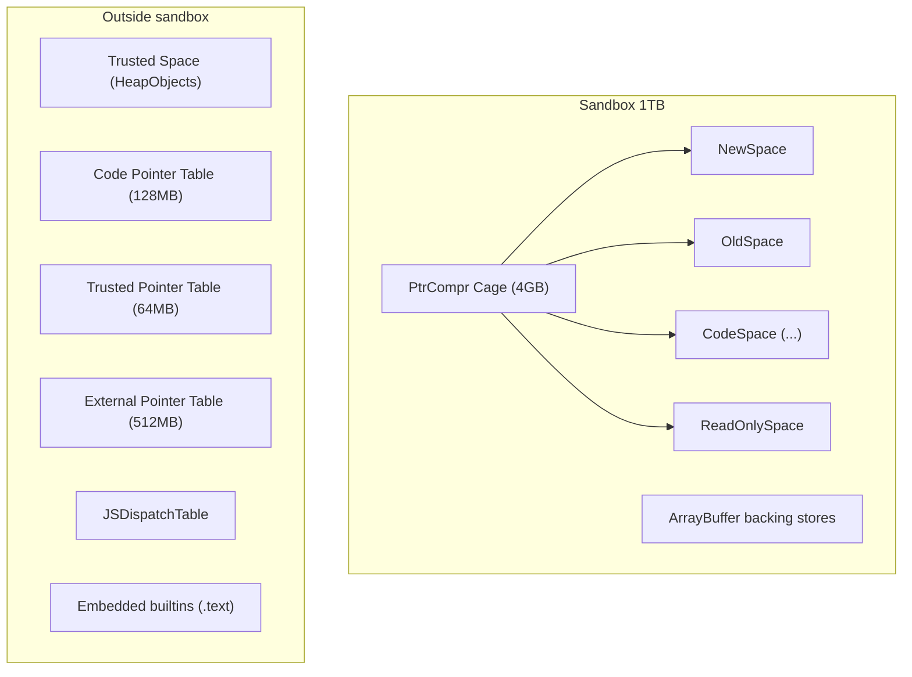

となります。CodeSpaceは「サンドボックス内」にあるものの、Codeオブジェクト（メタ情報）はTrusted Spaceに隔離されているため、InstructionStreamの中身がサンドボックスcorruptionで書き換えられても、Codeそのもののkind/handler offsets/deopt dataはcorrupt困難という二重防御です。

---

### 11. 参照ファイル一覧（抜粋）

- `/home/user/v8/src/ic/ic.h`, `/home/user/v8/src/ic/ic.cc`
- `/home/user/v8/src/ic/handler-configuration.h`
- `/home/user/v8/src/objects/feedback-vector.h`, `/home/user/v8/src/objects/feedback-vector.cc`
- `/home/user/v8/src/objects/map.h`
- `/home/user/v8/src/objects/transitions.h`, `/home/user/v8/src/objects/transitions.cc`
- `/home/user/v8/src/objects/allocation-site.h`
- `/home/user/v8/src/objects/code.h`, `/home/user/v8/src/objects/code-kind.h`
- `/home/user/v8/src/objects/bytecode-array.h`
- `/home/user/v8/src/objects/deoptimization-data.h`
- `/home/user/v8/src/objects/property-details.h`
- `/home/user/v8/src/common/globals.h` (InlineCacheState等)
- `/home/user/v8/src/common/segmented-table.h`
- `/home/user/v8/src/flags/flag-definitions.h`
- `/home/user/v8/src/interpreter/interpreter.h`
- `/home/user/v8/src/baseline/baseline-compiler.h`
- `/home/user/v8/src/maglev/maglev.h`, `/home/user/v8/src/maglev/maglev-compiler.h`
- `/home/user/v8/src/compiler/` (TurboFan)
- `/home/user/v8/src/deoptimizer/deoptimizer.h`, `/home/user/v8/src/deoptimizer/translated-state.h`
- `/home/user/v8/src/execution/tiering-manager.cc`
- `/home/user/v8/src/sandbox/sandbox.h`, `/home/user/v8/src/sandbox/sandbox.cc`
- `/home/user/v8/src/sandbox/external-pointer-table.h`
- `/home/user/v8/src/sandbox/trusted-pointer-table.h`
- `/home/user/v8/src/sandbox/code-pointer-table.h`
- `/home/user/v8/src/sandbox/js-dispatch-table.h`
- `/home/user/v8/src/sandbox/indirect-pointer-tag.h`
- `/home/user/v8/src/sandbox/compactible-external-entity-table.h`
- `/home/user/v8/src/sandbox/README.md`
- `/home/user/v8/include/v8-internal.h` (kSandboxSize等の主要定数)
- `/home/user/v8/include/v8-isolate.h` (CreateParams)
- `/home/user/v8/src/handles/handles.h`
- `/home/user/v8/src/handles/global-handles.h`
- `/home/user/v8/src/heap/paged-spaces.h`, `/home/user/v8/src/heap/large-spaces.h`
- `/home/user/v8/src/heap/read-only-heap.h`
- `/home/user/v8/src/snapshot/embedded/embedded-data.h`
- `/home/user/v8/src/codegen/compiler.h`

各ファイル・行番号は本稿執筆時点の `/home/user/v8` チェックアウトに基づきます。

---

## 第 V 部 オブジェクトのメモリ表現 (String, Array, TypedArray, HeapNumber, BigInt)

## V8 メモリ表現 完全解説 ― String・Array・TypedArray の内部構造

本書はV8ソースコード (`/home/user/v8`) を直接読み解き、JavaScriptの `String` / `Array` / `TypedArray` 等がV8ヒープ上でどのように表現されているかを、ヘッダオフセット・ビットフィールド・状態遷移まで掘り下げて記述したものである。引用はV8の現行ソースに基づき、行番号は `src/...` 直下の絶対パスで示す。

---

### 0. 全 HeapObject 共通の前提 ― Tagged Pointer と Map

V8ではヒープ上の値は全て「タグ付きポインタ」(Tagged) で表現される。最下位ビットが識別子を兼ねており、`include/v8-internal.h:57-74` に次のように定義されている。

| 定数 | 値 | 意味 |
| --- | --- | --- |
| `kSmiTag` | 0 | 最下位ビット 0 → Smi |
| `kHeapObjectTag` | 1 | 最下位ビット 1 → ヒープポインタ |
| `kWeakHeapObjectTag` | 3 | ...11 → 弱参照 |
| `kHeapObjectTagSize` | 2 | |

`kSmiTagSize = 1` であり、64bitビルド (`SmiTagging<8>`) では `kSmiShiftSize = 31`、つまりSmiは32bit値を上位32bitに詰めて、下位32bitを0にしたタグ付きWordになる (`include/v8-internal.h:135-146`)。ポインタ圧縮 (`V8_COMPRESS_POINTERS`) を有効にすると `kTaggedSize = 4` で32bit Smi (`include/v8-internal.h:84-131`) を使う。

全てのHeapObjectはオブジェクト先頭にMapポインタを持つ。Mapは隠しクラスであり、`kMapOffset = offsetof(HeapObject, map_) = 0` (`src/objects/js-objects.h:384`)。インスタンスタイプはMap内の `instance_type_` (`uint16_t`) で表され、文字列の細分類はここに格納される。

レイアウト共通形:

| Offset | フィールド | 説明 |
| --- | --- | --- |
| 0 | `Map` | Tagged<Map> |
| kTaggedSize | ... payload | |

---

### 1. String の完全な分類

#### 1.1 String 階層の抽象構造

`src/objects/string.h:120` から `class String : public Name` で定義される。基底クラス `Name` は `src/objects/name.h:83` で `PrimitiveHeapObject` を継承し、`std::atomic_uint32_t raw_hash_field_` を持つ (`src/objects/name.h:304`)。StringはNameに `uint32_t length_` を追加する (`src/objects/string.h:802`)。

すなわちStringのメモリレイアウトは:

| Offset | フィールド | 型 / 説明 |
| --- | --- | --- |
| 0 | `Map*` | kTaggedSize |
| T | `raw_hash_field_` | uint32_t、Name から継承 |
| T+4 | `length_` | uint32_t |
| T+8 | 派生クラス固有フィールド… | |

Tは `kTaggedSize` で、ポインタ圧縮時4、無効時8になる。string instance type (`src/objects/instance-type.h:116-165`) は16bitのうち下位7bitを使ってrepresentation × encoding × shared/internalizedを表現する。bit構成は `src/objects/instance-type.h:25-97` にある。

| ビット | 名前 | 値 / 意味 |
| --- | --- | --- |
| 0-2 | StringRepresentationTag | `kSeqStringTag = 0b000`、`kConsStringTag = 0b001`、`kExternalStringTag = 0b010`、`kSlicedStringTag = 0b011`、`kThinStringTag = 0b101` (bit2 が立つのは ThinString のみ) |
| 3 | `kStringEncodingMask` | `kTwoByteStringTag = 0`、`kOneByteStringTag = 1<<3 = 0x08` |
| 4 | `kUncachedExternalStringTag` | External 専用 |
| 5 | `kNotInternalizedTag` | 1=非 internalized |
| 6 | `kSharedStringTag` | 1=共有ヒープへ移動済み |
| 7- | | 非文字列 |

`kIsIndirectStringMask = 1<<0` (`src/objects/instance-type.h:38`) によりbit0を見るだけで「直接表現か間接表現か」が判別できるよう設計されている。Seq / Externalは直接 (bit0=0)、Cons / Sliced / Thinは間接 (bit0=1)。

#### 1.2 SeqOneByteString / SeqTwoByteString

`src/objects/string.h:891` (`V8_OBJECT class SeqOneByteString : public SeqString`) と `src/objects/string.h:968` (`V8_OBJECT class SeqTwoByteString : public SeqString`)。両者とも `FLEXIBLE_ARRAY_MEMBER(Char, chars)` でクラス末尾に文字データを直結する (`src/objects/string.h:950, 1023`)。文字幅は `Char = uint8_t` か `uint16_t`。サイズは:

```cpp
// src/objects/string-inl.h:1377-1394
constexpr int32_t SeqOneByteString::DataSizeFor(int32_t length) {
  return sizeof(SeqOneByteString) + length * sizeof(Char);
}
constexpr int32_t SeqOneByteString::SizeFor(int32_t length) {
  return OBJECT_POINTER_ALIGN(SeqOneByteString::DataSizeFor(length));
}
```

OBJECT_POINTER_ALIGNによりタグサイズ単位 (4 or 8) で末尾パディングが入る。レイアウト図 (圧縮ポインタ無効、64bitの場合):

SeqOneByteStringのレイアウト:

| Offset | フィールド | サイズ | 説明 |
| --- | --- | --- | --- |
| 0 | `Map*` | 8 bytes | |
| 8 | `raw_hash_field_` | 4 bytes | |
| 12 | `length_` | 4 bytes | |
| 16 | `chars[0..length]` | length bytes | latin1 |
| | `padding` | 0..7 bytes | |

`SeqOneByteString::kMaxCharsSize = kMaxLength`、`SeqTwoByteString::kMaxCharsSize = kMaxLength * sizeof(Char)` (`src/objects/string.h:929, 1002`)。`kMaxLength = v8::String::kMaxLength` で、`include/v8-primitive.h:129-133`:

```cpp
static constexpr int kMaxLength =
    internal::kApiSystemPointerSize == 4 ? (1 << 28) - 16 : (1 << 29) - 24;
```

つまり32bitプラットフォームで約268M chars、64bitで約536M chars。`src/objects/string.h:537` で `String::kMaxLength <= kSmiMaxValue` が静的に検証される。

`SeqString` 自体は `src/objects/string.h:861-883` の抽象クラスで `Truncate()` とpadding管理API (`GetDataAndPaddingSizes()`, `ClearPadding()`) を提供する。paddingは `src/objects/string.cc:2095-2098` のように `memset` で0クリアされる。

#### 1.3 ConsString ― `+` 演算子の遅延表現

`src/objects/string.h:1047` 以降。

```cpp
V8_OBJECT class ConsString : public String {
  ...
 public:
  TaggedMember<String> first_;   // src/objects/string.h:1097
  TaggedMember<String> second_;  // src/objects/string.h:1098
};
```

`ConsString::kMinLength = 13` (`src/objects/string.h:1076`) より短い結合はSeqStringを新規確保するのが常套。ConsStringのレイアウト:

| Offset | フィールド | サイズ | 説明 |
| --- | --- | --- | --- |
| 0 | `Map* (CONS_*)` | | |
| T | `raw_hash_field_` | uint32_t | |
| T+4 | `length_` | uint32_t | 合算長 first.length + second.length |
| T+8 | `first_` | TaggedMember<String> | |
| T+8+tagged | `second_` | TaggedMember<String> | |

二分木構造を形成し、葉がSeqStringやExternalStringになる。文字取得 `ConsString::Get` (`src/objects/string.cc:2100-2128`) は再帰的に左右へ辿る:

```cpp
while (true) {
  if (StringShape(string).IsCons()) {
    Tagged<ConsString> cons_string = Cast<ConsString>(string);
    Tagged<String> left = cons_string->first();
    if (left->length() > index) {
      string = left;
    } else {
      index -= left->length();
      string = cons_string->second();
    }
  } else {
    return string->Get(index, access_guard);
  }
}
```

深くなり過ぎたツリーは `ConsStringIterator` (`src/objects/string.h:1367-1418`、`kStackSize = 32`) で平坦化用スタックを管理する。GC時にはsecondがempty_stringならばfirstだけを残してショートカット可能と判定される (`IsShortcutCandidate`、`src/objects/instance-type.h:108-114`)。

#### 1.4 SlicedString ― 部分文字列の遅延表現

`src/objects/string.h:1166-1199`:

```cpp
V8_OBJECT class SlicedString : public String {
  ...
  TaggedMember<String> parent_;
  TaggedMember<Smi> offset_;
};
```

`offset_` はSmiに格納された開始位置、`parent_` はSeqStringかExternalStringのいずれか (`src/objects/string-inl.h:1419-1422` の `set_parent` 内で `DCHECK(IsSeqString(parent) || IsExternalString(parent))`)。`SlicedString::kMinLength = 13` (`src/objects/string.h:1181`)。これより短いと `String.prototype.substring` 等はSeqStringを新規確保する。

ネスト禁止 (Sliced of Sliced) は `src/objects/string.h:1161-1162` のコメントに「二重間接は単純化される」と明記されている。

#### 1.5 ThinString ― internalize 後の薄い参照

`src/objects/string.h:1116-1147`:

```cpp
V8_OBJECT class ThinString : public String {
  ...
  TaggedMember<InternalizedString> actual_;
};
```

「in-place internalizationが不可能」な場合 (ExternalやSharedなど) の代替として、元の場所にThinStringを被せ、`actual_` でinternalized版を指す。`String::MakeThin` (`src/objects/string.cc:136-203`) が実装:

```cpp
Tagged<Map> target_map = internalized->IsOneByteRepresentation()
                             ? roots.thin_one_byte_string_map()
                             : roots.thin_two_byte_string_map();
...
Tagged<ThinString> thin = UncheckedCast<ThinString>(Tagged(this));
thin->set_actual(internalized);
...
int size_delta = old_size - sizeof(ThinString);
if (size_delta != 0) {
  isolate->heap()->NotifyObjectSizeChange(
      thin, old_size, sizeof(ThinString), ...);
}
```

元オブジェクトとThinStringのサイズ差はFreeSpace fillerで埋められる (Large spaceでは除外)。Map書き換えは `set_map_safe_transition` でrelease-storeされ、並行マーカに対する整合性が保たれる。

#### 1.6 ExternalString / ExternalOneByteString / ExternalTwoByteString

`src/objects/string.h:1209-1212` (`UncachedExternalString`)、`src/objects/string.h:1223-1262` (`ExternalString`)。

```cpp
V8_OBJECT class UncachedExternalString : public String {
 protected:
  ExternalPointerMember<kExternalStringResourceTag> resource_;
};
V8_OBJECT class ExternalString : public UncachedExternalString {
  ...
 protected:
  ExternalPointerMember<kExternalStringResourceDataTag> resource_data_;
};
```

レイアウト:

| Offset | フィールド | 説明 |
| --- | --- | --- |
| 0 | `Map*` | |
| | `raw_hash_field_` | |
| | `length_` | |
| | `resource_` | ExternalPointer (Embedder の Resource オブジェクト) |
| | `resource_data_` | ExternalPointer (高速アクセス用の生ポインタキャッシュ) |

`Uncached*` バリアントは `resource_data_` を省略してオブジェクトサイズを縮める (in-place外部化で元サイズが不足な場合に使用、`src/objects/string.cc:248-287`)。

`ExternalOneByteString` (`src/objects/string.h:1274-1302`) と `ExternalTwoByteString` (`src/objects/string.h:1308-1340`) は静的アサート `sizeof(ExternalOneByteString) == sizeof(ExternalString)` で同サイズを保証する (`src/objects/string.h:1304, 1342`)。

外部化処理 `String::MakeExternalDuringGC` (`src/objects/string.cc:291-340`) はGC中に元のSeqStringを上書きする。`ComputeExternalStringMap` (`src/objects/string.cc:247-287`) がサイズ・internalized・sharedの組合せから6種のMapのいずれかを選ぶ。

#### 1.7 InternalizedString とハッシュテーブル

`InternalizedString : public String` (`src/objects/string.h:885-887`) は型タグだけの薄いクラス。文字列インターン (同一文字列を1つに正規化) はString Table (`src/strings/string-hasher.h` 参照経路) で行われる。InternalizedStringはinstance typeのbit5が0 (`kInternalizedTag = 0`、`src/objects/instance-type.h:80`)。

`IsInPlaceInternalizable` (`src/objects/string.h:690-694`) によってSeqStringやExternalがin-placeでMapだけ書き換えられてinternalized化可能か判定される。不能なケース (ConsStringやShared、forwarding indexあり等) ではThinString変換になる。

#### 1.8 raw_hash_field の構造 ― String hash

`src/objects/name.h:165-256` に詳細。

```cpp
enum class HashFieldType : uint32_t {
  kHash            = 0b10,
  kIntegerIndex    = 0b00,
  kForwardingIndex = 0b01,
  kEmpty           = 0b11
};
using HashFieldTypeBits = base::BitField<HashFieldType, 0, 2>;
using HashBits = HashFieldTypeBits::Next<uint32_t, kBitsPerInt - 2>;
static constexpr int kEmptyHashField =
    HashFieldTypeBits::encode(HashFieldType::kEmpty);
static constexpr int kHashNotComputedMask = 1;
```

最下位2bitが「内容種別」、上位30bitがペイロード。`kEmpty = 0b11` は「未計算」を意味し最下位bitが立つので `kHashNotComputedMask = 1` だけでフィルタできる。`kHash` のときは普通のハッシュ、`kIntegerIndex` のときは数値インデックス文字列 ("123" 等) のキャッシュ値、`kForwardingIndex` は文字列転送テーブル (内部化等の最中の同期に使用) を指す。

Array index用のサブビット:

| 定数 / ビットフィールド | 値 / 定義 | 備考 |
| --- | --- | --- |
| `kArrayIndexValueBits` | 24 | `src/objects/name.h:214` |
| `ArrayIndexValueBits` | `HashFieldTypeBits::Next<unsigned int, 24>` | |
| `ArrayIndexLengthBits` | `ArrayIndexValueBits::Next<unsigned int, 32-24-2>` | |
| `kMaxCachedArrayIndexLength` | 7 | kArrayIndexValueBits=24 < 10^7 |

`String::kMaxHashCalcLength = 16383` (`src/objects/string.h:541`) を超える文字列は内容ではなく長さからハッシュを生成するtrivial hashになる (`src/strings/string-hasher-inl.h:99-107`):

```cpp
uint32_t StringHasher::GetTrivialHash(uint32_t length) {
  DCHECK_GT(length, String::kMaxHashCalcLength);
  static_assert(String::kMaxLength <= String::HashBits::kMax);
  return String::CreateHashFieldValue(length, String::HashFieldType::kHash);
}
```

ハッシュ計算本体はrapidhash (`src/strings/string-hasher-inl.h:53-74`) で行われ、`ConvertRawHashToUsableHash` (`src/strings/string-hasher-inl.h:30-36`) が0を `kZeroHash = 27` に置換する。0は「未計算」と区別するため予約。

#### 1.9 Flatten 処理

`String::Flatten` (`src/objects/string-inl.h:945-1000`) は最初に `StringShape(s).IsDirect()` をチェックし直接表現ならそのまま返す。ConsStringの場合 `SlowFlatten` (`src/objects/string-inl.h:850-938`) に分岐。SlowFlattenの核心:

```cpp
HandleType<SeqOneByteString> flat = isolate->factory()
    ->NewRawOneByteString(length, allocation).ToHandleChecked();
...
WriteToFlat2(flat->GetChars(no_gc), raw_cons, 0, length, ...);
raw_cons->set_first(*flat);
raw_cons->set_second(ReadOnlyRoots(isolate).empty_string());
result = flat;
```

すなわち新たなSeqStringを確保して全文字を書き出し、元のConsStringの `first_` を新SeqStringに、`second_` を空文字列に書き換える。これにより `ConsString::IsFlat()` (`src/objects/string-inl.h:1447`) が `second()->length() == 0` でtrueを返す「degenerate cons」状態になる。GCショートカットでsecond側がempty_stringなら最終的にfirstだけ残せるよう設計されている。

#### 1.10 主要上限値の一覧

| 定数 | 値 | 場所 |
|---|---|---|
| `String::kMaxLength` | (1<<28)-16 / (1<<29)-24 | `include/v8-primitive.h:129` |
| `String::kMaxOneByteCharCode` | 0xFF | `src/objects/string.h:525` |
| `String::kMaxUtf16CodeUnit` | 0xFFFF | `src/objects/string.h:527` |
| `String::kMaxCodePoint` | 0x10FFFF | `src/objects/string.h:529` |
| `String::kMaxHashCalcLength` | 16383 | `src/objects/string.h:541` |
| `ConsString::kMinLength` | 13 | `src/objects/string.h:1076` |
| `SlicedString::kMinLength` | 13 | `src/objects/string.h:1181` |
| `kZeroHash` | 27 | `src/strings/string-hasher.h:76` |

---

### 2. Array の内部構造

#### 2.1 JSArray 本体

`src/objects/js-array.h:25-161`。

```cpp
V8_OBJECT class JSArray : public JSObject {
 public:
  ...
  TaggedMember<Number> length_;   // src/objects/js-array.h:160
};
inline constexpr int JSArray::kHeaderSize = sizeof(JSArray);
```

JSArray自体はJSObjectに `length` プロパティを1つin-object追加した形。lengthはSmiまたはHeapNumber (32bit overflowしたとき)。レイアウト:

JSArray (継承: HeapObject -> JSReceiver -> JSObject -> JSArray) のレイアウト:

| Offset | フィールド | 由来 | 説明 |
| --- | --- | --- | --- |
| 0 | `Map*` | | |
| T | `properties_or_hash_` | JSReceiver | |
| 2T | `elements_` | JSObject | |
| 3T | `length_` | JSArray | Number、ほぼ常に Smi |
| 4T = kHeaderSize | (in-object props なし) | | |

ここでTはkTaggedSize。`JSArray::kPreallocatedArrayElements = 4` (`src/objects/js-array.h:129`) が新規空配列に与えるFixedArray capacityの初期値。

`kMaxArrayLength = kMaxUInt32` (`src/objects/js-array.h:142-145`)、`kMaxFastArrayLength` は標準32MiBかLOW_LIMITSで8MiB (`src/objects/js-array.h:148-149`)。`kInitialMaxFastElementArray` (`src/objects/js-array.h:164`) は1回のメモリ配置で済む最大要素数を計算したもの。

#### 2.2 ElementsKind ― 配列の特殊化レベル

`src/objects/elements-kind.h:105-183` の `enum ElementsKind : uint8_t` で全ElementsKindが列挙される。並びは性能のため意図的:

| 値 | ElementsKind | 説明 |
| --- | --- | --- |
| 0 | `PACKED_SMI_ELEMENTS` | 全 Smi、穴なし。最も特殊 |
| 1 | `HOLEY_SMI_ELEMENTS` | |
| 2 | `PACKED_ELEMENTS` | 任意 Tagged、穴なし |
| 3 | `HOLEY_ELEMENTS` | 任意 Tagged、穴あり (最も汎用な fast kind) |
| 4 | `PACKED_DOUBLE_ELEMENTS` | unboxed double、穴なし |
| 5 | `HOLEY_DOUBLE_ELEMENTS` | |
| 6 | `PACKED_NONEXTENSIBLE_ELEMENTS` | |
| 7 | `HOLEY_NONEXTENSIBLE_ELEMENTS` | |
| 8 | `PACKED_SEALED_ELEMENTS` | |
| 9 | `HOLEY_SEALED_ELEMENTS` | |
| 10 | `PACKED_FROZEN_ELEMENTS` | |
| 11 | `HOLEY_FROZEN_ELEMENTS` | |
| 12 | `SHARED_ARRAY_ELEMENTS` | |
| 13 | `DICTIONARY_ELEMENTS` | slow path、NumberDictionary |
| 14 | `FAST_SLOPPY_ARGUMENTS_ELEMENTS` | |
| 15 | `SLOW_SLOPPY_ARGUMENTS_ELEMENTS` | |
| 16 | `FAST_STRING_WRAPPER_ELEMENTS` | |
| 17 | `SLOW_STRING_WRAPPER_ELEMENTS` | |
| 18..30 | `UINT8_ELEMENTS`..`FLOAT16_ELEMENTS` | Typed Arrays |
| 31..43 | `RAB_GSAB_UINT8_ELEMENTS`.. | Resizable/Growable Typed Arrays |
| 44 | `WASM_ARRAY_ELEMENTS` | |
| 45 | `NO_ELEMENTS` | |

判定マクロが豊富に用意される。代表的なもの (`src/objects/elements-kind.h:418-461`):

```cpp
constexpr bool IsHoleyElementsKind(ElementsKind kind) {
  return kind % 2 == 1 && kind <= HOLEY_DOUBLE_ELEMENTS;  // 奇数==Holey
}
constexpr bool IsDoubleElementsKind(ElementsKind kind) {
  return base::IsInRange(kind, PACKED_DOUBLE_ELEMENTS, HOLEY_DOUBLE_ELEMENTS);
}
constexpr ElementsKind GetHoleyElementsKind(ElementsKind packed_kind);
constexpr ElementsKind GetPackedElementsKind(ElementsKind holey_kind);
```

「PackedとHoleyは連番」「Smi -> Object -> Doubleの順に汎化」という規約により `std::max` でunionが取れる。`UnionElementsKindUptoPackedness` (`src/objects/elements-kind.h:495-531`) がそれ。

`kElementsKindBits = 6` (`src/objects/elements-kind.h:193`) でMapのbit fieldに詰める。`ElementsKindToShiftSize` (`src/objects/elements-kind.h:213-267`) で要素サイズのlog2を取り、Typed Arrayではbyte単位ストライド計算に使う。

#### 2.3 FixedArray と FixedDoubleArray の違い

`src/objects/fixed-array.h:250-345` (`FixedArray`):

```cpp
V8_OBJECT class FixedArray : public TaggedArrayBase<FixedArray, Object> {
 public:
  uint32_t length_;
#if TAGGED_SIZE_8_BYTES
  uint32_t optional_padding_;
#endif
  FLEXIBLE_ARRAY_MEMBER(TaggedMember<Object>, objects);
};
```

Tagged要素を持つ通常配列。kTaggedSizeが8だがlength_ が32bitのため `optional_padding_` で揃える。

`src/objects/fixed-array.h:577-630` (`FixedDoubleArray`):

```cpp
V8_OBJECT class FixedDoubleArray : public PrimitiveArrayBase<FixedDoubleArray, double> {
 public:
  using ElementMemberT = UnalignedDoubleMember;
  ...
  uint32_t length_;
#if TAGGED_SIZE_8_BYTES
  uint32_t optional_padding_;
#endif
  FLEXIBLE_ARRAY_MEMBER(ElementMemberT, values);
};
```

`PrimitiveArrayBase` (`src/objects/fixed-array.h:478-574`) を継承し、要素は `UnalignedDoubleMember`。32bitビルドや圧縮ポインタ環境ではdoubleが4byte境界に置かれる可能性があるため明示的にunaligned型を使う。

レイアウト:

FixedArray (Tagged要素) のレイアウト:

| Offset | フィールド | サイズ | 説明 |
| --- | --- | --- | --- |
| 0 | `Map*` | 8 | |
| 8 | `length_` | 4 | |
| 12 | `padding` (8B 用) | 4 | |
| 16 | `objects[0]` | T | Tagged<Object> |
| | `objects[1]` | | |
| | ... | | |

FixedDoubleArray (unboxed double) のレイアウト:

| Offset | フィールド | サイズ | 説明 |
| --- | --- | --- | --- |
| 0 | `Map*` | 8 | |
| 8 | `length_` | 4 | |
| 12 | `padding` | 4 | |
| 16 | `values[0]` | 8 | double 直接 |
| | `values[1]` | 8 | |
| | ... | | |

サイズ計算は `TaggedArrayBase::SizeFor` (`src/objects/fixed-array.h:232-235`):

```cpp
constexpr int SizeFor(int capacity) {
  return OFFSET_OF_DATA_START(Derived) + capacity * kElementSize;
}
```

`kElementSize` は `FixedArray` で `kTaggedSize`、`FixedDoubleArray` で8 (double)。

`kMaxFixedArrayCapacity = 128 * 1024 * 1024` (`src/objects/fixed-array.h:33-34`、LOW_LIMITSで16M)。これは次の `power of two` がFixedDoubleArrayのbyte数でint32オーバーフローしないための上限。`FixedDoubleArray::kMaxLength == FixedArray::kMaxLength` を `src/objects/fixed-array.h:632` で静的検証。

`FixedArrayBase` (`src/objects/fixed-array.h:445-475`) はFixedArrayとFixedDoubleArrayの共通基底役 (実際には継承していないが、`is_subtype` の手動特殊化で扱う、`src/objects/fixed-array.h:437-443`)。共通ヘッダレイアウト定数:

```cpp
static constexpr int kLengthOffset = sizeof(HeapObject);  // 8 or 4
#if TAGGED_SIZE_8_BYTES
  static constexpr uint32_t kPaddingOffset = kLengthOffset + kUInt32Size;
  static constexpr uint32_t kHeaderSize   = kPaddingOffset + kUInt32Size;
#else
  static constexpr uint32_t kHeaderSize   = kLengthOffset + kUInt32Size;
#endif
```

#### 2.4 The Hole の表現

「穴」(欠落要素) の表現はElementsKindにより異なる:

- FixedArray (Tagged系) では `the_hole_value()`、すなわち専用のHole型 (`Oddball`) をROOTから取って格納する (`src/objects/elements.cc:246` 等)。
- FixedDoubleArrayでは特定のNaNビットパターン `kHoleNanInt64` を入れる (`src/common/globals.h:2136-2145`)。

```cpp
// src/common/globals.h:2136-2145
constexpr uint32_t kHoleNanUpper32 = 0xFFF7FFFF;
constexpr uint32_t kHoleNanLower32 = 0xFFF7FFFF;
constexpr uint64_t kHoleNanInt64  =
    (uint64_t(kHoleNanUpper32) << 32) | kHoleNanLower32;
```

これは64bitが `0xFFF7FFFF'FFF7FFFF` のsignaling NaN。FixedDoubleArrayのhole判定 (`src/objects/fixed-array-inl.h:633-641`):

```cpp
values()[index].set_value_as_bits(kHoleNanInt64);
...
return get_representation(index) == kHoleNanInt64;
```

`V8_ENABLE_UNDEFINED_DOUBLE` が有効な場合は `kUndefinedNanInt64 = 0xFFF6FFFF'FFF6FFFF` も予約され、`undefined` をunboxed doubleで表せる (`src/common/globals.h:2138-2148`)。

#### 2.5 Elements Transition

`src/objects/elements.h:21-...` の `ElementsAccessor` 抽象クラスが各ElementsKind毎の振る舞いを提供する。`GrowCapacityAndConvertImpl` (`src/objects/elements.cc:1106` 等)、`ConvertElementsWithCapacity` (`src/objects/elements.cc:1018-1093`) で:

```cpp
// elements.cc:983 等
Subclass::GrowCapacityAndConvertImpl(isolate, array, new_capacity)
```

が呼ばれ、ElementsKindが「より汎用」な側に推移する。順序関係は次の半順序:

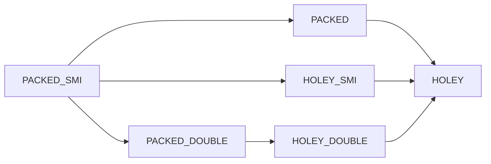

`IsMoreGeneralElementsKindTransition` (`src/objects/elements-kind.cc` に実装) が判定。Smi -> Doubleは要素を全てunboxする必要があるためexpensive。Double -> Objectは逆に各doubleをHeapNumberにboxし直すためexpensive。

ElementsKindはMapに格納されており (Mapのbit field内、6bit)、要素種別の遷移はHidden Class transition (Mapの付け替え) を伴う。プロパティ追加・削除と独立して進む別軸の遷移であることに注意。

Dictionary化のトリガ:

- 配列に巨大な「飛び穴」を作る (`SetLengthWouldNormalize`、`src/objects/js-array.h:64-65`)。
- `Object.defineProperty` で非標準なディスクリプタを付ける。
- `freeze`/`seal` 後にさらに変更要求が来た時など。

DICTIONARY_ELEMENTSではbacking storageが `NumberDictionary` (オープンアドレス法のハッシュテーブル) になり、各エントリがPropertyDetailsも保持する。読み書きはO(1) 平均だが定数倍が大きく、TurboFanやMaglevはインライン化を諦める。

#### 2.6 数値配列の特別扱い (unboxed double)

`[1.5, 2.5, 3.5]` のような配列は `PACKED_DOUBLE_ELEMENTS` になり、`FixedDoubleArray` を直接のbacking storeとする。各要素は8byteのraw IEEE 754 doubleとして並ぶ。HeapNumber boxingコストがゼロになる。

`[1, 2, 3]` は最初 `PACKED_SMI_ELEMENTS` (`FixedArray` だが要素がSmiで詰まる) になり、`[1, 2, 3.5]` のような混合や `[1, 2, undefined]` のようなnon-Smi値挿入で遷移する。

---

### 3. JSObject Layout

#### 3.1 JSReceiver と JSObject

`src/objects/js-objects.h:45` から `class JSReceiver : public HeapObject`。

```cpp
V8_OBJECT class JSReceiver : public HeapObject {
 public:
  ...
  TaggedMember<PropertiesOrHash> properties_or_hash_;  // line 373
};
```

`PropertiesOrHash` の取り得る型 (`src/objects/js-objects.h:49-50`):

```cpp
using PropertiesOrHash = UnionOf<SwissNameDictionary, FixedArrayBase,
                                  PropertyArray, Smi, GlobalDictionary>;
```

5通り (`src/objects/js-objects.h:74-89` の説明):

1. `EmptyFixedArray` (プレースホルダ)
2. `Smi` ― オブジェクトのハッシュコード (プロパティが無いオブジェクト用)
3. `PropertyArray` ― 高速プロパティのout-of-objectスピル領域。length場所にハッシュも詰める
4. `NameDictionary` / `SwissNameDictionary` ― 通常slowプロパティ
5. `GlobalDictionary` ― GlobalObject用

`JSObject` (`src/objects/js-objects.h:380-1029`) はJSReceiverにelements_ を追加:

```cpp
V8_OBJECT class JSObject : public JSReceiver {
 public:
  static constexpr int kMapOffset = offsetof(HeapObject, map_);  // 0
  ...
 public:
  TaggedMember<FixedArrayBase> elements_;  // line 1028
};
inline constexpr int JSObject::kHeaderSize = sizeof(JSObject);
```

`offsetof(JSObject, elements_) == sizeof(JSReceiver)` が `src/objects/js-objects.h:1049` で静的検証される。

レイアウト:

JSObjectヘッダのレイアウト:

| Offset | フィールド | 説明 |
| --- | --- | --- |
| `kMapOffset = 0` | `Map*` | |
| `kPropertiesOrHashOffset = T` | `properties_or_hash_` | |
| `kElementsOffset = 2T` | `elements_` | |
| `kHeaderSize = 3T` | `inobject_property[0]` | Map の inobject_properties_count_ に応じて |
| | `inobject_property[1]` | |
| | ... | |
| `instance_size` | | Map に格納された値 |

#### 3.2 In-Object Properties

In-objectプロパティの最大数は `JSObject::kMaxInObjectProperties` (`src/objects/js-objects.h:1035-1036`):

```cpp
inline constexpr int JSObject::kMaxInObjectProperties =
    (JSObject::kMaxInstanceSize - JSObject::kHeaderSize) >> kTaggedSizeLog2;
```

`kMaxInstanceSize = 255 * kTaggedSize` (`src/objects/js-objects.h:966-968`)。これはMapの `instance_size_in_words_` が `uint8_t` のため。具体例 (64bit, 圧縮ポインタなし): `255*8 - 24 = 2016`、`2016 / 8 = 252` 個。

特定インスタンスのin-object数はMapに `inobject_properties_or_constructor_function_index_` というフィールドで保持される。プロパティ追加でhidden classが遷移し、in-object領域が埋まるとさらにPropertyArray (out-of-object) が確保されて `properties_or_hash_` に保存される。`kFieldsAdded = 3` (`src/objects/js-objects.h:975`) ずつ拡張する。

#### 3.3 Hidden Class Transition と Elements Transition の関係

Mapは1つのオブジェクトの「shape」を1軸ではなく複数軸で表現する:

- **prototype**
- **in-object properties (種類・型・順序)**
- **elements_kind**
- **integrity level (extensible/sealed/frozen)**

これらがどれか変化すると新しいMapに遷移する。プロパティ追加と要素種別変化は同じMapグラフ上の別エッジを通る。Mapはtransition treeを形成し、同じshapeに到達するパスはcanonicalな単一Mapを共有 (transition cache)。

---

### 4. ArrayBuffer / TypedArray

#### 4.1 JSArrayBuffer

`src/objects/js-array-buffer.h:26-239`:

```cpp
V8_OBJECT class JSArrayBuffer : public JSAPIObjectWithEmbedderSlots {
 public:
  TaggedMember<MaybeObject> views_or_detach_key_;
  UnalignedValueMember<uintptr_t> raw_byte_length_;
  UnalignedValueMember<uintptr_t> raw_max_byte_length_;
  UnalignedValueMember<Address>   backing_store_;
  ExternalPointerMember<kArrayBufferExtensionTag> extension_;
  uint32_t bit_field_;
#if TAGGED_SIZE_8_BYTES
  uint32_t optional_padding_;
#endif
};
```

`kMaxByteLength` は `src/objects/js-array-buffer.h:32-38`:

```cpp
#if V8_ENABLE_SANDBOX
  static constexpr size_t kMaxByteLength = kMaxSafeBufferSizeForSandbox;
#elif V8_HOST_ARCH_32_BIT
  static constexpr size_t kMaxByteLength = kMaxInt;  // 2GiB-1
#else
  static constexpr size_t kMaxByteLength = kMaxSafeInteger;  // 2^53-1
#endif
```

`bit_field_` はTorqueで生成されるビットフィールド (`DEFINE_TORQUE_GENERATED_JS_ARRAY_BUFFER_FLAGS`、`src/objects/js-array-buffer.h:69`)。フラグ: `is_external`, `is_detachable`, `was_detached`, `is_shared`, `is_resizable_by_js`, `is_immutable`。

レイアウト (圧縮ポインタ無効、64bit、エンベッダフィールド2個):

| フィールド | サイズ | 説明 |
| --- | --- | --- |
| `Map*` | 8 | |
| `properties_or_hash_` | 8 | |
| `elements_` | 8 | 常に empty_fixed_array |
| `EmbedderField[0..1]` | | CppHeapPointer + EmbedderDataSlot |
| `views_or_detach_key_` | 8 | Smi or WeakArrayList |
| `raw_byte_length_` | 8 | |
| `raw_max_byte_length_` | 8 | Resizable 時のキャップ |
| `backing_store_` | 8 | 生ポインタ、サンドボックス内 |
| `extension_` | 4-8 | ExternalPointerHandle |
| `bit_field_` | 4 | |
| `optional_padding_` | 4 | |

`backing_store_` は `UnalignedValueMember<Address>` で実際のメモリへの直接ポインタ。`extension_` はGCが管理する `ArrayBufferExtension` への参照 (`src/objects/js-array-buffer.h:258-404`)。

#### 4.2 BackingStore

`src/objects/backing-store.h:48-314`:

```cpp
class V8_EXPORT_PRIVATE BackingStore : public BackingStoreBase {
 public:
  ...
 private:
  void* buffer_start_       = nullptr;       // line 271
  std::atomic<size_t> byte_length_;          // line 272
  size_t max_byte_length_;                   // line 274
  size_t byte_capacity_;                     // line 276
  const uint32_t id_;
  ...
  union TypeSpecificData {
    v8::ArrayBuffer::Allocator* v8_api_array_buffer_allocator;
    std::shared_ptr<v8::ArrayBuffer::Allocator> v8_api_array_buffer_allocator_shared;
    SharedWasmMemoryData* shared_wasm_memory_data;
    struct DeleterInfo {
      v8::BackingStore::DeleterCallback callback;
      void* data;
    } deleter;
  } type_specific_data_;
  std::atomic<base::EnumSet<Flag, uint16_t>> flags_;
};
```

`buffer_start_` は実メモリ。flagsは `kIsShared`, `kIsResizableByJs`, `kIsImmutable`, `kIsWasmMemory`, `kHasGuardRegions`, `kEmptyDeleter` 等 (`src/objects/backing-store.h:214-223`)。

`std::shared_ptr<BackingStore>` で参照カウントされ、複数のJSArrayBufferやTypedArrayが同じBackingStoreを共有できる (`postMessage` 等)。

#### 4.3 SharedArrayBuffer / Detach / Resizable

`JSArrayBuffer::Detach` (`src/objects/js-array-buffer.h:139-141`) は `is_detachable` フラグを確認し、`buffer_start_` を0にクリアして `was_detached` を立てる。Detach後はすべての操作がTypeErrorになる。

Resizable ArrayBuffer (Phase 4 of TC39) は `is_resizable_by_js` フラグで識別され、`raw_max_byte_length_` がキャップ。`BackingStore::ResizeInPlace` / `GrowInPlace` (`src/objects/backing-store.h:124-125`) で実メモリを伸縮 (Linuxならmremap相当)。Growable SharedArrayBuffer (GSAB) は共有メモリで成長のみ可能 (縮小不可)。

#### 4.4 JSArrayBufferView, JSTypedArray, JSDataView

`src/objects/js-array-buffer.h:406-458`:

```cpp
V8_OBJECT class JSArrayBufferView : public JSAPIObjectWithEmbedderSlots {
 public:
  TaggedMember<JSArrayBuffer> buffer_;
  uint32_t bit_field_;             // is_length_tracking, is_backed_by_rab 等
#if TAGGED_SIZE_8_BYTES
  uint32_t optional_padding_;
#endif
  UnalignedValueMember<uintptr_t> raw_byte_offset_;
  UnalignedValueMember<uintptr_t> raw_byte_length_;
};
```

JSTypedArray (`src/objects/js-array-buffer.h:460-590`):

```cpp
V8_OBJECT class JSTypedArray : public JSArrayBufferView {
 public:
  ...
  UnalignedValueMember<uintptr_t> raw_length_;        // 要素数
  UnalignedValueMember<Address>   external_pointer_;  // データの先頭ポインタ
  TaggedMember<Object>            base_pointer_;      // on-heap時 ByteArray, off-heap時 Smi::zero()
};
```

レイアウト:

JSTypedArray (例: Uint32Array) レイアウト:

| フィールド | サイズ | 説明 |
| --- | --- | --- |
| `Map* (UINT32_*)` | | |
| `properties_or_hash_` | | |
| `elements_` | | Map で elements_kind を持つので空 |
| `EmbedderField[0..1]` | | |
| `buffer_` | | TaggedMember<JSArrayBuffer> |
| `bit_field_` | 4 bytes | |
| `optional_padding_` | 4 | |
| `raw_byte_offset_` | 8 | |
| `raw_byte_length_` | 8 | |
| `raw_length_` | 8 | 要素数 = byte_length / element_size |
| `external_pointer_` | 8 | off-heap: 直接ポインタ / on-heap: ByteArray の data 位置 + 補正 |
| `base_pointer_` | 8 | off-heap: Smi::zero() / on-heap: ByteArray* |

`DataPtr() = base_pointer + external_pointer` という設計 (`src/objects/js-array-buffer.h:486-525`):

```cpp
// The `DataPtr` is `base_ptr + external_pointer`, and `base_ptr` is nullptr
// for off-heap typed arrays.
static constexpr bool kOffHeapDataPtrEqualsExternalPointer = true;
```

ポインタ圧縮が有効な時は `base_pointer_` をTagged_tとしてロードし、isolate rootとexternal pointer補正値を足すと真の絶対アドレスになるよう設計され、demand loadとoffset addが1命令に融合できる。

##### on-heap vs off-heap

`is_on_heap()` (`src/objects/js-array-buffer-inl.h:523-535`):

```cpp
bool JSTypedArray::is_on_heap() const {
  DisallowGarbageCollection no_gc;
  return base_pointer() != Smi::zero();
}
```

つまり `base_pointer_` が `Smi::zero()` か否かで判定。`kMaxSizeInHeap = 64` bytes (`src/objects/js-array-buffer.h:556-560`):

```cpp
#ifdef V8_TYPED_ARRAY_MAX_SIZE_IN_HEAP
  static constexpr size_t kMaxSizeInHeap = V8_TYPED_ARRAY_MAX_SIZE_IN_HEAP;
#else
  static constexpr size_t kMaxSizeInHeap = 64;
#endif
```

64バイト以下のサイズで生成されたTypedArrayはByteArray (V8ヒープ内のバイト配列) に格納される。それ以上はarray buffer allocatorがmalloc/mmapしたoff-heap領域に置かれる。`SetOffHeapDataPtr` (`src/objects/js-array-buffer-inl.h:510-521`) でon -> off遷移が行われ、`base_pointer_` はrelease-storeで `Smi::zero()` に書き換えられる。

##### TypedArray の種類

`src/objects/elements-kind.h:18-29` の `TYPED_ARRAYS_BASE` マクロが列挙する11種類:

| 型 | 要素サイズ | 備考 |
| --- | --- | --- |
| Uint8 / Int8 | 1 byte | |
| Uint16 / Int16 | 2 bytes | |
| Uint32 / Int32 | 4 bytes | |
| BigUint64 / BigInt64 | 8 bytes | |
| Uint8Clamped | 1 byte | clamping |
| Float32 | 4 bytes | |
| Float64 | 8 bytes | |
| Float16 | 2 bytes | Float16 拡張 |

それぞれ独立したElementsKindを持ち (`UINT8_ELEMENTS` 等)、`ElementsKindToShiftSize` (`src/objects/elements-kind.h:213-267`) で要素byte数のlog2を返す。RAB/GSABバリアントもそれぞれ別ElementsKindを持ち、計24種類。

`kMaxByteLength` の上限から各TypedArrayの `kMaxLength` が型ごとに導かれる (`include/v8-typed-array.h:59-365`)。例: `Uint32Array::kMaxLength = TypedArray::kMaxByteLength / sizeof(uint32_t)`。

`BigInt64Array` / `BigUint64Array` は要素がBigInt (後述)。読み取り時に毎回BigIntをヒープに確保するため通常のInt32Arrayより遅い。

---

### 5. HeapNumber と Mutable Double Field

#### 5.1 HeapNumber

`src/objects/heap-number.h:28-73`:

```cpp
V8_OBJECT class HeapNumber : public PrimitiveHeapObject {
 public:
  inline double value() const;
  inline void set_value(double value);
  inline uint64_t value_as_bits() const;
  inline void set_value_as_bits(uint64_t bits);
  inline bool is_the_hole() const;
  ...
  UnalignedDoubleMember value_;
};
```

レイアウト:

| Offset | フィールド | サイズ | 説明 |
| --- | --- | --- | --- |
| 0 | `Map*` | 4 or 8 | |
| T | `value_` | 8 | double |

Smiに収まらない数値 (32bitを越える整数、非整数double) はHeapNumberにboxingする。RequiredAlignmentはdouble値の8byte境界を保証する。`is_the_hole()` (`src/objects/heap-number-inl.h:26`):

```cpp
return value_as_bits() == kHoleNanInt64;
```

すなわちhole NaNとのbit一致を見る。

#### 5.2 In-object double field

オブジェクトの数値プロパティが一貫してdoubleに収まる場合、`Representation::Double` (`src/objects/property-details.h:115`) を選び、in-object領域にdoubleを直接書く。プロパティが `kMutable` のときはHeapNumber経由でもboxできるが、in-objectなら直接8 byteのdouble領域となる。

`Representation::MightCauseMapDeprecation` (`src/objects/property-details.h:141-155`):

```cpp
if (IsTagged() || IsHeapObject() || IsDouble() || IsWasmValue()) {
  return false;
}
// None to double and smi to double representation changes require
// deprecation, because doubles might require box allocation, see
// CanBeInPlaceChangedTo().
DCHECK(IsNone() || IsSmi());
return true;
```

Smi表現のfieldにdoubleを書こうとするとMapがdeprecateされ、新しいMapが作られる。逆にDouble -> Taggedはin-placeで可能 (`CanBeInPlaceChangedTo`、`src/objects/property-details.h:157-169`)。

Tagged表現のfieldにdoubleを入れるときは新たにHeapNumberを確保して入れる。これが「box allocation」。

Mutable HeapNumberはdoubleをプロパティで書き換え可能にしたい場合に専用Map (heap_number_mapとは別) を使うことがあったが、現代のV8ではRepresentation::Doubleを持つin-object fieldを直接書き換える方式に統一されている。歴史的経緯のため `mutable_heap_number_map` という名前はROOTから消えており、property-details.hの `kDouble` だけが残る。

---

### 6. BigInt

`src/objects/bigint.h:90-191`:

```cpp
V8_OBJECT class BigIntBase : public PrimitiveHeapObject {
 public:
  ...
  using digit_t = uintptr_t;
  static const uint32_t kDigitSize = sizeof(digit_t);
  static const uint32_t kDigitBits = kDigitSize * kBitsPerByte;
  ...
  static const uint32_t kMaxBitsBits = 30;
  static const uint32_t kMaxLength =
      ((1 << kMaxBitsBits) - 1) / (kSystemPointerSize * kBitsPerByte);
  static const uint32_t kMaxBits = kMaxLength * kSystemPointerSize * kBitsPerByte;
  ...
  using SignBits   = base::BitField<bool, 0, 1>;
  using PaddingBits = SignBits::Next<uint32_t, kPaddingBits>;
  using LengthBits = PaddingBits::Next<uint32_t, kLengthFieldBits>;

  std::atomic_uint32_t bitfield_;
#ifdef BIGINT_NEEDS_PADDING
  char padding_[4];
#endif
  FLEXIBLE_ARRAY_MEMBER(UnalignedValueMember<digit_t>, raw_digits);
};
```

レイアウト:

BigIntレイアウト:

| Offset | フィールド | サイズ | 説明 |
| --- | --- | --- | --- |
| 0 | `Map*` | T | |
| T | `bitfield_` | 4 | sign:1 + padding + length:25 等 |
| T+4 | `padding_` | 4 | 64bit 非圧縮時のみ |
| | `digit[0]` | 8 | uintptr_t |
| | `digit[1]` | 8 | |
| | ... | | |

`bitfield_` はsign (符号) とlength (digit個数) を1つの32bit atomicに詰め込む (`src/objects/bigint.h:121-126`)。`kMaxBits ~ 10億 bit` (約125MBのメモリ消費) で打ち切る。`kMaxLength` は64bit環境で1 << 27 / 64 ≈ 16M digits = 1G bits.

`SizeFor` (`src/objects/bigint.h:263-265`):

```cpp
static inline uint32_t SizeFor(uint32_t length) {
  return sizeof(BigInt) + length * kDigitSize;
}
```

`digit_t = uintptr_t` なので64bitプラットフォームでは各digitが8 byte unsignedで、リトルエンディアン的に低位 → 高位の順に並ぶ (絶対値表現)。符号は `bitfield_` のbit 0。

Mutable / Immutableを区別する `MutableBigInt` クラスが内部に存在し (`src/objects/bigint.cc`)、`FreshlyAllocatedBigInt` (`src/objects/bigint.h:172-191`) はnewly allocatedで書き込み可能な中間状態。完成後 `MakeImmutable` でBigIntにキャスト変換される。

`BigInt::Hash` (`src/objects/bigint.h:227-230`):

```cpp
return ComputeUnseededHash(length() | (sign() ? (1 << 30) : 0)) ^
       ComputeLongHash(static_cast<uint64_t>(is_zero() ? 0 : digit(0)));
```

lengthと最下位digitのみからハッシュを計算するため、衝突を許容する近似値。

---

### 7. JSReceiver, JSObject, JSFunction

#### 7.1 JSFunction

`src/objects/js-function.h:130-...`:

```cpp
V8_OBJECT class JSFunction : public JSFunctionOrBoundFunctionOrWrappedFunction {
  ...
 public:
  TaggedMember<SharedFunctionInfo> shared_function_info_;  // line 509
  TaggedMember<Context>            context_;               // line 510
  TaggedMember<FeedbackCell>       feedback_cell_;         // line 511
};
```

`JSFunctionWithPrototype` (`src/objects/js-function.h:536-552`) はさらに `prototype_or_initial_map_` を追加する。

JSFunctionレイアウト:

| Offset | フィールド | 説明 |
| --- | --- | --- |
| 0 | `Map*` | |
| T | `properties_or_hash_` | |
| 2T | `elements_` | |
| 3T | `shared_function_info_` | SharedFunctionInfo |
| 4T | `context_` | NativeContext or FunctionContext |
| 5T | `feedback_cell_` | FeedbackCell (内部に FeedbackVector) |
| 6T | `prototype_or_initial_map_` | kPrototype 系のみ |

`SharedFunctionInfo` (SFI) は同じ関数定義から作られる全クロージャ間で共有されるメタデータ (バイトコード、ソース位置、コードキャッシュ等)。`FeedbackVector` は型フィードバック用のスロット配列で、TurboFan/Maglevの入力になる。`FeedbackCell` はFeedbackVectorを1段かぶせて参照カウント・初期化遅延等を扱う。

#### 7.2 Closures と Context

`Context` は変数バインディング配列 (FixedArrayの親戚)。`context_` fieldを辿ることでスコープチェーンを表現する。Closuresは同じSFIを参照する複数のJSFunctionが独立な `context_` を持つことで実現される。

---

### 8. Hash の格納

#### 8.1 String hash field

前述 (1.8節)。`Name::raw_hash_field_` (`src/objects/name.h:304`) の上位30bitに格納。`String::ComputeAndSetRawHash` (`src/objects/string.cc:1911-1928`) で初回計算されatomically storeされる。`HasHashCode` 判定は `raw_hash_field_ & kHashNotComputedMask == 0` で行う (`src/objects/name.h:176`)。

#### 8.2 JSObject identity hash

JSObjectは `properties_or_hash_` (`src/objects/js-objects.h:373`) をhash兼用にする:

- プロパティが無くidentity hashだけ要る場合: Smiとして直接格納。
- PropertyArrayを持つ場合: PropertyArrayの `length_and_hash_` フィールド (`src/objects/property-array.h:82`) にlengthとhashを共存させる。`kLengthFieldSize = 10` (`src/objects/property-array.h:67`)、`HashField = BitField<int, 10, kSmiValueSize - 10 - 1>` (`src/objects/property-array.h:70-71`)。
- NameDictionaryを持つ場合: 辞書の専用エントリに格納。

`JSReceiver::kHashMask = PropertyArray::HashField::kMask` (`src/objects/js-objects.h:363`)。`GetOrCreateIdentityHash` (`src/objects/js-objects.h:345`) で遅延生成される。

#### 8.3 BigInt の hash

前述 (6節)、lengthとdigit(0) からの近似計算で32bitハッシュ。

---

### 9. まとめ ― 状態遷移と最適化の俯瞰

ここまで見たようにV8は「同じJS値でも複数の物理表現がありえる」という設計を一貫して採用している。代表的な遷移グラフ:

**String**

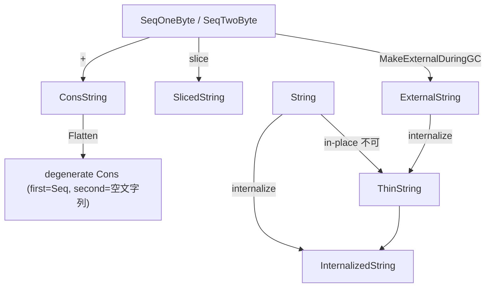

**Array (ElementsKind)**

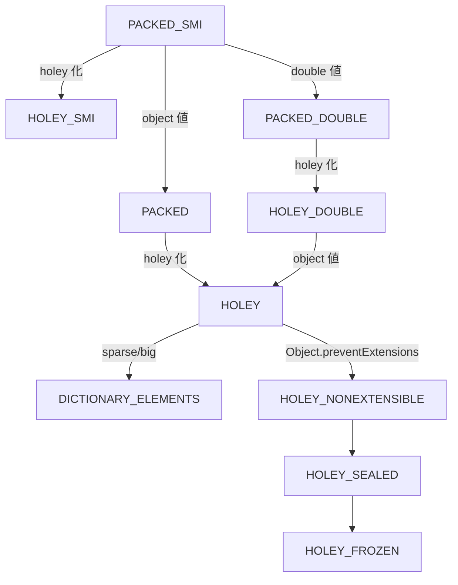

**TypedArray**

```mermaid
graph TB
  A["new Uint8Array(<= 8 elem)"] --> B["on-heap (ByteArray backing, base_pointer != 0)"]
  C["new Uint8Array(> 8 elem)"] --> D["off-heap (BackingStore malloc, base_pointer = Smi::zero())"]
  E["TypedArray.GetBuffer()"] --> F["on-heap → off-heap への昇格 (一度だけ起きる)"]
  G["ArrayBuffer.transfer()"] --> H["旧 buffer detach、新 buffer 作成"]
```

**Number**

```mermaid
graph TB
  Smi["Smi (32bit fit)"] -- overflow --> HN["HeapNumber (boxed double)"]
  RSmi["Object field Representation::Smi"] -- double 代入 --> Dep["Map deprecate → Representation::Double (in-place double)"]
  RSmi -- HeapObject 代入 --> Tagged["Representation::Tagged"]
```

これらの「複数表現」と「遷移」を直接V8内部から読み解くと、ベンチマーク結果やJITの挙動が予測しやすくなる。例えば配列を `[1,2,3]` で初期化したあと `arr[100] = 1` のように飛び穴を作ると `PACKED_SMI` から `HOLEY_SMI` に落ち、さらに大きく飛ばすと `DICTIONARY_ELEMENTS` になり性能が桁違いに低下する、というのはElementsKindの遷移を理解していれば自然に予測できる。同様に `s += "x"` を多用するとConsStringが深くなり最終的にFlattenで巨大コピーが走ること、JSON.parseのキーが内部でinternalizeされてThinStringになることなど、ソースに直接根拠を辿れるようになる。

参照したファイルは以下の通り (主要なもの)。本書の各記述に対応する行番号を本文中で明示している。

| パス | 用途 |
|---|---|
| `/home/user/v8/src/objects/string.h` | String, SeqString, ConsString, SlicedString, ThinString, ExternalString 定義 |
| `/home/user/v8/src/objects/string-inl.h` | Flatten, SlowFlatten, SizeFor 等 |
| `/home/user/v8/src/objects/string.cc` | MakeThin, MakeExternalDuringGC, ConsString::Get, SlowEquals |
| `/home/user/v8/src/objects/name.h` | raw_hash_field_, HashFieldType, ArrayIndex 関連 |
| `/home/user/v8/src/objects/instance-type.h` | StringRepresentationTag, kInternalizedTag, kSharedStringTag |
| `/home/user/v8/src/strings/string-hasher.h`, `string-hasher-inl.h` | StringHasher, kZeroHash, GetTrivialHash |
| `/home/user/v8/src/objects/fixed-array.h` | FixedArray, FixedDoubleArray, TaggedArrayBase, PrimitiveArrayBase |
| `/home/user/v8/src/objects/elements-kind.h` | ElementsKind 列挙、判定マクロ |
| `/home/user/v8/src/objects/elements.h`, `elements.cc` | ElementsAccessor、transition の実装 |
| `/home/user/v8/src/objects/js-array.h` | JSArray, kMaxFastArrayLength |
| `/home/user/v8/src/objects/js-objects.h` | JSReceiver, JSObject, PropertiesOrHash, kMaxInObjectProperties |
| `/home/user/v8/src/objects/js-array-buffer.h`, `js-array-buffer-inl.h` | JSArrayBuffer, JSArrayBufferView, JSTypedArray, is_on_heap |
| `/home/user/v8/src/objects/backing-store.h` | BackingStore, ResizeInPlace, Flag 群 |
| `/home/user/v8/src/objects/heap-number.h`, `heap-number-inl.h` | HeapNumber, is_the_hole |
| `/home/user/v8/src/objects/bigint.h` | BigIntBase, kMaxLength, digit 配列 |
| `/home/user/v8/src/objects/js-function.h` | JSFunction, shared_function_info, context, feedback_cell |
| `/home/user/v8/src/objects/property-details.h` | Representation (None/Smi/Double/HeapObject/Tagged) |
| `/home/user/v8/src/objects/property-array.h` | PropertyArray, length_and_hash_ |
| `/home/user/v8/include/v8-internal.h` | kSmiTag, kHeapObjectTag, SmiTagging |
| `/home/user/v8/include/v8-primitive.h` | String::kMaxLength |
| `/home/user/v8/include/v8-typed-array.h` | 各 TypedArray の kMaxLength |
| `/home/user/v8/src/common/globals.h` | kHoleNanInt64, kTaggedSize, kSystemPointerSize 等 |

---

## 付録 — 全体の参照ファイル索引

本書で言及したV8ソースの主要ファイル一覧 (絶対パス)。

### オブジェクト表現関連

- `/home/user/v8/include/v8-internal.h` — kSmiTag, kHeapObjectTag, kPtrComprCage, kSandbox等の主要定数
- `/home/user/v8/include/v8-primitive.h` — String::kMaxLength
- `/home/user/v8/include/v8-typed-array.h` — 各TypedArrayのkMaxLength
- `/home/user/v8/include/v8-isolate.h` — Isolate::CreateParams
- `/home/user/v8/src/common/globals.h` — kTaggedSize, AllocationSpace, kHoleNanInt64, GarbageCollectionReason
- `/home/user/v8/src/objects/tagged.h`, `tagged-impl.h` — Tagged<T>, TaggedImpl, MakeWeak/MakeStrong
- `/home/user/v8/src/objects/smi.h` — Smiクラス
- `/home/user/v8/src/objects/heap-object.h` — HeapObject基底クラス
- `/home/user/v8/src/objects/map.h`, `map-inl.h`, `map.cc` — Map (Hidden Class)
- `/home/user/v8/src/objects/map-word.h`, `map-word-inl.h` — Forwarding pointer
- `/home/user/v8/src/objects/descriptor-array.h` — DescriptorArray
- `/home/user/v8/src/objects/transitions.h`, `transitions.cc` — TransitionArray / TransitionsAccessor
- `/home/user/v8/src/objects/property-array.h` — PropertyArray
- `/home/user/v8/src/objects/property-details.h` — PropertyDetails、Representation
- `/home/user/v8/src/objects/dictionary.h` — NameDictionary
- `/home/user/v8/src/objects/swiss-name-dictionary.h` — SwissNameDictionary
- `/home/user/v8/src/objects/heap-number.h` — HeapNumber
- `/home/user/v8/src/objects/oddball.h` — Null/Undefined/Boolean
- `/home/user/v8/src/objects/instance-type.h` — InstanceType定義
- `/home/user/v8/src/common/ptr-compr.h`, `ptr-compr-inl.h` — Pointer Compression
- `/home/user/v8/src/objects/allocation-site.h` — AllocationSite/Boilerplate

### Heap 関連

- `/home/user/v8/src/heap/heap.h`, `heap.cc` — Heap全体
- `/home/user/v8/src/heap/heap-layout.h`
- `/home/user/v8/src/heap/heap-allocator.h`, `heap-allocator-inl.h`, `heap-allocator.cc`
- `/home/user/v8/src/heap/main-allocator.h`
- `/home/user/v8/src/heap/linear-allocation-area.h` — LAB
- `/home/user/v8/src/heap/memory-allocator.h`
- `/home/user/v8/src/heap/memory-chunk.h`, `memory-chunk-layout.h`, `memory-chunk-constants.h`
- `/home/user/v8/src/heap/base-page.h`
- `/home/user/v8/src/heap/mutable-page.h`
- `/home/user/v8/src/heap/normal-page.h`
- `/home/user/v8/src/heap/large-page.h`, `large-spaces.h`, `large-spaces.cc`
- `/home/user/v8/src/heap/new-spaces.h`, `new-spaces-inl.h`
- `/home/user/v8/src/heap/paged-spaces.h`
- `/home/user/v8/src/heap/read-only-spaces.h`, `read-only-heap.h`
- `/home/user/v8/src/heap/spaces.h`
- `/home/user/v8/src/heap/free-list.h`, `free-list.cc`
- `/home/user/v8/src/heap/marking.h`
- `/home/user/v8/src/heap/slot-set.h`, `base/basic-slot-set.h`
- `/home/user/v8/src/heap/code-range.h`
- `/home/user/v8/src/heap/trusted-range.h`
- `/home/user/v8/src/heap/allocation-result.h`
- `/home/user/v8/src/utils/allocation.h` — VirtualMemoryCage
- `/home/user/v8/src/base/build_config.h` — kPageSizeBits

### GC 関連

- `/home/user/v8/src/heap/scavenger.h`, `scavenger.cc`
- `/home/user/v8/src/heap/mark-compact.h`, `mark-compact.cc`, `mark-compact-inl.h`
- `/home/user/v8/src/heap/minor-mark-sweep.h`, `minor-mark-sweep.cc`
- `/home/user/v8/src/heap/marking-state.h`, `marking-state-inl.h`
- `/home/user/v8/src/heap/marking-inl.h`, `marking-visitor.h`, `marking-visitor-inl.h`
- `/home/user/v8/src/heap/marking-worklist.h`
- `/home/user/v8/src/heap/incremental-marking.h`, `incremental-marking.cc`
- `/home/user/v8/src/heap/concurrent-marking.h`, `concurrent-marking.cc`
- `/home/user/v8/src/heap/marking-barrier.h`, `marking-barrier-inl.h`, `marking-barrier.cc`
- `/home/user/v8/src/heap/heap-write-barrier.h`, `heap-write-barrier-inl.h`, `heap-write-barrier.cc`
- `/home/user/v8/src/heap/WRITE_BARRIER.md`
- `/home/user/v8/src/heap/remembered-set.h`
- `/home/user/v8/src/heap/sweeper.h`, `sweeper.cc`
- `/home/user/v8/src/heap/evacuation-allocator.h`, `evacuation-verifier.h`
- `/home/user/v8/src/heap/conservative-stack-visitor.h`, `conservative-stack-visitor-inl.h`
- `/home/user/v8/src/heap/memory-reducer.h`
- `/home/user/v8/src/heap/heap-controller.h`
- `/home/user/v8/src/heap/cppgc-js/cpp-heap.h`
- `/home/user/v8/src/heap/cppgc-js/cross-heap-remembered-set.h`
- `/home/user/v8/src/heap/cppgc-js/unified-heap-marking-state.h`
- `/home/user/v8/src/heap/gc-tracer.h`

### IC / Compiler / Deoptimizer 関連

- `/home/user/v8/src/ic/ic.h`, `ic.cc`
- `/home/user/v8/src/ic/handler-configuration.h`
- `/home/user/v8/src/ic/stub-cache.h`
- `/home/user/v8/src/objects/feedback-vector.h`, `feedback-vector.cc`
- `/home/user/v8/src/objects/code.h`, `code-kind.h`
- `/home/user/v8/src/objects/bytecode-array.h`
- `/home/user/v8/src/objects/deoptimization-data.h`
- `/home/user/v8/src/interpreter/interpreter.h`
- `/home/user/v8/src/baseline/baseline-compiler.h`
- `/home/user/v8/src/maglev/maglev-compiler.h`, `maglev-compilation-info.h`
- `/home/user/v8/src/compiler/pipeline.cc` (TurboFan)
- `/home/user/v8/src/deoptimizer/deoptimizer.h`, `translated-state.h`, `materialized-object-store.h`
- `/home/user/v8/src/execution/tiering-manager.cc`
- `/home/user/v8/src/execution/isolate.h`

### Sandbox 関連

- `/home/user/v8/src/sandbox/sandbox.h`, `sandbox.cc`
- `/home/user/v8/src/sandbox/external-pointer-table.h`
- `/home/user/v8/src/sandbox/external-entity-table.h`
- `/home/user/v8/src/sandbox/trusted-pointer-table.h`
- `/home/user/v8/src/sandbox/code-pointer-table.h`
- `/home/user/v8/src/sandbox/js-dispatch-table.h`
- `/home/user/v8/src/sandbox/indirect-pointer-tag.h`
- `/home/user/v8/src/sandbox/compactible-external-entity-table.h`
- `/home/user/v8/src/sandbox/sandboxed-pointer.h`
- `/home/user/v8/src/sandbox/README.md`
- `/home/user/v8/src/objects/trusted-pointer.h`

### Handle / Snapshot 関連

- `/home/user/v8/src/handles/handles.h`
- `/home/user/v8/src/handles/global-handles.h`
- `/home/user/v8/src/handles/local-handles.h`
- `/home/user/v8/src/handles/persistent-handles.h`
- `/home/user/v8/src/handles/traced-handles.h`
- `/home/user/v8/src/snapshot/embedded/embedded-data.h`
- `/home/user/v8/src/codegen/compiler.h`
- `/home/user/v8/src/codegen/compilation-cache.h`

### String / Array 関連

- `/home/user/v8/src/objects/string.h`, `string-inl.h`, `string.cc`
- `/home/user/v8/src/objects/name.h`
- `/home/user/v8/src/strings/string-hasher.h`, `string-hasher-inl.h`
- `/home/user/v8/src/objects/fixed-array.h`
- `/home/user/v8/src/objects/elements-kind.h`
- `/home/user/v8/src/objects/elements.h`, `elements.cc`
- `/home/user/v8/src/objects/js-array.h`
- `/home/user/v8/src/objects/js-objects.h`
- `/home/user/v8/src/objects/js-array-buffer.h`, `js-array-buffer-inl.h`
- `/home/user/v8/src/objects/backing-store.h`
- `/home/user/v8/src/objects/bigint.h`
- `/home/user/v8/src/objects/js-function.h`

### Flags

- `/home/user/v8/src/flags/flag-definitions.h` — `--invocation-count-for-*`、`--max-valid-polymorphic-map-count` 等

---

## 結語

V8のメモリ管理は、JavaScriptの動的性をハードウェアの効率に翻訳する高度なエンジニアリングの結晶です。以下が本書を貫く設計原則の要約です。

第一に、**型情報をフィールドに別途持たない** ことです。Tagged PointerのLSB 1ビットでSmiとHeapObjectを区別し、HeapObjectの先頭ワードにMapポインタを置くことで、すべての型情報を「ポインタ自身」と「ヒープ上のオブジェクト先頭」に圧縮しています。

第二に、**同じ shape を Map で共有する** ことです。Hidden Class (Map) とDescriptorArray、TransitionArray、PropertyArrayの多層構造により、動的にプロパティが追加されるオブジェクトでも同じパスを辿ったものは同じMapに収束し、Inline Cacheがモノモーフィックに保たれます。

第三に、**世代別仮説に基づく階層的な GC** です。Young (ScavengerまたはMinor MS)、Old (Mark-Compact)、Large Object、Trusted、Code、Read-Only、Sharedという7層以上の空間と、それを支える7種類のRemembered Set、Write Barrierの4段構成、Incremental/Concurrent/Parallelの三方向の並行化、これらすべてが「JS実行時間の97% をmutatorに渡す」(`kTargetMutatorUtilization = 0.97`) という目標のもとに調律されています。

第四に、**Inline Cache と階層 JIT** です。UNINITIALIZED → MONOMORPHIC → POLYMORPHIC (上限4) → MEGAMORPHICというIC状態と、Ignition (バイトコード) → Sparkplug (baseline JIT) → Maglev (mid JIT) → TurboFan (top JIT) の階層、そして失敗時のDeoptimization機構が、コードのホット度に応じて適切な投資をするadaptive optimizationを実現しています。

第五に、**アドレス空間を信頼境界として使う Sandbox** です。1 TBの仮想アドレスを予約しその前後32 GBをguard regionとした「実用的にcorrupt不能なアドレス空間」を作り、External Pointer Table、Trusted Pointer Table、Code Pointer Table、JSDispatchTableという4種のテーブルで「sandbox外への正当な参照」のみを認める設計は、現代のmemory safety強化の到達点と言えます。

これらの仕組みすべてが、Tagged PointerとMapという共通言語の上に積み重なっており、本書のコード参照を起点に各章の細部に降りていけば、JavaScriptエンジンが「言語の柔軟性」と「C++ に匹敵する実行速度」を両立できている理由を、抽象論ではなく具体的な実装としてつかめるはずです。

# 第 3 章への導入

**第 2 章までで学んだこと** V8ヒープ上のオブジェクトがどう表現され、どう確保され、どう回収されるかを完全に理解しました。ヒープに置く実体の仕組みが分かったので、次は「その実体を操作する組み込み関数 (ビルトイン) はどう書かれているか」を学びます。

**この章で学ぶこと**

- TorqueというDSLを作った動機とV8の歴史的な経緯
- 言語仕様 (型システム、宣言、制御フロー、ジェネリクス、constexpr、transient型)
- V8オブジェクトモデルのTorque表現 (Tagged / Class / Map / Sandbox)
- Torqueコンパイラの内部 (Earley parser、AST、TypeOracle、CFG、Instructions)
- CodeStubAssembler / TurboShaft Assemblerへの統合
- GN / mksnapshot / embedded blobまでのビルドパイプライン
- 高速化テクニック (FastJSArrayWitness、Protector、Bailout設計)
- Array.prototype.forEach / map / Promise.then / Iterator.fromの実装パターン

第4章 (配列の実装) と第5章 (flatケーススタディ) ではTorqueで書かれたコードを大量に読みます。この章でその読み方を身に付けておくと、後続章の理解度が一気に上がります。

:::message
**なぜ V8 専用 DSL が必要なのか** C++ で書くと呼び出し境界 (JS → C++) のオーバーヘッドが大きく、プラットフォーム固有アセンブリで書くと保守コストが急増します。CodeStubAssemblerは型安全性が弱く、Map一致チェックの抜けが過去にCVEにつながりました。Torqueはこれらすべての問題を「ECMAScript仕様に近い見た目で書けて、CSA並みに速く、型安全」という一段高い言語で解決したものです。
:::

```mermaid
graph TB
    Tq[".tq ファイル<br/>Torque DSL ソース"]
    Compiler["Torque Compiler<br/>Earley → AST → CFG"]
    Gen["CSA / TSA 生成<br/>*-tq-csa.cc 出力"]
    CSA["CodeStubAssembler (C++ API)<br/>TurboFan / TurboShaft グラフを構築"]
    Machine["機械語 (snapshot.bin に焼き込み)<br/>embedded blob として V8 バイナリに同梱"]

    Tq --> Compiler --> Gen --> CSA --> Machine
```

*図 B3-1 / Torque のコンパイルパイプライン*

---

# 第 3 章 / Torque ビルトイン言語

## V8 Torque 完全解説

本書はV8のドメイン特化言語 (DSL) であるTorqueについて、登壇資料の参考文献として利用できる粒度の解説をまとめたものです。文中の引用は本リポジトリの `/home/user/v8` を一次資料とし、ファイルパスと行番号を併記します。

本書のスコープは以下の通りです。

V8がなぜTorqueという新しい言語を必要としたかという背景にはじまり、Torqueの構文の細部、型システム、宣言の種類、制御フロー、ラベル、ジェネリクス、constexpr、transient型、アノテーションといった言語仕様を概観します。続いてV8のオブジェクトモデルであるTagged pointer表現、HeapObject、Map、Instance Type、Elements Kind、Reference / Slice、Pointer Compression、Sandbox、Write BarrierといったメモリレイヤーをTorqueがどのように扱っているかを解説します。さらにTorqueコンパイラ自身の内部実装としてパース、AST、二段階宣言、型推論、ImplementationVisitor、中間表現 (Instruction)、CFG、コード生成 (CSAGenerator / CCGenerator / TSAGenerator) を取り上げ、それらがtorque-generatedディレクトリ配下にどのようなC++ ソースを吐くかを示します。最後にCodeStubAssemblerおよびTurboShaft Assemblerへの接続、`BUILD.gn` のビルド統合とmksnapshotを経てembedded blobに焼き込まれるまでの流れ、Torqueが実現する高速化のテクニック、そして `Array.prototype.forEach` や `Array.prototype.map`、`Promise.prototype.then`、`Iterator.from` などの典型実装をコード片を引きながら紹介します。

---

### 目次

第1章Torqueとは何か
第2章全体アーキテクチャとコンパイルパイプライン
第3章言語仕様 (構文要素の全網羅)
第4章V8オブジェクトモデルとTorque (Taggedポインタ、Map、Sandbox)
第5章Torqueコンパイラの内部 (Earley、AST、TypeOracle、CFG)
第6章CodeStubAssemblerとTurboShaft Assemblerへの統合
第7章ビルドシステム (GN、Bazel、mksnapshot、embedded blob)
第8章高速化テクニック
第9章代表的ビルトインの実装パターン
第10章デバッグツールと開発体験
第11章テスト戦略
第12章まとめと発展トピック
付録A参考リンクとファイル一覧
付録B用語集

---

### 第 1 章 Torque とは何か

TorqueはV8のビルトインを記述するためにGoogleが開発した型付きDSLです。最も簡潔に言えば、ECMAScript仕様 (ECMA-262) の擬似コードに極めて近い見た目で書ける一方、コンパイル後は `CodeStubAssembler` (CSA) を介してTurboFan / Maglev / Turboshaftが知るIRに落とし込まれ、最終的に最適化されたネイティブ機械語としてV8のスナップショットに焼き込まれる、というハイブリッドな立ち位置にあります。

公式ドキュメント `docs/torque/user-manual.md` の冒頭はその思想を次のように要約しています。

```text
V8 Torque is a language that allows developers contributing to the V8 project to express
changes in the VM by focusing on the _intent_ of their changes to the VM, rather than
preoccupying themselves with unrelated implementation details. The language was designed
to be simple enough to make it easy to directly translate the ECMAScript specification
into an implementation in V8, but powerful enough to express the low-level V8 optimization
tricks in a robust way, like creating fast-paths based on tests for specific object-shapes.
```

つまりTorqueの二大価値は次のとおりです。

第一に、ECMAScript仕様のアルゴリズムステップを直接コードに転写できるため、仕様の番号付き手順 (`1. Let O be ? ToObject(this value).` など) をコメントとともに対応する一行のコードへ落とせます。これは「実装の正しさ」を仕様参照可能な形で表現できるという意味で、レビューと監査の生産性を大幅に高めます。

第二に、`CodeStubAssembler` の表現力を維持したまま、型システムと構造化された制御フローで安全に書けます。`CodeStubAssembler` を直接手書きしていた時代に頻発した、未初期化スロット、誤ったキャスト、書き込みバリアの欠落、prototype汚染チェックの抜けといった脆弱性 (実際に `crbug.com/775888` や `crbug.com/785804` のようなCVEにつながった事例がある) が、Torqueのコンパイラによって機械的に検出できるようになりました。

このため、Array、TypedArray、String、Promise、Iterator、Proxy、Object、Number、Regexp、Map、Set、WeakRef、Temporal、Atomics、SharedArrayBuffer、Generator、AsyncFunction、Disposable、ShadowRealmといったECMA-262の主要オブジェクトの大半は、すでにTorqueで記述されています。本リポジトリ内には248個の `.tq` ファイル、合計約45,000行のTorqueコードが存在します。Torqueコンパイラ自身は `src/torque/` 配下に約26,000行のC++ で実装されており、これはImplementationVisitor (4,450行)、torque-parser (2,973行)、CSA generator (1,085行)、TSA generator (1,808行)、CC generator (528行) などから構成されます。

Torqueのソースは `src/builtins/*.tq` (約157ファイル) と `src/objects/*.tq` (約86ファイル) に大別されます。前者はビルトイン関数の実装、後者はV8ヒープ上のオブジェクトクラスの宣言を担います。テストとサンプルは `test/torque/test-torque.tq` (1,213行)、ユニットテストは `test/unittests/torque/` および `test/cctest/torque/` 配下にあります。

#### 1.1 Torque 登場以前の選択肢

`docs/torque/architecture.md:9-14` にはTorque以前のビルトイン記述手段が次のように整理されています。

C++ で実装するとビルトインの呼び出し境界 (JSからC++) でレジスタの退避、引数の整列、Smiのuntag、SmiHandleの生成、`v8::Context` のセットアップなどの定型コストが発生します。これはforループ中で何度も呼ばれる組み込み関数 (`Array.prototype.map` のコールバック呼び出しの直前など) には致命的です。

プラットフォーム固有アセンブリで実装するアプローチは最速ですが、x64 / arm64 / ia32 / mips / riscv / loong64 / s390 / ppcなど多数のターゲットを保守しなければならず、ECMAScriptの細かい仕様変更 (実数の四捨五入処理、エッジケースのNaN取り扱い、Symbol@@iterator経由の挙動など) に追従するコストが急騰します。

中間的なアプローチである `CodeStubAssembler` は、プラットフォーム抽象化された「型のないアセンブラ」をC++ APIで叩く形態です。最終的にTurboFanのグラフを構築するため、後段の最適化が効くという利点はありますが、ノードを `TNode<Smi>` などのテンプレートで型付けする以外には言語側の安全性ネットがほぼなく、人手のレビューに頼っていました。

Torqueはこの最後のアプローチの上に薄いが本気の言語を載せたものです。`docs/torque/architecture.md:7-15` の表現を借りれば、TorqueはCSAやTSAに「コンパイル」される高水準・強型付け言語です。型安全性によって `CodeStubAssembler` のフットガンを排除し、制御フローを構造化することで生成CSAコードの品質を保証します。

#### 1.2 ハロー Torque

`docs/torque/user-manual.md:17-47` に「Hello World」が示されています。`test/torque/test-torque.tq` 末尾に次のマクロを追加し、

```torque
@export
macro PrintHelloWorld(): void {
  Print('Hello world!');
}
```

それを `test/cctest/torque/test-torque.cc` から呼ぶ短いC++ をビルドすると、

```cpp
TEST(HelloWorld) {
  Isolate* isolate(CcTest::InitIsolateOnce());
  CodeAssemblerTester asm_tester(isolate, JSParameterCount(0));
  TestTorqueAssembler m(asm_tester.state());
  {
    m.PrintHelloWorld();
    m.Return(m.UndefinedConstant());
  }
  FunctionTester ft(asm_tester.GenerateCode(), 0);
  ft.Call();
}
```

`out/x64.debug/cctest test-torque/HelloWorld` 実行で `Hello world!` が出力されます。

ここで `@export` はTorqueマクロをC++ から呼べる `TorqueGeneratedExportedMacrosAssembler` のpublicメンバとして公開するアノテーションで、`Print` はCSAの `CodeStubAssembler::Print` への外部宣言を経由した呼び出しです。

---

### 第 2 章 全体アーキテクチャとコンパイルパイプライン

Torqueは「コンパイラ単体で機械語まで吐く」言語ではありません。実態はCSA / CC / TSAという三系統のコード生成バックエンドを持つC++ コード生成器であり、生成されたC++ コードを通常のC++ ツールチェインでビルドした上で、`mksnapshot` 実行時にビルトインを実機械語へ落とし、それをsnapshot blobとして最終V8バイナリに埋め込みます。

#### 2.1 コンパイルパイプライン全体図

`docs/torque/architecture.md:16-41` および `src/torque/torque-compiler.cc:53-127` (`CompileCurrentAst`) を一次資料として、パイプラインは以下の段階を踏みます。

```mermaid
flowchart TB
  TQ[".tq files"]
  S1["[1] Lexing / Earley Parsing<br/>(torque-parser.cc, earley-parser.cc)"]
  S2["[2] Predeclaration<br/>(declaration-visitor.h, type-oracle.cc)"]
  S3["[3] Predeclaration Resolution<br/>(Type 名前 → Type オブジェクト)"]
  S4["[4] Declaration Visit<br/>(declaration-visitor.cc)"]
  S5["[5] TypeOracle::FinalizeAggregateTypes<br/>(クラスフィールドの offset 確定)"]
  S6["[6] ImplementationVisitor::VisitAllDeclarables<br/>各 macro/builtin の body を VisitStatement / VisitExpression<br/>CfgAssembler を通じて Instruction 列を CFG に Emit"]
  S7["[7] Code Generation"]
  CSA["CSAGenerator (csa-generator.cc)<br/>→ *-tq-csa.cc, *-tq-csa.h"]
  CC["CCGenerator (cc-generator.cc)<br/>→ *-tq.cc, *-tq.inc, *-tq-inl.inc"]
  TSA["TSAGenerator (tsa-generator.cc)<br/>→ *-tq-tsa.cc, *-tq-tsa.h (実験的)"]
  S8["[8] グローバル一括生成<br/>instance-types.h / bit-fields.h / builtin-definitions.h<br/>interface-descriptors.inc / class-forward-declarations.h<br/>class-debug-readers.{h,cc} / csa-types.h / enum-verifiers.cc<br/>exported-macros-assembler.{h,cc} / debug-macros.{h,cc}"]

  TQ --> S1
  S1 -->|"AST (ast.h)"| S2
  S2 --> S3
  S3 --> S4
  S4 -->|"Macro/Builtin/Runtime/Intrinsic/Const objects"| S5
  S5 --> S6
  S6 --> S7
  S7 --> CSA
  S7 --> CC
  S7 --> TSA
  S7 --> S8
```

#### 2.2 CompileCurrentAst の実コード

`src/torque/torque-compiler.cc:53-127` の `CompileCurrentAst` 関数全体が、Torqueパイプラインの縮約図そのものです。

```cpp
void CompileCurrentAst(TorqueCompilerOptions options) {
  std::string output_directory = options.output_directory;
  GlobalContext::Scope global_context(std::move(CurrentAst::Get()));
  // ... フラグ反映 ...
  TypeOracle::Scope type_oracle;
  CurrentScope::Scope current_namespace(GlobalContext::GetDefaultNamespace());

  // Two-step process of predeclaration + resolution allows to resolve type
  // declarations independent of the order they are given.
  PredeclarationVisitor::Predeclare(GlobalContext::ast());
  PredeclarationVisitor::ResolvePredeclarations();

  // Process other declarations.
  DeclarationVisitor::Visit(GlobalContext::ast());

  // A class types' fields are resolved here, which allows two class fields to
  // mutually refer to each others.
  TypeOracle::FinalizeAggregateTypes();

  if (options.output_tsa) {
#ifdef V8_ENABLE_EXPERIMENTAL_TQ_TO_TSA
    GenerateTSA(*GlobalContext::ast(), output_directory);
    return;
#else
    UNREACHABLE();
#endif
  }

  ImplementationVisitor implementation_visitor;
  implementation_visitor.SetDryRun(output_directory.empty());

  implementation_visitor.GenerateInstanceTypes(output_directory);
  implementation_visitor.BeginGeneratedFiles();
  implementation_visitor.BeginDebugMacrosFile();
  implementation_visitor.VisitAllDeclarables();
  ReportAllUnusedMacros();

  implementation_visitor.GenerateBuiltinDefinitionsAndInterfaceDescriptors(...);
  implementation_visitor.GenerateBitFields(output_directory);
  implementation_visitor.GenerateClassDefinitions(output_directory);
  implementation_visitor.GenerateClassDebugReaders(output_directory);
  implementation_visitor.GenerateEnumVerifiers(output_directory);
  implementation_visitor.GenerateExportedMacrosAssembler(output_directory);
  implementation_visitor.GenerateCSATypes(output_directory);

  implementation_visitor.EndGeneratedFiles();
  implementation_visitor.EndDebugMacrosFile();
  implementation_visitor.GenerateImplementation(output_directory);
  // ...
}
```

二段階の宣言処理 (Predeclare → Resolve → Declare) は、V8のオブジェクトモデルにありがちな相互参照 (`Map` が `JSObject` を指し、`JSObject` が `Map` を持つ、など) を解決するために必須です。Predeclareで名前空間とシンボル骨格だけを作っておき、後段で中身を解決する設計になっています。

#### 2.3 出力されるファイル群

`BUILD.gn` の `run_torque` テンプレート (`BUILD.gn:2407-2489`) が定義する出力ファイルセットは次の通りです。各 `.tq` ファイル `path/to/foo.tq` ごとに、

| 出力ファイル | 内容 |
| --- | --- |
| `$destination_folder/path/to/foo-tq-csa.cc` | CSA 経由のビルトイン本体 |
| `$destination_folder/path/to/foo-tq-csa.h` | CSA 経由のビルトイン宣言 |
| `$destination_folder/path/to/foo-tq-inl.inc` | クラス inline 定義 (foo-inl.h から include) |
| `$destination_folder/path/to/foo-tq.cc` | クラスの heap verifier / printer 等 |
| `$destination_folder/path/to/foo-tq.inc` | クラス定義のヘッダ部 (foo.h から include) |

の5つが生成され、加えて全プロジェクト共通の以下が一括生成されます。

| 出力ファイル | 内容 |
| --- | --- |
| `$destination_folder/bit-fields.h` | bitfield struct のマクロ |
| `$destination_folder/builtin-definitions.h` | BUILTIN_LIST_FROM_TORQUE |
| `$destination_folder/class-debug-readers.{cc,h}` | postmortem debugging 用 |
| `$destination_folder/class-forward-declarations.h` | extern class の前方宣言 |
| `$destination_folder/csa-types.h` | TorqueStruct<Name> の C++ 定義 |
| `$destination_folder/debug-macros.{cc,h}` | gdb から呼べるマクロ版 |
| `$destination_folder/enum-verifiers.cc` | enum 値の Torque-C++ 整合性 |
| `$destination_folder/exported-macros-assembler.{cc,h}` | @export マクロの C++ クラス |
| `$destination_folder/instance-types.h` | InstanceType の自動割当 |
| `$destination_folder/interface-descriptors.inc` | builtin のインターフェース記述子 |

TSAを有効化した場合は `*-tq-tsa.cc` と `*-tq-tsa.h` が追加で出力されます。

#### 2.4 トラブルシュート観点

`docs/torque/user-manual.md:79-84` に整理されているように、Torqueビルドは三層で失敗しえます。

第一層はTorqueコンパイラ自身が `.tq` を読めない・型エラーを吐く層で、これはTorqueエラーとしてレポートされます。

第二層は `mksnapshot` を作るC++ コンパイルで、`extern` 宣言と実体の不一致がよく出ます。Torqueの `extern macro Foo(A, B): C;` という宣言は、生成されたC++ から `CodeStubAssembler::Foo(A, B)` を呼ぼうとしますが、その実体が `code-stub-assembler.h` 等に存在しなかったり、シグネチャが微妙にずれていたりするとC++ 側で見つからずに失敗します。

第三層は `mksnapshot` 自身の実行で、TurboFanがTorque由来CSAグラフをコンパイルしようとして `static_assert` の検証に落ちる、あるいは `Array.prototype.splice` のようなsnapshot初期化中に呼ばれるビルトインがバグでクラッシュする、というケースです。`mksnapshot --gdb-jit-full` を付けるとTorque生成builtinに名前が付き、`gdb` のバックトレースが解読可能になります。

---

### 第 3 章 言語仕様 (構文要素の全網羅)

ここではTorqueの文法を、ASTのノード分類 (`src/torque/ast.h:24-99` の `AST_*_NODE_KIND_LIST` マクロ) に沿って網羅します。

#### 3.1 ファイル構造と namespace

`.tq` ファイルはdeclarationの連続です。`docs/torque/user-manual.md:100-131` のとおり、TorqueはC++ に近い形でnamespaceをサポートし、ネスト可能で、同名namespaceは複数ファイルに分割してもreopenできます。

```torque
macro IsJSObject(o: Object): bool { … }  // default namespace

namespace array {
  macro IsJSArray(o: Object): bool { … }
};

namespace string {
  macro TestVisibility() {
    IsJsObject(o);          // OK
    IsJSArray(o);           // ERROR: 名前空間が違う
    array::IsJSArray(o);    // OK
  }
};

namespace array {
  macro EnsureWriteableFastElements(array: JSArray) { … }  // reopen
};
```

`#include 'src/builtins/...h'` のようにC++ ヘッダを取り込む宣言は、Torqueのシンボル解決ではなく「生成されたC++ ファイルに `#include` 行を出す」だけの指示です。

#### 3.2 型システム全体像

Torqueは強い型システムを持ち、AST上では `AbstractTypeDeclaration`, `TypeAliasDeclaration`, `BitFieldStructDeclaration`, `ClassDeclaration`, `StructDeclaration` の5種類が型を導入します。実体のTypeクラス階層は `src/torque/types.h:32-63` の `TypeBase::Kind` 列挙で `kTopType`、`kAbstractType`、`kBuiltinPointerType`、`kUnionType`、`kBitFieldStructType`、`kStructType`、`kClassType` の7種類に整理されます。

##### 3.2.1 Abstract 型

Abstract型はC++ の `TNode<T>` およびconstexpr C++ 型 (`int32_t` など) と直接対応する型です。`src/builtins/base.tq:111-134` に基底型が並びます。

```torque
type int32 generates 'TNode<Int32T>' constexpr 'int32_t';
type int31 extends int32 generates 'TNode<Int32T>' constexpr 'int31_t';
type uint32 generates 'TNode<Uint32T>' constexpr 'uint32_t';
type intptr generates 'TNode<IntPtrT>' constexpr 'intptr_t';
type uintptr generates 'TNode<UintPtrT>' constexpr 'uintptr_t';
type float32 generates 'TNode<Float32T>' constexpr 'float';
type float64 generates 'TNode<Float64T>' constexpr 'double';
type bool generates 'TNode<BoolT>' constexpr 'bool';
type bint generates 'TNode<BInt>' constexpr 'BInt';
```

`generates` は実行時 (CSA側) で対応する `TNode<...>` テンプレート引数、`constexpr` はビルド時 (mksnapshot実行時) に評価される対応するC++ 型を指定します。

ベースとなるtagged型階層は `src/builtins/base.tq:37-50` で次のように定義されています。

```torque
type Tagged generates 'TNode<MaybeObject>' constexpr 'MaybeObject';
type StrongTagged extends Tagged generates 'TNode<Object>' constexpr 'Object';
type Smi extends StrongTagged generates 'TNode<Smi>' constexpr 'Smi';
type TaggedIndex extends StrongTagged generates 'TNode<TaggedIndex>' constexpr 'TaggedIndex';
type WeakHeapObject extends Tagged generates 'TNode<Weak<HeapObject>>' constexpr 'Weak<HeapObject>';
type Weak<T : type extends HeapObject> extends WeakHeapObject;

type Object = Smi|HeapObject;
type MaybeObject = Smi|HeapObject|WeakHeapObject;
```

`PositiveSmi`、`Zero`、`TaggedZeroPattern` のようなさらに絞り込んだ型も `base.tq:53-58` に並びます。

##### 3.2.2 Union 型

`src/builtins/base.tq:296-298` の `Number` などが典型例です。

```torque
type Number = Smi|HeapNumber;
type Numeric = Number|BigInt;
type JSPrimitive = Numeric|String|Symbol|Boolean|Null|Undefined;
type JSAny = JSPrimitive|JSReceiver;
```

Unionはtagged型に限られます。理由はuntaggedの値はランタイムで弁別できないためで、tagged値であればMapポインタやSmiビットを参照することで実際の型を判別できるからです。Unionは結合・可換則を満たし、`B` が `A` のsubtypeの場合 `A|B = A` に縮約されます。`TypeOracle` の `Deduplicator<UnionType>` で完全に一意化され、同じ要素集合からは常に同じインスタンスが返ります (`src/torque/type-oracle.h:145-158`)。

##### 3.2.3 Class 型

Class型はGC heap上のオブジェクトに対応します。`src/objects/js-array.tq:62-68` を引用します。

```torque
@cppObjectLayoutDefinition
extern class JSArray extends JSObject {
  macro IsEmpty(): bool {
    return this.length == 0;
  }
  length: Number;
}
```

`extern class` は「C++ 側で `JSArray` クラスが手書きで定義されている」ことを意味し、Torqueは同一レイアウトを認識した上で `kHeaderSize` や `kSize`、フィールドのaccessor (`LoadJSArrayLength`、`StoreJSArrayLength`) を自動生成します。

`@cppObjectLayoutDefinition` はC++ 手書きクラスの定義とTorque宣言が同一であることを `static_assert` で検証するアノテーションで、`docs/torque/user-manual.md:268-277` に生成される `TorqueGeneratedJSProxyAsserts` の例があります。

```cpp
class TorqueGeneratedJSProxyAsserts {
  static constexpr int kTargetOffset = sizeof(JSReceiver);
  static_assert(kTargetOffset == offsetof(JSProxy, target_));
  static_assert(kSize == sizeof(JSProxy));
};
```

実装は `src/torque/implementation-visitor.cc:4111-4167` の `CppClassGenerator::GenerateCppObjectLayoutDefinitionAsserts` にあります。各フィールドについて「Torqueが計算した `kFooOffset` と、C++ 側の `offsetof(Foo, foo_)` が一致するか」を `static_assert` で突き合わせ、レイアウト不一致をビルド時に保証します。

クラスフィールドの種別には次があります。

通常フィールドはMapヘッダ直後から並ぶtaggedまたはuntaggedの値。`const` を付けるとTorque上で書き込み禁止になり、たとえば配列の `length` のような「容易に書き換えるとGCマーカーとレースする」値はこれで保護されます。`weak` を付けると `MaybeObject` 形式ではない「カスタム弱参照」フィールドとして扱われ、`kStartOfWeakFieldsOffset` などの定数が `BodyDescriptor` 生成に効きます。`Weak<T>` 型は `MaybeObject` 形式の弱参照を表します。

indexed field (可変長配列) は `slots[slot_count]: CoverageInfoSlot;` のように `[length_field]` の形で指定し、そのclassのインスタンスはサイズ可変になります。Torqueはindexed fieldの長さフィールドを必ず `const` であることを要求します (GCとのレース回避のため)。

`bitfield struct` フィールドは固定幅整数を内側で複数の意味あるビットへ分解した構造体で、`src/objects/map.tq:5-35` の `MapBitFields1` / `MapBitFields2` / `MapBitFields3` が典型例です。

```torque
bitfield struct MapBitFields2 extends uint8 {
  new_target_is_base: bool: 1 bit;
  is_immutable_prototype: bool: 1 bit;
  elements_kind: ElementsKind: 6 bit;
}
```

`bit-fields.h` には対応するC++ Bit::kShift、Bit::kMask、Bit::kEncodeマクロが生成されます。

クラスアノテーション一覧は次のとおりです。

`@abstract` はインスタンス化されない基底クラスで、自身のInstance Typeを持たず、サブクラスのInstance Typeの範囲だけが意味を持ちます。

`@export` を付けるとTorque-onlyクラスからC++ 用の具体クラスを生成します。`extern` と排他です。

`@hasSameInstanceTypeAsParent` は親と同じInstance Typeを共有するクラスで、フィールド名のリネームやMapの差し替えだけで親と区別したいときに使います。

`@highestInstanceTypeWithinParentClassRange` / `@lowestInstanceTypeWithinParentClassRange` / `@reserveBitsInInstanceType(N)` / `@apiExposedInstanceTypeValue(N)` はInstance Typeの自動割当に対する制約を与えます。`src/objects/js-objects.tq:15` の `JSObject` は `0x421` を `@apiExposedInstanceTypeValue` で固定値として持ちます。

`@cppObjectLayoutDefinition` はC++ 側でレイアウトが書かれていることを示します。

`@doNotGenerateCppClass` はC++ クラスを生成しません (`HeapObject` のような特殊な基底クラスで使用)。

`@doNotGenerateCast` は `Cast<T>` の自動生成を抑止します。

`@generateBodyDescriptor` はGC用の `BodyDescriptor` をTorque側で生成します。

`@generateUniqueMap` / `@generateFactoryFunction` はMapとfactory関数を自動生成します。

`@cppAcquireLoad` / `@cppReleaseStore` はフィールド単位でメモリ順序を指定します。Torque上では `FieldSynchronization` enumとして `instructions.h` の `LoadReferenceInstruction` / `StoreReferenceInstruction` に伝搬し、CSAレイヤでは `LoadObjectField<T>(obj, offset, kSeqCstAccess)` のような形に落ちます。

`@cppRelaxedLoad` / `@cppRelaxedStore` はrelaxedメモリ順序のアクセッサを生成します。Weak参照や `MaybeObject` フィールドでよく使われます。

`@if(BuildFlag)` / `@ifnot(BuildFlag)` はビルド構成で条件分岐します。`V8_ENABLE_WEBASSEMBLY`、`V8_ENABLE_UNDEFINED_DOUBLE`、`TAGGED_SIZE_8_BYTES`、`V8_INTL_SUPPORT`、`V8_ENABLE_SANDBOX`、`DEBUG` などのフラグが使えます (`src/torque/torque-parser.cc:42-93` の `BuildFlags` クラスが正解)。

`@incrementUseCounter('v8::Isolate::kXxx')` は、ビルトインの先頭で `IncrementUseCounter` を自動的に呼び出すコードを生成します。`src/builtins/array-findlast.tq:77` の `@incrementUseCounter('v8::Isolate::kArrayFindLast')` のように、新機能の利用率測定に使われます。

`@useParentTypeChecker` は親型のtype checkerを流用します。`src/builtins/base.tq:170` の `@useParentTypeChecker type SmiTagged<T> extends Smi;` がその例です。

##### 3.2.4 Struct と Shape

`struct` (大文字の `Struct` クラスとは別) は値型で、いくつかの値をまとめて引き回すための構造体です。

```torque
@export
struct PromiseResolvingFunctions {
  resolve: JSFunction;
  reject: JSFunction;
}
```

`@export` を付けると `gen/torque-generated/csa-types.h` に `TorqueStructPromiseResolvingFunctions` という名前で公開されます。

structはclassとは違い、generics可能で、メソッドも持てます。`src/builtins/iterator.tq:8-16` の `IteratorRecord` はECMA-262仕様のIterator Recordをそのまま表現する典型例です。

```torque
@export
struct IteratorRecord {
  object: JSReceiver;  // [[Iterator]]
  next: JSAny;         // [[NextMethod]]
}
```

`shape` は `JSObject` のサブタイプで、ある時点でのオブジェクトのin-object propertyレイアウトを表します。ただしshapeはinstance typeを持たず、dictionary modeに遷移した瞬間に失効するため、寿命の短い型分析にしか使えません。

##### 3.2.5 Reference と Slice

`src/builtins/torque-internal.tq:62-72` で次のように定義されています。

```torque
struct Reference<T: type> {
  macro GCUnsafeRawPtr(): RawPtr<T> {
    return %RawDownCast<RawPtr<T>>(
        unsafe::GCUnsafeReferenceToRawPtr(this.object, this.offset));
  }
  const object: HeapObject|TaggedZeroPattern;
  const offset: intptr;
  unsafeMarker: Unsafe;
}
type ConstReference<T: type> extends Reference<T>;
type MutableReference<T: type> extends ConstReference<T>;
```

`&T` と `const &T` は `MutableReference<T>` / `ConstReference<T>` の型エイリアスです。Referenceはheap上の特定オフセットへの間接ポインタで、`*r` (dereference)、`r->field` (FieldAccess) で値の読み書きができます。

Sliceは同じobject/offsetに加えて長さを持つもので、`MutableSlice<T>` と `ConstSlice<T>` があります。`&o.x` と書くと、`x` が単フィールドならReferenceを、indexed fieldならSliceを返すという便利な構文糖が用意されています。

`unsafeMarker: Unsafe` という構築不能なフィールドを持つことで、ユーザーコードからの直接構築を防いでいます。

##### 3.2.6 Bitfield struct

```torque
bitfield struct DebuggerHints extends uint31 {
  side_effect_state: int32: 2 bit;
  debug_is_blackboxed: bool: 1 bit;
  computed_debug_is_blackboxed: bool: 1 bit;
  debugging_id: int32: 20 bit;
}
```

Smiの中にbitfieldを埋め込みたい場合は `SmiTagged<T>` というgeneric abstract typeが使われます。Torqueは読み書きを `LoadBitFieldInstruction` / `StoreBitFieldInstruction` に展開し、CSAレイヤでは `DecodeWord32<BitFieldName>` 相当に落ちます。

##### 3.2.7 Function pointer 型

```torque
type CompareBuiltinFn = builtin(implicit context: Context)(Object, Object, Object) => Number;
```

Torqueビルトインへの関数ポインタはABIが決まっているため安全に扱えます。匿名のまま使うこともでき、`type` 宣言で名前付けできます。

##### 3.2.8 特別な型

`void` は値を返さない呼び出し用、`never` は到達不能 (例外でしか戻らない) な呼び出し用の戻り型です。`never` を戻る関数は呼び出し元の制御フローを到達不能扱いにします。

##### 3.2.9 Transient 型

V8のヒープオブジェクトはランタイムでレイアウトが変わります。Torqueはこの「ある条件下でのみ有効な型」を `transient type` として表現します (`src/objects/js-array.tq:118-138`)。

```torque
transient type FastJSArray extends JSArray;
transient type FastJSArrayForRead extends JSArray;
transient type FastJSArrayForCopy extends FastJSArray;
transient type FastJSArrayForConcat extends FastJSArrayForCopy;
transient type FastJSArrayWithNoCustomIteration extends FastJSArray;
```

これらのtransient型を引き回している最中に「prototypeを変える可能性のある」操作 (JSへのcallback呼び出し、`Call(...)` など) を行うと、その時点でtransient値は無効化されます。型システム上はこれを `transitioning` キーワードで表現します。

```torque
extern transitioning macro Call(implicit context: Context)(Callable, Object): Object;

const fastArray: FastJSArray = Cast<FastJSArray>(array) otherwise Bailout;
Call(f, Undefined);
return fastArray;   // 型エラー: fastArray は Call 越しに無効化された
```

##### 3.2.10 Enum

```torque
extern enum LanguageMode extends Smi {
  kStrict,
  kSloppy
}

extern enum ElementsKind extends int32 {
  NO_ELEMENTS,
  PACKED_SMI_ELEMENTS,
  HOLEY_SMI_ELEMENTS,
  PACKED_ELEMENTS,
  HOLEY_ELEMENTS,
  PACKED_DOUBLE_ELEMENTS,
  HOLEY_DOUBLE_ELEMENTS,
  ...
}
```

`typeswitch` と相性が良く、各エントリはdistinctな型を持つため、

```torque
typeswitch (language_mode) {
  case (LanguageMode::kStrict): { … }
  case (LanguageMode::kSloppy): { … }
}
```

のように網羅性チェックも効きます。C++ 側で定義されたenumにTorque側でアクセスする場合は `extern enum ... { kFoo, ... }` の最後に `...` を付けて「open enum」として扱います。

#### 3.3 宣言可能な呼び出し (Callable)

Torqueの呼び出し可能宣言は4種類あります。

##### 3.3.1 macro

`macro` は呼び出しサイトでインライン展開されるCSAコード片です。Torqueで本体を書くか、`extern macro` でC++ 側 (`CodeStubAssembler` 派生クラスのメンバ) に実体を委ねるかを選べます。

```torque
extern macro BranchIfFastJSArrayForCopy(Object, Context): never
    labels Taken, NotTaken;

macro BranchIfNotFastJSArrayForCopy(implicit context: Context)(o: Object): never
    labels Taken, NotTaken {
  BranchIfFastJSArrayForCopy(o, context) otherwise NotTaken, Taken;
}
```

`labels` 付きのmacroは通常returnに加えて「失敗パス」をラベルで返せます。

##### 3.3.2 builtin

`builtin` はCSAレベルでも単一の関数として残り、呼び出しはcall命令経由になります。インライン展開されない代わり、コードサイズが減ります。`javascript builtin` または `transitioning javascript builtin` を付けるとJavaScriptからも呼べるABIを持つV8 builtinとして登録されます。

```torque
transitioning javascript builtin ArrayPrototypeShift(
    js-implicit context: NativeContext, receiver: JSAny)(...arguments): JSAny {
  // ...
}
```

`tail` 修飾を付けるとtail call最適化が要求されます (`return tail Foo(...)`)。`builtin` はラベルを持てません (本体が独立した関数として生成され、ラベルに対応するジャンプを別関数間で渡せないため)。

##### 3.3.3 runtime

`extern transitioning runtime Foo(Context, JSAny): JSAny;` のように宣言され、V8のruntime function (`Runtime::kFoo`) をTorqueから呼べるようにします。実装は必ずC++ 側です。慣習的に `namespace runtime { ... }` でくくられます。

##### 3.3.4 intrinsic

`intrinsic` はTorqueコンパイラ自身がコード生成を行う、ユーザー定義不可能な特殊呼び出しです。

```torque
// %RawObjectCast: Object のサブタイプへの無検査ダウンキャスト
intrinsic %RawObjectCast<A: type>(o: Object): A;
// %RawPointerCast: RawPtr のサブタイプへの無検査ダウンキャスト
intrinsic %RawPointerCast<A: type>(p: RawPtr): A;
// %RawConstexprCast: constexpr 値同士の static_cast 相当
intrinsic %RawConstexprCast<To: type, From: type>(f: From): To;
// %FromConstexpr: constexpr 値を非 constexpr 値に変換
intrinsic %FromConstexpr<To: type, From: type>(b: From): To;
// %Allocate: 未初期化オブジェクトの確保
intrinsic %Allocate<Class: type>(size: intptr): Class;
// %RawDownCast: 任意のダウンキャスト (危険)
intrinsic %RawDownCast<To: type, From: type>(x: From): To;
// メモリサイズ取得 (constexpr int31)
intrinsic %SizeOf<T: type>(): constexpr int31;
// 範囲内の最小/最大 InstanceType
intrinsic %MinInstanceType<T: type>(): constexpr InstanceType;
intrinsic %MaxInstanceType<T: type>(): constexpr InstanceType;
// クラスに固有の Map 定数があるか確認、取得
intrinsic %ClassHasMapConstant<T: type>(): constexpr bool;
intrinsic %GetClassMapConstant<T: type>(): Map;
// インデックス付きフィールドの長さ取得
intrinsic %IndexedFieldLength<T: type>(o: T, f: constexpr string): intptr;
// フィールドへの Slice 取得 (optional field 対応)
intrinsic %FieldSlice<T: type, TSlice: type>(o: T, f: constexpr string): TSlice;
// 遅延評価ハンドル生成
intrinsic %MakeLazy<T: type>(getter: constexpr string): Lazy<T>;
intrinsic %MakeLazy<T: type, A1: type>(getter: constexpr string, arg1: A1): Lazy<T>;
```

これらはTorqueプログラマが日常的に直接書くことは少なく、`Cast<T>` などのユーザー向けマクロが内部で呼ぶ形になっています。

#### 3.4 制御フローとラベル

Torqueの制御フロー文は `ast.h:53-67` の `AST_STATEMENT_NODE_KIND_LIST` で列挙されています。`BlockStatement`, `ExpressionStatement`, `IfStatement`, `WhileStatement`, `TypeswitchStatement`, `ForLoopStatement`, `BreakStatement`, `ContinueStatement`, `ReturnStatement`, `DebugStatement`, `AssertStatement`, `TailCallStatement`, `VarDeclarationStatement`, `GotoStatement` です。

##### 3.4.1 if / while / for

C-likeな構文で書けます。`for` は `for (let i: Smi = 0; i < len; i++) {...}` のように初期化・継続・更新を分けて書きます。

`if constexpr` はconstexpr評価専用の分岐構文で、`if constexpr (kind == ElementsKind::UINT8_ELEMENTS)` のようにgeneric関数やmacroの中で型パラメータに基づく特殊化を実現するために使います。条件がconstexprであるため、生成コードに分岐が残らず一方の枝のみが残ります。

##### 3.4.2 typeswitch

union型の値をcaseごとに具体化する構造化された判定です。

```torque
typeswitch (o) {
  case (s: Smi): { return s; }
  case (n: HeapNumber): { return n; }
  case (Object): { goto CastError; }
}
```

`src/builtins/cast.tq:185-198` の `Cast<Number>` がこの形です。コンパイラは各caseを `BranchIfSmi` / `IsHeapNumber` 等の判定に展開します。型システムは網羅性をチェックします。

##### 3.4.3 ラベルと try-label

Torqueの例外的退出はラベルです。`macro Foo(): X labels Bailout, NoMore { ... goto Bailout; }` のように宣言し、呼び出し側では `try { ... } label Bailout { ... } label NoMore { ... }` で受け止めます。ラベル付きmacro呼び出しでは `Foo() otherwise Bailout, NoMore;` の構文でラベルを連携します。

`src/builtins/math.tq:7-9` の `ReduceToSmiOrFloat64` がきれいな例です。

```torque
transitioning macro ReduceToSmiOrFloat64(implicit context: Context)(x: JSAny): never
    labels SmiResult(Smi), Float64Result(float64) {
```

戻り値型が `never` で、必ずいずれかのラベルへ抜けます。

呼び出し側は

```torque
try {
  ReduceToSmiOrFloat64(x) otherwise SmiResult, Float64Result;
} label SmiResult(s: Smi) { ... }
  label Float64Result(f: float64) { return Convert<Number>(Float64Abs(f)); }
```

代表例として、`src/builtins/array-foreach.tq:68-88` の `FastArrayForEach` は `Bailout(Smi)` ラベルを返し、呼び出し側は

```torque
try {
  return FastArrayForEach(o, len, callbackfn, thisArg) otherwise Bailout;
} label Bailout(kValue: Smi) deferred {
  k = kValue;
}
```

のようにdeferredラベルで受け止めます。`deferred` は「コードキャッシュ的にコールドパス」というヒントで、生成CSAで `CodeAssemblerLabel::kDeferred` フラグが付き、TurboFan側で実コードが関数末尾に配置されます。CSAGeneratorでは `(block->IsDeferred() ? "kDeferred" : "kNonDeferred")` で直接CSAに伝わります (`csa-generator.cc:38-39`)。

`try/catch (e, message) { ... }` 構文 (例外オブジェクトとpending messageを捕捉) もサポートされており、内部では `GetAndResetPendingMessage` と組み合わさってV8の `PendingMessageObject` を吸い上げます。

```torque
try {
  mappedValue = Call(context, mapfn, thisArg, nextValue, k);
} catch (e, message) {
  iterator::IteratorCloseOnException(iteratorRecord.object);
  ReThrowWithMessage(context, e, message);
}
```

##### 3.4.4 unreachable と goto

`unreachable` キーワードは到達不能を表明し、CSA側で `Unreachable()` を呼びます (`csa-generator.cc:874-879`)。`goto Label[(args...)]` で任意のラベルへジャンプでき、ラベルパラメータの受け渡しもできます。

##### 3.4.5 assertion 系

Torqueは `dcheck`、`check`、`sbxcheck`、`static_assert` の4種類のassertionを持ちます。`AssertStatement` の `AssertKind` enum (`ast.h:759`) で区別され、それぞれDEBUG_BOOL時のみ評価、常時評価、sandbox用、コンパイル時assertionの意味を持ちます。

#### 3.5 演算子オーバーロード

`operator '<演算子記号>' macro Foo(...)` 構文で演算子を定義できます (`src/builtins/base.tq:977-1108` に大量の宣言があります)。

```torque
extern operator '==' macro WordEqual(RawPtr, RawPtr): bool;
extern operator '+' macro RawPtrAdd(RawPtr, intptr): RawPtr;
extern operator '<' macro Int32LessThan(int32, int32): bool;
extern operator '+' macro SmiAdd(Smi, Smi): Smi;
extern operator '<<' macro WordShl(intptr, intptr): intptr;
```

C++ 演算子のように見える `==`, `!=`, `+`, `-`, `*`, `/`, `<`, `>`, `<=`, `>=`, `&`, `|`, `^`, `<<`, `>>` のほか、`'.field'`、`'[]'`、`'[]='` のような疑似演算子もオーバーロード可能です (`src/builtins/frames.tq:53-103`、`src/builtins/ic.tq:56-67`)。たとえば

```torque
operator '.function' macro LoadFunctionFromFrame(f: Frame): JSFunction { ... }
operator '[]' macro LoadFeedbackVectorSlot(FeedbackVector, intptr): ...
operator '.objects[]' macro LoadFixedArrayElement(FixedArray, intptr): Object;
operator '.objects[]=' macro StoreFixedArrayElement(FixedArray, intptr, Smi): void;
```

のように、`frame.function` や `vec[index]`、`fixedArr.objects[i] = v` のようなアクセス記法を自由に提供できます。`'.foo'` 形式は「`x.foo`」というフィールドアクセスにマップされ、`'.foo[]'` は「`x.foo[i]`」というインデクス付きアクセスにマップされます。代入版は `.foo[]=` のように `=` を末尾に付けます。

#### 3.6 ジェネリクス

`generic` 型パラメータは `<T: type, U: type extends HeapObject>` のように宣言できます。`src/objects/js-array.tq:152-185` の `LoadElementNoHole<T>` のように、型パラメータごとに別実装をオーバーロード可能です。

```torque
macro LoadElementNoHole<T : type extends FixedArrayBase>(
    a: JSArray, index: Smi): JSAny labels IfHole;

LoadElementNoHole<FixedArray>(implicit context: Context)(...)
    labels IfHole { ... }

LoadElementNoHole<FixedDoubleArray>(implicit context: Context)(...)
    labels IfHole { ... }
```

これは「特殊化」と呼ばれ、Torqueは型パラメータに応じて適切な実装を呼び出します。

generic structの例として `src/builtins/torque-internal.tq:99-173` の `Slice<T: type, Reference: type>` があります。これは2つのジェネリックパラメータを持ち、データ型と参照型を同時にパラメタライズすることで `MutableSlice<T>` (`Slice<T, &T>`) と `ConstSlice<T>` (`Slice<T, const &T>`) の両方を1つのstructで表現できます。

#### 3.7 implicit パラメータと js-implicit

`(implicit context: Context)(explicit_arg: A): R` のように、明示的な引数の前にimplicitパラメータを書けます。Scalaのimplicitに近い意味論で、呼び出し側は値を渡さずに呼べ、呼び出し元のスコープに同名のimplicit束縛があれば自動的にバインドされます。Torqueはこのbindを完全なname一致でしか許さないので、Scalaより厳しい意味論です。

`javascript` linkageのbuiltin (JSから呼ばれる) では `js-implicit` を使い、JS呼び出し規約の4引数 (context、receiver、target、newTarget) に対応する一部を選んで宣言できます。

```torque
transitioning javascript builtin ArrayPrototypeShift(
    js-implicit context: NativeContext, receiver: JSAny)(...arguments): JSAny { ... }
```

ここでcontextが `NativeContext` 型であることに注意してください。これはbuiltinが常にnative contextをclosuresに埋め込んでいるためで、`LoadNativeContext` を別途呼ぶ必要がない最適化になります。

#### 3.8 constexpr

Torqueの `constexpr` はC++ の `constexpr` と似て見えますが、評価のタイミングが違います (`docs/torque/user-manual.md:86-96`)。Torqueの `constexpr` は「mksnapshot実行時に評価されるC++ 値」で、Torqueコンパイラ自身が完全に計算するわけではなく、C++ コードとして書き出されたものをmksnapshotが走らせる時点で確定します。

`const` は「実行時定数 (再代入不可)」を意味し、`constexpr` は「コンパイル時定数 (mksnapshot時定数)」を意味します。両者は別物です。

```torque
// const (実行時定数)
const len: Smi = Convert<Smi>(arguments.length);

// constexpr (mksnapshot 時定数)
const kTaggedSize: constexpr int31 generates 'kTaggedSize';
const kEnableUndefinedDouble: constexpr bool generates 'V8_UNDEFINED_DOUBLE_BOOL';
```

これにより `if constexpr (...) { ... } else { ... }` や `const x: constexpr int31 = ...;` で「ビルトインの一族」を自動生成できます。`if constexpr` はbranchを生成せずコンパイル時に枝刈りされるため、特殊化されたTypedArrayビルトインを多数生成する局面で威力を発揮します。

---

### 第 4 章 V8 オブジェクトモデルと Torque

V8のヒープは無数のTaggedポインタの集合体で構成され、Torqueはこの集合体を型システムごと包み込みます。本章ではTagged表現、Map、Instance Type、クラス階層、Elements Kind、indexed fieldの物理レイアウト、Pointer Compression、Sandbox、書き込みバリアといったメモリレイヤを、Torqueがどう抽象化しているかを順に見ます。

#### 4.1 Tagged ポインタの内部表現

V8では全てのJavaScript値が機械語上「タグ付きの1ワード」として表現されます。タグ定数の本体は `include/v8-internal.h:57-74` で集中管理されています。

```cpp
// Tag information for HeapObject.
const int kHeapObjectTag = 1;
const int kWeakHeapObjectTag = 3;
const int kHeapObjectTagSize = 2;
const intptr_t kHeapObjectTagMask = (1 << kHeapObjectTagSize) - 1;
const intptr_t kHeapObjectReferenceTagMask = 1 << (kHeapObjectTagSize - 1);

// Tag information for fowarding pointers stored in object headers.
const int kForwardingTag = 0;
const int kForwardingTagSize = 2;

// Tag information for Smi.
const int kSmiTag = 0;
const int kSmiTagSize = 1;
const intptr_t kSmiTagMask = (1 << kSmiTagSize) - 1;
```

最下位ビットが `0` ならSmi、`01` なら強参照のHeapObject、`11` なら弱参照、そして `00` (HeapObjectTagと一致するがSmiの場合は特殊) はGC中の転送ポインタとしても使われるという、ビット節約された設計です。

`Tagged<T>` クラスのコメント (`src/objects/tagged.h:28-56`) はこの符号化を端的に示しています。

```text
On 32-bit architectures:
            |----- 32 bits -----|
Pointer:    |______address____w1|
   Smi:     |____int31_value___0|

On 64-bit architectures with pointer compression:
            |----- 32 bits -----|----- 32 bits -----|
Pointer:    |________base_______|______offset_____w1|
   Smi:     |......garbage......|____int31_value___0|

On 64-bit architectures without pointer compression:
            |----- 32 bits -----|----- 32 bits -----|
Pointer:    |________________address______________w1|
   Smi:     |____int32_value____|00...............00|
```

##### 4.1.1 SmiTagging と Smi range

32ビットと64ビット、さらにpointer compression有無で `Smi` の範囲が変化する点が肝です。プラットフォーム別にtemplate特殊化されています (`include/v8-internal.h:83-162`)。

```cpp
template <>
struct SmiTagging<4> {
  enum { kSmiShiftSize = 0, kSmiValueSize = 31 };
  // ... [-2^30, 2^30-1]
};

template <>
struct SmiTagging<8> {
  enum { kSmiShiftSize = 31, kSmiValueSize = 32 };
  // ... [-2^31, 2^31-1] = int32_t 全域
};
```

32bit tagged pointer (pointer compression有効の64bitアーキ、または素の32bitアーキ) では `kSmiValueSize = 31` で、シフトサイズは0です。Smiは「下位1ビットがタグ0、上位31ビットが整数値」という形になり、表現範囲は `[-2^30, 2^30-1]` です。一方、pointer compression無効の64bitアーキでは `SmiTagging<8>` が使われ、`kSmiShiftSize = 31` となります。表現範囲は `int32_t` 全域 (`[-2^31, 2^31-1]`) になります。

##### 4.1.2 Pointer Compression

`V8_COMPRESS_POINTERS` が有効な場合、64bit環境でも保存時は32bitに圧縮されます。実態は「Cage (巨大な仮想アドレス領域)」内のオフセットだけを保存するという技法です。

```cpp
#ifdef V8_COMPRESS_POINTERS
constexpr size_t kPtrComprCageReservationSize = size_t{1} << 32;
constexpr size_t kPtrComprCageBaseAlignment = size_t{1} << 32;
const int kApiTaggedSize = kApiInt32Size;
#else
const int kApiTaggedSize = kApiSystemPointerSize;
#endif
```

`kPtrComprCageReservationSize` が4GBで、その先頭アドレスを「base」とし、保存されているのは32bitの「offset」のみです。読み出し時は `base | offset` の単純な算術で64bitアドレスを復元します。これで、すべてのタグ付きフィールドのメモリフットプリントが半分になります。

`Tagged<T>` は「展開済み」のフルポインタを表す型で、コード上のローカル変数や引数の表現は基本これです。一方、ヒープ上に格納されるときは `TaggedMember<T>` というクラスを使い、こちらは32bitに圧縮された表現を保持します (`src/objects/tagged-field.h:17-44`)。`TaggedMember<T>` のサイズはコンパイル時に `Tagged_t` と一致することがstatic_assertされ、圧縮されたままヒープに置かれていることが保証されます。

`src/builtins/base.tq:37-50` のとおり、Torqueではこれを次の階層で表現します。

```torque
type Tagged generates 'TNode<MaybeObject>' constexpr 'MaybeObject';
type StrongTagged extends Tagged generates 'TNode<Object>' constexpr 'Object';
type Smi extends StrongTagged generates 'TNode<Smi>' constexpr 'Smi';
type Object = Smi|HeapObject;
type MaybeObject = Smi|HeapObject|WeakHeapObject;
```

#### 4.2 HeapObject と Map

`HeapObject` は先頭ワードに必ず `Map` ポインタを持ちます (`src/objects/heap-object.tq:5-11`)。

```torque
@abstract
@doNotGenerateCast
@doNotGenerateCppClass
@cppObjectLayoutDefinition
extern class HeapObject extends StrongTagged {
  const map: Map;
}
```

`@cppObjectLayoutDefinition` はC++ 側で手書きのレイアウトを使うことを意味し、Torqueは静的アサートと型情報のみを提供します。C++ 側は次のようになっています (`src/objects/heap-object.h:397-401`)。

```cpp
public:
  TaggedMember<Map> map_;
} V8_OBJECT_END;
static_assert(offsetof(HeapObject, map_) == Internals::kHeapObjectMapOffset);
```

Map (V8用語でhidden class) はオブジェクトの形状を記述するメタオブジェクトです。`src/objects/map.tq:37-98` の通り、Map自身もHeapObjectであり、次のような構造を持ちます。

```torque
@cppObjectLayoutDefinition
extern class Map extends HeapObject {
  instance_size_in_words: uint8;
  inobject_properties_start_or_constructor_function_index: uint8;
  used_or_unused_instance_size_in_words: uint8;
  visitor_id: uint8;
  instance_type: InstanceType;
  bit_field: MapBitFields1;
  bit_field2: MapBitFields2;
  bit_field3: MapBitFields3;
  @if(TAGGED_SIZE_8_BYTES) optional_padding: uint32;

  prototype: JSReceiver|Null;
  constructor_or_back_pointer_or_native_context: Object;
  instance_descriptors: DescriptorArray;
  dependent_code: DependentCode;
  prototype_validity_cell: Zero|Cell;
  transitions_or_prototype_info:
      Map|Weak<Map>|TransitionArray|PrototypeInfo|PrototypeSharedClosureInfo|Zero;
}
```

最初の8バイト分は固定サイズの整数群で、`instance_size_in_words` でインスタンスサイズ (語数) を、`instance_type` で `InstanceType` 列挙のどれに属するか、`bit_field`、`bit_field2`、`bit_field3` でフラグ群 (`is_callable`、`elements_kind`、`is_dictionary_map`、`is_deprecated` など) を表現します。

C++ 側の `Map` クラスはアトミック型を駆使して並行マーキング中でも安全にアクセスできるよう設計されています (`src/objects/map.h:1223-1247`)。

```cpp
std::atomic<uint8_t> instance_size_in_words_;
std::atomic<uint16_t> instance_type_;
std::atomic<uint8_t> bit_field_;
uint8_t bit_field2_;
std::atomic<uint32_t> bit_field3_;
TaggedMember<UnionOf<JSReceiver, Null>> prototype_;
TaggedMember<Object> constructor_or_back_pointer_or_native_context_;
TaggedMember<DescriptorArray> instance_descriptors_;
TaggedMember<DependentCode> dependent_code_;
TaggedMember<UnionOf<Smi, Cell>> prototype_validity_cell_;
TaggedMember<UnionOf<Smi, MaybeWeak<Map>, TransitionArray, PrototypeInfo,
                     PrototypeSharedClosureInfo>>
    transitions_or_prototype_info_;
```

C++ テンプレートの `UnionOf<...>` はTorqueの `A|B|C` 表記と直接対応しています。

#### 4.3 クラス階層

V8のヒープオブジェクトモデルの根は `Object = Smi|HeapObject` です。ヒープオブジェクト側のルートは `HeapObject` です。主要な階層は次のとおりです。

```mermaid
graph TB
  Object["Object (= Smi | HeapObject)"]
  Object --> Smi
  Object --> HeapObject

  HeapObject --> Map
  HeapObject --> PrimitiveHeapObject
  HeapObject --> FixedArrayBase
  HeapObject --> WeakFixedArray
  HeapObject --> DescriptorArray
  HeapObject --> TransitionArray
  HeapObject --> JSReceiver
  HeapObject --> Context["Context / NativeContext"]
  HeapObject --> TrustedObject["TrustedObject (sandbox 外)"]
  HeapObject --> HO_More["..."]

  PrimitiveHeapObject --> HeapNumber
  PrimitiveHeapObject --> BigInt
  PrimitiveHeapObject --> Oddball["Oddball (Null/Undefined/Boolean/TheHole)"]
  PrimitiveHeapObject --> Symbol
  PrimitiveHeapObject --> String

  FixedArrayBase --> FixedArray
  FixedArrayBase --> FixedDoubleArray
  FixedArrayBase --> HashTable["HashTable (NameDictionary, NumberDictionary, ...)"]
  FixedArrayBase --> ByteArray

  JSReceiver --> JSProxy
  JSReceiver --> JSObject

  JSObject --> JSArray["JSArray (length: Number)"]
  JSObject --> JSFunction
  JSObject --> JSPromise
  JSObject --> JSArrayBuffer["JSArrayBuffer / JSTypedArray / JSDataView"]
  JSObject --> JSMap["JSMap / JSSet / JSWeakMap / JSWeakSet"]
  JSObject --> JSRegExp
  JSObject --> JSDate
  JSObject --> JSGlobalProxy["JSGlobalProxy / JSGlobalObject"]
  JSObject --> JSObj_More["..."]

  TrustedObject --> BytecodeArray
  TrustedObject --> Code
  TrustedObject --> InstructionStream
```

`JSReceiver` から下が「JavaScriptで `Object` に分類される」ものです (`src/objects/js-objects.tq:5-11`)。

```torque
@abstract
@highestInstanceTypeWithinParentClassRange
@cppObjectLayoutDefinition
extern class JSReceiver extends HeapObject {
  properties_or_hash: SwissNameDictionary|FixedArrayBase|PropertyArray|Smi;
}
```

`JSObject` には `elements` フィールドが加わります。

```torque
@apiExposedInstanceTypeValue(0x421)
@highestInstanceTypeWithinParentClassRange
@cppObjectLayoutDefinition
extern class JSObject extends JSReceiver {
  elements: FixedArrayBase;
}
```

そして `JSArray` は `length` を追加します。これでJSArrayのメモリレイアウトは、概念的に

```mermaid
graph LR
  map["map"] --> properties["properties_or_hash"] --> elements["elements"] --> length["length"] --> inobject["in-object-props..."]
```

の順になります。一語あたり `kTaggedSize` (32bit/64bitで4 or 8バイト)、ポインタ圧縮環境では4バイトで整列されます。

#### 4.4 Elements Kind

`map.bit_field2.elements_kind` はJS ArrayやJS TypedArrayの高速判定の基盤です。`src/objects/elements-kind.h` で定義された `ElementsKind` 列挙には、

`PACKED_SMI_ELEMENTS` (隙間なし、全要素Smi)、`HOLEY_SMI_ELEMENTS` (穴あり、全要素Smi or hole)、`PACKED_DOUBLE_ELEMENTS` (全要素float64)、`HOLEY_DOUBLE_ELEMENTS` (穴ありfloat64)、`PACKED_ELEMENTS` (任意Object)、`HOLEY_ELEMENTS` (穴あり任意Object)、`DICTIONARY_ELEMENTS` (NumberDictionaryでのスパース表現)、

そのほかTypedArray用の `UINT8_ELEMENTS`、`INT8_ELEMENTS`、…、`FLOAT64_ELEMENTS`、`BIGINT64_ELEMENTS` などが並びます。

格上げパターンは単調で、Smi → Double → Object、PACKED → HOLEYの順で、いずれもirreversibleです。`FastHoleyElementsKind(kind)` のような変換マクロが `src/builtins/base.tq:1532-1565` に用意されています。

```torque
macro FastHoleyElementsKind(kind: ElementsKind): ElementsKind {
  if (kind == ElementsKind::PACKED_SMI_ELEMENTS ||
      kind == ElementsKind::HOLEY_SMI_ELEMENTS) {
    return ElementsKind::HOLEY_SMI_ELEMENTS;
  } else if (
      kind == ElementsKind::PACKED_DOUBLE_ELEMENTS ||
      kind == ElementsKind::HOLEY_DOUBLE_ELEMENTS) {
    return ElementsKind::HOLEY_DOUBLE_ELEMENTS;
  }
  return ElementsKind::HOLEY_ELEMENTS;
}
```

#### 4.5 Indexed field と FixedArray

`src/objects/fixed-array.tq:12-15` の通り、

```torque
@cppObjectLayoutDefinition
extern class FixedArray extends FixedArrayBase {
  objects[length]: Object;
}
```

これが「`length` 個の `Object` 型indexed fieldを持つ可変長クラス」です。

`FixedDoubleArray` (`src/objects/fixed-array.tq:36-38`) は `float64_or_undefined_or_hole` 型のindexed fieldを持ち、float64値、undefined、holeという3状態を1つのfloat64 representationに押し込む技術が使われています (`src/builtins/base.tq:179-224`)。

```torque
struct float64_or_undefined_or_hole {
  @if(V8_ENABLE_UNDEFINED_DOUBLE) is_undefined: bool;
  is_hole: bool;
  value: float64;
}
```

ヒープ上の表現は単なる `float64` で、`is_undefined` や `is_hole` はsignalling NaNの特定ビットパターンで識別されます。ロード/ストア時にTorqueが特別なヘルパを呼ぶことで、エンコーディングを隠蔽しています。

#### 4.6 Reference と Slice の意義

`src/builtins/torque-internal.tq:99-173` で定義される `Slice<T, Reference>` はobject/offset/lengthの三組で「heap上の連続配列領域」を抽象化します。

```torque
struct Slice<T: type, Reference: type> {
  macro TryAtIndex(index: intptr): Reference labels OutOfBounds {
    if (Convert<uintptr>(index) < Convert<uintptr>(this.length)) {
      return this.UncheckedAtIndex(index);
    } else {
      goto OutOfBounds;
    }
  }
  // ...
  const object: HeapObject|TaggedZeroPattern;
  const offset: intptr;
  const length: intptr;
  unsafeMarker: Unsafe;
}
```

`&o.x` をindexed field `x` に対して取ると `MutableSlice<T>` または `ConstSlice<T>` が返り、`.AtIndex(i)` や `.Iterator()` でアクセスできます。これにより、Torqueの `&`、`*`、`->` 演算子はheapポインタ算術を含めて型安全に書けるようになっています。

#### 4.7 Sandbox と TrustedObject

V8 Sandboxは「もしJITの最適化ミスやランタイムバグでヒープ内の任意の場所を書き換えられても、サンドボックス外には影響しない」ことを目標にした仮想化レイヤです。

```cpp
// include/v8-internal.h:204-260
constexpr size_t kSandboxSizeLog2 = 40;  // 1 TB (デフォルト)
constexpr size_t kSandboxSize = 1ULL << kSandboxSizeLog2;
constexpr int kExternalPointerTableEntrySize = 8;
constexpr int kTrustedPointerTableEntrySize = 8;
constexpr int kCodePointerTableEntrySize = 8;
```

サンドボックス外のリソース (OSハンドル、C++ のmallocポインタ等) は、ヒープに直接アドレスを置くのではなく「テーブルへのインデックス」を置きます。Torque側ではこれらが基本型として宣言されています (`src/builtins/base.tq:281-294`)。

```torque
type RawPtr generates 'TNode<RawPtrT>' constexpr 'Address';
type ExternalPointer generates 'TNode<ExternalPointerT>' constexpr 'ExternalPointer_t';
type CppHeapPointer generates 'TNode<CppHeapPointerT>' constexpr 'CppHeapPointer_t';
type TrustedPointer generates 'TNode<TrustedPointerT>' constexpr 'TrustedPointer_t';
type TrustedPointer<To : type extends ExposedTrustedObject> extends TrustedPointer;
type ProtectedPointer extends Tagged;
type ProtectedPointer<To : type extends TrustedObject> extends ProtectedPointer;
extern class InstructionStream extends TrustedObject;
type BuiltinPtr extends Smi generates 'TNode<BuiltinPtr>';
```

`TrustedObject` と `ExposedTrustedObject` の階層は、サンドボックス外の信頼領域に置かれるオブジェクトを表現します。`ExposedTrustedObject` はサンドボックス内のオブジェクトから「間接ポインタ」(TrustedPointerTableのインデックス) 経由でしか参照されないため、サンドボックス内のデータ破壊によってtrusted領域への直接アクセスが起きません。

```torque
@abstract
@cppObjectLayoutDefinition
extern class ExposedTrustedObject extends TrustedObject {
  @if(V8_ENABLE_SANDBOX) self_indirect_pointer: TrustedPointer;
}
```

`BytecodeArray` は `ExposedTrustedObject` を継承し、内部はさらに `ProtectedPointer<...>` (trusted空間内同士の参照) を使います。

```torque
@cppObjectLayoutDefinition
extern class BytecodeArray extends ExposedTrustedObject {
  const length: Smi;
  wrapper: BytecodeWrapper;
  source_position_table: ProtectedPointer<TrustedByteArray>;
  handler_table: ProtectedPointer<TrustedByteArray>;
  constant_pool: ProtectedPointer<TrustedFixedArray>;
  ...
}
```

これは「BytecodeArrayをサンドボックスに置くと攻撃者に書き換えられて任意コード実行に至る」リスクを潰すためです。

#### 4.8 Allocation

`src/builtins/torque-internal.tq:283-306` に基本アロケータがあります。

```torque
type UninitializedHeapObject extends HeapObject;

extern macro GetInstanceTypeMap(constexpr InstanceType): Map;
extern macro Allocate(intptr, constexpr AllocationFlag): UninitializedHeapObject;

macro AllocateFromNew(
    sizeInBytes: intptr, map: Map, pretenured: bool,
    clearPadding: bool): UninitializedHeapObject {
  dcheck(ValidAllocationSize(sizeInBytes, map));
  let res: UninitializedHeapObject;
  if (pretenured) {
    res = Allocate(sizeInBytes,
        %RawConstexprCast<constexpr AllocationFlag>(
            %RawConstexprCast<constexpr int32>(AllocationFlag::kPretenured)));
  } else {
    res = Allocate(sizeInBytes, AllocationFlag::kNone);
  }
  if (clearPadding) {
    *unsafe::NewReference<Zero>(res, sizeInBytes - kObjectAlignment) = kZero;
  }
  return res;
}
```

`UninitializedHeapObject` は「Mapがまだ設定されていないため安全に参照を辿れない」状態を型レベルで表現する手段で、これがTorqueの安全性に直結します。

`new Foo{...}` 構文は「`%Allocate<Class>(size)` intrinsicで確保→各フィールドへの初期化」に脱糖されます。実例として `src/objects/js-array.tq:84-100` の `NewJSArray` を引用します。

```torque
macro NewJSArray(implicit context: Context)(map: Map, elements: FixedArrayBase): JSArray {
  return new JSArray{
    map,
    properties_or_hash: kEmptyFixedArray,
    elements,
    length: Convert<Smi>(elements.length)
  };
}
```

V8のGCは `Scavenger` (Minor GC、Young世代) と `Mark-Compact` (Major GC、Old世代) からなり、AllocateされたUninitializedHeapObjectは型安全に初期化される前にGCを呼ばないことが求められます。

AllocationSpaceは `src/common/globals.h:1441-1467` で次のように列挙されています。

```cpp
enum AllocationSpace {
  RO_SPACE,       // Immortal, immovable and immutable objects
  NEW_SPACE,      // Young generation
  OLD_SPACE,      // Old generation
  CODE_SPACE,     // Code (executable)
  SHARED_SPACE,
  TRUSTED_SPACE,  // sandbox 外
  NEW_LO_SPACE,   // Large objects (young)
  LO_SPACE,       // Large objects (old)
  CODE_LO_SPACE,
  ...
};
```

`kMaxRegularHeapObjectSize` を超える大きなオブジェクトは `*_LO_SPACE` に直接置かれます。

#### 4.9 Write Barrier

ヒープのフィールド書き込みはGCバリアを通します。

```cpp
// src/objects/objects.h:50-70
enum WriteBarrierMode {
  SKIP_WRITE_BARRIER,
  SKIP_WRITE_BARRIER_SCOPE,
  SKIP_WRITE_BARRIER_FOR_GC,
  UNSAFE_SKIP_WRITE_BARRIER,
  UPDATE_EPHEMERON_KEY_WRITE_BARRIER,
  UPDATE_WRITE_BARRIER
};
```

Torqueの `field = value;` 構文は内部的に `StoreReferenceInstruction` を発行し、フィールドの型とsynchronization指定に応じて適切なCSAバリア (`StoreObjectField`、`StoreObjectFieldNoWriteBarrier`、`StoreFixedArrayElement` 等) に展開されます。Torqueがフィールドの型から「強参照スロットか」を判別しているため、`Smi` フィールドや非tagged型フィールドにはバリアが入りません。

新規アロケーション直後の初期化や、Old Spaceに既に置かれた値の格納時など、write barrierが不要なケースでTorqueは自動的に省略します。`StoreReferenceInstruction` の生成段階で「`NewExpression` 直後の初期化」かどうかを判定するロジックがあります。

`UNSAFE_SKIP_WRITE_BARRIER` を明示的に使う例として `src/builtins/array-slice.tq:84-86` があります。

```torque
StoreFixedArrayElement(
    resultElements, indexOut++, newElement, UNSAFE_SKIP_WRITE_BARRIER);
```

Folded allocationした直後の若い世代に対してはGCの世代横断ポインタが発生しないことが保証されているので、書き込みごとに通常必要な「old-to-new remembered setへの登録」を完全に省略できます。

#### 4.10 Instance Type の自動割当

Torqueは継承関係に従ってinstance typeを連続値で割り当てるため、`FIRST_JS_RECEIVER_TYPE <= it && it <= LAST_JS_RECEIVER_TYPE` のような範囲チェックだけで `JSReceiver` のサブタイプ判定ができます。

実装は `src/torque/instance-type-generator.cc` にあり、`InstanceTypeTree` を構築して `PropagateInstanceTypeConstraints` で子から親へ範囲制約を伝搬し、`SelectOwnValues` / `SelectChildren` で整数値を割り振ります。

`%MinInstanceType<T>()` `%MaxInstanceType<T>()` intrinsicがコンパイル時に範囲を取り出してダウンキャストを最適化します (`src/builtins/torque-internal.tq:381-400`)。

```torque
macro DownCastForTorqueClass<T : type extends HeapObject>(o: HeapObject):
    T labels CastError {
  const map = o.map;
  const minInstanceType = %MinInstanceType<T>();
  const maxInstanceType = %MaxInstanceType<T>();
  if constexpr (minInstanceType == maxInstanceType) {
    if constexpr (%ClassHasMapConstant<T>()) {
      if (map != %GetClassMapConstant<T>()) goto CastError;
    } else {
      if (map.instance_type != minInstanceType) goto CastError;
    }
  } else {
    const diff: int32 = maxInstanceType - minInstanceType;
    const offset = Convert<int32>(Convert<uint16>(map.instance_type)) -
        Convert<int32>(Convert<uint16>(
            FromConstexpr<InstanceType>(minInstanceType)));
    if (Unsigned(offset) > Unsigned(diff)) goto CastError;
  }
  return %RawDownCast<T>(o);
}
```

「targetがリーフクラスでmapが定数なら直接map比較」「ある程度の範囲を持つクラスならoffset計算でO(1) 範囲チェック」という、コンパイル時知識を活用した効率的なダウンキャストです。

#### 4.11 BodyDescriptor の自動生成

Torqueは「GCポインタの強参照だけが続く区間」「弱参照や混在区間」「タグなしスカラ区間」を自動的に検出し、`kStartOfStrongFieldsOffset`、`kEndOfStrongFieldsOffset` などのマーカを出力します。これはBodyDescriptorとGCのvisitorロジックが、強参照領域だけをまとめて走査するための情報になります。

```cpp
// 例: src/objects/js-objects.h:1031-1033
inline constexpr int JSObject::kEndOfStrongFieldsOffset =
    offsetof(JSObject, elements_) + kTaggedSize;
inline constexpr int JSObject::kHeaderSize = sizeof(JSObject);
```

GCはBodyDescriptorとこれらのマーカを通じて「ここから先はGCで辿るタグ付きスロット、ここからは生のバイト列」という区別を一意に得られます。

---

### 第 5 章 Torque コンパイラの内部

ここまではTorqueプログラマから見た言語仕様でした。本章ではコンパイラの内部構造、特にどのフェーズで何が起きるかを `src/torque/` のソースを直接引きながら見ていきます。

#### 5.1 起動とパイプライン

`src/torque/torque.cc:22-88` の `WrappedMain` がコマンドライン引数を捌きます。受け取るオプションは `-o`、`-v8-root`、`-m32`、`-annotate-ir`、`-torque-dwarf`、`-strip-v8-root`、`-output-tsa` です。`.tq` ファイル群をベクタに集め、`CompileTorque(files, options)` を呼びます。

#### 5.2 Earley パーサー

Torqueは独自にEarleyパーサーを実装しています。Earleyを選ぶ理由は、任意の文脈自由文法 (左再帰、空生成、曖昧性検出含む) を扱えるためで、宣言と式の構文が相互に絡みあうTorqueの文法では取り回しが良いという判断です。

実装の中核は `src/torque/earley-parser.cc:188-264` の `RunEarleyAlgorithm` です。`Item` は (ルール、ドット位置、開始位置、現在位置) の4つ組で、アルゴリズムの3段階「Complete」「Scan」「Predict」をそのまま反映しています。

```cpp
const Item* RunEarleyAlgorithm(
    Symbol* start, const LexerResult& tokens,
    std::unordered_set<Item, base::hash<Item>>* processed) {
  Symbol top_level;
  top_level.AddRule(Rule({start}));
  worklist.push_back(Item{top_level.rule(0), 0, 0, 0});

  size_t input_length = tokens.token_symbols.size();
  for (size_t pos = 0; pos <= input_length; ++pos) {
    while (!worklist.empty()) {
      if (item.IsComplete()) {
        // 'Complete' phase
      } else {
        Symbol* next = item.NextSymbol();
        // 'Scan' phase
        if (pos < tokens.token_symbols.size() &&
            tokens.token_symbols[pos] == next) {
          future_items.push_back(item.Advance(pos + 1, nullptr));
        }
        // 'Predict' phase
      }
    }
    std::swap(worklist, future_items);
  }
}
```

特徴的なのは曖昧性検出を組み込んでいる点です。すでに処理済みの `Item` を再び挿入しようとしたとき、`item.CheckAmbiguity(worklist.back(), tokens)` を呼んで二通りの構文木にできる箇所をその場で報告します。

文法定義は `src/torque/torque-parser.cc` の `TorqueGrammar` 構造体に詰まっています。基本パターンは「左辺になる `Symbol` を非静的メンバとして宣言し、`Rule({...右辺...}, action)` で右辺と意味アクションを結びつける」形です。

```cpp
// torque-parser.cc:2485-2499
Symbol simpleType = {
    Rule({Token("("), &type, Token(")")}),
    Rule({&namespaceQualification, CheckIf(Token("constexpr")), &identifier,
          TryOrDefault<std::vector<TypeExpression*>>(
              &genericSpecializationTypeList)},
         MakeBasicTypeExpression),
    Rule({Token("builtin"), Token("("), typeList, Token(")"), Token("=>"),
          &simpleType},
         MakeFunctionTypeExpression),
    Rule({CheckIf(Token("const")), Token("&"), &simpleType},
         MakeReferenceTypeExpression)};

Symbol type = {Rule({&simpleType}),
               Rule({&type, Token("|"), &simpleType}, MakeUnionTypeExpression)};
```

ファイル全体は `file` シンボルとして `import` 宣言とdeclarationの繰り返しで構成されます。

```cpp
Symbol file = {Rule({&file, Token("import"), &externalString},
                    ProcessTorqueImportDeclaration),
               Rule({&file, &declaration}, AddGlobalDeclarations), Rule({})};
```

#### 5.3 AST

ASTのノードはX-macroで列挙されています (`src/torque/ast.h:24-99`)。`AstNode::Kind` 列挙、`AstNodeClassCheck::IsInstanceOf` の実装、各Visitorの `switch` 分岐が全てこのリストから自動生成されます。

根クラス `AstNode` は `Kind` タグと `SourcePosition` を持つだけのシンプルな構造です。派生は5系統 (`Expression`、`LocationExpression`、`Statement`、`TypeExpression`、`Declaration`)。各派生クラスは `DEFINE_AST_NODE_LEAF_BOILERPLATE` で `cast` と `DynamicCast` の安全ダウンキャストを定義しています。

`ClassDeclaration` は特に多くの情報を保持します (`ast.h:1253-1273`)。`flags: ClassFlags`、`super: TypeExpression*`、`generates: optional<string>`、`methods: vector<Declaration*>`、`fields: vector<ClassFieldExpression>`、`instance_type_constraints: InstanceTypeConstraints` を持ちます。

ASTそのものの所有権は `Ast` クラスが持ち、ノードはユニークポインタの `nodes_` ベクタに蓄積されます。`MakeNode<T>(...)` がノード生成のヘルパで、現在の `CurrentSourcePosition` を自動でセットしながらASTに登録します。

#### 5.4 二段階宣言と型の有限化

V8のオブジェクトモデルは相互参照だらけです。MapはJSObjectを指し、JSObjectはMapを持ち、HeapObjectはMapを含み、MapはHeapObjectを継承する、というように単純なtop-down解決では破綻します。

第一段階 `PredeclarationVisitor::Predeclare` はASTを最初に駆け抜けて、`Namespace`、`TypeAlias`、`GenericCallable`、`Macro`、`Builtin`、`Const` などのシンボル名前空間だけを先に作ります。

第二段階 `ResolvePredeclarations` および `DeclarationVisitor::Visit` で、Predeclareで作ったシンボルの中身を順次解決します。型の `extends` 句やunion句、フィールド型などはここでTypeオブジェクトに変換されます。

最後に `TypeOracle::FinalizeAggregateTypes()` でクラス・structのフィールドオフセットが計算され、`@cppObjectLayoutDefinition` 付きクラスは静的アサート用の情報を蓄えます。

`src/torque/type-oracle.h:20-200` の `TypeOracle` がこの解決中の中央レジストリで、`GetAbstractType`、`GetStructType`、`GetBitFieldStructType`、`GetClassType`、`GetUnionType`、`GetReferenceType` などの登録 / 取得APIを提供します。Union型はインスタンスが正規化される (`A|B = B|A` を `IsSubtypeOf` で判定して縮約) ので、`union_types_` のセットに重複なく管理されます。

ジェネリクス特殊化のキャッシュは `TypeOracle::GetGenericTypeInstance` にあります (`type-oracle.cc:36-62`)。型引数の組合せをキーとしてキャッシュし、初回呼び出し時のみ `TypeVisitor::ComputeType` で実体化します。

implicit conversionは `TypeOracle::ImplicitlyConvertableFrom` が判定します。これは `from` の各祖先に対して、汎用マクロ `FromConstexpr` の特殊化が存在するか問い合わせる素朴な方式で、Torqueのソース側で `FromConstexpr<Smi, constexpr int31>(x: constexpr int31): Smi` のように書かれた変換マクロを順に試します。

##### 5.4.1 型推論

ジェネリック呼び出し側 (`Pick<Smi>(1, aSmi)` のような形) では、型引数を明示せずに書ける場合の方がはるかに多いため、Torqueは型引数推論を持っています。推論アルゴリズムは `src/torque/type-inference.cc` の `TypeArgumentInference` に実装されており、与えられた仮型表現と実引数型を再帰的にマッチさせて、ジェネリックパラメータ `T` に対する具体型を一意に決定します。整合しない制約があれば `Fail` し、未解決のパラメータが残ったら同じく `Fail` します。

#### 5.5 ImplementationVisitor

ASTをCFGに落とすのが `ImplementationVisitor` (`src/torque/implementation-visitor.h:449-612`) です。クラスは膨大な `Visit(...)` メソッド群を持ち、AST各ノードを対応する `CfgAssembler` 操作に変換します。

ディスパッチはX-macroと `switch` で簡潔に書かれています。

```cpp
// implementation-visitor.cc:44-74
VisitResult ImplementationVisitor::Visit(Expression* expr) {
  CurrentSourcePosition::Scope scope(expr->pos);
  switch (expr->kind) {
#define ENUM_ITEM(name)        \
  case AstNode::Kind::k##name: \
    return Visit(name::cast(expr));
    AST_EXPRESSION_NODE_KIND_LIST(ENUM_ITEM)
#undef ENUM_ITEM
    default:
      UNREACHABLE();
  }
}
```

`StackScope` (`implementation-visitor.h:632-679`) は値の生存範囲を表すスコープオブジェクトで、`Yield` で「このスロットを生かして残りを破棄」、destructorで `DeleteRangeInstruction` 発行、という典型的RAIIパターンを実装します。これによりAST解釈の各レベルでスタック規律が自動的に保たれます。

```cpp
class V8_NODISCARD StackScope {
 public:
  explicit StackScope(ImplementationVisitor* visitor) : visitor_(visitor) {
    base_ = visitor_->assembler().CurrentStack().AboveTop();
  }
  VisitResult Yield(VisitResult result) {
    DCHECK(!closed_);
    closed_ = true;
    if (!result.IsOnStack()) {
      if (!visitor_->assembler().CurrentBlockIsComplete()) {
        visitor_->assembler().DropTo(base_);
      }
      return result;
    }
    // 中間スロットを削除し、Yieldする値だけ残す
  }
};
```

`LocationReference` (`implementation-visitor.h:34-226`) は左辺値の表現で、`VariableAccess` (代入可能なスタックスロット)、`Temporary` (代入不可)、`HeapReference` (タグ付きベースとオフセット)、`HeapSlice` (タグ付きベースとオフセットと長さ)、`ArrayAccess`、`FieldAccess`、`BitFieldAccess` の7種類があります。代入式 (`a.b = c`) は `LocationReference` の `IsAssignable()` を経て、対応するStore系命令を発行します。

代入式の処理 (`implementation-visitor.cc:972-988`):

```cpp
VisitResult ImplementationVisitor::Visit(AssignmentExpression* expr) {
  StackScope scope(this);
  LocationReference location_ref = GetLocationReference(expr->location);
  VisitResult assignment_value;
  if (expr->op) {
    VisitResult location_value = GenerateFetchFromLocation(location_ref);
    assignment_value = Visit(expr->value);
    Arguments args;
    args.parameters = {location_value, assignment_value};
    assignment_value = GenerateCall(*expr->op, args);
    GenerateAssignToLocation(location_ref, assignment_value);
  } else {
    assignment_value = Visit(expr->value);
    GenerateAssignToLocation(location_ref, assignment_value);
  }
  return scope.Yield(assignment_value);
}
```

#### 5.6 中間表現 (Instruction)

`src/torque/instructions.h:27-60` の `TORQUE_INSTRUCTION_LIST` マクロが定義する命令種別は以下です。

backend非依存命令には `PeekInstruction` (スタック上の値を覗く)、`PokeInstruction` (スタック上の値を書き換える)、`DeleteRangeInstruction` (スタックの範囲を削除する) があります。

backend依存命令には `PushUninitializedInstruction`、`PushBuiltinPointerInstruction`、`LoadReferenceInstruction`、`StoreReferenceInstruction`、`LoadBitFieldInstruction`、`StoreBitFieldInstruction`、`CallCsaMacroInstruction`、`CallIntrinsicInstruction`、`NamespaceConstantInstruction`、`CallCsaMacroAndBranchInstruction`、`CallBuiltinInstruction`、`CallRuntimeInstruction`、`CallBuiltinPointerInstruction`、`BranchInstruction`、`ConstexprBranchInstruction`、`GotoInstruction`、`GotoExternalInstruction`、`MakeLazyNodeInstruction`、`ReturnInstruction`、`PrintErrorInstruction`、`AbortInstruction`、`UnsafeCastInstruction` があります。

`CallCsaMacroInstruction` の型整合チェック (`instructions.cc:208-233`):

```cpp
void CallCsaMacroInstruction::TypeInstruction(Stack<const Type*>* stack,
                                              ControlFlowGraph* cfg) const {
  std::vector<const Type*> parameter_types =
      LowerParameterTypes(macro->signature().parameter_types);
  for (intptr_t i = parameter_types.size() - 1; i >= 0; --i) {
    const Type* arg_type = stack->Pop();
    const Type* parameter_type = parameter_types.back();
    parameter_types.pop_back();
    if (arg_type != parameter_type) {
      ReportError("parameter ", i, ": expected type ", *parameter_type,
                  " but found type ", *arg_type);
    }
  }
  if (macro->IsTransitioning()) {
    InvalidateTransientTypes(stack);
  }
  // ...
  stack->PushMany(LowerType(macro->signature().return_type));
}
```

全ての命令は「スタック型をどう変化させるか」を `TypeInstruction` で表現することにより、抽象解釈ベースの型チェックを行います。`LowerType` は構造体型を要素TNodeの列に「下げる」操作で、Torqueの構造体は実行時には複数のTNodeに展開されてC++ 上に並びます。

`DefinitionLocation` はSSAライクな「値の出所」を表す型で、`kParameter`、`kPhi`、`kInstruction` の3種類があります。`Block::input_definitions_` に各ブロック入口での値の出所を蓄積し、複数経路から来る場合は `DefinitionLocation::Phi(this, offset)` が立ちます。これがコード生成時の変数命名 (`phi_bb12_3` 等) に使われます。

#### 5.7 CFG と CfgAssembler

`src/torque/cfg.h:23-145` で定義される `Block` と `ControlFlowGraph` は素直なbasic block CFGです。`Block` は命令列、入力スタック型 (`InputTypes`)、入力定義位置スタック (`InputDefinitions`)、命令列 (`instructions_`)、id、deferredフラグを持ちます。

`ControlFlowGraph` は `std::list<Block>` でブロックを保有 (アドレスを安定させるためベクタではなくリスト)、`placed_blocks_` で配置順を保持します。これは生成順とは独立に「コード生成時にどの順で出力するか」を制御できるようにするための工夫で、これがdeferredブロックを末尾に並べる仕組みです。

`CfgAssembler` (`cfg.h:147-216`) はTorque IRを書き出すアセンブラ風APIで、`current_stack_` に「現在のスタック型」を、`current_block_` に「今書き込み中のブロック」を持ち、`Emit(instruction)` を呼ぶたびに命令の `TypeInstruction` を実行して `current_stack_` を更新します。

```cpp
void Emit(Instruction instruction) {
  instruction.TypeInstruction(&current_stack_, &cfg_);
  current_block_->Add(std::move(instruction));
}
```

`Result()` は完了処理を行い、`OptimizeCfg()` でgoto-onlyブロックを潰す軽い最適化を実行し、`ComputeInputDefinitions()` でSSA形式の定義位置を伝搬させます。

ブロック合流時の型合流ロジックは `Block::SetInputTypes` で、既存の入力型と今回の型を要素ごとに `TypeOracle::GetUnionType` で結合します。型が広がった場合は `Retype()` を呼んでブロック内の命令を再走査し直すため、型推論は固定点反復となります。

#### 5.8 コード生成バックエンドの比較

`CompileCurrentAst` の後半 (`torque-compiler.cc:99-122`) で次のジェネレータが呼ばれます。

`CSAGenerator` (`src/torque/csa-generator.cc`、1,085行) はメインのバックエンドで、CodeStubAssemblerのC++ APIを呼ぶコードを出します。CFGを入力に取り、Blockを順にEmitBlockしていきます。

`CCGenerator` (`cc-generator.cc`、528行) はplain C++ コード (heap verifier、class debug reader、body descriptor等) の生成に使われ、`CSAGenerator` より軽量です。`PushUninitializedInstruction` は「C++ では未初期化値は危険なので不許可」と `ReportError` を出すなど、CSA向け命令の一部を意図的にサポートしません。

`TSAGenerator` (`tsa-generator.cc`、1,808行、実験的) は `V8_ENABLE_EXPERIMENTAL_TQ_TO_TSA` 有効時にCFG経由ではなく **AST から直接** TurboShaft Assemblerを呼ぶコードを生成します。`tsa-generator.cc:42-46` で `AstVisitor<TSAGenerator>` を継承しています。

`TorqueCodeGenerator::EmitInstruction` の本体 (`torque-code-generator.cc:27-43`):

```cpp
void TorqueCodeGenerator::EmitInstruction(const Instruction& instruction,
                                          Stack<std::string>* stack) {
  if (GlobalContext::torque_dwarf() && !IsEmptyInstruction(instruction)) {
    EmitSourcePosition(instruction->pos);
  }
  switch (instruction.kind()) {
#define ENUM_ITEM(T)                                  \
  case InstructionKind::k##T:                         \
    if (GlobalContext::annotate_ir()) {               \
      EmitIRAnnotation(instruction.Cast<T>(), stack); \
    }                                                 \
    return EmitInstruction(instruction.Cast<T>(), stack);
    TORQUE_INSTRUCTION_LIST(ENUM_ITEM)
#undef ENUM_ITEM
  }
}
```

#### 5.9 CSAGenerator::EmitGraph の具体例

`csa-generator.cc:18-68` の `EmitGraph` はまずブロックごとに `compiler::CodeAssemblerParameterizedLabel<...>` を宣言します。

```cpp
for (Block* block : cfg_.blocks()) {
  if (block->IsDead()) continue;
  out() << "  compiler::CodeAssemblerParameterizedLabel<";
  // Phi になっているスロットの型を並べる
  for (BottomOffset i = {0}; i < block->InputTypes().AboveTop(); ++i) {
    if (block->InputDefinitions().Peek(i).IsPhiFromBlock(block)) {
      out() << block->InputTypes().Peek(i)->GetGeneratedTNodeTypeName();
    }
  }
  out() << "> " << BlockName(block) << "(&ca_, compiler::CodeAssemblerLabel::"
        << (block->IsDeferred() ? "kDeferred" : "kNonDeferred") << ");\n";
}
```

`BranchInstruction` は `ca_.Branch(cond, &true_label, ..., &false_label, ...)` に展開され、Phiスロットの値が両分岐に渡されます (`csa-generator.cc:769-800`)。`Goto` は `ca_.Goto(&label, phi_values...)`、`Return` は `CodeStubAssembler(state_).Return(values...)`、`Unreachable` は `CodeStubAssembler(state_).Unreachable()` に展開されます。

#### 5.10 生成成果物の例

`GenerateImplementation` が `-tq-csa.cc`、`-tq-csa.h`、`-tq.inc`、`-tq-inl.inc`、`-tq.cc` の5種をソースごとに書き出します (`implementation-visitor.cc:1833-1870`)。

`GenerateBitFields` は `bit-fields.h` に `base::BitField` の `using` 定義をマクロとして出力します。

```cpp
// implementation-visitor.cc:3960-4005 (要約)
header << "#define DEFINE_TORQUE_GENERATED_"
       << CapifyStringWithUnderscores(type->name()) << "() \\\n";
header << "  using " << CamelifyString(field.name_and_type.name)
       << suffix << " = base::BitField<" << field_type_name << ", "
       << field.offset << ", " << field.num_bits << ", " << type_name
       << ">; \\\n";
```

`GenerateBuiltinDefinitionsAndInterfaceDescriptors` は `builtin-definitions.h` と `interface-descriptors.inc` を出力します。Torqueビルトインは `BUILTIN_LIST_FROM_TORQUE(CPP, TFJ_TSA, TFJ, TFC_TSA, TFC, TFS, TFH, ASM)` マクロを介してV8の組込みリストに合流します。

`GenerateClassDebugReaders` は外部 (postmortem) デバッガがオブジェクトレイアウトを読めるようにするC++ ヘルパを生成します。各クラスは `TqObject` の派生として `GetProperties(d::MemoryAccessor)`、`GetName()` などをオーバーライドします。これにより `debug_helper` ライブラリはV8ランタイムをリンクせずにヒープを歩けます。

#### 5.11 デバッグ・ツール対応

`src/torque/kythe-data.cc/h` はKythe (Googleのソースインデックス) 用のシンボル情報出力です。

`src/torque/server-data.h` の `LanguageServerData` はLSP (Language Server Protocol) 向けで、コンパイル中にトークンと定義位置の対応 (`DefinitionsMap`)、ファイルごとのシンボルリスト (`SymbolsMap`) を蓄積します。IDEからのHover、Find-Reference、Completion等を支える土台です。

---

### 第 6 章 CodeStubAssembler と TurboShaft への統合

TorqueはCodeStubAssembler (CSA) を経由してTurboFan IRにコードを供給します。本章ではCSA自身の役割と、Torque経由でどう統合されるかを掘り下げます。

#### 6.1 CodeStubAssembler (CSA)

CSAは `src/codegen/code-stub-assembler.h:70` で定義されるC++ クラスです。

```cpp
class V8_EXPORT_PRIVATE CodeStubAssembler
    : public compiler::CodeAssembler,
      public TorqueGeneratedExportedMacrosAssembler {
```

`TorqueGeneratedExportedMacrosAssembler` はTorqueがビルド時に自動生成するクラスで、`@export` が付いたTorqueマクロがC++ メソッドとして露出します (`implementation-visitor.cc:4312-4318`)。

CSAは「stateless」で、すべての状態は `CodeAssemblerState` (Zone、Graph、Schedule、CallDescriptor) に持たせる設計です。CSAメソッドの第一引数として渡されます。

CSAはSmiのuntag / tag、HeapObjectのMapロード、Smi演算、Tagged比較、ブロック構造、ループ、Phi関数まですべてC++ APIで抽象化しており、TorqueユーザはアーキテクチャやSmi表現を気にせず書けます。

SmiArithmeticの生成は次のような形をしています (`code-stub-assembler.h:429-447`)。

```cpp
#define SMI_ARITHMETIC_BINOP(SmiOpName, IntPtrOpName, Int32OpName)          \
  TNode<Smi> SmiOpName(TNode<Smi> a, TNode<Smi> b) {                        \
    if (SmiValuesAre32Bits()) {                                             \
      return BitcastWordToTaggedSigned(                                     \
          IntPtrOpName(BitcastTaggedToWordForTagAndSmiBits(a),              \
                       BitcastTaggedToWordForTagAndSmiBits(b)));            \
    } else {                                                                \
      ...                                                                   \
    }                                                                       \
  }
SMI_ARITHMETIC_BINOP(SmiAdd, IntPtrAdd, Int32Add)
SMI_ARITHMETIC_BINOP(SmiSub, IntPtrSub, Int32Sub)
```

#### 6.2 TNode<T>

`TNode<T>` は `src/codegen/tnode.h:394` に定義されており、内部は単なる `compiler::Node*` の薄いラッパです。

```cpp
template <class T>
class TNode {
 public:
  template <class U>
  TNode(const TNode<U>& other) V8_NOEXCEPT
    requires(is_subtype<U, T>::value)
      : node_(other.node_) { ... }
  operator compiler::Node*() const { return node_; }
  static TNode UncheckedCast(compiler::Node* node) { return TNode(node); }
};
```

`is_subtype` による暗黙変換制約があるため、`TNode<Smi>` から `TNode<Object>` へは自動的に通るが逆は通らない、というようにV8のオブジェクト階層に沿った型安全性をC++ コンパイル時に保証できます。型タグはtnode.hの26行目以降にあり、`WordT`, `Int32T`, `RawPtrT`, `IntPtrT` などのマシン型と、`Smi`、`HeapObject`、`JSArray` などのタグ付き型がツリーをなしています。

#### 6.3 Variable と Label

CSAのローカル変数とラベルはTurbofanのSSA構造をユーザから隠すための仕組みで、内部的には基本ブロック先頭での φ 関数の作成に展開されます。

```cpp
// code-assembler.h:487-490
using Label = CodeAssemblerLabel;
template <class T>
using TVariable = TypedCodeAssemblerVariable<T>;
```

利用イメージは `code-stub-assembler-inl.h:95-145` の `FastCloneJSObject` が良い例です。

```cpp
Label done_copy_properties(this), done_copy_elements(this);
TVARIABLE((Union<FixedArray, PropertyArray>), var_properties,
          EmptyFixedArrayConstant());
GotoIf(TaggedIsSmi(source_properties), &done_copy_properties);
GotoIf(IsEmptyFixedArray(source_properties), &done_copy_properties);
// ...
Goto(&done_copy_properties);
BIND(&done_copy_properties);
```

`compiler::CodeAssemblerLabel` は分岐先のラベルで、`kDeferred` フラグ付きで生成されるとコールドパスとして末尾に配置されます。

`compiler::CodeAssemblerParameterizedLabel<...>` はPhi引数付きのラベルで、TorqueのPhi値 (block input definitions) はこのテンプレート引数として渡されます。

#### 6.4 Torque が生成する CSA コードのパターン

`csa-generator.cc:25-40` のEmitGraphは前述したようにBlockごとにParameterizedLabelを作ります。

各BlockはParameterizedLabelとして宣言され、Torqueのスタックスロット (Phiになっているもの) が型パラメータとして渡されます。`Branch` / `Goto` の生成では、Phi化されているスロットだけが分岐先ラベルへの引数として渡されます。これは「スタックマシン的な動き」をSSA Phiに正しく変換するためです。

`Otherwise/label への Goto` は `CallCsaMacroAndBranchInstruction` として表現され、呼び出し先のラベルごとに `compiler::CodeAssemblerLabel` を用意して、`ca_.Bind(&label)` で受けてから対応するブロックへ `ca_.Goto` する、というパターンに翻訳されます (`csa-generator.cc:368-488`)。

例外ハンドラとcatchはCSAの `compiler::ScopedExceptionHandler` を使ったRAIIで実装されます。`csa-generator.cc:659-711` に `PreCallableExceptionPreparation` と `PostCallableExceptionPreparation` があり、呼び出しの直前にハンドララベルをスコープに登録し、呼び出し後に `if (catch_name__label.is_used())` で実際に到達可能かを判定するコードを吐きます。

#### 6.5 Intrinsic の特別扱い

Torqueの `%` で始まるシンボルはintrinsicと呼ばれ、CSAGeneratorの `EmitInstruction(const CallIntrinsicInstruction&)` (`csa-generator.cc:176-315`) に直接ハードコードされた処理が走ります。

`%RawDownCast<T>(x)` は型階層上のダウンキャストをチェックなしで行うintrinsicで、CSA側では `TORQUE_CAST` または `ca_.UncheckedCast<...>` に展開されます。

`%FromConstexpr<T>(c)` はconstexpr値をランタイム値に持ち上げるintrinsicで、戻り型に応じて `ca_.SmiConstant`、`ca_.IntPtrConstant`、`ca_.NumberConstant` などのコンストラクタ呼び出しに展開されます。

`%MakeLazy<T>("getter_macro", args...)` はstd::function<TNode<T>()> を作るintrinsicで、CSAバックエンドではC++ ラムダ `[=] () { return ExternMacroName(state_, args...); }` を吐きます。

#### 6.6 TurboShaft Assembler (TSA)

TurboShaftはTurboFanのSea of Nodes IRを置き換えるべくV8が開発している新しいIRで、命令はブロックごとに線形化されており、reducerの連鎖でテンプレート的にIRを変換していくのが特徴です。コードは `src/compiler/turboshaft/` に集中しています。

TurboshaftPipelineKindは次のとおりです (`src/compiler/turboshaft/phase.h:173`)。

```cpp
enum class TurboshaftPipelineKind { kJS, kWasm, kCSA, kTSABuiltin, kJSToWasm };
```

`kCSA` は既存のCSAがいったんTurbofanグラフを作り、それをTurboshaftグラフに変換するための種別で、`kTSABuiltin` は最初からTurboshaftグラフで書かれているビルトイン用です。

`TSAGenerator` はASTを直接たどり、`AstVisitor<TSAGenerator>` を継承しています。出力は `*-tq-tsa.cc` と `*-tq-tsa.h` です。

TorqueのマクロはTSAバックエンドにおいては「Reducer」というテンプレートクラスのメソッドとしてemitされます。

```cpp
// tsa-generator.cc:172-178
template <typename Next>
class TorqueGeneratedXxxReducer : public Next {
 public:
  BUILTIN_REDUCER(TorqueGeneratedXxx)
  // ...
};
```

`BUILTIN_REDUCER` マクロは次のように展開されます (`src/codegen/turboshaft-builtins-assembler-inl.h:71-74`)。

```cpp
#define BUILTIN_REDUCER(name)          \
  TURBOSHAFT_REDUCER_BOILERPLATE(name) \
  DEFINE_TURBOSHAFT_ALIASES()
```

エイリアスは `V<T>`、`ConstOrV`、`Label<...>`、`LoopLabel`、`Block`、`OpIndex` などのTurboshaft用の型を、ユーザがバックエンド意識せずに使えるようにします。

制御構造はIF/ELSE/WHILE/GOTO/BIND/TYPESWITCH/CASE_ のマクロに変換されます (`src/compiler/turboshaft/define-assembler-macros.inc` で定義)。

#### 6.7 TurboShaft の Reducer Pipeline

ビルトイン用のTurboshaft最適化フェーズは `src/compiler/turboshaft/pipelines.cc:157-178` に集約されています。

```cpp
void BuiltinPipeline::OptimizeBuiltin() {
  Tracing::Scope tracing_scope(data()->info());

  CHECK(Run<CsaEarlyMachineOptimizationPhase>());
  CHECK(Run<CsaLoadEliminationPhase>());
  CHECK(Run<CsaLateEscapeAnalysisPhase>());
  CHECK(Run<CsaBranchEliminationPhase>());

  if (data()->isolate()->builtins_effects_analyzer() != nullptr) {
    CHECK(Run<CsaEffectsComputationPhase>());
  }

  CHECK(Run<CsaMemoryOptimizationPhase>());
  CHECK(Run<CodeEliminationAndSimplificationPhase>());

  if (v8_flags.turboshaft_enable_debug_features) {
    CHECK(Run<DebugFeatureLoweringPhase>());
  }
}
```

各フェーズが順にreducerを通じてIRを最適化します。

#### 6.8 TS_BUILTIN マクロと TSA ビルトインの記述

`v8_enable_experimental_tsa_builtins` フラグで有効化されるTSAビルトインは `builtin-definitions.h:1983-2016` で `TFJ_TSA`、`TFC_TSA`、`BCH_TSA` として登録されます。実体は次のファイルにあります。

```
src/builtins/builtins-number-tsa.cc
src/builtins/builtins-string-tsa.cc
src/builtins/builtins-string-tsa-inl.h
src/builtins/number-builtins-reducer-inl.h
src/interpreter/interpreter-generator-tsa.cc
```

`TS_BUILTIN` マクロは `src/builtins/builtins-utils-gen.h:62-89` で定義され、`AssemblerProlog`、`CatchScope`、`AssemblerEpilog` を組み合わせてTurboshaftのbuiltin compilation pipelineと接続します。

```cpp
TS_BUILTIN(Add_WithFeedback, NumberBuiltinsAssemblerTS) {
  V<Object> lhs = Parameter<Object>(Descriptor::kLeft);
  V<Object> rhs = Parameter<Object>(Descriptor::kRight);
  V<Context> context = Parameter<Context>(Descriptor::kContext);
  V<FeedbackVector> feedback_vector =
      Parameter<FeedbackVector>(Descriptor::kFeedbackVector);
  V<WordPtr> slot = Parameter<WordPtr>(Descriptor::kSlot);

  SetFeedbackSlot(slot);
  SetFeedbackVector(feedback_vector);

  V<Object> result = AddWithFeedback(
      context, lhs, rhs, UpdateFeedbackMode::kGuaranteedFeedback, false);
  Return(result);
}
```

---

### 第 7 章 ビルドシステム

#### 7.1 GN による Torque 統合

TorqueコンパイラはV8とは独立した実行ファイルで、`BUILD.gn:8024-8048` で定義されます。`v8_snapshot_toolchain` でビルドされる点に注意してください (クロスコンパイル時にホスト側で動かす必要があるため)。

```text
if (current_toolchain == v8_snapshot_toolchain) {
  v8_executable("torque") {
    sources = [ "src/torque/torque.cc" ]
    deps = [ ":torque_base", ... ]
    # 例外と RTTI を有効化 (Language server のため)
    configs = [
      "//build/config/compiler:exceptions",
      "//build/config/compiler:rtti",
    ]
  }
}
```

`torque_base` はパーサ、AST、CFG、各種generatorを含むソースセットです。

##### 7.1.1 torque_files リスト

`BUILD.gn:2072-2299` に `torque_files` のリストがあります。

```text
torque_files = [
  "src/builtins/aggregate-error.tq",
  "src/builtins/array-at.tq",
  ...
  "src/builtins/base.tq",
  ...
  "src/builtins/cast.tq",
  ...
  "src/objects/js-array.tq",
  ...
  "test/torque/test-torque.tq",
]
```

条件付きでWasm専用、Temporal専用、インタプリタwrapper用などのファイルが追加されます。

##### 7.1.2 run_torque action

`BUILD.gn:2407-2489` の `run_torque` テンプレートがTorqueコンパイラの実行actionを定義します。

```text
template("run_torque") {
  action("run_torque" + suffix) {
    deps = [ ":torque($toolchain)" ]
    script = "tools/run.py"
    sources = torque_files
    destination_folder = "$target_gen_dir/torque-generated$suffix"
    outputs = [
      "$destination_folder/bit-fields.h",
      "$destination_folder/builtin-definitions.h",
      "$destination_folder/class-debug-readers.cc",
      "$destination_folder/class-debug-readers.h",
      "$destination_folder/class-forward-declarations.h",
      "$destination_folder/csa-types.h",
      "$destination_folder/debug-macros.cc",
      "$destination_folder/debug-macros.h",
      "$destination_folder/enum-verifiers.cc",
      "$destination_folder/exported-macros-assembler.cc",
      "$destination_folder/exported-macros-assembler.h",
      "$destination_folder/instance-types.h",
      "$destination_folder/interface-descriptors.inc",
    ]
    foreach(file, torque_files) {
      filetq = string_replace(file, ".tq", "-tq")
      outputs += [
        "$destination_folder/$filetq-csa.cc",
        "$destination_folder/$filetq-csa.h",
        "$destination_folder/$filetq-inl.inc",
        "$destination_folder/$filetq.cc",
        "$destination_folder/$filetq.inc",
      ]
    }
    args = [
      "./" + rebase_path(... + "/torque", ...),
      "-o", rebase_path("$destination_folder", root_build_dir),
      "-v8-root", rebase_path(".", root_build_dir),
    ]
    args += torque_files
  }
}
```

`tools/run.py` でホストのTorque実行可能ファイルを呼び、`.tq` ファイルを引数に並べ、`-o` で出力先を指定します。

##### 7.1.3 verify_torque_generation_invariance

特殊なオプションとして `v8_verify_torque_generation_invariance` (`BUILD.gn:329-331`) があり、これを有効化すると32bitと64bitの両方でTorqueを走らせて差分を `tools/compare_torque_output.py` で検証します。これはポインタ幅依存のないクラスレイアウトについて差分があってはならない、というインバリアントをCIで守るためです。

##### 7.1.4 動的フラグ

`v8_enable_torque_dwarf` (`BUILD.gn:65`) を有効にするとTorque由来コードにDWARFデバッグ情報を埋め込みます。`v8_annotate_torque_ir` (`BUILD.gn:334`) でIRのアノテーションが生成C++ コメントとして残り、TurboFanの `--trace-turbo` 時にどのTorque行から来たノードかを追跡できます。

#### 7.2 Bazel ビルド

`BUILD.bazel` にも同等のTorqueターゲットがあり、Google内部でのbazelビルドや、Bazelベースの依存プロジェクト向けに同じ生成手順が提供されます。中心は `bazel/defs.bzl:325-420` の `_torque_files_impl` で、`ctx.actions.run` でtorque実行ファイルを呼び出し、出力ファイルを「definitions」と「initializers」の2つのOutputGroupに振り分けます。

```python
def _torque_files_impl(ctx):
    # ...
    defs = []
    inits = []
    for src in ctx.files.srcs:
        root, _period, _ext = src.path.rpartition(".")
        file = ctx.attr.prefix + "/torque-generated/" + root
        defs.append(ctx.actions.declare_file(file + "-tq-inl.inc"))
        defs.append(ctx.actions.declare_file(file + "-tq.inc"))
        defs.append(ctx.actions.declare_file(file + "-tq.cc"))
        inits.append(ctx.actions.declare_file(file + "-tq-csa.cc"))
        inits.append(ctx.actions.declare_file(file + "-tq-csa.h"))
```

`BUILD.bazel:4393-4421` の `generated_torque_files` ターゲットがこのルールを起動し、ICU版/非ICU版それぞれのtorqueを呼びます。

#### 7.3 mksnapshot と embedded blob

Torqueで書かれたbuiltinは、ビルドの最終段階で `mksnapshot` という別実行可能ファイルで「実機械語」に変換されます。

`mksnapshot` は、

(1) 生成された `-csa.cc` / `-csa.h` をリンクした実行可能ファイルで、

(2) 起動するとIsolateを立ち上げ、すべてのbuiltinをCSA → TurboFan graph build → 機械語生成、の経路で実コードに落とし、

(3) 結果を `embedded.S` (アセンブリで表現された機械語バイナリ) と `snapshot_blob` (JSの組み込みオブジェクトの初期状態) に書き出します。

具体的なビルトインのコンパイルは `src/builtins/setup-builtins-internal.cc:458-603` の `SetupBuiltinsInternal` が `BUILTIN_LIST` マクロを走査して、種類 (CPP、TFJ、TFC、TFS、TFH、BCH、ASM、TFJ_TSA、TFC_TSA、BCH_TSA) ごとに違うビルダを呼びます。

```cpp
#define BUILD_TFJ_TSA_WITHOUT_JOB(Name, Argc, ...)                         \
  code = BuildWithTurboshaftAssemblerJS(                                   \
      isolate, Builtin::k##Name, &Builtins::Generate_##Name, Argc, #Name); \
  // ...
BUILTIN_LIST(BUILD_CPP_WITHOUT_JOB, BUILD_TFJ_TSA_WITHOUT_JOB, NOP,
             BUILD_TFC_TSA_WITHOUT_JOB, NOP, NOP, NOP, NOP, NOP,
             BUILD_ASM_WITHOUT_JOB);
BUILTIN_LIST(NOP, NOP, BUILD_TFJ_WITH_JOB, NOP, BUILD_TFC_WITH_JOB,
             BUILD_TFS_WITH_JOB, BUILD_TFH_WITH_JOB, BUILD_BCH_TSA_WITH_JOB,
             BUILD_BCH_WITH_JOB, NOP)
```

ビルトインがすべて生成されたあと、`ReplacePlaceholders` (`setup-builtins-internal.cc:407-455`) が各ビルトインのRelocInfoを走査し、Placeholderへの参照を実際のビルトインアドレスに書き換えます。これにより、相互呼び出しのあるビルトイン群でも正しい相対ジャンプが構築されます。

最終V8バイナリはこれらをリンクして同梱するため、起動時のbuiltinはコンパイル済みの機械語に直接ジャンプできます。これが「ゼロ翻訳オーバーヘッド」と呼ばれる所以です。

---

### 第 8 章 高速化テクニック

Torqueの真価は「ECMA262仕様準拠を保ったまま最速のビルトインを作れる」点にあります。本章では具体的なテクニックを `src/builtins/` の実例とともに見ます。

#### 8.1 Fast/Slow Path 分離

最も基本的なパターンは、「ホットケース (fast path) と一般ケース (slow path) をtry-labelで分離する」ことです。`src/builtins/array-foreach.tq:90-126` の `ArrayForEach` がその典型例です。

```torque
transitioning javascript builtin ArrayForEach(
    js-implicit context: NativeContext, receiver: JSAny)(...arguments): JSAny {
  try {
    RequireObjectCoercible(receiver, 'Array.prototype.forEach');
    const o: JSReceiver = ToObject_Inline(context, receiver);
    const len: Number = GetLengthProperty(o);
    if (arguments.length == 0) goto TypeError;
    const callbackfn = Cast<Callable>(arguments[0]) otherwise TypeError;
    const thisArg: JSAny = arguments[1];

    let k: Number = 0;
    try {
      return FastArrayForEach(o, len, callbackfn, thisArg) otherwise Bailout;
    } label Bailout(kValue: Smi) deferred {
      k = kValue;
    }

    return ArrayForEachLoopContinuation(
        o, callbackfn, thisArg, Undefined, o, k, len, Undefined);
  } label TypeError deferred {
    ThrowCalledNonCallable(arguments[0]);
  }
}
```

`FastArrayForEach` が成功すればfast path、`Bailout(kValue)` が呼ばれればslow pathに `kValue` を渡して `ArrayForEachLoopContinuation` でゆっくり仕様準拠ループします。`deferred` 修飾でスローパスはコールドパスに配置され、TurboFanは `Bailout` に達するブランチを末尾に追いやります。

#### 8.2 FastJSArrayWitness パターン

`src/objects/js-array.tq:230-345` の `FastJSArrayWitness` 構造体は、「JSArrayがfast pathであり続けることを観測している」状態を表すstructです。

```torque
struct FastJSArrayWitness {
  macro Recheck(): void labels CastError {
    if (this.stable.map != this.map) goto CastError;
    if (IsNoElementsProtectorCellInvalid()) goto CastError;
    this.unstable = %RawDownCast<FastJSArray>(this.stable);
  }
  macro LoadElementNoHole(...) labels FoundHole { ... }
  macro Push(value: JSAny): void labels Failed { ... }
  // ...
  const stable: JSArray;
  unstable: FastJSArray;
  const map: Map;
  const hasDoubles: bool;
  const hasSmis: bool;
  arrayIsPushable: bool;
}
```

`stable` は普通の `JSArray`、`unstable` はtransientな `FastJSArray` です。ループ中にcallback呼び出しでJSコードが走る可能性がある場合、その直後に `Recheck()` を呼んで「まだMapが変わっていないか」「`NoElementsProtector` がまだ有効か」を確認します。

`Map` 等価性のチェックだけで「ElementsKindは変わってない」「プロトタイプは依然Initial Array Prototype」と推論できる点は、`Map` がElementsKindとプロトタイプの両方をhash経由で内包するからです。これがV8のHidden Class設計の基本不変条件です。

#### 8.3 ElementsKind 分岐と単調昇格

`src/builtins/array-map.tq:96-170` の `Vector::CreateJSArray` は、observed valueをもとに最適なelements kindを選びます。

```torque
let kind: ElementsKind = ElementsKind::PACKED_SMI_ELEMENTS;
if (!this.onlySmis) {
  if (this.onlyNumbers) kind = ElementsKind::PACKED_DOUBLE_ELEMENTS;
  else if (this.onlyNumbersAndUndefined) kind = ElementsKind::HOLEY_DOUBLE_ELEMENTS;
  else kind = ElementsKind::PACKED_ELEMENTS;
}
if (this.skippedElements || Convert<intptr>(validLength) < length) {
  kind = FastHoleyElementsKind(kind);
}
const map: Map = LoadJSArrayElementsMap(kind, LoadNativeContext(context));
```

これにより、`[1, 2, 3].map(x => x * 2)` のように同じ型の数値だけを返すmapでは `PACKED_SMI_ELEMENTS` の高密度配列が選ばれ、メモリ使用量とGC圧力が最小化されます。

`StoreResult` メソッドが各typeswitchで `onlySmis`、`onlyNumbers`、`onlyNumbersAndUndefined` フラグを下げていくのは、Smi → Double → Object、PACKED → HOLEYの単調遷移を実現するためです。

#### 8.4 deferred ラベル

`label Bailout(...) deferred { ... }` の `deferred` 修飾はコードキャッシュ局所性のヒントです。

CSAGeneratorは対応する `CodeAssemblerLabel` を `kDeferred` で作成します。TurboFanはこのフラグを見て、コールドパスを関数末尾に配置し、命令キャッシュのfast path占有率を上げます。

#### 8.5 typeswitch のコンパイル

`typeswitch (o) { case (Smi): ... case (HeapNumber): ... case (Object): ... }` は、内部的には連続した `BranchIfSmi`、`IsHeapNumber` 等のテストに展開されます。Torqueは最も具体的な型から順にテストするようにcase順を保ち、union型のメンバ全網羅性を検査します。

#### 8.6 tail call

`return tail Foo(...)` のように `tail` を付けると、TurboFanに「stack frameを再利用してジャンプして良い」ヒントを渡します。CallBuiltinInstructionの `is_tailcall` がtrueになり、CSA側で `TailCallStubBuiltin` 等に展開されます。

`array-shift.tq:107-109` のRuntimeラベル経由のtail callが好例です。

```torque
} label Runtime {
  tail ArrayShift(
      context, LoadTargetFromFrame(), Undefined,
      Convert<int32>(arguments.actual_count), kInvalidDispatchHandle);
}
```

#### 8.7 constexpr 特殊化

`src/builtins/builtins-typedarray-*.tq` などで使われるパターンで、ElementsKindをconstexpr型パラメータで受けて特殊化されたビルトインを生成します。

```torque
macro Foo<Kind: constexpr ElementsKind>(...): ... {
  if constexpr (Kind == ElementsKind::UINT8_ELEMENTS) {
    // 専用パス
  } else { ... }
}
```

mksnapshot実行時に枝刈りされるため、生成builtinは分岐なしの専用コードになります。

#### 8.8 prototype 汚染チェックと Protector cell

V8はあるグローバル状態 (`%Array.prototype%` が改造されていない、`%TypedArray.prototype%.@@iterator` が改造されていない、など) をProtector cellとして持ち、これが有効な間はfast pathを採れる、という前提のコードがあります。

主要なProtectorとそれを参照するイディオムは以下です。

`IsNoElementsProtectorCellInvalid` は `Object.prototype` などのチェーン上に数値インデックス要素が存在しないことを保証します。

`IsArraySpeciesProtectorCellInvalid` は `Array[Symbol.species]` が改造されていないことを保証します。

`IsIsConcatSpreadableProtectorCellInvalid` は `@@isConcatSpreadable` のフックが置かれていないことを保証します。

`IsArrayIteratorProtectorCellInvalid` は `Array.prototype[Symbol.iterator]` が改造されていないことを保証します。

`IsPromiseSpeciesProtectorCellInvalid`、`IsPromiseThenProtectorCellInvalid`、`IsRegExpSpeciesProtectorCellInvalid` 等の同型のProtectorがそれぞれのBuiltinで参照されています。

Castの段階でProtectorが一度確認されれば、`FastJSArray`、`FastJSArrayForCopy` などの型を持ち回している間はその不変条件が型情報として保たれます。

#### 8.9 write barrier 省略

新規アロケーション中の初期化や、Old Spaceに既に置かれた値の格納時など、write barrierが不要なケースでTorqueは自動的に省略します。明示的に `UNSAFE_SKIP_WRITE_BARRIER` を渡すこともできます。

```torque
StoreFixedArrayElement(resultElements, indexOut++, newElement, UNSAFE_SKIP_WRITE_BARRIER);
```

これは `array-slice.tq:84-86` のhot pathで実測効くサイズの定数倍を稼ぐ重要な微最適化です。

#### 8.10 typed-array-slice の memmove 直接呼び出し

TypedArrayのsliceでは、ElementsKindが同じでbufferも同じでない場合に限り、要素をひとつずつtouchせずlibcの `memmove` を直接呼び出します。

```torque
// /home/user/v8/src/builtins/typed-array-slice.tq:33-63
const countBytes: uintptr = destInfo.CalculateByteLength(count) otherwise unreachable;
const startOffset: uintptr = destInfo.CalculateByteLength(k) otherwise unreachable;
const srcPtr: RawPtr = src.data_ptr + Convert<intptr>(startOffset);

if (IsSharedArrayBuffer(src.buffer)) {
  // SABs need a relaxed memmove to preserve atomicity.
  typed_array::CallCRelaxedMemmove(dest.data_ptr, srcPtr, countBytes);
} else {
  typed_array::CallCMemmove(dest.data_ptr, srcPtr, countBytes);
}
```

`src.data_ptr` はTypedArrayが指すArrayBufferの生ポインタを直接保持するフィールドで、tagのない裸のRawPtr型としてTorqueから参照できます。

#### 8.11 AttachedJSTypedArrayWitness と indirect call

TypedArrayループ用のWitnessは、ループ毎のRecheckIndexで「lengthが縮んでいないか」「依然attachedか」を1回だけ検証する設計です。

```torque
// /home/user/v8/src/builtins/typed-array.tq:233-267
struct AttachedJSTypedArrayWitness {
  macro RecheckIndex(index: uintptr): void labels DetachedOrOutOfBounds { ... }
  macro Load(implicit context: Context)(k: uintptr): JSAny {
    const lf: LoadNumericFn = this.loadfn;
    return lf(this.unstable, k);
  }
  stable: JSTypedArray;
  unstable: AttachedJSTypedArray;
  loadfn: LoadNumericFn;
}
```

`loadfn` はElementsKindに応じて選ばれた専用ビルトイン (たとえば `LoadTypedElement<Uint8Elements>`) で、これがクロージャ的に持ち回されることで、ループ本体はkindの分岐なしに `loadfn(array, k)` のindirect call 1発で要素にアクセスできます。

#### 8.12 feedback 付き呼び出し

`src/builtins/iterator.tq:83-122` の `GetIteratorWithFeedback` は、`for-of` などイテレーション呼び出し時にInline Cacheを経由するパターンです。

```torque
transitioning builtin GetIteratorWithFeedback(
    context: Context, receiver: JSAny, loadSlot: TaggedIndex,
    callSlot: TaggedIndex,
    maybeFeedbackVector: Undefined|FeedbackVector): JSAny {
  let iteratorMethod: JSAny;
  typeswitch (maybeFeedbackVector) {
    case (Undefined): {
      iteratorMethod = GetProperty(receiver, IteratorSymbolConstant());
    }
    case (feedback: FeedbackVector): {
      iteratorMethod = LoadIC(
          context, receiver, IteratorSymbolConstant(), loadSlot, feedback);
    }
  }
  // ...
}
```

`LoadIC` 経由のロードによってmonomorphic / polymorphicなfeedbackが貯まり、後続のTurbofan inlineで活きてきます。

#### 8.13 Lazy Deopt Continuation

`src/builtins/array-map.tq:8-60` には `ArrayMapPreLoopLazyDeoptContinuation`、`ArrayMapLoopEagerDeoptContinuation`、`ArrayMapLoopLazyDeoptContinuation` という、Turbofanが `Array.prototype.map` をinline化して最適化したコードがdeoptされた場合のcontinuationが並んでいます。

```torque
transitioning javascript builtin ArrayMapLoopLazyDeoptContinuation(
    js-implicit context: NativeContext, receiver: JSAny)(callback: JSAny,
    thisArg: JSAny, array: JSAny, initialK: JSAny, length: JSAny,
    result: JSAny): JSAny {
  // 型を強制的に絞り込む
  const jsreceiver = Cast<JSReceiver>(receiver) otherwise unreachable;
  // ...

  // callback の戻り値 result を抱えてここに突入する
  FastCreateDataProperty(outputArray, numberK, result);
  numberK = numberK + 1;

  return ArrayMapLoopContinuation(
      jsreceiver, callbackfn, thisArg, outputArray, jsreceiver, numberK,
      numberLength);
}
```

ここでの「Lazy Deopt」は、Turbofanが最適化したcallbackが呼出後にdeoptされたとき、callbackの戻り値 `result` を抱えてここに突入する仕組みで、最適化前提を捨てた後でも仕様アルゴリズムを途中から正しく再開できるようになっています。

---

### 第 9 章 代表的ビルトインの実装パターン

#### 9.1 Array.prototype.map

`src/builtins/array-map.tq` のメインループ `ArrayMapLoopContinuation` は仕様準拠slow pathで、コメントがECMA262仕様のステップ番号と対応しています。

```torque
transitioning builtin ArrayMapLoopContinuation(
    implicit context: Context)(_receiver: JSReceiver, callbackfn: Callable,
    thisArg: JSAny, array: JSReceiver, o: JSReceiver, initialK: Number,
    length: Number): JSAny {
  // 6. Let k be 0.
  // 7. Repeat, while k < len
  for (let k: Number = initialK; k < length; k++) {
    // 7a. Let Pk be ! ToString(k).
    // 7b. Let kPresent be ? HasProperty(O, Pk).
    const kPresent: Boolean = HasProperty_Inline(o, k);
    if (kPresent == True) {
      // i. Let kValue be ? Get(O, Pk).
      const kValue: JSAny = GetProperty(o, k);
      // ii. Let mapped_value be ? Call(callbackfn, T, kValue, k, O).
      const mappedValue: JSAny = Call(context, callbackfn, thisArg, kValue, k, o);
      // iii. Perform ? CreateDataPropertyOrThrow(A, Pk, mapped_value).
      FastCreateDataProperty(array, k, mappedValue);
    }
  }
  return array;
}
```

これと並行して、`Vector` structを使ったfast path実装 (要素を観察しながらelements kindを最適化) も同ファイルにあり、Bailoutで行き来します。

#### 9.2 Array.prototype.forEach

8.1で見たとおり、`FastArrayForEach` は `FastJSArrayWitness` でtransient性を維持しながら密配列を直接イテレートし、callback呼び出し直後に `Recheck()` で再検証する、というパターンです。

#### 9.3 Promise.prototype.then

`src/builtins/promise-then.tq:25-86` の `PromisePrototypeThen` は次のように書かれています。

```torque
transitioning javascript builtin PromisePrototypeThen(
    js-implicit context: NativeContext, receiver: JSAny)(onFulfilled: JSAny,
    onRejected: JSAny): JSAny {
  // 1. Let promise be the this value.
  // 2. If IsPromise(promise) is false, throw a TypeError exception.
  const promise = Cast<JSPromise>(receiver) otherwise ThrowTypeError(...);

  // 3. Let C be ? SpeciesConstructor(promise, %Promise%).
  const promiseFun = *NativeContextSlot(ContextSlot::PROMISE_FUNCTION_INDEX);

  let resultPromiseOrCapability: JSPromise|PromiseCapability;
  let resultPromise: JSAny;
  try {
    if (IsPromiseSpeciesLookupChainIntact(context, promise.map)) {
      goto AllocateAndInit;
    }
    const constructor = SpeciesConstructor(promise, promiseFun);
    if (TaggedEqual(constructor, promiseFun)) {
      goto AllocateAndInit;
    } else {
      const promiseCapability = NewPromiseCapability(constructor, True);
      resultPromiseOrCapability = promiseCapability;
      resultPromise = promiseCapability.promise;
    }
  } label AllocateAndInit {
    const resultJSPromise = NewJSPromise(promise);
    resultPromiseOrCapability = resultJSPromise;
    resultPromise = resultJSPromise;
  }

  const onFulfilled = CastOrDefault<Callable>(onFulfilled, Undefined);
  const onRejected = CastOrDefault<Callable>(onRejected, Undefined);
  PerformPromiseThenImpl(promise, onFulfilled, onRejected, resultPromiseOrCapability);

  if (HasAsyncEventDelegate()) {
    return runtime::DebugPromiseThen(resultPromise);
  }
  return resultPromise;
}
```

`IsPromiseSpeciesLookupChainIntact` は `Promise.prototype` 周辺のprotector cellをチェックし、SpeciesConstructorを呼ばずに `Promise` を直接生成できる条件を判定します。これがsatisfiedなら `AllocateAndInit` で `NewJSPromise(promise)` をfast pathに入り、そうでなければ仕様準拠の `SpeciesConstructor` 経路に落ちます。

#### 9.4 PerformPromiseThenImpl の Fast Path

```torque
// /home/user/v8/src/builtins/promise-abstract-operations.tq:463-502
@export
transitioning macro PerformPromiseThenImpl(...) {
  if (promise.Status() == PromiseState::kPending) {
    const promiseReactions =
        UnsafeCast<(Zero | PromiseReaction)>(promise.reactions_or_result);
    const reaction = NewPromiseReaction(...);
    promise.reactions_or_result = reaction;
  } else {
    const reactionsOrResult = promise.reactions_or_result;
    let microtask: PromiseReactionJobTask;
    let handlerContext: Context;
    if (promise.Status() == PromiseState::kFulfilled) {
      handlerContext = ExtractHandlerContext(onFulfilled, onRejected);
      microtask = NewPromiseFulfillReactionJobTask(...);
    } else
      deferred {
        handlerContext = ExtractHandlerContext(onRejected, onFulfilled);
        microtask = NewPromiseRejectReactionJobTask(...);
        if (!promise.HasHandler()) {
          runtime::PromiseRevokeReject(promise);
        }
      }
    EnqueueMicrotask(handlerContext, microtask);
  }
  promise.SetHasHandler();
}
```

Rejectedケースだけ `deferred` ブロックに入っているのは「実プログラムではFulfilledの方が圧倒的に多い」という前提に基づくコールド配置最適化です。

#### 9.5 Iterator.from と IteratorRecord

ES2024で標準入りした `Iterator.from` の実装は `src/builtins/iterator-from.tq` にあり、`GetIteratorFlattenable` ヘルパ (これもECMA262の名前そのまま) を経由します。

```torque
transitioning macro GetIteratorFlattenable(
    implicit context: Context)(obj: JSReceiver|String): IteratorRecord {
  let iterator: JSAny;
  try {
    // 2. Let method be ? GetMethod(obj, @@iterator).
    const method = GetMethod(obj, IteratorSymbolConstant())
        otherwise IfNullOrUndefined;
    // 4. Else (method is not undefined),
    //  a. Let iterator be ? Call(method, obj).
    iterator = Call(context, method, obj);
  } label IfNullOrUndefined {
    // 3. If method is undefined, then
    //  a. Let iterator be obj.
    iterator = obj;
  }
  // 5. If iterator is not an Object, throw a TypeError exception.
  const iteratorObj = Cast<JSReceiver>(iterator)
      otherwise ThrowTypeError(MessageTemplate::kNotIterable, obj);
  // 6. Return ? GetIteratorDirect(iterator).
  return GetIteratorDirect(iteratorObj);
}
```

#### 9.6 iterator-helpers のディスパッチ

iterator-helpersの `IteratorHelperPrototypeNext` は、すべてのhelper種別をtypeswitchで1段で分岐させ、それぞれの専用nextビルトインへtailさせる構造です。

```torque
typeswitch (helper) {
  case (mapHelper: JSIteratorMapHelper): return IteratorMapHelperNext(mapHelper);
  case (filterHelper: JSIteratorFilterHelper): return IteratorFilterHelperNext(filterHelper);
  case (takeHelper: JSIteratorTakeHelper): return IteratorTakeHelperNext(takeHelper);
  case (dropHelper: JSIteratorDropHelper): return IteratorDropHelperNext(dropHelper);
  case (flatMapHelper: JSIteratorFlatMapHelper): return IteratorFlatMapHelperNext(flatMapHelper);
  case (concatHelper: JSIteratorConcatHelper): return IteratorConcatHelperNext(concatHelper);
  case (zipHelper: JSIteratorZipKeyedHelper): return IteratorZipKeyedHelperNext(zipHelper);
  case (zipHelper: JSIteratorZipHelper): return IteratorZipHelperNext(zipHelper);
  case (Object): { unreachable; }
}
```

仕様の段階で「これらすべてがGeneratorとして表現される」と言われていますが、V8は内部state machineを抱えた専用オブジェクト (`JSIteratorHelper` の派生) として実装し、generator runtimeのオーバーヘッドを完全に省いています。

#### 9.7 Proxy の Get トラップ

```torque
// /home/user/v8/src/builtins/proxy-get-property.tq:14-62
transitioning builtin ProxyGetProperty(
    implicit context: Context)(proxy: JSProxy, name: PropertyKey,
    receiverValue: JSAny, onNonExistent: Smi): JSAny {
  PerformStackCheck();
  // ...

  let handler: JSReceiver;
  typeswitch (proxy.handler) {
    case (Null): {
      ThrowTypeError(MessageTemplate::kProxyRevoked, 'get');
    }
    case (h: JSReceiver): {
      handler = h;
    }
  }

  const target = Cast<JSReceiver>(proxy.target) otherwise unreachable;
  const trap: Callable = GetInterestingMethod(handler, GetStringConstant())
      otherwise return GetPropertyWithReceiver(
      target, name, receiverValue, onNonExistent);

  const trapResult = Call(context, trap, handler, target, name, receiverValue);
  CheckGetSetTrapResult(target, proxy, name, trapResult, kProxyGet);
  return trapResult;
}
```

`GetInterestingMethod(handler, GetStringConstant()) otherwise return GetPropertyWithReceiver(...)` の形で、「`get` トラップが定義されていない」ときに `otherwise return` でターゲットへの直接アクセスをその場で `return` する書き方が特徴的です。

#### 9.8 Object.fromEntries の FastJSArray 最適化

Iteratorを消費するもう1つの典型ビルトイン `Object.fromEntries` も、入力が `FastJSArrayWithNoCustomIteration` であれば直接配列を走査するFast Pathを持ちます。

```torque
// /home/user/v8/src/builtins/object-fromentries.tq:7-47
transitioning macro ObjectFromEntriesFastCase(
    implicit context: Context)(iterable: JSAny): JSObject labels IfSlow {
  typeswitch (iterable) {
    case (array: FastJSArrayWithNoCustomIteration): {
      const elements: FixedArray = Cast<FixedArray>(array.elements) otherwise IfSlow;
      const length: Smi = array.length;
      const result: JSObject = NewJSObject();

      for (let k: Smi = 0; k < length; ++k) {
        const value: JSAny = array::LoadElementOrUndefined(elements, k);
        const pair: KeyValuePair =
            collections::LoadKeyValuePairNoSideEffects(value) otherwise IfSlow;
        typeswitch (pair.key) {
          case (Name): { CreateDataProperty(result, pair.key, pair.value); }
          case (Number): { CreateDataProperty(result, pair.key, pair.value); }
          case (oddball: Oddball): { CreateDataProperty(result, oddball.to_string, pair.value); }
          case (JSAny): { goto IfSlow; }
        }
      }
      return result;
    }
    case (JSAny): { goto IfSlow; }
  }
}
```

「`FastJSArrayWithNoCustomIteration` という超強い型」が役立っており、これは `ArrayIteratorProtector` がintact、`NoElementsProtector` もintact、初期Array.prototypeのまま、というすべての条件を一発で満たした型です。

---

### 第 10 章 デバッグツールと開発体験

#### 10.1 format-torque.py

`tools/torque/format-torque.py` は `.tq` のフォーマッタです。`-i <filename>` でin-place整形します。

#### 10.2 VSCode 拡張

`https://github.com/v8/vscode-torque` にTorque専用のVSCode拡張があり、Torqueコンパイラのlanguage server (`-language-server` モード) と連携してgo-to-definition、completion、構文ハイライトを提供します。サーバ側の実装は `src/torque/ls/` 配下にあります。

#### 10.3 Kythe 連携

`src/torque/kythe-data.cc/h` はKythe (Googleのソースインデックス) 用のシンボル情報出力です。`CompileTorqueForKythe` (`torque-compiler.cc:186-218`) 経由で呼ぶと、シンボル定義/参照グラフをKytheフォーマットで吐き、コードナビゲーションシステムに登録できます。

#### 10.4 クラスデバッグリーダー

`src/torque/class-debug-reader-generator.cc` は、ポストモーテム解析 (`gdb` でクラッシュダンプからheapを見る、Windowsの `windbg` からV8 dumpを読む) のためのC++ ヘルパーを生成します。生成された `class-debug-readers.cc` には、各クラスのフィールドオフセットと型をruntimeに持つコードが入り、liveでないインスタンスでもオフセット計算でフィールドを取り出せます。

#### 10.5 Torque DWARF

`-torque-dwarf` オプションをTorqueコンパイラに渡すと、`.tq` のソース行情報が生成C++ ファイルにマッピングされます。`v8_enable_torque_dwarf` (`BUILD.gn:65`) がis_debug && is_linuxで有効化され、`perf` などでTorqueソース行をプロファイル可能になります。

#### 10.6 ビルド検証フラグ

`v8_verify_torque_generation_invariance` で32bit / 64bitビルドの生成差分を検証し、`v8_annotate_torque_ir` でIRコメントを生成出力に残します。後者は `--trace-turbo` でTurboFanの中間表現を見るときに、どのTorque行から来たoperationかを追跡できる重要なオプションです。

---

### 第 11 章 テスト戦略

#### 11.1 test/torque/test-torque.tq

実際のTorqueコードのサンプル + テスト用マクロ集です (`test/torque/test-torque.tq`、1,213行)。`@export` された各マクロは `test/cctest/torque/test-torque.cc` から呼ばれ、`cctest test-torque/Xxx` の形で個別実行できます。

#### 11.2 test/cctest/torque/test-torque.cc

test-torque.tqから出力された `@export` マクロをCSAから直接呼び出して動作検証するC++ テストです。`TestTorqueAssembler` がCodeStubAssemblerを継承し、`CodeAssemblerTester` 経由でコードを生成してから `FunctionTester` で実行します。

#### 11.3 test/unittests/torque/

Torqueコンパイラ自身のユニットテストです。`torque-unittest.cc` に `kTestTorquePrelude` という最小限のTorque型定義文字列があり、`CompileTorque` を呼んでパース/型検査/IR構築までを単体検証します。実コードを生成せずCFGまでを検証するため、`output_directory = ""` で `SetDryRun(true)` 経由のドライランを使います。

#### 11.4 mjsunit テスト

実際のビルトインの挙動テストは `test/mjsunit/` 配下にあり、`tools/run-tests.py --outdir=out/x64.release mjsunit/array-foreach` のように個別builtinの動作をJSレベルで検証できます。`agents/skills/torque/SKILL.md:57-79` のMandatory verification workflowに手順がまとまっています。

```bash
tools/dev/gm.py quiet x64.optdebug
tools/run-tests.py --progress dots --outdir=out/x64.optdebug mjsunit/<test_name>
```

---

### 第 12 章 まとめと発展トピック

Torqueは「ECMA262仕様に近い読みやすさを保ったまま、CSAで達成しうる最速のビルトインを安全に生成する」ための言語です。型システム、ラベル、transient型、constexpr、ジェネリクスといった言語機能で、人手によるCSA記述時に常に発生していた未初期化 / 誤キャスト / write barrier欠落 / prototype protector抜けといった脆弱性をコンパイラレベルで防ぎ、それをCSA / TurboShaftを経由して機械語まで落とすことで、JIT抜きでも実行時にゼロ翻訳オーバーヘッドを実現しています。

#### 12.1 発表の見せどころ

ECMA262のステップとコメントが1:1で並ぶTorqueコード (例: `ArrayForEach`、`PromisePrototypeThen`、`Iterator.from`) は、視覚的に「仕様準拠の証拠」を見せやすい題材です。

`FastJSArrayWitness` のようにtransient型とprotector cellが連携して「JS callback越しでもfast pathを維持する」しくみは、Torqueならではの安全な最適化として示せます。

Mapとinstance typeの自動割当、bit-fields.hの自動生成、`@cppObjectLayoutDefinition` によるC++ 手書きクラスとの静的アサート連携は、Torqueがメモリレイアウトを「コード一箇所」で記述させ続ける仕組みとして強調できます。

mksnapshotでbuiltinが機械語まで焼かれembedded blobとしてV8に同梱される、というビルドフロー全体は、Torqueが単なるDSLではなくV8 build artifactの中枢を握っていることを示せます。

CSAからTSAへの移行 (`TSAGenerator`) は、Torqueがフロントエンド言語として安定する一方、バックエンド側がより最新のIRに切り替わっていくことを示す好例です。

Lazy Deopt Continuationのように、Turbofanのinline optimizationからdeoptしたときのrestart pointまでTorqueで書かれている事実は、「ビルトインと最適化コンパイラがソースレベルで連動している」というV8の設計の凄みを伝えるのに最適です。

TypedArrayのmemmove直接呼び出し、`AttachedJSTypedArrayWitness` のindirect call by load functionのようなCライブラリとCPU命令の直接活用が、Torque上で安全な型を保ったまま書けることを示すと、抽象度の高さと低レベル制御の両立が見せられます。

V8公式ブログでも `Array.prototype.filter` や `Array.prototype.map` のTorque化が記事になり、典型的なケースで数倍の高速化が達成された旨が記録されています。

#### 12.2 設計判断のまとめ

Earleyパーサーを採用したことで宣言と式の文法が自由に絡む構文を素直に書ける点、`StackScope` によってAST解釈の各レベルでスタック規律が自動的に保たれる点、`Block::SetInputTypes` での型合流が固定点反復で広がる点、`TypeOracle` に全型を一元管理させて `UnionType` を `Deduplicator` で一意化する点、命令列を「バックエンド非依存」と「バックエンド依存」に分離してCSA/CC/TSAという3バックエンドを抽象に乗せた点、TSAバックエンドだけがCFG層を飛ばしてASTから直接生成する設計になっており、生成APIの違いを「中間表現を共有するかしないか」のレベルで分けている点が、Torqueを理解するうえでの設計ポイントです。

---

### 付録 A 参考リンクとファイル一覧

V8リポジトリ内の主要参照先は次のとおりです。

公式ドキュメント

- `docs/torque/user-manual.md` (ユーザーマニュアル)
- `docs/torque/architecture.md` (アーキテクチャ概説)
- `agents/skills/torque/SKILL.md` (Torqueスキル)

Torqueコンパイラ本体 (`src/torque/`、約26,000行C++)

- `torque.cc` (エントリポイント)
- `torque-compiler.cc/h` (パイプライン)
- `torque-parser.cc/h` (文法定義)
- `earley-parser.cc/h` (Earleyパーサ実装)
- `ast.h` (AST定義)
- `types.h`、`type-oracle.cc/h` (型システム)
- `type-inference.cc/h` (型推論)
- `declaration-visitor.cc/h`
- `implementation-visitor.cc/h` (主要なコード生成ロジック、4,450行)
- `cfg.cc/h` (制御フローグラフ)
- `instructions.cc/h` (中間表現)
- `torque-code-generator.cc/h` (共通基底)
- `csa-generator.cc/h` (CSAバックエンド、1,085行)
- `cc-generator.cc/h` (CCバックエンド、528行)
- `tsa-generator.cc/h` (TSAバックエンド、1,808行)
- `class-debug-reader-generator.cc`
- `instance-type-generator.cc`
- `kythe-data.cc/h`、`server-data.cc/h` (LSP、Kythe)

Torqueファイル (ビルトイン、`src/builtins/*.tq`、157ファイル)

- `base.tq` (型システムと演算子オーバーロードの宝庫)
- `torque-internal.tq` (intrinsicとReference/Sliceの基盤)
- `cast.tq` (Cast、UnsafeCast、Isの実装)
- `convert.tq` (ConvertとFromConstexprの特殊化)
- `array-map.tq`、`array-foreach.tq`、`array-from.tq`、`array-filter.tq` (Array系)
- `promise-then.tq`、`promise-abstract-operations.tq` (Promise系)
- `iterator.tq`、`iterator-from.tq`、`iterator-helpers.tq` (Iterator系)
- `typed-array.tq`、`typed-array-foreach.tq`、`typed-array-slice.tq` (TypedArray系)
- `proxy-get-property.tq` (Proxy)

Torqueファイル (オブジェクト、`src/objects/*.tq`、86ファイル)

- `heap-object.tq`、`map.tq`、`js-objects.tq`、`js-array.tq`
- `fixed-array.tq`、`property-array.tq`、`string.tq`、`heap-number.tq`
- `js-array-buffer.tq`、`bytecode-array.tq`、`trusted-object.tq`

CodeStubAssemblerおよびTurboShaft

- `src/codegen/code-stub-assembler.h/cc`
- `src/codegen/tnode.h`
- `src/codegen/turboshaft-builtins-assembler-inl.h`
- `src/compiler/code-assembler.h`
- `src/compiler/turboshaft/assembler.h`、`pipelines.cc`、`phase.h`
- `src/compiler/turboshaft/builtin-compiler.cc/h`

ビルド統合

- `BUILD.gn` (`run_torque` テンプレート周辺、L2407-2520、`torque_files` L2072-2299)
- `BUILD.bazel`、`bazel/defs.bzl`
- `src/snapshot/mksnapshot.cc`
- `src/builtins/setup-builtins-internal.cc`
- `src/builtins/builtins-definitions.h`

テスト

- `test/torque/test-torque.tq` (1,213行)
- `test/unittests/torque/torque-unittest.cc` ほか
- `test/cctest/torque/test-torque.cc`
- `test/mjsunit/`

外部リソース

- TC39仕様 `https://tc39.es/ecma262/` (Torqueの対応コメントを追うためのリファレンス)
- `https://v8.dev/blog/csa` (CSA公式記事)
- `https://v8.dev/blog/array-prototype-filter` 等のV8公式ブログ (ビルトインの最適化ストーリー)
- `https://github.com/v8/vscode-torque` (VSCode拡張)

---

### 付録 B 用語集

TorqueはV8のビルトインを記述するDSL。

CSA (CodeStubAssembler) はプラットフォーム抽象アセンブラで、TurboFan graphを直接組むC++ API。

TSA (Turboshaft Assembler) はCSAの後継で、Turboshaft reducer pipeline向け。

TurboFanは旧世代の最適化コンパイラ (sea-of-nodes系)。

Turboshaftは新世代の最適化コンパイラ。

MaglevはTurboFanより軽量な中段JIT (Torqueで書かれたbuiltinはMaglev経路でも使われる)。

mksnapshotはbuiltinを機械語までコンパイルしてスナップショットに焼くツール。

embedded blobはsnapshotに焼かれたビルトインの機械語バイナリ。

Tagged pointerは最下位ビットでSmi / HeapObjectを弁別するV8のヒープ表現。

Smi (Small Integer) は31bit (32bit環境) または32bit (64bit環境かつpointer compressionなし) の整数。

HeapObjectはヒープ上のGCオブジェクトで、先頭にMapポインタを持つ。

Mapはhidden classで、オブジェクトの形状とプロトタイプを記述するメタオブジェクト。

Instance TypeはHeapObjectの種別を表す16bit整数。

Elements KindはArrayのelements backing storeの種別 (SMI/DOUBLE/OBJECT × PACKED/HOLEY、DICTIONARY)。

Transient typeはある条件 (Map、protector cell) が成立する間のみvalidな型。

FastJSArrayWitnessはtransientなFastJSArrayを観測し続けるためのstruct。

Protector cellはグローバルに「protocolが破られていないか」を保持するCell。

Pointer compressionは64bit環境でヒープポインタを32bitに圧縮するV8のスキーム。

SandboxはV8ヒープと外部メモリ間の境界を強化する仕組み。

ExternalPointer / TrustedPointer / CodePointerはSandbox越境ポインタの種別。

Write barrierはGCとの同期のためのフィールド書き込み時のフック。

constexprはTorqueにおいては「mksnapshot実行時に評価されるC++ 値」。

deferred blockはコールドパスとして末尾に配置されるbasic block。

Phiは分岐合流地点で値をマージするSSA形式の擬似関数。

reducerはTurboshaftのIR変換単位で、複数を連鎖させて段階的に最適化する。

Lazy Deopt ContinuationはTurbofanで最適化されたJITコードがlazy deoptしたときの「途中再開」用エントリポイント。

---

(本書はTorqueリポジトリの執筆時点における振る舞いを記述しています。Torqueは活発に進化しているため、最新仕様は `docs/torque/user-manual.md` と `src/torque/` のソースを参照してください。)

# 第 4 章への導入

**第 3 章までで学んだこと** V8ヒープの仕組み、GC、そしてビルトインを書くための言語Torqueを理解しました。ここまではV8の基盤を学ぶフェーズでした。ここから先は「実際のJavaScriptオブジェクトはどう実装されているか」を見ていきます。

**この章で学ぶこと**

- JSArrayのオブジェクトレイアウト
- ElementsKindの全種類と遷移ラティス (第1章で概観したものを精密に)
- PACKEDとHOLEYの根本的な違いと性能差
- Smi / Unboxed Double / Holeの物理表現
- FixedArray / FixedDoubleArrayのメモリレイアウト
- 容量の拡大アルゴリズム (1.5x + 16)
- Right TrimとLeft Trim
- Copy-on-Write配列
- Dictionary Modeへの降格条件
- Protector cellsによる楽観的最適化
- SIMD命令を使った高速ビルトイン

第1章で「ElementsKindは13種類以上ある」と紹介しました。この章でその全種類が登場します。さらに第2章で見た「Tagged Pointer」「Write Barrier」「Dictionary」がすべて配列の文脈で再登場し、第3章で学んだTorqueのコード片も登場します。

:::message
**なぜ配列を取り上げるのか** 配列はJavaScriptの最も重要なオブジェクト型で、V8の最適化の精華が詰まっています。ElementsKindによる多段スペシャライゼーション、HoleのNaN-tagging表現、Copy-on-Write、Protectorによる楽観的高速化、これらすべてが配列ひとつに統合されています。配列を理解できれば、他のあらゆるV8内部オブジェクトの設計思想が見通せるようになります。
:::

```mermaid
graph TB
    PSmi["PACKED_SMI_ELEMENTS<br/>FixedArray・全要素 Smi・穴なし (最高速)"]
    HSmi["HOLEY_SMI_ELEMENTS<br/>穴を含む"]
    PDbl["PACKED_DOUBLE_ELEMENTS<br/>FixedDoubleArray・unboxed"]
    HDbl["HOLEY_DOUBLE_ELEMENTS<br/>穴は kHoleNanInt64 で表現"]
    PObj["PACKED_ELEMENTS<br/>任意 Object"]
    HObj["HOLEY_ELEMENTS<br/>TERMINAL (最も汎用・最終)"]

    PSmi -->|delete or sparse 代入| HSmi
    PSmi -->|double 代入| PDbl
    HSmi --> HDbl
    PDbl --> HDbl
    HDbl --> PObj
    HDbl --> HObj
    PObj --> HObj
    HSmi --> HObj
```

*図 B4-1 / ElementsKind の遷移は不可逆な一方通行 (詳細は本章で展開)*

---

# 第 4 章 / JS 配列の実装

## V8の配列を深く理解するための完全解説

本書はV8 (mainブランチを土台にしています) のArray関連実装について、ElementsKindの型システムから始まり、メモリレイアウト、配列リテラルの初期化、各種配列メソッドの内部実装、最適化コンパイラによるインライン化、Protector cellsによる楽観的最適化、Garbage Collectionとの関係、ティアアップによる動的最適化、SIMD命令の活用まで、ソースコードの該当箇所を引用しながら全方位に解説するものです。

すべてのファイルパスは `src/` または `third_party/` を起点としたV8リポジトリ相対の表記をしています。引用するコード断片には `file:行番号` を付記しているので、自分の手元でも確認できます。

---

### 第1章 V8における配列とは何か

JavaScriptの `Array` はECMAScript仕様の上では `Object` の特殊化であって、整数添字のプロパティアクセス、`length` プロパティ、Array.prototypeのメソッドを持つ単なるオブジェクトに過ぎません。仕様上は要素を必ず実際の名前付きプロパティとして保持すれば良く、すべての操作はプロパティの抽象操作 (`[[Get]]`, `[[Set]]`, `[[DefineOwnProperty]]`) を通して定義されています。

ところが現実のエンジンが愚直に仕様通りに実装すると、`arr[0]` ひとつ取るたびにハッシュテーブルを辿ることになり、C言語の配列に比べて二桁以上遅くなります。そこでV8は仕様の観測可能な振る舞いを変えない範囲で、JSArrayのバッキングストアを多段階のスペシャライズドな表現に切り替えるという戦略をとります。この「いま配列がどのような表現を採用しているか」を表す内部状態がElementsKindです。

JSArrayのクラス宣言は `src/objects/js-array.h:25` から始まります。

```cpp
// The JSArray describes JavaScript Arrays
//  Such an array can be in one of two modes:
//    - fast, backing storage is a FixedArray and length <= elements.length();
//       Please note: push and pop can be used to grow and shrink the array.
//    - slow, backing storage is a HashTable with numbers as keys.
V8_OBJECT class JSArray : public JSObject {
 ...
  TaggedMember<Number> length_;
} V8_OBJECT_END;
```

JSArrayが保持するインスタンスフィールドは `length_` ただ一つだけです。要素そのものはJSObjectから継承した `elements` スロットに格納されるFixedArray系オブジェクトが保持しています。つまりJSArray自身は「length + ヘッダ」だけの薄い構造体で、配列の本体は別オブジェクトに分離されているわけです。この分離があるおかげで、バッキングストアを差し替えるだけで配列の表現を切り替えられます。

V8におけるHeapObjectの継承関係は次のとおりです。`src/objects/heap-object.h:62` のHeapObjectが最上位で、すべてのGC管理オブジェクトの基底です。

```cpp
V8_OBJECT class HeapObject {
 ...
  TaggedMember<Map> map_;
} V8_OBJECT_END;

static_assert(offsetof(HeapObject, map_) == Internals::kHeapObjectMapOffset);
```

`map_` は他のすべてのフィールドより先頭 (オフセット0) に置かれ、これは唯一固定された不変条件です。Map (ヒドゥンクラス) へのポインタを保持し、ここからインスタンスサイズ、ElementsKind、プロトタイプチェーンなどがすべてロードされます。

JSReceiver (`js-objects.h:45`) は `properties_or_hash_` を、JSObject (`js-objects.h:380`) は `elements_` を追加し、JSArrayは `length_` を最後に追加します。

---

### 第2章 ElementsKind ― V8の配列型システム

#### 2.1 ElementsKindの全種類

ElementsKindは `src/objects/elements-kind.h:105` で `enum class` ではなく素の `enum` として宣言されています。

```cpp
enum ElementsKind : uint8_t {
  // The "fast" kind for elements that only contain SMI values.
  PACKED_SMI_ELEMENTS,     // 0
  HOLEY_SMI_ELEMENTS,      // 1

  // The "fast" kind for tagged values.
  PACKED_ELEMENTS,         // 2
  HOLEY_ELEMENTS,          // 3

  // The "fast" kind for unwrapped, non-tagged double values.
  PACKED_DOUBLE_ELEMENTS,  // 4
  HOLEY_DOUBLE_ELEMENTS,   // 5

  // The nonextensible kind for elements.
  PACKED_NONEXTENSIBLE_ELEMENTS,  // 6
  HOLEY_NONEXTENSIBLE_ELEMENTS,   // 7

  // The sealed kind for elements.
  PACKED_SEALED_ELEMENTS,         // 8
  HOLEY_SEALED_ELEMENTS,          // 9

  // The frozen kind for elements.
  PACKED_FROZEN_ELEMENTS,         // 10
  HOLEY_FROZEN_ELEMENTS,          // 11

  // SharedArray elements kind.
  SHARED_ARRAY_ELEMENTS,          // 12

  // The "slow" kind.
  DICTIONARY_ELEMENTS,            // 13

  // Elements kind of the "arguments" object (only in sloppy mode).
  FAST_SLOPPY_ARGUMENTS_ELEMENTS,
  SLOW_SLOPPY_ARGUMENTS_ELEMENTS,

  // For string wrapper objects.
  FAST_STRING_WRAPPER_ELEMENTS,
  SLOW_STRING_WRAPPER_ELEMENTS,

  // Fixed typed arrays.
  UINT8_ELEMENTS, INT8_ELEMENTS, UINT16_ELEMENTS, INT16_ELEMENTS,
  UINT32_ELEMENTS, INT32_ELEMENTS, BIGUINT64_ELEMENTS, BIGINT64_ELEMENTS,
  UINT8_CLAMPED_ELEMENTS, FLOAT32_ELEMENTS, FLOAT64_ELEMENTS, FLOAT16_ELEMENTS,

  // RAB/GSAB typed arrays (Resizable / Growable Shared).
  RAB_GSAB_UINT8_ELEMENTS, RAB_GSAB_INT8_ELEMENTS, ...,
  RAB_GSAB_FLOAT16_ELEMENTS,

  WASM_ARRAY_ELEMENTS,
  NO_ELEMENTS,
};
```

このenumは単なる識別子ではなく、ビット演算とテーブル参照を意識した順序になっています。`PACKED_X` と `HOLEY_X` が必ず隣接し (差は1)、その差分は同じファイルの188行目で

```cpp
constexpr int kFastElementsKindPackedToHoley =
    HOLEY_SMI_ELEMENTS - PACKED_SMI_ELEMENTS;  // = 1
```

と固定化されています。`elements-kind.h:435` の `IsHoleyElementsKind` がこの規約を利用して `kind % 2 == 1` だけでholey判定をできるようにしているのが要点です。

```cpp
constexpr bool IsHoleyElementsKind(ElementsKind kind) {
  return kind % 2 == 1 && kind <= HOLEY_DOUBLE_ELEMENTS;
}
```

奇数ビット (最下位ビット) がHOLEYを表すフラグになっており、`% 2` という単純な剰余計算で高速に判定できます。`elements-kind.h:447` の `IsFastPackedElementsKind` も `kind % 2 == 0` で判定されます。

主要なfast ElementsKindは次のとおりです。

PACKED_SMI_ELEMENTSは要素が小整数 (Smi) のみ、かつ穴のない最も効率的な状態です。バッキングはFixedArrayですが、内部の値はすべてSmiタグ付き整数で、HeapNumberへのアロケーションが一切要りません。`[1, 2, 3]` のようなリテラルはここから始まります。

HOLEY_SMI_ELEMENTSは要素はSmiだけれど穴が含まれる状態です。`a = [1, 2]; a[10] = 3;` のように飛び番のインデックスに代入すると、間のスロットがthe_holeで埋められるためこちらに遷移します。読み出し時にプロトタイプチェーンを辿る可能性があるため、PACKEDに比べて若干遅くなります。

PACKED_DOUBLE_ELEMENTSは要素がdouble値のみ、穴なし。バッキングはFixedDoubleArrayで、要素はIEEE 754の64bit表現でアンボックスされて格納されます。Smiにも収まらず、しかし純粋な数値である値はここに置かれます。

HOLEY_DOUBLE_ELEMENTSは同様に穴を含むdouble配列。穴は特殊なNaNビット列で表現されます (詳細は後述)。

PACKED_ELEMENTSは要素が任意のObject (HeapObjectもSmiも両方) で穴なし。バッキングはFixedArrayでタグ付きポインタを保持します。

HOLEY_ELEMENTSは同じくObjectだが穴を含む状態。すべてのKindの上限 (最も汎用) なので、ここまで遷移すると後戻りはできません。`TERMINAL_FAST_ELEMENTS_KIND` として定義されています (`elements-kind.h:171`)。

NONEXTENSIBLE / SEALED / FROZENなKindは `Object.preventExtensions`、`Object.seal`、`Object.freeze` を適用した配列に対応します。要素の追加禁止、削除禁止、書換禁止の段階で別のKindに遷移します。

SHARED_ARRAY_ELEMENTSは `SharedArray` (Stage 3の共有メモリ配列) 用です。

DICTIONARY_ELEMENTSは内部表現がNumberDictionary (ハッシュテーブル) になった状態を表します。極端にsparseな配列や、要素にアクセサ (getter/setter) が定義された配列がここに遷移します。

FAST_SLOPPY_ARGUMENTS_ELEMENTS / SLOW_SLOPPY_ARGUMENTS_ELEMENTSはsloppyモード関数の `arguments` オブジェクト用です。

FAST_STRING_WRAPPER_ELEMENTS / SLOW_STRING_WRAPPER_ELEMENTSは `new String('foo')` のような文字列ラッパーオブジェクトに、文字列の各文字を配列要素のように見せるための特殊なKindです。

UINT8_ELEMENTSからFLOAT16_ELEMENTSまでの12個はTypedArray用です。Uint8Array、Int32Array、Float64Arrayといった各TypedArrayが対応するKindを持ちます。

RAB_GSAB_UINT8_ELEMENTSから始まる13個のKindはResizable ArrayBuffer / Growable SharedArrayBufferに乗ったTypedArray用です。通常のTypedArrayとは別のKindになっているのは、長さが動的に変わるための分岐コストを払う必要があり、最適化コンパイラが両者を別物として扱いたいからです。

WASM_ARRAY_ELEMENTSはWebAssembly GCが持つ配列型用です。要素型はWasmTypeInfoから動的に読み出されます。

`kElementsKindBits = 6` という定数があり (`elements-kind.h:193`)、Mapオブジェクトのbitfieldに詰め込めるようKindの総数は64未満に抑えられています。MapとはV8における「オブジェクトの形状情報」を表すヒドゥンクラスで、ElementsKindはMapの `bit_field2` の中に格納されます。

要素のサイズは `elements-kind.h:213` の `ElementsKindToShiftSize` で取得できます。Uint8系は0 (= 1 byte)、Uint16/Int16/Float16系は1 (= 2 bytes)、Uint32/Int32/Float32系は2 (= 4 bytes)、Double系およびBigInt64系は3 (= 8 bytes)、PACKED/HOLEY系は `kTaggedSizeLog2` (圧縮ポインタ環境で2、非圧縮で3) というスケジュールです。これを使えば `arr[i]` の実効アドレスは `data + (i << shift)` という単純なシフト演算で計算できます。

#### 2.2 PACKEDとHOLEYの違い ― なぜ穴が遅いのか

PACKEDとHOLEYの差は単に「穴があるかどうか」ではなく、読み出し時に必要な処理量に大きな差をもたらします。

PACKEDな配列で `arr[i]` を読むと、`i` が `length` 未満であれば必ず実体のある値があるため、FixedArrayの `i` 番目のスロットを直接読んでそのまま返せます。HeapNumberの脱ボックスは必要かもしれませんが、特別な分岐はありません。

HOLEYな配列では、`i` 番目のスロットがthe_holeかもしれません。仕様上、配列の穴は `Array.prototype` チェーンの該当インデックスを探索し、見つからなければ `undefined` を返す必要があります。V8では「Holeを読んだらNoElementsProtectorを確認して、有効ならそのままundefined、無効ならプロトタイプチェーンを辿る」というロジックになります。

実際のコード抜粋を `src/objects/elements.cc:2229` あたりで確認できます。

```cpp
if (IsHoleyElementsKindForRead(kind)) {
  if (Cast<BackingStore>(*store)->is_the_hole(isolate, i)) continue;
}
```

ループでこの分岐が入ると、CPUの分岐予測が外れた場合にパイプラインがストールするので、特に大規模な反復ではパフォーマンスへの影響が大きくなります。

ここで重要な実用上の助言があります。配列をリテラルで完全に埋めるとPACKEDで始まり、`new Array(n)` で空の長さnの配列を作るとHOLEYで始まります。後者は最初から穴があるとみなされるためです。`new Array(5).fill(0)` をすると一見埋まっていますが、Map上のElementsKindはHOLEYのまま残ることがあり、せっかく埋めてもfast pathで恩恵を受けにくくなる可能性があります。代わりに `Array.from({length: 5}, () => 0)` や `[0, 0, 0, 0, 0]` などのリテラルが好ましい場面があります。

#### 2.3 ElementsKindの遷移ラティス

ElementsKindは格上げ方向にしか進めない一方通行の束 (lattice) を成しています。一度PACKED_DOUBLEになった配列を後からPACKED_SMIに戻すことはできません。これは、過去に出回ったすべての参照が遷移後の表現を前提に最適化されている可能性があるからです。

遷移の正当性をチェックする関数は `src/objects/elements-kind.cc:184` の `IsMoreGeneralElementsKindTransition` です。

```cpp
bool IsMoreGeneralElementsKindTransition(ElementsKind from_kind,
                                         ElementsKind to_kind) {
  if (!IsFastElementsKind(from_kind)) return false;
  if (!IsFastTransitionTarget(to_kind)) return false;
  ...
  switch (from_kind) {
    case PACKED_SMI_ELEMENTS:
      return to_kind != PACKED_SMI_ELEMENTS;
    case HOLEY_SMI_ELEMENTS:
      return to_kind != PACKED_SMI_ELEMENTS && to_kind != HOLEY_SMI_ELEMENTS;
    case PACKED_DOUBLE_ELEMENTS:
      return to_kind != PACKED_SMI_ELEMENTS && to_kind != HOLEY_SMI_ELEMENTS &&
             to_kind != PACKED_DOUBLE_ELEMENTS;
    case HOLEY_DOUBLE_ELEMENTS:
      return to_kind == PACKED_ELEMENTS || to_kind == HOLEY_ELEMENTS;
    case PACKED_ELEMENTS:
      return to_kind == HOLEY_ELEMENTS;
    case HOLEY_ELEMENTS:
      return false;
    default:
      return false;
  }
}
```

ここから読み取れる束構造は次のとおりです。

```mermaid
graph TB
  PACKED_SMI[PACKED_SMI_ELEMENTS]
  HOLEY_SMI[HOLEY_SMI_ELEMENTS]
  PACKED_DOUBLE[PACKED_DOUBLE_ELEMENTS]
  HOLEY_DOUBLE[HOLEY_DOUBLE_ELEMENTS]
  PACKED[PACKED_ELEMENTS]
  HOLEY["HOLEY_ELEMENTS (terminal)"]

  PACKED_SMI --> HOLEY_SMI
  PACKED_SMI --> PACKED_DOUBLE
  HOLEY_SMI --> PACKED
  PACKED_DOUBLE --> HOLEY_DOUBLE
  PACKED_DOUBLE --> PACKED
  HOLEY_DOUBLE --> PACKED
  PACKED --> HOLEY
```

具体的なトリガを挙げると、PACKED_SMIな配列に `1.5` のようなdoubleを入れるとPACKED_DOUBLEへ、`{}` のようなObjectを入れるとPACKED_ELEMENTSへ遷移します。要素を `delete` したり、`length` を超えるインデックスに代入したりするとHOLEY系へ移ります。

なお `elements-kind.cc:143` の `kFastElementsKindSequence` は遷移の自然な順序を別途配列で持っています。

```cpp
const ElementsKind kFastElementsKindSequence[kFastElementsKindCount] = {
    PACKED_SMI_ELEMENTS,     // 0
    HOLEY_SMI_ELEMENTS,      // 1
    PACKED_DOUBLE_ELEMENTS,  // 2
    HOLEY_DOUBLE_ELEMENTS,   // 3
    PACKED_ELEMENTS,         // 4
    HOLEY_ELEMENTS           // 5
};
```

このシーケンスインデックスはMapの遷移ツリーを構築するときに使われます。enum値そのものとは順序が異なる点に注意です (enumではDOUBLEがELEMENTSより大きい)。

ElementsKindの遷移は同時にMapの遷移でもあります。具体的にはJSArrayのヒドゥンクラス (Map) が新しいKindに対応するMapに書き換わるため、特定のMap上で最適化されていたICコードやTurboFanコードはすべてdeoptします。これがなぜ「数値配列の途中で文字列を入れる」と性能が壊滅的に下がりうるのかという理由です。

#### 2.4 PackedとHoleyを統合するヘルパ

`elements-kind.cc:209` の `UnionElementsKindUptoSize` は2つのKindの上界を返します。たとえば `concat` や `slice` で複数のソース配列を統合するとき、結果として必要なバッキングストアのKindを決定するのに使われます。最大はHOLEY_ELEMENTSで、これがあらゆるKindの上に立ちます。

`elements-kind.h:535` の `FastSmiToObjectElementsKind` のように、Smi → Objectの場合だけバッキングストアの中身を変えずMap変更のみで遷移できる「Simple Map Change Transition」も用意されています。

```cpp
inline bool IsSimpleMapChangeTransition(ElementsKind from_kind,
                                        ElementsKind to_kind) {
  return (GetHoleyElementsKind(from_kind) == to_kind) ||
         (IsSmiElementsKind(from_kind) && IsObjectElementsKind(to_kind));
}
```

これは「PACKED → HOLEYだが同じ値表現」あるいは「Smi → ObjectでもFixedArrayのままでOK」というケースで、要素を1個ずつ書き換える必要がなくMapのすげ替えだけで済みます。

---

### 第3章 メモリレイアウト ― タグ付きポインタとヒープ配置

#### 3.1 タグ付きポインタの仕組み

V8は64bitプラットフォーム上でもメモリ使用量を抑えるため、ヒープ内のポインタを32bitに圧縮して格納します (Pointer Compression)。さらにヒープ上の値はすべて「タグ付きポインタ」として保持され、最下位のビットで「これはSmiかHeapObjectか」を判別できるようになっています。

`include/v8-internal.h:57-74` に基本のタグ定数があります。

```cpp
const int kHeapObjectTag = 1;
const int kWeakHeapObjectTag = 3;
const int kHeapObjectTagSize = 2;
const intptr_t kHeapObjectTagMask = (1 << kHeapObjectTagSize) - 1;
...
const int kSmiTag = 0;
const int kSmiTagSize = 1;
const intptr_t kSmiTagMask = (1 << kSmiTagSize) - 1;
```

ビット配置は次のとおりです (32bitの圧縮ポインタ / 32bit Smi)。

| ビット | 内容 |
| ------ | ---- |
| bit 31 ... bit 2 | payload |
| bit 1 | tag-hi |
| bit 0 | tag-lo |

`tag-lo = 0` ならSmi (payloadは31bit符号付き整数)、`tag-lo = 1` ならHeapObject (`tag-hi = 0` で強参照、`1` で弱参照) を表します。

最下位ビットが0ならSmi、1ならHeapObjectという規約です。Smiの取り出しは「左に1bit分シフトしたものをタグなしの整数として扱う」だけで済むため、CPUの整数演算がほぼそのまま使えます。HeapObjectはさらに下位2ビット (0b01が強参照、0b11が弱参照) で識別され、弱参照はWeakFixedArrayやWeakMapなどで使われます。

Smiの幅は環境によって異なります。`v8-internal.h:84-162` で次の2種が定義されています。

```cpp
// Smi constants for systems where tagged pointer is a 32-bit value.
template <>
struct SmiTagging<4> {
  enum { kSmiShiftSize = 0, kSmiValueSize = 31 };
  ...
};

// Smi constants for systems where tagged pointer is a 64-bit value.
template <>
struct SmiTagging<8> {
  enum { kSmiShiftSize = 31, kSmiValueSize = 32 };
  ...
};
```

タグ付きポインタが32bit (Pointer Compressionあり、または32bitプラットフォーム) ならSmiの有効ビットは31bit (符号付き) です。64bit Smiの場合は値を上位32bitに押し込み、下位32bitはタグの1bitと31bitのパディングになります。これは64bitプラットフォームで整数演算をする際、下位32bitをシフトする必要がなく、上位32bitを符号拡張つきでロード/ストアするだけでSmiとして扱えるという最適化のためです。

Pointer Compressionは `include/v8-internal.h:167` で

```cpp
constexpr size_t kPtrComprCageReservationSize = size_t{1} << 32;
constexpr size_t kPtrComprCageBaseAlignment = size_t{1} << 32;
```

と4GBのケージとして定義されています。すべてのHeapObjectはこの4GBケージ内に配置され、ポインタはケージベースからのオフセット (32bit) だけを保持すれば再構成できます。圧縮および展開のマクロは `src/common/ptr-compr-inl.h:86, 114` にあり、

```cpp
Tagged_t CompressObject(Address tagged) {
  return static_cast<Tagged_t>(tagged);   // 下位32bit切り出し
}

Address DecompressTagged(Tagged_t raw_value) {
  Address cage_base = base();
  Address result = cage_base + static_cast<Address>(raw_value);
  return result;
}
```

という極めて単純なものです。圧縮は下位32bitの切り出し、展開はベース加算ひとつで済みます。

V8内では多くのコードが `Tagged<T>` という型を介してタグ付きの値を扱います。`src/objects/tagged.h:28` のコメントが図解的に分かりやすいです。

```
On 32-bit architectures:
            |----- 32 bits -----|
Pointer:    |______address____w1|
   Smi:     |____int31_value___0|

On 64-bit architectures with pointer compression:
            |----- 32 bits -----|----- 32 bits -----|
Pointer:    |________base_______|______offset_____w1|
   Smi:     |......garbage......|____int31_value___0|

On 64-bit architectures without pointer compression:
            |----- 32 bits -----|----- 32 bits -----|
Pointer:    |________________address______________w1|
   Smi:     |____int32_value____|00...............00|
```

`Tagged<T>` は常に完全表現 (64bit) を持つC++ ハンドルで、ヒープオブジェクト本体のフィールドに格納される32bit (or 64bit) 表現は `TaggedMember<T>` という別の型です (`src/objects/tagged-field.h:37`)。これにより `TaggedMember<JSArray> elements_` のようなフィールドはPointer Compression環境で4バイトだけになります。

#### 3.2 JSArrayのオブジェクトレイアウト

`src/objects/js-array.h:25` のJSArrayはJSObjectを継承し、その先頭から次のように並びます。Pointer Compressionありの64bit V8を仮定します。

| オフセット | フィールド | サイズ | 役割 |
| ---------- | ---------- | ------ | ---- |
| 0 | `HeapObject::map_` | 4 | Map への圧縮ポインタ |
| 4 | `JSReceiver::properties_or_hash` | 4 | hash, 属性辞書, またはプロパティ配列の圧縮ポインタ |
| 8 | `JSObject::elements_` | 4 | FixedArrayBase 圧縮ポインタ |
| 12 | `JSArray::length_` | 4 | Smi (または HeapNumber) |
| 16- | in-object properties | ... | 通常はゼロ個 |

ASCIIで図示すると次のような構造です。

```mermaid
graph LR
  subgraph JSArray["JSArray インスタンス本体 (kHeaderSize=16 バイト)"]
    direction LR
    map["map (Map*, tagged)"]
    poh["properties_or_hash"]
    elements["elements (FixedArrayBase*)"]
    length["length (Smi or Number)"]
  end
  subgraph FAB["FixedArrayBase (別ヒープ確保)"]
    direction TB
    fmap["map (1 word)"]
    flen["length (u32)"]
    fpad["(padding u32)"]
    felems["e[0], e[1], …"]
  end
  elements --> FAB
```

`JSArray::kHeaderSize = sizeof(JSArray)` で計算されます (`js-array.h:163`)。Pointer Compressionが有効な64bit環境では、各タグスロットが4バイトのためkHeaderSizeは概ね16バイトです。

JSArrayが持つ独自フィールドは `length_` ただひとつだけで、要素自体は `elements` に置かれた別オブジェクトに委ねるのがV8のスタイルです。これにより同じJSArrayインスタンスに対して、FixedArray (Smi/Object)、FixedDoubleArray (double)、NumberDictionary (slow) のどれをでも付け替えられます。

Torque側からの宣言は短く、フィールド構成が明示的です (`src/objects/js-array.tq:62`)。

```
@cppObjectLayoutDefinition
extern class JSArray extends JSObject {
  length: Number;
}
```

lengthは通常Smiで保持されます。Smi格納時には書き込みバリアが不要なので、`set_length(Smi)` は静的にSKIP_WRITE_BARRIERを渡します (`js-array-inl.h:31`)。

```cpp
void JSArray::set_length(Tagged<Smi> length) {
  set_length(Tagged<Number>(length), SKIP_WRITE_BARRIER);
}
```

#### 3.3 FixedArrayとFixedDoubleArrayの中身

`src/objects/fixed-array.h:250` から始まるFixedArrayは `TaggedArrayBase<FixedArray, Object>` を継承し、ヘッダの直後にタグ付き値 (Object) のフラットな配列を持ちます。

FixedArrayのレイアウトは次のとおりです。

| フィールド | 備考 |
| ---------- | ---- |
| map (FixedArrayMap) | |
| capacity (uint32_t) | = length のこと |
| [optional padding] | 8byte tagged の場合 |
| objects[0] | |
| objects[1] | |
| ... | |
| objects[N-1] | |

`fixed-array.h:444` のFixedArrayBaseはlengthを持つだけのベースです。

```cpp
class FixedArrayBase : public HeapObject {
 public:
  static constexpr int kLengthOffset = sizeof(HeapObject);
#if TAGGED_SIZE_8_BYTES
  static constexpr uint32_t kPaddingOffset = kLengthOffset + kUInt32Size;
  static constexpr uint32_t kHeaderSize = kPaddingOffset + kUInt32Size;
#else
  static constexpr uint32_t kHeaderSize = kLengthOffset + kUInt32Size;
#endif
 public:
  uint32_t length_;
};
```

注目すべきは `length_` がTaggedではなく `uint32_t` の生フィールドである点です。配列サイズ自体はJSから見える値ではなく、純粋な機械整数として格納されます。これにより、lengthのロード時にSmiデタグや書き込みバリアが不要となります。

FixedDoubleArrayは `fixed-array.h:577` で `PrimitiveArrayBase<FixedDoubleArray, double>` を継承し、要素は `UnalignedDoubleMember`、つまり64bit doubleをタグなしの生バイナリで持ちます。

```cpp
V8_OBJECT class FixedDoubleArray
    : public PrimitiveArrayBase<FixedDoubleArray, double> {
  using Super = PrimitiveArrayBase<FixedDoubleArray, double>;
  using ElementMemberT = UnalignedDoubleMember;
  ...
  uint32_t length_;
  FLEXIBLE_ARRAY_MEMBER(ElementMemberT, values);
};
```

`FLEXIBLE_ARRAY_MEMBER` はオブジェクト末尾に可変長のフラットな配列を続けるためのマクロです。これによりFixedDoubleArrayは「length + N個の生double値」というぴったり詰まったレイアウトになります。`UnalignedDoubleMember` はPointer Compression環境で要素境界が4バイト (Tagged_t) になるので、`double` (8バイト) がunalignedアクセスとなる可能性があるためのラッパです。

ここでの最重要事項は、FixedDoubleArrayの要素はタグ付きでもポインタでもないので、Write Barrierが不要だということです。GCが走ってもdoubleの中身を「ポインタかもしれない」と疑う必要がなく、これがPACKED_DOUBLEな配列をSmiOrObject系より速く扱える理由のひとつです。

設計上の不変条件として、`TaggedArrayBase` 内部の `kDefaultMode` は

```cpp
static constexpr WriteBarrierMode kDefaultMode =
    std::is_same_v<ElementT_, Smi> ? SKIP_WRITE_BARRIER
                                   : UPDATE_WRITE_BARRIER;
```

と書かれていて、要素型がSmiに静的に確定するなら、コンパイル時にSKIP_WRITE_BARRIERがデフォルトになります。

#### 3.4 配列の最大長とヒープ空間

`src/objects/js-array.h:142` で

```cpp
static constexpr uint32_t kMaxArrayLength = JSObject::kMaxElementCount;
static constexpr uint32_t kMaxArrayIndex = JSObject::kMaxElementIndex;
static_assert(kMaxArrayLength == kMaxUInt32);
```

ECMA仕様の `2^32 - 1` を上限としています。これを超える長さの配列は作れません。

fastな配列の最大長は

```cpp
static constexpr uint32_t kMaxFastArrayLength =
    V8_LOWER_LIMITS_MODE_BOOL ? (8 * 1024 * 1024) : (32 * 1024 * 1024);
```

で、通常は32M要素です (低リソースモードでは8M)。これを超えるとDictionary modeに転落します。

ヒープ空間としては、`src/common/globals.h:720` の `kMaxRegularHeapObjectSize` (通常128KBか256KB、ページサイズの半分) を超えるオブジェクトはLarge Object Space (LO_SPACE) に配置されます。LO_SPACE上のオブジェクトはGCでも移動しません (mark-and-sweepのみでmark-and-compactしない)。fastな配列も、要素数が多くてバッキングストアがkMaxRegularHeapObjectSizeを超えるとLO_SPACEに置かれます。

```cpp
constexpr int kMaxRegularHeapObjectSize = (1 << (kPageSizeBits - 1));
```

`kPageSizeBits` はアーキテクチャによって異なり、`src/base/build_config.h:64` で `PPC64 で 19 (512KB page)`、`HugePage 有効で 21`、`それ以外で 18 (256KB page)` と決まります。したがって通常のx64/arm64では `kMaxRegularHeapObjectSize = 128KB` です。

実際の振り分けは `src/heap/heap-allocator.cc:85` の `AllocateRawLargeInternal` で行われ、

```cpp
case AllocationType::kYoung:
  allocation_result =
      new_lo_space()->AllocateRaw(local_heap_, size_in_bytes, hint);
  break;
case AllocationType::kOld:
  allocation_result =
      lo_space()->AllocateRaw(local_heap_, size_in_bytes, hint);
  break;
```

サイズ閾値を超えた配列はYoungでもOldでも対応するLarge Object Spaceに配置されます。

V8のヒープ空間 (`src/common/globals.h:1441`) は次のとおりです。

```cpp
enum AllocationSpace {
  RO_SPACE,        // Immortal, immovable, immutable
  NEW_SPACE,       // Young generation (Scavenger/MinorMS)
  OLD_SPACE,       // Old generation regular
  CODE_SPACE,      // Old generation code (executable)
  SHARED_SPACE,    // Cross-isolate sharing
  TRUSTED_SPACE,   // Sandbox外側の信頼領域
  ...
  NEW_LO_SPACE,    // Young large object
  LO_SPACE,        // Old large object
  CODE_LO_SPACE,
  ...
};
```

配列サイズとヒープ空間の関係をまとめると、要素数N、要素型T、要素サイズS、ヘッダH = sizeof(HeapObject) + 8として、トータルサイズ `H + N * S` が128KB以内ならRegular Page (YoungまたはOld)、128KB超ならLarge Object Spaceに置かれます。FixedArray (要素4 bytes圧縮環境) は約32K要素、FixedDoubleArray (8 bytes) は約16K要素までがRegularに収まります。

JSArrayの `kInitialMaxFastElementArray` は `js-array.h:164` で

```cpp
inline constexpr int JSArray::kInitialMaxFastElementArray =
    (kMaxRegularHeapObjectSize - static_cast<int>(sizeof(FixedArray)) -
     JSArray::kHeaderSize - static_cast<int>(sizeof(AllocationMemento))) >>
    kDoubleSizeLog2;
```

として計算されます。これは「FixedArrayヘッダ、JSArrayヘッダ、AllocationMementoを引いて、残りの領域に何個のdoubleを詰められるか」という値で、Young generationの頁内に収めて配列リテラルを生成するときの最大要素数になります。

---

### 第4章 値の格納と表現 ― SmiとHoleNaNと辞書

#### 4.1 Smi (Small Integer) の格納

SmiはHeapObjectを介さない即値です。31bitの場合、`-2^30` から `2^30 - 1` までの整数を格納できます。32bit Smiなら `-2^31` から `2^31 - 1` までです。

`src/objects/smi.h:65` でSmiの生成は

```cpp
static inline constexpr Tagged<Smi> FromInt(int value) {
  DCHECK(Smi::IsValid(value));
  return Tagged<Smi>(Internals::IntegralToSmi(value));
}
```

であり、内部の `IntToSmi` は

```cpp
V8_INLINE static constexpr Address IntToSmi(int value) {
  return (static_cast<Address>(value) << (kSmiTagSize + kSmiShiftSize)) |
         kSmiTag;
}
```

と、値を `kSmiTagSize + kSmiShiftSize` bit左シフトして下位にタグを置くだけのものです。31bit Smiの場合は `kSmiTagSize = 1, kSmiShiftSize = 0` なので1bitシフト、32bit Smiの場合は計32bitのシフトで値を上位32bitに上げます。

逆向きの抽出 `SmiToInt` は値を右シフトするだけです。シフト演算ひとつなのでアセンブリ的には1命令で済み、HeapNumberを経由するアロケーションもGCへの参照増加もありません。

整数配列の要素はすべてこのSmi形式でFixedArrayの各スロットに直接埋め込まれます。GCは最下位ビットを見て「これはSmiだからスキャンする必要がない」と判断できるため、PACKED_SMIな配列はマーキングフェーズで非常に高速にスキップされます。

#### 4.2 Unboxed Double

`1.5` のような実数を含む配列はPACKED_DOUBLEになり、内部表現はタグなしのIEEE 754 doubleをフラットに並べたFixedDoubleArrayになります。同じ値をJSObjectのプロパティに格納する場合 (HeapNumber経由) と比較すると、ヒープへのアロケーションが不要 (FixedDoubleArrayは既にあるバッキング内に書き込むだけ)、ポインタ参照が一段減る (HeapNumberを経由しない)、GCのスキャン対象から外せる (Write Barrier不要)、の三重で速くなります。これは数値計算ヘビーなコードでPACKED_DOUBLEを維持することが重要である根拠です。

#### 4.3 Holeの表現

FixedArrayにおける穴は `the_hole_value` という特殊なOddball値を該当スロットに格納することで表現されます (`src/objects/fixed-array-inl.h:411`)。

```cpp
void FixedArray::set_the_hole(ReadOnlyRoots ro_roots, uint32_t index) {
  set(index, ro_roots.the_hole_value(), SKIP_WRITE_BARRIER);
}
```

`the_hole_value` はReadOnly rootに置かれているimmortalな値なのでWrite Barrier不要です。`is_the_hole` は単に当該スロットがこのsentinelと等しいかを比較するだけです。

実装の細部としては、`src/objects/hole.h:16` のHoleクラスが `kPayloadSize = 64 * KB` という巨大なペイロードを持っています。これは、各種のHole (`TheHole`, `PropertyCellHole`, `HashTableHole` ほか) をReadOnly Heap内で確実に分離して配置し、ポインタ比較で識別できるようにするためです。`src/objects/object-list-macros.h:519` の `HOLE_LIST` マクロが、すべてのHoleを列挙します。

```cpp
#define HOLE_LIST(V)                                                 \
  V(TheHole, the_hole_value, TheHoleValue)                           \
  V(PropertyCellHole, property_cell_hole_value, PropertyCellHoleValue)\
  V(HashTableHole, hash_table_hole_value, HashTableHoleValue)        \
  V(PromiseHole, promise_hole_value, PromiseHoleValue)               \
  V(ExceptionHole, exception, Exception)                             \
  V(UninitializedHole, uninitialized_value, UninitializedValue)      \
  V(ArgumentsMarker, arguments_marker, ArgumentsMarker)              \
  V(OptimizedOut, optimized_out, OptimizedOut)                       \
  ...
```

V8 Static Rootsが有効な環境では、HoleがReadOnly Heap内の連続領域に置かれることを利用し、

```cpp
inline bool IsAnyHoleNoSpaceCheck(Tagged<HeapObject> obj) {
  return base::IsInRange(static_cast<Tagged_t>(obj.ptr()),
                         kMinStaticHoleValue, kMaxStaticHoleValue);
}
```

という範囲チェック1つだけで「何らかのHoleかどうか」を高速に判定できます (`src/objects/object-predicates-inl.h:101`)。

FixedDoubleArrayでは話が違います。double値の全空間 (符号、指数、仮数のあらゆる組み合わせ) は実際の数値として有意義に使われる可能性があるため、特殊な「ありえないビット列のNaN」をholeとみなす方式を取ります。`src/common/globals.h:2136` で

```cpp
constexpr uint32_t kHoleNanUpper32 = 0xFFF7FFFF;
constexpr uint32_t kHoleNanLower32 = 0xFFF7FFFF;
...
constexpr uint64_t kHoleNanInt64 =
    (static_cast<uint64_t>(kHoleNanUpper32) << 32) | kHoleNanLower32;
```

として定義されます。`0xFFF7FFFFFFF7FFFF` はIEEE 754のsignaling NaN領域内でV8が予約した特定ビットパターンで、通常の浮動小数演算で偶然生成されることはありません。`fixed-array-inl.h:631` で

```cpp
void FixedDoubleArray::set_the_hole(uint32_t index) {
  ...
  values()[index].set_value_as_bits(kHoleNanInt64);
}
```

と直接ビット列を書き込みます。is_the_hole判定もビット列比較だけで済み、極めて高速です。Maglevアセンブラはさらに最適化し、上位32bitだけの比較で判定します (`src/maglev/x64/maglev-assembler-x64-inl.h:1133`)。下位32bitも同じ値なので、32bit比較1つで足ります。

ECMAScript仕様上ある配列スロットが穴 (hole) であることと、明示的に `undefined` を入れることは区別される必要があります。`a = [, 1]` の `a[0]` はholeで、`for-in` ループでも `Object.keys` でもキーとして列挙されません。一方 `b = [undefined, 1]` の `b[0]` は値 `undefined` を持つ実体スロットで、列挙対象になります。V8はこの区別をhole sentinelと本物のundefinedで正確に保ちます。

V8_ENABLE_UNDEFINED_DOUBLEフラグが立っている環境では、HOLEY_DOUBLE配列の中に「実体としてのundefined」も保持できるよう、もうひとつのビット列 `kUndefinedNanInt64` (`globals.h:2147`) が用意されています。これにより `[undefined, 1.5]` のような配列がPACKED_DOUBLEで保持できる場面が増え、PACKED_ELEMENTSへの遷移を遅延できます。

書き込み側では、ユーザーコードがNaNを書こうとした場合、HoleNanと衝突しないよう常にquiet NaNに正規化されます (`fixed-array-inl.h:608`)。

```cpp
void FixedDoubleArray::set(uint32_t index, double value) {
  if (std::isnan(value)) {
    value = std::numeric_limits<double>::quiet_NaN();
  }
  values()[index].set_value(value);
}
```

これは「ユーザーが意図しないNaNを書いて、それをHoleと誤判別する」事故を防ぐためです。

#### 4.4 Dictionary Mode

配列に大量の穴ができた場合、あるいは要素のインデックスが極端に飛び番になった場合、fastなFixedArrayを維持するメモリコストが見合わなくなります。そこでV8は配列をDictionary modeに降格させ、バッキングストアをNumberDictionary (整数キーのオープンアドレッシングハッシュテーブル) に切り替えます。

NumberDictionaryは `src/objects/dictionary.h:427` で定義され、各エントリは `[key, value, details]` の3要素タプルです (`dictionary.h:385`、`kEntrySize = 3`)。FixedArrayが要素1個あたりSmi/Objectサイズで済むのに対し、NumberDictionaryは3倍のサイズが必要で、さらにハッシュ衝突の余地があるため、エントリの実際の格納密度は理論上1/2ほどです。

Dictionary modeに転落する条件は2つあります。`src/objects/js-objects-inl.h:1251` の `ShouldConvertToSlowElements` を見るとわかります。

```cpp
static inline bool ShouldConvertToSlowElements(Tagged<JSObject> object,
                                               uint32_t capacity,
                                               uint32_t index,
                                               uint32_t* new_capacity) {
  ...
  if (index - capacity >= JSObject::kMaxGap) return true;
  *new_capacity = JSObject::NewElementsCapacity(index + 1);
  ...
  return ShouldConvertToSlowElements(object->GetFastElementsUsage(),
                                     *new_capacity);
}
```

ひとつめは「現在のcapacityに対して1024以上 (= `kMaxGap`、`js-objects.h:952`) も飛んだインデックスへの代入」が起きた場合です。`arr[2000] = 'x'` を空配列に対していきなり行うとほぼ即時Dictionary化します。

ふたつめは「fastな拡張後の容量と実使用要素数の比率が悪化したとき」です。`dictionary.h:480` の `kPreferFastElementsSizeFactor = 3` と `kEntrySize = 3` を組み合わせて、もし `(NumberDictionary のサイズ) * 3 <= (FixedArray のサイズ)` という不等式が成り立つならDictionaryのほうがメモリ効率がよいとみなして降格します。実装は `js-objects-inl.h:1243` です。

```cpp
static inline bool ShouldConvertToSlowElements(uint32_t used_elements,
                                               uint32_t new_capacity) {
  uint32_t size_threshold = NumberDictionary::kPreferFastElementsSizeFactor *
                            NumberDictionary::ComputeCapacity(used_elements) *
                            NumberDictionary::kEntrySize;
  return size_threshold <= new_capacity;
}
```

ただし `kMaxUncheckedFastElementsLength = 5000` (Young世代)、`kMaxUncheckedOldFastElementsLength = 500` (Old世代) 未満であれば密度チェック自体をスキップしてfastを維持します。

Dictionary modeに一度落ちると、ユーザー側の操作 (deleteしてから連番で埋め直す等) では基本的にfastには戻りません。`NumberDictionary::kRequiresSlowElementsLimit = (1 << 29) - 1` を超えるインデックスを使った場合や、`Object.defineProperty` でアクセサを定義した場合は、永続的にfastへの降格不可となります (`dictionary.h:478`)。

```cpp
static const uint32_t kRequiresSlowElementsLimit = (1 << 29) - 1;
static const uint32_t kPreferFastElementsSizeFactor = 3;
```

NumberDictionaryの `max_number_key` と `requires_slow_elements` フラグは、1個のSmiに「最大数値キー」と「永続slowフラグ」を最下位ビットの詰め込みで管理しています (`dictionary-inl.h:122`)。

```cpp
bool NumberDictionary::requires_slow_elements() {
  Tagged<Object> max_index_object = get(kMaxNumberKeyIndex);
  if (!IsSmi(max_index_object)) return false;
  return 0 != (Smi::ToUInt(max_index_object) & kRequiresSlowElementsMask);
}
```

#### 4.5 Copy-on-Write配列

`[1, 2, 3]` のような配列リテラルが関数内で評価されると、V8は同じリテラルが何度も評価されるたびに毎回フルアロケーションするのを避けるため、共有可能なテンプレート (boilerplate) をOld Spaceに置きます。同じリテラルから生まれた配列は最初そのboilerplateを直接バッキングストアとして共有し、書き込みが発生する時点で初めて本物のコピーを作る、いわゆるCopy-on-Write戦略を採ります。

`src/objects/fixed-array.cc:17` に判定があります。

```cpp
bool FixedArrayBase::IsCowArray() const {
  return map() == GetReadOnlyRoots().fixed_cow_array_map();
}
```

COW状態のFixedArrayは通常のFixedArrayとは異なるMap (`fixed_cow_array_map`) を持ち、書き込み時には別のMapのフルコピーへ昇格します。`elements.cc:2516` 付近の `// Make sure COW arrays are copied.` というコメントから始まる処理がそれです。

このメカニズムによって、ループ内で `for (...) { const arr = [1,2,3]; ... }` のように毎回リテラル配列を作っても、書き込みが発生しない限り実体は共有され、メモリ消費もアロケーションコストも最小化されます。

---

### 第5章 容量の拡大と縮小 ― バッキングストア管理

#### 5.1 拡張アルゴリズム

`push` などで配列に要素を追加し、バッキングストアのcapacityを超えると新しいFixedArrayを確保して中身をコピーします。新容量の計算式は `src/objects/js-objects.h:680` です。

```cpp
static constexpr uint32_t NewElementsCapacity(uint32_t old_capacity) {
  // (old_capacity + 50%) + kMinAddedElementsCapacity
  uint32_t new_capacity =
      old_capacity + (old_capacity >> 1) + kMinAddedElementsCapacity;
  ...
}
```

`kMinAddedElementsCapacity = 16` なので、空配列にpushし始めると0 → 17 → 41 → 77 → ... と毎回1.5倍 + 16で増えていきます。JavaのArrayListの1.5倍、C++ std::vectorの典型実装の2倍 (実装による) と比べて少しずつ異なる定数を持っています。

`+16` の効果として、小さな配列の最初の数pushが頻繁な再アロケーションを引き起こさないようになっています。同じ式がFixedArray::NewCapacityForIndex (`fixed-array-inl.h:376`) でも使われています。

JSArrayの初期予約容量は4です (`js-array.h:128`)。

```cpp
static const int kPreallocatedArrayElements = 4;
```

#### 5.2 Right Trim と Left Trim

`pop` や `Array.prototype.splice` などで配列の末尾から要素を削除した場合、capacityに対してlengthが大きく下回るとメモリの無駄になります。そこでV8は適切なタイミングで「末尾の不要分を解放」するRight Trimを行います。`elements.cc:906` の `DecreaseLength` がこの判断を担います。

```cpp
static void DecreaseLength(Isolate* isolate,
                           Tagged<BackingStore> backing_store,
                           uint32_t old_length, uint32_t length) {
  const uint32_t capacity = backing_store->capacity().value();
  if (V8_UNLIKELY(2 * length + JSObject::kMinAddedElementsCapacity <=
                  capacity)) {
    // If more than half the elements won't be used, trim the array.
    const uint32_t new_capacity =
        length + 1 == old_length ? (capacity + length) / 2 : length;
    isolate->heap()->RightTrimArray(backing_store, new_capacity, capacity);
  }
}
```

Right Trimは単にlengthを縮めるだけでなく、削除された部分をfree spaceオブジェクトで埋め、GCがこれを認識できるようにします。これによりバッキングストアの実体は短くなり、メモリは即座に返却されます。

shiftにはもうひとつ別の最適化としてLeft Trim (`elements.cc:2741`) があります。

```cpp
if (V8_UNLIKELY(new_length > JSArray::kMaxCopyElements &&
                isolate->heap()->CanMoveObjectStart(dst_elms))) {
  dst_elms = Cast<BackingStore>(
      isolate->heap()->LeftTrimFixedArray(dst_elms, 1));
  raw_receiver->set_elements(dst_elms);
} else {
  ...
  dst_elms->MoveElements(isolate, 0, 1, new_length, mode);
}
```

`LeftTrimFixedArray` は「FixedArrayヘッダを1要素分だけ右に動かして要素を物理コピーしない」というGC連携の最適化です。`kMaxCopyElements = 100` (`js-array.h:134`) を超える大きな配列のshiftでは、要素を1つずつずらすコストを払うより、ヘッダだけ動かすほうが断然安いという判断です。逆に小さい配列ではメモリ移動の方が安いので普通の `MoveElements` を使います。

#### 5.3 push時の引数とElementsKind transition

`src/builtins/builtins-array.cc:73` の `MatchArrayElementsKindToArguments` は、pushの前に引数の型を走査して「これらの引数を入れた後、配列はどのKindになるべきか」を予測し、必要なら事前にTransitionを行います。

```cpp
void MatchArrayElementsKindToArguments(Isolate* isolate,
                                       DirectHandle<JSArray> array,
                                       BuiltinArguments* args,
                                       int first_arg_index, int num_arguments) {
  ...
  ElementsKind target_kind = origin_kind;
  {
    DisallowGarbageCollection no_gc;
    int last_arg_index = std::min(first_arg_index + num_arguments, args_length);
    for (int i = first_arg_index; i < last_arg_index; i++) {
      Tagged<Object> arg = (*args)[i];
      if (IsHeapObject(arg)) {
        if (IsHeapNumber(arg)) {
          target_kind = PACKED_DOUBLE_ELEMENTS;
        } else {
          target_kind = PACKED_ELEMENTS;
          break;
        }
      }
    }
  }
  if (target_kind != origin_kind) {
    ...
    JSObject::TransitionElementsKind(isolate, array, target_kind);
  }
}
```

これが行われると、pushのループ内で要素ごとに「これはSmiかdoubleか」を毎回判定するコストが消えます。あらかじめKindが決まっているので、後はループ内では型の合致するスロットに値を書き込むだけです。

pushの本体は `builtins-array.cc:505` の `BUILTIN(ArrayPush)` から始まりますが、ここで `IsJSArrayWithAddableFastElements` を通った後、ElementsAccessor (Kindごとに特化されたヘルパクラス) の `Push` メソッドを呼ぶことで、Kind専用のループに分岐します。

---

### 第6章 Torque ― V8独自のビルトイン言語

#### 6.1 Torqueとは何か

V8の配列ビルトインは大きく3つの形で実装されています。最も高速なものはTorqueで書かれたビルトインです。TorqueはV8専用のDSL (`src/torque/`) で、`.tq` ファイルに記述します。Torqueコンパイラは型チェックを行ったうえで、最終的にCodeStubAssembler (CSA) と呼ばれる中間IRに変換します。CSAはTurboFanのグラフ表現に直結しており、そこから機械語が生成されます。

`docs/torque/architecture.md` の冒頭には次のように説明があります。

```
Before Torque, builtins were written in:
1.  C++: Slow for execution because of call overhead from JS.
2.  Platform-specific Assembly: Fast, but hard to maintain and error-prone.
3.  CodeStubAssembler (CSA): A C++ API to generate machine code. Safer than
    raw assembly, but still verbose and hard to read.
Torque provides a higher-level, strongly-typed syntax that compiles down to
CSA or the newer Turboshaft Assembler (TSA).
```

Torqueで書かれたコードは最適化されたfast pathを簡潔に表現するための仕組みで、`map`、`filter`、`flat`、`reduce`、`slice` などほとんどの配列メソッドの本体はここに書かれています。

C++ ビルトインは `BUILTIN(Foo) { ... }` という形で `src/builtins/builtins-*.cc` に直接書きます。これは仕様準拠の完全な (時には遅い) パスや、Torqueで表現しづらい複雑なロジックに使われます。`push`, `pop`, `concat` の汎用パスなどがこれにあたります。

最後にRuntime functionsと呼ばれる、`RUNTIME_FUNCTION` マクロで宣言されるC++ 関数があります。最も遅いfallbackで、深いプロパティ操作 (`[[DefineOwnProperty]]` の完全実装) が必要な場面で使われます。

#### 6.2 macro と builtin の違い

`docs/torque/user-manual.md` から要点を抜粋すると、Torqueには主に3つの呼び出し可能要素があります。

macroは「inlinableなCSAコードの塊」で、マクロ呼び出しはコンパイル時に「展開」され、呼び出し側にコードがインライン化されます。CSA上ではマクロはnamespace単位のAssemblerクラスのメソッドとして生成されます。`extern macro` と書くと、Torque側は宣言のみで、実装は手書きのCSAコード (`code-stub-assembler.cc`) に委ねられます。

builtinはビルトインコードオブジェクトに1つだけ実装が存在し、呼び出し側からは普通の関数呼び出しが行われます。`call` 命令を発行するため、マクロほどホットなパスではコストが乗りますが、コード重複は無くなります。`tail` を付けるとテイルコールになります。

runtimeはV8ランタイム (`Runtime::kXxx` で参照されるC++ ランタイム関数) への外部参照です。実装はC++ で書かれ、Torqueからは呼ぶだけです。

`transitioning` キーワードは、その関数が「JSを呼ぶ可能性がある」「副作用を起こす可能性がある」ことを示すマーカで、`transient type` (後述する `FastJSArray` など) の値を `transitioning` 操作を跨いで保持することは型システム上不正と扱われます。

#### 6.3 transient typeとFastJSArrayWitness

V8のTorqueビルトインで頻出するのが、`FastJSArray` 系のtransient typeを中心とした「楽観的キャスト + Recheck」のパターンです。

`src/objects/js-array.tq:118` で定義されているtransient type:

```
// A HeapObject with a JSArray map, and either fast packed elements, or fast
// holey elements when the global NoElementsProtector is not invalidated.
transient type FastJSArray extends JSArray;

transient type FastJSArrayForRead extends JSArray;

// A FastJSArray when the global ArraySpeciesProtector is not invalidated.
transient type FastJSArrayForCopy extends FastJSArray;

// A FastJSArrayForCopy when the global IsConcatSpreadableProtector is not
// invalidated.
transient type FastJSArrayForConcat extends FastJSArrayForCopy;

// A FastJSArray when the global ArrayIteratorProtector is not invalidated.
transient type FastJSArrayWithNoCustomIteration extends FastJSArray;
```

これらは「キャストに成功したという事実が、その後の操作の安全性を保証する」型レベルの契約です。`transient` というキーワードは「`transitioning` 操作 (JS呼び出しなど) を跨いだら無効化される」というセマンティクスを示します。

`FastJSArray` のキャストは `src/builtins/cast.tq:531` で実装され、3つの条件を一気にチェックします。第一にFast ElementsKindであること、第二にプロトタイプチェーンが初期Array.prototypeのままであること、第三にNoElementsProtectorが有効であること。これらすべてが揃ったときだけキャストが成功します。`FastJSArrayForCopy` は追加でArraySpeciesProtectorを、`FastJSArrayForConcat` はさらにIsConcatSpreadableProtectorを要求します。

ユーザコードのコールバックを呼び出すと、その間にprototypeチェーンやprotectorが変化する可能性があるため、callbackの前後で再チェックが必要です。これを担当するのが `FastJSArrayWitness` 構造体 (`src/objects/js-array.tq:230`) です。

```
struct FastJSArrayWitness {
  macro Recheck(): void labels CastError {
    if (this.stable.map != this.map) goto CastError;
    if (IsNoElementsProtectorCellInvalid()) goto CastError;
    this.unstable = %RawDownCast<FastJSArray>(this.stable);
  }
  ...
}
```

`stable` (JSの引数として保持される非transient版) と `unstable` (callbackの直前にだけ持つtransient版) を分けて、callbackの後に `Recheck` で `unstable` を再構築します。これが `map`, `filter`, `forEach`, `every`, `some`, `find`, `reduce` などすべてのcallback-drivenメソッドのfast pathの安全弁です。

---

### 第7章 配列メソッドのV8内部実装

#### 7.1 Array.prototype.mapの3層構造

Torqueで書かれた `Array.prototype.map` を見ながら、3層構造の典型例を観察します。`src/builtins/array-map.tq:259` がエントリポイントです。

```
transitioning javascript builtin ArrayMap(
    js-implicit context: NativeContext, receiver: JSAny)(...arguments): JSAny {
  try {
    RequireObjectCoercible(receiver, 'Array.prototype.map');
    const o: JSReceiver = ToObject_Inline(context, receiver);
    const len: Number = GetLengthProperty(o);
    if (arguments.length == 0) goto TypeError;
    const callbackfn = Cast<Callable>(arguments[0]) otherwise TypeError;
    const thisArg: JSAny = arguments[1];

    let array: JSReceiver;
    let k: Number = 0;
    try {
      if (IsArraySpeciesProtectorCellInvalid()) goto SlowSpeciesCreate;
      const o: FastJSArrayForRead = Cast<FastJSArrayForRead>(receiver)
          otherwise SlowSpeciesCreate;
      const smiLength: Smi = Cast<Smi>(len)
          otherwise SlowSpeciesCreate;

      return FastArrayMap(o, smiLength, callbackfn, thisArg)
          otherwise Bailout;
    } label SlowSpeciesCreate {
      array = ArraySpeciesCreate(context, receiver, len);
    } label Bailout(output: JSArray, kValue: Smi) deferred {
      array = output;
      k = kValue;
    }

    return ArrayMapLoopContinuation(o, callbackfn, thisArg, array, o, k, len);
  } label TypeError deferred {
    ThrowCalledNonCallable(arguments[0]);
  }
}
```

このコードを読み解くと、fast pathに入る条件として3点が要求されています。第一にArraySpeciesProtectorが無効化されていないこと (Symbol.speciesを改変していないこと)。第二にreceiverがFastJSArrayForReadにキャスト可能であること。第三にlengthがSmiであること。これらが揃った場合だけ `FastArrayMap` が呼ばれます。失敗時は `ArrayMapLoopContinuation` (仕様通りの愚直なループ) にフォールバックします。

`FastArrayMap` の本体は `array-map.tq:221` 以降にあります。重要な構造体として `Vector` が `array-map.tq:96` で定義されています。

```
struct Vector {
  macro StoreResult(implicit context: Context)(index: Smi,
                       result: JSAny): void {
    typeswitch (result) {
      case (s: Smi): {
        this.fixedArray.objects[index] = s;
      }
      case (s: HeapNumber): {
        this.onlySmis = false;
        this.fixedArray.objects[index] = s;
      }
      case (s: Undefined): {
        this.onlySmis = false;
        this.onlyNumbers = false;
        ...
      }
      case (s: JSAnyNotNumberOrUndefined): {
        this.onlySmis = false;
        this.onlyNumbers = false;
        this.onlyNumbersAndUndefined = false;
        this.fixedArray.objects[index] = s;
      }
    }
  }
  ...
}
```

Vectorはループ中に「これまで見た結果値の種類」をフラグで追跡します。callbackの返り値が常にSmiであればPACKED_SMI、常にNumber (SmiまたはHeapNumber) であればPACKED_DOUBLE、それ以外ならPACKED_ELEMENTSという具合に、ループ終了時に最も適したターゲットKindを決定します。Vectorの `CreateJSArray` (同ファイル101行目以降) で最終的な配列を組み立てます。

```
macro CreateJSArray(implicit context: Context)(validLength: Smi): JSArray {
  ...
  let kind: ElementsKind = ElementsKind::PACKED_SMI_ELEMENTS;
  if (!this.onlySmis) {
    if (this.onlyNumbers) {
      kind = ElementsKind::PACKED_DOUBLE_ELEMENTS;
    } else if (this.onlyNumbersAndUndefined) {
      kind = ElementsKind::HOLEY_DOUBLE_ELEMENTS;
    } else {
      kind = ElementsKind::PACKED_ELEMENTS;
    }
  }

  if (this.skippedElements || Convert<intptr>(validLength) < length) {
    kind = FastHoleyElementsKind(kind);
  }
  ...
}
```

ここがV8の真骨頂で、mapの結果配列のKindを「実行中に見た値だけ」から最適決定します。仕様としてはコールバックがどんな値を返すかは事前に分かりませんが、実際には結果が全部数値であることが多く、その場合はHeapNumberを経由しないPACKED_DOUBLEが生まれるため、結果配列のメモリと後の操作が劇的に高速化されます。

途中でbail outした場合 (`fastOW.Recheck()` が失敗するなど) はHOLEY系に切り替わります。バイパスされたインデックスがあるためです。

#### 7.2 deopt continuation

`map`、`filter`、`reduce`、`forEach` などはTurboFan / Maglevが積極的にインライン化します。インライン化されたfast path中にdeopt (型ガード違反、stack overflow、protector無効化など) が発生したとき、bytecodeに戻るのではなく直接builtinの途中から実行を再開するため、各 .tqファイルの先頭に `XxxLoopEagerDeoptContinuation` と `XxxLoopLazyDeoptContinuation` という2つのbuiltinが定義されています。

例えば `src/builtins/array-map.tq:36-60` の `ArrayMapLoopLazyDeoptContinuation` は、callbackを呼んだ直後にdeoptが起きた場合のために「結果を出力配列に書いてからloopの続きへ」というセマンティクスをこのcontinuationが表現します。

```
transitioning javascript builtin ArrayMapLoopLazyDeoptContinuation(
    js-implicit context: NativeContext, receiver: JSAny)(callback: JSAny,
    thisArg: JSAny, array: JSAny, initialK: JSAny, length: JSAny,
    result: JSAny): JSAny {
  ...
  FastCreateDataProperty(outputArray, numberK, result);
  numberK = numberK + 1;
  return ArrayMapLoopContinuation(...);
}
```

ここで `result` は「callbackを呼んだ直後の戻り値」で、deoptがそのタイミングで起きたので「結果を出力配列に書いてからloopの続きへ」というセマンティクスをこのcontinuationが表現します。

#### 7.3 Array.prototype.filter

`src/builtins/array-filter.tq:96` の `FastArrayFilter` もmapと似た構造ですが、結果配列の最終長さがコールバックの返り値次第なので、`FastJSArray` を使って末尾にappendしていきます。フィルタが通った要素を順次積み、最後にlengthを確定させる形で、結果が極端に小さい場合でもcapacityの浪費がないようになっています。

```
fastOutputW.EnsureArrayPushable() otherwise goto Bailout(k, to);

for (; k < len; k++) {
  fastOW.Recheck() otherwise goto Bailout(k, to);
  ...
  const value: JSAny = fastOW.LoadElementNoHole(k) otherwise continue;
  const result: JSAny =
      Call(context, callbackfn, thisArg, value, k, fastOW.Get());
  if (ToBoolean(result)) {
    try {
      fastOutputW.Recheck() otherwise SlowStore;
      if (fastOutputW.Get().length != to) goto SlowStore;
      fastOutputW.Push(value) otherwise SlowStore;
    } label SlowStore {
      FastCreateDataProperty(fastOutputW.stable, to, value);
    }
    to = to + 1;
  }
}
```

`FastFilterSpeciesCreate` (同ファイル135行目) はArraySpeciesProtectorが有効でreceiverがFastJSArrayの場合に「receiverと同じElementsKindの長さ0配列」を即座にアロケートし、`ArraySpeciesCreate` の重いJS-callable subclass検査経路をスキップします。

#### 7.4 Array.prototype.flat ― 2 パス方式

`src/builtins/array-flat.tq` (610行) は構造が独特です。「先にflatten後の長さとtarget kindを計算してから、最終的なバッキングストアを1回だけアロケート」する2パス方式を採用しています。

第1パスでは `CalculateFlattenedLengthFast` (`array-flat.tq:54`) が、ソース配列を再帰的に走査して「最終的に何要素になるか」と「結果のElementsKindは何か」を事前に計算します。再帰のスタックは爆発しないように `kMaxFlatFastStackEntries = 3072` の手書きスタックで管理し、深さ1024を超えるとbail outします。

特筆すべきは、ソースがPACKED_SMI_ELEMENTSやPACKED_DOUBLE_ELEMENTSであれば、子要素を走査する必要すらないという最適化です。

```
if (sourceKind == ElementsKind::PACKED_SMI_ELEMENTS ||
    sourceKind == ElementsKind::PACKED_DOUBLE_ELEMENTS) {
  return FlattenedLengthResult{length: sourceLength, targetKind: sourceKind};
}
```

PACKEDな数値配列は中に他の配列を含むことが不可能なため、長さがそのまま結果の長さになり、Kindも維持されます。

第1パスで結果長とKindが決まれば、第2パスでは事前確保した正しいサイズのFixedArrayにコピーするだけです。reallocが不要になるためアロケーションが1回で済み、メモリ局所性も保たれます。失敗時は `FlattenIntoArraySlow` (`array-flat.tq:438`) がECMA-262仕様の `FlattenIntoArray` をそのまま `HasProperty` / `GetProperty` / `FastCreateDataProperty` で実装したパスに落ちます。

#### 7.5 sort ― PowerSort

V8の `Array.prototype.sort` の実装は予想に反して `src/builtins/` 直下ではなく、`third_party/v8/builtins/array-sort.tq` (1614行) にあります。冒頭のコメントで

```
// This file implements a stable, adaptive merge sort variant called PowerSort.
//
// It was first implemented in python and this Torque implementation
// is based on the current version:
//
// https://github.com/python/cpython/blob/master/Objects/listobject.c
```

と明言されているとおり、これはCPythonのlist.sortと同じPowerSortアルゴリズムをTorqueに移植したものです。PowerSortはTimSortの派生型で、入力データの中にすでに整列している連続部分 (run) を見つけ出して活用する適応的なマージソートです。過去にはTimSort、それ以前はQuickSortでしたが、現行はPowerSortに置き換わっています。

特に注目すべき点は次の通りです。比較関数が未指定の場合はECMA-262が要求するデフォルトの文字列比較に従いますが、配列がPACKED_SMIなら整数として高速に比較できる専用パス `SortCompareDefault` (`array-sort.tq:378`) があります。

```
transitioning builtin SortCompareDefault(
    context: Context, comparefn: JSAny, x: JSAny, y: JSAny): Number {
  dcheck(comparefn == Undefined);

  if (TaggedIsSmi(x) && TaggedIsSmi(y)) {
    return SmiLexicographicCompare(UnsafeCast<Smi>(x), UnsafeCast<Smi>(y));
  }

  const xString = ToString_Inline(x);
  const yString = ToString_Inline(y);

  return StringCompare(xString, yString);
}
```

比較関数なしのときにSmi対Smiで `SmiLexicographicCompare` を直接呼ぶことで、文字列化のコスト (`ToString`) を完全に回避します。これが `[1,2,3,...].sort()` が爆速になる主因です。

閾値 `kMaxBinaryInsertionSortLength` 以下の小さなrunはBinaryInsertionSortで直接整列されます (`src/objects/js-array.h:139` の `kMaxInlineSortLength = 16`)。比較中にユーザーコードが配列を変更する可能性があるため、各マージステップごとにwork_arrayと原配列の整合性をチェックしています。これは仕様の要求事項で、ユーザーのcomparefnが副作用を持つ場合の正当性確保のためです。

`SortState` というHeapObject (`third_party/v8/builtins/array-sort.tq:25`) がPowerSortの状態を保持し、ユーザコードの呼び出しによる脱最適化に備えてinitial_receiver_mapとinitial_receiver_lengthを抱えています。`CheckAccessor` (同ファイル90行目) はuser comparefn後の再キャストで、FastDoubleElements / FastSmiElements / FastObjectElementsの3 specializationに分岐します。

#### 7.6 push と pop の C++ Builtin

`src/builtins/builtins-array.cc:505` の `BUILTIN(ArrayPush)` は前述のとおり、まずreceiverがfastなJSArrayかを確認し、引数のKind集合を見て事前にTransitionを行い、その後ElementsAccessorのPushに処理を委任します。ElementsAccessorはKindごとに特化したヘルパクラスで、`src/objects/elements.cc:668` 以降にテンプレートで定義されています。

```
class FastSmiOrObjectElementsAccessor
    : public FastElementsAccessor<...>
class FastDoubleElementsAccessor : public FastElementsAccessor<...>
class DictionaryElementsAccessor : public ElementsAccessorBase<...>
```

それぞれがPush、Pop、Add、Remove、Spliceなどの操作をKind専用の効率的なループで実装しています。

`pop` は `BUILTIN(ArrayPop)` (`builtins-array.cc:628`) で、`IsJSArrayFastElementMovingAllowed` を確認した後 `ElementsAccessor::Pop` を呼びます。

```cpp
inline bool IsJSArrayFastElementMovingAllowed(Isolate* isolate,
                                              Tagged<JSArray> receiver) {
  Tagged<NativeContext> context = receiver->GetCreationContext().value();
  Tagged<Map> map = receiver->map();
  if (V8_LIKELY(map->prototype() == context->initial_array_prototype()) &&
      Protectors::IsNoElementsIntact(isolate)) {
    return true;
  }
  return V8_LIKELY(JSObject::PrototypeHasNoElements(isolate, receiver));
}
```

NoElementsProtectorの状態がfast path採用に直接影響します。

#### 7.7 shift と unshift がなぜ遅いか

`shift` (先頭要素を取り除いて返す) と `unshift` (先頭に要素を追加する) は他の操作と違い、配列の全要素を1つずつずらす必要があるため、長さNに対してO(N) のコストがかかります。`src/builtins/array-shift.tq:11` のTorque fast pathは

```
const newLength = array.length - 1;

if (Convert<intptr>(newLength + newLength + kMinAddedElementsCapacity) <
    array.elements.length_intptr) {
  goto Runtime;
}

if (newLength > kMaxCopyElements) goto Runtime;

const result = witness.LoadElementOrUndefined(0);
witness.ChangeLength(newLength);
witness.MoveElements(0, 1, Convert<intptr>(newLength));
witness.StoreHole(newLength);
return result;
```

`witness.MoveElements(0, 1, newLength)` がこのO(N) 操作の正体です。Nが大きい場合 (`kMaxCopyElements = 100`) はleft-trimという別アプローチに切り替えるためにC++ runtimeにテイルコールします。前述のとおりLeftTrimFixedArrayはヘッダだけ動かして物理コピーを避けるGC連携の手段です。

#### 7.8 concat と Fast_ArrayConcat

`src/builtins/builtins-array.cc:1712` の `Fast_ArrayConcat` は次の条件をすべて満たすときだけ高速パスを取ります。

```cpp
if (!Protectors::IsIsConcatSpreadableLookupChainIntact(isolate)) {
  return {};
}
...
for (int i = 0; i < n_arguments; i++) {
  Tagged<Object> arg = (*args)[i];
  if (!IsJSArray(arg)) return {};
  if (!HasOnlySimpleReceiverElements(isolate, Cast<JSObject>(arg))) {
    return {};
  }
  if (!Cast<JSObject>(arg)->HasFastElements()) {
    return {};
  }
  ...
}
return ElementsAccessor::Concat(isolate, args, n_arguments, result_len);
```

IsConcatSpreadableProtectorとArraySpeciesProtectorが両方有効、すべての引数がfast elementsを持つJSArray、合計lengthがFixedArrayの上限以内。これらが揃えば、ElementsAccessorがKindを統合 (`UnionElementsKindUptoSize`) して結果バッキングを一発確保し、各ソースからmemcpy風にコピーします。

ひとつでも条件を満たさないと `Slow_ArrayConcat` (`builtins-array.cc:1454`) に落ちます。slow pathはArrayConcatVisitor (`builtins-array.cc:822`) を使い、引数を1つずつ仕様準拠で展開していくため、桁違いに遅くなります。

#### 7.9 slice ― CloneFastJSArray

sliceはベースの実装がTorque (`src/builtins/array-slice.tq`) にありますが、引数なしまたは `slice(0)` のケースにはCloneFastJSArray専用ビルトインで一発で複製します (`array-slice.tq:180`)。

```
if ((start == Undefined || TaggedEqual(start, SmiConstant(0))) &&
    end == Undefined) {
  typeswitch (receiver) {
    case (a: FastJSArrayForCopy): {
      return CloneFastJSArray(context, a);
    }
    case (JSAny): {
    }
  }
}
```

Maglevでも `TryReduceArrayPrototypeSlice` (`src/maglev/maglev-graph-builder.cc:9294`) がstart=0, end=undefinedの特殊ケースをインライン化します。

#### 7.10 reverse, indexOf, includes, every, some

reverseは `src/builtins/array-reverse.tq:9` で `FastArrayReverse<Elements, T>` というテンプレートマクロを `FixedArray` 用と `FixedDoubleArray` 用にspecializeしています。

```
macro FastArrayReverse<Elements : type extends FixedArrayBase, T: type>(
    implicit context: Context)(elements: FixedArrayBase, length: Smi): void {
  let lower: Smi = 0;
  let upper: Smi = length - 1;

  while (lower < upper) {
    const lowerValue: T = LoadElement<Elements, T>(elements, lower);
    const upperValue: T = LoadElement<Elements, T>(elements, upper);
    StoreElement<Elements>(elements, lower, upperValue);
    StoreElement<Elements>(elements, upper, lowerValue);
    ++lower;
    --upper;
  }
}
```

indexOfとincludesはTorqueではなくCSAで手書きされており、SIMD命令への分岐があります (第10章で詳述)。

everyとsomeはcallbackの返り値がbooleanに丸められた瞬間breakするシンプルな構造です。

---

### 第8章 Protector cells ― 楽観的最適化の鍵

V8の配列メソッドが高速に動くのは、ECMAScriptの仕様が定める「フックポイント」のうち実際にはほぼ誰も触らないものを楽観的に無視するからです。たとえば `Array.prototype.map` は仕様上、結果配列のコンストラクタを `Symbol.species` 経由で取得すべきですが、ほとんどの実コードでは `Array[Symbol.species]` は元のArrayのままです。

V8はこの「ほぼ全コードで成り立つ条件」をProtector cellという1bitのグローバル状態として保持し、最適化されたコードはProtector cellが有効である限りその仕様分岐を省略します。`Symbol.species` が改変された瞬間、Protector cellが無効化され、それに依存していた最適化コードはすべてdeoptします。

Protectorの一覧は `src/execution/protectors.h:18` の `DECLARED_PROTECTORS_ON_ISOLATE` マクロで宣言されています。

```cpp
class Protectors : public AllStatic {
 public:
  static const int kProtectorValid = 1;
  static const int kProtectorInvalid = 0;

#define DECLARED_PROTECTORS_ON_ISOLATE(V)                                   \
  V(ArrayBufferDetaching, ArrayBufferDetachingProtector, ...)               \
  V(ArrayBufferMutable, ArrayBufferMutableProtector, ...)                   \
  V(ArrayIteratorLookupChain, ArrayIteratorProtector, ...)                  \
  V(ArraySpeciesLookupChain, ArraySpeciesProtector, ...)                    \
  V(IsConcatSpreadableLookupChain, IsConcatSpreadableProtector, ...)        \
  V(NoElements, NoElementsProtector, no_elements_protector)                 \
  ...
```

各Protectorはisolate rootに格納されるPropertyCellで、`Smi(1)` ならintact、`Smi(0)` ならinvalidatedを意味します。一度invalidateされると不可逆です。

Invalidateのコードは `src/execution/protectors.cc:48` のマクロで生成されます。

```cpp
#define INVALIDATE_PROTECTOR_ON_ISOLATE_DEFINITION(name, unused_index, cell) \
  void Protectors::Invalidate##name(Isolate* isolate) {                     \
    DCHECK(IsSmi(isolate->factory()->cell()->value()));                     \
    DCHECK(Is##name##Intact(isolate));                                      \
    ...                                                                     \
    isolate->factory()->cell()->InvalidateProtector(isolate);               \
    DCHECK(!Is##name##Intact(isolate));                                     \
  }
```

`InvalidateProtector` はPropertyCellの中身を `Smi(0)` に書き換え、それに依存している最適化済みコード (DependentCodeのweakリンク集合) をdeoptキューに入れます。

配列まわりで最も重要な4つを取り上げます。

ArraySpeciesProtectorは `Array.prototype.constructor` や `Array[Symbol.species]` が元のままであるかを保証します。これが有効な間は `map`、`filter`、`slice` などの結果は必ず `new Array()` で作れます。無効化条件は `Array.prototype.constructor` の書き換え、`Array[Symbol.species]` の書き換えや削除、`Object.setPrototypeOf` によるprototype変更などです。

ArrayIteratorProtectorは `Array.prototype[Symbol.iterator]` と `%ArrayIteratorPrototype%.next` が元のままであるかを保証します。これが有効な間は `for-of` ループやspread構文をfast pathでインライン化できます。

NoElementsProtectorは `Array.prototype` と `Object.prototype` に整数添字のプロパティが追加されていないことを保証します。これによりHOLEYな配列で穴を読んだとき、プロトタイプチェーンを実際に辿らずに即座に `undefined` を返せます。`Array.prototype[10] = 'x'` のような操作はこのProtectorを即座に無効化し、世界中の全てのHOLEY配列の最適化を壊します。

IsConcatSpreadableProtectorは `Array.prototype[Symbol.isConcatSpreadable]` がデフォルトであり、JSArray以外のオブジェクトを `concat` でスプレッド対象にしないことを保証します。これが有効な間、concatのfast pathは引数を全て1つの単位として連結できます。

これらのProtectorはオブジェクト初期化の極めて早い段階でセットされ、ユーザーコードが該当のフックポイントをtouchするまで有効に保たれます。Webアプリケーションのコードベースで `Symbol.species` を実際に使う割合は数パーセント未満と推定され、V8はこの圧倒的多数のケースで分岐を省略する戦略を取っています。

---

### 第9章 階層的コンパイル ― Ignition から TurboFan へ

V8は同じJSコードを複数の段階でコンパイルし、ホットな関数だけ高品質な機械語に昇格させる4階層構造を持ちます。

最下層はIgnitionインタプリタです (`src/interpreter/`)。バイトコードに変換されたJSをディスパッチループで実行します。配列アクセスはKeyedLoadIC / KeyedStoreICを経由します。`src/interpreter/interpreter-generator.cc:658` の `GetKeyedProperty` ハンドラは次のとおり、ただの組み込み呼び出しです。

```cpp
IGNITION_HANDLER(GetKeyedProperty, InterpreterAssembler) {
  TNode<Object> object = LoadRegisterAtOperandIndex(0);
  TNode<Object> name = GetAccumulator();
  TNode<TaggedIndex> slot = BytecodeOperandFeedbackSlotTaggedIndex(1);
  TNode<HeapObject> feedback_vector = LoadFeedbackVector();
  TNode<Context> context = GetContext();
  TVARIABLE(Object, var_result);
  var_result = CallBuiltin(Builtin::kKeyedLoadIC, context, object, name, slot,
                           feedback_vector);
  ...
}
```

次層はSparkplugベースラインJIT (`src/baseline/`) で、バイトコードを1:1で機械語に変換するシンプルなcompilerです。型情報を捨てたまま機械化するだけなので最適化は弱いですが、関数呼び出しのオーバーヘッドが下がります。配列アクセスもIgnitionと同じ `KeyedLoadICBaseline`/`KeyedStoreICBaseline` を呼ぶだけです。

3層目はMaglev (`src/maglev/`) です。これは比較的最近導入された中間最適化層で、Feedback Vectorに蓄積された型情報を用いて投機的な最適化を行います。TurboFanよりコンパイル時間は短く、起動時のパフォーマンス向上に効きます。

最上層はTurboFan (`src/compiler/`) です。Sea-of-Nodes風のIRを使い、escape analysis、load elimination、type narrow、bounds check elimination、JS関数のインライン化など重い最適化をすべてかけます。配列関連の最適化はここで頂点に達します。

#### 9.1 ティアアップの閾値

ティアアップは関数の呼び出し回数によって駆動されます。`src/flags/flag-definitions.h:1137` に閾値が定義されています。

```cpp
DEFINE_INT(invocation_count_for_feedback_allocation, 8, ...)
DEFINE_INT(invocation_count_for_maglev, 400, ...)
DEFINE_INT(invocation_count_for_maglev_osr, 100, ...)
DEFINE_INT(invocation_count_for_turbofan, 3000, ...)
DEFINE_INT(invocation_count_for_osr, 500, ...)
```

非Androidプラットフォームでは、関数が8回呼ばれるとfeedback vectorが割り当てられSparkplugにコンパイル、400回でMaglev、3000回でTurboFan、ループ内のOSRは500回という閾値です。

`src/execution/tiering-manager.cc:395` の `ShouldOptimize` で実際の判定が行われ、`OnInterruptTick` (`tiering-manager.cc:542`) によって呼び出し回数チェック時に発火します。

#### 9.2 TurboFan による Array.prototype.map のインライン化

`src/compiler/js-call-reducer.cc:2236` の `ReduceArrayPrototypeMap` を見ると、Array.prototype.mapが呼び出しサイトでどのようにインライン化されるかが分かります。

```cpp
TNode<Number> original_length = LoadJSArrayLength(receiver, kind);

original_length = CheckBounds(original_length,
                              NumberConstant(JSArray::kMaxFastArrayLength));

TNode<JSArray> a =
    CreateArrayNoThrow(Constant(array_ctor), original_length, ...);
...
ForZeroUntil(original_length).Do([&](TNode<Number> k) {
  Checkpoint(MapLoopEagerFrameState(frame_state_params, k));
  MaybeInsertMapChecks(inference, has_stability_dependency);

  TNode<Object> element;
  std::tie(k, element) = SafeLoadElement(kind, receiver, k);

  auto continue_label = MakeLabel();
  element = MaybeSkipHole(element, kind, &continue_label);

  TNode<Object> v = JSCall3(fncallback, this_arg, element, k, receiver, ...);

  MapRef holey_double_map =
      native_context.GetInitialJSArrayMap(broker(), HOLEY_DOUBLE_ELEMENTS);
  MapRef holey_map =
      native_context.GetInitialJSArrayMap(broker(), HOLEY_ELEMENTS);
  TransitionAndStoreElement(holey_double_map, holey_map, a, k, v);

  Goto(&continue_label);
  Bind(&continue_label);
});
```

これはTurboFanのグラフ構築コードで、最終的に展開されたループとして機械語に落ちます。`map` の呼び出しが文字通りforループに置き換わり、関数呼び出しのオーバーヘッドはなくなります。

インライン化が成立する条件は `IteratingArrayBuiltinHelper` (`js-call-reducer.cc:4046`) でチェックされます。

```cpp
if (!v8_flags.turbo_inline_array_builtins) return;
if (p.speculation_mode() != SpeculationMode::kAllowSpeculation) return;
if (!inference_.HaveMaps()) return;
ZoneRefSet<Map> const& receiver_maps = inference_.GetMaps();

if (!CanInlineArrayIteratingBuiltin(broker, receiver_maps, &elements_kind_)) {
  return;
}

if (!dependencies->DependOnNoElementsProtector()) return;

has_stability_dependency_ = inference_.RelyOnMapsPreferStability(
    dependencies, jsgraph, &effect_, control_, p.feedback());
```

`turbo_inline_array_builtins` フラグが有効、speculationが許可、receiver mapが推論可能ですべてのmapが `supports_fast_array_iteration` を満たし、`NoElementsProtector` に依存できる、これらすべてが成立して初めてインライン化されます。

`MaybeInsertMapChecks` はreceiverのMapが変わっていないかをループ内で確認します。一度確認した後でstability dependencyが確立されれば、後続のイテレーションでは省略されます。これは「ループ内で配列のshapeが変わらない」という仮定をTurboFanがtrackingして、不要なmap checkを消す最適化です。

`SafeLoadElement` はKindに応じて適切なロードコードに展開されます。PACKED_SMIならSmiタグ付きロード + untag、PACKED_DOUBLEなら64bit doubleのフラットロード、PACKED_ELEMENTSならタグ付きポインタロード、という具合です。

`MaybeSkipHole` はHOLEY系のKindの場合にだけ挿入され、ロードした値がthe_holeならcontinueにジャンプします。PACKED系の場合は条件分岐自体が生成されないため、ループ本体がより小さく、CPUのキャッシュにも収まりやすくなります。

`TransitionAndStoreElement` はcallbackが返した値のKindに応じて、結果配列を必要ならHOLEY_DOUBLE → HOLEY_ELEMENTSのように遷移させます。

このようにインライン化されたmapは、最終的にC言語で書いた素朴なforループとほぼ同等の機械語になります。callbackが単純な式であれば、TurboFanはさらにそれをインライン化して定数畳み込みやtype narrowingまで適用するため、ユーザーが書いた素朴な `for` ループより速くなる場合さえあります。

#### 9.3 LoadElimination

`src/compiler/load-elimination.cc:1133` の `ReduceLoadElement` は、同じ (object, index, representation) の組から既知の値があれば、それで置換することで冗長なloadを排除します。

```cpp
if (Node* replacement = state->LookupElement(
        object, index, access.machine_type.representation())) {
  if (!replacement->IsDead() && NodeProperties::GetType(replacement)
                                    .Is(NodeProperties::GetType(node))) {
    ReplaceWithValue(node, replacement, effect);
    return Replace(replacement);
  }
}
```

`ReduceStoreElement` (同1187行目) では「同じ値を同じ場所に書く」場合はstoreを完全に省きます。これは配列要素を変数のように扱える効果を生みます。

`ReduceCheckMaps` (同787行目) も同様で、過去に同じobjectのCheckMapsが既に行われている場合は冗長なmap checkを撤去します。

#### 9.4 Bounds Check Elimination

`src/compiler/simplified-lowering.cc:2068` の `VisitCheckBounds` は、`index_type.Max() < length_type.Min()` が型推論で証明できればCheckBoundsノードを撤去します。

```cpp
if (index_type.Min() >= 0.0 &&
    index_type.Max() < length_type.Min()) {
  ...
  DeferReplacement(node, NodeProperties::GetValueInput(node, 0));
  return;
}
```

ループカウンタの範囲推論と組み合わさることで、`for (let i = 0; i < arr.length; i++) arr[i]` のような典型的なループではbounds checkが全て消えるという最適化です。

#### 9.5 Maglevにおける配列最適化

Maglevは専用のIRノードを持ちます。`src/maglev/maglev-ir.h:8445` から始まるarrayノード:

```cpp
class LoadFixedArrayElement
    : public FixedInputValueNodeT<2, LoadFixedArrayElement> {
  ...
};

class LoadFixedDoubleArrayElement
    : public FixedInputValueNodeT<2, LoadFixedDoubleArrayElement> {
  ...
};

class LoadHoleyFixedDoubleArrayElement
    : public FixedInputValueNodeT<2, LoadHoleyFixedDoubleArrayElement> {
  ...
};

class EnsureWritableFastElements
    : public FixedInputValueNodeT<2, EnsureWritableFastElements> {
  ...
};

class MaybeGrowFastElements
    : public FixedInputValueNodeT<4, MaybeGrowFastElements> {
  ...
};
```

ElementsKindごとに別ノードを持ち、Float64という特殊な表現でhole NaNを扱うのがMaglevの特徴です。pushの最適化は `TryReduceArrayPrototypePush` (`maglev-graph-builder.cc:10943`) で、`elements_kind_to_index` を使ってPACKEDとHOLEYを同一インデックスに統合し、3つのElementsKindグループ (SMI, DOUBLE, OBJECT) に集約してからmap checkで振り分けます。

```cpp
auto elements_kind_to_index = [&](ElementsKind kind) {
  static_assert(kFastElementsKindCount <= 6);
  static_assert(kFastElementsKindPackedToHoley == 1);
  return static_cast<uint8_t>(kind) / 2;
};
```

pushの動作はパックされているか穴があるかで本質的に変わらないので、map_kindsをこの3グループに集約できるわけです。

#### 9.6 Deoptimization

最適化コードはあくまで「Mapが変わらない」「Protectorが有効」「Kindが遷移しない」といった仮定の上に立っています。これらが破られた瞬間、その関数の最適化版コードは破棄され、Ignitionのバイトコード (もしくはSparkplugの機械語) にフォールバックします。

配列関連の主なDeoptimize理由 (`src/deoptimizer/deoptimize-reason.h:20`):

| Deoptimize 理由 | 説明 |
| --------------- | ---- |
| `WrongMap` | 配列の Map が想定と違う (CheckMaps 失敗) |
| `OutOfBounds` | 境界外アクセス |
| `Hole` | ホール検出 (PACKED kind で実際には穴があった) |
| `CowArrayElementsChanged` | COW 配列の書き込み |
| `ArrayLengthChanged` | length が変わった |
| `CouldNotGrowElements` | backing store 拡張に失敗 |
| `GreaterThanMaxFastElementArray` | fast 配列のサイズ上限超過 |
| `ArrayBufferWasDetached` | TypedArray の buffer が切り離された |
| `InsufficientTypeFeedbackForArrayLiteral` | 配列リテラルの型情報不足 |
| `KeyedAccessChanged` | unexpected name in keyed access |

これらに加えて、Lazy Deoptimizeとして `AllocationSiteTransitionChange` (`deoptimize-reason.h:117`) などがあります。これはAllocationSiteのElementsKindが変わった場合に、それに依存するコードを再コンパイル対象とします。

deoptimization自体は `src/deoptimizer/` で実装されており、機械語上の現在地から対応するIgnitionバイトコード上の位置を復元し、レジスタやスタックの状態をIgnitionフレームに変換し直します。Frame StateというTurboFan内部の概念がこの復元情報を担っており、`MapLoopEagerFrameState` のようなヘルパで各最適化ポイントに埋め込まれています。

---

### 第10章 インラインキャッシュ (IC) ― 型情報のフィードバック

V8は配列要素アクセスのような頻発する操作について、過去にどんな型・Kindが現れたかをInline Cache (IC) に記録します。これがあるからこそMaglev / TurboFanが「この配列はだいたいPACKED_SMIだろう」と前提を置いた最適化コードを生成できるのです。

#### 10.1 IC State

`src/common/globals.h:1860` のInlineCacheState列挙:

```cpp
enum class InlineCacheState {
  NO_FEEDBACK,
  UNINITIALIZED,         // 一度も実行されていない
  MONOMORPHIC,           // 1種類のreceiverのみ
  RECOMPUTE_HANDLER,     // prototype変更などでチェック失敗
  POLYMORPHIC,           // 複数の receiver
  MEGADOM,               // 多数の DOM receiver
  HOMOMORPHIC,           // 多数の receiver だが同じ handler
  MEGAMORPHIC,           // 多数の receiver
  GENERIC,               // 汎用 handler
};
```

MEGAMORPHICへの遷移は最大ポリモーフィック数を超えた場合で、デフォルト `max_valid_polymorphic_map_count = 4` (`src/flags/flag-definitions.h:3238`) です。4種類のreceiver mapを超えるとMEGAMORPHIC化します。

MonomorphicなICは対応する1つのMapに特化したコードがインストールされ、最も高速です。Polymorphicは分岐で対応するMapを選びますが、それでも汎用のdispatchより速いです。Megamorphicはキャッシュを諦めて汎用パスに常時落ちる状態で、最適化コンパイラからもインライン化されにくくなります。

#### 10.2 KeyedLoadIC のハンドラ選択

`src/ic/ic.cc:1450` の `KeyedLoadIC::UpdateLoadElement` がICの更新ロジックの中心です。注目すべきはMONOMORPHIC維持の条件 (1466行目):

```cpp
if (state() == MONOMORPHIC) {
  if ((IsJSObject(*receiver) &&
       IsMoreGeneralElementsKindTransition(
           target_maps_and_handlers[0].first->elements_kind(),
           Cast<JSObject>(receiver)->GetElementsKind())) ||
      IsWasmObject(*receiver)) {
    DirectHandle<Object> handler =
        LoadElementHandler(receiver_map, new_load_mode);
    return ConfigureVectorState(DirectHandle<Name>(), receiver_map, handler);
  }
}
```

ElementsKindが単純に格上げ (PACKED_SMI → HOLEY_SMI等) されただけならば、MONOMORPHICのまま新しいKindに切り替えます。これにより「数値配列に少しだけ穴ができた」程度ではICがmegamorphicに堕ちず、性能が維持されます。

#### 10.3 LoadHandler の構造

`src/ic/handler-configuration-inl.h:133` の `LoadHandler::LoadElement` は、複数のビットフィールドを1個のSmiに詰め込んで返します。

```cpp
Handle<Smi> LoadHandler::LoadElement(Isolate* isolate,
                                     ElementsKind elements_kind,
                                     bool is_js_array,
                                     KeyedAccessLoadMode load_mode) {
  int config = KindBits::encode(Kind::kElement) |
               AllowOutOfBoundsBits::encode(LoadModeHandlesOOB(load_mode)) |
               ElementsKindBits::encode(elements_kind) |
               AllowHandlingHole::encode(LoadModeHandlesHoles(load_mode)) |
               IsJsArrayBits::encode(is_js_array);
  return handle(Smi::FromInt(config), isolate);
}
```

LoadHandler自体は軽量で、ElementsKind・OOB対応・hole対応・JSArrayか否か等の情報を1つのSmiで表現します。これによりジャンプテーブルを使って各Kindの専用コードに高速分岐できます。

#### 10.4 KeyedAccessLoadMode

ロード時のモードは4種類 (`src/ic/ic.h` 周辺):

| モード | 説明 |
| ------ | ---- |
| `kInBounds` | 境界内のみ |
| `kHandleOOB` | 境界外アクセス対応 |
| `kHandleHoles` | ホール対応 |
| `kHandleOOBAndHoles` | 両方対応 |

過去のアクセスパターンに応じてモードが格上げされ、`kHandleOOB` や `kHandleHoles` に到達した場合、それ以降はICミスせずに対応するパスで処理します。

#### 10.5 ElementsKind毎のロードコード

`src/ic/accessor-assembler.cc:2656` の `EmitElementLoad` が実際のKind分岐です。

```cpp
int32_t kinds[] = {
    PACKED_SMI_ELEMENTS, PACKED_ELEMENTS, ...
    HOLEY_SMI_ELEMENTS, HOLEY_ELEMENTS, ...
    PACKED_DOUBLE_ELEMENTS,
    HOLEY_DOUBLE_ELEMENTS};

Switch(elements_kind, unimplemented_elements_kind, kinds, labels, ...);

BIND(&if_fast_packed);
{
  exit_point->Return(
      UnsafeLoadFixedArrayElement(CAST(elements), intptr_index));
}
BIND(&if_fast_holey);
{
  TNode<Object> element =
      UnsafeLoadFixedArrayElement(CAST(elements), intptr_index);
  GotoIf(TaggedEqual(element, TheHoleConstant()), if_hole);
  ...
}
```

PACKEDは穴チェック不要なのでLoadのみ、HOLEYは `TheHoleConstant` との比較が入ります。HOLEY_DOUBLEはNaNビットパターンを検出する別途処理になります。

#### 10.6 Feedback Vector

`src/objects/feedback-vector.h:45` のFeedbackSlotKindに配列アクセス専用のスロット種別があります。

```cpp
enum class FeedbackSlotKind : uint8_t {
  ...
  kLoadKeyed,           // 配列読み込み
  kHasKeyed,
  ...
  kSetKeyedStrict,      // 配列書き込み (strict mode)
  kSetKeyedSloppy,      // 配列書き込み (sloppy mode)
  kStoreInArrayLiteral,
  ...
};
```

各スロットにはWeakMap (Monomorphic) やWeakFixedArray (Polymorphic) やsentinel (Megamorphic) が格納され、IC Stateを表現します。実用上、配列をひとつの関数で「Smi配列のときもObject配列のときもString配列のときも...」とごちゃまぜに扱うとICがMegamorphic化して性能が崩れます。型を絞って関数を分けるとか、特化したヘルパを書くといったテクニックは、このICのキャッシュヒット率を維持するためのものです。

---

### 第11章 GC と Write Barrier

V8のGCは世代別 (Young / Old) で、YoungはScavenger (Cheneyコピー)、OldはMark-Sweep + Mark-Compactのハイブリッドです。

配列のような大きな構造体は、要素への書き込みのたびに「いま書き込んだポインタがYoung → Oldを指していないか」を確認する必要があります (世代間参照)。確認していないとOld generationのオブジェクトからYoungにだけ参照される値がGCで誤って解放される可能性があるためです。この確認処理がWrite Barrierです。

#### 11.1 Write Barrierの3つの責務

`src/heap/WRITE_BARRIER.md` から、V8のWrite Barrierは3種類の責務を併せ持ちます。

generational barrierは常時アクティブで、Old → Young参照をRemembered Setに記録します。これがないとminor GC (Young世代だけのスキャン) がOld世代からYoungへの参照を見落とし、誤ってYoungオブジェクトを解放してしまいます。

marking barrierはincremental / concurrent marking時のみアクティブで、黒く塗られた (走査済) オブジェクトから白い (未到達) オブジェクトへの参照が新規に作られたときに、その白オブジェクトを灰 (これから走査) に変換することで「全到達オブジェクトを発見する」不変条件を保ちます。

compaction barrierは移動候補ページへの参照をRemembered Setに記録し、移動後にポインタ更新を正しく行えるようにします。

#### 11.2 WriteBarrierMode

`src/objects/objects.h:50` のWriteBarrierMode列挙が、書き込み時のバリア要否を分類しています。

```cpp
enum WriteBarrierMode {
  SKIP_WRITE_BARRIER,
  SKIP_WRITE_BARRIER_SCOPE,
  SKIP_WRITE_BARRIER_FOR_GC,
  UNSAFE_SKIP_WRITE_BARRIER,
  UPDATE_EPHEMERON_KEY_WRITE_BARRIER,
  UPDATE_WRITE_BARRIER
};
```

通常の `UPDATE_WRITE_BARRIER` はgenerational barrierとmarking barrierの両方を走らせます。`SKIP_WRITE_BARRIER` は新規アロケーション直後の初期化など、Youngにあることが保証されているケースで使われます。

#### 11.3 配列要素書き込みの経路

配列要素の書き込みは次の経路で進みます。

```mermaid
graph TB
  A["array.set(i, value)"]
  B["TaggedArrayBase::set() (境界チェック)"]
  C["TaggedMember::Relaxed_Store(host, value, mode) (32-bit ストア)"]
  D["TaggedMember::WriteBarrier(host, value, mode)"]
  E["WriteBarrier::ForValue → CombinedWriteBarrierInternal"]
  F["CombinedWriteBarrierInternalSlow<br/>remembered set への old-to-new 記録<br/>incremental marking 中なら marking barrier"]
  NOOP1["no-op"]
  NOOP2["no-op"]

  A --> B --> C --> D
  D -->|"T == Smi (コンパイル時) / mode == SKIP_WRITE_BARRIER / value が実行時に Smi"| NOOP1
  D --> E
  E -->|"!host_chunk->PointersFromHereAreInteresting() (host が Young space なら省略) / !value_chunk->PointersToHereAreInteresting() (value が Old space なら省略)"| NOOP2
  E --> F
```

`src/objects/fixed-array.h:97` で

```cpp
static constexpr WriteBarrierMode kDefaultMode =
    std::is_same_v<ElementT_, Smi> ? SKIP_WRITE_BARRIER
                                   : UPDATE_WRITE_BARRIER;
```

TaggedArrayBaseの要素型がSmiの場合、デフォルトでバリアは省略されます。Smiはそもそもポインタではないので書き込んでも世代間参照を作らないからです。

さらに `src/objects/tagged-field-inl.h:162` のTaggedMember::WriteBarrierは

```cpp
template <typename T, typename CompressionScheme>
void TaggedMember<T, CompressionScheme>::WriteBarrier(HeapObject* host,
                                                      Tagged<T> value,
                                                      WriteBarrierMode mode) {
  if constexpr (!std::is_same_v<Smi, T>) {
    ...
    WriteBarrier::ForValue(host, this, value, mode);
  }
}
```

`if constexpr` はC++17の構文で、コンパイル時に分岐が消えます。`TaggedMember<Smi> length_;` のような格納に対しては、コードがそもそも生成されません。

FixedDoubleArrayは要素がunboxed doubleで完全にポインタを含まないため、Write Barrierは構造的に不要です。`fixed-array-inl.h:644` の `MoveElements` には

```cpp
void FixedDoubleArray::MoveElements(Isolate* isolate, uint32_t dst_index,
                                    uint32_t src_index, uint32_t len,
                                    WriteBarrierMode mode) {
  DCHECK_EQ(SKIP_WRITE_BARRIER, mode);
  MemMove(&values()[dst_index], &values()[src_index], len * kElementSize);
}
```

とDCHECK_EQで「ここでバリアを動かすのは契約違反」と明示しています。これがPACKED_DOUBLEが書き込み集中ワークロードでPACKED_ELEMENTSより大幅に速い理由のひとつです。

#### 11.4 ページフラグによる早期 return

`src/heap/heap-write-barrier-inl.h:52` の `CombinedWriteBarrierInternal` は、ページのflagを見てfast pathを取ります。

```cpp
MemoryChunk* host_chunk = MemoryChunk::FromHeapObject(host);
if (V8_LIKELY(!host_chunk->PointersFromHereAreInteresting())) {
  return;
}

MemoryChunk* value_chunk = MemoryChunk::FromHeapObject(value);
if (!value_chunk->PointersToHereAreInteresting()) {
  return;
}

CombinedWriteBarrierInternalSlow(host, host_chunk, slot, value, value_chunk);
```

Young spaceやshared spaceのページは「from here」が興味なし、Old spaceのページは「from here」興味あり、Young spaceのページは「to here」興味あり、Old spaceは興味なし。この組み合わせでOld→Young参照だけがslow pathに進みます。

---

### 第12章 AllocationSite と AllocationMemento

V8は同じソースコード位置で何度もアロケーションされる配列について、過去のKind履歴を保持して「次に同じ位置から作られる配列もきっと同じKindになるだろう」という学習をします。これを担うのがAllocationSite (`src/objects/allocation-site.h`) とAllocationMementoです。

#### 12.1 AllocationSite構造

`src/objects/allocation-site.h:23` で

```cpp
V8_OBJECT class AllocationSite : public HeapObject {
 public:
  enum PretenureDecision {
    kUndecided = 0,
    kDontTenure = 1,
    kMaybeTenure = 2,
    kTenure = 3,
  };
  ...
  using ElementsKindBits = base::BitField<ElementsKind, 0, 6>;
  using SpeculationDisabledBit = base::BitField<bool, 6, 1>;
  ...
 private:
  TaggedMember<UnionOf<Smi, JSObject>> transition_info_or_boilerplate_;
  TaggedMember<UnionOf<Smi, AllocationSite>> nested_site_;
  TaggedMember<DependentCode> dependent_code_;
  std::atomic<int32_t> pretenure_data_;
  int32_t pretenure_create_count_;
};
```

`transition_info_or_boilerplate_` の下位7bitがElementsKind (6bit) とspeculation関連の1bitで、配列リテラルの場合はElementsKindが、JSArrayコンストラクタ呼び出しの場合はboilerplateが記録されます。

#### 12.2 ElementsKindの学習

たとえばあるソース行で `[1, 2, 3]` というリテラルがあると、最初はPACKED_SMIで確保されます。後でその同じ行から作られた配列に `2.5` が代入されてPACKED_DOUBLEへ遷移すると、AllocationSiteが「ここから生まれる配列のtransition_infoをPACKED_DOUBLEに格上げ」します。

`src/objects/allocation-site-inl.h:232` の `DigestTransitionFeedback`:

```cpp
template <AllocationSiteUpdateMode update_or_check>
bool AllocationSite::DigestTransitionFeedback(Isolate* isolate,
                                              DirectHandle<AllocationSite> site,
                                              ElementsKind to_kind) {
  ...
  ElementsKind kind = site->GetElementsKind();
  if (IsHoleyElementsKind(kind)) {
    to_kind = GetHoleyElementsKind(to_kind);
  }
  if (IsMoreGeneralElementsKindTransition(kind, to_kind)) {
    ...
    site->SetElementsKind(to_kind);
    DependentCode::DeoptimizeDependencyGroups(
        isolate, *site,
        DependentCode::kAllocationSiteTransitionChangedGroup);
    result = true;
  }
  return result;
}
```

ElementsKindが一般化されると、それに依存していた最適化コードはすべてdeoptキューに入れられます。そして以降同じソース行で生成される配列は、最初から新しいKindで確保されます。これにより、初回のtransitionコスト (FixedArrayからFixedDoubleArrayへの書き換え) を以降のアロケーションでは省略できます。

#### 12.3 AllocationMemento

AllocationMementoは割り当てられたJSArrayの直後に「親AllocationSite」へのリンクを記録する小さな足跡です。

```cpp
V8_OBJECT class AllocationMemento : public Struct {
 public:
  inline Tagged<AllocationSite> GetAllocationSite() const;
  ...
 private:
  TaggedMember<AllocationSite> allocation_site_;
} V8_OBJECT_END;
```

JSArrayのレイアウトはこうなります。

| 領域 | フィールド |
| ---- | ---------- |
| JSArray (kHeaderSize bytes) | map / properties_or_hash / elements / length |
| AllocationMemento (aligned) | map_memento / allocation_site_ |

`allocation_site_` はOld spaceにあるAllocationSiteを参照します。

Young spaceでJSArrayが作られると、隣にMementoが同居します。GCは古いJSArrayの場合だけMementoを読み出し、AllocationSiteに「mementoFoundCount」を加算します。AllocationMementoの存在自体がメモリオーバーヘッドなので、配列が一定の使われ方を示した時点でmementoは消去され、以降はsiteだけで管理されます。

#### 12.4 Pretenuring

`pretenure_data_` (`allocation-site.h:64`) はMementoFoundCountBits (26bit) とPretenureDecisionBits (3bit) とDeoptDependentCodeBit (1bit) を含むint32です。Young世代でアロケーションされた配列が一定回数生存した (= MementoがGCで発見された) と判明すると、`PretenureDecision` を `kTenure` に更新し、以降は最初からOld世代に配置するようになります。これにより短命前提のアロケーションコストを最初から払わずに済む配列の判定が学習できます。

---

### 第13章 TypedArray ― 別世界の配列

JSArrayは仕様に基づき動的・スパース・型混合が許される一般的な配列ですが、TypedArray (Uint8Array, Int32Array, Float64Array, ...) は固定型・固定長・denseのみで、よりC/C++ の配列に近い性質を持ちます。

#### 13.1 JSTypedArrayの構造

`src/objects/js-array-buffer.h:460` のJSTypedArrayは次のフィールドを持ちます。

```cpp
V8_OBJECT class JSTypedArray : public JSArrayBufferView {
 public:
  ...
  UnalignedValueMember<uintptr_t> raw_length_;
  UnalignedValueMember<Address> external_pointer_;
  TaggedMember<Object> base_pointer_;
};
```

`external_pointer + base_pointer` がデータの実効ポインタです。データそのものはArrayBuffer (もしくはSharedArrayBuffer) のバッキングストアにあり、TypedArrayはそこへのビューに過ぎません。

ElementsKindとしてはUINT8_ELEMENTSからFLOAT16_ELEMENTSまでがTypedArray用です。要素のサイズシフトは `elements-kind.h:213` の `ElementsKindToShiftSize` で指定され、`arr[i]` の実効アドレスは `data + (i << shift)` という単純なシフト演算で計算できます。HeapNumberもTagged Pointerも介さず、CPUのload命令にほぼ直結します。

TypedArrayのもう1つの特徴は穴がないことです。仕様上、未代入の要素には型に応じたゼロ値 (整数なら0、floatなら +0.0) が入っており、`arr[i]` でアクセスしてもプロトタイプチェーンを辿る必要はありません。これによりHOLEY判定の分岐コストが全く発生せず、純粋にC配列と同じ性能で動作します。

`kMaxSizeInHeap = 64` (`js-array-buffer.h:559`) より小さいTypedArrayはオブジェクト本体の末尾にin-placeで確保されるon-heap形式になり、それ以上のサイズだとArrayBufferのバッキングストアがoff-heapに切り出されます。on-heap形式はGCで移動可能な分、ポインタが圧縮できる利点があります。

#### 13.2 RAB/GSAB

Resizable ArrayBuffer / Growable Shared ArrayBuffer系のTypedArrayは長さが動的に変わるため、要素アクセスのたびにbound checkとdetach checkを入れる必要があり、専用のRAB_GSAB_ から始まるKindを持っています。

`src/objects/js-array-buffer.h:435` で

```cpp
DECL_BOOLEAN_ACCESSORS(is_length_tracking)
DECL_BOOLEAN_ACCESSORS(is_backed_by_rab)
inline bool IsVariableLength() const;
```

`is_length_tracking` はTypedArrayの長さがbufferのリサイズに追従するかを示し、`is_backed_by_rab` はGSABではなくRABに裏付けられているかを示します。

#### 13.3 SharedArrayBuffer と Atomics

SharedArrayBufferは複数のWorkerスレッドから同時アクセスできるため、`SHARED_ARRAY_ELEMENTS` というElementsKindとAtomic操作 (`elements-kind.h:174`) を伴います。

```cpp
FIRST_VALID_ATOMICS_TYPED_ARRAY_ELEMENTS_KIND = UINT8_ELEMENTS,
LAST_VALID_ATOMICS_TYPED_ARRAY_ELEMENTS_KIND = BIGINT64_ELEMENTS,
```

`Atomics.load`、`Atomics.store`、`Atomics.compareExchange` などはこの範囲のKindに対して動作します。

#### 13.4 BackingStore

`src/objects/backing-store.h:48` のBackingStoreはヒープ外の通常malloc/mmap領域を所有するクラスで、`byte_length` と `byte_capacity` を区別します (リサイズ可能な場合、capacityが確保された最大サイズ、lengthが現在使用中サイズ)。`is_shared`、`is_resizable_by_js`、`is_immutable`、`is_wasm_memory` といったフラグを保持します。

---

### 第14章 SIMD最適化 ― indexOf と includes

V8のindexOfとincludesは他の配列メソッドと異なり、CPUのSIMD (Single Instruction Multiple Data) 命令を活用するため、特別な実装になっています。

#### 14.1 SIMD分岐

`src/builtins/builtins-array-gen.cc:709` で

```cpp
const int kSIMDThreshold = 48;

#if defined(__SSE3__) || defined(V8_HOST_ARCH_ARM64)
const bool kCanVectorize = true;
#else
const bool kCanVectorize = false;
#endif
```

長さ48未満の配列ではスカラ比較ループ、48以上でSIMDが使えるならSIMDパスに分岐します。

#### 14.2 CPU別の実装

`src/objects/simd.cc:40` の `get_vectorization_kind` がCPU機能をruntimeに検出します。

```cpp
inline SimdKinds get_vectorization_kind() {
#ifdef __SSE3__
  bool has_avx2 = CpuFeatures::IsSupported(AVX2);
  if (has_avx2) return SimdKinds::kAVX2;
  return SimdKinds::kSSE;
#elif defined(NEON64)
  if (CpuFeatures::IsSupported(SVE)) return SimdKinds::kSVE;
  return SimdKinds::kNeon;
#else
  return SimdKinds::kNone;
#endif
}
```

AVX2が使えるx64では256bit (Pointer Compression環境で8要素分) をまとめて比較、それ以外のSSEでは128bit (4要素)、Arm64でSVEは可変長 (実装による)、NEONは128bitです。

#### 14.3 ElementsKindごとの分岐

`builtins-array-gen.cc:799` でElementsKindごとに専用builtinに分岐します。

```cpp
GotoIf(IsElementsKindLessThanOrEqual(elements_kind, HOLEY_SMI_ELEMENTS),
       &if_smi);
GotoIf(IsElementsKindLessThanOrEqual(elements_kind, HOLEY_ELEMENTS),
       &if_smiorobjects);
GotoIf(
    ElementsKindEqual(elements_kind, Int32Constant(PACKED_DOUBLE_ELEMENTS)),
    &if_packed_doubles);
GotoIf(ElementsKindEqual(elements_kind, Int32Constant(HOLEY_DOUBLE_ELEMENTS)),
       &if_holey_doubles);
```

それぞれが `Builtin::kArrayIndexOfSmi`、`Builtin::kArrayIndexOfSmiOrObject`、`Builtin::kArrayIndexOfPackedDoubles`、`Builtin::kArrayIndexOfHoleyDoubles` を呼びます。

これにより `indexOf` / `includes` は1要素ずつ比較するのではなく、AVX2では256bit (8要素pointer-compress環境)、Neonでは128bit (4要素) のvector load + 比較 + nonzero-index抽出を行います。数千要素の配列でも数百ナノ秒で線形検索が完了します。

---

### 第15章 ArrayBoilerplateDescription ― 配列リテラルの内部

`[1, 2, 3]` のような配列リテラルは、テンプレートとなる「boilerplate」配列をコンパイル時に生成しておき、リテラルが評価される度にそれをdeep-cloneするという仕組みになっています。これにより同じソース位置で何度配列リテラルを評価しても、Mapとelements_kindが一致した形で生成され、Hidden Classのinline cacheが効きやすくなります。

`src/objects/literal-objects.h:116` のArrayBoilerplateDescription:

```cpp
V8_OBJECT class ArrayBoilerplateDescription : public Struct {
 public:
  inline ElementsKind elements_kind() const;
  inline void set_elements_kind(ElementsKind kind);
  inline bool is_empty() const;
  inline Tagged<Smi> flags() const;
  inline Tagged<FixedArrayBase> constant_elements() const;
  ...
 private:
  TaggedMember<Smi> flags_;
  TaggedMember<FixedArrayBase> constant_elements_;
};
```

`flags_` (Smi) はElementsKindとspeculation関連のビットフィールドを格納し、`constant_elements_` はパース時に確定した実値のFixedArray (or FixedDoubleArray) を指します。

配列リテラルが評価されるフローは次のとおりです。

```mermaid
graph TB
  S["Source: arr = [1, 2.5, 'x']"]
  P["Parser builds AST node ArrayLiteral"]
  A["AstValueFactory creates ArrayBoilerplateDescription{<br/>elements_kind: PACKED_ELEMENTS<br/>constant_elements: FixedArray[ Smi(1), HeapNumber(2.5), String(&quot;x&quot;) ] }"]
  C["CreateArrayLiteral builtin (実行時):<br/>AllocationSite を feedback vector から取得 or 作成<br/>JSArray (+ AllocationMemento) を NEW_SPACE に確保<br/>FixedArray を clone して elements にセット<br/>length を 3 に設定 (Smi)"]
  T["JSArray が動的拡張されると ElementsKind が遷移し<br/>AllocationSite を update してフィードバックを残す"]

  S --> P --> A --> C --> T
```

`Factory::NewJSArray` (`src/heap/factory.cc:3718`) が実体の確保を担います。

```cpp
Handle<JSArray> Factory::NewJSArray(ElementsKind elements_kind, uint32_t length,
                                    uint32_t capacity,
                                    ArrayStorageAllocationMode mode,
                                    AllocationType allocation) {
  DCHECK(capacity >= length);
  if (capacity == 0) {
    return NewJSArrayWithElements(empty_fixed_array(), elements_kind, length,
                                  allocation);
  }
  ...
  DirectHandle<FixedArrayBase> elms =
      NewJSArrayStorage(elements_kind, capacity, mode);
  return inner_scope.CloseAndEscape(NewJSArrayWithUnverifiedElements(
      elms, elements_kind, length, allocation));
}
```

capacity = 0のときはcanonicalなempty_fixed_arrayを共有してFixedArrayを新規確保しません。これにより、空配列同士は同じbacking storeを共有しメモリを節約します。

---

### 第16章 配列のパフォーマンス特性まとめ

ここまでの内容を踏まえて、V8の配列で性能を引き出すうえで実用的に重要な原則を整理します。

整数だけを含む配列はPACKED_SMIを維持できる限り最速です。途中で `1.5` を入れる、`null` を入れる、`undefined` を入れるといった操作はKindの遷移を引き起こし、それまでに最適化されたコードが軒並みdeoptします。Float配列はPACKED_DOUBLEで持つと、HeapNumber経由のオブジェクト配列より桁違いに速くなります。

穴を作らないこと。`delete arr[5]` や `arr[100] = 1` のような飛び番代入、`new Array(n)` での空長さ配列確保はHOLEY化を引き起こします。HOLEY配列は読み出しごとに穴判定の分岐が走り、最悪Dictionary modeに転落して桁違いに遅くなります。

Protectorを破壊しないこと。`Array.prototype.foo = ...` や `Object.prototype[0] = ...`、`Array[Symbol.species] = ...` といったグローバルなフックポイントの改変は、最悪その後一切のfast path配列最適化が使えなくなる事態を招きます。

push / popはO(1) ですが、shift / unshiftはO(N) です。先頭挿入が頻発するワークロードでは別データ構造 (Deque) や逆順処理を検討すべきです。

巨大な配列はLarge Object Spaceに入ってGCで移動しなくなりますが、Dictionary化の閾値 (kMaxFastArrayLength = 32M) を超えると性能が大きく劣化します。本当に大きい数値配列が必要ならTypedArrayを使うのが王道です。

map, filter, reduce等のループメソッドは、call siteのMapが安定していればTurboFanが完全インライン化してくれるため、手書きforループとほぼ同等になります。むしろインライン化されたV8のコードのほうが、PACKED Kindを仮定した最適化を多く含むぶん速いケースもあります。

indexOfやincludesは48要素以上でSIMDが利く環境ではC配列なみの速度が出ます。逆に短い配列ではSIMDオーバーヘッドの分わずかに遅くなりますが、それでも要素ごとのSmi比較1命令で済むので十分高速です。

ホットな関数のICをMonomorphicに保つこと。同じ関数で複数の異なるshapeの配列を受けるとPolymorphic化、5種類以上でMegamorphic化して、TurboFanのインライン化対象から外れます。

---

### 第17章 参考リファレンス

本書で引用した主要ソースファイルの一覧です。

ElementsKindと型システムは `src/objects/elements-kind.h`、`src/objects/elements-kind.cc`、`src/objects/elements.h`、`src/objects/elements.cc` に集中しています。

JSArrayのレイアウトは `src/objects/js-array.h`、`src/objects/js-array.tq`、`src/objects/js-array-inl.h`、FixedArray系は `src/objects/fixed-array.h`、`src/objects/fixed-array.cc`、`src/objects/fixed-array-inl.h` です。

SmiとTagged Pointerは `src/objects/smi.h`、`src/objects/tagged.h`、`src/objects/tagged-field.h`、`include/v8-internal.h`、Pointer Compressionは `src/common/ptr-compr.h`、`src/common/ptr-compr-inl.h` にあります。

Dictionary modeは `src/objects/dictionary.h`、`src/objects/dictionary-inl.h`、`src/objects/hash-table.h`、Holeの表現は `src/common/globals.h`、`src/objects/fixed-array-inl.h`、`src/objects/hole.h`、`src/objects/object-list-macros.h`、`src/objects/object-predicates-inl.h` です。

配列ビルトインのTorque実装は `src/builtins/array-*.tq` 群、C++ ビルトインは `src/builtins/builtins-array.cc`、CSA実装 (indexOf等) は `src/builtins/builtins-array-gen.cc`、ElementsAccessorは `src/objects/elements.cc` にあります。sortは `third_party/v8/builtins/array-sort.tq` にあります。Torque DSLの解説は `docs/torque/architecture.md`、`docs/torque/user-manual.md` です。

Protectorは `src/execution/protectors.h`、`src/execution/protectors.cc`、`src/execution/protectors-inl.h` です。

TurboFanによる配列の最適化は `src/compiler/js-call-reducer.cc` の `IteratingArrayBuiltinReducerAssembler` クラス、`src/compiler/js-native-context-specialization.cc` の `BuildElementAccess`、`src/compiler/load-elimination.cc`、`src/compiler/simplified-lowering.cc`、`src/compiler/js-create-lowering.cc` にあります。Maglevは `src/maglev/maglev-graph-builder.cc` の `TryReduceArrayPrototype*` シリーズと `src/maglev/maglev-ir.h` の配列ノード定義です。

Inline Cacheは `src/ic/ic.h`、`src/ic/ic.cc`、`src/ic/handler-configuration-inl.h`、`src/ic/accessor-assembler.cc`、Feedback Vectorは `src/objects/feedback-vector.h`、`src/objects/feedback-vector.cc` です。

ティアアップは `src/execution/tiering-manager.cc`、`src/flags/flag-definitions.h`、Deoptimizeは `src/deoptimizer/deoptimizer.cc`、`src/deoptimizer/deoptimize-reason.h` にあります。

Write Barrierは `src/heap/heap-write-barrier.h`、`src/heap/heap-write-barrier-inl.h`、`src/heap/WRITE_BARRIER.md`、`src/objects/objects.h`、AllocationSiteは `src/objects/allocation-site.h`、`src/objects/allocation-site-inl.h`、Factoryによる配列確保は `src/heap/factory.cc` の `NewJSArray` 系メソッド、`src/heap/heap-allocator.cc` です。

TypedArrayは `src/objects/js-array-buffer.h`、`src/objects/js-typed-array.h` で、ArrayBufferのBackingStoreは `src/objects/backing-store.h` に置かれます。

SIMD最適化は `src/objects/simd.cc`、`src/builtins/builtins-array-gen.cc` のindexOf / includes実装にあります。

---

本書はV8の配列処理について、ソースコードを根拠とした網羅的な技術ガイドを目指して書かれています。V8は活発に開発されているため、特定の実装詳細は将来のバージョンで変化する可能性があります。最新の正確な動作を確認するには、本書に挙げたファイルを直接読むことをおすすめします。

# 第 5 章への導入

**第 4 章までで学んだこと** V8の全体像、メモリ管理、ビルトインを記述するTorque、そしてJS配列の内部実装まで、V8を理解するための主要な技術要素をすべて取得しました。ここから先は「これらの要素が実際にどう組み合わさるか」を観察するフェーズです。

**この章で学ぶこと**

- Array.prototype.flatの全体像とECMAScript仕様アルゴリズム
- JSArrayとFixedArray・FixedDoubleArrayの物理表現 (再確認)
- ElementsKindの判定と最適化への活用
- TryFastFlatの二パス設計 (なぜ2回走査するか)
- 明示スタックによる再帰の回避 (kMaxFlatFastStackEntries = 3072)
- CalculateFlattenedLengthFastの早期短絡
- FastJSArrayWitnessとCast階層の使い方
- Bailoutの分類 (Map変異、Length切り詰め、Smiオーバーフロー、スタック溢れ、Cast失敗、Proxy)
- flatとconcatの意味論的差異
- 性能改善のコミット史 (4倍超の高速化)

この章は単独の関数 (Array.prototype.flat) の実装をひたすら追いかける、いわばV8内部知識の総合演習です。第1章〜第4章で学んだ概念がすべて登場し、それらが実際の最適化テクニックとしてどう組み合わさるかを観察できます。

```mermaid
graph LR
    subgraph Pass1["第 1 パス CalculateFlattenedLengthFast"]
        P1a["PACKED_SMI / PACKED_DOUBLE で早期短絡"]
        P1b["明示スタックで深さ 1024 まで走査"]
        P1c["seenSmi / seenDouble / seenObject 観測"]
        P1d["target ElementsKind 決定"]
        P1e["出力 = (length, targetKind)"]
        P1a --> P1b --> P1c --> P1d --> P1e
    end

    subgraph Pass2["第 2 パス バッキング確保 → 流し込み"]
        P2a["第 1 パスの長さで 1 回だけ確保"]
        P2b["PACKED_DOUBLE は FixedDoubleArray 直書き"]
        P2c["PACKED_ELEMENTS は FixedArray 書き込み"]
        P2d["FastJSArrayWitness.Recheck で安全性確認"]
        P2e["出力 = 新しい JSArray"]
        P2a --> P2b --> P2c --> P2d --> P2e
    end

    Pass1 --> Pass2
```

*図 B5-1 / 二パスにすることで再アロケーションも boxing も発生しなくなる*

---

# 第 5 章 / flat 実装ケーススタディ

## V8 Array.prototype.flat 完全解説

本稿は登壇資料の参考文献として作成された、V8における `Array.prototype.flat` の低レイヤ実装解説です。エントリポイントのTorqueソースから、ElementsKindとメモリレイアウト、Witnessパターン、Bailout設計、ECMAScript仕様との対応、コミット史までを通しでカバーします。参照行番号はV8のローカルツリー (HEAD `0ade545a`、shallow boundary `33ca8a4017b75d3c7e81f0f88760fe1871b016bf`、2026-05-21) に基づきます。

---

### 1. 全体像

V8の `Array.prototype.flat` の実装本体は `src/builtins/array-flat.tq` 全610行に集約されています。エントリポイントは行534の `ArrayPrototypeFlat` JavaScript builtinで、内部は次の階層構造を取ります。

最初にJS側からの呼び出しは `ArrayPrototypeFlat` (行534-577) に入り、`ToObject` と `GetLengthProperty` の正規化、`depth` 引数の整数化を済ませた後、行565-567で `TryFastFlat` (行184-350) を試みます。`TryFastFlat` が失敗を意味する `SlowFastPath` ラベルに脱出した場合、行569-573の仕様忠実な経路、すなわち `ArraySpeciesCreate` で結果配列を確保したうえで `FlattenIntoArrayWithoutMapFn` (行515-523) を呼ぶ経路に切り替わります。

`FlattenIntoArrayWithoutMapFn` は内部のdispatcher `FlattenIntoArray` (行500-513) を経由し、まず `FlattenIntoArrayFast` (行352-435) を試行、`Bailout(targetIndex, sourceIndex)` ラベルに到達した場合は残りの進捗を `FlattenIntoArraySlow` (行438-498) に引き継ぐ2段構成になっています。slow pathが入れ子配列を再帰下降する際にも、`FlattenIntoArrayWithoutMapFn` のbuiltin呼び出しを介して2段構成が各層で再開されます。

`flatMap` は `ArrayPrototypeFlatMap` (行580-609) として別エントリで定義され、`FlattenIntoArrayWithMapFn` (行525-531) を経由しますが、内部のdispatcherはflatと同じ `FlattenIntoArray` を共有しており、コンパイル時の `hasMapper: constexpr bool` パラメータでmapperの有無を切り分けます。`flat` から呼ばれた経路ではmapper関連のコードがコンパイル時に削除されるため、機械語にmapperのオーバーヘッドは一切載りません。

builtinの登録は `src/init/bootstrapper.cc` 行2493-2496で行われており、`SimpleInstallFunction(isolate_, proto, "flat", Builtin::kArrayPrototypeFlat, 0, kDontAdapt)` で `Array.prototype.flat` にlength 0として、続けて `flatMap` がlength 1として `Array.prototype` に置かれます。`src/debug/debug-evaluate.cc` 行581-582では `kArrayPrototypeFlat` と `kArrayPrototypeFlatMap` が副作用フリー builtinとして登録されており、デバッガから副作用なしで呼び出せるよう許可されています。

---

### 2. ECMAScript 仕様アルゴリズム

仕様 (https://tc39.es/proposal-flatMap/#sec-Array.prototype.flat と https://tc39.es/proposal-flatMap/#sec-FlattenIntoArray) は `Array.prototype.flat ( [ depth ] )` 本体と抽象操作 `FlattenIntoArray` の二段構成です。

本体は7ステップで、ステップ1で `Let O be ? ToObject(this value)` により受信者をオブジェクトへ強制変換、ステップ2で `Let sourceLen be ? ToLength(? Get(O, "length"))` により長さを正規化、ステップ3で `Let depthNum be 1` と既定値を設定、ステップ4で `depth` 引数がundefinedでなければ `ToInteger(depth)` により整数化、ステップ5で `Let A be ? ArraySpeciesCreate(O, 0)` により結果配列を作成、ステップ6で `Perform ? FlattenIntoArray(A, O, sourceLen, 0, depthNum)` を実行し、ステップ7でAを返します。

`FlattenIntoArray(target, source, sourceLen, start, depth [, mapperFunction, thisArg])` の擬似コードは以下の流れです。`targetIndex` を `start` で、`sourceIndex` を0で初期化し、`sourceIndex < sourceLen` の間ループします。各反復で `P = ToString(sourceIndex)`、`exists = ? HasProperty(source, P)` を取得し、`exists` がtrueのときのみ `element = ? Get(source, P)` を読み込みます。mapperが指定されていれば `element = ? Call(mapperFunction, thisArg, « element, sourceIndex, source »)` で置き換えます。`shouldFlatten` をfalseで初期化し、`depth > 0` なら `shouldFlatten = ? IsArray(element)` と更新します。`shouldFlatten` がtrueなら `elementLen = ? ToLength(? Get(element, "length"))` を求め、`targetIndex = ? FlattenIntoArray(target, element, elementLen, targetIndex, depth - 1, ...)` で再帰します。そうでなければ `targetIndex >= 2^53-1` のとき `TypeError` を投げ、`? CreateDataPropertyOrThrow(target, ! ToString(targetIndex), element)` で書き込み、`targetIndex` をインクリメントします。最後に `sourceIndex` を1進めます。ループ終了後 `targetIndex` を返します。

この仕様の本質的な性質が4つあります。第一に `HasProperty` を経由するため穴 (sparseな箇所、すなわち実体のないインデックス) はスキップされ、`[1, , 3].flat()` は `[1, 3]` を返します。第二にflattenの対象判定に `@@isConcatSpreadable` ではなく `IsArray` (Array exoticか、Proxyがそれを包む場合) が使われており、`Array.prototype.concat` との重要な意味論的差異になっています。第三にステップ5の `ArraySpeciesCreate` を通じて `Symbol.species` をサポートしています。第四に `targetIndex >= 2^53-1` (`Number.MAX_SAFE_INTEGER = 9007199254740991`) を超えるとTypeErrorを投げる安全弁が組み込まれています。

V8のエラーメッセージ `FlattenPastSafeLength` は `src/common/message-template.h` 行620で定義され、`"Flattening % elements on an array-like of length % is disallowed, as the total surpasses 2**53-1"` という文面です。Torque側で `kFlattenPastSafeLength` として `src/builtins/base.tq` から参照されており、array-flat.tq行422-426と482-486で投げられます。

仕様の `IsArray` 抽象操作はarray-flat.tqの `ArrayIsArray_Inline` マクロ (行7-17) として実装されています。要素が `JSArray` なら直接 `True`、`JSProxy` なら `runtime::ArrayIsArray` 経由でProxyのターゲットを判定、それ以外なら `False` を返します。これはProxyが `Array.isArray` で配列と判定されうるケース (ProxyがJSArrayをラップしている場合) を仕様通りに処理する仕掛けです。

`depth` の境界処理はarray-flat.tq行553-562で行われます。`Cast<PositiveSmi>` に成功すれば `depthSmi` として使い、失敗した場合は `if (depthNum <= 0) depthSmi = 0; else depthSmi = kSmiMax;` で挟みます。Infinityは `ToInteger` 後も `Number(Infinity)` のままなので `PositiveSmi` キャストに必ず失敗し `kSmiMax` (32ビットでは2^30-1、64ビット非圧縮では2^31-1) に切り詰められます。コメント551-552行が「stack overflows before reaching kSmiMax」と明記している通り、観測可能な差は発生しません。

---

### 3. JSArray と FixedArray、FixedDoubleArray の物理表現

V8における配列は2つのオブジェクトの組み合わせで表現されます。`JSArray` 本体が論理的な配列の外殻で、`FixedArray` または `FixedDoubleArray` がバッキングストアです。

#### 3.1 JSArray のヘッダ構造

`src/objects/js-array.h` 25行以降と `src/objects/js-array.tq` 63-68行に定義があります。継承チェインは `HeapObject → JSReceiver → JSObject → JSArray` で、各レイヤがフィールドを1つずつ足していくためJSArrayのヘッダは以下の4スロットで構成されます。

オフセット0が `map` フィールドで `TaggedMember<Map>` の1スロット (`kTaggedSize`)、続いて `properties_or_hash` が `JSReceiver` 由来の1スロット、`elements` が `JSObject` 由来の1スロット、そして `length` が `JSArray` 固有の1スロットで、合計4スロット = `4 * kTaggedSize` がヘッダサイズです。ポインタ圧縮を有効にした64ビットビルドでは4 * 4 = 16バイト、非圧縮では4 * 8 = 32バイトになります。

`elements` フィールドは `TaggedMember<FixedArrayBase>` 型で、`FixedArray`、`FixedDoubleArray`、`NumberDictionary`、または `SloppyArgumentsElements` などのバッキングストアへのtaggedポインタを保持します。`length` フィールドは `TaggedMember<Number>` 型で、通常はSmi (32ビットunsigned配列インデックス範囲) ですが、`Array(n)` で `n` がSmi最大値を超える場合はHeapNumberになり得ます。`kMaxArrayLength = kMaxUInt32` (`src/objects/js-array.h` 143行) はECMAの2^32-1上限と一致します。

`map` フィールドは「このJSArrayがどのElementsKindの配列か」「prototypeは何か」「named propertyのレイアウトはどうか」を表現する重要なmediatorです。6種類のfast ElementsKindそれぞれに対応する初期Mapは `NativeContext` のスロット `JS_ARRAY_PACKED_SMI_ELEMENTS_MAP_INDEX` から `JS_ARRAY_HOLEY_DOUBLE_ELEMENTS_MAP_INDEX` まで (`src/objects/contexts.h` 行242-251) に格納されており、これら6個は隣接配置されているため `ArrayMapIndex(kind) = int{kind} + FIRST_JS_ARRAY_MAP_SLOT` (行694-697) で計算できます。これがTorqueマクロ `LoadJSArrayElementsMap(targetKind, LoadNativeContext(context))` (array-flat.tq行22) が成立する根拠です。

#### 3.2 FixedArray の物理レイアウト

`src/objects/fixed-array.h` 行250から `class FixedArray : public TaggedArrayBase<FixedArray, Object>` が定義されています。レイアウトはまず `HeapObject` 部分のmap wordが `sizeof(HeapObject) = kTaggedSize` バイトあり、その直後に行340の `uint32_t length_;` が来ます。ポインタ圧縮なしの64ビットビルドではmap wordが8バイト、lengthが4バイトなので4バイトの `optional_padding_` (行342) が入り8バイト境界を保ちます。圧縮ありの場合はmap word 4バイト + length 4バイトでちょうど8バイトです。`kFixedArrayHeaderSize = 2 * kApiTaggedSize` (`include/v8-internal.h` 行1041) というのがヘッダの公式サイズです。

ヘッダの直後に `FLEXIBLE_ARRAY_MEMBER(TaggedMember<Object>, objects);` (行344) が続き、各スロットは `kTaggedSize` バイトです (圧縮時4バイト、非圧縮時8バイト)。`objects[i]` のアドレッシングは `OFFSET_OF_DATA_START(FixedArray) + i * kTaggedSize` で計算され、Torqueの `.objects[]` 演算子は `LoadFixedArrayElement` / `StoreFixedArrayElement` のextern macroに展開されます。

write barrierのデフォルトモード (行96) は要素型がSmi専用なら `SKIP_WRITE_BARRIER`、それ以外は `UPDATE_WRITE_BARRIER` です。PACKED_SMI_ELEMENTS配列の場合バッキングストアはFixedArrayですが値が全部Smiなのでスロット書き込み時の世代間ポインタ追跡を省略でき、これがホットパスのコスト差を生みます。

`kMaxFixedArrayCapacity` (行33) は通常モードで128 * 1024 * 1024個、`V8_LOWER_LIMITS_MODE_BOOL` モードで16 * 1024 * 1024個です。

COW (copy-on-write) は専用のElementsKindではなく、ElementsKindはPACKED_SMI_ELEMENTSやPACKED_ELEMENTSのまま、バッキングFixedArrayのMapが `fixed_array_map` ではなく `fixed_cow_array_map` ROOT (`src/roots/roots.h` 行68) になっていることで識別されます。書き込み前に `EnsureWriteableFastElements` を呼んで `elements.map != kCOWMap` を確認し、COWなら `ExtractFixedArray` で実コピーしてから書き込む仕組みです。

#### 3.3 FixedDoubleArray の物理レイアウト

`src/objects/fixed-array.h` 行577以降に `class FixedDoubleArray : public PrimitiveArrayBase<FixedDoubleArray, double>` が定義されています。これが `PACKED_DOUBLE_ELEMENTS` および `HOLEY_DOUBLE_ELEMENTS` のバッキングストアです。ヘッダレイアウトはFixedArrayと同じ (map word + length + 必要に応じて4バイトpadding) で、データ領域は `FLEXIBLE_ARRAY_MEMBER(ElementMemberT, values);` (行629) で `ElementMemberT = UnalignedDoubleMember` です。

各doubleスロットは正確に8バイトで、alignmentは `alignof(Tagged_t)` (圧縮時4バイト、非圧縮時8バイト) です。タグなしの生IEEE 754 doubleがインラインで詰められるため、Smiの場合のようなunbox / boxが一切要りません。FixedDoubleArrayは `BodyDescriptor` 上でGCスキャン対象外 (taggedポインタを含まない) なのでガベージコレクションのコストも下がります。

holeの表現は専用のシグナルNaNビットパターン `kHoleNanInt64` (`src/common/globals.h` 行2144) で、`(uint64_t(0xFFF7FFFF) << 32) | 0xFFF7FFFF = 0xFFF7FFFF_FFF7FFFF` です。`set_the_hole(index)` は `values()[index].set_value_as_bits(kHoleNanInt64)` を呼び、`is_the_hole(index)` は `get_representation(index) == kHoleNanInt64` と完全一致比較を行います。普通のNaNを入れようとしたときは `set(index, value)` で `std::isnan(value)` を見て `std::numeric_limits<double>::quiet_NaN()` に置換し、holeと被らないように正規化します。`V8_ENABLE_UNDEFINED_DOUBLE` を有効にしたビルドではさらに `kUndefinedNanInt64 = 0xFFF6FFFF_FFF6FFFF` (行2147) という別シグナルNaNを `undefined` の表現として使い分けます。

#### 3.4 Smi とポインタ圧縮

`src/objects/smi.h` 行25以降の `class Smi : public AllStatic` が定義するSmiはheapに存在しない即値で、taggedポインタの最下位ビット (`kSmiTag = 0`, `include/v8-internal.h` 行72) が0のものがSmi、1のものがHeapObjectとして区別されます。`kSmiTagSize = 1` (行73) です。

範囲は32ビットと64ビットでレイアウトが異なります。32ビットプラットフォームと64ビットでポインタ圧縮ありの場合 (`SmiTagging<4>`, 行84) は `kSmiShiftSize = 0`, `kSmiValueSize = 31` で、ビットパターンは `[31-bit signed int][tag bit = 0]`、範囲は `[-2^30, 2^30 - 1]` です。64ビットで圧縮なしの場合 (`SmiTagging<8>`, 行135) は `kSmiShiftSize = 31`, `kSmiValueSize = 32` で、ビットパターンは `[32-bit signed int][31 bits zero padding][tag bit = 0]`、範囲は32ビットsigned整数全域です。

`FromIntptr` の実装は `int smi_shift_bits = kSmiTagSize + kSmiShiftSize; return Tagged<Smi>((value << smi_shift_bits) | kSmiTag);` で、圧縮ありなら1ビット左シフトしてタグ0を付ける形になります。

ポインタ圧縮時には `Tagged_t = uint32_t` (`src/common/globals.h` 行569) で `kTaggedSize = 4` (行564) となり、tagged値1個が4バイトに圧縮されます。上位32ビットはptr-compr cageのbaseアドレスから復元します。Smiタグも圧縮された32ビット内で完結します。

Smiタグがbit 0 = 0である理由は、Smi同士の加減算をタグを剥がさずに行える点と、ヒープオブジェクトのアドレスが偶数アライン (`kHeapObjectTagMask` で2ビット確保しているため実際は4バイトアライン以上) になることでタグ用に下位ビットを使えるからです。これにより `FixedArray::objects[]` のスロットでSmiとHeapObjectの区別がwrite barrier判定に組み込まれます。

#### 3.5 HeapNumber

`src/objects/heap-number.h` 行28以降の `class HeapNumber : public PrimitiveHeapObject` が、Smiに収まらない数値 (32ビット範囲を超える整数、すべての小数、NaN、Infinity等) を保持するヒープ割り当て型です。レイアウトは `HeapObject` ヘッダの直後に `UnalignedDoubleMember value_` を1つ持ち、ポインタ圧縮ありの64ビットビルドでは `value_` フィールドは4バイト境界に置かれたdoubleとして `base::ReadUnalignedValue<double>` で読み出されます。

GC観点ではHeapNumberはpayloadにtaggedポインタを含まないため、`BodyDescriptor` はmap wordだけスキャンすればよいリーフ型として扱われます。HeapNumberは不変ではなく `set_value` / `set_value_as_bits` でビットパターンを書き換えられますが、配列要素として使う場合、SmiがHeapNumberにプロモートされるたびに新しいHeapNumberをallocateするため、純粋な数値計算で `PACKED_DOUBLE_ELEMENTS` (FixedDoubleArray) を使う方がはるかに効率的です。これはflatの高速パスが `seenDouble` を検出して `PACKED_DOUBLE_ELEMENTS` をターゲットにする大きな動機になっています。

---

### 4. ElementsKind とその遷移

`src/objects/elements-kind.h` 行105以降に `enum ElementsKind : uint8_t` が定義されています。Mapの `bit_field2` 内に6ビットで格納されます (`kElementsKindBits = 6`、行193)。

fast系の値は列挙順に0から割り当てられ、`PACKED_SMI_ELEMENTS = 0`、`HOLEY_SMI_ELEMENTS = 1`、`PACKED_ELEMENTS = 2`、`HOLEY_ELEMENTS = 3`、`PACKED_DOUBLE_ELEMENTS = 4`、`HOLEY_DOUBLE_ELEMENTS = 5` です。この並びには2つの設計上の含意があります。第一にpackedとholeyが隣り合っておりpacked → holeyは `+1` (`kFastElementsKindPackedToHoley`) で表せること (行190-191)、第二に奇数ならholey、偶数ならpackedが成り立つことで `IsHoleyElementsKind` は `kind % 2 == 1` で済むことです。

それぞれのElementsKindの意味は以下の通りです。`PACKED_SMI_ELEMENTS` はSmiのみを格納し穴がない状態で、バッキングストアは `FixedArray` ですが各スロットにはtagged Smiが直接埋め込まれます。`HOLEY_SMI_ELEMENTS` はSmiと `the_hole` だけを格納する `FixedArray` です。`PACKED_ELEMENTS` は任意の `JSAny` 値 (Smi / HeapObject) を格納し穴がない状態、`HOLEY_ELEMENTS` は加えて `the_hole` を許容する `FixedArray` です。`PACKED_DOUBLE_ELEMENTS` / `HOLEY_DOUBLE_ELEMENTS` は `FixedDoubleArray` をバッキングストアにし、Smi / HeapNumberの境界を意識せず生のdoubleをインラインで詰めます。`DICTIONARY_ELEMENTS` は `NumberDictionary` ハッシュテーブルをバッキングストアにするslowパスで、配列がsparseになる、巨大すぎる、`Object.defineProperty` で記述子付きの要素を入れる等の理由でfast → slow化されます。

遷移規則 (`IsMoreGeneralElementsKindTransition`, elements-kind.cc行184) は格子状で、`PACKED_SMI → HOLEY_SMI → HOLEY_DOUBLE → HOLEY_ELEMENTS` の方向にしか動けず、`PACKED_DOUBLE` は `HOLEY_DOUBLE` か `PACKED/HOLEY_ELEMENTS` への遷移しか許されず、`HOLEY_ELEMENTS` が `TERMINAL_FAST_ELEMENTS_KIND` (行171) として終端になります。double → taggedの遷移はバッキングストアの型が変わるため別経路 (`GrowCapacityAndConvert`) を通り、それ以外の同じ表現幅での遷移はMapの差し替えだけで済みます。

PACKEDとHOLEYの差は「コンパイラがロード時のholeチェックを省略できるか」です。PACKEDであればholeが混ざらないことがMapレベルで保証されているので、TurboFan / Maglevはbranch-freeな単純ロードを発行できます。HOLEYだと毎回hole比較が必要になり、結果がholeなら別のslow pathに飛ばす必要があります。flatの結果が常にPACKED系になるのはこの最適化を後続コードに享受させるためで、`CalculateFlattenedLengthFast` の行174-180で `seenObject` / `seenDouble` / `seenSmi` フラグを観測した最終結果としてPACKED_ELEMENTS、PACKED_DOUBLE_ELEMENTS、PACKED_SMI_ELEMENTSのいずれかを選んで返します。

#### 4.1 hole の二つの表現

V8におけるholeは「配列のそのインデックスに値が一度も書かれていない」状態を表すマーカーで、taggedな世界では `TheHole` というHeapObjectシングルトン (`src/objects/hole.h` 行16) で、`the_hole_value` という名前でread-only rootsに登録されています。doubleの世界ではHeapObjectを置けないので、シグナルNaNの特定ビットパターン `kHoleNanInt64 = 0xFFF7FFFF_FFF7FFFF` をholeとして使います。

V8がholeとundefinedを区別する根拠は次のとおりです。tagged配列では `the_hole_value` はユーザコードから観測できない特別なHeapObject (`Hole` 型) で、`undefined_value` (Undefined型) とは別のシングルトンであり、mapも型も別です。`LoadElementNoHole<FixedArray>` (`src/objects/js-array.tq` 行158-170) ではtypeswitchで `TheHole` ケースを `IfHole` ラベルに分岐させ、ユーザに返す前に必ずundefinedに置換するか飛ばすかが選ばれます。double配列でも `LoadElementNoHole<FixedDoubleArray>` (行172-185) が `kHoleNanInt64` を検出して `IfHole` に飛ばします。

flatがholeを飛ばす実装はarray-flat.tq行91-95で、`fastOW.LoadElementNoHole(index) otherwise FoundHole` でロードを試み、holeなら `FoundHole` ラベルに飛んで `index++; continue;` で次の要素に進みます。これによりソースがHOLEY_* であっても結果配列は穴のないPACKED_* になります。仕様 (`HasProperty` でfalseなら飛ばす) と完全に整合します。

#### 4.2 kEmptyFixedArray シングルトン

`src/heap/setup-heap-internal.cc` 行532-543で1回だけ確保される `empty_fixed_array` ROOTが `kEmptyFixedArray` の本体です。`AllocateRaw(FixedArray::SizeFor(0), AllocationType::kReadOnly)` で `FixedArray::SizeFor(0)` バイトをread-only spaceに確保し、mapを `roots.fixed_array_map()` にセット、lengthを0にしてpaddingをクリアします。read-only spaceに置かれているため全Isolate / 全NativeContextからシングルトンとして共有でき、write barrierも不要、GCでも移動しません。

Torqueからは `const kEmptyFixedArray: EmptyFixedArray = EmptyFixedArrayConstant();` (`src/builtins/base.tq` 行1470) で参照されます。flatの `NewFlatVector` (行37-42) では `length > 0 ? AllocateFixedArrayWithHoles(...) : kEmptyFixedArray` の三項演算でこの最適化を組み込んでいます。さらに `TryFastFlat` (行194-198) では `flattenedLength == 0` のとき `NewJSArray(PACKED_SMI 用 map, kEmptyFixedArray)` を直接組み立てて返します。

#### 4.3 NoElementsProtector

`src/execution/protectors.h` 行30に `V(NoElements, NoElementsProtector, no_elements_protector)` として定義されたIsolate-wideのセルで、`kProtectorValid = 1` の間は「`Array.prototype` および `Object.prototype` にindex付きproperty (要素) が追加されていない」ことを保証します。一度誰かが `Array.prototype[42] = 'x'` のような操作を行うと `Invalidate` され、その後そのIsolateでは `kProtectorInvalid = 0` になり、二度と戻りません。

このプロテクタが有効である限り、`FastJSArray` 上でholeを読んだ場合のprototype chain look-upは省略でき、holeがそのまま `undefined` として扱われる (あるいはflatの場合スキップされる) 動作を信頼できます。flatのfast pathは `FastJSArrayForReadWitness.Recheck()` (`src/objects/js-array.tq` 行379-389) で毎ループ `IsNoElementsProtectorCellInvalid()` を確認し、無効化された瞬間にbailoutします。

`ArraySpeciesProtector` も同様の仕組みで、`Array[Symbol.species]` および `Array.prototype.constructor` の改変を検知します。flatのfast pathはレシーバを `Cast<FastJSArrayForCopy>` (行189) でキャストしますが、`FastJSArrayForCopy` の定義 (`src/objects/js-array.tq` 行126) は「`FastJSArray` when the global ArraySpeciesProtector is not invalidated」なので、speciesがいじられた瞬間にCastErrorが発生しfast path全体がbailoutします。

---

### 5. 高速パス (TryFastFlat) の二パス設計

`TryFastFlat` (行184-350) は二パス構成です。第一パスで `CalculateFlattenedLengthFast` (行54-182) が最終長とtarget ElementsKindを確定し、第二パスで一度きりのバッキングストア確保と値の流し込みを行います。

#### 5.1 なぜ二パスか

一パスのみで実装する場合、`growable_fixed_array::GrowableFixedArray` (`src/builtins/growable-fixed-array.tq` 行7-43) を使ってノードを訪問するたびに `Push` する形になります。このコードを見ると `EnsureCapacity` の成長則は `new_capacity = current_capacity + (current_capacity >> 1) + 16` で、`JSObject::NewElementsCapacity` と同じ係数1.5の幾何級数です。これは均衡償却O(n) ではあるものの、その過程で要素の再配置 (`ExtractFixedArray`) が複数回発生し、書き込み総コストは `O(n log_{1.5}(n))` 程度のメモリトラフィックになります。さらに1パス案では結果のサイズが事前に分からないため、`GrowableFixedArray.ToJSArray` で最終長に切り詰めるための追加コピーが必要です。

2パス案だと走査が2回になりますが、各セルへの書き込みは1回ずつになり、再配置や末尾の縮小コピーは発生しません。さらに重要なのはElementsKindを1パス目で確定できる点です。`FixedDoubleArray` はビット表現が `float64_or_undefined_or_hole` でtaggedポインタとは互換性がないため、growableで `Object` を集めてから `PACKED_DOUBLE_ELEMENTS` に変換するには結局すべての値を `Number→float64` 変換しながら専用配列にコピーする3パス目が必要になります。事前に長さとkindを求めれば、2パス目で `AllocateFixedDoubleArrayWithHoles(SmiUntag(flattenedLength))` (行203-204) を呼び、`doubleElements.values[targetIndex] = Convert<float64_or_undefined_or_hole>(UnsafeCast<Number>(element))` (行251-252) でtagged Numberを直接float64表現に書き込むことができ、boxing / unboxingが完全に消えます。これが二パスを選んだ最大の理由です。

#### 5.2 反復化と明示スタック

仕様の `FlattenIntoArray` は再帰的に自分自身を呼び出します。これをそのまま実装すると、`FlattenIntoArrayWithoutMapFn` (行515-523) のようなTorque builtinが深さ分だけJS / C++ stack frameを消費します。1段あたり数百バイトを使うので、深い入れ子では `SIGSEGV` を起こすか、`PerformStackCheck` で `RangeError` が投げられます。

`TryFastFlat` 内の二重whileループ (行84-170、行215-272、行289-345の三箇所で同型のパターン) は内側ループで要素を線形に処理し、配列を見つけたら `(currentArray, nextIndex, currentDepth)` の三タプルを `stack.Push` し、内部状態を子配列に書き換えて `break` で内側ループから抜けて再走査します。子の走査が終わると外側ループの末尾 (行161-169など) で3ポップして親に戻ります。これは末尾呼び出し最適化と同等の効果を、手書きの状態機械として実現したものです。

明示スタックの占有メモリは1エントリあたりObjectポインタ1つ、合計最大3072エントリで `3072 * sizeof(intptr_t)` バイトです。これは `GrowableFixedArray` の `EnsureCapacity` 経由の確保で、64ビットビルドで24 KBに収まります。深さ1024のC++/JSスタックフレームと比較した場合、フレーム1つあたりTorque builtinの引数 (`target, source, sourceLength, start, depth, hasMapper, mapfn, thisArgs` の8引数) と保存レジスタ、戻りアドレス等で軽く数百バイトはあるため、再帰では数百KBからMBオーダーに膨らみOSのガードページに達して `SIGSEGV` を起こします。一方明示スタックはヒープ上にあるため上限を `kMaxFlatFastStackEntries` で固定的に制御でき、超えても `goto Bailout` でslow pathに切り替えるだけで済みます。

#### 5.3 kMaxFlatFastStackEntries = 3072

行49-52の定数宣言にコメントが付いており、「Fast path safety valve: avoid unbounded explicit stack growth on cyclic nesting by bailing out to the slow path after a fixed depth. 3 entries per depth: array, index, depth (depth limit = 1024)」と書かれています。深さ1024段 × 1段あたり3値で3072になります。

サイクル `a.push(a)` のように自己参照する配列であっても、fast pathではbailoutせず探索を続けます。`a` を1階層降りるごとにスタックに3エントリ積み、`currentDepth` を1ずつ減らしていきます。`a.flat(Infinity)` は `depthSmi = kSmiMax` に切り上げられるため、スタック深さ1024で必ず先に行129の `if (stack.length >= kMaxFlatFastStackEntries) goto Bailout;` に到達します。bailout後はslow pathに切り替わり、`FlattenIntoArraySlow` の再帰がスタックを消費し始め、`FlattenIntoArrayWithoutMapFn` の行520 `PerformStackCheck()` でフレームごとに `address_of_jslimit` と現在の `sp` を比較し、限界に達すると `Runtime::kStackGuard` 経由で `RangeError("Maximum call stack size exceeded")` を投げます。これが `test/mjsunit/regress/regress-8708.js` の `--stack-size=100` 環境で `assertThrows(() => array.flat(Infinity), RangeError)` が成立する仕組みです。

#### 5.4 PerformStackCheck が二箇所にある理由

`PerformStackCheck()` は `CalculateFlattenedLengthFast` の冒頭 (行57) と、`FlattenIntoArrayWithoutMapFn` builtinの冒頭 (行520) の二箇所に置かれています。これは前者と後者の呼び出されるパスが本質的に独立しているからです。

`CalculateFlattenedLengthFast` はfast path専用のヘルパーで、自分自身を再帰呼び出ししない反復実装ですが、呼び出し元の `TryFastFlat` がさらに上のTorque builtinから呼ばれているので、その時点で残りのネイティブスタックが浅い状況もあり得ます。明示スタックがヒープを最大24 KBまで消費しつつ、`growable_fixed_array::NewGrowableFixedArray` (行75) の確保自体や `AllocateFixedArrayWithHoles` の確保でGCが走り得ます。GCハンドラ自体がスタックを消費するため、関数頭で `PerformStackCheck` を入れて事前に余裕があることを確認します。

`FlattenIntoArrayWithoutMapFn` 側のチェックは別の理由です。行517のコメント「This builtin might get called recursively, check stack for overflow manually as it has stub linkage」が明示しているとおり、Torqueの `builtin` 宣言はスタブリンケージで、JSフレームではなく内部ABIで呼ばれます。JS関数呼び出し境界でV8が自動挿入するstack guardは、スタブを再帰させる経路には入りません。`FlattenIntoArraySlow` が行478-479で `FlattenIntoArrayWithoutMapFn` を再帰呼び出ししているため、入れ子配列の各層でこのbuiltinが呼ばれます。よってこのbuiltinのエントリは仕様準拠の再帰下降路の唯一のチェックポイントになり、ここで `PerformStackCheck` を欠かすと深い入れ子でV8自身が `SIGSEGV` を起こします。

`FlattenIntoArrayWithMapFn` (行525-531) のほうに明示の `PerformStackCheck` がないのは、`flatMap` の仕様がdepth = 1固定で再帰しないからです。

#### 5.5 PerformStackCheck の中身

`PerformStackCheck` の宣言は `src/builtins/base.tq` 行1645の `extern macro PerformStackCheck(implicit context: Context)(): void;`、実装は `src/codegen/code-stub-assembler.cc` 行19792です。

```
void CodeStubAssembler::PerformStackCheck(TNode<Context> context) {
  Label ok(this), stack_check_interrupt(this, Label::kDeferred);
  TNode<UintPtrT> stack_limit = UncheckedCast<UintPtrT>(
      Load(MachineType::Pointer(),
           ExternalConstant(ExternalReference::address_of_jslimit(isolate()))));
  TNode<BoolT> sp_within_limit = StackPointerGreaterThan(stack_limit);
  Branch(sp_within_limit, &ok, &stack_check_interrupt);
  BIND(&stack_check_interrupt);
  CallRuntime(Runtime::kStackGuard, context);
  Goto(&ok);
  BIND(&ok);
}
```

JSスタックリミットはIsolateごとに1つあって、`isolate->stack_guard()->jslimit()` の値を外部参照経由でロードします。これはスレッドのスタックの「これ以下を割ったらスタックオーバーフロー」というアドレスです。`StackPointerGreaterThan(stack_limit)` はSP > stack_limit、つまり「まだ余裕がある」を真にして、そうでなければdeferredな `stack_check_interrupt` ブロックに飛び `Runtime::kStackGuard` を呼びます。deferredラベルなので、通常パスはstraightに `ok` に進み、機械コード上は条件分岐と通常パスが一直線に並びます。

---

### 6. CalculateFlattenedLengthFast の詳細

#### 6.1 PACKED 数値配列での早期短絡

行66-69はソース全体が `PACKED_SMI_ELEMENTS` または `PACKED_DOUBLE_ELEMENTS` の場合、要素を一切走査せずに `sourceLength` をそのまま返します。

```
if (sourceKind == ElementsKind::PACKED_SMI_ELEMENTS ||
    sourceKind == ElementsKind::PACKED_DOUBLE_ELEMENTS) {
  return FlattenedLengthResult{length: sourceLength, targetKind: sourceKind};
}
```

これが安全な理由は二点です。第一に、Packed派生の `FixedDoubleArray` および `FixedArray<Smi>` にはJSArrayもJSProxyも格納できません。Smiはimmediateな数値、float64はビット列で、サブ配列がPACKED_SMIならその全要素はSmiであり、PACKED_DOUBLEならその全要素は `float64_or_undefined_or_hole` のいずれかです。したがって `depth > 0` でも再帰する必要がなく、長さをそのまま結果に積めばよいことになります。第二に、Packedの場合 `array.length` と実要素数は厳密に一致します。

サブ配列短絡の経路 (行108-125) も同じパターンで、要素elementがPACKED_SMIまたはPACKED_DOUBLEのJSArrayなら `seenSmi = true` / `seenDouble = true` を立てて `subLen = elementArray.length` を加算するだけで済ませます。

HOLEY派生をこの短絡から外している (行62-65のコメントが述べる) 理由は2つあります。第一に、Holey派生では穴 (`TheHole` / `kDoubleHole`) が物理的に格納されており、その分 `length` は穴も数えてしまいます。仕様 `FlattenIntoArray` は `HasProperty` がfalseならインデックスを丸ごとスキップするため、Holey配列で `subLen = array.length` を採用するとflat結果の長さを過大に算出してしまい、2パス目で確保した `FixedArray/FixedDoubleArray` の末尾に穴が残った状態で `NewJSArray` を返すか、`targetIndex != flattenedLength` の不変条件 (行274、行348) で `goto Bailout` してしまうことになります。第二に、`V8_ENABLE_UNDEFINED_DOUBLE` 機能が有効な場合、HOLEY_DOUBLE_ELEMENTSでは `FixedDoubleArray` に `undefined` ビットパターンが直接格納できるようになりました。これがPacked Doubleと誤分類されると、2パス目の `UnsafeCast<Number>(element)` (行252) で `element` が `Undefined` のときにキャストが失敗します。`test/mjsunit/regress/regress-crbug-488366773.js` がこのcrash修正のregression testで、`Object.defineProperty(a, '1', { get: function() {} })` 後に `a.slice()` でHoley Doubleを作り、`.flat()` で `undefined` を含んだ結果が返ることを確かめています。

#### 6.2 target ElementsKind の判定

`seenSmi`、`seenDouble`、`seenObject` の3つのboolフラグ (行72-74) で走査中に観測したleaf要素の型を記録します。降下中に要素elementがJSArrayなら子に潜るのでtypeは問わず、子に潜らないケースでは行144-150でtype判定を行います。`!IsNumber(element)` なら `seenObject`、`!TaggedIsSmi(element)` (つまり `IsNumber` かつ `!Smi` なのでHeapNumber) なら `seenDouble`、`TaggedIsSmi(element)` なら `seenSmi` というカスケードです。

最終決定は行174-180で、`seenObject` なら `PACKED_ELEMENTS`、それ以外で `seenDouble` なら `PACKED_DOUBLE_ELEMENTS`、それ以外 `PACKED_SMI_ELEMENTS` を選びます。これはElementsKindの格納能力の包含関係に基づいています。Objectスロットは任意のtaggedポインタを保持できるためSmiもDouble (HeapNumber) も格納可能で最広、DoubleはSmiの値をfloat64として保持できるのでSmiより広く、Smiは最狭です。

このロジックは `test/mjsunit/array-flat-elements-kind.js` で網羅的にテストされています。`[[1],[1.1]].flat()` はSMIとdoubleを含むサブ配列の混合で結果はDOUBLE配列、`[[1],[[1.1]]].flat()` は外側SMIと内側にdouble配列を含むためdepth 1でネスト配列 (JSArray) がleafとして残り、結果はOBJECTが必要、`[[1, "hello"]].flat()` は文字列を含むためOBJECT、というロジックがfast pathの `seenObject` / `seenDouble` フラグで正しく検出されるよう設計されています。

---

### 7. TryFastFlat 第二パス

行184から始まる `TryFastFlat` の本体は、第一パスで取得した `FlattenedLengthResult` (lengthとtargetKind) を元にバッキングストアを1回だけ確保し、再走査して値を流し込みます。

#### 7.1 PACKED_DOUBLE 専用経路

行200-276が `info.targetKind == ElementsKind::PACKED_DOUBLE_ELEMENTS` 専用の分岐です。最初に `AllocateFixedDoubleArrayWithHoles(SmiUntag(flattenedLength))` (行203-204) で `FixedDoubleArray` を確保します。

`AllocateFixedDoubleArrayWithHoles` の動作 (`src/codegen/code-stub-assembler.h` 行2304) は、`AllocateFixedArray(PACKED_DOUBLE_ELEMENTS, capacity, flags)` を呼んだ後 `FillFixedArrayWithValue(PACKED_DOUBLE_ELEMENTS, ..., RootIndex::kTheHoleValue)` を呼ぶ二段階で、`StoreDoubleHole` (CSA cc行6078) によって `kHoleNanInt64` ビットパターン (`0xFFF7FFFF_FFF7FFFF`) を64ビットストアで書きます。

値を格納する行251-252では

```
doubleElements.values[targetIndex] =
    Convert<float64_or_undefined_or_hole>(UnsafeCast<Number>(element));
```

`element` (tagged Number) を `Convert<float64_or_undefined_or_hole>` でfloat64へ変換し、`FixedDoubleArray::values[]=` operatorで生float64を書き込みます。

これがtagged経路より速い理由は複数あります。第一に `FixedArray<Object>` 経由ならtagged Number (SmiまたはHeapNumberポインタ) をそのまま `objects` セルに書き込み、結果を `PACKED_DOUBLE_ELEMENTS` JSArrayにしたければ後段で全要素をunboxする追加パスが必要です。第二に各HeapNumberは16バイトの独立ヒープオブジェクトで、leafにfloat64値がn個あれば最悪16nバイトのHeapNumber群と8nバイトのtaggedポインタ配列、合計24nバイトとプロモーション用write barrierを支払うことになります。`FixedDoubleArray` 直接書き込みなら8nバイトのみで、HeapNumberアロケーションは0になりwrite barrierも不要 (doubleセルはGCルートとして辿られない) です。第三にSIMD / ストアバッファ的観点でも、連続8バイト書き込みのほうがハードウェア的に効率が良いという点があります。

#### 7.2 PACKED_ELEMENTS / PACKED_SMI_ELEMENTS 経路

行278-349が一般経路です。`NewFlatVector(flattenedLength)` (行278、行37-42のマクロ) で `length > 0 ? AllocateFixedArrayWithHoles(SmiUntag(length)) : kEmptyFixedArray` の三項演算でFixedArrayを確保し、`FlatVector` structでラップします。

`AllocateFixedArrayWithHoles` の動作 (`src/codegen/code-stub-assembler.h` 行2295) は、`AllocateFixedArray(PACKED_ELEMENTS, capacity, flags)` を呼んだ後 `FillFixedArrayWithValue(PACKED_ELEMENTS, ..., RootIndex::kTheHoleValue)` で全スロットを `the_hole_value` ROOT (read-onlyに置かれた `TheHole` シングルトンHeapObjectへのポインタ) で初期化します。これはwrite barrierなしで行えます (`the_hole_value` はread-only spaceにあり世代間ポインタを作ることがないため)。

値を格納する行325 `vector.StoreResult(targetIndex, element);` は `FlatVector` のmacro経由で `fixedArray.objects[index] = result` を実行します。最後に `vector.CreateJSArray(info.targetKind)` (行349) で対応Mapを `LoadJSArrayElementsMap(targetKind, LoadNativeContext(context))` で取って `NewJSArray(map, fixedArray)` を組み立てて返します。

#### 7.3 結果検証

両経路の最後 (行274、行348) で `if (targetIndex != flattenedLength) goto Bailout` の整合性チェックがあります。第一パスで計算した長さと第二パスで実際に書き込んだ件数が一致しなかった場合の最後の安全弁です。get accessor中で配列の状態が変わるなど、Recheckで捕捉できなかった微妙な差分が出た場合の保険になります。

---

### 8. FastJSArrayWitness と Cast 階層

#### 8.1 透過型階層

`src/objects/js-array.tq` 行116-138でtransient型として宣言されています。

```
transient type FastJSArray extends JSArray;
transient type FastJSArrayForRead extends JSArray;
transient type FastJSArrayForCopy extends FastJSArray;
transient type FastJSArrayForConcat extends FastJSArrayForCopy;
```

実際の判定ロジックは `src/builtins/cast.tq` 行535-622に集中しています。

`Cast<FastJSArray>` (cast.tq行556) は `IsForceSlowPath()` を確認した後、`Is<JSArray>(o)` であること、`IsFastElementsKind(elementsKind)` であること、prototypeがinitial array prototypeであること、`IsNoElementsProtectorCellInvalid()` が偽であることを順に検証します。`IsForceSlowPath` は `--force-slow-path` フラグでデバッグ時に強制的にスローパスを取らせるためのバルブで、productionでは消えます。`IsFastElementsKind` はElementsKindが `PACKED_SMI_ELEMENTS`、`HOLEY_SMI_ELEMENTS`、`PACKED_ELEMENTS`、`HOLEY_ELEMENTS`、`PACKED_DOUBLE_ELEMENTS`、`HOLEY_DOUBLE_ELEMENTS` のいずれかであることを意味します。prototype検査はuser-mutatedされたprototypeだとgetterが存在しうるので、initial prototypeに限ることでproto chainのgetter不在を保証します。

`Cast<FastJSArrayForRead>` (cast.tq行583) は `IsForceSlowPath()` の検査がなく、elements kindは `LAST_ANY_NONEXTENSIBLE_ELEMENTS_KIND` までを許容します。これはfrozen arrayやsealed arrayまで含むので、fast読み込み可能だが書き込み禁止のケースまでカバーします。

`Cast<FastJSArrayForCopy>` (cast.tq行590) は、`IsArraySpeciesProtectorCellInvalid()` を加えた上で `Cast<FastJSArray>` を行います。ArraySpecies protectorが無効化されているのは、誰かが `Array[Symbol.species]` を再定義したり、prototypeの `constructor` をいじったケースです。これがintactのときは、`o` から新しいarrayを作る際に `o.constructor[@@species]` を見に行く必要がなく、デフォルトの `Array` を使えるという保証になります。

`FastJSArrayForConcat` (cast.tq行599) はさらに `IsConcatSpreadableProtector` も含めて守られています。flatはこの型は使わず、concat専用です。これがflatとconcatの根本的なアーキテクチャ差です。

array-flat.tqの `TryFastFlat` 行189で `const fastO: FastJSArrayForCopy = Cast<FastJSArrayForCopy>(receiver) otherwise goto Bailout;` とレシーバだけを `FastJSArrayForCopy` にキャストし、再帰的に降りる子配列群は `Cast<FastJSArrayForRead>` (行77など) にしています。これはセマンティックの違いを正確に反映しています。レシーバについては、flatの戻り値が `Array` インスタンスであるという保証のためにspecies protectorが必要です。一方、子要素の配列群はフラット化された結果に値だけが取り出され、新しいarrayは作らないので、speciesは問題になりません。子配列は読むだけでよく、frozenな配列であっても許容されるため、ForReadで十分です。

#### 8.2 Witness パターン

Witnessはtransitioningな呼び出しを越えてもfast pathの前提条件を維持するための仕組みです。`FastJSArrayWitness` (`src/objects/js-array.tq` 行230-345) と `FastJSArrayForReadWitness` (行374-417) の2つがあります。

`FastJSArrayWitness` のフィールド構成は次の通りです。

```
const stable: JSArray;
unstable: FastJSArray;
const map: Map;
const hasDoubles: bool;
const hasSmis: bool;
arrayIsPushable: bool;
```

`stable` は非transientな `JSArray` として保持される「いつでも読める」ハンドル、`unstable` はtransientな `FastJSArray` 型で、transitioningな呼び出しの直後には型システムから消えます。transitioningな呼び出しの後に再びtransientな前提を取り戻したいときは `Recheck()` (行235-245) を呼びます。

```
macro Recheck(): void labels CastError {
  if (this.stable.map != this.map) goto CastError;
  if (IsNoElementsProtectorCellInvalid()) goto CastError;
  this.unstable = %RawDownCast<FastJSArray>(this.stable);
}
```

検証しているのは2つだけです。一つはmap identityつまり最初にwitnessを作った時点のmapと今のmapが同じであること、もう一つは `NoElementsProtector` が依然として有効であることです。V8のmapモデルではElementsKindはmapのフィールドに含まれており、elements pointer自体は別フィールドですが、mapが同じであれば「fast elementsであり、initial array prototypeを使い、holeの挙動も同一」という不変条件が引き継がれます。

長さの直接チェックはここでは行わず、array-flat.tqの `if (index >= fastOW.Get().length) goto Bailout;` のように呼び出し側で明示的に検査します。elements pointerは再取得されますが、mapが同じである限りFixedArrayかFixedDoubleArrayかの選別は不変なので、`hasDoubles` をconstとして保持しても問題ありません。

`FastJSArrayForReadWitness` は書き込み能力のないバージョンで、`Push` や `ChangeLength` を持たず、`LoadElementNoHole` のみが提供されます。array-flatのhot loopで使われているのはほとんどこちらで、再帰的にsubarrayを読みに行くため複数のwitnessを併用する必要があり、frozen / sealed elementsも含めて読めるだけで十分だからです。

このパターンがなぜ副作用がある状況で安全かというと、mapperコールバックやgetterは任意のJSを実行しうるため、mapを変えたり、prototypeにpropertyを追加したり、lengthを切り詰めたりする可能性があります。witnessの `Recheck()` は元のmapと現在のmapを一致させるだけで、もしJSがmapをtransitionさせていたら一致しなくなり `CastError` ラベルに飛び、呼び出し側はそこでbailoutします。array-flat.tqの `FlattenIntoArrayFast` は行372で `fastOW.Recheck() otherwise goto Bailout(targetIndex, smiSourceIndex);` をCallの前に置き、その後行375で `if (smiSourceIndex >= fastOW.Get().length) goto Bailout(...)` も別途確認しています。これはRecheckがlengthを再検証しないため別途必要な検査です。

---

### 9. Bailout の分類

`CalculateFlattenedLengthFast` と `TryFastFlat` の中で `goto Bailout` が発火する箇所を分類すると以下のとおりです。

Map変異検出に分類されるのは行86、行217、行291の `fastOW.Recheck() otherwise goto Bailout` です。`FastJSArrayForReadWitness.Recheck` の中で `stable.map != map` または `IsNoElementsProtectorCellInvalid()` を検知します。これはgetterコールバック内で `Object.setPrototypeOf` などにより形が変わるケースを補足するためです。

Length切り詰め検出は行87、行218、行292の `if (index >= fastOW.Get().length) goto Bailout` で、getter内で `arr.length = 3` のように長さを縮めた場合に補足します。`regress-crbug-1507416.js` のTestShrinkケースが該当します。

Smiオーバーフローは `math::TrySmiAdd` / `math::TrySmiSub` の `otherwise goto Bailout` で、行102、113、122、128、151 (length計算)、行232、234、306、307 (target / source index進行) です。Smiは32ビット環境で31ビット幅なので非常に大きい結果配列で発火し得ますが、深さ1024の制限が事前に効くので実際の発火頻度は低めです。

スタック溢れは行129、行308の `if (stack.length >= kMaxFlatFastStackEntries) goto Bailout` で、深さ1024を超える入れ子で発火します。サイクル `a.push(a)` がこれを引きます。

Cast失敗系は多岐にわたり、行77 (`Cast<FastJSArrayForRead>(source)`)、行99 (子要素 `Cast<FastJSArrayForRead>(element)`)、行111、120 (`Cast<Smi>(elementArray.length)`)、行137 (currentLength)、行167-168 (スタックポップ時の再キャスト)、行187 (`Cast<Smi>(sourceLength)`)、行189 (`Cast<FastJSArrayForCopy>(receiver)`)、行208、230、242、269-270、282、304、316、341-343がそれです。これらは走査中にElementsKindが遷移して `FastJSArray*` 型ガードを満たさなくなった、またはlengthがSmi範囲外になった、もしくは入力receiverがproxyだった、などのケースを捕捉します。

Proxy専用の早期bailoutは行143、248、322の `if (currentDepth > 0 && Is<JSProxy>(element)) goto Bailout` です。depth > 0でかつ要素がプロキシだと、その要素は `IsArray` で配列に化ける可能性があり (`runtime::ArrayIsArray` はproxy内部のターゲットを判定する)、fast pathではproxyのトラップを発火させたくないためslow pathに投げます。depth == 0のときは要素はそのままコピーされるだけで配列扱いされないので、proxyでもbailoutしません。

配列長一致の最終整合性確認は行274、行348の `if (targetIndex != flattenedLength) goto Bailout` で、第一パスで計算した長さと第二パスで実際に書き込んだ件数が一致しなかった場合の最後の安全弁です。

Double配列第二パスの境界チェックは行249-250 `if (Convert<intptr>(targetIndex) >= doubleElements.length_intptr) goto Bailout`、通常パスは行323-324 `if (Convert<intptr>(targetIndex) >= vector.fixedArray.length_intptr) goto Bailout` です。

`FlattenIntoArrayFast` 側 (行352-435) のBailoutは `(Number, Number)` 引数を取って `targetIndex` と `smiSourceIndex` を呼び出し元に返し、`FlattenIntoArray` のlabel Bailout (行508-512) で受け取ってその進捗からslow pathを再開する設計になっており、走査済みの要素を再走査しないでよくする工夫です。発火点は行363 (sourceがFastJSArrayでない)、行372 (Recheck失敗)、行376 (length切り詰め) です。

---

### 10. FlattenIntoArraySlow と仕様準拠

`FlattenIntoArraySlow` (行438-498) は仕様文のステップ番号 (a, b, i, ii, iii, ...) をそのままコメントで残しながら逐語訳しています。Propertyの存在確認に行452で `HasProperty(source, sourceIndex)` を呼び、これは仕様の `HasProperty` 抽象操作で、proxyであれば `[[HasProperty]]` トラップが発火し、通常オブジェクトでもプロトタイプチェーンを辿る `LookupIterator` が走ります。

値取得は行456の `GetProperty(source, sourceIndex)` で、これもgeneric property lookupでproxyトラップ、getter、プロトタイプチェーン経由のフォールバックすべてを処理します。`IsArray` 判定は行469の `ArrayIsArray_Inline(element)` で、JSArrayにはtrue、JSProxyに対しては `runtime::ArrayIsArray` でC++ ランタイムに飛んでハンドラチェーンを辿り、それ以外はfalseを返します。

fast pathとの対比で遅さの原因を挙げると、第一に要素アクセスごとに少なくとも `HasProperty + GetProperty` の2回の `LookupIterator` を起動する点で、これはtagged pointerのaddとロードで済むfast pathの `LoadElementNoHole` と比べて1オーダー以上重い処理です。第二に `IsArray` 判定がproxy経路で `runtime::ArrayIsArray` ランタイム呼び出しを呼ぶ点で、ランタイム呼び出しはC++ stubへの遷移コストが大きく、これだけでも数十ナノ秒オーダーかかります。第三に行478-479の再帰が `FlattenIntoArrayWithoutMapFn` builtinへの明示呼び出しで、builtinの呼び出しコスト (パラメータ詰め替え、フレーム作成、`PerformStackCheck`) を毎階層支払うことです。第四にElementsKind最適化が一切効かない点で、結果格納先は `ArraySpeciesCreate(context, o, 0)` で作られた長さ0のPACKED_SMI配列に対し `FastCreateDataProperty(target, targetIndex, element)` を1要素ずつ呼びます。これはDefine Own Propertyを経由するためデフォルトのfast property addでも `LookupIterator` を内部で使い、要素ごとにElementsKind遷移とelements backing storeの拡張・再配置を引き起こす可能性があります。

`FastCreateDataProperty` (`src/builtins/base.tq` 行2083-2157) はappend専用fast pathとそれ以外のslow pathに分かれます。fast pathはreceiverが `FastJSArray`、keyがnon-negative Smi、indexがlength以下という条件をすべて満たすときに、`array.length` と等しければappend、そうでなければindexへの直接書き込みを行います。Smi elementsであればvalueもSmiでなければスローに落ち、double elementsであればNumberでなければ落ち、という形でkind移行を回避します。スローパスはlabel Slowで集約され `CreateDataProperty(receiver, key, value)` ランタイムを呼びます。

---

### 11. flatMap との関係とコンパイル時特殊化

`ArrayPrototypeFlatMap` (行580-609) は仕様上 `FlattenIntoArray` をdepth = 1固定でmapperFunction付きで呼ぶエイリアスで、array-flat.tq行605 `FlattenIntoArrayWithMapFn(a, o, len, 0, 1, mapfn, t)` がその仕様を1対1でなぞります。

dispatcher `FlattenIntoArray` (行500-513) は `hasMapper: constexpr bool` というコンパイル時定数引数を取り、これを `FlattenIntoArrayFast` と `FlattenIntoArraySlow` の両方に渡します。両macroの内部 (行384-388、行459-463) で `if constexpr (hasMapper) { element = Call(context, mapfn, thisArgs, element, sourceIndex, source); }` というガードを置いており、`if constexpr` はTorqueのコンパイル時条件分岐でfalseの場合は当該ブロックがそもそも生成コードに残らず完全に消えます。

具体的にはflatから呼ばれる `FlattenIntoArrayWithoutMapFn` は `FlattenIntoArray(..., false, Undefined, Undefined)` を呼ぶので、特殊化された生成コードではCall命令も、mapfn / thisArgsを保持するレジスタやスタックスロットも生成されません。flatMapから呼ばれる `FlattenIntoArrayWithMapFn` は `true, mapfn, t` を渡し、別個の特殊化が生成されます。結果として2つのbuiltinはそれぞれ独立した機械語コードを持ち、flat経由のコードにmapper関連のオーバーヘッドはまったく載りません。

ただし `TryFastFlat` (行184-350) はmapperを受け取らない直接実装でflat専用です。flatMap側はdispatcherの `FlattenIntoArrayFast` に直接入り、そこで `if constexpr (hasMapper)` 分岐を経由します。これはflatMapのdepth = 1という制約のため再帰や `TryFastFlat` のような明示スタック手法を採る必要が薄いという設計判断によるものです。

---

### 12. flat と concat の意味論的差異

flat / flatMapが `@@isConcatSpreadable` を使わず `IsArray` で配列性を判定する点は重要です。これに対し `Array.prototype.concat` は仕様で `IsConcatSpreadable(E)` を呼び、`@@isConcatSpreadable` がtrue / undefined (デフォルトでIsArrayがtrue) のとき配列扱いします。さらにflatは「配列要素のみフラット化、それ以外は単独要素として書く」のに対し、concatは配列引数をunpackingし非配列引数は単独要素として連結します。穴の扱いも対照的で、flatとflatMapは穴をスキップしてcompactしますが、concatはspreadされる配列内の穴を保持します (HasPropertyを経由しないため)。

具体例で示します。`[1, , 3].flat()` は `[1, 3]` を返し穴が消えます。一方 `[].concat([1, , 3])` は `[1, undefined, 3]` ではなく `[1, empty, 3]` (穴を保持した配列) を返し、`HasProperty` 経由でない素のスロットコピーが行われます。Array-likeの扱いも違い、flatは `IsArray` でfalseを返したarray-like (例 `{length: 2, 0: 'a', 1: 'b'}`) は要素として書きますが、concatは `@@isConcatSpreadable: true` を付ければarray-likeもunpackingする自由を与えます。

V8のFastパス実装側でも、flatの `FastJSArrayForCopy` (`src/objects/js-array.tq` 行126) は `ArraySpeciesProtector` のみで守られていますが、concatの `FastJSArrayForConcat` (行130) は加えて `IsConcatSpreadableProtector` まで含めて守られ、より厳しい型で要素アクセスを最適化します。`src/builtins/array-concat.tq` 行16、行27-28がその使用例です。これが両者のアーキテクチャ差の根本です。

---

### 13. Torque から機械語までの変換パイプライン

TorqueはV8が自分のbuiltinを書くために作ったDSLです。ソースは `src/torque/` 配下のC++ 実装で、ビルド時の独立した実行可能ファイルとして走り、`.tq` ファイルをCSAを呼び出すC++ コード (`*-tq-csa.cc`、`*-tq-csa.h`) に変換します。詳細は `docs/torque/architecture.md` と `docs/torque/user-manual.md` にまとめられています。

`array-flat.tq` 冒頭の `transitioning macro ArrayIsArray_Inline(implicit context: Context)(element: JSAny): Boolean` を例にとり、修飾子の意味を順に追います。

`macro` はインラインで展開される関数で、Torqueコンパイラがその本体をその場で呼び出し側のCSAコードに展開します。ABI境界をまたぐ呼び出しは発生しません。これに対して `builtin` は単一のコードオブジェクトに集約されたコードで、呼ぶ側はそのアドレスに通常のコールを発行します。array-flat.tqの行515の `transitioning builtin FlattenIntoArrayWithoutMapFn` がこの形で、`PerformStackCheck()` を呼んでから自身を間接的に再帰させるため、独立したstack frameを持つ必要があるからこそmacroでなくbuiltinになっています。

`javascript builtin` はJavaScriptの呼び出し規約 (this、arguments、target、newTarget) で呼ばれることを示します。array-flat.tq行534の `transitioning javascript builtin ArrayPrototypeFlat(js-implicit context: NativeContext, receiver: JSAny)(...arguments): JSAny` がこれで、`js-implicit` はnative context、レシーバ、ターゲット、newTargetの4つだけ受けられる特殊な暗黙パラメタです。V8ではbuiltin closureにnative contextが直接埋め込まれているため、`NativeContext` を直接受け取ることで `LoadNativeContext(context)` を1回省けるという最適化があります。

`implicit context: Context` の方はScala風の暗黙パラメタで、呼び出し側のスコープに同名の値が存在すれば自動的に渡されます。CSAへのlowering時にはexplicit引数と一緒に並べられて単一のC++ 関数引数列になります。

`transitioning` 修飾子はtransient typeの安全性の根幹で、「このmacro / builtinは任意のJSを実行しうる」ことをコンパイラに伝えます。`Call(callback)` のようなものや、`runtime::*` のようなC++ への呼び出し、ユーザ定義getterを踏むあらゆる操作がtransitioningです。Torqueの型システムは、transient typeの値 (`FastJSArray`、`FastJSArrayForRead` 等) をtransitioningな呼び出しをまたいで使うことをコンパイル時に禁じます。array-flatの全てのトップレベルが `transitioning` 修飾されているのは、mapperコールバックやgetter、proxy trap、`runtime::ArrayIsArray` の呼び出しなど、JSの挙動が連鎖する可能性のある全箇所をコンパイラに認識させるためです。

`labels Bailout` の意味は、ローカルな非局所ジャンプで、generated CSAコードでは `CodeStubAssemblerLabel*` がそのマクロのシグネチャに引数として追加されます。`CalculateFlattenedLengthFast(...) labels Bailout` は、呼び出し側で `otherwise Bailout` を書くことでbailout先のブロックを必須にし、macro内では `goto Bailout` でその外側のブロックへ脱出します。これによってfast path用のmacroが「失敗時は呼び出し側がスローパスに落とす」という制御フローをABIコストなしで表現できます。

CSAは `src/codegen/code-stub-assembler.h` 行70-72で `class V8_EXPORT_PRIVATE CodeStubAssembler : public compiler::CodeAssembler, public TorqueGeneratedExportedMacrosAssembler` と宣言されている、`compiler::CodeAssembler` の派生クラスです。`CodeAssembler` (`src/compiler/code-assembler.h` 行407) はTurboFanのグラフを直接組み立てるためのC++ ファサードで、内部に `std::unique_ptr<RawMachineAssembler> raw_assembler_;` と `JSGraph* jsgraph_;` を持ちます。

TorqueからCSAへの変換は次の流れです。`src/torque/torque-compiler.cc` の `CompileCurrentAst` がエントリで、`PredeclarationVisitor::Predeclare` → `PredeclarationVisitor::ResolvePredeclarations` → `DeclarationVisitor::Visit` → `TypeOracle::FinalizeAggregateTypes` → `ImplementationVisitor::VisitAllDeclarables` という順で進みます。`ImplementationVisitor` はASTをCFG (`src/torque/cfg.h`) に変換し、CFGのブロックには `instructions.h` で定義された低水準命令 (Branch、Goto、CallCsaMacro、CallBuiltin、Return、LoadReference、StoreReference、UnsafeCast等) が入ります。

CSAバックエンドの実体は `src/torque/csa-generator.cc` で、`CSAGenerator::EmitGraph` がブロックを走査し、各命令を `EmitInstruction` のオーバーロード群がC++ ソースとして書き出します。生成物は `out/<config>/gen/torque-generated/src/builtins/array-flat-tq-csa.cc` のようなファイルで、`mksnapshot` のビルドに含まれます。`mksnapshot` 実行時に、これらのC++ 関数が `CodeAssemblerState` を介して `RawMachineAssembler` にノードを追加します。これがsea-of-nodes表現の本体で、`JSGraph` に集約されます。

sea-of-nodesはcompiler配下のTurboFan表現で、ノードが演算、エッジがcontrol flowとdata flowを別々に持ち、同じノードが両方の依存を表現します。TorqueのBranchは最終的にIfTrue / IfFalseノードに、GotoはMerge / Phiの組み合わせに、CallはCallノードとeffect / controlエッジに、LoadはLoadとmemory effectエッジに、という風に降りていきます。

そのあと `CodeAssemblerCompilationJob` (`src/compiler/code-assembler-compilation-job.h`) がbackend (instruction selection、register allocation、code emission) を回します。instruction selectionは `src/compiler/backend/<arch>/instruction-selector-<arch>.cc` でアーキテクチャ依存、register allocationは `src/compiler/backend/register-allocator.cc`、そしてcode emissionが最終的にバイト列を吐き、`mksnapshot` がそれをスナップショットに焼きます。起動時にはこれが復元され、`Builtins::code(Builtin::kArrayPrototypeFlat)` で取り出せるCodeオブジェクトとしてJSから呼べる状態になります。

#### 13.1 TrySmiAdd / TrySmiSub

宣言は `src/builtins/math.tq` の `extern macro TrySmiAdd(Smi, Smi): Smi labels Overflow;` で、実体は `src/codegen/code-stub-assembler.cc` 行1043-1078です。Smiの機械表現は二通りあって、64ビットポインタプラットフォームの `SmiValuesAre32Bits()` の場合、Smiは上位32ビットに整数値を持つtagged wordで、下位32ビットはtag (0) です。この場合はIntPtrAdd一発で済み、overflowを見るためにCPUのoverflowフラグを利用する `IntPtrAddWithOverflow` を呼びます。32ビットプラットフォーム (および64ビットでもSmiが31ビットのケース) では、タグビット1つを除いた31ビットに値が入っているので、一旦int32にトランケートしてから `Int32AddWithOverflow` で計算し、結果をtagged形式に戻します。

`Int32AddWithOverflow` はmachine operatorで、x64で言えば `addl` 命令のOFフラグをBooleanとしてprojectする仕組みです。オーバーフロー時には `GotoIf(overflow, if_overflow)` で渡された `Label*` (Torqueから見ればbailout label) に飛びます。array-flat.tqでは `math::TrySmiAdd(targetLength, subLen) otherwise goto Bailout` と書かれており、Smi範囲を超えそうな加算は即bailoutしてスローパスに任せます。これによりfast pathはSmi演算 + branchだけで構成され、boxingもNumberへのupgradeも発生しません。

#### 13.2 ArraySpeciesCreate

宣言は `src/builtins/base.tq` 行861の `extern macro ArraySpeciesCreate(Context, JSAny, Number): JSReceiver;`、実装は `src/codegen/code-stub-assembler.cc` 行18469です。runtime call `Runtime_ArraySpeciesConstructor` (`src/runtime/runtime-array.cc` 行218) は `Object::ArraySpeciesConstructor` (`src/objects/objects.cc` 行1805) を呼びます。この関数の論理はECMA-262 22.1.3.2 `ArraySpeciesCreate` の要約で、まず `o` がJSArrayでinitial array prototypeを持ち、`Protectors::IsArraySpeciesLookupChainIntact(isolate)` が真なら、すぐに `isolate->array_function()` (デフォルトのArrayコンストラクタ) を返します。これがfast pathです。そうでなければ `o.constructor` を取り、さらにその `[Symbol.species]` を取り、もしnon-undefinedなconstructorが得られればそれを使います。

---

### 14. growable_fixed_array

`src/builtins/growable-fixed-array.tq` 全48行がnamespace全体を含みます。中心はstruct `GrowableFixedArray` で、Pushは `EnsureCapacity` の後に `array.objects[length++] = obj` というインライン書き込み、`ResizeFixedArray` は `ExtractFixedArray` で新しい容量へのコピーを行います。`EnsureCapacity` の成長率は `current + (current >> 1) + 16`、すなわち1.5倍プラス16です。初期は `kEmptyFixedArray` で容量0なので、最初のPushで16になり、次のリサイズで16 + 8 + 16 = 40、その次は40 + 20 + 16 = 76と段階的に増えます。

array-flat.tqの `CalculateFlattenedLengthFast` (行75) と `TryFastFlat` (行206、行280) では、再帰深さを表現する手動スタックとしてこれを使っています。各段の `(currentArray, nextIndex, currentDepth)` の3つ組をPushし、リーフから戻るときにPopします。

---

### 15. テストカバレッジ

V8のローカルテストは大きく三系統に分かれます。harmony配下の元来の機能テスト、regressionテスト、WebAssemblyのresizable buffer連携テストです。test262 (`test/test262/data/test/built-ins/Array/prototype/flat/`) は本リポジトリには未同期ですが、tc39/test262のexternalリポジトリ経由でCIで実行されており、V8は仕様準拠で完全合格しています。

`test/mjsunit/harmony/array-flat.js` (Copyright 2018) は仕様の基本契約をすべて網羅し、`Array.prototype.flat.length === 0`、`name === 'flat'`、depth引数の各種型 (Infinity、-Infinity、0、true、false、null、undefined、''、'foo'、/./、[]、{}、`new Proxy({}, {})`、関数、String) の処理、Symbol() と `Object.create(null)` でのTypeError、`length: 'wat'` を持つarray-like、`get length()` の評価回数、property descriptor (`writable: true, enumerable: false, configurable: true`) を確認します。

`test/mjsunit/harmony/array-flatMap.js` はflatMapの `length === 1` を確認し、mapper関数のスプレッド (`[1,2,3,4].flatMap(e => [e, e**2])`)、各種値での自己同型、非関数のTypeError、null / undefined receiverのTypeError、`length: 'wat'` のarray-like、thisArgバインディング、length getterの副作用順序、property descriptorを確認します。

`test/mjsunit/harmony/array-flat-species.js` と `array-flatMap-species.js` は `class MyArray extends Array { static get [Symbol.species]() { return Array; } }` のケースと `return this;` のケースで結果がMyArrayインスタンスになるかを切り分けます。

`test/mjsunit/array-flat-elements-kind.js` (Copyright 2025、3eed742で追加) はElementsKindの正確な決定をネイティブ関数 `%HasSmiElements` / `%HasDoubleElements` / `%HasObjectElements` で確認します。`[1].flat()` はSMI、`[1.1].flat()` はDOUBLE、`[[1],[1.1]].flat()` はDOUBLE (SMIがdoubleに収まる)、`[[1],[[1.1]]].flat()` はOBJECT (内側配列がオブジェクト扱い)、`[["hello"]].flat()` はOBJECTといったElementsKind推論を網羅します。

regressionテストは3つあります。`test/mjsunit/regress/regress-8708.js` (Copyright 2019、`--stack-size=100` フラグ) は循環ネスト `array.splice(1, 0, array); array.flat(Infinity)` で `RangeError` (stack overflow) が投げられることを確認します。これは現在は `kMaxFlatFastStackEntries = 3072` でも検知され、fallback後の再帰呼び出し中の `PerformStackCheck()` で確実に補足されます。

`test/mjsunit/regress/regress-crbug-1507416.js` (Copyright 2023) は最初のTorque実装で見つかった3つの観測可能バグを一度に押さえます。TestGrowケースは `[0,1,2,3].flatMap(e => { array[4] = 42; return e; })` で、mapperの副作用で配列が伸びても最初の四要素しか平坦化されないことを確認します (仕様の `for sourceIndex < sourceLen` 不変条件)。TestGrow2ケースはdepth引数評価中に配列が伸びる (`valueOf` でpush) パターン、TestShrinkは `array.length = 3` で配列を縮めるケースです。これらは初期のTorque実装が `fastSource.length` をループ条件に直接使ったために起きた境界外読み出しで、d429a14と05122feの段階的修正で `fastOW.Get().length` の都度比較に変わりました。

`test/mjsunit/regress/regress-crbug-488366773.js` (Copyright 2026) はHOLEY_DOUBLE + undefinedクラッシュ修正のregressionで、`Object.defineProperty(a, '1', { get: function() {} })` で穴にgetterを付け、`a.slice()` 経由でHOLEY_DOUBLE_ELEMENTSかつundefinedを持つ配列を作り、`.flat()` でcrashしないことを確認します。これは `V8_ENABLE_UNDEFINED_DOUBLE` のもとでFixedDoubleArrayにundefinedをsentinelとして格納できる新機能の副作用で、`CalculateFlattenedLengthFast` の早期returnがholeyも含めて行われていたためにPACKED_DOUBLE第二パスの `UnsafeCast<Number>(undefined)` でcrashしたものをfixした代表テストです。

`test/mjsunit/wasm/memory-resizable-buffer-array-flat-grows-detaches.js` ほか五ファイル (memory-resizable-buffer-array-flat-flatmap-from.js、memory-resizable-buffer-array-flatmap-grows-detaches.js、shared-memory-resizable-buffer-array-flat-flatmap-from.js、shared-memory-resizable-buffer-array-flatmap-grows.js、shared-memory-resizable-buffer-array-flat-grows.js) はWebAssembly共有 / 通常ResizableArrayBufferを裏に持つTypedArrayをreceiverにしてflat / flatMapを呼んだとき、depthやmapperの `valueOf` 内で `rab.resize()` や `%ArrayBufferDetachForceWasm(rab)` が発火しても安全に振る舞うことを確認します。

---

### 16. 全体まとめ

V8における `Array.prototype.flat` は (1) 2018年にCSA (`src/builtins/builtins-array-gen.cc::ArrayFlattenAssembler`) として誕生し、(2) 2023年12月のbbe1122でTorque (`src/builtins/array-flat.tq`) に移行しFastJSArrayWitness経路で4倍速くなり、(3) 2026年2月の3eed742で二パスTryFastFlatとCalculateFlattenedLengthFastによるElementsKindベースの最終長算出が導入されさらに4.6 〜 4.7倍速くなった、という三段階の進化を経ています。

現行 (HEAD 0ade545a) の実装は610行の単一ファイルで、3072エントリのスタック上限と複数のbailout経路、`FastJSArrayForCopy` および `FastJSArrayForReadWitness` によるprotectorガード、ElementsKind単一化の三本柱で仕様等価性とパフォーマンスを両立しています。

設計の本質的な美しさは、ElementsKindの整数値がNativeContextのMapスロットインデックスと1対1対応する設計、PACKEDとHOLEYの判定が `kind % 2` で済む設計、`the_hole` と `kHoleNanInt64` でholeをtagged / double両方で表現できる設計、`kEmptyFixedArray` をread-onlyシングルトンとして全JSArrayに共有させる設計、そしてprotectorによる「楽観的仮定の検証可能化」によって、仕様の動的意味論を「intactならfast、破られたらbailout」という二元論に圧縮できている点にあります。flatの二パス設計はこの土台の上に「事前計測してから1回確保」というシンプルな最適化を載せただけで、4倍を超える速度向上を達成しています。

仕様準拠はtest262完全合格、V8固有テストはharmony四点、elements-kind一点、regression三点、wasm連携六点が現在CIを通っています。

---

### 主要参照ファイル一覧

実装本体は `src/builtins/array-flat.tq` 全610行。型階層とWitnessは `src/objects/js-array.tq` 行116-417。Castは `src/builtins/cast.tq` 行535-622。FastCreateDataPropertyは `src/builtins/base.tq` 行2083-2157。GrowableFixedArrayは `src/builtins/growable-fixed-array.tq` 全48行。Smi演算とPerformStackCheckとArraySpeciesCreateのCSA実装は `src/codegen/code-stub-assembler.cc` 行1043-1078、行18469-18475、行19792-19807。Protectorは `src/execution/protectors.h` 行18-105。ElementsKindは `src/objects/elements-kind.h` 行105-200。FixedArrayとFixedDoubleArrayは `src/objects/fixed-array.h` 行250-345と行577-630。Smiは `src/objects/smi.h` および `include/v8-internal.h` 行72-200。kHoleNanInt64は `src/common/globals.h` 行2144。NativeContextの配列Mapスロットは `src/objects/contexts.h` 行242-251および行694-697。builtinの登録は `src/init/bootstrapper.cc` 行2493-2496。副作用フリー登録は `src/debug/debug-evaluate.cc` 行581-582。エラーメッセージは `src/common/message-template.h` 行620。

テストは `test/mjsunit/array-flat-elements-kind.js`、`test/mjsunit/harmony/array-flat.js`、`test/mjsunit/harmony/array-flatMap.js`、`test/mjsunit/harmony/array-flat-species.js`、`test/mjsunit/harmony/array-flatMap-species.js`、`test/mjsunit/regress/regress-8708.js`、`test/mjsunit/regress/regress-crbug-1507416.js`、`test/mjsunit/regress/regress-crbug-488366773.js` および `test/mjsunit/wasm/` 配下の6ファイルです。

外部資料としてECMAScript仕様 https://tc39.es/ecma262/multipage/indexed-collections.html#sec-array.prototype.flat、V8 v6.9リリースノート https://v8.dev/blog/v8-release-69、ElementsKind 解説 https://v8.dev/blog/elements-kinds、flat / flatMap機能ページ https://v8.dev/features/array-flat-flatmap、MDN https://developer.mozilla.org/en-US/docs/Web/JavaScript/Reference/Global_Objects/Array/flat、Zenn 記事 https://zenn.dev/dinii/articles/675d47a6c21c83、Gerrit CL https://chromium-review.googlesource.com/c/v8/v8/+/7526287、v8-dev メーリングリスト http://www.mail-archive.com/v8-dev@googlegroups.com/msg162734.html を参考にしました。

# むすび ― ここまで読んだあなたへ

5章16,000行を読了されたあなたは、もはやV8の主要な内部実装をすべて把握しているはずです。Tagged Pointerのビットレイアウト、Hidden Classの遷移、ElementsKindの格上げ、ScavengerとMark-Compact、Torqueのコンパイルパイプライン、配列のCopy-on-Write、Protectorによる楽観的最適化、これらが互いにどう連携してJavaScriptの高速実行を実現しているかが見通せるようになりました。

## 各章で得たもの

| 章 | 得たもの |
|---|---|
| 第 1 章 | V8 の全体地図。Tagged Pointer・HeapObject・Map・JSObject・ElementsKind・String 階層・Pointer Compression・Sandbox・Heap Spaces・Orinoco GC・実行パイプライン・Inline Cache まで、語る上で必要な語彙すべてを取得しました。 |
| 第 2 章 | メモリ管理の精密な像。Page と MemoryChunk の構造、Free List 分類、Scavenger の Cheney アルゴリズム、Write Barrier の動作、Remembered Set、Conservative Stack Scan、CppGC、そして Sandbox の脅威モデルまでを把握しました。 |
| 第 3 章 | V8 ビルトインを読み書きする力。Torque の型システム、transient 型、Witness パターン、Bailout 設計、constexpr と if constexpr による特殊化、そして CSA / TSA への変換と機械語生成まで、ビルトイン実装の全層を理解しました。 |
| 第 4 章 | 具体オブジェクトの実装観。配列という JavaScript で最も基本的なデータ型が、内部では 13 種類以上の Kind に分かれて多段最適化されていることを知り、Hole の表現、Dictionary mode への降格、Copy-on-Write、容量拡大則まで、設計上の判断すべてに理由があることを確認しました。 |
| 第 5 章 | 最適化の現実的な姿。flat 一つの実装に、ElementsKind の利用、FastJSArrayWitness の Recheck、Protector のチェック、二パス設計、明示スタック、Bailout の分類が全部詰め込まれており、4 倍超の高速化は単発の魔法ではなく多くの工夫の積層であることを理解しました。 |

## 次に学ぶとよいトピック

本書ではあえて踏み込まなかった、または駆け足になった領域があります。興味の方向に応じて以下のトピックを追ってみてください。

**WebAssembly インテグレーション**
V8はWasm実行も担います。Liftoff (ベースラインコンパイラ) とTurboFanのWasmパイプライン、Wasm GC、SIMD、Resizable ArrayBuffer連携などが該当します。

**Maglev コンパイラの中身**
SparkplugとTurboFanの中間に位置するMaglevは、Tier-Upの効率化を主眼に設計されています。Maglev IR・SSA・register allocationの実装は `src/maglev/` 配下です。

**TurboShaft の Reducer Chain**
TurboFanのSea of Nodesを置き換えるTurboShaftは、Reducerの連鎖で最適化を表現します。第3章で簡単に触れた `BuiltinPipeline::OptimizeBuiltin` を起点に `src/compiler/turboshaft/` を探索すると深く学べます。

**Liftoff / Sparkplug の Bytecode Mapping**
Ignition Bytecodeを直接機械語に落とすSparkplugは、Bytecode 1命令が機械語1ブロックに対応するシンプルな設計です。第1章で触れたこの仕組みは `src/baseline/` 配下にあります。

**V8 内部のテストとファジング**
本書では各実装のテスト位置を脚注で示しました。mjsunit、cctest、unittest、test262連携、ClusterFuzz、規模感のあるテスト戦略は実装そのものに匹敵する複雑さがあります。

**Embedded Snapshot と Custom Builds**
mksnapshotがどうscratchからV8のヒープを構築するか、Custom Snapshotで起動時間を改善する手法、Embedder APIでこれをどう活用するかは、Node.jsやCloudflare Workersのパフォーマンスチューニングに直結します。

## 外部リソース

本書はV8ソースコードを一次資料として書かれていますが、二次資料も併用するとさらに理解が深まります。

- [V8 公式ブログ](https://v8.dev/blog) 最新の最適化・機能追加情報。ElementsKind解説やPointer Compression解説など、本書の各章と直接対応する記事があります。
- [V8 公式ドキュメント](https://v8.dev/docs) 内部実装のリファレンス。Sandbox、Torque、Embedded Builtinsなどのページが豊富です。
- [ECMAScript 仕様](https://tc39.es/ecma262/) V8が実装している言語仕様の一次資料。本書で取り上げた抽象操作 (ArraySpeciesCreate、IsArray、FlattenIntoArrayなど) はすべてここで定義されています。
- [Chromium Gerrit (V8)](https://chromium-review.googlesource.com/q/project:v8/v8) 実装変更のレビュー履歴。第5章で取り上げたflatの最適化コミット (CL 7526287) など、新しい変更を追跡できます。
