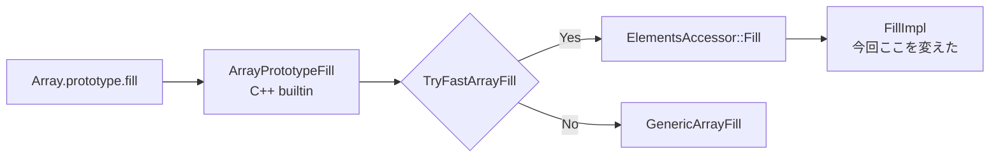
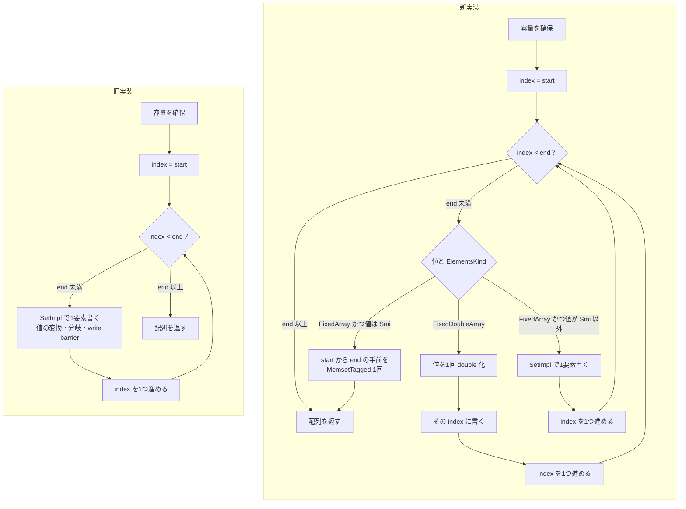
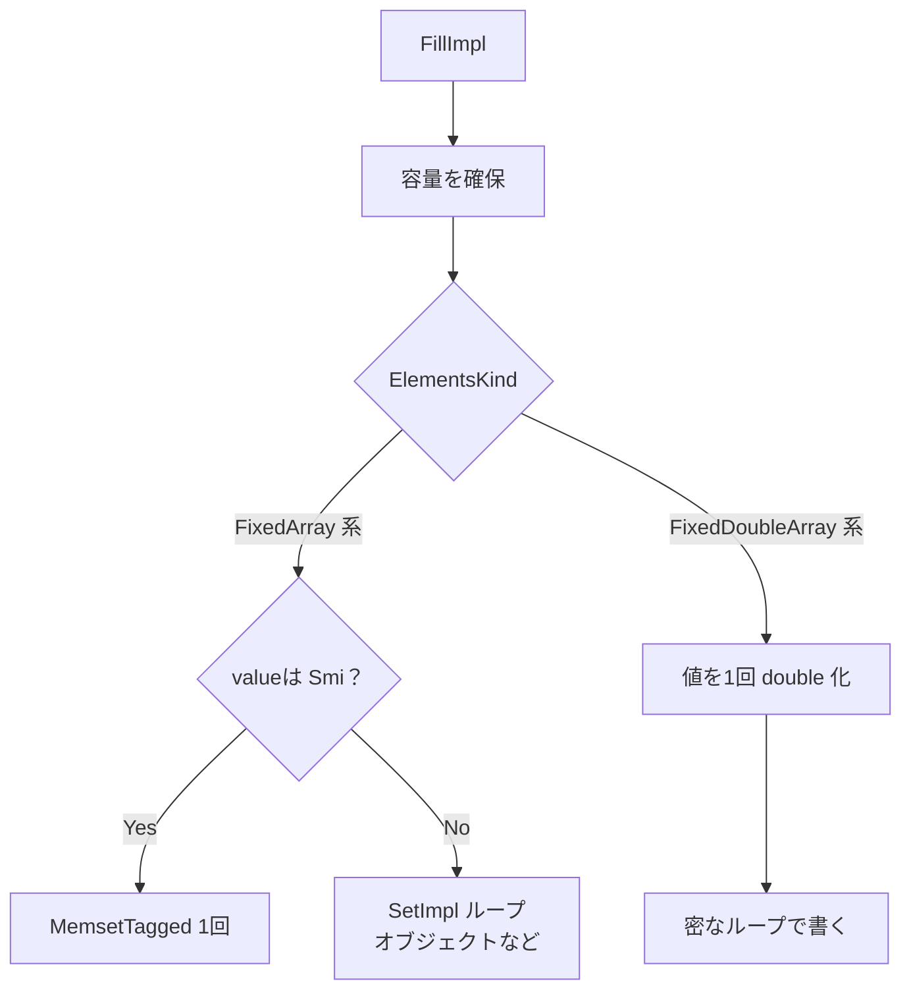

## はじめに

:::message
修正や追加等はコメントまたはGitHubで編集リクエストをお待ちしております。
:::

ダイニーで一番若いエンジニアのriya amemiya(21歳)です。
(V8の配列系メソッド高速化職人をそろそろ名乗っても怒られないんじゃないか？と最近思い始めました🧐)
今回は `Array.prototype.fill`（以下 `fill`）をSmiとdouble向けに最大約7倍高速化しました。

V8の配列系メソッドのfast path実装に取り組む人は世界で見てもほとんどいないので、この記事から少しでも興味を持っていただけると嬉しいです。

パッチはこちらです。

https://chromium-review.googlesource.com/c/v8/v8/+/8115306

よければ他のArray系メソッド高速化の記事もご覧ください。

https://zenn.dev/dinii/articles/675d47a6c21c83
https://zenn.dev/dinii/articles/e12fbacc8e761c
https://zenn.dev/dinii/articles/a272b7c3b60ab8

## TL;DR

- 従来は `start` から `end` まで、1要素ごとに `SetImpl` を呼ぶ汎用ループ
- Smiのfillは `MemsetTagged` 1発で一気にfillするようにした
- doubleのfillは値を一度だけ変換し、`FixedDoubleArray` へ密なループで書くようにした
- オブジェクトのfillは従来どおり `SetImpl` のまま（write barrierが要るため対象外）

## fillの仕様を理解する

`fill(value, start, end)` は、配列の `start` から `end` までの要素を、同じ値 `value` で上書きするメソッドです。

```js
[1, 2, 3, 4, 5].fill(0);
// => [0, 0, 0, 0, 0]

[1, 2, 3, 4, 5].fill(9, 1, 4);
// => [1, 9, 9, 9, 5]
```

`start` と `end` は省略でき、その場合は全てのindexを埋めます

また、 `fill` は破壊的に書き換えて同じ配列を返します。新しい配列は作りません。`length` も変わりません。

詳細な仕様はこちらです。

https://tc39.es/ecma262/#sec-array.prototype.fill

## 呼び出し経路

V8の `fill` はC++ builtin `ArrayPrototypeFill` から入ります。
Torqueの実装も検討しましたが、このpatchの本質的ではない差分が大量に生まれてしまうため、今回は既存のC++ builtinを変更する形で実装しました。

1. `this` と `length`、`start`、`end` を仕様どおりに正規化する
2. Fast JSArrayなら `TryFastArrayFill` を試す
3. 無理だったら仕様に沿った実装の `GenericArrayFill` へ

```cpp
// src/builtins/builtins-array.cc
if (TryFastArrayFill(isolate, &args, receiver, value, start_index,
                     end_index)) {
  return *receiver;
}
return GenericArrayFill(isolate, receiver, value, start_index, end_index);
```

`TryFastArrayFill` はElementsKindの遷移（たとえばSmi配列にdoubleを埋めるとdouble配列になる）を済ませたあと、最終的に `ElementsAccessor::Fill` 経由で `FillImpl` を呼びます。今回のパッチが触ったのは、この `FillImpl` です。



## 従来の実装

パッチ前の `FillImpl` は、容量を確保したあと、範囲内の全インデックスで `SetImpl` を呼んでいました。

```cpp
// パッチ前（要約）
static MaybeDirectHandle<Object> FillImpl(..., size_t start, size_t end) {
  // COW 配列のコピー、容量の確保 ...

  for (size_t index = start; index < end; ++index) {
    Subclass::SetImpl(receiver, InternalIndex(index), *obj_value);
  }
  return MaybeDirectHandle<Object>(receiver);
}
```

`SetImpl` は汎用APIです。ElementsKindごとの分岐、値の変換、write barrierなどを担います。どんな配列でも正しく動きます。

ただし `fill` では、値がループ中に変わりません。10万要素なら、同じ変換と分岐を10万回繰り返します。ループ不変な処理を要素数回だけやり直している、というのがボトルネックでした。

新旧の流れを並べると次のようになります。



## 新実装の方針

パッチ後は、共通の前処理を `EnsureFillRangeCapacity` に切り出し、ElementsKindごとにやり方を分けます。

| 対象 | fillしたい値 | 新しい処理 |
| --- | --- | --- |
| `FixedArray`（Smi / object 系） | Smi | `MemsetTagged` 1回 |
| `FixedArray`（Smi / object 系） | オブジェクトなど | 従来どおり `SetImpl` ループ |
| `FixedDoubleArray` | 数値 | 値を1回変換し、密なループで書く |

### SmiのfillはMemsetTagged一発

Smiはヒープ上のオブジェクトではなく、タグ付き整数としてスロットにそのまま埋め込めます。
同じSmiを連続したスロットへ並べるだけなら、ポインタを1個ずつ扱う必要はありません。

```cpp
// FixedArray 向け FillImpl（要約）
static MaybeDirectHandle<Object> FillImpl(..., size_t start, size_t end) {
  JSObject::EnsureWritableFastElements(isolate, receiver);
  MAYBE_RETURN_NULL(
      Subclass::EnsureFillRangeCapacity(isolate, receiver, start, end));

  if (IsSmi(*obj_value)) {
    MemsetTagged(Cast<FixedArray>(receiver->elements())
                     ->RawFieldOfElementAt(static_cast<uint32_t>(start)),
                 *obj_value, end - start);
    return MaybeDirectHandle<Object>(receiver);
  }

  for (size_t index = start; index < end; ++index) {
    Subclass::SetImpl(receiver, InternalIndex(index), *obj_value);
  }
  return MaybeDirectHandle<Object>(receiver);
}
```

`MemsetTagged` は、圧縮ポインタ環境なら値を1回圧縮し、あとは `std::fill_n` で範囲を埋めます。

```cpp
// src/objects/slots-inl.h
inline void MemsetTagged(Tagged_t* start, Tagged<MaybeObject> value,
                         size_t count) {
#ifdef V8_COMPRESS_POINTERS
  Tagged_t raw_value = V8HeapCompressionScheme::CompressAny(value.ptr());
#else
  Tagged_t raw_value = value.ptr();
#endif
  std::fill_n(start, count, raw_value);
}
```

Smiはヒープオブジェクトを指さないので、要素ごとのwrite barrierも要りません。
HOLEYなSmi配列でも、`fill` はholeをvalueで上書きして「存在する要素」にします。
`MemsetTagged` でスロットを埋めるだけで、仕様どおりです。

### doubleのfillは変換をループの外へ

double要素は `FixedDoubleArray` に生の `double` として並びます。valueがHeapNumberやSmiであっても、最終的には内部的にはdoubleに変換されています。
旧実装では、その変換が `SetImpl` の内側で要素ごとに走っていました。新実装では `Object::NumberValue` を1回だけ呼び、得た `double` を密なループで書きます。

```cpp
// FixedDoubleArray 向け FillImpl（要約）
static MaybeDirectHandle<Object> FillImpl(..., size_t start, size_t end) {
  MAYBE_RETURN_NULL(
      Subclass::EnsureFillRangeCapacity(isolate, receiver, start, end));

  Tagged<FixedDoubleArray> elements =
      Cast<FixedDoubleArray>(receiver->elements());

  double value = Object::NumberValue(*obj_value);
  if (std::isnan(value)) {
    value = std::numeric_limits<double>::quiet_NaN();
  }
  UnalignedDoubleMember* data = elements->begin();
  for (size_t index = start; index < end; ++index) {
    data[index].set_value(value);
  }
  return MaybeDirectHandle<Object>(receiver);
}
```

`V8_ENABLE_UNDEFINED_DOUBLE` 有効時は、`undefined` のfillだけ専用ループに分岐します。通常の数値fillと同じく、要素ごとの `SetImpl` は通りません。

### オブジェクトのfillは対象外

オブジェクトをfillするときは、各スロットがヒープへのポインタになります。
GCに「ここを書いた」と知らせるwrite barrierが要るため、単純な `memset` を使うことはできないため、今回は従来どおり `SetImpl` ループのままにしています。



## ベンチマーク

### 測定条件

構成はarm64/`is_debug=false`/sandbox有効のreleaseです。

- 配列長N=100000（`double_fill_1M` のみ100万要素）
- ウォームアップ後に `performance.now` でus/opを計測
- before/afterを交互に5ラウンド回した中央値を採用

### 結果

| ケース | before | after | 倍率 |
| --- | ---: | ---: | ---: |
| `smi_fill_full` | 34.67 us/op | 5.07 us/op | 6.8x |
| `smi_fill_partial` | 30.46 us/op | 4.53 us/op | 6.7x |
| `holey_smi_fill_full` | 36.46 us/op | 4.96 us/op | 7.4x |
| `double_fill_full` | 51.37 us/op | 10.10 us/op | 5.1x |
| `double_fill_partial` | 45.85 us/op | 9.01 us/op | 5.1x |
| `double_fill_1M` | 514.6 us/op | 99.9 us/op | 5.2x 
| `smi_fill_small_n16` | 0.020 us/op | 0.015 us/op | 1.3x |
| `object_fill_full` | 55.6 us/op | 66.4 us/op | 0.84x |

### 計測コード

:::details d8で実行した計測コード

```js
// Microbenchmark for Array.prototype.fill (ElementsAccessor::FillImpl path).
// Prints us/op. Lower us/op is better.

function nowMs() {
  return performance.now();
}

function bench(name, setup, run, iters) {
  const state = setup();
  for (let i = 0; i < 20; i++) run(state);
  if (typeof gc === "function") gc();
  for (let i = 0; i < 10; i++) run(state);

  const t0 = nowMs();
  for (let i = 0; i < iters; i++) run(state);
  const t1 = nowMs();
  const totalMs = t1 - t0;
  const usPerOp = (totalMs / iters) * 1000;
  print(
    name.padEnd(28) +
      usPerOp.toFixed(3).padStart(12) +
      " us/op  " +
      totalMs.toFixed(1).padStart(8) +
      " ms total  " +
      ("n=" + iters)
  );
  return usPerOp;
}

const N = 100000;
const ITERS = 800;

print("=== Array.prototype.fill microbench ===");
print("N=" + N + " elements, iters=" + ITERS);
print("");

bench(
  "smi_fill_full",
  () => {
    const a = new Array(N);
    for (let i = 0; i < N; i++) a[i] = 0;
    return a;
  },
  (a) => {
    a.fill(42);
  },
  ITERS
);

bench(
  "smi_fill_partial",
  () => {
    const a = new Array(N);
    for (let i = 0; i < N; i++) a[i] = 0;
    return a;
  },
  (a) => {
    a.fill(7, 1000, 90000);
  },
  ITERS
);

bench(
  "double_fill_full",
  () => {
    const a = new Array(N);
    for (let i = 0; i < N; i++) a[i] = 0.5;
    return a;
  },
  (a) => {
    a.fill(1.5);
  },
  ITERS
);

bench(
  "double_fill_partial",
  () => {
    const a = new Array(N);
    for (let i = 0; i < N; i++) a[i] = 0.5;
    return a;
  },
  (a) => {
    a.fill(2.25, 1000, 90000);
  },
  ITERS
);

bench(
  "holey_smi_fill_full",
  () => {
    const a = new Array(N);
    a[0] = 1;
    a[N - 1] = 2;
    return a;
  },
  (a) => {
    a.fill(9);
  },
  ITERS
);

bench(
  "object_fill_full",
  () => {
    const o = { x: 1 };
    const a = new Array(N);
    for (let i = 0; i < N; i++) a[i] = o;
    return { a, o2: { x: 2 } };
  },
  (s) => {
    s.a.fill(s.o2);
  },
  Math.floor(ITERS / 2)
);

bench(
  "smi_fill_small_n16",
  () => {
    const a = new Array(16);
    for (let i = 0; i < 16; i++) a[i] = 0;
    return a;
  },
  (a) => {
    a.fill(3);
  },
  ITERS * 50
);

bench(
  "double_fill_1M",
  () => {
    const a = new Array(1000000);
    for (let i = 0; i < a.length; i++) a[i] = 0.1;
    return a;
  },
  (a) => {
    a.fill(Math.PI);
  },
  200
);

print("");
print("done");
```

:::

## おわりに

メモリ操作系は上手いことやれば大きく速くできるところが多く、これからも配列周りで高速化できるところはまだまだあると思います。

V8へのコントリビューションに興味がある方は、以下も参考になります。

https://zenn.dev/riya_amemiya/articles/44e6ed7d381304
https://blog.jxck.io/entries/2024-03-26/chromium-contribution.html
https://chromium.googlesource.com/chromium/src/+/lkgr/docs/contributing.md
