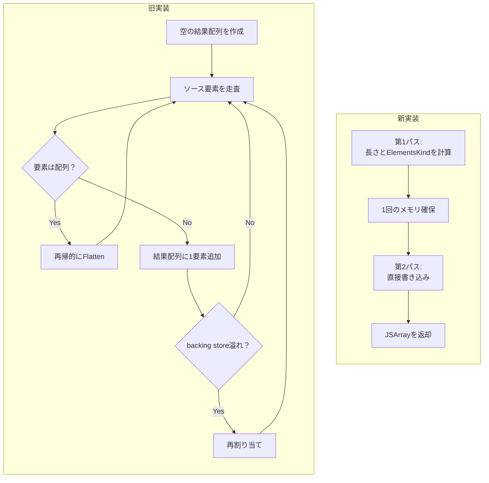
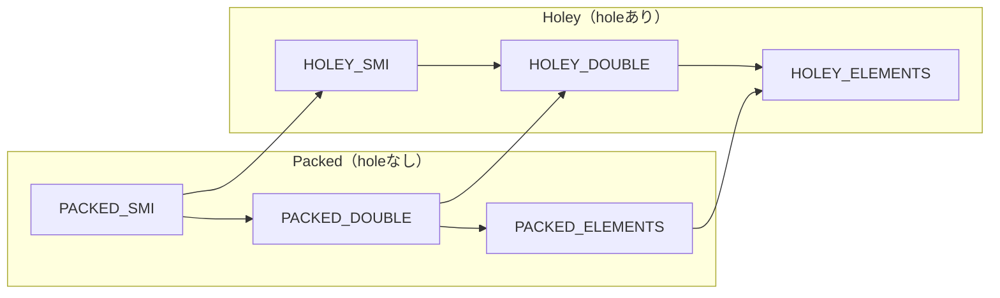
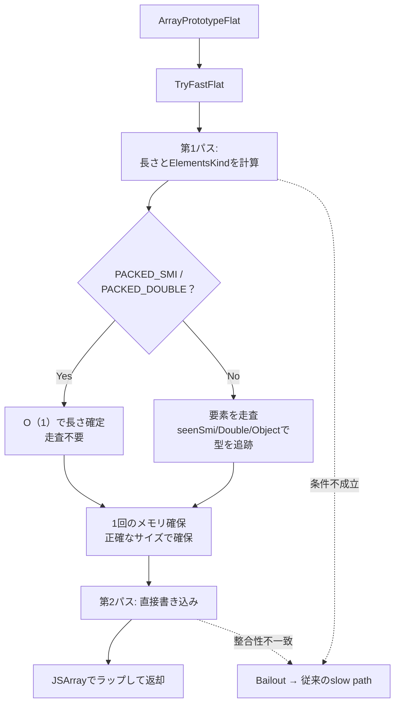
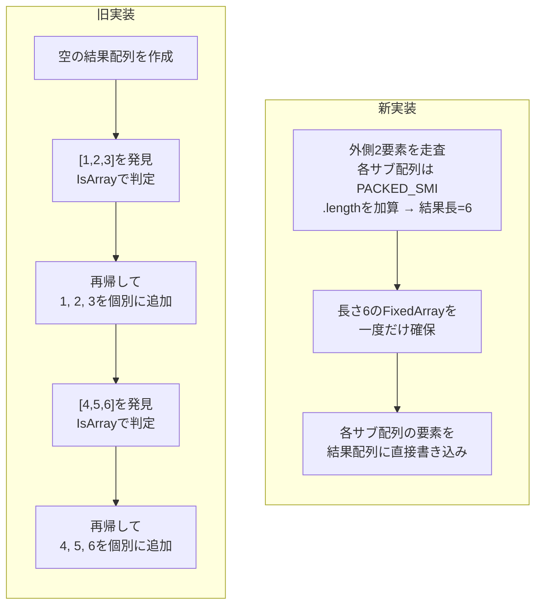
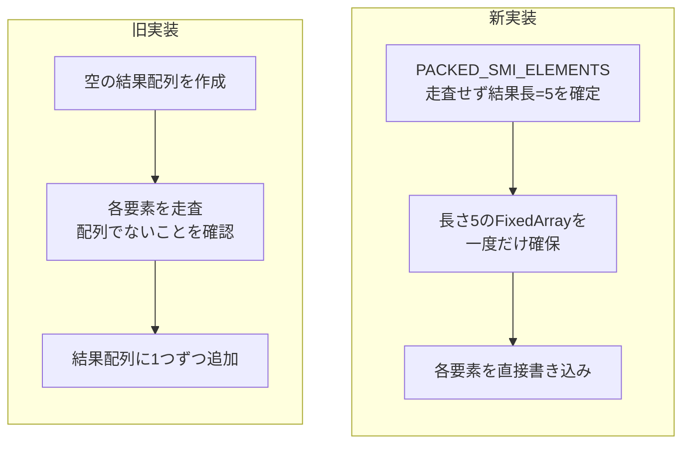
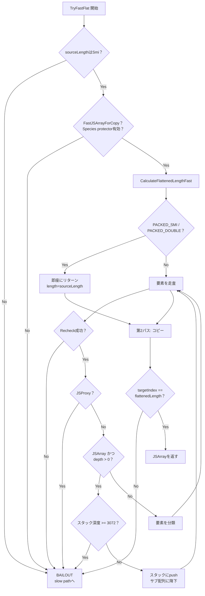

## はじめに

:::message
修正や追加等はコメントまたはGitHubで編集リクエストをお待ちしております。
:::

ダイニーで一番若いエンジニアのriya amemiya(21歳)です。
タイトルの通り、V8の `Array.prototype.flat`（以下 `flat`）を高速化しました。
パッチはこちらです。

https://chromium-review.googlesource.com/c/v8/v8/+/7526287


最初のコミットから約1ヶ月、やりきりました。

Chrome 147（V8 14.7）でリリースされます。

https://chromiumdash.appspot.com/commit/3eed742a70b10c8344023361ef7a292f20b6a33b

本稿では、どのようにして `flat` を高速化したのか、その過程を備忘録的に残します。

## TL;DR

V8の `Array.prototype.flat` を2パス方式で高速化しました。
第1パスで結果配列の正確な長さとElementsKindを事前計算し、第2パスで1回のメモリ確保と直接書き込みを行います。

- メモリ割り当て: O(log n)回 → 1回
- 要素書き込みコスト: 直接書き込みでオーバーヘッド激減
- ElementsKind遷移: ゼロ

## そもそも何でこのパッチを出したのか

ある日、XのタイムラインにJSCの `Array.prototype.flat` が速くなるという投稿が流れてきました。

https://x.com/bunjavascript/status/2011898197330075845

内容を見てみると、先に結果長を計算して確保してから、そこに要素をコピーするという実装のようで、普段からV8の実装に興味があった自分にとって「これはV8にも適用できそう」と思いました。
実際コードを見るとV8にもJSCのような最適化を行えそうとわかり、自分でもパッチを出してみようと思いました。

## V8に大きな変更を入れるまでの流れ

まず、このような大きな変更をV8に入れる場合、いきなりパッチを出すのではなく、事前にレビュアーと実装方針の合意を取ることが推奨されています。V8にはdiscussionの場があり、そこに提案を投稿すると誰かしら反応してくれます。

https://groups.google.com/g/v8-dev

自分のケースではLeszek Swirskiさんが反応してくれて、「良さそうだね。パッチ出して、議論はそっちでしようか」と言っていただいたのでGerritにパッチを出しました。レビューはLeszek SwirskiさんとOlivier Flückigerさんが担当してくれました。
この場を借りて、深く感謝を申し上げます。

https://groups.google.com/g/v8-dev/c/8ROaTLSDXkM

## flatの仕様を理解する

最適化の話に入る前に、`flat` の仕様を確認しておきます。
仕様上、`flat` は以下のように動作します。

```js
const arr = [[1, 2], [3, 4]];
arr.flat();
// => [1, 2, 3, 4]

const deep = [[[1]], [[2]]];
deep.flat(2);
// => [1, 2]
```

`flat(depth)` はネストされた配列を `depth` の深さまで平坦化します。
`depth` を省略した場合や `undefined` を渡した場合はデフォルトの1が使われます。
`Infinity` を渡すとどんなに深くネストされていても完全に平坦化します。

### holeの扱い

JavaScriptの配列では、要素が存在しないインデックスのことをhole（穴）と呼びます。`[1, , 3]` のようにリテラルで要素を省略したり、`delete arr[1]` で要素を削除するとholeが生じます。holeは `undefined` とは異なり、プロパティ自体が存在しない状態です。
`null` や `undefined` はholeではありません。

```js
> [1, , 3]
[ 1, <1 empty item>, 3 ]
```

`flat` はholeを詰めるという特殊な仕様を持っています。
`map` などのJS配列メソッドはholeをそのまま保持しますが、`flat` はholeをスキップして結果を詰めます。

```js
> [1, , 3].flat()
[ 1, 3 ] // ← holeが詰められた
```

```js
> [1, , 3].map(n => n * 2)
[ 2, <1 empty item>, 6 ]
```

これは最適化する上で少し厄介な点です。
holeがあると入力配列の `.length` と結果配列の実際の要素数が一致しないため、事前に正確な結果長を計算するにはholeを数える必要があります。

## 従来のflatの実装

V8の従来の `flat` はTorqueの `FlattenIntoArrayFast` と、そのフォールバックである `FlattenIntoArraySlow` で構成されていました。

基本的なアルゴリズムは素朴で、以下のような流れです。

1. 空の結果配列を作成
2. ソース配列を走査し、要素が配列かつ `depth > 0` なら再帰、そうでなければ結果配列に追加
3. 要素を追加するたびに結果配列に書き込む

従来の実装にはいくつかの非効率な点がありました。

まず、結果配列を長さ0で作成してから要素を1つずつ追加していくため、配列が何度も再割り当てされます。
メモリの再割り当てはコストが高いため、これを避けるためには結果配列を事前に正確な長さで確保する必要があります。

次に、`flat` はholeを詰める仕様のため、結果配列のインデックスとソース配列のインデックスが異なります。
従来の実装は汎用的なプロパティ書き込みを1要素ずつ呼んでいたため、オーバーヘッドが大きい状態でした。

そして、要素が配列かどうかを判定するために毎回 `IsArray` を呼ぶ必要がありますが、V8の内部型（ElementsKind詳しくは後述）を見れば、数値しか入っていない配列にはサブ配列が存在し得ないことが自明です。この情報を活用できていませんでした。

以下に最適化前後のフローを図にしました。



## ElementsKindとは

V8は配列の内部表現としてElementsKindという型分類を持っています。
これは配列の要素がどのような値を持っているかを追跡するもので、JITコンパイラの型推論やメモリレイアウトの最適化に使われます。

主要なElementsKindは以下の通りです。

- `PACKED_SMI_ELEMENTS`: 全要素が小さな整数（Smi）、holeなし
- `PACKED_DOUBLE_ELEMENTS`: 浮動小数点数を含む配列、holeなし
- `PACKED_ELEMENTS`: 文字列やオブジェクトを含む配列、holeなし
- `HOLEY_SMI_ELEMENTS`: Smiだがholeあり
- `HOLEY_DOUBLE_ELEMENTS`: 浮動小数点数を含む配列、holeあり
- `HOLEY_ELEMENTS`: 文字列やオブジェクトを含む配列、holeあり

ElementsKindの遷移は原則一方向（汎化のみ）であり、一度HOLEYになるとholeを埋めてもPACKEDには基本的に戻りません。



重要な性質として、`PACKED_SMI_ELEMENTS` や `PACKED_DOUBLE_ELEMENTS` の配列には数値しか入っていないことが保証されます。
つまり、これらの配列にはサブ配列もProxyも存在し得ません。この保証を最適化に活用するのが今回のパッチの肝です。

## 最適化の戦略

前述の通り、実装にはJSCのアプローチを参考にしています

https://github.com/WebKit/WebKit/pull/56035

参考にさせて頂いたSosuke Suzukiさんにもこの場を借りて感謝申し上げます。

V8もJSCと同様に2パス方式を採用しました。

1. 長さ計算: 結果配列の正確な長さを事前に計算する
2. コピーパス: 計算した長さで結果配列を一度だけ割り当て、要素をコピーする



これにより従来のボトルネックだったメモリの再割り当てを解消します。

fast pathの条件を満たさない場合は、従来のslow pathにフォールバックします。具体的には以下のようなケースでフォールバックが発生します。

- `Symbol.species` がオーバーライドされている
- ソース配列がProxyである
- サブ配列にProxyが含まれている
- 配列がFastモードでない（dictionary mode等）
- Smiの範囲を超える長さ
- 深すぎるネスト

## 実装の詳細

### 第1パス: 長さ計算 (`CalculateFlattenedLengthFast`)

長さ計算パスでは、結果配列の正確な要素数と、結果配列の最適なElementsKindを同時に算出します。

#### 数値配列のショートカット

ソース配列が `PACKED_SMI_ELEMENTS` または `PACKED_DOUBLE_ELEMENTS` の場合、全要素が数値でありholeもないことが保証されているため、要素を1つずつ走査する必要がありません。
結果の長さはソースの `.length` そのものであり、ElementsKindもソースと同じです。

```torque
if (sourceKind == ElementsKind::PACKED_SMI_ELEMENTS ||
    sourceKind == ElementsKind::PACKED_DOUBLE_ELEMENTS) {
  return FlattenedLengthResult{length: sourceLength, targetKind: sourceKind};
}
```

これだけで `[1, 2, 3, ..., 1024].flat()` のようなケースは長さ計算がO(1)になります。

#### サブ配列に対するショートカット

ソース配列が `PACKED_ELEMENTS` の場合、サブ配列の存在を確認しながら走査する必要がありますが、ここでもショートカットがあります。

サブ配列が `PACKED_SMI_ELEMENTS` や `PACKED_DOUBLE_ELEMENTS` の場合、先ほど説明したようにその中身は数値のみでありさらなるネストはあり得ません。したがって、サブ配列の場合も数値のみの配列なら走査せずに `.length` をそのまま加算できます。

たとえば `[[1,2,3], [4,5,6], [7,8,9]].flat()` では、外側の配列は `PACKED_ELEMENTS`（サブ配列を含むため）ですが、各サブ配列は `PACKED_SMI_ELEMENTS` です。長さ計算では外側の3要素だけを走査し、各サブ配列の `.length` を加算するだけで済みます。サブ配列の中身（1, 2, 3, ...）を読む必要はありません。

#### ElementsKindの追跡

長さ計算の過程で、リーフ要素（最終的に結果配列に入る値）の型を `seenSmi`、`seenDouble`、`seenObject` の3つのフラグで追跡します。

```torque
if (!IsNumber(element)) {
  seenObject = true;
} else if (!TaggedIsSmi(element)) {
  seenDouble = true;
} else {
  seenSmi = true;
}
```

走査完了後、これらのフラグから結果配列の最適なElementsKindを決定します。

- `seenObject` がtrueなら `PACKED_ELEMENTS`
- `seenDouble` がtrue（かつ `seenObject` がfalse）なら `PACKED_DOUBLE_ELEMENTS`
- それ以外なら `PACKED_SMI_ELEMENTS`

この追跡により、たとえば `[[1], [2], [3]].flat()` の結果が `PACKED_SMI_ELEMENTS` として生成されます。

### 第2パス: コピー (`TryFastFlat`)

長さが決まったら、結果配列を一度だけ確保し、要素をコピーしていきます。
コピーパスでも各要素を1つずつ処理しますが、直接書き込みを行うため、汎用的なプロパティ書き込みのオーバーヘッドがありません。

### 明示的スタックによる反復処理

ネストされたサブ配列を処理する際、素朴に実装するなら再帰呼び出しを使います。

しかし、再帰での実装は生成されるコードがあまりにも複雑になり、buildが失敗してしまったため、今回のパッチでは明示的なスタックを使った反復処理を採用しました。
1エントリあたり3要素（配列参照、インデックス、深さ）をpushし、サブ配列の処理が終わったらpopして親の状態を復元します。
深さの上限は `kMaxFlatFastStackEntries = 3072`（1エントリ3要素で実質深さ1024まで）で、超過した場合はslow pathにフォールバックします。
whileなので、再帰のようなスタックオーバーフローの心配はないのですが、上限がないと無限にメモリを消費してしまう可能性があり、それを防ぐために上限を設けています。

## 動作の具体例

今回の変更を簡単にまとめると以下のようなイメージです。
(厳密にはもう少し複雑です)

### 例1: `[[1, 2, 3], [4, 5, 6]].flat()`

ソース配列は `PACKED_ELEMENTS`（サブ配列を含むため）、各サブ配列は `PACKED_SMI_ELEMENTS` です。

従来の実装では以下が起きていました。

1. 空の結果配列を作成
2. `[1,2,3]` を発見、`IsArray` で配列と判定、再帰して1, 2, 3を個別に追加（結果配列への書き込みが発生）
3. `[4,5,6]` を発見、同様に再帰して4, 5, 6を個別に追加（結果配列への書き込みが発生）

パッチ適用後の動作です。

1. 長さ計算: 外側2要素を走査。各サブ配列は `PACKED_SMI_ELEMENTS` なので `.length` を加算。結果長 = 6、ElementsKind = `PACKED_SMI_ELEMENTS`
2. 長さ6の `FixedArray` を一度だけ確保
3. 書き込み: 各サブ配列の要素を結果配列に書き込み



### 例2: `[1, 2, 3, 4, 5].flat()`

ソース配列は `PACKED_SMI_ELEMENTS` です。

従来の実装では

1. 空の結果配列を作成
2. 再帰しながら配列でないことを確認して結果配列に追加

パッチ適用後の動作です。

1. 長さ計算: ソースが `PACKED_SMI_ELEMENTS` なので要素を走査せず、結果長 = `.length` = 5、ElementsKind = `PACKED_SMI_ELEMENTS` として早期リターン
2. 長さ5の `FixedArray` を一度だけ確保
3. 書き込み: 各要素を結果配列に書き込み



## HOLEY配列の扱い

先述の通り、`flat` はholeを詰める仕様です。
HOLEY配列の場合、前述のショートカットは使えません。`.length` が10でも実際の要素数は5かもしれないからです。HOLEYの場合は要素を1つずつ走査してholeを検出し、実際の要素数を数えます。

```torque
try {
  element = fastOW.LoadElementNoHole(index) otherwise FoundHole;
} label FoundHole {
  index++;
  continue;  // holeはスキップ
}
```

`LoadElementNoHole` はholeを検出するとラベルにジャンプし、そのインデックスをスキップします。結果としてholeが詰められた配列が生成されます。

なお、HOLEY配列であっても2パス方式の恩恵（事前サイズ確保）は受けられます。
ショートカットが効かないだけで、全体のコストは従来の方式より小さいです。

## 結果配列のElementsKindが最適化されるメリット

ここまで、第1パスでリーフ要素の型を追跡し、結果配列のElementsKindを決定する仕組みを説明しました。では、結果配列のElementsKindが正確に決まることで具体的にどのようなメリットがあるのでしょうか。

従来の実装では空の配列を作成してから要素を1つずつ追加していくため、追加のたびにElementsKind transitionが発生する場合がありました。たとえば最初は `PACKED_SMI_ELEMENTS` として始まった配列に浮動小数点数が追加されると `PACKED_DOUBLE_ELEMENTS` へ遷移し、再割り当てと全要素のコピーが発生します。
さらに文字列が追加されると `PACKED_ELEMENTS` へ遷移し、再度再割り当てとコピーが走ります。
新実装では第1パスで全リーフ要素の型を把握し終えてからElementsKindを確定するため、この遷移が一切発生しません。

結果配列のElementsKindが正確であることは、`flat` の後に続く処理にも好影響を与えます。
V8のJITコンパイラは、配列のElementsKindに基づいて特殊化されたコードを生成します。
たとえば `flat` の結果が `PACKED_SMI_ELEMENTS` であれば、後段のループ処理で各要素がSmiであることを前提としたコードが生成され、型チェックのオーバーヘッドが省けます。
要素あたりのメモリ使用量が小さくなり、キャッシュラインあたりの要素数が増えるため、後段の数値計算処理の効率も向上します。

テストファイルではこの最適化が正しく機能していることを検証しています。たとえば、SmiとDoubleが混在するサブ配列の `flat` 結果は `PACKED_DOUBLE_ELEMENTS` になります。SmiはDoubleに包含されるため、`PACKED_ELEMENTS`（汎用型）ではなく `PACKED_DOUBLE_ELEMENTS` として生成できるのです。

```js
// Mixed sub-array kinds produce DOUBLE (SMIs fit in doubles).
assertDoubleElementsKind([[1],[1.1]].flat());
```

## 安全性の担保とBailout（フォールバック）の仕組み

fast pathは「楽観的だが安全」という方針で設計されています。
全ての前提条件が満たされていると仮定して高速なコードを実行しますが、前提が崩れた瞬間にslow pathへフォールバックします。

bailoutポイントは大きく3つのカテゴリに分けられます。

### fast pathの入口での検証

`TryFastFlat` が呼ばれた直後、配列の長さがSmi範囲内か、配列がfast mode（dense backing store、標準プロトタイプ）かを検証します。
ここで弾かれるのは、dictionary modeの配列や `Symbol.species` がオーバーライドされた配列などです。
このチェックにより、fast pathが扱える「通常の配列」のみが後続の処理に進みます。

### 走査中の不変条件チェック

各イテレーションの先頭で `Recheck()` を呼び、配列の構造が変わっていないこと（mapの一致やプロトタイプチェーン上に要素が追加されていないこと）を確認します。
getterの副作用やPrototypeの変更などで配列の構造が変化した場合、即座にbailoutが発生します。

走査中にProxy要素が見つかった場合もbailoutします。
Proxyはプロパティアクセスに対して任意のコードを実行できるため、fast pathの前提を破壊する恐れがあるためです。

### 2パス間の整合性検証

第2パスの完了時に、実際にコピーした要素数と第1パスで計算した長さが一致するかを検証します。
このチェックは、第1パスと第2パスの間に（あるいは第2パスの実行中に）何らかの理由で配列が変更された場合を検出するためのものです。

:::details Bailoutフローを図にするとこんな感じ



:::

### bailout時のフロー

いずれのbailoutポイントからも、最終的には従来の `FlattenIntoArrayWithoutMapFn` を呼ぶslow pathに入ります。slow pathは仕様に忠実な汎用的な実装であるため、どのような配列に対しても正しい結果を返します。

## どのようなケースで最もパフォーマンスが向上するのか

今回の最適化による恩恵は、配列のElementsKindと構造によって段階的に異なります。

最も恩恵が大きいのは、`PACKED_SMI_ELEMENTS` / `PACKED_DOUBLE_ELEMENTS` のサブ配列のみを含む配列の `flat()` です。`[[1,2],[3,4],[5,6]].flat()` のようなケースでは、長さ計算で外側の配列だけを走査し、各サブ配列の `.length` を加算するだけで済みます。
サブ配列が数値のみのPacked配列であれば中身を読む必要がないため、サブ配列のサイズに関わらず長さ計算のコストは外側の要素数に比例します。

`PACKED_ELEMENTS` のサブ配列を含む場合は、ショートカットが使えないため全要素の走査が必要になります。
しかし、2パス方式の恩恵（事前サイズ確保と直接書き込み）は受けられるため、従来方式よりは効率的です。

HOLEY配列の場合はholeを数える必要があるため、`.length` からの即時計算はできません。全要素を走査してholeをスキップしながら実際の要素数をカウントします。とはいえ、2パス方式による事前サイズ確保の恩恵は受けられます。

一方、Proxyを含む配列、dictionary mode配列、`Symbol.species` がオーバーライドされた配列などは、fast pathに入れないため恩恵はありません。これらは従来通りのslow pathが実行されます。

多くのJavaScriptコードでは、数値配列や通常のオブジェクト配列の `flat` が大半であり、ProxyやSymbol.speciesオーバーライドが登場するケースは稀です。
したがって、ほとんどの実用的なケースで今回の最適化の恩恵が得られます。

### ベンチマーク結果

提案段階やコミットメッセージにはx16とありますが、これは私の計測ミスです。。

d8で実測したベンチマーク結果です。outer=20,000、chunk=1,024（合計約20M要素）、depth=1、50回計測のmedian値で比較しています。

| 配列型 | パッチ適用 (median) | main (median) | 改善倍率 |
| --- | --- | --- | --- |
| SMI (整数) | 39.32 ms | 181.06 ms | **~4.6x** |
| DOUBLE (浮動小数点数) | 48.21 ms | 224.80 ms | **~4.7x** |
| OBJECT (文字列) | 79.56 ms | 190.80 ms | **~2.4x** |

### 計算量比較（Big-O）

- n = 全リーフ要素数
- k = サブ配列数
- m = サブ配列の要素数
- e = 実要素数(hole除く)
- p = 中間配列数
- q = リーフ配列数

| ケース | 旧: 時間計算量 | 新: 時間計算量 | 旧: メモリ割り当て | 新: メモリ割り当て |
| --- | --- | --- | --- | --- |
| Packed SMI (ネストなし) | O(n) | **O(1) + O(n)** | O(log n)回 | **1回** |
| k個のSmiサブ配列(各m要素) | O(n) + 再帰k回 | **O(k) + O(n)** | O(log n)回 | **1回** |
| depth=2 ネスト | O(n) + 再帰(p+q)回 | **O(n) + O(n)** | O(log n)回 | **1回** |
| Holey配列 | O(n) | O(n) + O(n) | O(log e)回 | **1回** |
| 混合型 | O(n) + 遷移コストO(n) | **O(n) + O(n)** | O(log n) + 遷移 | **1回** |

## おわりに

V8の `Array.prototype.flat` を2パス方式で高速化しました。
ElementsKindの情報を活用してPacked数値配列では走査自体を省略するショートカットや、配列の事前確保などを行いました。

本稿で紹介したパッチの全体像はGerritで確認できます。

https://chromium-review.googlesource.com/c/v8/v8/+/7526287

V8へのコントリビューションに興味がある方は、以下のリソースも参考になります。

https://zenn.dev/riya_amemiya/articles/44e6ed7d381304
https://blog.jxck.io/entries/2024-03-26/chromium-contribution.html
https://chromium.googlesource.com/chromium/src/+/lkgr/docs/contributing.md

## おまけ: ClusterFuzzとの戦い

メインパッチがマージされた翌日、GoogleのClusterFuzz（自動バグ検知システム）が3件のバグを発見しました（crbug 488366773, 488586038, 489008235）。

原因は、初期実装にあった `GetPackedElementsKind` マクロが `HOLEY_DOUBLE_ELEMENTS` を `PACKED_DOUBLE_ELEMENTS` として扱っていたことでした。
`HOLEY_DOUBLE_ELEMENTS` の配列はholeを含む可能性があり、`.length` が実際の要素数と一致しません。そのため第1パスで計算した長さと実際の要素数にずれが生じ、第2パスで `UnsafeCast<Number>` がundefined値（`V8_ENABLE_UNDEFINED_DOUBLE` が有効な場合にFixedDoubleArrayに格納される）に対して実行されクラッシュしていました。

修正では `GetPackedElementsKind` マクロを完全に削除し、`source.map.elements_kind` を直接参照して真にPACKEDなElementsKindのみをショートカット対象とするようにしました。

buganizer-systemからメールが届くので、回帰テストとCLにissue番号を `Bug:` として記載してマージすると自動で再評価が行われ、修正が確認されたらCloseされます。
迅速にレビューしていただき、翌日にはマージされました。

ClusterFuzzが品質を守っていることを実感した瞬間でした。

https://chromium-review.googlesource.com/c/v8/v8/+/7614915
