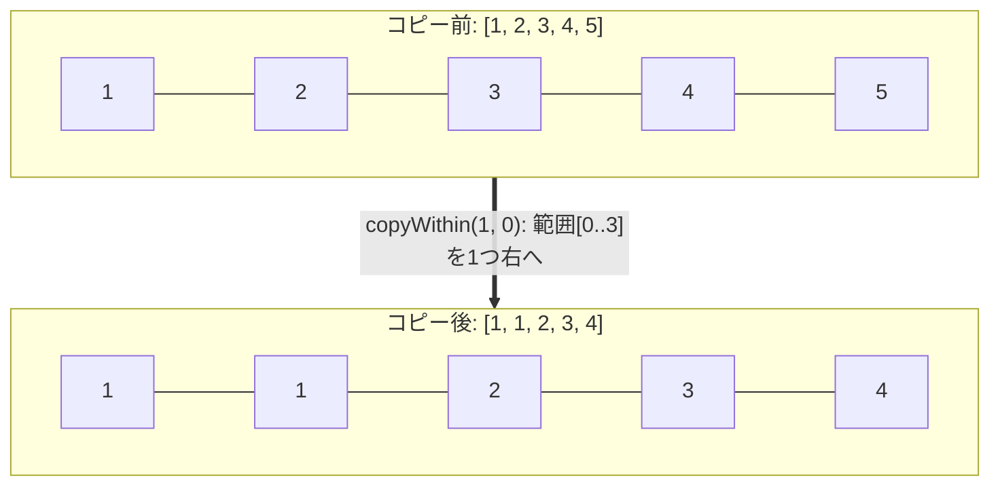
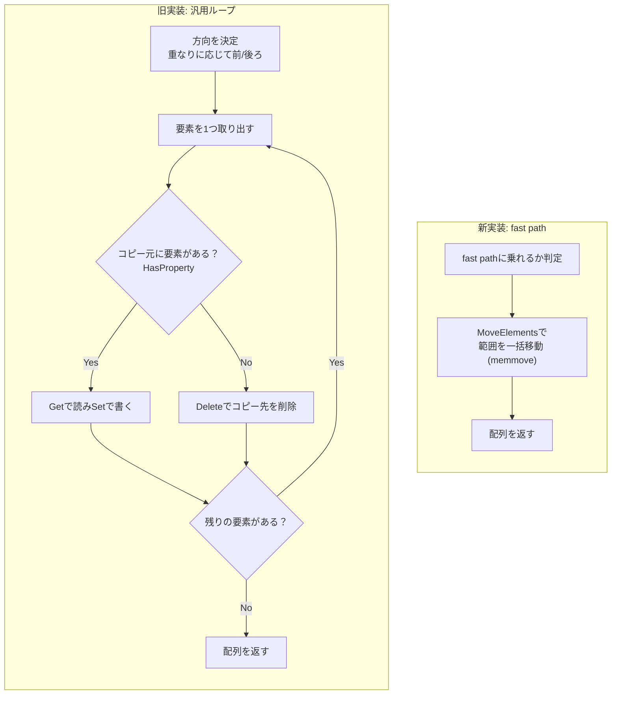
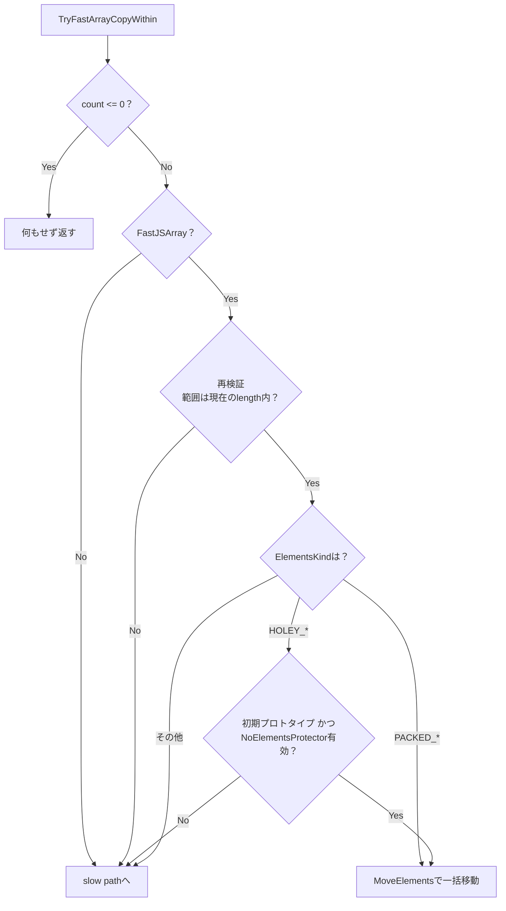

## はじめに

:::message
修正や追加等はコメントまたはGitHubで編集リクエストをお待ちしております。
:::

ダイニーで一番若いエンジニアのriya amemiya(21歳)です。
これまで `Array.prototype.flat` を2回にわたって高速化してきましたが、今回は `Array.prototype.copyWithin`（以下 `copyWithin`）を最大約450倍高速化しました。
「copyWithinって何だっけ」となった方も多いはずです。ES2015から実はあります。JS大改革のES6に実は入ってるメソッドなんですよね。`flat` や `includes` のようなメジャーなメソッドと比べると、影の薄いメソッドですが、配列の一部を配列内の他の場所にシャローコピーする処理を高速に行えるメソッドです。
元々パフォーマンスが高いメソッドではありましたが、一工夫するだけで大きくパフォーマンスを改善できたので、記事にまとめました。

パッチはこちらです。

https://chromium-review.googlesource.com/c/v8/v8/+/7951657

今回もElementsKindというV8内部の型表現が鍵になります。基礎は `flat` の記事に書いたので、よければそちらもどうぞ。

https://zenn.dev/dinii/articles/675d47a6c21c83
https://zenn.dev/dinii/articles/e12fbacc8e761c

## TL;DR

今回のパッチを要約すると、「1要素ずつのループをやめて、`memmove` を1回呼ぶ」です。

- 従来は1要素ずつ `HasProperty`/`Get`/`Set` を呼ぶ汎用ループ
- 新実装はbacking store上の範囲を `MoveElements`（memmove）で一気に移動
- PACKED配列は無条件、HOLEY配列は条件付きでfast pathに乗る
- 条件を満たさない配列は従来のslow pathへフォールバック
- d8実測で最大約450倍

## copyWithinの仕様を理解する

`copyWithin(target, start, end)` は、配列の `start` から `end` までの要素を、同じ配列の `target` の位置へコピーするメソッドです。

```js
[1, 2, 3, 4, 5].copyWithin(0, 3);
// => [4, 5, 3, 4, 5]
```

インデックス3以降の `[4, 5]` を先頭へコピーしています。`end` を省略すると末尾まで、負のインデックスは末尾からの相対位置です。

```js
[1, 2, 3, 4, 5].copyWithin(1);
// => [1, 1, 2, 3, 4]
// 末尾までコピー

[1, 2, 3, 4, 5].copyWithin(1, -2);
// => [1, 4, 5, 4, 5]
// 末尾から2つをコピー

[1, 2, 3, 4, 5].copyWithin(1, -2, -1);
// => [1, 4, 3, 4, 5]
// 末尾から2つをコピー
```

第1引数はコピー元ではなくコピー先です。`slice(start, end)` に慣れた頭で読むと一瞬混乱しますが、「startからendまでを、targetへ」ではなく「targetへ、startからendまでを」の順です。

詳細な仕様はこちらです。

https://tc39.es/ecma262/#sec-array.prototype.copywithin

この地味なメソッド、最適化の観点では面白い性質を3つ持っています。

1. 配列を破壊的に書き換え、同じ配列を返す（新しい配列は作らない）
2. 配列の `length` は変わらない
3. コピー元とコピー先が同じ配列の中にあるため、範囲が重なりうる

特に3つ目が曲者で、かつ今回の主役です。`slice` や `concat` と違い、コピー元とコピー先が同一のメモリ領域（backing store）に同居しています。

### 範囲が重なるケース

`target` と `start` が近いと、コピー元とコピー先が重なります。

```js
[1, 2, 3, 4, 5].copyWithin(1, 0);
// => [1, 1, 2, 3, 4]
```

先頭の4要素 `[1, 2, 3, 4]` を、1つ右へずらしてコピーしています。コピー先とコピー元が重なっているので、素朴に前から1つずつ書くと、まだ読んでいない要素を先に潰してしまいます。



仕様ではこの重なりを、コピー方向で処理します。
前からコピーすると壊れてしまう配置のときだけ、後ろからコピーすると書かれています。

### holeの扱い

JavaScriptの配列では、要素が存在しないインデックスをholeと呼びます。`[1, , 3]` のようにリテラルで要素を省略したり、`delete arr[1]` で削除すると生じます。`undefined` が入っているのではなく、プロパティ自体が存在しない状態です。

`copyWithin` は、コピー元がholeだった場合、コピー先の要素を削除します。つまりholeはholeのまま移動します。

```js
const a = [0, , 2, , 4];
a.copyWithin(0, 3);
// インデックス3はhole、4は4なので
// => [ <1 empty item>, 4, 2, <1 empty item>, 4 ]
```

## 従来の実装

従来の `copyWithin` は、仕様のアルゴリズムをほぼそのまま実装したものでした。重なりに応じて方向を決めた後、要素を1つずつ処理します。

1要素ごとに、おおよそ次の処理が走ります。

1. `HasProperty` でコピー元のインデックスに要素があるか確認する
2. あれば `Get` で値を読み、`Set` でコピー先へ書き込む
3. なければ（hole）、`Delete` でコピー先を削除する

どんな配列でも正しく動く、仕様に忠実な実装です。ただし100万要素の配列なら、この手続きを100万回繰り返します。汎用的なプロパティ操作は1回1回が重く、律儀すぎるがゆえに遅い、という状態でした。



## memmoveに任せる

ここで一歩引いて `copyWithin` を眺めます。コピー元もコピー先も、同じ配列の同じbacking storeの上にあります。
配列がFast JSArray（V8が連続したメモリ上に要素を並べている、いわゆる普通の配列）なら、`copyWithin` がやるべきなのは「連続したメモリの一部を、同じメモリ内の別の場所へずらす」ことです。

このメモリブロックの移動を実現するのが `memmove` です。

`memmove` は、コピー元とコピー先が重なっていても正しく動くようにメモリブロックを移動できる関数です。
よく似た `memcpy` は重なりを考慮しませんが、`memmove` は重なりを検出して安全な方向にコピーします。

V8にはbacking store上で範囲を移動する `MoveElements` というプリミティブがあり、内部的には `memmove` を呼びます。
今回のパッチは、汎用ループの手前に「この配列はfast pathに乗れるか」の判定を差し込み、乗れるなら `MoveElements` 1回で済ませ、乗れなければ従来のループへ流す処理を追加しました。

本質的な部分はこれだけですが、いつでも無作為に呼べるわけではありません。

## ElementsKindによる場合分け

memmoveで一括移動してよいかどうかは、配列のElementsKindで決まります。

ElementsKindはV8が配列の中身の型を追跡する内部ラベルです。今回効いてくるのは、PACKED（holeなし）かHOLEY（holeあり）かの違いです。実装した `TryFastArrayCopyWithin` は、次のように分岐します。



### PACKED配列は無条件でmemmove

`PACKED_SMI_ELEMENTS`、`PACKED_ELEMENTS`、`PACKED_DOUBLE_ELEMENTS` のいずれかなら、holeが存在しないことが型レベルで保証されています。
holeがなければ、コピー元の各インデックスには必ず配列自身の要素があるので、`HasProperty` は常にtrueで、プロトタイプチェーンも考慮する必要がありません。この場合は `MoveElements` を呼べます。

```torque
const kind: ElementsKind = array.map.elements_kind;
if (kind == ElementsKind::PACKED_SMI_ELEMENTS ||
    kind == ElementsKind::PACKED_ELEMENTS) {
  array::EnsureWriteableFastElements(array);
  DoMoveElements(UnsafeCast<FixedArray>(array.elements), to, from, count);
} else if (kind == ElementsKind::PACKED_DOUBLE_ELEMENTS) {
  DoMoveElements(
      UnsafeCast<FixedDoubleArray>(array.elements), to, from, count);
}
```

V8には、配列リテラル同士でbacking storeを共有するcopy-on-write（COW）という仕組みがあり、共有したまま書き換えると、同じ実体を見ている無関係な配列まで書き換わってしまうので、移動の前に専用のコピーへはがしてから移動します。
`FixedDoubleArray` はCOWにならないので、`PACKED_DOUBLE_ELEMENTS` はそのまま移動しています。

### HOLEY配列は条件付き

HOLEY配列で問題になるのは、holeの「読み方」です。

`MoveElements` はbacking store上のhole表現をビットごと移動するので、holeはholeとして移ります。「holeはholeのまま移動する」という仕様そのままに見えるので、`MoveElements` を呼んでもいいように見えます。
しかし、1つだけ例外があります。

仕様の `HasProperty` は、プロトタイプチェーンまで辿ります。`Array.prototype[3]` のようにプロトタイプ側にインデックス要素が生えていると、配列自身のインデックス3がholeでも `HasProperty` はtrueになり、`Get` はその継承値を返します。holeを移すのではなく、継承値を書き込むのが正解になってしまうのです。

```js
Array.prototype[3] = "INHERITED";
[1, 2, 3, , 5].copyWithin(0, 3);
// インデックス3はholeだが、プロトタイプ側に3があるので
// コピー先には "INHERITED" が入る
// => ["INHERITED", 5, 3, "INHERITED", 5]
```

`Array.prototype` にわざわざこんなことをしている人がいるのか、という気はしますが、仕様に書かれている以上無視はできません。

そこでHOLEY配列では、memmoveの前に2つを確認します。

```torque
// For holey kinds a hole must mean "absent" (spec deletes on absent), which
// only holds with the initial prototype and an intact NoElementsProtector.
if (!IsPrototypeInitialArrayPrototype(array.map)) goto Slow;
if (IsNoElementsProtectorCellInvalid()) goto Slow;
```

- `IsPrototypeInitialArrayPrototype` で、配列のプロトタイプが初期状態の `Array.prototype` のままかを確認
- `IsNoElementsProtectorCellInvalid` で、`Array.prototype` などにインデックス要素が追加されていないかを確認

条件を満たしていれば、holeは確実に「要素が存在しない」を意味するので、安心してmemmoveできます。
満たしていなくて、slow pathへbail outするだけなので安全です。

PACKEDとHOLEYで、一括移動の可否は次のように整理できます。

| ElementsKind | holeの有無 | 一括memmove |
| --- | --- | --- |
| `PACKED_SMI_ELEMENTS` | なし | 無条件で可 |
| `PACKED_ELEMENTS` | なし | 無条件で可 |
| `PACKED_DOUBLE_ELEMENTS` | なし | 無条件で可 |
| `HOLEY_SMI_ELEMENTS` | ありうる | 初期プロトタイプ＋protector有効なら可 |
| `HOLEY_ELEMENTS` | ありうる | 初期プロトタイプ＋protector有効なら可 |
| `HOLEY_DOUBLE_ELEMENTS` | ありうる | 初期プロトタイプ＋protector有効なら可 |

## ユーザーコードによる副作用と再検証

もう1つの罠は、引数そのものです。

`copyWithin(target, start, end)` の各引数は、内部で `ToInteger` による数値変換を受けます。
引数がオブジェクトだと、この変換の過程で `valueOf` が呼ばれ、任意のユーザーコードが走ります。
そこで配列を縮められたらどうなるでしょうか。

```js
const arr = [1, 2, 3, 4, 5, 6, 7, 8, 9, 10];
const evil = { valueOf() { arr.length = 3; return 5; } };
arr.copyWithin(0, evil); // startの評価中にlengthが3へ縮む
```

`to`/`from`/`count` を計算し終えた時点と、実際にmemmoveする時点で、配列の状態が食い違いうるわけです。
古い長さを信じたままmemmoveすると、確保していないメモリ範囲を読み書きしてしまいます。

こんなコードが世の中にあるのか？とは思いますが、仕様でそうなると書かれているのでエンジンとしては対応するしかありません。
そこでfast pathは、移動の直前にもう一度、現在の `length` に対してインデックスを検証します。

```torque
// The ToInteger coercions in the caller may have run user code that shrank
// the array, so re-validate the clamped indices against the current length.
const length: Smi = array.length;
if (SmiAbove(to + count, length)) goto Slow;
if (SmiAbove(from + count, length)) goto Slow;
```

## 実装全体

ここまでの判定をすべて並べても、`TryFastArrayCopyWithin` はこの長さに収まります。

```torque
macro TryFastArrayCopyWithin(
    implicit context: Context)(receiver: JSAny, toNumber: Number,
    fromNumber: Number, countNumber: Number): void labels Slow {
  // Nothing to copy.
  if (countNumber <= 0) return;

  const array: FastJSArray = Cast<FastJSArray>(receiver) otherwise Slow;

  // ToInteger may have shrunk the array; re-validate against current length.
  const to: Smi = Cast<Smi>(toNumber) otherwise Slow;
  const from: Smi = Cast<Smi>(fromNumber) otherwise Slow;
  const count: Smi = Cast<Smi>(countNumber) otherwise Slow;
  const length: Smi = array.length;
  if (SmiAbove(to + count, length)) goto Slow;
  if (SmiAbove(from + count, length)) goto Slow;

  const kind: ElementsKind = array.map.elements_kind;
  if (kind == ElementsKind::PACKED_SMI_ELEMENTS ||
      kind == ElementsKind::PACKED_ELEMENTS) {
    array::EnsureWriteableFastElements(array);
    DoMoveElements(UnsafeCast<FixedArray>(array.elements), to, from, count);
  } else if (kind == ElementsKind::PACKED_DOUBLE_ELEMENTS) {
    DoMoveElements(
        UnsafeCast<FixedDoubleArray>(array.elements), to, from, count);
  } else if (IsFastElementsKind(kind)) {
    if (!IsPrototypeInitialArrayPrototype(array.map)) goto Slow;
    if (IsNoElementsProtectorCellInvalid()) goto Slow;

    if (kind == ElementsKind::HOLEY_DOUBLE_ELEMENTS) {
      DoMoveElements(
          UnsafeCast<FixedDoubleArray>(array.elements), to, from, count);
    } else {
      array::EnsureWriteableFastElements(array);
      DoMoveElements(UnsafeCast<FixedArray>(array.elements), to, from, count);
    }
  } else {
    goto Slow;
  }
}
```

呼び出し側の `ArrayPrototypeCopyWithin` は、仕様通りに `to`/`from`/`count` を計算したあと、汎用ループの手前で `TryFastArrayCopyWithin` を試します。

```torque
// 9. Let count be min(final-from, len-to).
let count: Number = Min(final - from, length - to);

// Fast JSArrays: one in-place memmove. Bail to the generic loop below.
try {
  TryFastArrayCopyWithin(receiver, to, from, count) otherwise Slow;
  return object;
} label Slow {}

// 10. If from<to and to<from+count, then.
let direction: Number = 1;
```

https://source.chromium.org/chromium/chromium/src/+/main:v8/src/builtins/array-copywithin.tq;l=103-107;drc=eab85c87a62de28c9c9b120427da5a5514d41360

## ベンチマーク

d8（arm64.release、pointer compression有効）で計測しました。1M要素の配列に対し、重なりのない `copyWithin(0, N/2)` と重なりのある `copyWithin(1, 0)` を、ウォームアップ後にbest-of-8で計測しています。
`before` がfast path導入前のmain、`after` が導入後です。

| ケース | before | after | 速度比 |
| --- | --- | --- | --- |
| packed smi | 10.79 ms/op | 0.0248 ms/op | 約435x |
| packed double | 11.94 ms/op | 0.0505 ms/op | 約237x |
| packed object | 11.01 ms/op | 0.0249 ms/op | 約442x |
| holey smi | 11.04 ms/op | 0.0245 ms/op | 約451x |
| holey double | 12.50 ms/op | 0.0502 ms/op | 約249x |
| packed smi (overlap) | 21.61 ms/op | 0.0629 ms/op | 約344x |
| packed double (overlap) | 24.06 ms/op | 0.1257 ms/op | 約191x |

同じ計測コードをbun(1.3.14)でも走らせ、最適化後の `after` と比べました。

| ケース | bun(1.3.14) | V8(最適化後) | 速度比 |
| --- | --- | --- | --- |
| packed smi | 0.1637 ms/op | 0.0248 ms/op | 約6.6x |
| packed double | 0.1364 ms/op | 0.0505 ms/op | 約2.7x |
| packed object | 0.1741 ms/op | 0.0249 ms/op | 約7.0x |
| holey smi | 0.1480 ms/op | 0.0245 ms/op | 約6.0x |
| holey double | 0.1350 ms/op | 0.0502 ms/op | 約2.7x |
| packed smi (overlap) | 0.2114 ms/op | 0.0629 ms/op | 約3.4x |
| packed double (overlap) | 0.2051 ms/op | 0.1257 ms/op | 約1.6x |

:::message
計測環境やマシンのウォームアップ状態によって誤差があります。あくまで個人のPCで計測した一例です。
:::

:::details d8で実行した計測コード

```js
// Array.prototype.copyWithin benchmark across element kinds.
const N = 1000000;
let sink;

function packedSmi() { let a = []; for (let i = 0; i < N; i++) a[i] = i; return a; }
function packedDbl() { let a = []; for (let i = 0; i < N; i++) a[i] = i + 0.5; return a; }
function packedObj() { let a = []; for (let i = 0; i < N; i++) a[i] = "x" + i; return a; }
function holeySmi() { let a = new Array(N); for (let i = 0; i < N; i++) a[i] = i; return a; }
function holeyDbl() { let a = new Array(N); for (let i = 0; i < N; i++) a[i] = i + 0.5; return a; }

function bench(label, make, target, start) {
  for (let i = 0; i < 5; i++) { let a = make(); a.copyWithin(target, start); sink = a; }
  let best = Infinity;
  for (let r = 0; r < 8; r++) {
    let a = make();
    const t0 = performance.now();
    for (let i = 0; i < 15; i++) a.copyWithin(target, start);
    const t1 = performance.now();
    const ms = (t1 - t0) / 15;
    if (ms < best) best = ms;
    sink = a;
  }
  print(label.padEnd(24) + best.toFixed(4).padStart(11) + " ms/op");
}

bench("packed smi", packedSmi, 0, N >> 1);
bench("packed double", packedDbl, 0, N >> 1);
bench("packed object", packedObj, 0, N >> 1);
bench("holey smi", holeySmi, 0, N >> 1);
bench("holey double", holeyDbl, 0, N >> 1);
bench("packed smi overlap", packedSmi, 1, 0);
bench("packed double overlap", packedDbl, 1, 0);
```

:::

## おわりに

`copyWithin` は影の薄いメソッドですが、少しの工夫で大きくパフォーマンスを改善できました。
皆さんのお気に入りの地味メソッドも、もしかするとまだ伸びしろの塊かもしれません。

V8へのコントリビューションに興味がある方は、以下も参考になります。

https://zenn.dev/riya_amemiya/articles/44e6ed7d381304
https://blog.jxck.io/entries/2024-03-26/chromium-contribution.html
https://chromium.googlesource.com/chromium/src/+/lkgr/docs/contributing.md
