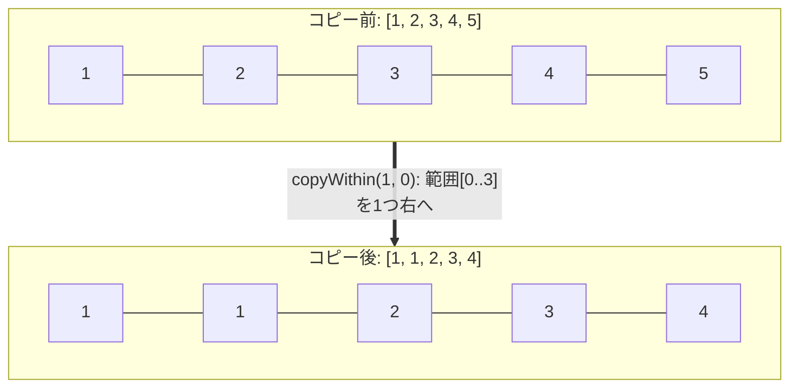
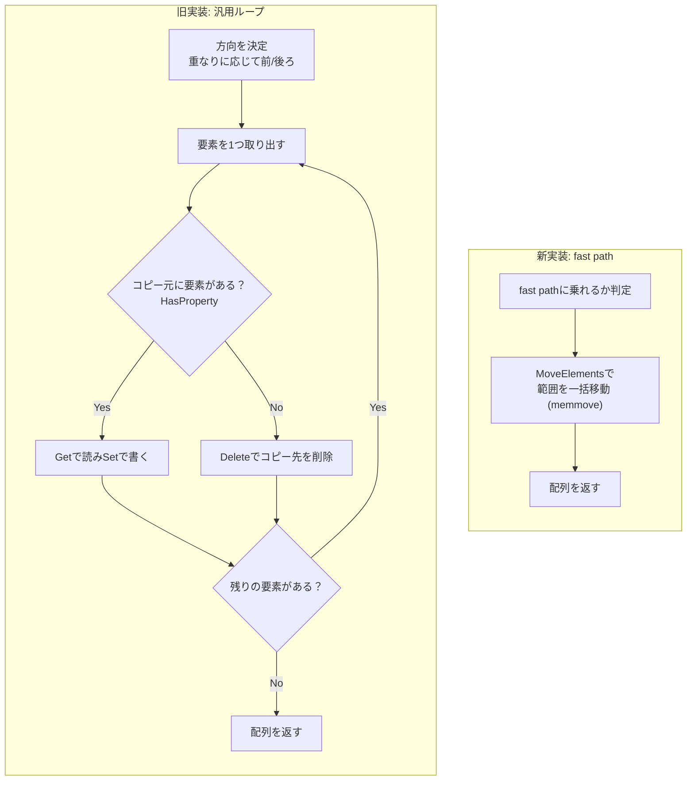
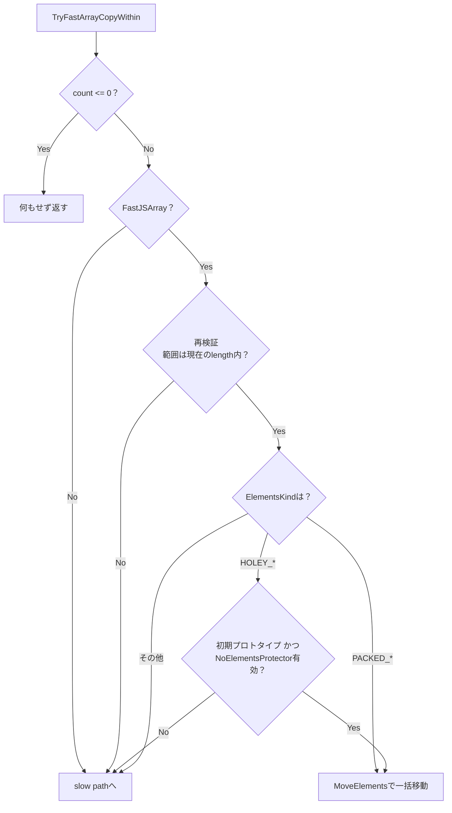

## はじめに

:::message
修正や追加等はコメントまたはGitHubで編集リクエストをお待ちしております。
:::

ダイニーで一番若いエンジニアのriya amemiya(21歳)です。
これまで `Array.prototype.flat` を2度にわたって高速化した記事を書いてきましたが、今回は別のメソッド `Array.prototype.copyWithin`（以下 `copyWithin`）を高速化しました。

パッチはこちらです。

https://chromium-review.googlesource.com/c/v8/v8/+/7951657

レビューはOlivier FlückigerさんとIgor Sheludkoさんが担当してくれました。
この場を借りて、深く感謝を申し上げます。

今回も前回までと同じく、ElementsKindというV8内部の型表現が高速化の鍵になります。ElementsKindの基礎は `flat` の記事で詳しく書いたので、よければそちらもどうぞ。

https://zenn.dev/dinii/articles/675d47a6c21c83
https://zenn.dev/dinii/articles/e12fbacc8e761c

## TL;DR

Fast JSArrayに対する `copyWithin` を、1回のin-place memmoveで処理するfast pathを追加しました。

- 従来は1要素ずつ `HasProperty`/`Get`/`Set` を呼ぶ汎用ループ
- 新実装はbacking store上の範囲を `MoveElements`（memmove）で一気に移動
- PACKED配列は無条件、HOLEY配列は条件付きでfast pathに乗る
- 条件を満たさない配列は従来のslow pathへフォールバック
- d8実測で最大約450倍

## copyWithinの仕様を理解する

`copyWithin(target, start, end)` は、配列の `start` から `end` までの要素を、同じ配列の `target` の位置へコピーするメソッドです。

```js
[1, 2, 3, 4, 5].copyWithin(0, 3);
// => [4, 5, 3, 4, 5]
```

この例では、インデックス3以降の `[4, 5]` を先頭（インデックス0）へコピーしています。`end` を省略すると配列の末尾までが対象です。負のインデックスは末尾からの相対位置として扱われます。

https://tc39.es/ecma262/#sec-array.prototype.copywithin

`copyWithin` には、最適化する上で重要な性質が3つあります。

1. 配列を破壊的に書き換え、同じ配列を返す（新しい配列は作らない）
2. 配列の `length` は変わらない
3. コピー元とコピー先が同じ配列の中にあるため、範囲が重なりうる

特に3つ目が `copyWithin` を特徴づけています。`slice` や `concat` と違い、コピー元とコピー先が同一のメモリ領域（backing store）の上にあります。

### 範囲が重なるケース

`target` と `start` が近いと、コピー元とコピー先が重なります。

```js
[1, 2, 3, 4, 5].copyWithin(1, 0);
// => [1, 1, 2, 3, 4]
```

インデックス0から4要素 `[1, 2, 3, 4]` を、1つ右のインデックス1へずらしてコピーしています。コピー先 `[1..4]` とコピー元 `[0..3]` が重なっているため、単純に前から1つずつ書いていくと、まだ読んでいない要素を上書きしてしまいます。



仕様では、コピー方向（前から後ろか、後ろから前か）を選んでこの重なりを正しく処理します。`from < to` のときは後ろから、それ以外は前から、という具合です。この方向選択が後で効いてきます。

### holeの扱い

JavaScriptの配列では、要素が存在しないインデックスをhole（穴）と呼びます。`[1, , 3]` のようにリテラルで要素を省略したり、`delete arr[1]` で削除すると生じます。holeは `undefined` とは異なり、プロパティ自体が存在しない状態です。

`copyWithin` はコピー元がholeだった場合、コピー先の要素を削除します。つまりholeはholeのまま移動します。

```js
const a = [0, , 2, , 4];
a.copyWithin(0, 3);
// インデックス3はhole、4は4なので
// => [ <1 empty item>, 4, 2, <1 empty item>, 4 ]
```

「コピー元がholeなら、コピー先を削除する」という挙動が、後でHOLEY配列の扱いを難しくします。holeについては前回の記事でも書いたので、そちらも参考にしてください。

## 従来の実装

従来の `copyWithin` は、仕様のアルゴリズムをほぼそのまま素直に実装したものでした。重なりに応じて方向を決めたあと、要素を1つずつ処理します。

各要素に対して、おおよそ次の処理が走ります。

1. `HasProperty` でコピー元のインデックスに要素があるか確認する
2. あれば `Get` で値を読み、`Set` でコピー先へ書き込む
3. なければ（hole）、`Delete` でコピー先を削除する

この方式は仕様に忠実で、どんな配列に対しても正しく動きます。しかし要素数に比例して `HasProperty`/`Get`/`Set` という汎用的なプロパティ操作が積み重なります。1要素あたりのオーバーヘッドが大きく、大きな配列ほど遅くなります。



## 最適化のアイデア memmoveに任せる

ここで `copyWithin` の本質を思い出します。コピー元もコピー先も、同じ配列の同じbacking storeの上にあります。
配列がFast JSArray（V8が連続したメモリ上に要素を並べている、いわゆる「普通の配列」）であれば、`copyWithin` がやりたいことは「あるメモリ範囲を、同じメモリ内の別の範囲へ移す」だけです。

これはまさに `memmove` が一発でやってくれる操作です。

`memmove` は、コピー元とコピー先が重なっていても正しく動くようにメモリのブロックを移動する低レベルな操作です。`memcpy` は重なりを考慮しませんが、`memmove` は重なりを検出して安全な方向にコピーします。前述の「方向を選んで重なりを処理する」という仕様の手続きは、まさに `memmove` の責務そのものです。

V8にはbacking store上で範囲を移動する `MoveElements` というプリミティブがあり、内部的には `memmove` を呼びます。今回のパッチは、汎用ループの手前で「この配列はfast pathに乗れるか」を判定し、乗れるなら `MoveElements` 1回で済ませます。乗れなければ従来のループにフォールバックします。

これにより、従来ループが要素ごとに払っていたコストも、コピー方向の選択も、まるごと `memmove` に肩代わりさせられます。

## ElementsKindによる場合分け

memmoveで一括移動できるかどうかは、配列のElementsKindで決まります。

ElementsKindはV8が配列の中身の型を追跡する内部ラベルです（詳しくは前回の記事に書きました）。今回のfast pathで重要なのは、PACKED（holeなし）かHOLEY（holeあり）かの違いです。

実装した `TryFastArrayCopyWithin` は、ElementsKindを見て次のように分岐します。



### PACKED配列は無条件でmemmove

`PACKED_SMI_ELEMENTS`、`PACKED_ELEMENTS`、`PACKED_DOUBLE_ELEMENTS` のいずれかであれば、holeが存在しないことが保証されています。holeがなければコピー元の各インデックスには必ず自前の要素があるため、`HasProperty` は常にtrueになり、プロトタイプチェーンを気にする必要がありません。
したがって、これらは無条件で `MoveElements` を呼べます。

```torque
const kind: ElementsKind = array.map.elements_kind;
if (kind == ElementsKind::PACKED_SMI_ELEMENTS ||
    kind == ElementsKind::PACKED_ELEMENTS) {
  array::EnsureWriteableFastElements(array);
  DoMoveElements(UnsafeCast<FixedArray>(array.elements), to, from, count);
} else if (kind == ElementsKind::PACKED_DOUBLE_ELEMENTS) {
  DoMoveElements(
      UnsafeCast<FixedDoubleArray>(array.elements), to, from, count);
}
```

`EnsureWriteableFastElements` は、配列リテラル由来の共有backing store（copy-on-write、COW）を、書き込み前に専用のコピーへ切り替える処理です。COWのまま書き換えると、同じ実体を共有している他の配列まで巻き込んでしまうため、移動の前に一度はがしておきます。`FixedDoubleArray` はCOWにならないため、`PACKED_DOUBLE_ELEMENTS` ではこの処理は不要で、そのまま移動します。

### HOLEY配列は条件付き

`HOLEY_SMI_ELEMENTS`、`HOLEY_ELEMENTS`、`HOLEY_DOUBLE_ELEMENTS` の場合、holeが含まれている可能性があります。ここで先ほどの「コピー元がholeならコピー先を削除する」という仕様を思い出します。つまりholeは「その位置に要素が存在しない」という意味を持ちます。

`MoveElements` はbacking store上のhole表現をそのまま移動するので、holeはholeとして移ります。これは多くの場合は仕様通りなのですが、1つ落とし穴があります。

仕様の `HasProperty` はプロトタイプチェーンまで辿ります。もし `Array.prototype[3]` のようにプロトタイプ側にインデックス要素が設定されていると、配列自身のインデックス3がholeでも `HasProperty` はtrue（プロトタイプ側で発見）を返し、`Get` はその継承値を返します。この場合、コピー先にはholeではなく継承値が書き込まれるべきで、単純にholeを移すmemmoveでは結果が変わってしまいます。

```js
Array.prototype[3] = "INHERITED";
[1, 2, 3, , 5].copyWithin(0, 3);
// インデックス3はholeだが、プロトタイプ側に3があるので
// コピー先には "INHERITED" が入る
// => ["INHERITED", 5, 3, "INHERITED", 5]
```

そこでHOLEY配列では、次の2つを確認してからmemmoveします。

```torque
// For holey kinds a hole must mean "absent" (spec deletes on absent), which
// only holds with the initial prototype and an intact NoElementsProtector.
if (!IsPrototypeInitialArrayPrototype(array.map)) goto Slow;
if (IsNoElementsProtectorCellInvalid()) goto Slow;
```

- `IsPrototypeInitialArrayPrototype` で、配列のプロトタイプが初期状態の `Array.prototype` のままかを確認
- `IsNoElementsProtectorCellInvalid` で、`Array.prototype` や `Object.prototype` にインデックス要素が追加されていないかを確認（NoElementsProtectorという最適化用のフラグ）

どちらかが崩れていれば、holeが継承値として観測されうる状態なので、安全のためslow pathへフォールバックします。条件を満たしていれば、holeは確実に「要素が存在しない」を意味するため、そのままmemmoveで移動できます。

PACKEDとHOLEYで、一括移動の可否は次のように整理できます。

| ElementsKind | holeの有無 | 一括memmove |
| --- | --- | --- |
| `PACKED_SMI_ELEMENTS` | なし | 無条件で可 |
| `PACKED_ELEMENTS` | なし | 無条件で可 |
| `PACKED_DOUBLE_ELEMENTS` | なし | 無条件で可 |
| `HOLEY_SMI_ELEMENTS` | ありうる | 初期プロトタイプ＋protector有効なら可 |
| `HOLEY_ELEMENTS` | ありうる | 初期プロトタイプ＋protector有効なら可 |
| `HOLEY_DOUBLE_ELEMENTS` | ありうる | 初期プロトタイプ＋protector有効なら可 |

## ユーザーコードによる副作用と再検証

もう1つ、fast pathが気をつけているのが引数の評価に伴う副作用です。

`copyWithin(target, start, end)` の各引数は、内部で `ToInteger` による数値変換を受けます。引数がオブジェクトだと、この変換の過程で `valueOf` が呼ばれ、任意のユーザーコードが走ります。そのコードが配列を縮めたり、ElementsKindを変えたりするかもしれません。

```js
const arr = [1, 2, 3, 4, 5, 6, 7, 8, 9, 10];
const evil = { valueOf() { arr.length = 3; return 5; } };
arr.copyWithin(0, evil); // startの評価中にlengthが3へ縮む
```

つまり、`to`/`from`/`count` を計算し終えた時点と、実際にmemmoveする時点で、配列の状態が食い違う可能性があります。そのままmemmoveすると、確保されている範囲の外を読み書きしてしまいかねません。

そこでfast pathは、移動の直前にもう一度、現在の `length` に対してインデックスを検証します。

```torque
// The ToInteger coercions in the caller may have run user code that shrank
// the array, so re-validate the clamped indices against the current length.
const length: Smi = array.length;
if (SmiAbove(to + count, length)) goto Slow;
if (SmiAbove(from + count, length)) goto Slow;
```

`SmiAbove` は符号なし比較で、`to + count` や `from + count` が現在の長さを超えていればfast pathを諦めます。これにより、`valueOf` が配列を縮めても範囲外アクセスは起きず、安全にslow pathへ退避します。

## 実装全体

ここまでの判定をまとめると、`TryFastArrayCopyWithin` は次のような構造です。

```torque
macro TryFastArrayCopyWithin(
    implicit context: Context)(receiver: JSAny, toNumber: Number,
    fromNumber: Number, countNumber: Number): void labels Slow {
  // Nothing to copy.
  if (countNumber <= 0) return;

  const array: FastJSArray = Cast<FastJSArray>(receiver) otherwise Slow;

  // ToInteger may have shrunk the array; re-validate against current length.
  const to: Smi = Cast<Smi>(toNumber) otherwise Slow;
  const from: Smi = Cast<Smi>(fromNumber) otherwise Slow;
  const count: Smi = Cast<Smi>(countNumber) otherwise Slow;
  const length: Smi = array.length;
  if (SmiAbove(to + count, length)) goto Slow;
  if (SmiAbove(from + count, length)) goto Slow;

  const kind: ElementsKind = array.map.elements_kind;
  if (kind == ElementsKind::PACKED_SMI_ELEMENTS ||
      kind == ElementsKind::PACKED_ELEMENTS) {
    array::EnsureWriteableFastElements(array);
    DoMoveElements(UnsafeCast<FixedArray>(array.elements), to, from, count);
  } else if (kind == ElementsKind::PACKED_DOUBLE_ELEMENTS) {
    DoMoveElements(
        UnsafeCast<FixedDoubleArray>(array.elements), to, from, count);
  } else if (IsFastElementsKind(kind)) {
    if (!IsPrototypeInitialArrayPrototype(array.map)) goto Slow;
    if (IsNoElementsProtectorCellInvalid()) goto Slow;

    if (kind == ElementsKind::HOLEY_DOUBLE_ELEMENTS) {
      DoMoveElements(
          UnsafeCast<FixedDoubleArray>(array.elements), to, from, count);
    } else {
      array::EnsureWriteableFastElements(array);
      DoMoveElements(UnsafeCast<FixedArray>(array.elements), to, from, count);
    }
  } else {
    goto Slow;
  }
}
```

呼び出し側の `ArrayPrototypeCopyWithin` は、仕様通りに `to`/`from`/`count` を計算したあと、汎用ループの手前で `TryFastArrayCopyWithin` を試します。

```torque
// Fast JSArrays: one in-place memmove. Bail to the generic loop below.
try {
  TryFastArrayCopyWithin(receiver, to, from, count) otherwise Slow;
  return object;
} label Slow {}
```

成功すればそのまま配列を返し、`otherwise Slow` に落ちれば従来の汎用ループへ進みます。fast pathは「楽観的だが安全」という方針で、前提が崩れた瞬間にいつでもslow pathへ退避する設計です。

## ベンチマーク

d8（arm64.release、pointer compression有効）で計測しました。1M要素の配列に対し、重なりのない `copyWithin(0, N/2)` と重なりのある `copyWithin(1, 0)` を、ウォームアップ後にbest-of-8で計測しています。`generic` がfast path導入前のmain、`fast path` が導入後です。

| ケース | generic (導入前) | fast path (導入後) | 速度比 |
| --- | --- | --- | --- |
| packed smi | 10.79 ms | 0.0248 ms | 約435x |
| packed double | 11.94 ms | 0.0505 ms | 約237x |
| packed object | 11.01 ms | 0.0249 ms | 約442x |
| holey smi | 11.04 ms | 0.0245 ms | 約451x |
| holey double | 12.50 ms | 0.0502 ms | 約249x |
| packed smi (overlap) | 21.61 ms | 0.0629 ms | 約344x |
| packed double (overlap) | 24.06 ms | 0.1257 ms | 約191x |

数値配列でもオブジェクト配列でも、PACKED/HOLEYを問わず2桁から3桁の高速化になりました。1要素ずつのプロパティ操作が、まるごと1回のmemmoveに置き換わるためです。

doubleがsmi/objectより遅めなのは、1要素8バイトで移動量が倍だからです。
重なりありの2ケースが絶対値で大きいのは、`copyWithin(1, 0)` がほぼ全要素（count ≈ N）を動かすのに対し、重なりなしの `copyWithin(0, N/2)` は半分（count ≈ N/2）しか動かさないためです。要素数が約2倍なので、移動時間もおおよそ2倍になります。

:::message
計測環境やマシンのウォームアップ状態によって誤差があります。あくまで個人のPCで計測した一例です。
:::

:::details d8で実行した計測コード

```js
// Array.prototype.copyWithin benchmark across element kinds.
const N = 1000000;
let sink;

function packedSmi() { let a = []; for (let i = 0; i < N; i++) a[i] = i; return a; }
function packedDbl() { let a = []; for (let i = 0; i < N; i++) a[i] = i + 0.5; return a; }
function packedObj() { let a = []; for (let i = 0; i < N; i++) a[i] = "x" + i; return a; }
function holeySmi() { let a = new Array(N); for (let i = 0; i < N; i++) a[i] = i; return a; }
function holeyDbl() { let a = new Array(N); for (let i = 0; i < N; i++) a[i] = i + 0.5; return a; }

function bench(label, make, target, start) {
  for (let i = 0; i < 5; i++) { let a = make(); a.copyWithin(target, start); sink = a; }
  let best = Infinity;
  for (let r = 0; r < 8; r++) {
    let a = make();
    const t0 = performance.now();
    for (let i = 0; i < 15; i++) a.copyWithin(target, start);
    const t1 = performance.now();
    const ms = (t1 - t0) / 15;
    if (ms < best) best = ms;
    sink = a;
  }
  print(label.padEnd(24) + best.toFixed(4).padStart(11) + " ms/op");
}

bench("packed smi", packedSmi, 0, N >> 1);
bench("packed double", packedDbl, 0, N >> 1);
bench("packed object", packedObj, 0, N >> 1);
bench("holey smi", holeySmi, 0, N >> 1);
bench("holey double", holeyDbl, 0, N >> 1);
bench("packed smi overlap", packedSmi, 1, 0);
bench("packed double overlap", packedDbl, 1, 0);
```

:::

## おわりに

`copyWithin` は「同じ配列の中で範囲を移す」というメソッドで、その本質はmemmove 1回に集約できます。Fast JSArrayであることと、HOLEYならhole＝absentが保たれていることを確認したうえで、`MoveElements` に丸ごと任せました。PACKEDは無条件、HOLEYは初期プロトタイプとNoElementsProtectorを条件に、汎用ループを1回のmemmoveへ置き換えています。

V8へのコントリビューションに興味がある方は、以下も参考になります。

https://zenn.dev/riya_amemiya/articles/44e6ed7d381304
https://blog.jxck.io/entries/2024-03-26/chromium-contribution.html
https://chromium.googlesource.com/chromium/src/+/lkgr/docs/contributing.md
