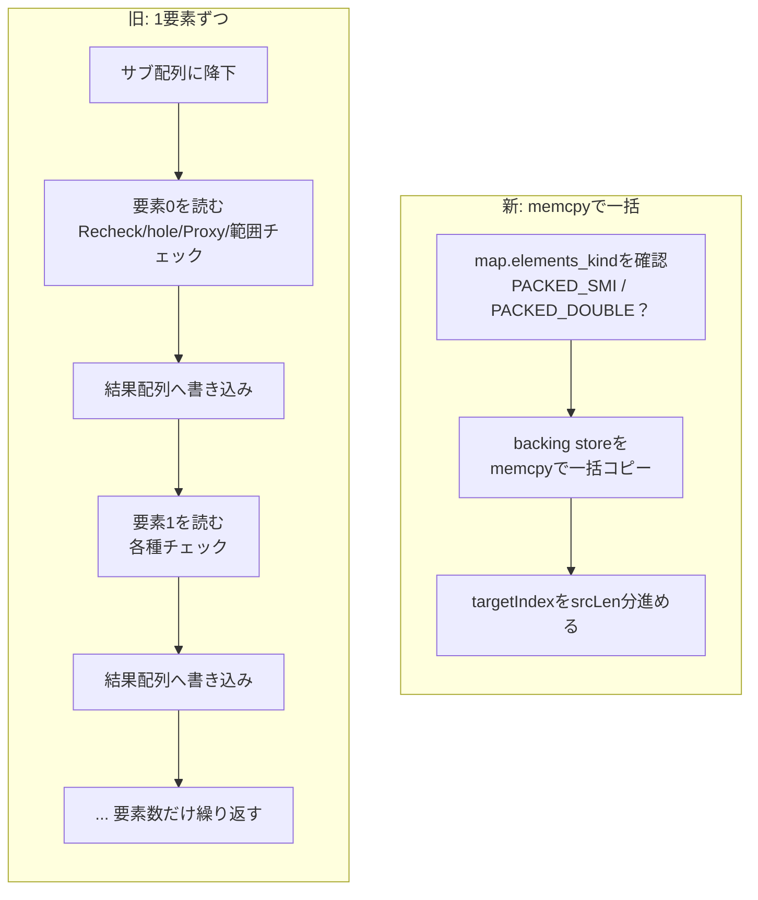
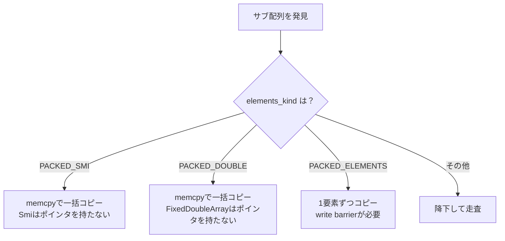

## はじめに

:::message
修正や追加等はコメントまたはGitHubで編集リクエストをお待ちしております。
:::

ダイニーで一番若いエンジニアのriya amemiya(21歳)です。
以前、V8の `Array.prototype.flat`（以下 `flat`）を2パス方式で高速化したという記事を書きました。

https://zenn.dev/dinii/articles/675d47a6c21c83

今回はその続編です。
2パス方式で最大約5倍になった `flat` を、サブ配列のバルクコピーによってさらに約5倍高速化しました。
2つの最適化を合わせると、何も最適化していなかった頃と比べて約20倍の速度になります。

パッチはこちらです。

<!-- TODO: マージ後にGerritのCL URLを記載する -->

レビューは前回に引き続きOlivier Flückigerさんが担当してくれました。
丁寧なレビューに、この場を借りて深く感謝を申し上げます。

本稿では、今回追加したバルクコピーの仕組みと、レビューを通じて実装がどう磨かれていったのかを残します。

## TL;DR

前回の2パス方式では、第2パスのコピーを1要素ずつ行っていました。
今回はリーフ階層のPacked数値サブ配列に対して、backing storeをまるごと `memcpy` でコピーするショートカットを追加しました。

- リーフのPacked数値サブ配列: 1要素ずつコピー → `memcpy` で一括コピー
- `FixedDoubleArray` の確保: hole埋めの `memset` を省略
- Recheckの呼び出し: 要素ごと → 配列ごと（巻き上げ）

## 前回のおさらい

前回のパッチで、`flat` のfast pathは2パス方式になりました。

第1パスで結果配列の正確な長さと最適なElementsKindを計算し、第2パスでそのサイズの配列を一度だけ確保して要素を書き込みます。
これにより、従来の「空配列に1要素ずつ追加して何度も再割り当てする」という非効率を解消しました。

ElementsKindの復習もしておきます。
V8は配列の要素がどんな値かを `PACKED_SMI_ELEMENTS`、`PACKED_DOUBLE_ELEMENTS`、`PACKED_ELEMENTS` などの型分類で追跡しています。
重要なのは、`PACKED_SMI_ELEMENTS` と `PACKED_DOUBLE_ELEMENTS` の配列には数値しか入っておらず、holeもサブ配列もProxyも存在し得ないという性質です。
この性質が、今回のバルクコピーの安全性を支えています。

## 残っていた非効率

前回の第2パスは、ネストを明示的なスタックで辿りながら、リーフ要素を1つずつ結果配列へ書き込む実装でした。

```torque
if (currentDepth > 0 && Is<JSArray>(element)) {
  // サブ配列なら降下する
  ...
}
...
// リーフ要素を1つずつ書き込む
vector.StoreResult(targetIndex, element);
targetIndex++;
index++;
```

`[[1, 2, 3], [4, 5, 6]].flat()` のようなケースを考えます。
サブ配列 `[1, 2, 3]` は `PACKED_SMI_ELEMENTS` なので、中身は連続したSmiが並んだ `FixedArray` です。
それを結果配列へ移すとき、本来であればメモリ上のブロックをそのままコピーすれば済みます。

ところが前回の実装では、サブ配列に降下したうえで `1`、`2`、`3` を1要素ずつ読み書きしていました。
各要素ごとにwitnessのRecheck、holeチェック、Proxyチェック、書き込み先の範囲チェックが走るため、純粋なコピー以外のオーバーヘッドが要素数に比例して積み重なります。

## 今回の核心: バルクコピー

そこで今回は、サブ配列がPackedな数値配列のとき、backing storeをまるごとコピーするショートカットを追加しました。

V8には `TorqueCopyElements` というプリミティブがあり、その実体は `CodeStubAssembler::CopyElements` です。
これはbacking store同士のメモリブロックを `libc` の `memcpy` で一括コピーします。

```cpp
// src/codegen/code-stub-assembler.cc
TNode<ExternalReference> memcpy =
    ExternalConstant(ExternalReference::libc_memcpy_function());
CallCFunction(memcpy, MachineType::Pointer(),
              std::make_pair(MachineType::Pointer(), dst_data_ptr),
              std::make_pair(MachineType::Pointer(), source_data_ptr),
              std::make_pair(MachineType::UintPtr(), source_byte_length));
```

Smiサブ配列に対する最終的な実装は次の通りです。

```torque
const subArray: JSArray = UnsafeCast<JSArray>(element);

// Packed Smi sub-array: bulk copy via memcpy.  Smi
// values carry no heap pointer, so write barriers are not required.
if (subArray.map.elements_kind == ElementsKind::PACKED_SMI_ELEMENTS) {
  const srcElements: FixedArray = Cast<FixedArray>(subArray.elements)
      otherwise goto Bailout;
  const srcLen: Smi = Cast<Smi>(subArray.length) otherwise goto Bailout;
  const newIdx: Smi = math::TrySmiAdd(targetIndex, srcLen)
      otherwise goto Bailout;
  if (Convert<intptr>(newIdx) > vector.fixedArray.length_intptr) {
    goto Bailout;
  }
  TorqueCopyElements(
      vector.fixedArray, SmiUntag(targetIndex), srcElements, 0,
      SmiUntag(srcLen));
  targetIndex = newIdx;
  index++;
  continue;
}
```

サブ配列に降下せず、`subArray.length` 分のブロックを一気に結果配列へコピーして、`targetIndex` をまとめて進めます。
`PACKED_DOUBLE_ELEMENTS` のサブ配列についても、同じ要領で `FixedDoubleArray` をコピーします。

下の図は、サブ配列1つを処理するときの違いを表したものです。



## なぜ数値配列だけ memcpy できるのか

ここで重要なのが、`memcpy` を使えるのが `PACKED_SMI_ELEMENTS` と `PACKED_DOUBLE_ELEMENTS` に限られるという点です。

V8のGCは、ヒープ上のオブジェクトへのポインタが書き込まれた場所をwrite barrierという仕組みで追跡しています。
オブジェクトを格納するスロットへ単純な `memcpy` で書き込むと、このwrite barrierが発行されず、GCがポインタを見失ってクラッシュやメモリ破壊の原因になります。

- `PACKED_SMI_ELEMENTS`: 要素はSmi（タグ付き小整数）であり、ヒープポインタを含まない。write barrierは不要なので `memcpy` できる
- `PACKED_DOUBLE_ELEMENTS`: `FixedDoubleArray` は生の `float64` を並べた配列で、タグ付きポインタを一切含まない。これもwrite barrierは不要
- `PACKED_ELEMENTS`: 文字列やオブジェクトへのタグ付きポインタを含む。`memcpy` ではwrite barrierが飛ばされてしまうため安全でない

つまり、数値しか入っていないことが型レベルで保証されている2種類だけが、write barrierを気にせず一括コピーできるというわけです。

なお、`PACKED_ELEMENTS` をどう扱うかはレビューで議論になりました。後述します。

## もう一つの最適化: hole埋め memset の省略

バルクコピーとは別に、`FixedDoubleArray` の確保方法にも手を入れました。

`PACKED_DOUBLE_ELEMENTS` の結果配列を確保するとき、前回は `AllocateFixedDoubleArrayWithHoles` を使っていました。
このマクロは、確保したスロット全てをholeのsentinel値で `memset` します。
書き込まれないスロットがあってもゴミを読まないようにするための初期化です。

しかし2パス方式では、第1パスで結果長を正確に数えているため、全てのスロットが第2パスで必ず書き込まれます。
つまりhole埋めの `memset` は完全に無駄な処理です。

そこで、`AllocateFixedArray` で同じサイズのバッファだけを確保し、`FixedDoubleArray` として扱うことで初期化を省きました。

```torque
// AllocateFixedDoubleArrayWithHoles memsets every slot to the hole
// sentinel, but flattenedLength is exact so every slot will be
// written.  Use AllocateFixedArray to skip the redundant memset.
const doubleElements: FixedDoubleArray =
    UnsafeCast<FixedDoubleArray>(AllocateFixedArray(
        ElementsKind::PACKED_DOUBLE_ELEMENTS, SmiUntag(flattenedLength)));
```

`AllocateFixedArray` はmapと長さだけを書き込み、要素スロットは初期化しません。
この「確保したバッファをそのまま使う」手法は、`Array.prototype.toReversed` の実装などV8内でも使われている定石です。

## レビューでの変遷

ここからは、最初にpushした実装が、レビューを通じてどう変わっていったのかを紹介します。

### 二重キャストの解消

最初の実装では、`nextDepth == 0` の判定のなかで `element` を `JSArray` にキャストし、ブロックの中で改めて同じキャストをしていました。

```torque
// 最初の実装
if (nextDepth == 0 &&
    UnsafeCast<JSArray>(element).map.elements_kind ==
        ElementsKind::PACKED_DOUBLE_ELEMENTS) {
  const subArray: JSArray = UnsafeCast<JSArray>(element);
  ...
```

Olivierさんから「ifの上でキャストを取り出せば二度キャストしなくて済む」という指摘をもらい、先にキャストしてから判定する形に直しました。

```torque
// 修正後
const subArray: JSArray = UnsafeCast<JSArray>(element);

if (subArray.map.elements_kind ==
    ElementsKind::PACKED_DOUBLE_ELEMENTS) {
  ...
```

### Recheckの巻き上げ

走査ループの先頭では、配列の構造が変わっていないことを確認するため `fastOW.Recheck()` を呼んでいます。
最初の実装は、これを内側ループの要素ごとに呼んでいました。

Olivierさんから「これも巻き上げられるはず」という指摘があり、3つのループ全てでRecheckを内側ループの外へ移しました。

```torque
// 修正後: 配列ごとに1回だけRecheckする
while (true) {
  // Rechecking once per array is enough: nothing in the inner loop
  // invokes JS.
  fastOW.Recheck() otherwise goto Bailout;

  while (index < currentLength) {
    if (index >= fastOW.Get().length) goto Bailout;
    ...
```

これが安全なのは、内側ループのなかでJSのコードが一切実行されないからです。
副作用を生み得るケース、たとえばサブ配列への降下やProxyの検出は、いずれも内側ループを抜けるかBailoutするように作られています。
そのため、配列が変わるたびにRecheckされれば、1つの配列を走査している間はwitnessが有効なままです。
要素ごとのmap比較を省けるぶん、走査が軽くなります。

### PACKED_ELEMENTSをめぐる議論

一番議論が続いたのが、`PACKED_ELEMENTS` のサブ配列をバルクコピーの対象に含めるかどうかでした。

最初の実装では `PACKED_SMI_ELEMENTS` と `PACKED_ELEMENTS` の両方を `memcpy` の対象にしていました。
しかしOlivierさんから「それはwrite barrierを飛ばすので安全でない」という指摘を受けました。

そこで一度は、`PACKED_SMI_ELEMENTS` は `memcpy` のまま残し、`PACKED_ELEMENTS` はwrite barrierが発行される1要素ずつのストアループに変更しました。
これに対してOlivierさんは「むしろそのケースは消してしまった方がよい。利得もわずかに見える」と提案しました。

実際にローカルで測ると `PACKED_ELEMENTS` のループ化でも約30%速くなっていたため、その数字を共有しました。
Olivierさんから「思ったより大きいね。その時間はどこで使われているの？」と質問があり、調べた内容を返しました。
時間の大半は、降下パスが要素ごとに走らせている事務処理でした。
要素ごとのwitness Recheck、`LoadElementNoHole` でのholeチェック、Proxyチェック、書き込み先の範囲チェックなどです。
ループ上の型チェックで穴がないことが保証済みなら、`dst[i] = src[i]` だけで済むはずだ、という話をしました。

ここでOlivierさんから、速いケースを前半のループで先に処理し、遅いケースだけ外側で処理する構造案が出ました。

```text
while (index < currentLength) {
  for (...) {
    if (NotSimpleCase) break;
    element = Load(...);
    vector.StoreResult(index, element);
  }
  if (index == currentLength) break;
  handleComplicatedCase
  index++;
}
```

一度はこの方針で書き換えたのですが、両方の実装を並べて見たOlivierさんが「行ったり来たりさせて申し訳ない。並べてみると、自分が提案した形はかなり読みにくい。前の形の方がよかった」と判断しました。
そして「Recheckの巻き上げは依然として正しいはずだ。副作用が見えるケースはどれも内側ループをBailoutするから」と添えてくれました。

最終的に、ネストループ構造を元に戻しつつRecheckの巻き上げは残し、`PACKED_ELEMENTS` のバルクコピーは削除しました。
今 `memcpy` するのは `PACKED_SMI_ELEMENTS` と `PACKED_DOUBLE_ELEMENTS` だけで、`PACKED_ELEMENTS` は従来通りの1要素ずつのパスに流れます。



### nextDepth == 0 ガードの削除

最初の実装は、バルクコピーを「`nextDepth == 0`、つまり最も深い階層」に限定していました。

Olivierさんから「`nextDepth == 0` も不要だ。Packedな数値サブ配列はさらにサブ配列を含まないので、深さに関係なくリーフだと保証される」という指摘がありました。

確かに `PACKED_SMI_ELEMENTS` や `PACKED_DOUBLE_ELEMENTS` のサブ配列は中身が数値だけなので、残りの深さがいくつであっても、それ以上平坦化しても結果は変わりません。
そのうえ第1パスの長さ計算は、もともと深さに関係なくPacked数値サブ配列を `.length` 加算でリーフ扱いしています。
ガードを外すことで、第2パスのバルクコピー条件が第1パスの数え方と一致し、`[[1, 2, 3]].flat(5)` のように深さ指定が大きいケースでもバルクコピーが効くようになりました。

### 範囲チェックのintptr化

細かい点ですが、コピー後のインデックスが結果配列を超えないかの範囲チェックも変えました。
最初はSmi同士の比較 `newIdx > doubleElements.length` でしたが、`Convert<intptr>(newIdx) > doubleElements.length_intptr` という `intptr` 同士の比較に揃えました。
backing storeの長さは `intptr` で持っているため、Smiへ包み直さずに比較する方が素直です。

## ベンチマーク

手元で計測したところ、バルクコピーによってPacked数値サブ配列を含むケースがさらに約5倍速くなりました。
2パス方式と合わせると、最適化前のV8と比べて約20倍の速度になります。

| 段階 | 相対速度（目安） |
| --- | --- |
| 最適化前のV8 | 1x |
| 2パス方式（前回のパッチ） | 約5x |
| バルクコピー追加（今回のパッチ） | 約20x |

なぜこれほど速くなるかというと、`memcpy` はCPUがメモリ帯域いっぱいに連続コピーできるよう最適化されているからです。
1要素ずつの書き込みでは、要素ごとの分岐や各種チェックがコピー本体に割り込みます。
サブ配列が大きいほど、純粋なコピーに対する付帯処理の割合が下がるため、`memcpy` 化の効果が大きくなります。

:::message
上の倍率は手元環境での目安です。確定したベンチマーク値はマージ後に差し替えます。
:::

## おわりに

前回の2パス方式に続いて、今回はリーフのPacked数値サブ配列をbacking storeごと `memcpy` でコピーするショートカットと、`FixedDoubleArray` のhole埋め `memset` の省略を加えました。
数値しか入らないことが型レベルで保証されたElementsKindだからこそ、write barrierを気にせず一括コピーできるという点が肝です。

レビューでは、二重キャストの解消、Recheckの巻き上げ、`PACKED_ELEMENTS` の扱い、`nextDepth == 0` ガードの削除と、何度もやり取りを重ねました。
読みやすさと安全性のために一緒に悩んでくれたOlivierさんに、改めて感謝します。

V8へのコントリビューションに興味がある方は、以下も参考になります。

https://zenn.dev/riya_amemiya/articles/44e6ed7d381304
https://blog.jxck.io/entries/2024-03-26/chromium-contribution.html
https://chromium.googlesource.com/chromium/src/+/lkgr/docs/contributing.md
