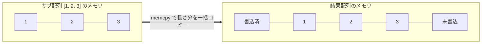
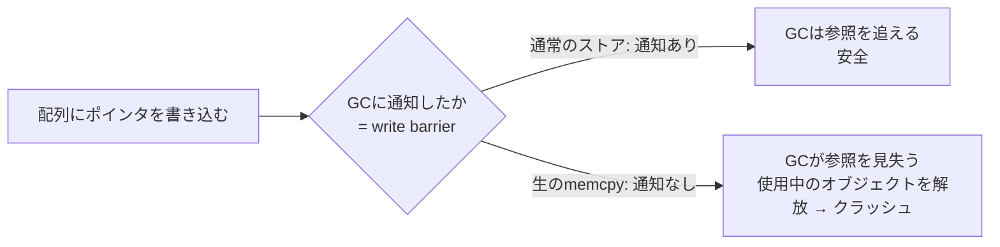
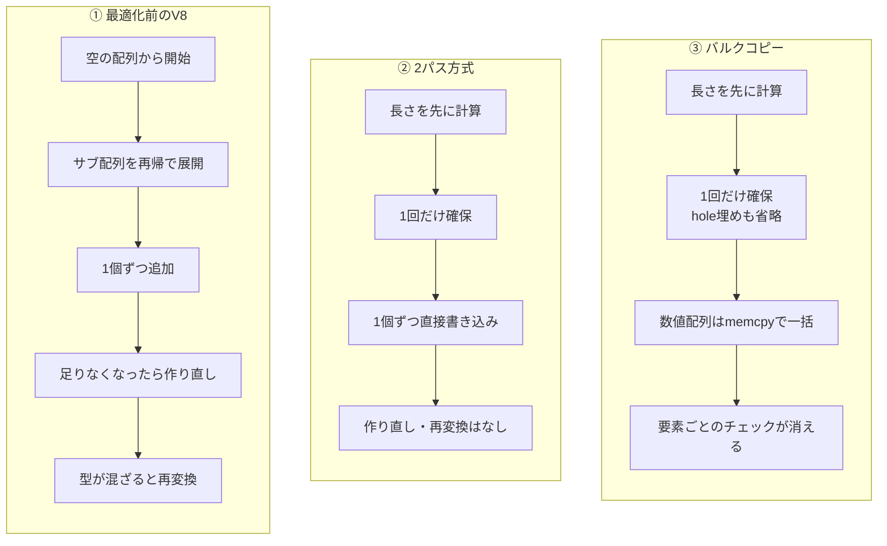
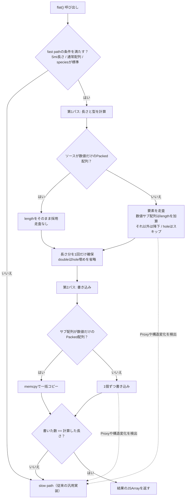
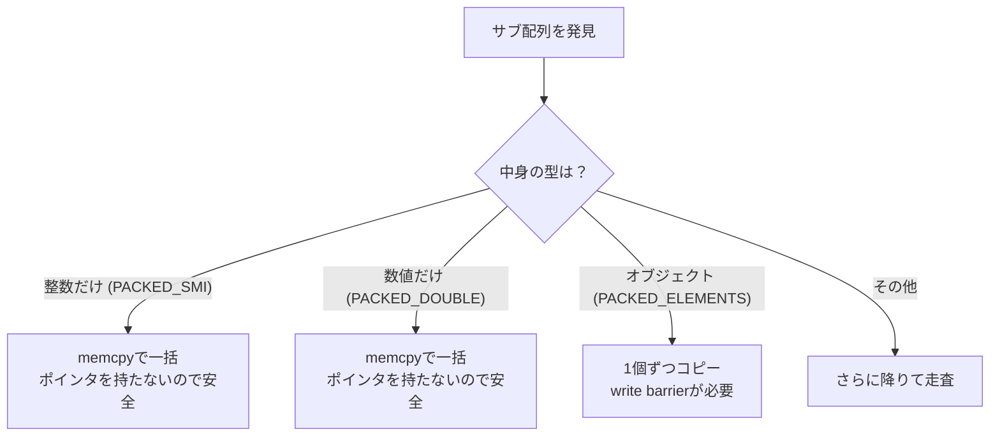

## はじめに

:::message
修正や追加等はコメントまたはGitHubで編集リクエストをお待ちしております。
:::

ダイニーで一番若いエンジニアのriya amemiya(21歳)です。
以前、V8の `Array.prototype.flat`（以下 `flat`）を2パス方式で高速化したという記事を書きました。

https://zenn.dev/dinii/articles/675d47a6c21c83

今回はその続編です。
2パス方式で最大約5倍になった `flat` を、サブ配列の「バルクコピー」でさらに約5倍速くしました。
2つの最適化を合わせると、何も手を入れていなかった頃と比べて約20倍です。

パッチはこちらです。

<!-- TODO: マージ後にGerritのCL URLを記載する -->

レビューは前回に引き続きOlivier Flückigerさんが担当してくれました。

## 先に用語を整理する

この記事で何度も出てくる言葉を、先にまとめておきます。

| 用語 | ざっくり言うと |
| --- | --- |
| backing store | 配列の中身を実際に並べているメモリ領域 |
| Smi | スロットに直接埋め込める小さな整数。ポインタではなく値そのもの |
| ElementsKind | 配列の中身がどんな型かを表すV8内部のラベル |
| PACKED / HOLEY | 配列に隙間（hole）がない状態 / ある状態 |
| hole | 要素が存在しないインデックス。`[1, , 3]` の真ん中など |
| write barrier | ポインタを書いたことをGCに知らせる仕組み |
| memcpy | メモリのブロックをまるごと一気に複製する低レベルな操作 |
| fast path / slow path | 速いが条件付きの経路 / どんな入力でも正しく処理できる経路 |
| bailout | fast pathの前提が崩れたとき、slow pathへ退避すること |
| Torque | V8の組み込み関数を書くための専用言語 |

## TL;DR

今回入れた変更は次の3つです。

| 変更 | 何をしたか | 効果 |
| --- | --- | --- |
| バルクコピー | 数値だけのサブ配列を `memcpy` で一括コピー | 要素ごとの処理がまるごと消える |
| memset省略 | `FixedDoubleArray` のhole埋め初期化をやめる | 無駄な書き込みが消える |
| Recheckの巻き上げ | 安全確認を要素ごと → 配列ごとに減らす | チェック回数が減る |

## 前回のおさらい

前回のパッチで、`flat` のfast pathは「2パス方式」になりました。

- 第1パス: 結果配列の正確な長さと、最適な型（ElementsKind）を先に計算する
- 第2パス: その長さで配列を一度だけ確保し、要素を書き込む

これで、従来の「空配列に1個ずつ足して、足りなくなるたびに作り直す」という無駄が消えました。

今回の主役は、次のElementsKindです。

- `PACKED_SMI_ELEMENTS`: 全要素が整数（Smi）で、隙間なし
- `PACKED_DOUBLE_ELEMENTS`: 全要素が数値（小数を含む）で、隙間なし
- `PACKED_ELEMENTS`: 文字列やオブジェクトを含みうる、隙間なし

数値だけの `PACKED_SMI_ELEMENTS` と `PACKED_DOUBLE_ELEMENTS` には、サブ配列もProxyもholeも入り得ません。
中身が数値だと型レベルで保証される、というこの一点が、今回の高速化の土台になります。

## どこがまだ遅かったのか

2パス方式でも、第2パスのコピーは「1個ずつ」でした。

`[[1, 2, 3], [4, 5, 6]].flat()` を例にします。
サブ配列 `[1, 2, 3]` は数値だけなので、メモリ上では整数が3つ連続して並んでいるだけです。
本来なら、その並びを結果配列へブロックごと移せば済みます。

ところが第2パスは、サブ配列の中へ降りて `1`、`2`、`3` を1個ずつ読み書きしていました。
しかも1要素ごとに、毎回4つの確認が走ります。

- 配列の構造が変わっていないかの再確認（Recheck）
- holeではないかのチェック
- Proxyではないかのチェック
- 書き込み先があふれていないかの範囲チェック

コピー本体より、この付帯チェックのほうが重いくらいです。
そしてサブ配列が大きいほど、チェックの総量も要素数に比例して膨らみます。


## 今回の解決策: バルクコピー

そこで、サブ配列が数値だけのPacked配列なら、backing storeをまるごとコピーするようにしました。

コピーには、最終的に `libc` の `memcpy` を呼ぶV8の `TorqueCopyElements` を使います。
`memcpy` は連続したメモリを一気に複製する操作で、CPUがこの用途に最適化されているため、1個ずつ書くより桁違いに速く動きます。

この近道が踏めるのは、前回の2パス方式のおかげです。
第1パスでコピー先の長さと型を確定させてあるので、第2パスでは配列を作り直す必要も、要素ごとに型をそろえ直す必要もありません。
サブ配列のブロックを、そのまま流し込むだけで済みます。



`[[1, 2, 3], [4, 5, 6]]` なら、6回の個別書き込みが2回のブロックコピーにまとまります。
4つの確認も、サブ配列1つにつき「型の確認」1回だけになります。

実装は次の通りです。

```torque
const subArray: JSArray = UnsafeCast<JSArray>(element);

// Packed Smi sub-array: bulk copy via memcpy.  Smi
// values carry no heap pointer, so write barriers are not required.
if (subArray.map.elements_kind == ElementsKind::PACKED_SMI_ELEMENTS) {
  const srcElements: FixedArray = Cast<FixedArray>(subArray.elements)
      otherwise goto Bailout;
  const srcLen: Smi = Cast<Smi>(subArray.length) otherwise goto Bailout;
  const newIdx: Smi = math::TrySmiAdd(targetIndex, srcLen)
      otherwise goto Bailout;
  if (Convert<intptr>(newIdx) > vector.fixedArray.length_intptr) {
    goto Bailout;
  }
  TorqueCopyElements(
      vector.fixedArray, SmiUntag(targetIndex), srcElements, 0,
      SmiUntag(srcLen));
  targetIndex = newIdx;
  index++;
  continue;
}
```

`PACKED_DOUBLE_ELEMENTS` のサブ配列も、同じ要領で `FixedDoubleArray` をコピーします。

## なぜ「数値配列だけ」一括コピーできるのか

一括コピーが使えるのは `PACKED_SMI_ELEMENTS` と `PACKED_DOUBLE_ELEMENTS` だけで、`PACKED_ELEMENTS` には使えません。
その境目が「write barrier」です。

### write barrierとは何か

V8のGC（ガベージコレクタ）は世代別です。
新しく作られたオブジェクトはまず「若い世代」に置かれ、生き残ったものだけが「古い世代」へ移ります。
若い世代と古い世代は別々のタイミングで掃除されるので、GCは「どのオブジェクトがどのオブジェクトを参照しているか」を取りこぼさず把握しておく必要があります。

そこで、あるオブジェクトのスロットに別のオブジェクトへのポインタを書き込むたび、GCへ「ここに参照ができた」と知らせます。
この通知がwrite barrierで、コンパイラがポインタ書き込みの直後に小さな記録処理を自動で挟みます。

図書館にたとえると、「この資料があの資料を参照している」という関係を台帳に控えておく作業です。
台帳を更新しないまま資料を片付けると、司書（GC）はもう誰も使っていないと勘違いし、まだ参照されている資料を捨ててしまいます。

### memcpyはこの通知を飛ばす

`memcpy` はビット列をそのまま複製するだけで、write barrierを一切発行しません。
中身がポインタだと、GCは新しくできた参照に気づけません。
その結果、まだ使われているオブジェクトを回収し、解放済みメモリへのアクセス（use-after-free）でクラッシュやメモリ破壊を招きます。



### 数値配列にはポインタが無い

| ElementsKind | 中身 | ポインタを含む？ | 一括コピー |
| --- | --- | --- | --- |
| `PACKED_SMI_ELEMENTS` | 小さな整数（Smi） | 含まない（値そのもの） | できる |
| `PACKED_DOUBLE_ELEMENTS` | 生の浮動小数点数 | 含まない | できる |
| `PACKED_ELEMENTS` | 文字列やオブジェクト | 含む（ポインタの配列） | 単純にはできない |

Smiはスロットに値そのものが入っていて、ポインタではありません。
`FixedDoubleArray` も生の `float64` が並ぶだけで、ポインタを含みません。
どちらもwrite barrierが要らないので、迷わず `memcpy` できます。

`PACKED_ELEMENTS` はオブジェクトへのポインタの配列なので、まるごとコピーするとwrite barrierが抜け落ちます。
数値だと型レベルで保証されていることが、安全な一括コピーの前提だったわけです。
この `PACKED_ELEMENTS` の扱いは、レビューで一番もめました。後半で詳しく触れます。

## もう一つの工夫: hole埋めの省略

`FixedDoubleArray` の確保方法にも手を入れました。

前回は `AllocateFixedDoubleArrayWithHoles` で結果配列を確保していました。
これは全スロットを、holeを表す特別な値（`kHoleNanInt64` というNaNのビットパターン）で埋めてから返します。
書き込まれないスロットがあってもゴミを読まないための初期化です。

ところが2パス方式では、第1パスで長さを正確に数えているので、全スロットが第2パスで必ず埋まります。
hole埋めは完全に無駄でした。

そこで、初期化しない `AllocateFixedArray` で同じサイズのバッファだけ確保し、`FixedDoubleArray` として扱うようにしました。
`Array.prototype.toReversed` でも使われている手法です。

| | 前回 | 今回 |
| --- | --- | --- |
| 確保 | `AllocateFixedDoubleArrayWithHoles` | `AllocateFixedArray` |
| hole埋め | 全スロットを初期化 | しない |
| 正しさ | 常に安全 | 全スロットを必ず書くので安全 |

## 最初の状態からどこまで処理が減ったのか

同じ `[[1, 2, 3], [4, 5, 6]].flat()` を、最適化前のV8、前回の2パス方式、今回のバルクコピーで比べます。

| 観点 | ① 最適化前のV8 | ② 2パス方式（前回） | ③ バルクコピー（今回） |
| --- | --- | --- | --- |
| 結果配列の確保 | 足りなくなるたびに作り直し | 長さを数えて1回だけ | 1回だけ（doubleはhole埋めも省略） |
| サブ配列の処理 | 再帰で降りて1個ずつ追加 | 1個ずつ直接書き込み | 数値配列は `memcpy` で一括 |
| ElementsKindの再変換 | 起こり得る | なし | なし |
| 要素ごとのチェック | あり | あり | 数値配列では消える |
| 速度の目安 | 1x | 約5x | 約20x |

3つの流れを並べると次のようになります。



段階ごとに、何が消えていったのかを積み上げると次の通りです。


:::details fast path全体の流れ（詳しい版）
fast path全体を1枚にすると次の通りです。
条件を満たさない入力は、どこからでもslow path（従来の汎用実装）へ退避します。


:::

## どんなときに効くのか

効果はサブ配列の形で決まります。

| サブ配列の形 | バルクコピー | 理由 |
| --- | --- | --- |
| 数値だけ（`[[1, 2], [3, 4]]`） | 効く | ポインタが無く丸ごと運べる |
| オブジェクト（`[[obj], [obj]]`） | 効かない | write barrierが要るので個別コピー |
| holeを含む（`[[1, , 3]]`） | 効きにくい | holeを飛ばすため個別に走査する |
| Proxyを含む | 効かない | そもそもfast pathに入れずslow pathへ |

数値だけのサブ配列が一番おいしいケースで、しかもサブ配列が大きいほど得をします。

## レビューでどう磨かれたか

最初にpushした実装は、レビューでだいぶ形を変えました。

### Recheckの巻き上げ

走査ループの先頭では、配列の構造が変わっていないかを `Recheck` で確認します。
中身は、配列のmapが変わっていないか、プロトタイプチェーンに要素が割り込んでいないかの確認です。
最初の実装は、これを「要素ごと」に呼んでいました。

Olivierさんの「これは巻き上げられるはず」という指摘を受け、確認を「配列ごとに1回」へ移しました。

安全な理由は、内側ループの中ではJSのコードが一切動かないからです。
副作用が起きうる場面、たとえばサブ配列への降下やProxyの検出は、いずれもループを抜けるかbailoutします。
配列が切り替わるたびに確認すれば、1つの配列を走る間はずっと安全が保たれます。

### PACKED_ELEMENTSをどうするか（最大の議論）

一番もめたのが、`PACKED_ELEMENTS`（オブジェクトの配列）を一括コピーの対象に含めるかでした。

最初の実装は `PACKED_SMI_ELEMENTS` と `PACKED_ELEMENTS` の両方を対象にしていましたが、後者はポインタの配列です。
Olivierさんから「それはwrite barrierを飛ばすので安全でない」という指摘が入りました。

一度は、`PACKED_SMI_ELEMENTS` は一括のまま残し、`PACKED_ELEMENTS` はwrite barrier付きの1個ずつのストアに変えました。
これにOlivierさんは「むしろそのケースは消した方がよい。利得もわずかに見える」と返しました。

実はポインタ配列では、一括コピーにしても速くなりにくい事情があります。
V8のコピー処理は、コピー先が若い世代でマーキング中でない、といった条件が揃ったときだけバリアを省いてまとめてコピーします。
条件が揃わなければ、結局1個ずつバリア付きで書く処理に落ちます。
数値配列のように「いつでも丸ごと」とはいきません。

それでも手元では `PACKED_ELEMENTS` のループ版が約30%速く、その数字を共有しました。
Olivierさんの「思ったより大きいね。その時間はどこで使われているの？」という質問に、調べた結果を返しました。
速くなった正体は `memcpy` ではなく、降下パスが要素ごとに走らせていた4つの確認を省けた分でした。
ループの手前で「holeもサブ配列も無い」と分かっていれば、あとは値を移すだけだからです。

ここでOlivierさんから、速いケースを前半のループで先に処理する構造案が出て、一度はそれで書き換えました。
しかし両方を並べたOlivierさんが「自分の案はかなり読みにくい。前の形の方がよかった」と判断し、元のネストループへ戻しました。
Recheckの巻き上げだけは「副作用が見えるケースはどれもbailoutするから正しいはず」と残しました。

結論として、`memcpy` するのは数値配列の2種類だけにし、`PACKED_ELEMENTS` は従来通り1個ずつのパスへ流すことになりました。



このやり取りで一番効いたのは、「速くなった理由を取り違えない」ことでした。
`memcpy` の効果だと思い込んでいた分は、実は確認の削減でした。
原因を正しく押さえたから、複雑さに見合わない `PACKED_ELEMENTS` の特別扱いを削る判断に踏み切れました。

### 深さ制限の撤廃

最初の実装は、一括コピーを「最も深い階層」だけに限定していました。

Olivierさんから「その限定も要らない。数値だけのPacked配列はサブ配列を含まないので、残りの深さに関係なくリーフだと保証される」という指摘が入りました。

数値だけの配列は、これ以上いくら平坦化しても結果が変わりません。
第1パスの長さ計算も、もともと深さに関係なく、数値サブ配列を走査せず `.length` を足すだけです。
限定を外したことで第2パスの条件が第1パスの数え方とそろい、`[[1, 2, 3]].flat(5)` のように深さ指定が大きい場合にも一括コピーが効くようになりました。

## ベンチマーク

手元の計測では、数値サブ配列を含むケースがバルクコピーでさらに約5倍速くなりました。
2パス方式と合わせると、最適化前のV8と比べて約20倍です。

| 段階 | 相対速度（目安） |
| --- | --- |
| 最適化前のV8 | 1x |
| 2パス方式（前回のパッチ） | 約5x |
| バルクコピー追加（今回のパッチ） | 約20x |

効果はサブ配列が大きいほど伸びます。
1024要素のサブ配列なら、1024回の個別書き込みが1回のコピーに置き換わるからです。
逆にサブ配列が1〜2要素と小さいと、コピーの一括化より型の確認を1回に減らせる効果のほうが大きくなります。

:::message
上の倍率は手元環境での目安です。確定したベンチマーク値はマージ後に差し替えます。
:::

## おわりに

今回は、数値だけのサブ配列を `memcpy` で一括コピーするショートカットと、`FixedDoubleArray` のhole埋めの省略を入れました。
中身が数値だと型レベルで保証されているからこそ、write barrierを気にせず丸ごと運べる、という型の保証がすべての土台です。

レビューでは、Recheckの巻き上げ、`PACKED_ELEMENTS` の扱い、深さ制限の撤廃と何度もやり取りしました。
とくに「速くなった理由を正しく突き止める」過程が、自分にとって大きな学びでした。
丁寧に付き合ってくれたOlivierさんに、改めて感謝します。

V8へのコントリビューションに興味がある方は、以下も参考になります。

https://zenn.dev/riya_amemiya/articles/44e6ed7d381304
https://blog.jxck.io/entries/2024-03-26/chromium-contribution.html
https://chromium.googlesource.com/chromium/src/+/lkgr/docs/contributing.md
