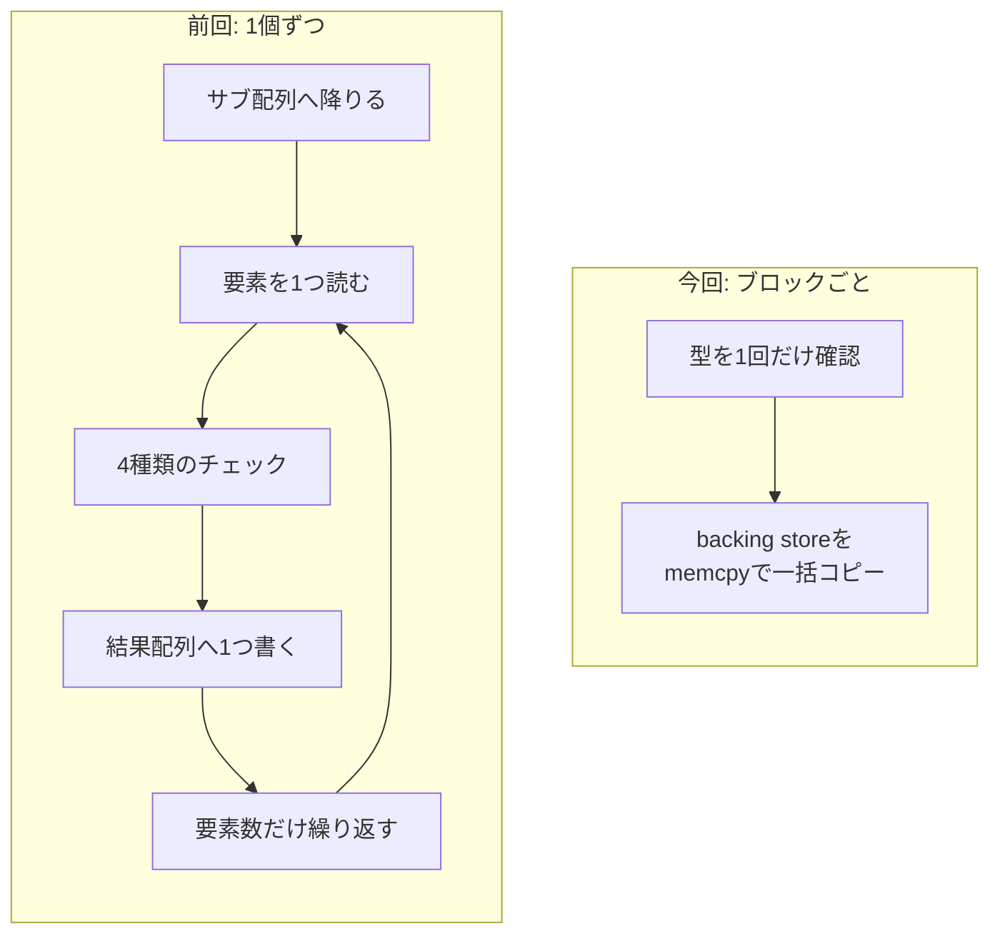
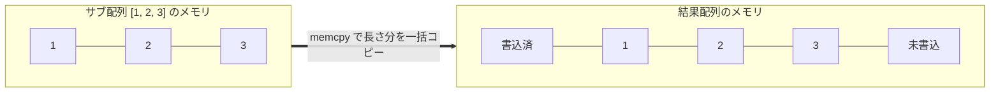
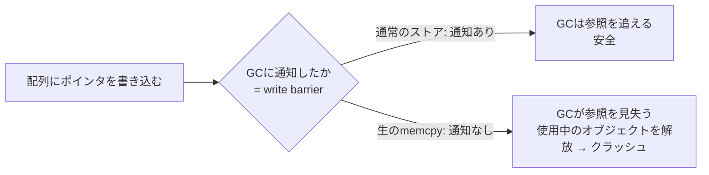
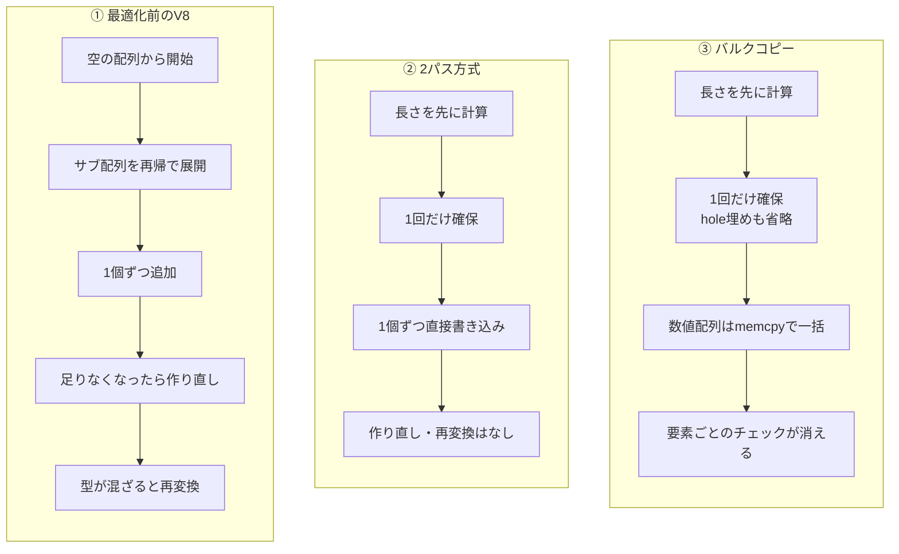
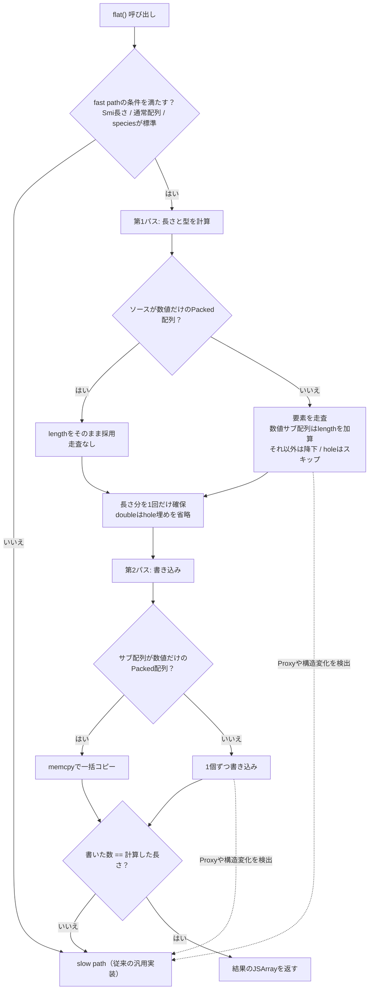
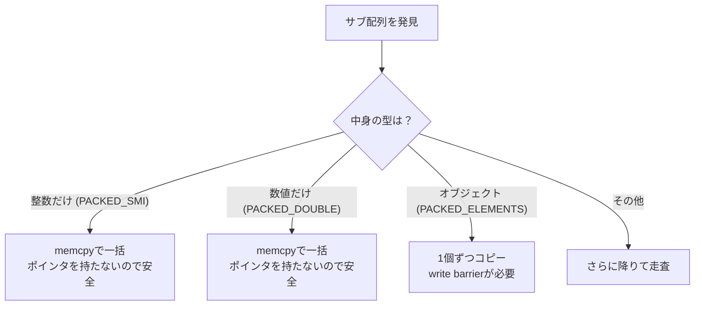

## はじめに

:::message
修正や追加等はコメントまたはGitHubで編集リクエストをお待ちしております。
:::

ダイニーで一番若いエンジニアのriya amemiya(21歳)です。
以前、V8の `Array.prototype.flat`（以下 `flat`）を2パス方式で高速化したという記事を書きました。

https://zenn.dev/dinii/articles/675d47a6c21c83

今回はその続編です。
2パス方式で最大約5倍になった `flat` を、サブ配列の「バルクコピー」によってさらに約5倍速くしました。
2つの最適化を合わせると、何も手を入れていなかった頃と比べて約20倍の速度になります。

パッチはこちらです。

<!-- TODO: マージ後にGerritのCL URLを記載する -->

レビューは前回に引き続きOlivier Flückigerさんが担当してくれました。
今回はとくにレビューでの議論が学びの多いものだったので、その過程も丁寧に残します。

この記事は、V8の内部に詳しくない方でも追えるように、まず用語を整理してから、図と表を中心に解説していきます。
コードも要所で示しますが、説明の本筋は文章と図で進めるので、コードは読み飛ばしても大筋がつかめるように書いています。

## 先に用語を整理する

本文に入る前に、登場する言葉をざっくり押さえておきます。
正確な定義は本文で必要に応じて補います。

| 用語 | ざっくり言うと |
| --- | --- |
| backing store | 配列の中身を実際に格納しているメモリ領域 |
| Smi | 配列のスロットに直接埋め込める小さな整数。ポインタではなく値そのもの |
| ElementsKind | 配列の中身がどんな型かを表すV8内部のラベル |
| PACKED / HOLEY | 配列に隙間（hole）がない状態 / ある状態 |
| hole | 要素が存在しないインデックス。`[1, , 3]` の真ん中など |
| write barrier | GCがポインタの行き先を見失わないための「書き込みの通知」 |
| memcpy | メモリのブロックをまるごと一気に複製する低レベルな操作 |
| fast path / slow path | 速いが条件付きの経路 / どんな入力でも正しく処理できる遅い経路 |
| bailout | fast pathの前提が崩れたとき、slow pathへ安全に退避すること |
| Torque | V8の組み込み関数を書くための専用言語 |

## TL;DR

今回の変更は、ざっくり次の3点です。

| 変更 | 何をしたか | 効果 |
| --- | --- | --- |
| バルクコピー | リーフの数値サブ配列を `memcpy` で一括コピー | 要素ごとの処理が消える |
| memset省略 | `FixedDoubleArray` のhole埋め初期化をやめる | 無駄な書き込みが消える |
| Recheckの巻き上げ | 安全確認を要素ごと → 配列ごとに減らす | チェック回数が減る |

## 前回のおさらい

前回のパッチで、`flat` のfast pathは「2パス方式」になりました。

- 第1パス: 結果配列の正確な長さと、最適な型（ElementsKind）を先に計算する
- 第2パス: その長さで配列を一度だけ確保し、要素を書き込む

これにより、従来の「空配列に1個ずつ足して、足りなくなるたびに作り直す」という無駄をなくしました。

今回の話で重要なのは、ElementsKindの次の性質です。

- `PACKED_SMI_ELEMENTS`: 全要素が整数（Smi）で、隙間なし
- `PACKED_DOUBLE_ELEMENTS`: 全要素が数値（小数を含む）で、隙間なし
- `PACKED_ELEMENTS`: 文字列やオブジェクトを含みうる、隙間なし

数値だけの `PACKED_SMI_ELEMENTS` と `PACKED_DOUBLE_ELEMENTS` には、サブ配列もProxyもholeも入り得ません。
この「中身が数値だと型レベルで保証される」という事実が、今回のバルクコピーを支えています。

## どこがまだ遅かったのか

前回の第2パスは、ネストを辿りながらリーフの値を「1個ずつ」結果配列へ書き込む実装でした。

`[[1, 2, 3], [4, 5, 6]].flat()` を例にします。
サブ配列 `[1, 2, 3]` は数値だけの配列なので、メモリ上では整数が3つ連続して並んでいるだけです。
本来なら、その並びを結果配列へ「ブロックごとそのまま」移せば終わります。

ところが前回の実装は、サブ配列の中へ降りて `1`、`2`、`3` を1個ずつ読んで書いていました。
そして1要素処理するたびに、次の確認が毎回走っていました。

- 配列の構造が変わっていないかの再確認（Recheck）
- holeではないかのチェック
- Proxyではないかのチェック
- 書き込み先があふれていないかの範囲チェック

純粋なコピー以外のこうした事務処理が、要素数に比例して積み上がっていたわけです。



## 今回の解決策: バルクコピー

そこで今回は、サブ配列が「数値だけのPacked配列」のとき、backing storeをまるごとコピーするショートカットを追加しました。

このコピーには、V8が内部に持つ `TorqueCopyElements` を使います。
これは最終的に `libc` の `memcpy` を呼び出し、メモリのブロックを一気に複製します。
CPUが連続コピー向けに最適化されているぶん、1個ずつ書くより圧倒的に速い処理です。

イメージとしては、サブ配列のメモリ領域から結果配列の書き込み位置へ、塊をそのまま流し込むようなものです。



降りて1個ずつ処理する代わりに、サブ配列の長さぶんを一度に書き込み、書き込み位置をまとめて進めます。
これで前述の4種類のチェックが、サブ配列1つにつき1回（型の確認）だけになります。

実際のコードでも、サブ配列がSmiの配列だと分かった時点で `TorqueCopyElements` を呼び、`targetIndex` をまとめて進めるだけです。
細部はV8固有の書き方なので、雰囲気だけ眺めてもらえれば十分です。

```torque
const subArray: JSArray = UnsafeCast<JSArray>(element);

// Packed Smi sub-array: bulk copy via memcpy.  Smi
// values carry no heap pointer, so write barriers are not required.
if (subArray.map.elements_kind == ElementsKind::PACKED_SMI_ELEMENTS) {
  const srcElements: FixedArray = Cast<FixedArray>(subArray.elements)
      otherwise goto Bailout;
  const srcLen: Smi = Cast<Smi>(subArray.length) otherwise goto Bailout;
  const newIdx: Smi = math::TrySmiAdd(targetIndex, srcLen)
      otherwise goto Bailout;
  if (Convert<intptr>(newIdx) > vector.fixedArray.length_intptr) {
    goto Bailout;
  }
  TorqueCopyElements(
      vector.fixedArray, SmiUntag(targetIndex), srcElements, 0,
      SmiUntag(srcLen));
  targetIndex = newIdx;
  index++;
  continue;
}
```

`PACKED_DOUBLE_ELEMENTS` のサブ配列についても、同じ要領で `FixedDoubleArray` をコピーします。

## なぜ「数値配列だけ」一括コピーできるのか

ここがこの記事の山場です。
バルクコピーが使えるのは `PACKED_SMI_ELEMENTS` と `PACKED_DOUBLE_ELEMENTS` だけで、`PACKED_ELEMENTS` には使えません。
その理由が「write barrier」です。

### write barrierとは何か

V8のGC（ガベージコレクタ）は、世代別という方式を採っています。
新しく作られたオブジェクトはまず「若い世代」に置かれ、生き残ったものだけが「古い世代」へ移っていきます。
若い世代と古い世代はばらばらのタイミングで掃除されるので、GCは「どのオブジェクトが、どのオブジェクトを参照しているか」を常に把握しておく必要があります。

そこで、あるオブジェクトのスロットに別のオブジェクトへのポインタを書き込むときは、その都度GCへ「いまここに参照を作ったよ」と知らせます。
この通知がwrite barrierです。
コンパイラがポインタ書き込みの直後に、ごく小さな記録処理を自動で挿入してくれます。

身近なたとえでいうと、図書館で「この資料があの資料を参照している」という関係を台帳に控えておくようなものです。
台帳を更新しないまま資料を片付けると、司書（GC）はもう使われていないと勘違いして、まだ参照されている資料を処分してしまいます。

### memcpyはこの通知を飛ばしてしまう

`memcpy` はメモリのビット列をそのまま複製するだけなので、write barrierを一切発行しません。
中身がポインタだった場合、GCは新しくできた参照に気づけません。
結果として、まだ使われているオブジェクトを回収してしまい、解放済みメモリへのアクセス（use-after-free）でクラッシュやメモリ破壊が起きます。



### だから数値配列だけが安全

ここで型の話が効いてきます。

| ElementsKind | 中身 | ポインタを含む？ | 一括コピー |
| --- | --- | --- | --- |
| `PACKED_SMI_ELEMENTS` | 小さな整数（Smi） | 含まない（値そのもの） | できる |
| `PACKED_DOUBLE_ELEMENTS` | 生の浮動小数点数 | 含まない | できる |
| `PACKED_ELEMENTS` | 文字列やオブジェクト | 含む（ポインタの配列） | 単純にはできない |

Smiはスロットに値そのものが埋め込まれていて、ポインタではありません。
`FixedDoubleArray` は生の `float64` が並んでいるだけで、やはりポインタを含みません。
このため、この2種類はwrite barrierを気にせず `memcpy` できます。

一方 `PACKED_ELEMENTS` はオブジェクトへのポインタの配列です。
単純にブロックコピーするとwrite barrierが飛んでしまうため、安全に運ぶには特別な配慮が要ります。
「中身が数値だと型レベルで保証されている」ことが、迷わず一括コピーできる前提になっているわけです。

なお、この `PACKED_ELEMENTS` をどう扱うかは、レビューで一番の議論になりました。後ほど詳しく書きます。

## もう一つの工夫: hole埋めの省略

バルクコピーとは別に、`FixedDoubleArray` の確保方法にも手を入れました。

前回は `AllocateFixedDoubleArrayWithHoles` という関数で結果配列を確保していました。
これは確保した全スロットを、holeを表す特別な値（`kHoleNanInt64` というNaNのビットパターン）で埋めてから返します。
書き込まれないスロットがあっても、ゴミではなくholeとして読めるようにするための初期化です。

しかし2パス方式では、第1パスで結果長を正確に数えているので、全スロットが第2パスで必ず埋まります。
つまりこのhole埋めは、完全に無駄な書き込みです。

そこで、初期化をしない `AllocateFixedArray` で同じサイズのバッファだけ確保し、それを `FixedDoubleArray` として扱うようにしました。
これは `Array.prototype.toReversed` の実装でも使われている手法です。

コードの上では、確保に使う関数を差し替えただけです。

```torque
// 前回: 全スロットをholeで初期化してから返す
const doubleElements: FixedDoubleArray =
    AllocateFixedDoubleArrayWithHoles(SmiUntag(flattenedLength));

// 今回: 初期化なしのバッファを確保してFixedDoubleArrayとして扱う
const doubleElements: FixedDoubleArray =
    UnsafeCast<FixedDoubleArray>(AllocateFixedArray(
        ElementsKind::PACKED_DOUBLE_ELEMENTS, SmiUntag(flattenedLength)));
```

| | 前回 | 今回 |
| --- | --- | --- |
| 確保 | `AllocateFixedDoubleArrayWithHoles` | `AllocateFixedArray` |
| hole埋め | 全スロットを初期化 | しない |
| 正しさ | 常に安全 | 全スロットを必ず書くので安全 |

## 最初の状態からどこまで処理が減ったのか

ここまでの話を、`[[1, 2, 3], [4, 5, 6]].flat()` という同じ入力で並べて比べてみます。
左から順に、最適化前のV8、前回の2パス方式、今回のバルクコピーです。

| 観点 | ① 最適化前のV8 | ② 2パス方式（前回） | ③ バルクコピー（今回） |
| --- | --- | --- | --- |
| 結果配列の確保 | 足りなくなるたびに作り直し | 長さを数えて1回だけ | 1回だけ（doubleはhole埋めも省略） |
| サブ配列の処理 | 再帰で降りて1個ずつ追加 | 1個ずつ直接書き込み | 数値配列は `memcpy` で一括 |
| ElementsKind遷移 | 起こり得る | なし | なし |
| 要素ごとのチェック | あり | あり | 数値配列では消える |
| 速度の目安 | 1x | 約5x | 約20x |

図にすると次の通りです。
3つを横に並べています。



段階ごとに何が削れたのかを積み上げると、削減の流れはこうなります。


:::details fast path全体の流れ（詳しい版）
fast path全体を1枚にすると次のようになります。
条件を満たさない入力は、どこからでもslow path（従来の汎用実装）へ安全に退避します。


:::

## レビューでどう磨かれたか

ここからは、最初にpushした実装が、レビューを通じてどう変わったかを紹介します。
変更の多くはOlivierさんとのやり取りから生まれました。

### Recheckの巻き上げ

走査ループの先頭では、配列の構造が変わっていないかを `Recheck` で確認します。
これは具体的には、配列のmapが変わっていないか、プロトタイプチェーンに要素が割り込んでいないかの確認です。
最初の実装は、この確認を「要素ごと」に呼んでいました。

Olivierさんから「これは巻き上げられるはず」という指摘があり、確認を「配列ごとに1回」へ移しました。

やったことは、確認を呼ぶ位置を内側ループから外側へ1段上げただけです。

```torque
// 前回: 要素ごとに確認していた
while (index < currentLength) {
  fastOW.Recheck() otherwise goto Bailout;
  // ... 1要素の処理 ...
}

// 今回: 配列ごとに1回だけ確認する
fastOW.Recheck() otherwise goto Bailout;
while (index < currentLength) {
  // ... 1要素の処理 ...
}
```

これが安全なのは、内側ループの中ではJSのコードが一切動かないからです。
副作用が起きうる場面、たとえばサブ配列への降下やProxyの検出は、いずれもループを抜けるかbailoutします。
そのため、配列が切り替わるたびに確認しておけば、1つの配列を走査している間は安全が保たれます。
要素ごとの確認を省けるぶん、走査が軽くなります。

### PACKED_ELEMENTSをどうするか（最大の議論）

一番議論が続いたのが、`PACKED_ELEMENTS`（オブジェクトの配列）をバルクコピーの対象に含めるかどうかでした。
この節は少し技術的になりますが、用語を補いながら追っていきます。

#### 発端: 安全でないコピー

最初の実装は、`PACKED_SMI_ELEMENTS` と `PACKED_ELEMENTS` の両方を一括コピーの対象にしていました。
しかし前述の通り、`PACKED_ELEMENTS` はポインタの配列です。
Olivierさんから「それはwrite barrierを飛ばすので安全でない」という指摘が入りました。

#### 一度はループ化、しかし

そこで、`PACKED_SMI_ELEMENTS` は一括コピーのまま残し、`PACKED_ELEMENTS` はwrite barrierが発行される「1個ずつのストアループ」に変えました。
これに対してOlivierさんは「むしろそのケースは消した方がよい。利得もわずかに見える」と提案しました。

ポインタ配列のコピーは、数値配列ほど単純ではありません。
V8のコピー処理は、コピー先が若い世代にあってマーキング中でない、といった条件が揃ったときだけバリアを省いて一括コピーします。
条件が揃わなければ、結局「1個ずつバリア付きで書く」処理に落ちます。
このため `PACKED_ELEMENTS` は、数値配列のように「いつでも迷わず丸ごとコピー」とはいきません。

#### 30%の高速化はどこから来たのか

実際に手元で測ると、`PACKED_ELEMENTS` をループ化した版でも約30%速くなっていたので、その数字を共有しました。
Olivierさんから「思ったより大きいね。その時間はどこで使われているの？」と質問があり、調べた内容を返しました。

速くなった分の正体は、`memcpy` ではありませんでした。
降下パスが要素ごとに走らせていた事務処理、つまりRecheck、holeチェック、Proxyチェック、範囲チェックを省けたぶんでした。
ループの手前で「holeもサブ配列も無い」と分かっているなら、あとは値を移すだけで済むからです。

#### 構造案の行き来、そして決着

ここでOlivierさんから、速いケースを前半のループで先に処理し、遅いケースだけ外側で処理する構造案が出ました。
一度はその方針で書き換えました。

しかし両方の実装を並べて見たOlivierさんが「行ったり来たりさせて申し訳ない。並べてみると、自分の案はかなり読みにくい。前の形の方がよかった」と判断しました。
そして「Recheckの巻き上げは依然として正しいはずだ。副作用が見えるケースはどれも内側ループをbailoutするから」と添えてくれました。

最終的に、ネストループ構造を元に戻しつつRecheckの巻き上げは残し、`PACKED_ELEMENTS` の一括コピーは削除しました。
いま `memcpy` するのは `PACKED_SMI_ELEMENTS` と `PACKED_DOUBLE_ELEMENTS` だけで、`PACKED_ELEMENTS` は従来通り1個ずつのパスに流れます。



この議論を通して、「速くなった理由を取り違えない」ことの大切さを学びました。
`memcpy` が効くと思っていた部分は、実は事務処理の削減が主因でした。
原因を正しく突き止めたことで、複雑さに見合わないコードを削るという判断に納得して着地できました。

### nextDepth == 0 ガードの削除

最初の実装は、一括コピーを「最も深い階層（これ以上は潜らない場所）」に限定していました。

Olivierさんから「その限定も不要だ。数値だけのPacked配列はサブ配列を含まないので、残りの深さに関係なくリーフだと保証される」という指摘がありました。

確かに数値だけの配列は、これ以上いくら平坦化しても結果は変わりません。
そのうえ第1パスの長さ計算は、もともと深さに関係なく、数値サブ配列を走査せず `.length` 加算で済ませています。
限定を外すことで第2パスの条件が第1パスの数え方と一致し、`[[1, 2, 3]].flat(5)` のように深さ指定が大きいケースでも一括コピーが効くようになりました。

## ベンチマーク

手元で計測したところ、バルクコピーによって、数値サブ配列を含むケースがさらに約5倍速くなりました。
2パス方式と合わせると、最適化前のV8と比べて約20倍の速度です。

| 段階 | 相対速度（目安） |
| --- | --- |
| 最適化前のV8 | 1x |
| 2パス方式（前回のパッチ） | 約5x |
| バルクコピー追加（今回のパッチ） | 約20x |

これほど速くなる理由は2つです。

- `memcpy` はCPUがメモリ帯域いっぱいに連続コピーできるよう最適化されている
- 要素ごとの分岐やチェックがコピー本体から消える

サブ配列が大きいほど、純粋なコピーに対する付帯処理の割合が下がるので、効果も大きくなります。

:::message
上の倍率は手元環境での目安です。確定したベンチマーク値はマージ後に差し替えます。
:::

## おわりに

前回の2パス方式に続いて、今回はリーフの数値サブ配列を `memcpy` で一括コピーするショートカットと、`FixedDoubleArray` のhole埋めの省略を加えました。
「中身が数値だと型レベルで保証されている」からこそ、write barrierを気にせず一括コピーできる、という点が肝です。

レビューでは、Recheckの巻き上げ、`PACKED_ELEMENTS` の扱い、深さ制限の撤廃と、何度もやり取りを重ねました。
とくに「速くなった理由を正しく突き止める」過程は、自分にとって大きな学びでした。
読みやすさと安全性のために一緒に悩んでくれたOlivierさんに、改めて感謝します。

V8へのコントリビューションに興味がある方は、以下も参考になります。

https://zenn.dev/riya_amemiya/articles/44e6ed7d381304
https://blog.jxck.io/entries/2024-03-26/chromium-contribution.html
https://chromium.googlesource.com/chromium/src/+/lkgr/docs/contributing.md
