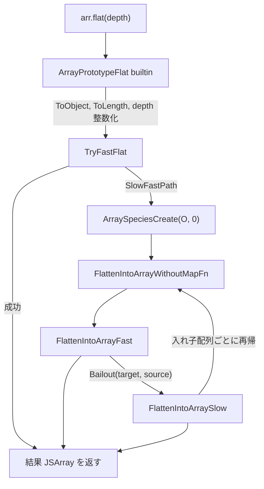

V8 の `Array.prototype.flat` 本体は `src/builtins/array-flat.tq` という 610 行の Torque ファイルに収まっています。エントリポイントから内部マクロまでが一枚で完結する構成です。

## 呼び出しチェーン

JS から呼び出されたあと、fast path → slow path のフォールバックが二段階で発生します。

## 役割の整理

| マクロ / builtin | 役割 |
| --- | --- |
| `ArrayPrototypeFlat` | JS エントリ。仕様前段の正規化と fast path 試行の振り分け |
| `TryFastFlat` | 二パス専用 fast path。レシーバ全体を一括処理 |
| `FlattenIntoArrayWithoutMapFn` | 仕様忠実な再帰下降。各層で fast→slow 二段構成を再起動 |
| `FlattenIntoArrayFast` | 仕様準拠経路の中の fast 区間 |
| `FlattenIntoArraySlow` | `HasProperty` / `GetProperty` を経由する純仕様実装 |

## flat と flatMap の共通化

`flatMap` 側は別エントリの `ArrayPrototypeFlatMap` から入って `FlattenIntoArrayWithMapFn` を経由しますが、dispatcher の `FlattenIntoArray` は flat と共通です。`hasMapper: constexpr bool` というコンパイル時定数で mapper の有無を切り分けるため、`flat` 経路では mapper 関連のコードが Torque の段階で消え、機械語に余計なコストは乗りません。

## 登録箇所

`Array.prototype` への取り付けは `src/init/bootstrapper.cc` の `SimpleInstallFunction` で、`flat` が length 0、`flatMap` が length 1 として並びます。`src/debug/debug-evaluate.cc` には両 builtin が副作用フリーとして登録されていて、デバッガからの評価でも安全に呼び出せます。
