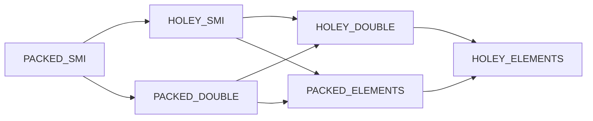

`enum ElementsKind : uint8_t` は Map の `bit_field2` に 6 ビットで格納されます。

## fast 系六種の一覧

| 値 | 名前 | バッキング | 格納できる値 | 用途 |
| --- | --- | --- | --- | --- |
| 0 | `PACKED_SMI_ELEMENTS` | `FixedArray` | Smi のみ、穴なし | 整数配列の最速形 |
| 1 | `HOLEY_SMI_ELEMENTS` | `FixedArray` | Smi または `the_hole` | 整数配列だが穴あり |
| 2 | `PACKED_ELEMENTS` | `FixedArray` | 任意 `JSAny`、穴なし | 一般配列の標準形 |
| 3 | `HOLEY_ELEMENTS` | `FixedArray` | 任意 `JSAny` または `the_hole` | 終端 (`TERMINAL_FAST_ELEMENTS_KIND`) |
| 4 | `PACKED_DOUBLE_ELEMENTS` | `FixedDoubleArray` | 数値のみ、穴なし | double 配列の最速形 |
| 5 | `HOLEY_DOUBLE_ELEMENTS` | `FixedDoubleArray` | 数値または `kHoleNanInt64` | double 配列だが穴あり |

この並びには二つの設計意図があります。一つは packed と holey を隣接させて `packed → holey` が `+1` (`kFastElementsKindPackedToHoley`) で表せる点、もう一つは奇数なら holey、偶数なら packed という対応で `IsHoleyElementsKind` が `kind % 2 == 1` で済む点です。fast 系の他にも `DICTIONARY_ELEMENTS` のような slow 系があり、これは `NumberDictionary` ハッシュテーブルをバッキングにする経路で、配列が sparse になる、巨大すぎる、`Object.defineProperty` で記述子付きの要素を入れる、といった理由で fast から落とされたときに使われます。

## 遷移格子

ElementsKind は一方向にしか動けません。

double と tagged のあいだはバッキングストアの型自体が変わるため別経路 (`GrowCapacityAndConvert`) を通り、それ以外の同じ表現幅での遷移は Map を差し替えるだけで済みます。

## PACKED と HOLEY の差が生む最適化

PACKED と HOLEY の差は「コンパイラがロード時の hole チェックを省略できるか」という一点に集約されます。

| 種別 | ロード時の hole チェック | TurboFan / Maglev での出力 |
| --- | --- | --- |
| PACKED | 不要 (Map レベルで保証) | 分岐なしの直接ロード |
| HOLEY | 必要 | hole 比較と slow path 分岐 |

flat の結果が常に PACKED 系になるのは、後段のコードでこの最適化を享受させたいからです。`CalculateFlattenedLengthFast` は `seenObject` / `seenDouble` / `seenSmi` フラグを観測し、最終結果として `PACKED_ELEMENTS` / `PACKED_DOUBLE_ELEMENTS` / `PACKED_SMI_ELEMENTS` のいずれかを選びます。

## hole の二つの表現

V8 の hole は「そのインデックスに値が一度も書かれていない」状態を表すマーカーです。tagged の世界と double の世界で別物として実装されています。

| 世界 | hole の表現 | 比較方法 |
| --- | --- | --- |
| tagged | `the_hole_value` (`Hole` HeapObject シングルトン、read-only roots) | typeswitch で `TheHole` ケースに分岐 |
| double | `kHoleNanInt64 = 0xFFF7FFFF_FFF7FFFF` (シグナル NaN ビット列) | 64bit のビットパターン完全一致 |

`the_hole_value` はユーザコードから観測できない特別な HeapObject で、`undefined_value` (Undefined 型) とは別シングルトン、map も型も別物です。`LoadElementNoHole<FixedArray>` は typeswitch で `TheHole` ケースを `IfHole` ラベルへ分岐させ、ユーザに返す前に必ず undefined への置換か飛ばすかが選択されます。double 配列でも `LoadElementNoHole<FixedDoubleArray>` が `kHoleNanInt64` を検出して同様に `IfHole` に飛ばします。

flat が hole を飛ばす実装は素直で、`fastOW.LoadElementNoHole(index) otherwise FoundHole` でロードを試み、hole なら `FoundHole` ラベルに飛んで `index++; continue;` で次の要素に進みます。ソースが HOLEY_\* であっても結果配列は穴のない PACKED_\* になるのはこの挙動が効いているためで、仕様の「`HasProperty` で false なら飛ばす」と完全に整合します。

## kEmptyFixedArray シングルトン

`empty_fixed_array` ROOT が `kEmptyFixedArray` の本体で、`src/heap/setup-heap-internal.cc` で 1 回だけ確保されます。

| 性質 | 説明 |
| --- | --- |
| 配置 | read-only space |
| 内容 | map = `fixed_array_map`、length = 0 |
| 共有 | 全 Isolate と全 NativeContext から共通参照 |
| write barrier | 不要 |
| GC | 移動しない |

Torque からは `const kEmptyFixedArray: EmptyFixedArray = EmptyFixedArrayConstant();` で参照できます。flat の `NewFlatVector` では `length > 0 ? AllocateFixedArrayWithHoles(...) : kEmptyFixedArray` の三項演算でこの最適化を組み込み、`TryFastFlat` の早期分岐では `flattenedLength == 0` のとき PACKED_SMI 用 map と `kEmptyFixedArray` を直接組み立てて `NewJSArray` で返してしまいます。

## Protector セル

fast path の前提を支える Isolate-wide のセルが二つあります。

| Protector | 監視対象 | 無効化のトリガ |
| --- | --- | --- |
| `NoElementsProtector` | `Array.prototype` と `Object.prototype` に index 付き property が追加されていないこと | `Array.prototype[42] = 'x'` 等の代入 |
| `ArraySpeciesProtector` | `Array[Symbol.species]` と `Array.prototype.constructor` が改変されていないこと | species や constructor の再定義 |

protector は一度 `Invalidate` されると `kProtectorInvalid = 0` になり、その Isolate では二度と元に戻りません。`FastJSArrayForReadWitness.Recheck()` が毎ループ `IsNoElementsProtectorCellInvalid()` を確認し、無効化された瞬間に bailout します。`FastJSArrayForCopy` 型はキャスト条件に ArraySpeciesProtector の intact を含むため、species がいじられた瞬間に CastError が発生し fast path 全体が bailout します。
