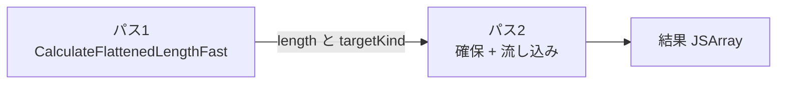

`TryFastFlat` は二つのパスから成ります。



## 一パスと二パスのコスト比較

一パス案として `GrowableFixedArray` で要素を訪問ごとに `Push` する設計と、現行の二パス案を比較すると差は明確です。

| 観点 | 一パス案 | 二パス案 (現行) |
| --- | --- | --- |
| 走査回数 | 1 回 | 2 回 |
| 確保回数 | 増分成長で `O(log_{1.5} n)` 回 | 1 回 |
| 書き込み総コスト | `O(n log_{1.5} n)` のメモリトラフィック | 各セル 1 回ずつ |
| 末尾の縮小コピー | 必要 | 不要 |
| ElementsKind 確定 | 走査後 | 一回目で確定 |
| `PACKED_DOUBLE` 構築 | tagged Number 経由の追加変換パスが必要 | 直接 float64 書き込み |

`FixedDoubleArray` のビット表現は `float64_or_undefined_or_hole` で tagged ポインタと互換性がないため、growable で tagged Object を集めてから後変換するなら追加パスが避けられません。事前に長さと kind を決めてしまえば、二回目で `AllocateFixedDoubleArrayWithHoles(SmiUntag(flattenedLength))` を呼んで `doubleElements.values[targetIndex] = Convert<float64_or_undefined_or_hole>(UnsafeCast<Number>(element))` の一行で済み、boxing も unboxing も消えます。

## 再帰の反復化

仕様の `FlattenIntoArray` は自分自身を再帰呼び出ししますが、`TryFastFlat` は明示スタックで反復化しています。配列を見つけたら `(currentArray, nextIndex, currentDepth)` の三タプルを `Push` し、内部状態を子配列に書き換えて内側ループを抜けて再走査、子の走査が終わったら 3 ポップして親に戻る、という形です。

| 方式 | スタックの実体 | 1 段あたりサイズ | 1024 段消費 |
| --- | --- | --- | --- |
| 仕様準拠の再帰 | JS / C++ ネイティブスタック | フレーム数百バイト | 数百 KB〜MB、ガードページに達する可能性 |
| 明示スタック (現行) | ヒープ上の `GrowableFixedArray` | Object ポインタ 1 個 (3 値 = 3 ポインタ) | 24 KB (64bit) |

ヒープ上に置けば上限を `kMaxFlatFastStackEntries = 3072` で固定でき、超えても `goto Bailout` で slow path に逃がすだけで済みます。

## kMaxFlatFastStackEntries = 3072

ソースコメントに「Fast path safety valve: avoid unbounded explicit stack growth on cyclic nesting by bailing out to the slow path after a fixed depth. 3 entries per depth: array, index, depth (depth limit = 1024)」と書かれています。

| パラメータ | 値 |
| --- | --- |
| 1 段あたりエントリ数 | 3 (array、index、depth) |
| 深さ上限 | 1024 |
| 合計エントリ上限 | 3072 |

サイクル `a.push(a)` のような自己参照配列でも、fast path はバイアウトせず探索を続けます。`a.flat(Infinity)` は `depthSmi = kSmiMax` に切り上げられるため、`stack.length >= kMaxFlatFastStackEntries` のチェックが深さ 1024 で必ず先に発火します。バイアウト後は slow path に切り替わり、`FlattenIntoArraySlow` の再帰がスタックを食い始めます。やがて `FlattenIntoArrayWithoutMapFn` 冒頭の `PerformStackCheck` が `address_of_jslimit` と現在の `sp` を比較し、限界で `Runtime::kStackGuard` を呼んで `RangeError("Maximum call stack size exceeded")` を投げます。

## PerformStackCheck が二箇所にある理由

`PerformStackCheck` は二箇所に挿入されていて、それぞれ独立した経路をカバーします。

| 挿入箇所 | 目的 |
| --- | --- |
| `CalculateFlattenedLengthFast` の冒頭 | 明示スタック 24 KB と GC アロケーションのスタック余裕を事前確認 |
| `FlattenIntoArrayWithoutMapFn` builtin の冒頭 | スタブリンケージなので JS 関数境界の自動 stack guard が通らない経路の唯一のチェックポイント |

ソースには「This builtin might get called recursively, check stack for overflow manually as it has stub linkage」というコメントが残っています。`FlattenIntoArrayWithMapFn` 側に明示の `PerformStackCheck` がないのは、`flatMap` が depth = 1 固定で再帰しないからです。

## PerformStackCheck の中身

`src/codegen/code-stub-assembler.cc` の実装は次のような形です。

```cpp
void CodeStubAssembler::PerformStackCheck(TNode<Context> context) {
  Label ok(this), stack_check_interrupt(this, Label::kDeferred);
  TNode<UintPtrT> stack_limit = UncheckedCast<UintPtrT>(
      Load(MachineType::Pointer(),
           ExternalConstant(ExternalReference::address_of_jslimit(isolate()))));
  TNode<BoolT> sp_within_limit = StackPointerGreaterThan(stack_limit);
  Branch(sp_within_limit, &ok, &stack_check_interrupt);
  BIND(&stack_check_interrupt);
  CallRuntime(Runtime::kStackGuard, context);
  Goto(&ok);
  BIND(&ok);
}
```

JS スタックリミットは Isolate ごとに `isolate->stack_guard()->jslimit()` で保持され、外部参照経由でロードします。`StackPointerGreaterThan(stack_limit)` が真なら通常パス、偽なら deferred ブロックで `Runtime::kStackGuard` を呼びます。deferred ラベルなので機械コード上は条件分岐と通常パスがフォールスルーで一直線に並びます。
