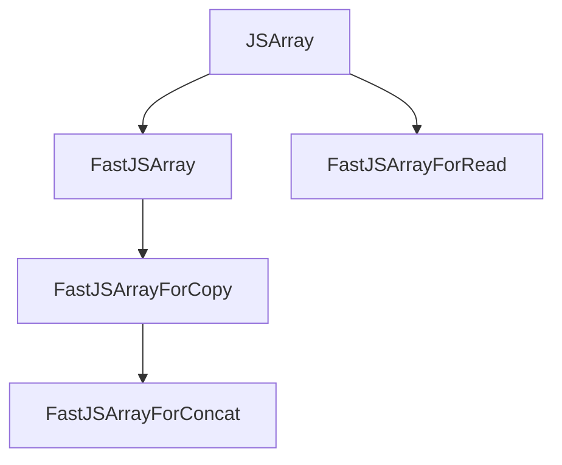

## 透過型の階層

fast 配列を表す transient 型は `src/objects/js-array.tq` で四種類が宣言されています。



実際の判定ロジックは `src/builtins/cast.tq` に集約されていて、それぞれ要求する条件が違います。

| 型 | JSArray | fast ElementsKind | initial prototype | NoElements | ArraySpecies | ConcatSpreadable |
| --- | --- | --- | --- | --- | --- | --- |
| `FastJSArray` | 必須 | fast 系のみ | 必須 | intact | - | - |
| `FastJSArrayForRead` | 必須 | nonextensible まで | 必須 | intact | - | - |
| `FastJSArrayForCopy` | 必須 | fast 系のみ | 必須 | intact | intact | - |
| `FastJSArrayForConcat` | 必須 | fast 系のみ | 必須 | intact | intact | intact |

`ForRead` だけ ElementsKind の範囲を `LAST_ANY_NONEXTENSIBLE_ELEMENTS_KIND` まで広げており、frozen array や sealed array まで含む点に違いがあります。`FastJSArray` はさらに `IsForceSlowPath()` の検査もあって、`--force-slow-path` フラグでデバッグ時に強制的に slow path を取らせるバルブが入っています。

## flat が使う型の使い分け

`TryFastFlat` ではレシーバと子配列で違う型を使います。

| 対象 | 使う Cast | 理由 |
| --- | --- | --- |
| レシーバ | `Cast<FastJSArrayForCopy>` | flat の戻り値が `Array` インスタンスである保証のため ArraySpeciesProtector が必要 |
| 子配列 (再帰下降中) | `Cast<FastJSArrayForRead>` | 値を取り出すだけで新規 array を作らないので species は不要、frozen でも読めれば足りる |

## Witness パターン

transitioning な呼び出しを越えても fast path の前提条件を維持する仕組みが Witness です。`FastJSArrayWitness` と `FastJSArrayForReadWitness` の二種類があります。

`FastJSArrayWitness` のフィールド構成は次のとおりです。

| フィールド | 役割 | 可変性 |
| --- | --- | --- |
| `stable: JSArray` | 非 transient なハンドル。いつでも読める | const |
| `unstable: FastJSArray` | transient 型。transitioning 呼び出しの直後に型が消える | 可変 |
| `map: Map` | 作成時点の map のスナップショット | const |
| `hasDoubles: bool` | バッキングが FixedDoubleArray か | const |
| `hasSmis: bool` | 要素が Smi 専用か | const |
| `arrayIsPushable: bool` | push 可能かのキャッシュ | 可変 |

## Recheck の実装

`Recheck()` は二つの条件を検査するだけです。

```
macro Recheck(): void labels CastError {
  if (this.stable.map != this.map) goto CastError;
  if (IsNoElementsProtectorCellInvalid()) goto CastError;
  this.unstable = %RawDownCast<FastJSArray>(this.stable);
}
```

| 検査項目 | 担保するもの |
| --- | --- |
| map 不変性 | ElementsKind、fast 性、initial prototype、hole 挙動の継続 |
| `NoElementsProtector` の intact 性 | prototype chain に index 付き property が混ざらないこと |

長さの直接チェックはここでは行わず、`if (index >= fastOW.Get().length) goto Bailout;` のように呼び出し側に書きます。Recheck が length を再検証しないため、`FlattenIntoArrayFast` でも `Recheck` の直後に長さ比較を別途置く形になっています。

## 二種類の Witness の使い分け

| 種類 | 提供する操作 | flat での主な使用箇所 |
| --- | --- | --- |
| `FastJSArrayWitness` | `LoadElementNoHole` + `Push` + `ChangeLength` | flat では未使用 |
| `FastJSArrayForReadWitness` | `LoadElementNoHole` のみ | hot loop の要素読み出しすべて |

flat の hot loop は読み出ししかしないため、書き込み能力のない `ForReadWitness` で十分です。再帰的にサブ配列を読みに行く際に複数の witness を併用でき、frozen / sealed elements も含めて読めるため、必要な能力にちょうど合います。
