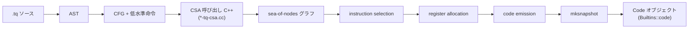

Torque は V8 が自分の builtin を書くために作った DSL です。ソースは `src/torque/` 配下の C++ で実装され、ビルド時の独立した実行可能ファイルとして動き、`.tq` ファイルを CSA を呼び出す C++ コードへ変換します。

## パイプライン全体

## Torque の修飾子

array-flat.tq 冒頭の `transitioning macro ArrayIsArray_Inline(implicit context: Context)(element: JSAny): Boolean` を例にして、修飾子の意味を整理します。

| 修飾子 | 意味 | array-flat.tq での例 |
| --- | --- | --- |
| `macro` | インライン展開される関数。ABI 境界を越える呼び出しは発生しない | `ArrayIsArray_Inline`、`NewFlatVector` |
| `builtin` | 単一コードオブジェクトに集約。スタブリンケージで呼ばれる | `FlattenIntoArrayWithoutMapFn` |
| `javascript builtin` | JS 呼び出し規約 (this、arguments、target、newTarget) で呼ばれる | `ArrayPrototypeFlat`、`ArrayPrototypeFlatMap` |
| `transitioning` | 任意の JS を実行しうることをコンパイラに伝える。transient type の安全性の根幹 | array-flat の全トップレベル |
| `implicit context: Context` | Scala 風の暗黙パラメタ。呼び出し側スコープに同名値があれば自動で渡る | macro 群すべて |
| `js-implicit context: NativeContext` | native context、レシーバ、ターゲット、newTarget 専用の暗黙パラメタ | JS builtin のみ |
| `labels Bailout` | 非局所ジャンプの宣言。呼び出し側の `otherwise Bailout` で受ける | `CalculateFlattenedLengthFast`、`TryFastFlat` |

`transitioning` の効果は重要です。`Call(callback)`、`runtime::*`、ユーザ定義 getter を踏むあらゆる操作が transitioning に該当し、Torque の型システムは transient type の値 (`FastJSArray`、`FastJSArrayForRead` 等) を transitioning な呼び出しをまたいで使うことをコンパイル時に禁じます。array-flat のすべてのトップレベルが `transitioning` 修飾されているのは、mapper コールバック、getter、proxy trap、`runtime::ArrayIsArray` などが連鎖する可能性をすべてコンパイラに認識させるためです。

## Torque から CSA への変換

`src/torque/torque-compiler.cc` の `CompileCurrentAst` が変換のエントリです。

| ステージ | 担当 | 出力 |
| --- | --- | --- |
| 宣言の事前登録 | `PredeclarationVisitor::Predeclare` / `ResolvePredeclarations` | シンボルテーブル |
| 宣言の解釈 | `DeclarationVisitor::Visit` | 型情報 |
| 型の最終化 | `TypeOracle::FinalizeAggregateTypes` | 確定型 |
| 実装の AST → CFG | `ImplementationVisitor::VisitAllDeclarables` | CFG + `instructions.h` の命令列 |
| CSA C++ の生成 | `CSAGenerator::EmitGraph` | `*-tq-csa.cc` (例えば `array-flat-tq-csa.cc`) |

CFG のブロックには Branch、Goto、CallCsaMacro、CallBuiltin、Return、LoadReference、StoreReference、UnsafeCast などの低水準命令が並びます。

## CSA から sea-of-nodes、機械語へ

CSA は `src/codegen/code-stub-assembler.h` の `CodeStubAssembler` クラスで、`compiler::CodeAssembler` を継承しています。`mksnapshot` 実行時に、生成された C++ 関数が `CodeAssemblerState` を介して `RawMachineAssembler` にノードを追加し、`JSGraph` に集約されます。

| Torque 命令 | sea-of-nodes での対応 |
| --- | --- |
| Branch | IfTrue / IfFalse ノードと制御エッジ |
| Goto | Merge / Phi の組み合わせ |
| Call | Call ノードと effect / control エッジ |
| Load | Load ノードと memory effect エッジ |

そのあとは `CodeAssemblerCompilationJob` がバックエンドを駆動します。instruction selection は `src/compiler/backend/<arch>/instruction-selector-<arch>.cc` でアーキテクチャ依存、register allocation は `src/compiler/backend/register-allocator.cc`、code emission がバイト列を吐いて `mksnapshot` がスナップショットに焼く流れです。起動時にはこれが復元され、`Builtins::code(Builtin::kArrayPrototypeFlat)` で取り出せる Code オブジェクトとして JS から呼べる状態になります。

## TrySmiAdd の機械化

宣言は `extern macro TrySmiAdd(Smi, Smi): Smi labels Overflow;` で、実体は `src/codegen/code-stub-assembler.cc` にあります。プラットフォームによって機械表現が違うため、生成コードも分岐します。

| プラットフォーム | Smi 表現 | 内部演算 |
| --- | --- | --- |
| 64bit + `SmiValuesAre32Bits()` | 上位 32bit に整数値 | `IntPtrAddWithOverflow` (タグを剥がさず加算、OF フラグで判定) |
| 32bit、または 64bit で Smi が 31bit | タグ抜き 31bit | `Int32AddWithOverflow` (一旦 int32 にトランケート、結果を tagged に戻す) |

`Int32AddWithOverflow` は machine operator で、x64 で言えば `addl` 命令の OF フラグを Boolean として project する仕組みです。array-flat.tq の `math::TrySmiAdd(targetLength, subLen) otherwise goto Bailout` の形は、Smi 範囲を超えそうな加算を即 bailout で slow path に任せる構成で、fast path は Smi 演算と branch だけで構成され boxing も Number への upgrade も発生しません。

## ArraySpeciesCreate の fast path

宣言は `extern macro ArraySpeciesCreate(Context, JSAny, Number): JSReceiver;` で、最終的に runtime call `Runtime_ArraySpeciesConstructor` が `Object::ArraySpeciesConstructor` を呼ぶ形になります。

| `o` の状態 | 動作 |
| --- | --- |
| JSArray + initial array prototype + `IsArraySpeciesLookupChainIntact` 真 | `isolate->array_function()` を返す (fast path) |
| 上記を満たさない | `o.constructor[@@species]` を辿って non-undefined ならそれを使う |
