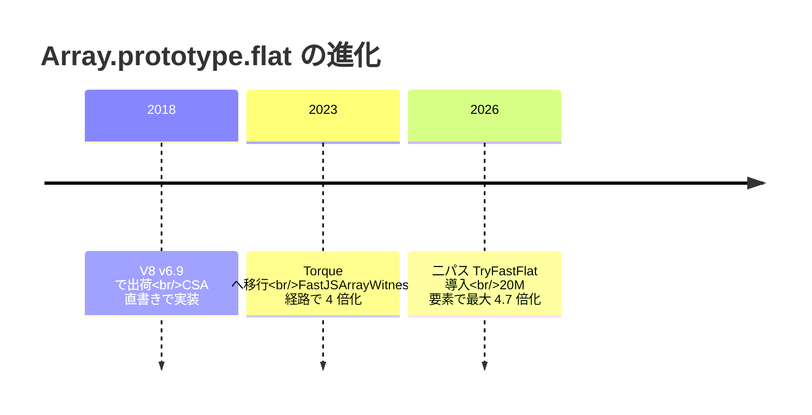

`Array.prototype.flat` の実装には設計上意味のある三つの転換点があります。

## 三段階のタイムライン

| 時期 | 主要変更 | 効果 |
| --- | --- | --- |
| 2018 | CSA (`ArrayFlattenAssembler`) で初出荷 | flat / flatMap が利用可能になる |
| 2023 | Torque 移行 + Witness 経路導入 | マイクロベンチで 4 倍 |
| 2023 (後続) | 反復中の長さ変動に対する fix を段階的に適用 | OOB 読み出しの解消 |
| 2026 | 二パス高速路 + ElementsKind 一致確定 | 20M 要素で 3 倍〜16 倍 |
| 2026 (後続) | HOLEY_DOUBLE + undefined クラッシュ修正 | ClusterFuzz 三件の解消 |

## CSA から Torque への移行

最初の大きな変化は、`src/builtins/builtins-array-gen.cc` の `ArrayFlattenAssembler` という CSA 直書きの C++ 実装から `src/builtins/array-flat.tq` への移行です。同時に `FastJSArrayWitness` を使った fast path が導入され、マイクロベンチマーク上で 4 倍の改善が報告されました。

最初の Torque 実装には、反復中に source 配列の長さが変わるケースで境界外読み出しを起こすバグがありました。

| シナリオ | 原因 |
| --- | --- |
| getter で配列を縮める | `fastSource.length` をループ条件にしていたため OOB |
| mapper の副作用で配列を伸ばす | 長さ更新が捕捉されず OOB |
| depth 引数評価中に長さが変わる | DCHECK の不変条件が破れる |

fix は段階的に行われ、最終形では `fastSource.length` を直接ループ条件にせず、`fastOW.Get().length` の都度比較に変わりました。`Recheck` がレシーバの map と protector の状態しか見ない設計と組み合わさって、現在の bailout 構造が固まっています。

## 二パス高速路の導入

次の大きな変化は、`TryFastFlat` と `CalculateFlattenedLengthFast` による二パス高速路の追加です。Torque 化された仕様準拠経路はそのままに、その手前に「最終長と target ElementsKind を一回目で確定し、二回目で一度だけ確保して値を流し込む」という別経路が挟まる形になりました。

設計上の前提は次の五つで、これが揃ったときに fast path が成立します。

| 前提 | 役割 |
| --- | --- |
| スタックベースの反復走査 | 任意深さに対応 |
| `NoElementsProtector` 有効 | prototype chain の getter 不在を保証 |
| `ArraySpeciesProtector` 有効 | 結果配列の constructor 探索を省略 |
| 要素が proxy / accessor / 独自要素を含まない | 副作用なしで読める |
| ネストした配列も `FastJSArray` | 再帰下降を fast に保つ |

20M 要素規模のベンチマークでは次の数字が出ています。

| ElementsKind | 旧実装 (Torque + slow path) | 新実装 (TryFastFlat) | 改善倍率 |
| --- | --- | --- | --- |
| SMI | 181.06 ms | 39.32 ms | 4.6 倍 |
| DOUBLE | 224.80 ms | 48.21 ms | 4.7 倍 |
| OBJECT (文字列) | 190.80 ms | 79.56 ms | 2.4 倍 |

## HOLEY_DOUBLE + undefined クラッシュ修正

この高速路にはひとつ落とし穴がありました。`V8_ENABLE_UNDEFINED_DOUBLE` 機能が有効なビルドでは、`HOLEY_DOUBLE_ELEMENTS` の `FixedDoubleArray` に `undefined` ビットパターンを直接格納できます。当初の `CalculateFlattenedLengthFast` は holey も含めて早期 return を行っていたため、`undefined` を含む holey double が PACKED_DOUBLE 第二パスの `UnsafeCast<Number>` に流れ込み、ClusterFuzz が三件のクラッシュを検出しました。

修正は短く、早期 return を真に packed な要素種別 (PACKED_SMI と PACKED_DOUBLE) だけに限定するというものです。ホット経路の単純さを保ちつつ、新しい undefined-in-double セマンティクスとの衝突を回避しました。
